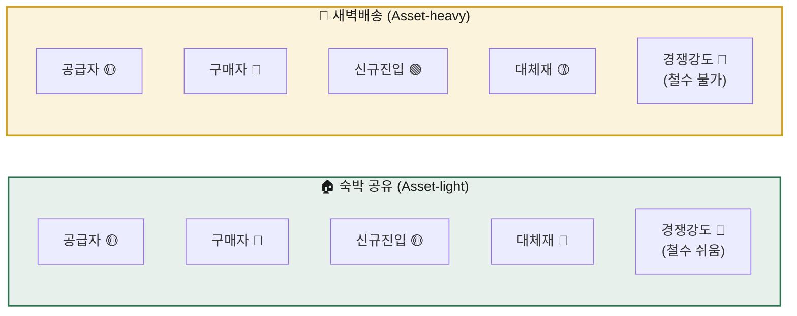
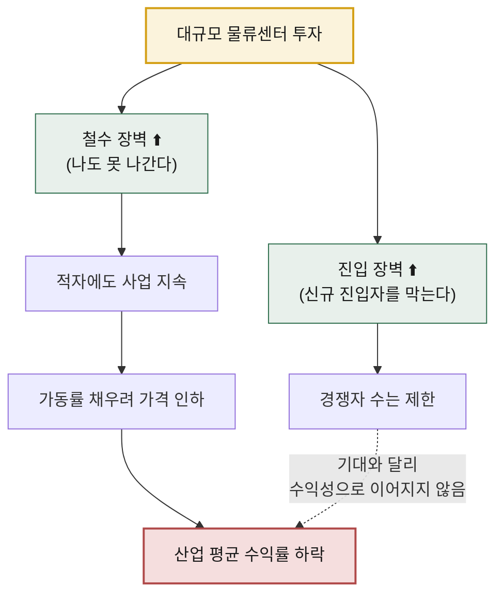

# 비교 분석 — 숙박 공유 플랫폼 vs 신선식품 새벽배송

> **분석 ①** [숙박 공유 플랫폼](./analysis-01-accommodation-sharing.md) · **분석 ②** [신선식품 새벽배송 이커머스](./analysis-02-dawn-delivery-ecommerce.md)
> **방법론** [Porter's Five Forces](./methodology.md)

---

## 왜 이 두 산업을 비교하는가

둘 다 **모바일 앱으로 주문받는 서비스**지만, 자산 구조가 정반대입니다.

| | 숙박 공유 플랫폼 | 신선식품 새벽배송 |
|---|---|---|
| 자산 구조 | **Asset-light** — 재고를 소유하지 않음 | **Asset-heavy** — 재고와 물류를 모두 소유 |
| 역할 | **중개자** (호스트 ↔ 게스트) | **판매자** (직매입 → 판매) |
| 매출 인식 | 거래액의 **수수료만** | **거래액 전체** |
| 원가의 성격 | 대부분 **변동비** | 대부분 **고정비** |
| 재고 리스크 | 없음 (안 팔려도 손실 없음) | 치명적 (**시간이 지나면 썩음**) |

이 하나의 차이가 다섯 가지 힘 전체를 어떻게 뒤바꾸는지 보는 것이 이 비교의 목적입니다.

---

## 1. 다섯 가지 힘 — 나란히 보기

| 힘 | 숙박 공유 | 새벽배송 | 무엇이 갈랐나 |
|---|:--:|:--:|---|
| **공급자 교섭력** | 🟡 Medium | 🟡 Medium | 둘 다 공급자는 파편화. 단 새벽배송은 **날씨·인건비**라는 협상 불가능한 공급자를 안음 |
| **구매자 교섭력** | 🔴 High | 🔴 High | 둘 다 전환비용 0. 단 새벽배송은 **고빈도 구매**라 습관 락인의 여지가 있음 |
| **신규 진입자 위협** | 🟡 Medium | 🟢 **Low** | 네트워크 효과(무형) vs CAPEX·배송밀도(유형) — **장벽의 재질이 다름** |
| **대체재 위협** | 🔴 **High** | 🟡 Medium | 숙박은 호텔·OTA·화상회의까지 광범위. 식품은 **아예 안 먹을 수는 없음** |
| **기존 경쟁 강도** | 🔴 High | 🔴 **High** | 둘 다 치열하나 **철수 장벽**이 정반대 — 여기가 핵심 |

---

## 2. 핵심 발견 — 진입 장벽의 역설

이번 비교에서 가장 중요한 통찰입니다.

> **표면적 판단** — 새벽배송이 진입 장벽(🟢 Low 위협)이 훨씬 높으니 더 좋은 산업이다.
> **실제** — 그 장벽을 세운 자산이 곧 **철수를 막는 족쇄**가 되어, 산업 전체를 만성 출혈로 몰아넣는다.

### 장벽의 재질을 구분하라

| 장벽의 원천 | 사례 | 특징 | 평가 |
|---|---|---|:--:|
| **네트워크 효과** (무형) | 숙박 공유 | 자본이 아니라 **시간**으로 쌓임. 철수 비용이 없음 | ✅ 좋은 장벽 |
| **대규모 CAPEX** (유형) | 새벽배송 | 자본으로 살 수 있음. 그러나 **되팔 수 없음** | ⚠️ 양날의 검 |

**"진입 장벽이 높다 = 좋은 산업"이 아닙니다.** 장벽이 *무엇으로 만들어졌는지* 를 함께 물어야 합니다.

---

## 3. 같은 🔴 High도 성질이 다르다

두 산업 모두 **구매자 교섭력**과 **경쟁 강도**가 🔴 High로 나왔지만, 내용은 다릅니다.

### 구매자 교섭력 — 구매 빈도가 만드는 차이

| | 숙박 공유 | 새벽배송 |
|---|---|---|
| 구매 빈도 | 연 2~3회 (**저빈도**) | 주 1~2회 (**고빈도**) |
| 습관 형성 | 어려움 — 매번 처음부터 비교 | 가능 — 반복이 관성을 만듦 |
| 락인 전략 | 리뷰·등급 등 **이력 자산** | 멤버십·신선도 신뢰 |
| 구조적 함의 | **CAC를 계속 지불**해야 함 | 한 번 잡으면 **LTV가 길다** |

> 💡 저빈도 구매 산업에서는 고객을 잡아도 다음 구매 때 다시 잃습니다. 숙박 공유가 인접 카테고리(체험·교통)로 확장하려는 이유는 매출 증대보다 **접점 빈도를 늘려 저빈도의 저주를 푸는 것**에 가깝습니다.

### 경쟁 강도 — 철수 장벽이 만드는 차이

| | 숙박 공유 | 새벽배송 |
|---|---|---|
| 고정비 | 낮음 | 매우 높음 |
| 철수 장벽 | **낮음** | **매우 높음** |
| 부진 사업자의 행동 | 빠르게 철수 | 적자에도 잔류 |
| 결과 | 과열이 **자정(自淨)** 됨 | **좀비 경쟁**이 가격을 계속 누름 |

**같은 🔴이지만 새벽배송 쪽이 구조적으로 더 나쁩니다.** 힘의 강도만 표기하고 끝내면 이 차이를 놓칩니다.

---

## 4. 수익 구조 비교

| 항목 | 숙박 공유 | 새벽배송 |
|---|---|---|
| 매출 | 거래액 × 수수료율 | 거래액 전체 |
| 매출 규모 | 작게 보임 | 크게 보임 |
| **마진율** | **높음** | **낮음** |
| 손익분기 도달 조건 | 거래량 증가 | **권역별 배송 밀도** 확보 |
| 성장 시 비용 | 거의 비례하지 않음 → **영업 레버리지 큼** | 신규 권역마다 **계단식 투자** |
| 침체기 대응 | 비용 즉시 축소 가능 | 고정비가 그대로 남아 **손실 확대** |

> ⚠️ **매출 규모로 두 사업을 비교하면 안 됩니다.** 중개 모델은 수수료만 매출로 잡히고 직매입 모델은 거래액 전체가 매출로 잡히므로, 같은 거래 규모라도 장부상 매출은 수십 배 차이가 납니다. **거래액(GMV) 기준으로 맞춰서 봐야** 합니다.

---

## 5. 전략 방향 — 왜 정반대인가

| | 숙박 공유 | 새벽배송 |
|---|---|---|
| **1순위 전략** | 차별화 | **저비용(원가 우위)** |
| **2순위 전략** | 집중화 (니치 네트워크) | 집중화 (권역·카테고리) |
| **부적합 전략** | 저비용 — 수수료 인하는 자해 | 차별화 — 브랜드 상품은 어디서 사도 같음 |
| **승부처** | 공급 측 **독점 매물** 확보 | **배송 밀도**와 폐기율 관리 |
| **핵심 지표** | Take rate, 재예약률, 멀티호밍 비율 | 권역별 단위 배송원가, 폐기율, 멤버십 이탈률 |

### 왜 이렇게 갈리는가

- 숙박 공유는 **원가가 없는 사업**입니다. 원가 우위를 추구할 대상 자체가 없으므로, 수수료를 깎는 것은 자기 이익을 직접 없애는 행위입니다. → **차별화만이 답**
- 새벽배송은 **원가가 전부인 사업**입니다. 상품이 동일한 이상 차별화 여지가 좁고, 단위 원가를 낮춘 쪽이 가격과 마진을 동시에 가져갑니다. → **원가 우위만이 답**

---

## 6. 종합 결론

| 관점 | 숙박 공유 | 새벽배송 |
|---|---|---|
| **5-force 구조적 매력도** | 중하(中下) | 중(中) |
| **실제 수익의 질** | **높음** (고마진·고자본효율) | 낮음 (저마진·고자본소모) |
| **리스크의 성격** | 해자가 **하나뿐**(네트워크 효과)이라 무너지면 급격 | 흑자 전환 전까지 **버티는 비용**이 극단적 |
| **승자 독식 정도** | 강함 (니치는 공존 가능) | 매우 강함 (밀도 확보한 소수만 생존) |
| **한 줄 요약** | 구조는 불리하나 **남는 장사** | 방벽은 높으나 **안에서 피 흘리는 싸움** |

### 이번 분석에서 얻은 판단 원칙

1. **다섯 힘의 강도만 세지 말 것** — 🔴가 몇 개인지보다, 각 힘이 *어떤 메커니즘* 으로 작동하는지가 중요합니다.
2. **진입 장벽과 철수 장벽은 세트로 볼 것** — 같은 자산이 양쪽에 동시에 작용합니다.
3. **구매 빈도를 반드시 확인할 것** — 전환 비용이 0이어도, 고빈도면 습관이 전환 비용을 만들어냅니다.
4. **자산 구조가 전략을 결정한다** — Asset-light는 차별화로, Asset-heavy는 원가 우위로 갈 수밖에 없습니다.
5. **6번째 힘(규제)을 병기할 것** — 두 산업 모두 규제가 시장 크기와 원가 구조를 직접 좌우합니다.

---

## 📎 다음 단계 제안

이 비교를 더 밀고 나가려면:

- [ ] **02 가치 사슬 분석** — 두 산업의 마진이 실제로 어느 활동에서 발생하는지 분해
- [ ] **03 KSFs 분석** — 각 산업에서 "반드시 잘해야 하는 것" 목록 도출 후 대조
- [ ] 검증 항목(각 분석서 하단) 실데이터로 채우기 — 현재는 **구조 분석**이며 수치는 미검증
