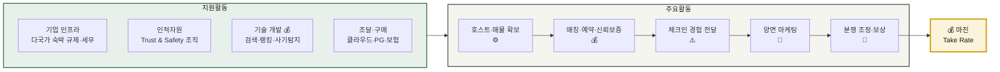
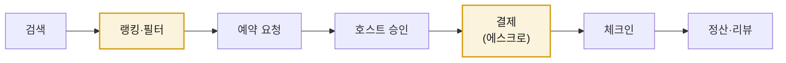
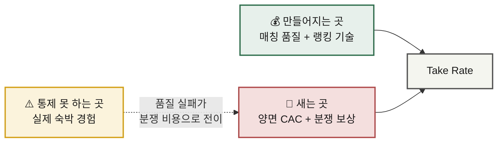

# 가치사슬 분석 ① — 숙박 공유 플랫폼

> **적용 방법론** · [가치사슬 분석 방법론](./methodology.md)
> **선행 분석** · [Five Forces — 숙박 공유 플랫폼](../01-porters-five-forces/analysis-01-accommodation-sharing.md)
> **비교 대상** · [분석 ② 신선식품 새벽배송](./analysis-02-dawn-delivery-ecommerce.md) · [종합 비교](./comparison.md)

---

## 0. 분석 대상 정의

| 항목 | 내용 |
|---|---|
| **대상** | 공간을 소유하지 않고 호스트와 게스트를 연결해 수수료를 얻는 **양면 플랫폼** |
| **가치사슬의 특이점** | 물리적 재고·물류가 없음. **"공급자를 모으는 것"이 곧 조달**이고, **"매칭시키는 것"이 곧 생산** |
| **Five Forces 연계** | 구조적 약점 = **공급자 멀티호밍**(호스트를 묶어둘 수 없음) + **저빈도 구매**(고객을 계속 다시 사와야 함) |

### 가치사슬 전체 구조

---

## 1. 주요활동 분석

### 1-1. 투입·조달 물류 — **호스트·매물 확보** ⚙️

> 이 산업에서 Inbound는 *물건을 사오는 것* 이 아니라 **공급자를 설득해 등록시키는 것** 입니다. 그래서 마케팅 활동과 경계가 흐릿합니다.

| 구분 | 내용 |
|---|---|
| **핵심 투입자원** | 매물 리스팅(사진·설명·편의시설), **캘린더 가용성 데이터**, 가격 정보, 호스트 신원 |
| **조달 경로** | 개인 호스트 직접 등록 / 위탁운영사·채널매니저(PMS) 연동 / 부동산 사업자 제휴 |
| **비용 구조** | 재고 매입비 **0원**. 대신 호스트 획득 비용(리퍼럴·수수료 면제 프로모션)이 발생 |

**설계 🏗️**
- 어떤 매물을 받고 어떤 매물을 거를 것인가 — **큐레이션 기준이 곧 브랜드**
- 호스트가 우리 플랫폼에 등록할 유인은 무엇인가 → 결국 **수요(예약 가능성)** 하나뿐
- 자체 등록 vs 채널매니저 연동 — 후자는 물량이 빠르게 늘지만 **멀티호밍을 구조적으로 조장**

**개선 🚀**
- **가용성 데이터 정확도** — 캘린더 미동기화는 곧 오버부킹 → 취소 → 신뢰 손실. Inbound 품질이 그대로 서비스 비용으로 전이됨
- 리스팅 품질 표준화 — 사진 자동 보정·설명 자동 생성으로 **호스트의 등록 노력을 낮춰** 전환율 향상
- **멀티호밍 억제** — 독점 계약, 플랫폼 전용 툴(스마트락·청소 연동)로 이탈 비용을 인위적으로 생성

> 📌 **Five Forces 연결** — 5F에서 확인한 최대 약점(공급자 멀티호밍)의 해법이 바로 이 활동에 있습니다. 조달 단계에서 호스트를 묶지 못하면 뒤의 어떤 활동으로도 만회할 수 없습니다.

---

### 1-2. 운영·생산 — **매칭·예약·신뢰 보증** 💰

> **이 산업의 가치가 실제로 만들어지는 유일한 활동**입니다. 검색 결과 하나를 잘 뽑아내는 것이 곧 상품입니다.

**핵심 처리 흐름**

| 처리 단계 | 핵심 과제 |
|---|---|
| 검색·랭킹 | 어떤 매물을 위에 노출할 것인가 — **랭킹 알고리즘이 사실상 상품 그 자체** |
| 가격 | 동적 가격 추천으로 호스트 수익과 예약률을 동시 최적화 |
| 예약·승인 | 즉시예약 비중을 높일수록 전환율 상승, 대신 호스트 통제권은 감소 |
| **결제 에스크로** | 체크인 전까지 대금을 보관 → **양쪽 모두의 사기 리스크를 플랫폼이 흡수** |
| 신뢰 인프라 | 신원확인, 리뷰, 보증금, 호스트 보험, 사기 리스팅 탐지 |

**설계 🏗️**
- 검색→예약 전환율을 좌우하는 요소를 무엇으로 정의할 것인가
- 자동 승인과 호스트 재량의 경계는 어디인가
- 신뢰를 **사전 검증**(신원·매물 심사)으로 확보할 것인가, **사후 보증**(보험·환불)으로 확보할 것인가

**개선 🚀**
- 검색 이탈 단계 규명 — 대부분 *가격 확인 시점* 과 *수수료 노출 시점* 에서 이탈
- 예약 취소율·오버부킹률 축소 (Inbound 데이터 품질과 직결)
- 사기 리스팅 **사전 탐지** — 사후 환불보다 사전 차단이 압도적으로 저렴
- 랭킹의 공정성 — 특정 호스트 편중은 공급자 이탈로 직결

---

### 1-3. 산출·배송 물류 — **체크인 경험 전달** ⚠️

> 이 산업 가치사슬의 **가장 큰 구멍**입니다. 물리적 배송은 없지만, **실제 서비스 전달을 제3자(호스트)가 수행**합니다.

| 구분 | 내용 |
|---|---|
| **플랫폼이 전달하는 것** | 예약 확인서, 주소·입실 안내, 호스트 연락 채널, 결제 영수증 |
| **호스트가 전달하는 것** | **실제 숙박 경험** — 청결, 시설 상태, 사진과의 일치 여부, 응대 |
| **원가** | 거의 **0원** — 이 구간에 비용이 들지 않는 것이 asset-light 모델의 본질 |
| **리스크** | 품질을 **통제할 수 없음**. 실패 시 비용이 서비스(1-5) 활동으로 전이됨 |

**설계 🏗️**
- 체크인 실패(호스트 무응답, 주소 오류, 출입 불가)를 어떻게 예방할 것인가
- 앱·메신저·문자의 역할 구분 — 특히 **해외 로밍 환경에서 도달 가능한 채널**
- 숙소 정보의 어느 수준까지를 필수 표기로 강제할 것인가

**개선 🚀**
- 스마트락·셀프체크인 연동으로 **호스트 의존 구간 자체를 축소** — 통제 불가 영역을 통제 가능하게 전환하는 정공법
- 체크인 24시간 전 사전 확인 프로세스로 실패를 미리 탐지
- 사진과 실제의 괴리를 줄이는 검증 장치(최근 촬영 강제, 리뷰 기반 페널티)

> 📌 **핵심 통찰** — 원가가 0인 대신 **품질 통제권도 0**입니다. 이 활동의 리스크는 사라지는 게 아니라 **서비스 활동의 분쟁 처리 비용으로 이동**할 뿐입니다.

---

### 1-4. 마케팅 및 영업 — **양면 동시 마케팅** 💸

| 대상 | 획득 방식 | 난이도 |
|---|---|---|
| **게스트(수요)** | SEO, 메타서치 노출, 검색광고, 앱 리텐션 | 저빈도 구매라 **CAC 회수가 어려움** |
| **호스트(공급)** | 리퍼럴, 수수료 프로모션, 지역 오프라인 영업 | 초기 지역 진입 시 특히 비쌈 |

**설계 🏗️**
- 닭-달걀 문제를 **어느 쪽부터** 풀 것인가 — 통상 공급 먼저, 단 특정 지역에 집중해서
- 편리함 외에 무엇을 파는가 — **신뢰·가격 투명성·독점 매물**
- 유료 채널과 자연 유입(SEO·직접 방문)의 비중 목표

**개선 🚀**
- **유료광고 의존도 축소** — 직접 방문·브랜드 검색 비중이 곧 네트워크 효과의 실측치
- 프로모션 종료 후 잔존율 측정 — 안 남는다면 CAC가 아니라 **보조금**을 쓴 것
- **저빈도의 저주 풀기** — 체험·교통 등 인접 카테고리로 접점 빈도를 올려 재방문 습관 형성
- 리뷰·이력 자산을 이탈 비용으로 전환 (등급, 누적 신뢰도)

---

### 1-5. 서비스 — **분쟁 조정·보상** 💸

> 이 산업의 서비스 활동은 단순 CS가 아니라 **상품의 일부**입니다. "문제 생기면 플랫폼이 해결해준다"는 약속이 곧 중개 수수료의 근거이기 때문입니다.

| 발생 유형 | 처리 성격 |
|---|---|
| 숙소가 사진과 다름 | 대체 숙소 수배 + 차액 보상 → **직접 원가 발생** |
| 호스트 일방 취소 | 게스트 보상 + 호스트 페널티 |
| 시설 파손·분쟁 | 보증금·보험 처리, 양측 주장 판정 |
| 사기 리스팅 | 전액 환불 + 계정 차단 + 법적 대응 |

**설계 🏗️**
- 자동 처리와 전문 상담원의 경계 — 금액·심각도 기준의 에스컬레이션 정책
- 다국어·시차 대응 체계 (여행 산업 특성상 **현지 시간 즉시 대응**이 필수)
- 분쟁 판정의 일관성 — 자의적 판정은 공급자 이탈로 직결

**개선 🚀**
- 반복 민원의 **제품화** — 같은 유형이 반복되면 CS가 아니라 Inbound/Operations를 고쳐야 함
- 문제 호스트의 **사전 탐지** — 리뷰 하락 패턴, 취소율 급증을 조기 신호로 활용
- 처리 시간이 아니라 **실제 해결률**과 재발률로 측정

---

## 2. 지원활동 분석

### 2-1. 기업 인프라 ⚙️

| 항목 | 내용 |
|---|---|
| **설계 🏗️** | 국가·지자체별 숙박업 등록 요건 대응 · 숙박세 원천징수 구조 · 플랫폼 법인과 현지 법인의 책임 경계 · 신규 지역 진출 시 법률 검토 절차 |
| **개선 🚀** | 규제 변화의 조기 감지 체계 · 지역별 규제 대응을 개별 처리가 아닌 **공통 모듈로 표준화** · 호스트 대상 규제 준수 안내 자동화 |

> ⚠️ Five Forces에서 '6번째 힘'으로 지목한 **규제**가 가치사슬에서는 이 활동으로 구현됩니다. 규제 대응 역량이 곧 진입 가능 지역의 범위를 결정합니다.

### 2-2. 인적자원 관리 ⚙️

| 항목 | 내용 |
|---|---|
| **설계 🏗️** | **Trust & Safety 조직**이 이 산업 HR의 핵심 — 사기·분쟁·안전 사고를 다루는 전담 인력 · 다국어 CS 인력 구조(직고용 vs 아웃소싱) · 지역 커뮤니티 매니저 |
| **개선 🚀** | 분쟁 판정 인력의 판단 일관성 확보(가이드라인·교육) · 고강도 민원 업무의 번아웃 관리 · 성과 지표에 성장뿐 아니라 **안전·신뢰 지표** 반영 |

### 2-3. 기술 개발 💰 **— 최대 투자 대상**

| 항목 | 내용 |
|---|---|
| **설계 🏗️** | **검색·랭킹 알고리즘**(= 상품 그 자체) · 동적 가격 추천 · 사기 리스팅 탐지 모델 · 신원확인 · 지도/위치 · 다국어 번역 |
| **개선 🚀** | 랭킹 실험 체계(A/B) 고도화 · 사기 탐지의 오탐(정상 호스트 차단) 관리 · 리뷰 요약·번역에 생성형 AI 적용 시 **허위 정보 검증 체계** 필수 · 채널매니저 API 변경에 따른 파트너 비용 최소화 |

> 💰 이 산업에서 기술 개발은 **비용 절감이 아니라 매출 창출** 활동입니다. 랭킹이 좋아지면 전환율이 오르고, 전환율이 오르면 곧바로 수수료 매출이 늘어납니다.

### 2-4. 조달·구매 ⚙️

| 항목 | 내용 |
|---|---|
| **설계 🏗️** | 클라우드 · 결제 PG(다국가 통화·정산) · 신원확인 벤더 · 호스트 보험사 · 지도 API · 번역 API |
| **개선 🚀** | 결제 수수료율은 규모 확대에 따라 재협상 가능한 대표 항목 · **지도·번역 API 종속성** 관리 · 보험 담보 범위와 보험료의 균형(서비스 활동 원가와 직결) |

---

## 3. 마진 발생 지점 종합

| 활동 | 기여도 | 근거 |
|---|:--:|---|
| 투입·조달 (호스트 확보) | ⚙️ 가치 전달 | 없으면 사업이 성립하지 않으나, 그 자체가 차별화는 아님 |
| **운영 (매칭·신뢰 보증)** | 💰 **가치 창출** | 수수료를 받을 수 있는 유일한 근거. 전환율이 곧 매출 |
| 산출 (체크인 경험) | ⚠️ **통제 불가** | 원가 0의 대가로 품질 통제권 상실 |
| 마케팅·영업 | 💸 비용 중심 | 저빈도 구매 탓에 CAC가 반복 발생 |
| 서비스 (분쟁·보상) | 💸 비용 중심 | 단, 이 비용을 감수하는 것이 신뢰의 근거 |
| **기술 개발** | 💰 **가치 창출** | 랭킹·매칭 품질이 직접 매출로 전환 |
| 기업 인프라 / HR / 조달 | ⚙️ 가치 전달 | 진입 가능 범위와 안정성을 결정 |

### 결론 — 마진이 만들어지는 곳과 새는 곳

**한 줄 요약** — 마진은 **매칭 품질**에서 만들어지고, **고객 재획득 비용**과 **통제하지 못하는 숙박 품질의 뒷수습**에서 샙니다.

---

## 4. 개선 우선순위

| 순위 | 과제 | 대상 활동 | 기대 효과 |
|:--:|---|---|---|
| 1 | **호스트 락인 장치 구축** (독점 매물·전용 툴) | 투입·조달 | 5F 최대 약점인 멀티호밍 완화 |
| 2 | **체크인 실패의 사전 차단** (스마트락·사전 확인) | 산출 → 서비스 | 통제 불가 구간 축소 + 분쟁 비용 절감 |
| 3 | **랭킹·전환율 개선** | 운영 · 기술 | 동일 트래픽에서 매출 직접 증가 |
| 4 | **유료광고 의존도 축소** | 마케팅 | CAC 반복 지출 구조 개선 |
| 5 | 사기 리스팅 사전 탐지 고도화 | 기술 → 서비스 | 사후 보상 원가를 사전 비용으로 대체 |

---

## 📎 검증이 필요한 항목

- [ ] Take rate 구조 (호스트 부담분 vs 게스트 부담분)
- [ ] 검색→예약 전환율과 단계별 이탈률
- [ ] 예약 취소율·오버부킹률
- [ ] 분쟁·보상 지출이 매출에서 차지하는 비중
- [ ] 유료 유입 대비 직접 유입 비중 추이
- [ ] 채널매니저를 통해 등록된 매물의 멀티호밍 비율
