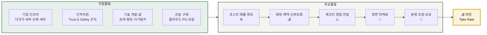
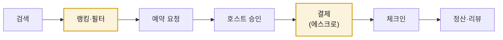
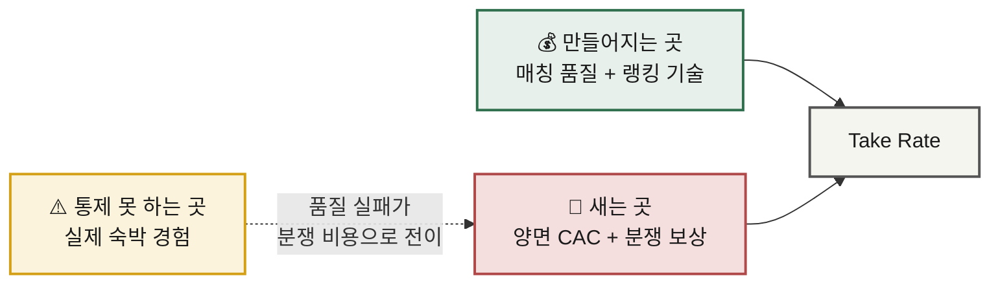

# 가치사슬 분석 ① — 숙박 공유 플랫폼

> **적용 방법론** · [가치사슬 분석 방법론](./methodology.md) — 공통 질문표의 **설계 D1~D6 / 개선 I1~I6** 코드를 그대로 따릅니다.
> **선행 분석** · [Five Forces — 숙박 공유 플랫폼](../01-porters-five-forces/analysis-01-accommodation-sharing.md)
> **비교 대상** · [분석 ② 신선식품 새벽배송](./analysis-02-dawn-delivery-ecommerce.md) · [종합 비교](./comparison.md)

---

## 0. 분석 대상 정의

| 항목 | 내용 |
|---|---|
| **대상** | 공간을 소유하지 않고 호스트와 게스트를 연결해 수수료를 얻는 **양면 플랫폼** |
| **가치사슬의 특이점** | 물리적 재고·물류가 없음. **"공급자를 모으는 것"이 곧 조달**이고, **"매칭시키는 것"이 곧 생산** |
| **Five Forces 연계** | 구조적 약점 = **공급자 멀티호밍**(호스트를 묶어둘 수 없음) + **저빈도 구매**(고객을 계속 다시 사와야 함) |

### 가치사슬 전체 구조

---

## 1. 주요활동 분석

### 1-1. 투입·조달 물류 — **호스트·매물 확보** ⚙️

> 이 산업에서 Inbound는 *물건을 사오는 것* 이 아니라 **공급자를 설득해 등록시키는 것** 입니다. 그래서 마케팅 활동과 경계가 흐릿합니다.

#### 설계 🏗️

| 공통 질문 | 이 산업에서의 답 |
|---|---|
| **D1** 핵심 투입자원 | 매물 리스팅(사진·설명·편의시설), **캘린더 가용성 데이터**, 가격 정보, 호스트 신원 |
| **D2** 확보 경로 | 개인 호스트 직접 등록 / 위탁운영사·채널매니저(PMS) 연동 / 부동산 사업자 제휴 |
| **D3** 자체 vs 외부 | 리스팅 데이터는 자체 보유, 신원확인·지도·번역은 외부 API |
| **D4** 공급자의 참여 유인 | **수요(예약 가능성) 단 하나**. 이것 외에 호스트를 붙잡을 수단이 없음 |
| **D5** 품질 검수·표준화 | 매물 심사 기준, 사진 최소 요건, 필수 표기 항목 — **큐레이션 기준이 곧 브랜드** |
| **D6** 보관·운영 인계 | 리스팅 DB화 + 캘린더 실시간 동기화 → 검색 인덱스에 반영 |

> 재고 매입비는 **0원**입니다. 대신 호스트 획득 비용(리퍼럴·수수료 면제 프로모션)이 발생합니다.
> **D2 판단** — 채널매니저 연동은 물량이 빠르게 늘지만 **멀티호밍을 구조적으로 조장**하는 양날의 선택입니다.

#### 개선 🚀

| 공통 질문 | 이 산업에서의 과제 |
|---|---|
| **I1** 투입물 품질·적시성 | **가용성 데이터 정확도** — 캘린더 미동기화는 오버부킹 → 취소 → 신뢰 손실. Inbound 품질이 그대로 서비스 비용으로 전이 |
| **I2** 의존도 축소 | 특정 대형 위탁운영사에 매물이 집중되면 그 업체가 공급자 교섭력을 갖게 됨 |
| **I3** 공급 중단 대비 | 대형 호스트 이탈 시 해당 지역 공급 공백 → 지역별 공급 집중도 모니터링 필요 |
| **I4** 예측 정확도 | 성수기 지역별 공급 부족을 미리 예측해 사전 호스트 모집 |
| **I5** 중복·유휴 축소 | 장기 미예약 매물의 정리 또는 가격·노출 개선 유도 |
| **I6** 운영 데이터 환류 | 예약·리뷰 데이터를 호스트 모집 타깃팅과 매물 심사 기준에 재반영 |

**추가 레버**
- 리스팅 품질 표준화 — 사진 자동 보정·설명 자동 생성으로 **호스트의 등록 노력을 낮춰** 전환율 향상
- **멀티호밍 억제** — 독점 계약, 플랫폼 전용 툴(스마트락·청소 연동)로 이탈 비용을 인위적으로 생성

> 📌 **Five Forces 연결** — 5F에서 확인한 최대 약점(공급자 멀티호밍)의 해법이 바로 이 활동에 있습니다. 조달 단계에서 호스트를 묶지 못하면 뒤의 어떤 활동으로도 만회할 수 없습니다.

---

### 1-2. 운영·생산 — **매칭·예약·신뢰 보증** 💰

> **이 산업의 가치가 실제로 만들어지는 유일한 활동**입니다. 검색 결과 하나를 잘 뽑아내는 것이 곧 상품입니다.

#### 설계 🏗️

| 공통 질문 | 이 산업에서의 답 |
|---|---|
| **D1** 핵심 처리 과정 | **검색 → 랭킹 → 예약 요청 → 승인 → 결제(에스크로) → 체크인 → 정산·리뷰** |
| **D2** 흐름 설계 | 즉시예약 비중을 높일수록 전환율 상승, 대신 호스트 통제권은 감소 |
| **D3** 품질·안전 확보 | 신원확인, 매물 심사, 사기 리스팅 탐지, 리뷰 검증 — **사전 검증과 사후 보증의 배분**이 핵심 설계 결정 |
| **D4** 수요 급증 대응 | 성수기·이벤트 시 검색 트래픽 폭증 대응 (재고는 늘지 않으므로 **가격으로 조절**) |
| **D5** 자동화 vs 사람 | 랭킹·가격 추천은 자동, 분쟁 판정과 고액 사기 건은 사람 |
| **D6** 병목 지점 | **공급 부족 지역의 매물 부족** — 아무리 검색이 좋아도 팔 물건이 없으면 끝 |

> **D1 핵심** — 랭킹 알고리즘이 사실상 상품 그 자체입니다. 결제 에스크로는 체크인 전까지 대금을 보관해 **양쪽의 사기 리스크를 플랫폼이 흡수**하는 장치입니다.

#### 개선 🚀

| 공통 질문 | 이 산업에서의 과제 |
|---|---|
| **I1** 전환율 향상 | 검색→예약 전환율이 곧 매출. 랭킹 개선이 직접 수수료 매출로 연결 |
| **I2** 이탈 단계 규명 | 대부분 **가격 확인 시점**과 **수수료 노출 시점**에서 이탈 |
| **I3** 오류율 축소 | 예약 취소율·오버부킹률 축소 (Inbound 데이터 품질과 직결) |
| **I4** 검증 강화 vs 속도 | 사기 탐지를 강화하면 정상 호스트 오탐이 늘어남 — 오탐률 관리가 핵심 |
| **I5** 반복 업무 자동화 | 정산·환불 계산·리뷰 검수의 자동화 |
| **I6** 규모의 경제 | 거래가 늘어도 처리 원가는 거의 늘지 않음 → **영업 레버리지가 매우 큼** |

**추가 레버** — 랭킹의 공정성. 특정 호스트 편중은 공급자 이탈로 직결됩니다.

---

### 1-3. 산출·배송 물류 — **체크인 경험 전달** ⚠️

> 이 산업 가치사슬의 **가장 큰 구멍**입니다. 물리적 배송은 없지만, **실제 서비스 전달을 제3자(호스트)가 수행**합니다.

#### 설계 🏗️

| 공통 질문 | 이 산업에서의 답 |
|---|---|
| **D1** 전달 경로·형태 | 예약 확인서, 주소·입실 안내, 호스트 연락 채널, 결제 영수증 |
| **D2** **직접 vs 위임** | **실제 숙박 경험(청결·시설·응대)은 전부 호스트에게 위임** — 이 산업 최대의 설계 결정 |
| **D3** 상태 이해 | 체크인 시각·방법·연락처를 언제 어떤 형태로 노출할 것인가 |
| **D4** 채널 구분 | 앱·메신저·문자의 역할 구분 — 특히 **해외 로밍 환경에서 도달 가능한 채널** 확보 |
| **D5** 속도·정확성·비용 | 비용은 이미 0에 가까우므로 **정확성(주소·입실 정보)** 최우선 |
| **D6** 파트너 정보 제공 | 호스트에게 게스트 도착 시각·인원·특이사항 전달 |

> **원가는 거의 0원**입니다. 이 구간에 비용이 들지 않는 것이 asset-light 모델의 본질이자, 동시에 **품질을 통제할 수 없는 이유**입니다.

#### 개선 🚀

| 공통 질문 | 이 산업에서의 과제 |
|---|---|
| **I1** 완료율 향상 | 체크인 성공률 — 무응답·주소 오류·출입 불가를 어떻게 줄일 것인가 |
| **I2** 실패 원인·빈도 | 호스트 무응답, 사진과 실제의 괴리, 시설 하자 — **유형별 발생률 측정이 먼저** |
| **I3** **위임 구간 품질 관리** | **핵심 과제.** 스마트락·셀프체크인 연동으로 **호스트 의존 구간 자체를 축소** — 통제 불가 영역을 통제 가능하게 전환하는 정공법 |
| **I4** 선제 안내 | 체크인 24시간 전 사전 확인 프로세스로 실패를 미리 탐지 |
| **I5** 중복 안내 축소 | 예약 후 체크인까지 반복 발송되는 알림 정리 |
| **I6** 단위 원가 절감 | 이미 0에 가까움 — **이 활동의 개선 목표는 원가가 아니라 리스크** |

> 📌 **핵심 통찰** — 원가가 0인 대신 **품질 통제권도 0**입니다. 이 활동의 리스크는 사라지는 게 아니라 **서비스 활동의 분쟁 처리 비용으로 이동**할 뿐입니다.

---

### 1-4. 마케팅 및 영업 — **양면 동시 마케팅** 💸

#### 설계 🏗️

| 공통 질문 | 이 산업에서의 답 |
|---|---|
| **D1** 핵심 고객 | 게스트(수요)와 호스트(공급) **양쪽 모두가 고객** — 닭-달걀 문제를 어느 쪽부터 풀지가 첫 결정 |
| **D2** 선택 이유 | 매물 다양성, 가격, **신뢰(문제 시 보상)** |
| **D3** 전면에 내세울 것 | 편리함만으로는 부족 — **신뢰와 가격 투명성**이 실질 차별점 |
| **D4** 도달 채널 | SEO, 메타서치 노출, 검색광고, 앱 리텐션 / 호스트는 리퍼럴·지역 오프라인 영업 |
| **D5** 다음 거래 연결 | **저빈도 구매라 가장 어려운 지점** — 재방문 유도 장치가 구조적으로 약함 |
| **D6** 파트너 유치 | 채널매니저·위탁운영사 제휴로 매물 물량 확보 |

#### 개선 🚀

| 공통 질문 | 이 산업에서의 과제 |
|---|---|
| **I1** CAC ↓ / LTV ↑ | 저빈도라 **CAC 회수가 구조적으로 어려움** — LTV를 늘리려면 빈도부터 손봐야 함 |
| **I2** 프로모션 후 잔존 | 안 남는다면 CAC가 아니라 **보조금**을 쓴 것 |
| **I3** 유료 의존도 축소 | 직접 방문·브랜드 검색 비중이 곧 **네트워크 효과의 실측치** |
| **I4** 재구매·빈도 | **저빈도의 저주 풀기** — 체험·교통 등 인접 카테고리로 접점 빈도 확대 |
| **I5** 개인화 효과 | 여행 이력 기반 추천이 실제 예약으로 이어지는지 검증 |
| **I6** 타 활동 기여 | 게스트를 늘려도 원가가 줄지 않음 — **마케팅과 원가 구조가 분리되어 있음** (새벽배송과의 결정적 차이) |

**추가 레버** — 리뷰·이력 자산을 이탈 비용으로 전환 (등급, 누적 신뢰도)

---

### 1-5. 서비스 — **분쟁 조정·보상** 💸

> 이 산업의 서비스 활동은 단순 CS가 아니라 **상품의 일부**입니다. "문제 생기면 플랫폼이 해결해준다"는 약속이 곧 중개 수수료의 근거이기 때문입니다.

#### 설계 🏗️

| 공통 질문 | 이 산업에서의 답 |
|---|---|
| **D1** 문제 유형 | 숙소가 사진과 다름 / 호스트 일방 취소 / 시설 파손 분쟁 / 사기 리스팅 / 안전 사고 |
| **D2** 처리 주체·기준 | 금액·심각도 기준의 에스컬레이션 정책. **판정의 일관성**이 공급자 신뢰를 좌우 |
| **D3** 셀프 해결 범위 | 예약 변경·취소·환불 신청은 셀프, 분쟁 판정은 불가 |
| **D4** 자동 vs 담당자 | 규정 내 취소는 자동 환불, 사실관계 다툼은 담당자 |
| **D5** 보상 기준·한도 | 대체 숙소 수배 + 차액 보상, 보증금·보험 한도 |
| **D6** VOC 환류 경로 | 반복 민원 유형을 매물 심사 기준과 랭킹 페널티에 반영 |

> 다국어·시차 대응이 필수입니다. 여행 산업 특성상 **현지 시간 즉시 대응**이 아니면 의미가 없습니다.

#### 개선 🚀

| 공통 질문 | 이 산업에서의 과제 |
|---|---|
| **I1** 앞단 개선으로 제거 | 같은 유형이 반복되면 CS가 아니라 **Inbound(매물 심사)/Operations(사기 탐지)** 를 고쳐야 함 |
| **I2** 선제 탐지 | 리뷰 하락 패턴, 취소율 급증을 문제 호스트의 조기 신호로 활용 |
| **I3** **원인 특정** | **어려움** — 현장을 직접 보지 못하고 양측 주장이 엇갈림 |
| **I4** 해결률·재발률 | 처리 시간이 아니라 실제 해결률과 **동일 호스트 재발률**로 측정 |
| **I5** 맥락 유지 | 채팅→전화→이메일 전환 시 예약 정보와 이전 대화 유지 |
| **I6** 구조적 vs 제거 가능 | **대부분 구조적 비용** — 제3자 과실을 대신 보증하는 대가이므로 완전 제거는 불가 |

---

## 2. 지원활동 분석

### 2-1. 기업 인프라 ⚙️

| 구분 | 내용 |
|---|---|
| **설계 🏗️** | **D1·D2** 플랫폼 법인과 현지 법인의 책임 경계 · **D4** 국가·지자체별 숙박업 등록 요건과 숙박세 원천징수 구조 · **D5** 신규 지역 진출 시 법률 검토 절차 · **D6** 신규 시장 진입 판단 기준(규제 리스크 대비 시장 규모) |
| **개선 🚀** | **I3** 지역별 손익 개별 파악 · **I5** 규제 변화의 조기 감지 체계 · 지역별 규제 대응을 개별 처리가 아닌 **공통 모듈로 표준화** · 호스트 대상 규제 준수 안내 자동화 |

> ⚠️ Five Forces에서 '6번째 힘'으로 지목한 **규제**가 가치사슬에서는 이 활동으로 구현됩니다. 규제 대응 역량이 곧 진입 가능 지역의 범위를 결정합니다.

### 2-2. 인적자원 관리 ⚙️

| 구분 | 내용 |
|---|---|
| **설계 🏗️** | **D1** **Trust & Safety 조직**이 이 산업 HR의 핵심 — 사기·분쟁·안전 사고 전담 · **D2** 다국어 CS의 직고용 vs 아웃소싱 · **D5** 지역 커뮤니티 매니저 확보 |
| **개선 🚀** | **I2** 성과 지표에 성장뿐 아니라 **안전·신뢰 지표** 반영 · **I5** 분쟁 판정 인력의 판단 일관성 확보(가이드라인·교육) · **I6** 고강도 민원 업무의 번아웃 관리 |

### 2-3. 기술 개발 💰 **— 최대 투자 대상**

| 구분 | 내용 |
|---|---|
| **설계 🏗️** | **D1** **검색·랭킹 알고리즘**(= 상품 그 자체), 동적 가격 추천, 사기 리스팅 탐지, 신원확인, 지도/번역 · **D2 → 매출 창출형** · **D3** 지도·번역·신원확인은 외부, 랭킹은 반드시 자체 |
| **개선 🚀** | **I4** 사기 탐지의 오탐(정상 호스트 차단) 관리 · **I5** 랭킹 실험 체계(A/B)로 투자 효과 검증 · 리뷰 요약·번역에 생성형 AI 적용 시 **허위 정보 검증 체계** 필수 · **I6** 채널매니저 API 변경에 따른 파트너 비용 최소화 |

> 💰 **D2 판정** — 이 산업에서 기술 개발은 **비용 절감이 아니라 매출 창출** 활동입니다. 랭킹이 좋아지면 전환율이 오르고, 전환율이 오르면 곧바로 수수료 매출이 늘어납니다.

### 2-4. 조달·구매 ⚙️

| 구분 | 내용 |
|---|---|
| **설계 🏗️** | **D1** 클라우드 · 결제 PG(다국가 통화·정산) · 신원확인 벤더 · 호스트 보험사 · 지도 API · 번역 API · **D2** 가용성과 다국가 커버리지가 가격만큼 중요 |
| **개선 🚀** | **I1** 결제 수수료율은 규모 확대에 따라 재협상 가능한 대표 항목 · **I2** **지도·번역 API 종속성** 관리 · **I6** 보험 담보 범위와 보험료의 균형(서비스 활동 원가와 직결) |

---

## 3. 마진 발생 지점 종합

| 활동 | 기여도 | 근거 |
|---|:--:|---|
| 투입·조달 (호스트 확보) | ⚙️ 가치 전달 | 없으면 사업이 성립하지 않으나, 그 자체가 차별화는 아님 |
| **운영 (매칭·신뢰 보증)** | 💰 **가치 창출** | 수수료를 받을 수 있는 유일한 근거. 전환율이 곧 매출 |
| 산출 (체크인 경험) | ⚠️ **통제 불가** | 원가 0의 대가로 품질 통제권 상실 |
| 마케팅·영업 | 💸 비용 중심 | 저빈도 구매 탓에 CAC가 반복 발생 |
| 서비스 (분쟁·보상) | 💸 비용 중심 | 단, 이 비용을 감수하는 것이 신뢰의 근거 |
| **기술 개발** | 💰 **가치 창출** | 랭킹·매칭 품질이 직접 매출로 전환 |
| 기업 인프라 / HR / 조달 | ⚙️ 가치 전달 | 진입 가능 범위와 안정성을 결정 |

### 결론 — 마진이 만들어지는 곳과 새는 곳

**한 줄 요약** — 마진은 **매칭 품질**에서 만들어지고, **고객 재획득 비용**과 **통제하지 못하는 숙박 품질의 뒷수습**에서 샙니다.

---

## 4. 개선 우선순위

| 순위 | 과제 | 대상 활동 (질문 코드) | 기대 효과 |
|:--:|---|---|---|
| 1 | **호스트 락인 장치 구축** (독점 매물·전용 툴) | 투입·조달 **D4·I2** | 5F 최대 약점인 멀티호밍 완화 |
| 2 | **체크인 실패의 사전 차단** (스마트락·사전 확인) | 산출 **I3·I4** → 서비스 | 통제 불가 구간 축소 + 분쟁 비용 절감 |
| 3 | **랭킹·전환율 개선** | 운영 **I1·I2** · 기술 | 동일 트래픽에서 매출 직접 증가 |
| 4 | **유료광고 의존도 축소** | 마케팅 **I3·I4** | CAC 반복 지출 구조 개선 |
| 5 | 사기 리스팅 사전 탐지 고도화 | 기술 **I4** → 서비스 **I2** | 사후 보상 원가를 사전 비용으로 대체 |

---

## 📎 검증이 필요한 항목

- [ ] Take rate 구조 (호스트 부담분 vs 게스트 부담분)
- [ ] 검색→예약 전환율과 단계별 이탈률
- [ ] 예약 취소율·오버부킹률
- [ ] 체크인 실패 유형별 발생률
- [ ] 분쟁·보상 지출이 매출에서 차지하는 비중
- [ ] 유료 유입 대비 직접 유입 비중 추이
- [ ] 채널매니저를 통해 등록된 매물의 멀티호밍 비율
