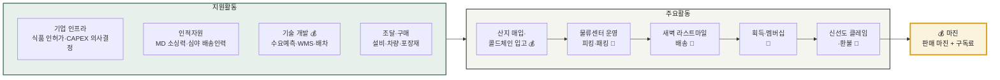
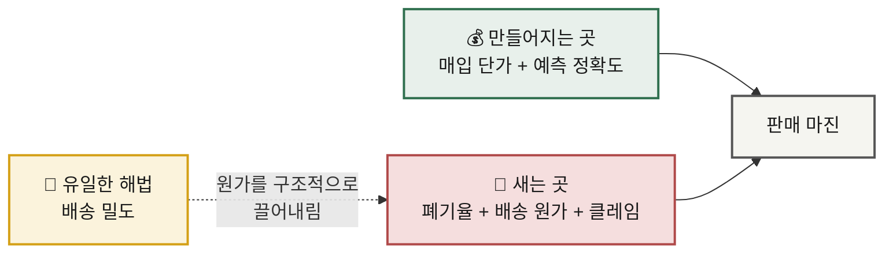

# 가치사슬 분석 ② — 신선식품 새벽배송 이커머스

> **적용 방법론** · [가치사슬 분석 방법론](./methodology.md) — 공통 질문표의 **설계 D1~D6 / 개선 I1~I6** 코드를 그대로 따릅니다.
> **선행 분석** · [Five Forces — 신선식품 새벽배송](../01-porters-five-forces/analysis-02-dawn-delivery-ecommerce.md)
> **비교 대상** · [분석 ① 숙박 공유 플랫폼](./analysis-01-accommodation-sharing.md) · [종합 비교](./comparison.md)

---

## 0. 분석 대상 정의

| 항목 | 내용 |
|---|---|
| **대상** | 신선식품을 **직매입**해 자체 콜드체인으로 보관·분류하고, 전날 주문분을 익일 새벽에 배송하는 리테일테크 이커머스 |
| **가치사슬의 특이점** | **전 구간이 물리적**이고, **재고가 시간이 지나면 썩는다**. 원가가 주요활동 전 구간에 걸쳐 발생 |
| **Five Forces 연계** | 구조적 약점 = **높은 고정비 + 높은 철수 장벽**이 만드는 만성 출혈. 해법은 **원가 우위**뿐 |

### 가치사슬 전체 구조

---

## 1. 주요활동 분석

### 1-1. 투입·조달 물류 — **산지 매입·콜드체인 입고** 💰

> 숙박 공유와 달리 **진짜 조달**입니다. 여기서 결정된 매입 단가와 발주량이 이후 모든 손익을 좌우합니다.

#### 설계 🏗️

| 공통 질문 | 이 산업에서의 답 |
|---|---|
| **D1** 핵심 투입자원 | 산지 원물, 브랜드 상품, **콜드체인 창고**, 수요예측 데이터, MD의 소싱 네트워크 |
| **D2** 확보 경로 | 산지 직계약 / 도매시장 / 제조사 직거래 / PB 위탁생산 |
| **D3** 자체 vs 외부 | 창고·검수는 자체, 원물 생산은 외부. **PB는 "외부 생산 + 자체 브랜드"의 절충** |
| **D4** 공급자의 참여 유인 | 안정적 물량 인수와 대금 지급. 산지 직계약은 **물량 책임**을 지는 대신 단가·품질 우위 확보 |
| **D5** 품질 검수·표준화 | 입고 검수 기준(당도·중량·선도) — **여기서 놓친 품질은 뒤에서 복구 불가** |
| **D6** 보관·운영 인계 | 온도대별 보관 구획, 선입선출, 유통기한 관리 |

> **매출원가가 손익의 대부분**입니다. 매입 단가 1%가 곧 마진 1%입니다.
> **결정적 변수는 발주 정확도** — 적게 사면 품절, 많이 사면 폐기. 양쪽 다 손실입니다.

#### 개선 🚀

| 공통 질문 | 이 산업에서의 과제 |
|---|---|
| **I1** 투입물 품질·적시성 | 입고 단계 선도 관리, 검수 자동화(비파괴 선별) |
| **I2** 의존도 축소 | 특정 산지·계절 의존도 축소 — 기후 리스크 분산, 수입 소싱 병행 |
| **I3** 공급 중단 대비 | 작황 부진 시 대체 산지·대체 품목 전환 계획 |
| **I4** **예측 정확도** | **이 산업 최대의 개선 레버.** 수요예측 오차 1%가 곧 폐기율로 직결 |
| **I5** 과잉 재고 축소 | 폐기 임박 상품의 할인·가공 전환, 재고 회전율 관리 |
| **I6** 운영 데이터 환류 | 판매·폐기·클레임 데이터를 발주량과 소싱처 결정에 재반영 |

**추가 레버** — 매입 단가 협상력 확보(물량 집중·연간 계약·선구매), PB 카테고리 확대

> 📌 **Five Forces 연결** — 5F에서 '협상 불가능한 공급자'로 지목한 **날씨·작황 리스크**가 가치사슬에서는 이 활동의 **I4 발주 정확도** 문제로 나타납니다.

---

### 1-2. 운영·생산 — **물류센터 운영** 💸 (마진 방어의 핵심)

> 상품을 만들지는 않지만, **보관·분류·포장이 곧 생산**입니다. 그리고 이 산업 마진의 최대 누수 지점입니다.

#### 설계 🏗️

| 공통 질문 | 이 산업에서의 답 |
|---|---|
| **D1** 핵심 처리 과정 | **입고 검수 → 온도대별 보관 → 주문 마감 → 피킹 → 보냉 패킹 → 권역별 분류 → 출차** |
| **D2** 흐름 설계 | 주문 마감 시각을 몇 시로 정할 것인가 — 늦출수록 고객 편의는 오르고 **처리 시간은 줄어듦** |
| **D3** 품질·안전 확보 | 콜드체인 온도 유지, 식품 위생 기준, 유통기한 검증 |
| **D4** 수요 급증 대응 | 명절·한파 등 주문 폭증 시 처리 능력 한계 — 사전 주문 마감 또는 배송 슬롯 제한 |
| **D5** 자동화 vs 사람 | 자동화는 **고정비**, 인력은 **변동비** — 가동률 예측이 투자 판단의 근거 |
| **D6** 병목 지점 | **주문 마감 후 출차까지의 몇 시간** — 산업 특유의 극단적 시간 제약 |

#### 개선 🚀

| 공통 질문 | 이 산업에서의 과제 |
|---|---|
| **I1** 완료율 향상 | 주문 대비 정상 출고율 — 결품 없이 전량 처리 |
| **I2** 이탈 원인 | (운영 단계의 이탈은 없음) 대신 **결품이 다음 주문의 이탈로 이어짐** |
| **I3** 오류율 축소 | **오피킹률·결품률** 축소 → 서비스 활동 원가 직접 절감 |
| **I4** 검증 vs 속도 | 검수를 강화하면 처리 시간이 늘어남 — 시간 제약이 극심해 균형점 설정이 어려움 |
| **I5** 표준화·자동화 | DAS/DPS 도입, 동선 최적화, 인당 처리량(UPH) 개선 |
| **I6** **규모의 경제** | 물류센터는 **가동률을 채워야 단위 원가가 맞음** — 이것이 출혈 경쟁의 원인 |

**최대 과제 — 폐기율 축소** · 팔지 못한 신선식품은 전액 손실입니다. 발주 개선(1-1 I4) + 임박 상품 할인 + 가공 전환이 결합되어야 합니다.
**추가 레버** — 포장재 최적화(원가와 환경 규제 동시 충족)

---

### 1-3. 산출·배송 물류 — **새벽 라스트마일** 💸 (원가의 결정 구간)

> 이 산업 원가 구조가 결정되는 곳입니다. 숙박 공유에서 원가 0이었던 바로 그 활동이, 여기서는 **가장 무거운 활동**이 됩니다.

#### 설계 🏗️

| 공통 질문 | 이 산업에서의 답 |
|---|---|
| **D1** 전달 경로·형태 | 문 앞 배송. 새벽 시간대 비대면 인수 |
| **D2** **직접 vs 위임** | **자체 배송 인력 또는 전속 위탁 — 직접 통제.** 숙박 공유와 정반대의 선택 |
| **D3** 상태 이해 | 출차·배송 완료 알림, 배송 사진 |
| **D4** 채널 구분 | 앱 푸시(기본) + 문자(도달 보조) |
| **D5** 속도·정확성·비용 | **비용이 최우선 제약** — 속도(새벽 완료)는 이미 상품 정의에 포함되어 타협 불가 |
| **D6** 파트너 정보 제공 | 배송기사에게 권역·동선·특이사항(공동현관 비밀번호 등) 전달 |

**밀도의 경제 — 이 산업의 핵심 메커니즘**

> **D5 판단** — 새벽 배송은 **재시도 기회가 사실상 없습니다.** 한 번 실패하면 그날의 상품 가치가 소멸합니다.

#### 개선 🚀

| 공통 질문 | 이 산업에서의 과제 |
|---|---|
| **I1** 속도·정확도·완료율 | 배송 완료율, 시간 준수율, 콜드체인 유지율 |
| **I2** 실패 원인·빈도 | 주소 오류, 출입 불가, 오배송 — 새벽이라 **당일 복구 불가**가 문제 |
| **I3** 위임 구간 관리 | 위탁 비중을 쓸 경우 기사별 품질 편차 관리 |
| **I4** 선제 안내 | 지연·미배송 발생 시 고객이 알아채기 전에 통보 |
| **I5** 중복 안내 축소 | 출차·도착·완료 알림의 적정 수준 |
| **I6** **단위 원가 절감** | **핵심 과제.** 배송 권역을 **행정구역이 아니라 주문 밀도 기준**으로 재설계. 배차·경로 최적화. 객단가 상승으로 배송 1건당 매출 개선 |

**최우선 원칙 — 밀도 확보 전 확장 금지** · 넓게 펴는 순간 단위 경제가 무너집니다.
**추가 레버** — 배송 인력 이탈률 관리 (숙련도가 곧 배송 속도)

---

### 1-4. 마케팅 및 영업 — **획득·멤버십** 💸

#### 설계 🏗️

| 공통 질문 | 이 산업에서의 답 |
|---|---|
| **D1** 핵심 고객 | 정기적으로 장을 보는 가구 — **밀도 기여도가 높은 지역 고객이 우선** |
| **D2** 선택 이유 | 시간 절약(새벽 도착), 상품 품질, 큐레이션 |
| **D3** 전면에 내세울 것 | 신선도 신뢰 + 가격. 식품은 **가격 탄력성이 큰** 품목 |
| **D4** 도달 채널 | 첫 구매 할인, 무료배송, 특가 상품, 개인화 추천 |
| **D5** 다음 거래 연결 | **멤버십 구독** — 구독료가 곧 전환 비용을 만드는 장치 |
| **D6** 파트너 유치 | 제조사 공동 프로모션, 브랜드사 입점 |

> 신선식품은 **유입 미끼**, 가공·생필품은 **객단가**를 담당하는 이원 구조로 설계합니다.

#### 개선 🚀

| 공통 질문 | 이 산업에서의 과제 |
|---|---|
| **I1** CAC ↓ / LTV ↑ | 첫 구매 할인 폭이 커서 초기 CAC가 높음. 단 **고빈도라 LTV 회수 가능** |
| **I2** 프로모션 후 잔존 | 안 남으면 CAC가 아니라 보조금을 쓴 것 (숙박 공유와 동일한 함정) |
| **I3** 유료 의존도 축소 | 멤버십 가입자의 자연 재방문 비중 확대 |
| **I4** 재구매·빈도 | 구매 빈도 상승 → **밀도 경제에 직접 기여**. 같은 고객이 자주 사면 동선당 건수가 늘어남 |
| **I5** 개인화 효과 | 추천이 **객단가와 밀도**에 기여하는지로 측정 (단순 클릭률이 아님) |
| **I6** **타 활동 기여** | **이 산업만의 특징.** 마케팅이 매출뿐 아니라 **물류 원가 구조를 직접 개선**함 |

> 📌 **I6 핵심** — 같은 동네 고객을 늘리면 배송 밀도가 올라갑니다. 그래서 "전국 확대"가 아니라 **"한 권역을 촘촘히"** 가 정답이 됩니다. 마케팅과 물류가 한 몸으로 움직입니다.

---

### 1-5. 서비스 — **신선도 클레임·환불** 💸

#### 설계 🏗️

| 공통 질문 | 이 산업에서의 답 |
|---|---|
| **D1** 문제 유형 | 신선도 불만(무름·변질) / 결품·오배송 / 미배송·지연 / 포장 파손·누액 |
| **D2** 처리 주체·기준 | 소액은 자동 환불, 반복 클레임 계정은 담당자 검토 |
| **D3** 셀프 해결 범위 | 앱에서 사진 첨부 후 환불 신청까지 셀프 처리 |
| **D4** 자동 vs 담당자 | 무조건 환불 정책을 쓸 것인가 — **신뢰 구축 효과 vs 악용 리스크**의 균형 |
| **D5** 보상 기준·한도 | 즉시 환불 또는 재배송. 재배송은 새벽 시간대라 **다음 날로 밀림** |
| **D6** VOC 환류 경로 | 클레임 데이터를 매입·물류 개선으로 되돌리는 경로 설계 |

#### 개선 🚀

| 공통 질문 | 이 산업에서의 과제 |
|---|---|
| **I1** 앞단 개선으로 제거 | 반복 클레임 상품의 **소싱 자체를 교체** — 서비스 문제를 조달 문제로 되돌리는 것이 정공법 |
| **I2** 선제 탐지 | 결품·지연을 고객 문의 전에 사전 알림 |
| **I3** **원인 특정** | **가능** — 산지·입고 배치·센터·배송기사 단위로 역추적 |
| **I4** 해결률·재발률 | 처리 시간이 아니라 **재발률**로 측정 |
| **I5** 맥락 유지 | 주문·배송·클레임 이력이 채널 전환 시에도 연결 |
| **I6** 구조적 vs 제거 가능 | **대부분 제거 가능** — 자기 과실이므로 앞단을 고치면 사라짐 |

> 💡 **숙박 공유와의 결정적 차이** — 여기서 발생하는 문제는 **대부분 자기 과실**입니다. 그래서 원인을 특정할 수 있고, 앞단 활동을 고쳐 **근본적으로 제거**할 수 있습니다.

---

## 2. 지원활동 분석

### 2-1. 기업 인프라 ⚙️

| 구분 | 내용 |
|---|---|
| **설계 🏗️** | **D1** 물류 자회사 구조와 자산 보유 주체 · **D4** 식품 위생·유통 인허가, 원산지·유통기한 표시 · **D6** **대규모 CAPEX 투자 판단 기준** — 이 산업 인프라 활동의 최대 과제 |
| **개선 🚀** | **I3** 권역별 손익을 **개별적으로** 볼 수 있는 관리회계 체계 (전사 합산만 보면 어느 권역이 적자인지 안 보임) · **I2** 성장 지표와 수익성 지표 충돌 시 판단 기준 · **I4** 식품 안전 사고 대응 지휘체계 |

> ⚠️ **D6이 이 산업의 핵심 질문**입니다. "어디까지 투자하고 언제 멈출 것인가" — 5F에서 확인했듯 이 투자가 곧 **철수 장벽**이 되기 때문입니다.

### 2-2. 인적자원 관리 💰 (일부)

| 구분 | 내용 |
|---|---|
| **설계 🏗️** | **D1** **MD(상품기획) 소싱 역량** — 좋은 산지를 먼저 잡는 사람이 마진을 만듦 · **D5** **심야 배송 인력 확보 구조** · 물류센터 운영 인력, 데이터·물류 엔지니어 |
| **개선 🚀** | **I1** 심야 노동 특성상 **인력 이탈률이 원가에 직접 반영** — 관리 최우선 · **I5** 숙련 배송기사 유지 (숙련도 = 배송 속도 = 원가) · **I6** 야간 안전사고 예방과 번아웃 관리 |

> 💰 MD의 소싱 역량은 이 산업에서 **드물게 차별화를 만드는 인적 자산**입니다. 같은 상품을 더 싸게, 또는 남들이 못 구하는 상품을 구해오는 능력은 복제하기 어렵습니다.

### 2-3. 기술 개발 💰 **— 원가 절감형**

| 구분 | 내용 |
|---|---|
| **설계 🏗️** | **D1** **수요예측 모델**(폐기율 직결), WMS(창고관리), TMS/배차 최적화, 자동화 설비 제어, 개인화 추천 · **D2 → 원가 절감형** · **D6** 판매·폐기 데이터를 예측 모델 학습 자산으로 축적 |
| **개선 🚀** | **I2** 예측 오차 축소가 곧 마진 개선 · **I5** 배차 알고리즘의 실차율, 자동화 설비 **가동률**로 투자 효과 검증 · **I4** 추천 모델이 객단가와 밀도에 기여하는지 검증 |

> 💡 **D2 판정 — 숙박 공유와의 결정적 차이.** 여기서 기술은 **매출을 만드는 게 아니라 원가를 줄입니다.** 같은 '기술 개발' 지원활동인데 작용 방향이 정반대입니다.

### 2-4. 조달·구매 ⚙️ (상품 매입과 구분)

> ※ 여기서의 조달은 **상품 매입(1-1)이 아니라 사업 운영에 필요한 자원 구매**입니다.

| 구분 | 내용 |
|---|---|
| **설계 🏗️** | **D1** 물류센터 부지·임차, 냉장/냉동 설비, 배송 차량, **포장재(보냉백·아이스팩)**, 클라우드, 고객센터 솔루션 · **D2** 설비는 가동 안정성과 유지보수 대응이 가격만큼 중요 |
| **개선 🚀** | **I6** **포장재 단가**는 건당 원가에 직접 반영되는 대표 항목 — 규모 확대 시 재협상 필수 · **I1** 차량 리스 vs 매입 판단 · 냉매·전력 비용(전기요금 인상에 직접 노출) · **I5** 설비 공급자의 유지보수 대응력 모니터링 |

---

## 3. 마진 발생 지점 종합

| 활동 | 기여도 | 근거 |
|---|:--:|---|
| **투입·조달 (매입)** | 💰 **가치 창출** | 매입 단가와 발주 정확도가 마진의 출발점 |
| 운영 (물류센터) | 💸 비용 중심 | 폐기율·오피킹이 마진을 갉아먹는 최대 누수 지점 |
| **산출 (새벽 배송)** | 💸 **비용 중심 (최대)** | 원가의 결정 구간. 밀도가 유일한 해법 |
| 마케팅·영업 | 💸 비용 중심 | 단, **밀도 개선을 통해 물류 원가에 간접 기여** |
| 서비스 (클레임) | 💸 비용 중심 | 자기 과실이라 앞단 개선으로 제거 가능 |
| **기술 개발** | 💰 **가치 창출** | 예측·배차 개선이 직접 원가 절감 |
| 인적자원 (MD) | 💰 가치 창출 | 소싱력은 복제 어려운 차별화 자산 |
| 기업 인프라 / 조달 | ⚙️ 가치 전달 | 투자 판단과 단가 협상이 손익을 좌우 |

### 결론 — 마진이 만들어지는 곳과 새는 곳

**한 줄 요약** — 마진은 **매입 단가와 발주 정확도**에서 만들어지고, **폐기·배송·클레임**이라는 물리적 활동 전 구간에서 샙니다. 그리고 이 누수를 구조적으로 막는 방법은 **배송 밀도** 하나뿐입니다.

---

## 4. 개선 우선순위

| 순위 | 과제 | 대상 활동 (질문 코드) | 기대 효과 |
|:--:|---|---|---|
| 1 | **권역별 밀도 확보 후 확장** (커버리지 확대 유예) | 산출 **I6** · 인프라 **D6** | 단위 배송원가 하락 — 원가 우위의 유일한 경로 |
| 2 | **수요예측 정확도 개선** | 조달 **I4** · 기술 **I2** | 폐기율 직접 축소 = 마진 즉시 개선 |
| 3 | **PB 비중 확대** | 조달 **D3·I2** | 공급자 교섭력 완화 + 가격 비교 무력화 |
| 4 | **멤버십 락인 강화** | 마케팅 **D5·I4** | 고빈도라는 유일한 우위를 전환 비용으로 전환 |
| 5 | 클레임 원인 역추적 체계 | 서비스 **I1·I3** → 조달·운영 | 문제를 앞단에서 제거 |
| 6 | 권역별 관리회계 도입 | 인프라 **I3** | 적자 권역을 식별해야 확장 판단이 가능 |

---

## 📎 검증이 필요한 항목

- [ ] 매출원가율 및 카테고리별 마진 구조
- [ ] 신선식품 폐기율 (업계 평균 및 자사 수준)
- [ ] 권역별 배송 밀도와 단위 배송원가의 실제 상관관계
- [ ] 물류센터 CAPEX 규모와 감가상각 부담
- [ ] 첫 구매 할인 대비 CAC 회수 기간
- [ ] 멤버십 갱신율·이탈률
- [ ] 클레임 발생률과 그 처리 비용의 매출 대비 비중
- [ ] 포장재·전력 등 건당 변동 원가 내역
