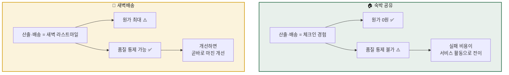
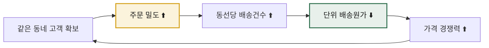
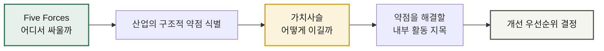

# 가치사슬 비교 분석 — 숙박 공유 플랫폼 vs 신선식품 새벽배송

> **분석 ①** [숙박 공유 플랫폼](./analysis-01-accommodation-sharing.md) · **분석 ②** [신선식품 새벽배송](./analysis-02-dawn-delivery-ecommerce.md)
> **방법론** [가치사슬 분석](./methodology.md) · **선행 챕터** [Five Forces 비교](../01-porters-five-forces/comparison.md)
>
> 두 분석 모두 방법론의 **도메인 중립 공통 질문표(설계 D1~D6 / 개선 I1~I6)** 를 동일하게 적용했습니다.
> 같은 질문에 두 산업이 어떻게 다르게 답하는지가 이 비교의 뼈대입니다.

---

## 0. 이 비교의 위치

[Five Forces 비교](../01-porters-five-forces/comparison.md)에서 두 산업의 **외부 구조**가 정반대임을 확인했습니다.
이번에는 같은 두 산업의 **내부 활동**을 분해해, 그 구조적 차이가 실제 업무 어디에서 발생하는지 봅니다.

| | Five Forces (외부) | 가치사슬 (내부) |
|---|---|---|
| 묻는 것 | **어느 산업에서 싸울 것인가** | **어떻게 이길 것인가** |
| 숙박 공유 결론 | 구조는 불리하나 남는 장사 | 마진은 **매칭 품질**에서 나옴 |
| 새벽배송 결론 | 방벽은 높으나 안에서 출혈 | 마진은 **매입·밀도**에서 나옴 |

---

## 1. 9개 활동 나란히 보기

| 활동 | 숙박 공유 | 새벽배송 | 무엇이 갈랐나 |
|---|---|---|---|
| **투입·조달** | ⚙️ 호스트 온보딩 *재고 매입비 0원* | 💰 산지 매입·입고 *매출원가의 대부분* | **"조달"의 의미 자체가 다름** — 설득 vs 구매 |
| **운영·생산** | 💰 매칭·예약·신뢰보증 *무형 처리* | 💸 물류센터 피킹·패킹 *물리적 처리, 시간 압축* | 가치 창출 vs 가치 누수 |
| **산출·배송** | ⚠️ **호스트에 위임** *원가 0 / 통제 0* | 💸 **자체 새벽 배송** *원가 최대 / 통제 최대* | **가장 극적인 대조** |
| **마케팅·영업** | 💸 양면 CAC *저빈도라 반복 지출* | 💸 획득 + 멤버십 *밀도 개선에 간접 기여* | 마케팅이 물류 원가에 영향을 주는가 |
| **서비스** | 💸 **제3자 과실** 뒷수습 | 💸 **자기 과실** 처리 | 원인을 제거할 수 있는가 |
| **기업 인프라** | ⚙️ 다국가 숙박 규제 | ⚙️ 식품 인허가 + **CAPEX 판단** | 규제 대응 vs 투자 판단 |
| **인적자원** | ⚙️ Trust & Safety | 💰 **MD 소싱력** + 심야 인력 | HR이 마진을 만드는가 |
| **기술 개발** | 💰 **매출 창출형** (랭킹·매칭) | 💰 **원가 절감형** (예측·배차) | 같은 활동, **정반대 방향** |
| **조달·구매** | ⚙️ 클라우드·PG·보험 | ⚙️ 설비·차량·**포장재** | 무형 자원 vs 유형 자원 |

---

---

## 1-1. 같은 질문, 다른 답 — 공통 질문표 대조

공통 질문표를 쓰는 진짜 이유가 여기 있습니다. **완전히 같은 질문**에 두 산업이 정반대로 답하는 지점만 모으면, 구조적 차이가 그대로 드러납니다.

| 활동 · 질문 코드 | 공통 질문 | 🏠 숙박 공유 | 🥬 새벽배송 |
|---|---|---|---|
| 조달 **D4** | 공급자가 우리와 거래할 유인은? | **수요(예약 가능성) 단 하나** — 붙잡을 다른 수단이 없음 | 안정적 물량 인수와 대금 지급 — **계약으로 묶을 수 있음** |
| 운영 **I6** | 규모가 커질수록 단위 원가가 낮아지는가? | 예 — 처리 원가가 거의 늘지 않음 (**영업 레버리지**) | 예, 단 **가동률을 채워야만** — 못 채우면 역효과 |
| **산출 D2** | **어느 구간을 직접 수행하고 어느 구간을 위임하는가?** | **실제 숙박 경험 전체를 호스트에 위임** | **라스트마일 전 구간을 직접 수행** |
| 산출 **I6** | 전달 1건당 원가를 낮출 방법은? | 이미 0에 가까움 — **개선 목표가 원가가 아니라 리스크** | **밀도 확보** — 이 산업 유일의 원가 레버 |
| 마케팅 **I4** | 재구매율과 이용 빈도를 높일 수 있는가? | 어려움 — 연 2~3회 **저빈도** | 가능 — 주 1~2회 **고빈도** |
| 마케팅 **I6** | 마케팅이 다른 활동의 효율에도 기여하는가? | **아니오** — 고객이 늘어도 원가는 그대로 | **예** — 지역 고객 증가 = 배송 밀도 = 원가 하락 |
| 서비스 **I3** | 문제의 원인을 특정할 수 있는가? | **어려움** — 현장을 못 보고 양측 주장이 엇갈림 | **가능** — 산지·배치·센터·기사 단위 역추적 |
| 서비스 **I6** | 서비스 비용 중 제거 가능한 것은? | **대부분 구조적** — 제3자 과실 보증의 대가 | **대부분 제거 가능** — 자기 과실이므로 |
| **기술 D2** | **그 기술은 매출을 만드는가, 원가를 줄이는가?** | **매출 창출형** (랭킹·매칭) | **원가 절감형** (예측·배차) |
| 인프라 **D6** | 대규모 투자의 판단 기준은? | 큰 설비 투자가 없음 — 규제 리스크 대비 시장 규모 | **CAPEX가 곧 철수 장벽** — 이 산업 최대의 의사결정 |
| 인프라 **I3** | 사업 단위별 손익을 개별 파악할 수 있는가? | 지역별 손익 | **권역별 손익** — 없으면 확장 판단 자체가 불가능 |

> 💡 **읽는 법** — 위 11개 항목은 **두 산업이 정반대로 답한 질문**만 추린 것입니다.
> 나머지 질문(품질 검수, 조직 구조, 계약 조건 등)에서는 답이 크게 다르지 않았습니다.
> **차이가 나는 질문이 곧 그 산업의 정체성**입니다.

---

## 2. 핵심 발견 ① — Outbound의 정반대 대칭

가장 극적인 대조입니다. **같은 위치의 활동이 한쪽에서는 존재하지 않고, 다른 쪽에서는 사업의 전부**입니다.

### 여기서 나오는 원칙

> **활동을 아웃소싱하면 원가는 사라지지만, 리스크는 사라지지 않고 다른 활동으로 이동한다.**

숙박 공유는 배송(체크인) 원가를 0으로 만들었지만, 그 대가로 품질 실패가 **분쟁 처리 비용**이라는 형태로 서비스 활동에 나타납니다. 원가가 사라진 게 아니라 **모양을 바꿔 뒤로 밀린 것**입니다.

반면 새벽배송은 배송을 직접 떠안아 원가가 크지만, 그만큼 **개선하면 곧바로 자기 마진이 됩니다.**

---

## 3. 핵심 발견 ② — 같은 '기술 개발'인데 방향이 반대

두 산업 모두 기술 개발이 💰 가치 창출 활동으로 나왔습니다. 그런데 작동 방식이 정반대입니다.

| | 숙박 공유 | 새벽배송 |
|---|---|---|
| 핵심 기술 | 검색·랭킹·매칭 | 수요예측·배차 최적화 |
| **작용 방향** | **매출을 만든다** | **원가를 줄인다** |
| 개선의 효과 | 전환율 ↑ → 수수료 매출 ↑ | 폐기율 ↓, 배송원가 ↓ → 마진 ↑ |
| 성과 측정 | 검색→예약 전환율 | 예측 오차율, 실차율 |
| 투자 실패 시 | 매출 정체 | **원가가 경쟁사보다 높아져 도태** |

> 💡 **학습 포인트** — "우리도 기술에 투자한다"는 말은 아무 정보도 담고 있지 않습니다.
> **기술이 매출을 만드는 산업인지, 원가를 줄이는 산업인지**를 먼저 판별해야 투자 대상과 성과 지표가 정해집니다.

---

## 4. 핵심 발견 ③ — 서비스 활동의 '고칠 수 있음' 차이

두 산업 모두 서비스가 💸 비용 중심 활동이지만, **개선 가능성이 완전히 다릅니다.**

| | 숙박 공유 | 새벽배송 |
|---|---|---|
| 문제의 원인 | **제3자(호스트)의 과실** | **자기 과실** |
| 원인 특정 | 어려움 (현장을 못 봄) | 가능 (산지·배치·센터·기사 단위 추적) |
| 근본 해결 | 사전 심사·페널티로 **간접 통제**만 가능 | 앞단 활동을 고쳐 **근본 제거 가능** |
| 비용의 성격 | **구조적으로 계속 발생** | 개선하면 줄어듦 |

숙박 공유에서 분쟁 비용은 *수수료를 받는 대가* 로 계속 안고 가야 하는 구조적 비용입니다.
새벽배송에서 클레임 비용은 *고칠 수 있는 문제* 입니다. 실제로 **"클레임 → 원인 역추적 → 소싱 교체"** 라는 개선 경로가 성립합니다.

---

## 5. 핵심 발견 ④ — 마케팅이 물류에 영향을 주는가

새벽배송에만 존재하는 특이한 연결고리입니다.

새벽배송에서 마케팅은 매출만 늘리는 게 아니라 **물류 원가 구조를 직접 개선**합니다. 그래서 "전국 확대"가 아니라 **"한 권역을 촘촘히"** 가 정답이 됩니다.

숙박 공유에는 이 연결이 없습니다. 게스트를 늘려도 원가가 줄지 않습니다. 대신 **호스트를 늘리면 게스트가 늘어나는** 네트워크 효과가 그 자리를 대신합니다.

| | 규모의 효과가 작동하는 경로 |
|---|---|
| 숙박 공유 | 공급 ↑ → 선택지 ↑ → 수요 ↑ → 공급 ↑ (**네트워크 효과**) |
| 새벽배송 | 지역 주문 ↑ → 단위 원가 ↓ → 가격 ↓ → 주문 ↑ (**밀도의 경제**) |

둘 다 선순환이지만, 하나는 **무형의 매력도**로, 하나는 **물리적 원가**로 작동합니다.

---

## 6. 원가 구조 비교

| 구분 | 숙박 공유 | 새벽배송 |
|---|---|---|
| 매출원가 | **거의 없음** | 매출의 대부분 |
| 원가의 성격 | 변동비 중심 (인건비·마케팅) | **고정비 중심** (센터·설비) + 변동비(배송·포장) |
| 확장 시 비용 | 거의 증가하지 않음 | **권역마다 계단식 증가** |
| 손익분기 조건 | 거래량 확보 | **권역별 밀도 확보** |
| 침체기 대응 | 마케팅비 즉시 축소 가능 | 고정비 잔존 → 손실 확대 |
| 개선 레버 | 전환율, take rate | 매입 단가, 폐기율, 배송 밀도 |

> ⚠️ **비교 시 주의** — 두 사업은 **매출 인식 기준이 달라** 매출 규모를 직접 비교하면 안 됩니다.
> 중개 모델은 수수료만, 직매입 모델은 거래액 전체가 매출로 잡힙니다. **GMV 기준으로 맞춰야** 의미 있는 비교가 됩니다.
> (→ [Five Forces 비교 §4](../01-porters-five-forces/comparison.md) 참고)

---

## 7. Five Forces ↔ 가치사슬 연결

**외부 구조의 약점이 내부 활동의 어느 지점에서 해결되는가** — 두 프레임워크를 잇는 핵심입니다.

| 산업 | 5F에서 확인된 약점 | 가치사슬에서의 해법 활동 | 구체적 과제 |
|---|---|---|---|
| **숙박 공유** | 공급자 **멀티호밍** (🟡 Medium) | **투입·조달** | 독점 매물 계약, 플랫폼 전용 툴로 이탈 비용 생성 |
| | 구매자 **저빈도 구매** (🔴 High) | **마케팅** | 인접 카테고리로 접점 빈도 확대 |
| | 대체재 위협 (🔴 High) | **운영 · 기술** | 매칭 품질로 차별화 — 호텔이 못 주는 경험 |
| **새벽배송** | 경쟁 강도 + **철수 장벽** (🔴 High) | **산출·배송** | 밀도 확보로 원가 우위 → 경쟁 이탈 유도 |
| | 공급자 **날씨·작황** (🟡 Medium) | **투입·조달 · 기술** | 수요예측 고도화, 소싱 다변화, PB |
| | 구매자 가격 민감도 (🔴 High) | **마케팅** | 멤버십으로 고빈도를 전환 비용으로 변환 |

---

## 8. 종합 결론

| 관점 | 숙박 공유 | 새벽배송 |
|---|---|---|
| **가치사슬의 무게중심** | 운영(매칭) 한 곳에 집중 | 조달-운영-배송 **전 구간에 분산** |
| **마진 창출 활동** | 매칭 품질, 랭킹 기술 | 매입 단가, 예측 정확도, MD 소싱력 |
| **마진 누수 활동** | 양면 CAC, 분쟁 보상 | 폐기율, 배송 원가, 클레임 |
| **통제하지 못하는 구간** | **산출(체크인 경험)** | 없음 (대신 원가를 떠안음) |
| **개선 1순위** | 호스트 락인 (투입·조달) | 권역별 밀도 확보 (산출) |
| **기술의 역할** | 매출 창출 | 원가 절감 |
| **한 줄 요약** | 활동이 **가볍지만 통제력이 없다** | 활동이 **무겁지만 전부 내 손 안에 있다** |

### 이번 분석에서 얻은 판단 원칙

1. **"조달"과 "배송"은 산업마다 의미가 다르다** — 활동 이름이 같다고 같은 일이 아닙니다. 각 산업에서 그 활동이 *실제로 무엇인지* 부터 정의해야 합니다.
2. **아웃소싱은 원가를 없애는 게 아니라 리스크를 뒤로 미룬다** — 통제하지 않는 활동의 실패는 반드시 다른 활동의 비용으로 되돌아옵니다.
3. **같은 지원활동도 작용 방향을 확인하라** — 기술 개발이 매출형인지 원가형인지에 따라 투자 대상과 KPI가 완전히 달라집니다.
4. **서비스 비용은 "구조적"인 것과 "고칠 수 있는" 것을 구분하라** — 원인을 특정할 수 있으면 앞단에서 제거하고, 없으면 관리 비용으로 예산에 넣어야 합니다.
5. **가치사슬은 Five Forces의 답을 실행으로 옮기는 도구다** — 5F가 약점을 알려주면, 가치사슬은 그 약점을 **어느 활동에서 고칠지** 지목합니다.
6. **비교하려면 질문이 같아야 한다** — 산업마다 다른 질문을 던지면 각각의 분석은 나와도 **대조가 불가능**합니다. 도메인 중립 공통 질문표(D1~D6 / I1~I6)를 고정해두면, 답이 갈리는 지점이 곧 구조적 차이로 드러납니다(→ [§1-1](#1-1-같은-질문-다른-답--공통-질문표-대조)).

---

## 📎 다음 단계 제안

- [ ] **03 KSFs 분석** — 두 산업에서 "반드시 잘해야 하는 것"을 도출하고, 이번에 찾은 💰 활동과 일치하는지 검증
- [ ] 각 분석서 하단의 검증 항목을 실데이터로 확인 — 현재는 **구조 분석**이며 수치는 미검증
