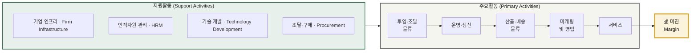

# 02 — 기업 내부 활동의 가치 사슬 분석 방법론

> 본 문서는 앞으로 진행할 모든 가치사슬 분석의 **기준 프레임**입니다.
> 개별 산업 분석은 이 방법론을 그대로 적용해 별도 문서로 작성합니다.

> 📌 **사용 안내** — 아래 질문표는 **특정 산업에 종속되지 않는 공통 질문**으로 구성되어 있습니다.
> 제조·유통·플랫폼·서비스 어떤 업종에도 그대로 적용할 수 있으며, 각 질문의 *대상만* 해당 산업의 투입물·처리과정·전달채널로 바꿔 읽으면 됩니다.
> 각 질문에는 추적용 코드(**설계 D1~D6 / 개선 I1~I6**)를 부여했습니다. 분석 문서에서 이 코드로 어떤 질문에 답했는지 확인할 수 있습니다.

---

## 0. 가치사슬 전체 구조

**분석의 목적** · 기업 활동을 9개로 분해해 **마진이 실제로 어느 활동에서 만들어지는지** 찾아내고, 원가 우위 또는 차별화의 레버를 도출하는 것.

---

## 1. 가치사슬 주요활동 분석

### 1-1. 주요활동 공통 분석 질문표

| 항목명(Activity) | 가치사슬 **설계**를 위한 질문 🏗️ | 가치사슬 **개선**을 위한 질문 🚀 |
| --- | --- | --- |
| **투입·조달 물류** Inbound Logistics  **핵심 투입자원의 확보와 공급 연결** | **D1** 제품·서비스 제공에 필요한 핵심 투입자원은 무엇인가? **D2** 그 자원을 누구로부터, 어떤 방식으로 확보할 것인가? **D3** 어떤 자원을 자체 확보하고, 어떤 자원을 외부 조달·제휴로 확보할 것인가? **D4** 공급자가 우리와 거래할 유인은 무엇인가? **D5** 투입물의 품질·규격을 어떻게 검수하고 표준화할 것인가? **D6** 투입물을 어떻게 보관·관리하여 운영 단계로 넘길 것인가? | **I1** 투입물의 품질·정확성·적시성을 어떻게 높일 것인가? **I2** 특정 공급자·지역·경로에 대한 의존도를 줄일 수 있는가? **I3** 공급 중단이나 장애에 대비한 대체 경로가 있는가? **I4** 조달 수량과 시점의 예측 정확도를 높일 수 있는가? **I5** 중복 조달·과잉 재고·유휴 자원을 줄일 수 있는가? **I6** 운영 결과 데이터를 조달 의사결정에 다시 반영하고 있는가? |
| **운영·생산** Operations  **투입물을 고객 가치로 전환** | **D1** 투입물을 고객 가치로 전환하는 핵심 처리 과정은 무엇인가? **D2** 요청 접수부터 결과 산출까지의 흐름을 어떻게 설계할 것인가? **D3** 품질·안전·규정 준수를 어느 단계에서 어떻게 확보할 것인가? **D4** 수요가 급증해도 안정적으로 처리할 수 있는가? **D5** 자동화와 사람의 판단이 담당할 영역의 경계는 어디인가? **D6** 처리 능력의 한계(병목)는 어디에서 발생하는가? | **I1** 단계별 완료율·전환율을 어떻게 높일 것인가? **I2** 고객이 중도 이탈하는 단계와 그 원인은 무엇인가? **I3** 처리시간·오류율·재작업률·수작업 비율을 줄일 수 있는가? **I4** 품질 검증을 강화하면서 처리 속도를 유지할 수 있는가? **I5** 반복 업무를 표준화하거나 자동화할 수 있는가? **I6** 규모가 커질수록 단위 원가가 낮아지는 구조인가? |
| **산출·배송 물류** Outbound Logistics  **결과물을 고객에게 전달** | **D1** 고객은 결과물을 어떤 경로와 형태로 전달받는가? **D2** 전달 과정의 어느 구간을 직접 수행하고, 어느 구간을 위임할 것인가? **D3** 고객이 현재 상태와 다음 행동을 즉시 이해할 수 있는가? **D4** 채널별(앱·알림·현장·파트너) 역할을 어떻게 구분할 것인가? **D5** 전달의 속도·정확성·비용 중 무엇을 우선할 것인가? **D6** 파트너나 중간 사업자에게 필요한 정보는 어떻게 제공할 것인가? | **I1** 전달 속도·정확도·완료율을 높일 수 있는가? **I2** 전달 실패나 지연이 발생하는 원인과 빈도는 무엇인가? **I3** 위임한 구간의 품질을 어떻게 관리·검증할 것인가? **I4** 지연·장애 시 현재 상태와 조치를 선제적으로 안내할 수 있는가? **I5** 과도하거나 중복된 안내를 줄일 수 있는가? **I6** 전달 1건당 원가를 낮출 구조적 방법이 있는가? |
| **마케팅 및 영업** Marketing & Sales | **D1** 우리의 핵심 고객은 누구이며, 여러 고객군 중 무엇을 우선할 것인가? **D2** 고객이 우리를 선택해야 하는 핵심 이유는 무엇인가? **D3** 가격·품질·편의·신뢰 중 무엇을 전면에 내세울 것인가? **D4** 어떤 채널로 고객에게 도달할 것인가? **D5** 첫 거래 이후 어떤 다음 거래로 연결할 것인가? **D6** 파트너·중간 사업자는 어떤 방식으로 유치할 것인가? | **I1** 고객획득비용(CAC)을 낮추고 고객생애가치(LTV)를 높일 수 있는가? **I2** 프로모션이 끝난 뒤에도 고객이 남는가? **I3** 유료 채널 의존도를 줄이고 자연 유입을 늘릴 수 있는가? **I4** 재구매율과 이용 빈도를 높일 수 있는가? **I5** 개인화·추천이 실제 고객 편익과 매출로 이어지는가? **I6** 마케팅 활동이 다른 활동(운영·물류)의 효율에도 기여하는가? |
| **서비스** Service  **거래 이후 지원과 고객 보호** | **D1** 거래 이후 발생할 수 있는 문제 유형은 무엇인가? **D2** 각 문제를 누가, 어떤 기준으로 처리할 것인가? **D3** 고객이 스스로 해결할 수 있는 범위는 어디까지인가? **D4** 자동 응대와 담당자 개입의 경계는 어디인가? **D5** 보상·환불·재처리의 기준과 한도는 무엇인가? **D6** 고객 의견(VOC)을 제품·운영 개선으로 연결하는 경로가 있는가? | **I1** 반복 문의를 앞단 활동의 개선으로 제거할 수 있는가? **I2** 문제를 고객 문의 이전에 선제적으로 탐지할 수 있는가? **I3** 문제의 원인을 활동·공정·담당 단위로 특정할 수 있는가? **I4** 처리 시간이 아니라 실제 해결률과 재발률을 측정하고 있는가? **I5** 응대 채널이 바뀌어도 고객 맥락이 유지되는가? **I6** 서비스 비용 중 구조적인 것과 제거 가능한 것을 구분하고 있는가? |

---

## 2. 가치사슬 지원활동 분석

### 2-1. 지원활동 공통 분석 질문표

| 항목명(Activity) | 가치사슬 **설계**를 위한 질문 🏗️ | 가치사슬 **개선**을 위한 질문 🚀 |
| --- | --- | --- |
| **기업 인프라** Firm Infrastructure | **D1** 사업을 수행할 법인·조직 구조를 어떻게 구성할 것인가? **D2** 사업 부문 간 책임·데이터·브랜드의 경계는 어디인가? **D3** 경영진·재무·법무·리스크·감사의 역할은 무엇인가? **D4** 해당 산업의 규제와 인허가 요건을 어떻게 반영할 것인가? **D5** 신규 사업·서비스의 검토와 승인 절차는 무엇인가? **D6** 대규모 투자(설비·인수·신규 진출)의 판단 기준은 무엇인가? | **I1** 조직이 늘어나면서 책임 소재가 흐려지고 있지 않은가? **I2** 성장 지표와 리스크·수익성 지표가 충돌할 때의 판단 기준은 무엇인가? **I3** 사업 단위(지역·부문·채널)별 손익을 개별적으로 파악할 수 있는가? **I4** 사고·장애 발생 시 대응 지휘체계가 명확한가? **I5** 규제 변화를 조기에 감지하고 반영하는 체계가 있는가? **I6** 관리 비용이 사업 규모에 비해 과도하게 늘고 있지 않은가? |
| **인적자원 관리** Human Resource Management | **D1** 각 활동에 필요한 핵심 인재와 역량은 무엇인가? **D2** 어떤 역량을 내부에 두고, 어떤 역량을 외부에서 조달할 것인가? **D3** 속도와 안정성 중 어느 쪽에 조직 운영을 맞출 것인가? **D4** 의사결정 권한과 최종 책임은 누구에게 있는가? **D5** 현장 인력의 확보·교육·유지 방식은 무엇인가? **D6** 조직 문화에 무엇을 내재화할 것인가? | **I1** 인력 이탈률이 원가와 품질에 미치는 영향을 파악하고 있는가? **I2** 성과 평가가 매출뿐 아니라 품질·안전·협업을 반영하는가? **I3** 특정 인력에게 지식과 권한이 집중되어 있지 않은가? **I4** 조직이 커져도 의사결정 속도를 유지할 수 있는가? **I5** 숙련도 향상이 실제 생산성 지표로 이어지는가? **I6** 고강도 업무의 번아웃과 안전을 관리하고 있는가? |
| **기술 개발** Technology Development | **D1** 핵심 경쟁력을 만드는 기술은 무엇인가? **D2** 그 기술은 **매출을 만드는가, 원가를 줄이는가?** **D3** 자체 개발과 외부 솔루션 도입의 기준은 무엇인가? **D4** 서비스를 확장하면서 기술적 결합도를 낮출 수 있는가? **D5** 요구되는 보안·가용성·복구 수준은 어디까지인가? **D6** 데이터·모델·프로세스를 어떻게 자산으로 축적할 것인가? | **I1** 중복 개발을 줄이고 공통 자산의 재사용률을 높일 수 있는가? **I2** 장애나 품질 저하를 사전에 예측하고 자동 복구할 수 있는가? **I3** 개선 속도와 운영 안정성을 동시에 확보할 수 있는가? **I4** 모델·알고리즘의 오류와 편향을 관리하는 체계가 있는가? **I5** 기술 투자 효과를 어떤 지표로 검증하고 있는가? **I6** 기술 변경이 파트너·고객에게 전가하는 비용을 최소화할 수 있는가? |
| **조달·구매** Procurement | **D1** 사업 운영에 필요한 자원·설비·솔루션은 무엇인가? **D2** 공급자를 가격 외에 어떤 기준으로 평가할 것인가? **D3** 핵심 공급자에 대한 협상력을 어떻게 확보할 것인가? **D4** 공급자 장애나 계약 종료 시에도 사업을 지속할 수 있는가? **D5** 외부 업체가 다루는 정보·자산을 어떻게 통제할 것인가? **D6** 구매를 한곳에 집중할 것인가, 분산할 것인가? | **I1** 구매 규모 증가에 따라 단가와 계약 조건을 개선할 수 있는가? **I2** 특정 공급자나 기술에 과도하게 종속되어 있지 않은가? **I3** 핵심 공급자에 대한 대안과 전환 계획이 있는가? **I4** 계약에 품질·보안·장애 대응·해지 조건이 포함되어 있는가? **I5** 공급자의 재무·품질·규제 위험을 지속적으로 모니터링하는가? **I6** 단위 원가에 직접 반영되는 구매 항목을 별도로 관리하는가? |

> 💡 **주요활동의 '투입·조달 물류'와 지원활동의 '조달·구매'는 다릅니다.**
> 전자는 **판매할 제품·서비스를 이루는 투입물**을, 후자는 **사업 운영에 필요한 자원**(설비·솔루션·소모품)을 다룹니다.

---

## 📋 분석 실행 체크리스트

- [ ] **0. 대상 정의** — 어느 기업/사업 모델의 가치사슬인지 경계를 긋는다
- [ ] **1~5. 주요활동 분해** — 각 활동에서 *실제로 무슨 일이 일어나는가* 를 먼저 서술
- [ ] **6~9. 지원활동 분해** — 주요활동을 떠받치는 방식으로 서술
- [ ] **10. 마진 기여도 평가** — 각 활동이 마진을 *만드는가 / 쓰는가*
- [ ] **11. 병목·취약 지점 식별** — 통제하지 못하는 활동은 어디인가
- [ ] **12. 개선 레버 도출** — 설계🏗️와 개선🚀 관점을 구분해 제안

### 활동별 마진 기여도 표기 기준

| 표기 | 의미 |
|:--:|---|
| 💰 **가치 창출** | 이 활동이 차별화 또는 프리미엄의 원천 — 투자 대상 |
| ⚙️ **가치 전달** | 필수적이나 그 자체로 차별화되지 않음 — 효율화 대상 |
| 💸 **비용 중심** | 원가를 소모 — 축소·자동화·외주 검토 대상 |
| ⚠️ **통제 불가** | 가치사슬 밖의 주체에게 위임된 구간 — 리스크 관리 대상 |

> ⚠️ **주의** — 가치사슬 분석은 *활동을 나열하는 것* 이 목적이 아닙니다.
> **"마진이 어디서 만들어지고 어디서 새는가"** 에 답하지 못하면 분석이 끝난 것이 아닙니다.
