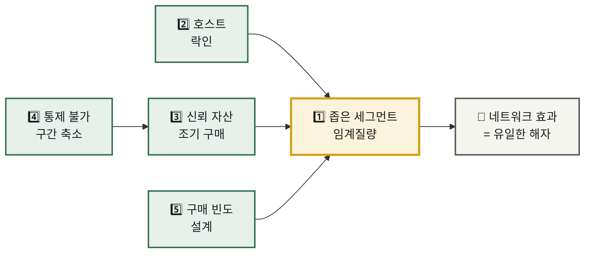

# 신규 진입자를 위한 Top 5 핵심 성공 요인 — 숙박 공유 플랫폼 시장

> **분석 근거** · [Five Forces — 숙박 공유 플랫폼](../01-porters-five-forces/analysis-01-accommodation-sharing.md) · [가치사슬 — 숙박 공유 플랫폼](../02-value-chain/analysis-01-accommodation-sharing.md)
> **대상 독자** · 이 시장 진입을 준비하는 창업가 또는 전략 기획팀
> **비교 대상** · [신선식품 새벽배송 시장의 Top 5 KSF](./analysis-02-dawn-delivery-ecommerce.md)

---

## 들어가며 — 이 시장의 진입 조건

Five Forces 분석은 이 산업의 구조적 매력도를 **중하(中下)** 로 판정했다. 구매자 교섭력·대체재 위협·기존 경쟁 강도가 모두 🔴 High다. 그럼에도 이 시장이 성립하는 이유는 재고를 소유하지 않아 **영업 레버리지가 매우 크기** 때문이며, 그 이익은 **네트워크 효과라는 단 하나의 해자**에 전적으로 의존한다.

신규 진입자에게 이것이 의미하는 바는 분명하다. **네트워크 효과를 확보하지 못하면 이 사업은 존재할 이유가 없다.** 아래 다섯 가지는 그 해자를 만들어내는 순서대로 배열되어 있다.

---

## 1. 좁게 정의된 단일 세그먼트에서의 양면 임계질량 선점

**KSF 명칭** · Critical Mass in a Narrow Segment

**선정 근거**

Five Forces 분석의 '신규 진입자 위협' 항목은 이 시장의 진입 장벽을 **글로벌 종합 플랫폼에서는 🟢 Low, 로컬·니치에서는 🔴 High** 로 이원 판정했다. 그 근거로 제시된 문장이 핵심이다 — *"네트워크 효과는 같은 범위 안에서만 작동하기 때문입니다."*

이는 신규 진입자에게 두 가지를 동시에 말한다. 첫째, 기존 종합 플랫폼과 같은 범위에서 경쟁하면 네트워크 효과의 격차를 결코 좁힐 수 없다. 둘째, 범위를 좁히는 순간 그 좁은 범위 안에서는 신규 진입자도 네트워크 효과를 완성할 수 있으며, 완성된 이후에는 동일한 강도의 진입 장벽을 자신의 것으로 갖게 된다.

가치사슬 분석은 이 판단을 운영 측면에서 뒷받침한다. '운영·생산' 활동의 **D6 병목 지점**은 *"공급 부족 지역의 매물 부족 — 아무리 검색이 좋아도 팔 물건이 없으면 끝"* 으로 식별되었다. 한정된 자원으로 넓은 지역에 매물을 분산시키면 **어느 지역에서도 검색 결과가 빈약해지고, 빈약한 검색 결과는 게스트를 잃고, 게스트가 없으면 호스트가 떠난다.** 넓게 펴는 것은 성장이 아니라 자멸이다.

따라서 신규 진입자의 첫 번째 과업은 시장을 넓히는 것이 아니라 **자신이 1위가 될 수 있을 만큼 좁게 자르는 것**이다. 한옥, 반려동물 동반, 한 달 살기, 특정 광역권 — 무엇이든 좋으나 그 안에서 **매물 밀도가 압도적**이어야 한다.

---

## 2. 호스트 전환 비용의 인위적 창출

**KSF 명칭** · Engineered Supplier Lock-in

**선정 근거**

Five Forces 분석에서 공급자 교섭력은 🟡 Medium으로 판정되었는데, 이를 Low가 아닌 Medium으로 밀어 올린 단일 요인이 **멀티호밍**이다. 판단 근거는 *"호스트가 Airbnb·부킹닷컴·자체 SNS에 동시 등록 가능. 배타적 계약 없음"* 이며, 전환 비용 항목 역시 *"다른 플랫폼으로 옮기는 데 드는 비용이 사실상 없음"* 으로 평가되었다.

문제는 가치사슬 분석의 '투입·조달 물류' **D4 공급자의 참여 유인**에서 결정적으로 드러난다. 그 답은 단 한 줄이었다 — *"수요(예약 가능성) 단 하나. 이것 외에 호스트를 붙잡을 수단이 없음."*

여기에 신규 진입자의 근본적 딜레마가 있다. **호스트를 붙잡는 유일한 수단이 수요인데, 신규 진입자에게는 바로 그 수요가 없다.** 기존 사업자와 같은 방식으로는 공급을 모을 수 없다는 뜻이다.

그러므로 신규 진입자는 수요 이외의 유인을 **인위적으로 설계해야 한다.** 가치사슬 개선 우선순위 1위로 제시된 *"독점 매물 계약, 플랫폼 전용 툴(스마트락·청소 연동)로 이탈 비용을 인위적으로 생성"* 이 그 방향이다. 운영 대행, 정산 편의, 가격 책정 도구, 청소 인력 연계처럼 **호스트의 업무를 실제로 대신 수행하는 기능**은 수요가 적어도 호스트를 붙잡는다.

동시에 경계해야 할 것이 있다. 가치사슬은 채널매니저 연동에 대해 *"물량이 빠르게 늘지만 멀티호밍을 구조적으로 조장하는 양날의 선택"* 이라고 판정했다. 초기 물량 확보의 유혹은 크지만, **그 방식으로 모은 매물은 나의 자산이 아니다.**

---

## 3. 신뢰 자산의 조기 구매 — 사후 보증의 상품화

**KSF 명칭** · Trust as a Purchased Asset

**선정 근거**

Five Forces의 진입 장벽 표에서 '신뢰 자산'은 🟢 높음으로 평가되었으며, 그 성격이 명시되어 있다 — *"누적 리뷰 DB, 결제 보호, 호스트 보험 — 돈이 아니라 **시간**이 있어야 쌓임."*

이것은 신규 진입자에게 가장 불리한 항목이다. 자본은 조달할 수 있어도 시간은 조달할 수 없기 때문이다. 더구나 대체재 위협 분석은 *"호텔·모텔·게스트하우스가 브랜드 신뢰·일관된 품질로 반격 중"* 이라고 지적했다. 신뢰가 없는 상태에서 신규 진입자는 대체재에 정면으로 밀린다.

해법은 가치사슬 '서비스' 활동의 성격 규정에 있다 — *"이 산업의 서비스 활동은 단순 CS가 아니라 상품의 일부입니다. '문제 생기면 플랫폼이 해결해준다'는 약속이 곧 중개 수수료의 근거이기 때문입니다."*

즉 신뢰는 리뷰가 쌓이기를 기다려서만 얻는 것이 아니라, **보증·보험·무조건 환불이라는 정책으로 즉시 구매할 수 있다.** 리뷰 모수가 없는 신규 진입자일수록 이 비용을 초기에 지불해야 한다. 기존 사업자가 축적으로 확보한 신뢰를, 신규 진입자는 **약속과 보상으로 대체**하는 것이다.

다만 이 비용은 회수 계획과 함께 설계되어야 한다. 가치사슬은 이 활동의 **I6**을 *"대부분 구조적 비용 — 제3자 과실을 대신 보증하는 대가이므로 완전 제거는 불가"* 로 판정했다. 사라지지 않는 비용이므로, **처음부터 수수료율에 반영해 두어야 한다.**

---

## 4. 통제 불가 구간(체크인 경험)의 축소 설계

**KSF 명칭** · Shrinking the Uncontrolled Segment

**선정 근거**

가치사슬 분석에서 '산출·배송 물류' 활동은 유일하게 **⚠️ 통제 불가**로 판정된 구간이다. 판정 근거는 **D2**의 답에 있다 — *"실제 숙박 경험(청결·시설·응대)은 전부 호스트에게 위임 — 이 산업 최대의 설계 결정."* 그리고 그 대가가 명시되어 있다 — *"원가가 0인 대신 품질 통제권도 0입니다. 이 활동의 리스크는 사라지는 게 아니라 서비스 활동의 분쟁 처리 비용으로 이동할 뿐입니다."*

기존 대형 사업자는 이 리스크를 **모수로 희석**할 수 있다. 수백만 건 중 몇 건의 사고는 평판에 큰 타격을 주지 않는다. **신규 진입자에게는 이 완충 장치가 없다.** 거래 건수가 적을 때 발생한 사고 한 건은 초기 리뷰 전체를 오염시키고, KSF 1에서 확보하려는 좁은 세그먼트의 평판을 통째로 무너뜨린다.

따라서 신규 진입자는 이 구간을 **기존 사업자보다 더 적극적으로 축소해야 한다.** 가치사슬 **I3**이 제시한 방향이 정확히 이것이다 — *"스마트락·셀프체크인 연동으로 호스트 의존 구간 자체를 축소 — 통제 불가 영역을 통제 가능하게 전환하는 정공법."* **I4**의 *"체크인 24시간 전 사전 확인 프로세스"* 역시 같은 목적을 갖는다.

이 요소가 KSF 2와 결합될 때 효과는 배가된다. 스마트락 같은 전용 도구는 **체크인 실패를 줄이는 동시에 호스트의 전환 비용을 높이는** 이중 기능을 수행하기 때문이다.

---

## 5. 구매 빈도의 설계 — CAC 회수 구조의 내장

**KSF 명칭** · Designed Purchase Frequency

**선정 근거**

Five Forces의 구매자 교섭력 판정은 이 시장의 가장 냉정한 진단이다 — *"저빈도 구매라는 점이 결정적입니다. 1년에 두세 번 쓰는 서비스에는 습관이 붙지 않고, 그때마다 소비자는 처음부터 다시 비교합니다. 플랫폼이 마케팅비를 계속 태워야 하는 구조적 이유입니다."*

가치사슬은 이 진단이 손익에 어떻게 나타나는지 보여준다. '마케팅 및 영업' 활동의 **I1**은 *"저빈도라 CAC 회수가 구조적으로 어려움"* 이며, 더 중요한 것은 **I6**의 판정이다 — *"게스트를 늘려도 원가가 줄지 않음 — 마케팅과 원가 구조가 분리되어 있음."*

이것이 신규 진입자에게 치명적인 이유는 명확하다. **유료 마케팅으로 성장하는 경로는 반드시 자본 고갈로 끝난다.** 고객을 아무리 많이 사와도 원가가 낮아지지 않고, 저빈도라 그 고객이 다시 돌아오지도 않는다. 가치사슬 **I2**의 경고 그대로다 — *"안 남는다면 CAC가 아니라 보조금을 쓴 것."*

따라서 신규 진입자는 **빈도를 사업 설계 단계에서 확보해야 한다.** 두 갈래가 있다. 하나는 가치사슬 **I4**가 제시한 *"체험·교통 등 인접 카테고리로 접점 빈도 확대"* 이며, 다른 하나는 애초에 **재방문 주기가 짧은 세그먼트를 선택하는 것**이다. 워케이션, 주말 근교 체류, 지역 정기 방문처럼 연 5회 이상 반복되는 수요는 같은 숙박이라도 CAC 회수 구조가 근본적으로 다르다.

또한 **I3**이 지목한 지표를 초기부터 관리해야 한다 — *"직접 방문·브랜드 검색 비중이 곧 네트워크 효과의 실측치."* 이 비중이 오르지 않는다면 네트워크 효과는 만들어지지 않고 있는 것이며, 그것은 KSF 1이 실패했다는 신호다.

---

## 전략적 우선순위 — 자원 배분의 순서

다섯 요인은 병렬이 아니라 **의존 관계**를 갖는다.

| 단계 | 집중할 KSF | 판단 기준 |
|:--:|---|---|
| **1단계** | KSF 1 · KSF 2 | 선택한 세그먼트에서 **매물 밀도 1위**인가 |
| **2단계** | KSF 3 · KSF 4 | 사고 발생률과 분쟁 비용이 **예측 가능한 범위**인가 |
| **3단계** | KSF 5 | **직접 유입 비중**이 상승하고 있는가 |

---

## ⛔ 하지 말아야 할 것

Five Forces의 전략 도출은 저비용 전략을 **⭐ 1개**로 평가하며 다음과 같이 판정했다 — *"수수료 인하 경쟁은 take rate를 스스로 깎는 자해에 가깝습니다."*

신규 진입자가 가장 빠지기 쉬운 함정이 바로 이것이다. 호스트를 모으기 위해 수수료를 면제하고 게스트를 모으기 위해 할인하는 방식은, **네트워크 효과가 완성되기 전에 자본만 소진시킨다.** 기존 경쟁 강도 분석이 지적한 *"수수료율 인하와 마케팅비 출혈 중심 — 서로의 이익을 직접 깎음"* 이라는 경쟁 양상에 신규 진입자가 자발적으로 참전하는 것은 승산이 없다.

같은 이유로 **전 지역·전 카테고리 동시 확장** 역시 금기다. KSF 1의 논리에 정면으로 반한다.

---

## 📎 검증이 필요한 항목

본 KSF는 선행 두 분석의 **구조적 판단**에서 도출되었다. 실제 진입 결정에 사용하려면 아래를 확인해야 한다.

- [ ] 목표 세그먼트의 실제 시장 규모 — 좁힌 시장이 사업으로 성립하는 크기인가
- [ ] 해당 세그먼트 내 기존 사업자의 매물 밀도와 점유율
- [ ] 호스트 전용 도구에 대한 실제 지불 의향 및 채택률
- [ ] 보증·보험 정책의 예상 비용률과 이를 감당할 수 있는 수수료 수준
- [ ] 목표 세그먼트의 연간 재방문 빈도 — KSF 5의 전제
- [ ] 진입 지역의 숙박업 등록 요건 (Five Forces가 '6번째 힘'으로 지목한 규제 리스크)
