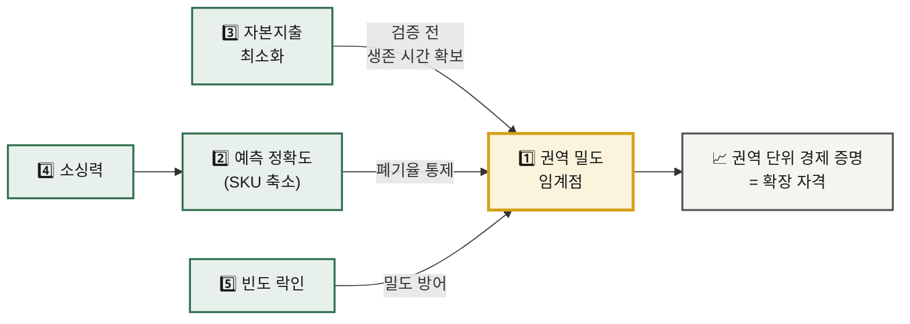

# 신규 진입자를 위한 Top 5 핵심 성공 요인 — 신선식품 새벽배송 시장

> **분석 근거** · [Five Forces — 신선식품 새벽배송](../01-porters-five-forces/analysis-02-dawn-delivery-ecommerce.md) · [가치사슬 — 신선식품 새벽배송](../02-value-chain/analysis-02-dawn-delivery-ecommerce.md)
> **대상 독자** · 이 시장 진입을 준비하는 창업가 또는 전략 기획팀
> **비교 대상** · [숙박 공유 플랫폼 시장의 Top 5 KSF](./analysis-01-accommodation-sharing.md)

---

## 들어가며 — 먼저 직시해야 할 전제

Five Forces 분석은 이 시장의 신규 진입자 위협을 **🟢 Low**로 판정했다. 신규 진입자의 입장에서 이 판정은 유리한 소식이 아니라 **경고**다. 분석의 문장은 다음과 같았다 — *"맨땅에서 시작하는 신규 진입자는 사실상 불가능합니다."*

더 냉정한 진단은 산업 매력도 결론에 있다. 진입 장벽이 다섯 힘 중 가장 유리한 항목인데도 산업 전체 수익성은 좋지 않으며, 그 이유는 *"진입 장벽을 세운 대가로 철수 장벽까지 함께 떠안았기 때문"* 이다. 결론은 **'버티면 이기지만, 버티는 비용이 극단적으로 비싼'** 산업이라는 것이다.

따라서 이 시장의 KSF는 "어떻게 크게 성장할 것인가"가 아니라 **"어떻게 죽지 않고 임계점까지 도달할 것인가"** 를 묻는다. 아래 다섯 가지는 그 생존 조건이다.

---

## 1. 단일 권역에서의 배송 밀도 임계점 도달 — 확장은 그 이후

**KSF 명칭** · Delivery Density Threshold in a Single Zone

**선정 근거**

Five Forces의 진입 장벽 표에서 가장 높이 평가된 항목은 자본이 아니라 **배송 밀도**였다. 판정 문구는 다음과 같다 — *"규모의 경제 = 배송 밀도. 같은 동네에 주문이 촘촘해야 단위 배송비가 떨어짐. **밀도 없이는 무조건 적자.**"*

가치사슬 분석은 이 메커니즘을 순환 구조로 규명했다 — 주문 밀도 상승 → 동선당 배송 건수 증가 → 단위 배송원가 하락 → 가격 경쟁력 확보 → 다시 주문 증가. 그리고 '산출·배송 물류' 활동의 **I6**을 *"핵심 과제"* 로 지목하며, 배송 권역을 *"행정구역이 아니라 주문 밀도 기준"* 으로 설계할 것을 명시했다.

신규 진입자에게 이 요인이 1순위인 이유는 **확장이 성장이 아니라 손실 증폭 장치**이기 때문이다. Five Forces는 *"지역 확장의 비선형성 — 신규 권역마다 물류센터를 새로 지어야 함 → 확장 비용이 계단식"* 이라고 지적했다. 밀도가 확보되지 않은 상태에서 지역을 넓히면, 적자 권역이 하나에서 둘로 늘어날 뿐이다.

가치사슬 개선 우선순위 1위 역시 동일하게 *"밀도 확보 전 확장 금지 — 넓게 펴는 순간 단위 경제가 무너집니다"* 로 못 박았다. **한 권역에서 흑자를 증명하기 전까지 두 번째 권역은 존재해서는 안 된다.**

#### 📌 입증 사례

| 기업 | 무엇을 했는가 | 이 KSF를 어떻게 입증하는가 |
|---|---|---|
| **Amazon Fresh** (2007~) | 2007년 시애틀에서 시작한 뒤 **약 6년간 다른 도시로 확장하지 않았다.** 2013년에야 로스앤젤레스로 넓혔다. | 세계 최대 규모의 자본과 물류 역량을 가진 회사조차 **단위 경제가 검증되기 전에는 두 번째 도시를 열지 않았다.** 신선식품 배송에서 확장 속도가 자본의 함수가 아니라 *단위 경제의 함수* 임을 보여주는 가장 강력한 근거. |
| **마켓컬리(컬리)** (2015~) | 서울 강남권 일부에서 새벽배송을 시작해 서울 전역 → 수도권 → 이후 단계적으로 확대했다. 창업 시점부터 전국을 대상으로 하지 않았다. | 국내 새벽배송을 처음 열어젖힌 사업자 역시 **한 권역에서 시작했다.** '새벽배송'이라는 개념 자체가 좁은 권역에서만 성립 가능했다는 사실을 보여준다. |
| **오아시스마켓** | 무리한 전국 확장 대신 **수도권 중심 운영**을 유지했다. | 새벽배송 사업자 다수가 적자를 이어가는 가운데 **흑자를 낸 사례로 반복 거론**된다. 확장을 자제한 것이 성장 부진이 아니라 수익성 확보의 조건이었음을 시사한다. |

---

## 2. 수요예측 정확도 — SKU를 좁혀 폐기율을 통제하는 역량

**KSF 명칭** · Forecast Accuracy through Narrowed SKU

**선정 근거**

Five Forces는 '수요 예측 역량'을 진입 장벽으로 별도 분류하며 그 성격을 밝혔다 — *"폐기율을 못 잡으면 팔수록 손해 — 데이터 축적에 시간 필요."*

가치사슬은 이것이 손익에 미치는 영향을 **최대 개선 레버**로 판정했다. '투입·조달 물류' **I4**의 서술은 다음과 같다 — *"이 산업 최대의 개선 레버. 수요예측 오차 1%가 곧 폐기율로 직결."* 그리고 이 활동을 관통하는 원칙이 명시되어 있다 — *"결정적 변수는 발주 정확도 — 적게 사면 품절, 많이 사면 폐기. 양쪽 다 손실입니다."*

신규 진입자의 구조적 취약점이 정확히 여기다. **예측은 과거 데이터에서 나오는데, 신규 진입자에게는 과거가 없다.** 기존 사업자가 수년간 축적한 판매 이력을 자본으로 대체할 방법은 없다.

유일한 대응은 **예측해야 할 대상 자체를 줄이는 것**이다. 취급 SKU를 극단적으로 좁히면 품목당 판매 데이터가 빠르게 축적되고, 변동성이 낮아지며, 폐기 리스크가 관리 가능한 범위로 들어온다. 가치사슬 **I5**가 제시한 *"폐기 임박 상품의 할인·가공 전환"* 과 **I2**의 *"특정 산지·계절 의존도 축소"* 도 같은 목적에 복무한다.

넓은 구색은 기존 사업자의 무기이지, 신규 진입자의 무기가 아니다. **품목 수를 늘리는 것은 예측 불가능성을 늘리는 것이다.**

#### 📌 입증 사례

| 기업 | 무엇을 했는가 | 이 KSF를 어떻게 입증하는가 |
|---|---|---|
| **Trader Joe's** | 취급 품목을 일반 대형 슈퍼마켓의 **10분의 1 수준**으로 제한했다(약 4천 종 내외로 알려짐). 구색 경쟁을 의도적으로 포기했다. | **구색을 줄이는 것이 곧 예측 역량**임을 증명한 사례. 품목당 판매 데이터가 두터워져 예측이 쉬워지고, 재고 회전이 빨라지며, 폐기가 줄고, 매입 물량이 집중되어 단가까지 좋아진다. 하나의 선택이 네 가지 효과를 동시에 낳는다. |
| **Aldi · Lidl** | 하드디스카운터 모델로 극도로 제한된 품목만 운영한다. | 좁은 구색이 **예측·물류·매입을 동시에 단순화**한다는 것을 대규모로 입증했다. 제한된 SKU는 저가 전략의 부산물이 아니라 **전제 조건**이다. |
| **오아시스마켓** | 온라인에서 팔리지 않은 신선식품을 **오프라인 매장에서 소진**하는 이원 채널 구조를 운영한다. | 예측 오차를 없애는 대신 **오차를 흡수할 배출구를 설계**했다. 예측 정확도를 높이는 것과 예측 실패의 손실을 줄이는 것이 같은 목표를 향한다는 것을 보여준다. |
| **컬리** | 자체 데이터 기반 수요예측 시스템을 구축해 발주량을 산출하고, 이를 통해 폐기율을 업계 평균 대비 크게 낮췄다고 공개해 왔다. | 신규 진입자에게 없는 **'과거 데이터'를 시스템으로 축적·활용**한 국내 사례. 다만 이 역량은 운영 연차와 함께 쌓인 것이므로, 진입 초기에는 SKU 축소로 대체할 수밖에 없다. |

---

## 3. 자본 지출의 최소화 — 철수 장벽을 만들지 않는 진입 설계

**KSF 명칭** · Asset-Light Entry, Deferred Capital Commitment

**선정 근거**

Five Forces의 기존 경쟁 강도 분석은 이 산업의 핵심 역설을 다음 한 문장으로 요약했다 — *"**진입 장벽을 만들어준 바로 그 자산(물류센터)이, 동시에 철수를 막는 족쇄가 됩니다.**"*

그 결과가 만성 출혈 경쟁이다. 분석은 *"높은 고정비 → 가동률을 채워야 함 → 손해 보면서도 물량 확보"* 와 *"높은 철수 장벽 → 적자여도 나갈 수 없음 → 좀비 경쟁자가 시장에 잔류"* 가 결합해 *"가격이 회복되지 않는 만성 출혈 경쟁"* 을 만든다고 판정했다.

가치사슬 역시 '기업 인프라' 활동의 **D6**을 이 산업 최대의 의사결정으로 지목했다 — *"어디까지 투자하고 언제 멈출 것인가."*

신규 진입자에게 이 요인이 결정적인 이유는 **검증 이전에 되돌릴 수 없는 상태가 되는 것**이 가장 큰 위험이기 때문이다. 초기부터 자체 물류센터를 건설하면, KSF 1의 밀도 가설이 틀렸다는 것을 알게 되는 시점에는 이미 철수가 불가능하다. 매몰 비용이 판단을 대신하게 되고, 그때부터는 적자를 내면서 물량을 밀어 넣는 것 외에 선택지가 없다.

따라서 진입 설계의 원칙은 **가설이 검증될 때까지 자산을 소유하지 않는 것**이다. 3PL 콜드체인 임차, 공유 물류 인프라, 위탁 배송으로 시작해 단위 경제를 먼저 증명하고, **밀도가 확인된 권역에 한해서만** 내재화한다. 가치사슬 '운영·생산' **D5**의 판단 그대로다 — *"자동화는 고정비, 인력은 변동비 — 가동률 예측이 투자 판단의 근거."* 가동률을 예측할 수 없는 단계에서 고정비를 만드는 것은 투자가 아니라 도박이다.

#### 📌 입증 사례

| 기업 | 무엇을 했는가 | 이 KSF를 어떻게 입증하는가 |
|---|---|---|
| **Webvan** (1999~2001) — ❌ **반증 사례** | 대규모 자동화 물류센터와 배송 인프라를 **수요 검증 이전에 선투자**했다. 막대한 자본을 소진한 뒤 2001년 파산했다. | *"진입 장벽을 세우려다 철수 장벽에 갇힌"* 가장 유명한 실패. Five Forces가 지적한 **"그 자산이 곧 족쇄가 된다"** 는 구조가 실제로 어떻게 파산으로 귀결되는지 보여준다. 이 시장에서 자본은 안전장치가 아니라 **가속된 위험**이다. |
| **Instacart** | 물류센터도 재고도 소유하지 않고 **기존 마트의 재고와 긱 워커**를 활용하는 구조로 출발해 미국 식료품 배송의 주요 사업자로 성장했다. | Webvan과 **정확히 반대되는 선택**이 같은 시장에서 성공했다. 신선식품 배송의 본질적 난제(재고·물류)를 소유하지 않고 우회하는 것이 가능함을 입증한다. 신규 진입자가 참조해야 할 1순위 모델. |
| **오아시스마켓** | 모기업이 보유한 **기존 오프라인 매장과 유통망을 물류 거점으로 재활용**해 신규 자본 지출을 최소화했다. | 새로 짓지 않고 **이미 있는 자산을 전용**했다. 이 시장에서 흑자를 낸 사례가 CAPEX를 가장 적게 쓴 사업자였다는 사실은 KSF 3의 논리를 직접 뒷받침한다. |

> 💡 **Webvan ↔ Instacart 대비의 함의** — 같은 시장, 같은 난제, 정반대의 자본 전략. 한쪽은 파산했고 한쪽은 살아남았다.
> 신규 진입자가 던져야 할 질문은 *"물류를 얼마나 잘 지을 것인가"* 가 아니라 **"물류를 짓지 않고도 이 사업을 검증할 방법이 있는가"** 이다.

---

## 4. 대체 불가능한 상품 소싱력

**KSF 명칭** · Irreplaceable Sourcing Capability

**선정 근거**

Five Forces의 구매자 교섭력 분석은 이 시장에서 가격 경쟁이 왜 필연인지 설명한다 — *"동일 제조사 브랜드 상품은 어디서 사도 같음 → 가격만 남음."* 기존 경쟁 강도 분석도 같은 결론에 도달했다 — *"브랜드 상품은 동일 → 가격·배송시간·큐레이션 외에 차별점 만들기 어려움."*

신규 진입자가 이 구도에 그대로 들어가면 결과는 정해져 있다. **가격으로 대형 사업자와 붙는 것은 자본력 대결이며, 신규 진입자가 이길 수 없는 유일한 종목이다.** 더구나 Five Forces는 대형 식품 제조사의 교섭력을 🔴 높음으로 판정했다 — *"특정 인기 브랜드 상품은 없으면 고객이 이탈 → 강한 협상력."* 물량이 적은 신규 진입자는 매입 단가에서도 불리하다.

탈출구는 가치사슬 '인적자원 관리' 활동에서 발견된다. 이 산업에서 **💰 가치 창출**로 판정된 드문 지원활동이 MD 소싱력이었으며, 판정 근거는 다음과 같다 — *"MD의 소싱 역량은 이 산업에서 드물게 차별화를 만드는 인적 자산입니다. 같은 상품을 더 싸게, 또는 남들이 못 구하는 상품을 구해오는 능력은 복제하기 어렵습니다."*

**남들이 팔지 않는 물건은 가격 비교의 대상이 아니다.** 산지 독점 계약, PB 개발, 소규모 생산자 발굴은 매출 확대 수단이기 이전에 **가격 경쟁에서 빠져나오는 유일한 출구**다. 가치사슬 개선 우선순위 3위로 제시된 *"PB 비중 확대 — 공급자 교섭력 완화 + 가격 비교 무력화"* 가 이 두 효과를 동시에 노린다.

이 요인은 KSF 2와도 맞물린다. 소싱을 좁히면 SKU가 좁아지고, SKU가 좁아지면 예측이 정확해진다.

#### 📌 입증 사례

| 기업 | 무엇을 했는가 | 이 KSF를 어떻게 입증하는가 |
|---|---|---|
| **Trader Joe's** | 매출의 압도적 비중을 **자체 브랜드(PB)** 로 채웠다. 매장에서 파는 물건 대부분을 다른 곳에서는 살 수 없다. | **가격 비교의 대상 자체를 없앤** 극단적 사례. Five Forces가 지적한 *"브랜드 상품은 어디서 사도 같음 → 가격만 남음"* 이라는 함정에서 구조적으로 빠져나왔다. 소싱력이 곧 가격 결정권임을 보여준다. |
| **Costco** — 커클랜드 시그니처 | 카테고리별로 PB를 개발해 마진과 차별화를 동시에 확보하고, 제조사에 대한 교섭력을 끌어올렸다. | PB가 단순한 저가 대안이 아니라 **공급자 교섭력을 역전시키는 수단**임을 입증한다. Five Forces가 🔴로 판정한 대형 제조사의 힘에 대한 정면 대응책. |
| **오아시스마켓** | 모기업 시절부터 축적한 **유기농·친환경 생산자 네트워크**를 기반으로 소싱한다. | 자본으로 뒤늦게 복제하기 어려운 **관계 자산**의 사례. 소싱력이 구매력만이 아니라 *시간을 들여 만든 산지 네트워크* 에서도 나온다는 것을 보여준다. |
| **컬리** — 독점 상품 전략 | 컬리에서만 살 수 있는 상품 라인을 늘려 다른 채널과의 직접 가격 비교를 회피했다. | 국내 시장에서 **독점 상품이 가격 경쟁 이탈 수단**으로 실제 작동함을 보여준다. 신규 진입자가 소규모로도 즉시 시도할 수 있는 형태라는 점에서 참조 가치가 높다. |

---

## 5. 고빈도를 전환 비용으로 전환하는 락인 장치

**KSF 명칭** · Converting Frequency into Switching Cost

**선정 근거**

Five Forces의 구매자 교섭력 판정은 🔴 High였으나, 그 힘을 약화시키는 요인이 단 하나 식별되었다 — *"구매 빈도: 식품은 주 1~2회 반복 구매 → 습관이 형성되면 강력한 락인."* 분석은 이를 다음과 같이 정리했다 — *"반복 구매는 습관을 만들고, 습관은 전환 비용을 인위적으로 창출합니다. 이 산업에서 멤버십과 신선도 신뢰에 사활을 거는 이유가 여기 있습니다."*

신규 진입자에게 이 요인이 중요한 이유는 매출 때문이 아니다. **KSF 1의 전제 조건이기 때문이다.**

가치사슬 '마케팅 및 영업' 활동의 **I4**가 이 연결을 명시한다 — *"구매 빈도 상승 → 밀도 경제에 직접 기여. 같은 고객이 자주 사면 동선당 건수가 늘어남."* 그리고 **I6**은 이 산업만의 특성을 지목했다 — *"마케팅이 매출뿐 아니라 물류 원가 구조를 직접 개선함."*

즉 락인된 고객은 단순한 매출원이 아니라 **권역 밀도를 지켜주는 자산**이다. 이탈하는 고객이 많으면 밀도가 무너지고, 밀도가 무너지면 단위 배송원가가 오르고, 원가가 오르면 가격 경쟁력을 잃는다. **멤버십은 수익 장치가 아니라 밀도 방어 장치로 이해해야 한다.**

동시에 가치사슬 **I2**의 경고를 함께 지켜야 한다 — *"안 남으면 CAC가 아니라 보조금을 쓴 것."* 첫 구매 할인으로 끌어온 고객이 프로모션 종료 후 남지 않는다면, 그것은 밀도를 만든 것이 아니라 일시적으로 빌린 것이다.

#### 📌 입증 사례

| 기업 | 무엇을 했는가 | 이 KSF를 어떻게 입증하는가 |
|---|---|---|
| **Costco** | 상품 마진이 아니라 **연회비**에서 이익의 큰 부분을 얻는 구조를 만들었다. 갱신율은 업계 최고 수준으로 유지된다. | **구독료를 먼저 받는 것이 가장 강력한 전환 비용**임을 증명한 원형. 회비를 낸 회원은 본전 심리로 방문 빈도를 스스로 높이며, 이는 KSF 5가 말하는 *"빈도 → 락인"* 순환을 회사가 설계로 강제한 형태다. |
| **Amazon Prime** | 무료 배송을 구독에 묶었고, 이후 콘텐츠 등 부가 혜택을 계속 얹었다. 프라임 회원의 구매 빈도와 지출이 비회원 대비 현저히 높다는 점이 반복 확인되어 왔다. | 구독이 **배송 원가를 회수하는 장치이자 빈도를 끌어올리는 장치**로 동시에 작동한다. 배송비가 원가의 핵심인 새벽배송에 가장 직접적으로 이식 가능한 모델. |
| **쿠팡 와우 멤버십** | 무료배송·무료반품을 구독에 결합해 국내 최대 규모의 회원 기반을 구축했다. | 국내 이커머스에서 **구독 락인이 실제로 이탈을 억제**함을 대규모로 입증했다. 특히 배송 관련 혜택이 락인의 핵심이라는 점이 새벽배송과 직결된다. |
| **컬리멤버스** | 새벽배송 사업자가 직접 구독 멤버십을 도입해 재구매 주기를 관리한다. | 동일 산업 내에서 이 KSF가 표준 대응책으로 채택되고 있음을 보여준다. **멤버십은 선택 사항이 아니라 이 시장의 기본 설비**에 가깝다. |

---

## 전략적 우선순위 — 자원 배분의 순서

다섯 요인은 **단일 목표(권역 단위 경제 증명)를 향해 수렴**한다.

| 단계 | 집중할 KSF | 판단 기준 |
|:--:|---|---|
| **1단계** | KSF 3 · KSF 4 | 고정비 없이 **차별화된 상품**으로 시작했는가 |
| **2단계** | KSF 2 · KSF 5 | **폐기율**과 **재구매율**이 관리 가능한 수준인가 |
| **3단계** | KSF 1 | 단일 권역에서 **단위 경제가 흑자**인가 → 그때 비로소 확장 |

> 📌 가치사슬 개선 우선순위 6위로 제시된 **권역별 관리회계**가 이 판단의 전제다. *"전사 합산만 보면 어느 권역이 적자인지 안 보임."* 권역별 손익을 분리해 보지 못하면 1단계 통과 여부를 판정할 수 없다.

---

## ⛔ 하지 말아야 할 것

**첫째, 전국 동시 런칭.** KSF 1의 논리에 정면으로 반하며, Five Forces가 지적한 *"확장 비용이 계단식"* 이라는 구조에서 자본을 가장 빠르게 소진하는 방법이다.

**둘째, 초기 대규모 물류센터 투자.** KSF 3의 이유로 검증 이전에 철수 불가 상태를 만든다.

**셋째, 브랜드 상품 가격 경쟁.** Five Forces가 판정한 *"가격만 남음"* 의 구도에 자발적으로 들어가는 것이며, 자본력에서 밀리는 신규 진입자에게는 승산이 없다.

**넷째, 넓은 구색.** 예측 불가능성을 증폭시켜 KSF 2를 무력화한다.

> ⚠️ **가장 근본적인 경고** — Five Forces는 이 시장의 실질적 위협을 *"스타트업이 아니라 이미 자본과 트래픽을 가진 거인의 카테고리 확장"* 으로 규정했다.
> 신규 진입자가 특정 권역에서 밀도를 증명하는 데 성공하면, 그 성공 자체가 대형 사업자에게 진입 신호가 된다. **KSF 4(대체 불가능한 소싱력)만이 그 상황에서 복제되지 않는 유일한 자산**이라는 점을 진입 설계 단계에서부터 염두에 두어야 한다.

---

## 🗂️ 기업 사례 색인

| KSF | 대표 사례 | 보조 사례 |
|:--:|---|---|
| 1 권역 밀도 임계점 | **Amazon Fresh** (시애틀 6년) | 마켓컬리 강남권 출발, 오아시스 수도권 집중 |
| 2 예측 정확도 · SKU 축소 | **Trader Joe's** (SKU 1/10 수준) | Aldi·Lidl, 오아시스 채널 이원화, 컬리 예측 시스템 |
| 3 자본지출 최소화 | **Webvan ❌ ↔ Instacart ✅** | 오아시스 기존 자산 전용 |
| 4 대체 불가 소싱력 | **Trader Joe's PB** | 코스트코 커클랜드, 오아시스 산지망, 컬리 독점상품 |
| 5 빈도의 전환비용화 | **Costco 연회비** | Amazon Prime, 쿠팡 와우, 컬리멤버스 |

> 💡 **오아시스마켓이 5개 중 4개에 등장한다는 사실** — 이 시장에서 흑자를 낸 사례가 KSF 대부분을 동시에 충족하고 있다는 점은 우연으로 보기 어렵다.
> 다만 이 회사는 **모기업의 기존 유통 자산이라는 특수 조건**에서 출발했다. 그 조건이 없는 진입자는 KSF 3을 다른 방법(3PL 임차·위탁 배송)으로 달성해야 한다.

> ⚠️ **사례 해석 시 주의** — 위 사례들은 해당 KSF와 성공이 **함께 관찰된** 경우이지, 그 요인 하나가 성공을 낳았다는 인과 증명이 아니다.
> 각 기업은 서로 다른 시점·자본 규모·규제 환경에서 움직였다. 사례는 **"이 방향이 실제로 작동한 적이 있다"** 는 존재 증명으로만 사용하고,
> 자사 조건에서의 성립 여부는 아래 검증 항목으로 별도 확인해야 한다.

---

## 📎 검증이 필요한 항목

본 KSF는 선행 두 분석의 **구조적 판단**에서 도출되었다. 실제 진입 결정에 사용하려면 아래를 확인해야 한다.

**시장·자사 조건**

- [ ] 목표 권역의 가구 밀도와 예상 침투율 — 밀도 임계점 도달 가능성
- [ ] 3PL 콜드체인 임차 단가 vs 자체 구축 시 손익분기 물량
- [ ] 목표 SKU 범위에서의 예상 폐기율과 그것이 감당 가능한 수준인지
- [ ] 독점 소싱 가능한 산지·생산자의 실제 확보 가능성과 물량
- [ ] 멤버십 전환율과 갱신율 — 밀도 방어 가설의 실증
- [ ] 첫 구매 할인 대비 CAC 회수 기간
- [ ] 심야·새벽 노동 관련 규제 동향 (Five Forces가 '6번째 힘'으로 지목한 원가 리스크)

**인용 사례의 사실 확인** — 본 문서의 사례는 널리 알려진 공개 정보를 기준으로 서술했으며, 인용 전 원자료 확인이 필요하다.

- [ ] Amazon Fresh의 시애틀 → LA 확장 시점과 그 사이 확장 유예 사유
- [ ] Trader Joe's의 실제 SKU 수와 PB 매출 비중
- [ ] Costco 회원 갱신율 및 회비가 영업이익에서 차지하는 비중
- [ ] 오아시스마켓의 흑자 구조 — 물류 자산 활용 방식과 폐기율 실제 수준
- [ ] 컬리 수요예측 시스템의 공개된 성과 지표
- [ ] Webvan 파산 원인에 대한 복수 자료 교차 확인 (CAPEX 외 요인 포함)
