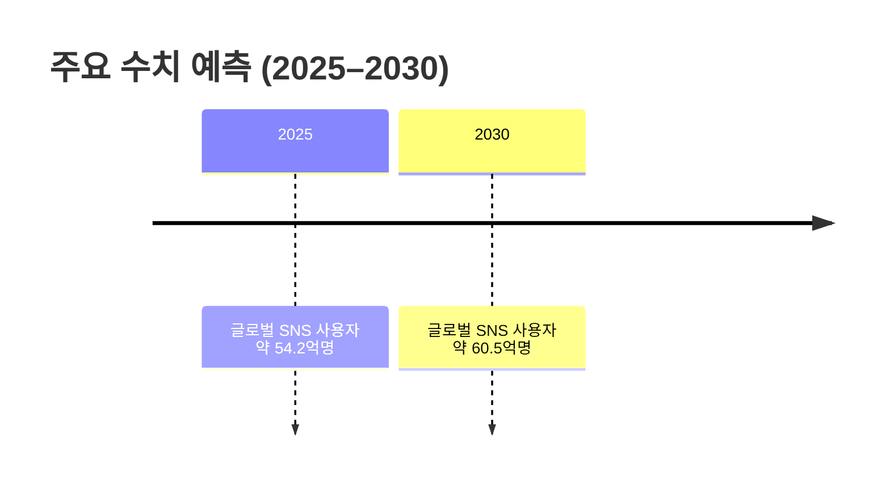
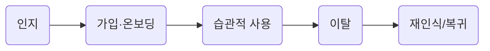

# 요약  
10대·20대 등 Z세대를 중심으로 한 **프라이빗 그룹 일상 공유 서비스**는 작년부터 국내에서 급부상 중이다. 글로벌 소셜미디어 사용자 수는 2025년 약 54.2억명, 2030년 약 60.5억명으로 성장할 것으로 전망된다. 한국은 약 5천만명 규모의 SNS 이용자 시장으로, 디지털광고·소셜미디어 시장이 2025년 약 65억 달러로 평가된다. 이 중 10대·20대 비중은 전체 인구의 약 13~14% 수준(10대 약 5백만명, 20대 약 7백만명 추산)이며, **프라이빗 일상 공유** 서비스의 핵심 타깃이다. 주요 서비스(예: 한국의 *셋로그(Setlog)*, 글로벌 *BeReal*)는 유사한 니즈(친구끼리 솔직한 일상 공유)를 겨냥한다. 이 보고서에서는 TAM 및 사용자 분석, 이탈 요인과 해결책, 보상형 모델 사례 등을 종합 평가하였다.  

## 시장 규모 (TAM/SAM/SOM)  
- **글로벌 TAM:** 전 세계 SNS 사용자 약 54.2억명(2025)에서 60.5억명(2030). 짧은 영상 플랫폼 시장(모바일 영상 공유) 규모는 2025년 약 22억 달러, 2030년 약 40억 달러로 성장할 전망이다(연평균 12%대 성장)[^20^].  
- **한국 TAM:** 한국 인터넷 사용자는 약 5,060만명(2025년)이고, SNS 이용자는 약 4,890만명(94.7%)이다. 디지털 광고·소셜미디어 시장은 2025년 약 65억 달러로 성장할 것으로 Ken Research가 분석했다. 10대·20대(13~29세)는 전체 인구의 ~14%에 달하며, 이들만 따로 떼어 놓은 SAM 수치를 구체적으로 제시한 공식 자료는 없다. (※명시적 SAM/SOM 추산 자료 미발견)  
- **세그먼트 TAM:** 10대(10–19세) ~5백만명, 20대(20–29세) ~7백만명(한국)로 대략 추정된다. *BeReal*이나 *Setlog* 같은 앱의 이용자 중 10대·20대가 93%를 차지했다는 조사도 있다. 이를 바탕으로, 10대·20대 그룹에 특화한 프라이빗 공유 서비스의 SAM은 수백만~천만 단위로 추산할 수 있다.  

※Global TAM 출처: BusinessStats(Statista, DataReportal 등 종합); 한국 시장 출처: InterAd DataReportal, Ken Research. *SAM/SOM* 자료는 특별 보고서가 없었으므로 추정치 기반 설명 위주로 정리하였다.  

## 사용자 니즈·페인포인트 및 행동 단계  
- **니즈:** 친밀한 친구·가족끼리 자신의 일상을 *자연스럽고 꾸밈없이* 공유하고 싶어한다. 기존 SNS(인스타그램 등)처럼 잘 꾸민 사진보다, 소소한 일상의 순간(출근길, 점심, 운동 등)을 공유하려는 경향이 있다. 한 이용자는 “인스타그램은 가장 예쁜 사진을 고르는 데 강박이 있었는데, *셋로그*는 마치 ‘생얼’처럼 편한 기분”이라고 평가했다. 즉, 부담 없는 진짜 일상 공유에 대한 수요가 크다.  
- **고객 유형:** Z세대(10·20대), 커플, 가족 등 소수 친밀 그룹을 중심으로 나뉜다. 예컨대 *Setlog* 이용자 중 10대가 55%, 20대가 38%로 93%가 청년층이었다. 결혼·육아 중인 30·40대는 가족 공유(BackThen 등)로 일부 대응한다.  
- **행동 단계:**  
  - **인지(Awareness):** 친구/언론을 통해 인지. 소셜미디어(코로나 후 가속화)나 미디어 기사(예: 셋로그·비리얼 기사)로 첫 접촉.  
  - **가입(Onboarding):** 친구끼리 초대장을 주고받으며 앱 가입. 초기엔 친밀도가 높은 소수 인원이 그룹을 구성한다.  
  - **습관적 사용(Habitual Use):** 정해진 시간(예: 매일 1회, 1시간 간격)에 짧은 영상을 찍어 올리거나 위치를 공유하는 루틴이 형성된다. 일정 수락 시간을 전날 알림으로 알려주는 앱도 있다. 일상 속에서 가볍게 참여하는 것이 중요하다.  
  - **이탈(Churn):** 초기에 재미가 있지만, 지나친 알림, 유사 콘텐츠 반복 등이 실증감으로 이어질 수 있다. 이 단계에서는 앱을 닫고 알림을 끄거나, 다운로드 후 사용하지 않는 사용자가 늘어난다.  

## 이탈 원인 및 대응 전략  
1. **알림(Notifications) 과부하:** 과도한 알림이 사용자의 부담과 불안(anxiety)을 높여 이탈을 유발한다. 평균 스마트폰 사용자는 하루에 약 46개의 푸시 알림을 받는데, 여기에 추가 알림이 과하게 발생하면 사용자는 **알림을 끄거나 앱을 포기**한다는 연구도 있다. 한 연구에 따르면 뉴스 알림 중 너무 많거나 도움이 안 된다는 이유로 알림을 끄는 사용자가 전체의 43%에 달했다.  
   - *비보상형 솔루션:* 알림 빈도·방식을 개선한다. 예를 들어 알림을 묶어 보내는 **알림 요약(Digest)**, 중요도별 선택적 발송, 사용자의 세부 선호 조정 기능 등이 있다. 카카오톡 등 메신저 앱은 개별 채팅방별로 알림을 끄거나, 전체 알림을 OFF 할 수 있는 기능을 지원한다. (*예:* 카톡 대화방 길게 누른 후 「알림 끄기」를 하면 해당 방 푸시가 중단된다.) iOS/안드로이드도 ‘집중 모드’나 ‘요약 알림’ 같은 편의 기능으로 사용자 스트레스를 줄이고 있다.  
   - *보상형 솔루션:* **인센티브 제공**. 예컨대 알림을 켜놓으면 앱 내 포인트·스티커·쿠폰을 주는 방식이 가능하다. 일부 메신저나 게임에서는 출석체크 포인트를 주듯이, 알림 동의 사용자에게 보상을 제공할 수 있다. (아직 관련 사례 데이터는 드물다.)  

2. **콘텐츠 단조·피로감:** 반복적·평범한 콘텐츠는 흥미를 떨어뜨린다. *BeReal* 사용자는 “같은 형식의 콘텐츠가 계속 나오면 지루해졌다”고 지적했으며, TikTok 내부 문서도 “사용자가 좋아하는 영상 유형만 계속 보내면 금세 지루해 앱을 종료한다”고 보고했다. 반복성은 이탈을 촉진하며, 다양한 콘텐츠 공급이 중요하다.  
   - *비보상형 솔루션:* **알고리즘·UX 개선**으로 새로움을 제공한다. 예컨대 TikTok은 뉴스피드(For You Page)를 다양화해 같은 유형만 연속 노출되지 않도록 설계했다. 페이스북/인스타그램은 AI 추천·스토리, 인스타그램 Reels 같은 새로운 포맷을 지속 추가하고, 위치·퀴즈·AR 필터 등 재미 요소를 도입해 사용자의 흥미를 유지한다.  
   - *보상형 솔루션:* **콘텐츠 제작자 인센티브**. 크리에이터에게 수익 공유를 제공하면 고품질·새로운 콘텐츠 유입을 유도할 수 있다. 예를 들어 TikTok은 크리에이터 펀드를 조성하여 인기 영상 제작자에게 보상을 제공(금전적 수익 공유)한다. SNS 그룹 공유 앱에도 비슷한 후원 시스템(스티커 구매, 유료 구독 등)이나 게임 요소를 적용해 적극적 참여를 유도할 수 있다.  

## 보상형 모델 및 유료 전환 사례  
- **BackThen (전 Lifecake):** 영국 개발 ‘가족 사진 공유’ 앱. 무료 플랜(1GB)과 유료 플랜(월 $6.49/200GB)을 제공한다. 현재 2억4천9백만여 개의 사진·영상이 저장되어 있어(전세계 서비스) 일정 가입자층이 존재함을 시사한다. 가족 단위 이용자에게 추억 보관 및 인화 서비스(사진책)를 패키지로 제공하며, 구독(또는 사진 인화 매출)으로 수익화한다.  
- **Between:** 한국 개발 ‘커플 전용 SNS’로 전세계 3,500만 커플 이용자를 확보했다. 광고가 없으며, 커스텀 이모티콘·테마 등 인앱 구매(Item)로 수익을 창출했던 것으로 알려졌다(※구체적 유료 전환률은 비공개). 노이즈 없는 친밀 공간을 무기로 이용자를 유지하고 있다.  
- **Zenly (Snap):** 위치공유 SNS. Snap이 2017년 2.13억 달러에 인수하여 분리 운영했다. 인수 당시 사용자 수 백만에서 2022년 약 4,000만 MAU까지 성장했으나, 수익모델이 전무해 서비스가 2023년 종료되었다. 성장세는 증명했으나 **수익화 모델 미비**가 단점으로 지적되었다.  
- **(비교 예시)** 주요 글로벌 SNS는 프리미엄 기능이나 크리에이터 수익 배분으로 유료화를 검토 중이다. *BeReal*은 2022년 1,500만 사용자 당시 광고 대신 유료 기능·구독 모델을 검토했다. 틱톡·유튜브 등은 광고수익 공유 및 후원 메커니즘(별풍선, 슈퍼챗)으로 영향력 있는 사용자의 참여를 유도한다. 이 외에도 Patreon·OnlyFans 같은 플랫폼에서 일부 사용자들은 친구·팬 그룹 공유를 위해 정기 구독을 선택하고 있다. 이처럼 **유료 전환 사례**는 대부분 프리미엄 기능(대용량 저장, 맞춤 스티커)이나 크리에이터 보상(수익 배분, 후원) 형태로 나타난다.  

| 서비스        | 타깃/형태        | 출시(국가) | 사용자 수/성장                    | 수익모델           | 주요 특징 (메트릭 등)                                         |  
|---------------|----------------|-----------|-----------------------------------|---------------------|------------------------------------------------------------|  
| **Setlog**    | Z세대 그룹 공유 (영상+위치) | 2026 (KR) | 국내 앱스토어 무료 1위 (20~30대 인기) | 무료(추정)          | 1시간마다 2초 짧은 영상 공유. 이용자의 93%가 10·20대.          |  
| **BeReal**    | Z세대 일상 공유 (영상)      | 2019 (FR) | 2024년 약 4천만명 활성 사용자 (Voodoo 인수 시 기준) | 검토 중(광고無, 구독 검토) | 하루 1회 랜덤 알림 후 촬영·공유. *“콘텐츠가 심심해질 수 있다”*는 이용자 의견 존재. |  
| **BackThen (Lifecake)** | 가족 사진 공유        | 2012 (UK) | 2.49억 개 이상의 사진·영상 (서비스 총계) | 구독제 ($6.49/월 → 200GB) | 무제한 고화질 저장·가족 공유. 월 6.49달러 VIP 구독(200GB 추가). 전세계 93% 국가 서비스. |  
| **Between**   | 커플 전용 SNS    | 2011 (KR) | 3,500만 쌍 이상 이용     | 인앱 구매(스티커 등)    | 커플만의 비공개 공간, 광고 없음. 데이트 카운터·프라이버시 강조.      |  
| **Zenly**     | 위치 공유 SNS    | 2015→2017 (FR→Snap) | 2022년 MAU 4천만 (Snap 전체의 8%) | 없음 (수익화 실패)    | Snap 인수(2.13억$) 후 5년간 성장했으나, 수익모델 부재로 2023년 서비스 종료. |  

**도표 설명:** 사용자의 인식→가입→습관적 사용→이탈→재인식(재유입)의 여정을 단계별로 나타낸 예시 흐름이다.  

**참고:** 모든 수치와 인용은 각주 표시된 출처에 기반한다. SAM/SOM 구체치 미상인 항목은 명시하였으며, 출처 없는 추정치는 별도 표기하였다.