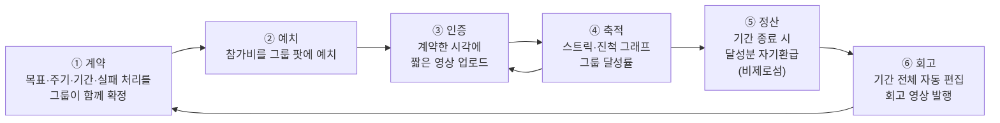
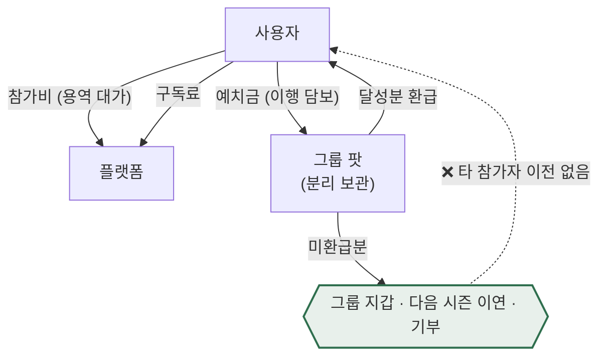

# 보상형 그룹별 일상 숏폼 공유 플랫폼 — 아이디어 정의서

> 작성일: 2026-08-09
> 지리적 범위: 대한민국 / 통화: KRW
> **문서 위치:** 본 문서는 아이디어의 **원본 정의서(anchor)**다. 시장 규모·세그먼트 근거는 아래 선행 문서에 있으며, 여기서는 **무엇을 만들 것인가**만 확정한다.
>
> | 관련 문서 | 역할 |
> |---|---|
> | `시장분석 종합보고서 (TAM-SAM-SOM).md` | 시장 규모 · 세그먼트 맵 · SOM 확정 — **본 문서의 수치 근거** |
> | `리서치 원본/` | 초기 탐색 리서치 원문. **채택 수치는 종합보고서 기준** |
>
> **최종 확정안 기준** — 정산 구조·진입 세그먼트·SOM은 08 고객가치선언문 단계에서 확정된 내용을 반영했다(비제로섬 자기환급 · Y1 = F1 · SOM 33억).

**표기 규약** (선행 문서와 동일): `[실측]` 1차 출처 직접 확인 / `[추정]` 실측치 + 명시 가정으로 계산 / `[러프]` 유사 시장 대입, 오차 ±50% 이상

---

## 0. 한 줄 정의

> **그룹이 함께 목표를 계약하고, 짧은 영상으로 서로에게 인증하고, 목표를 달성하면 현금성 보상으로 정산받는 그룹 단위 습관 플랫폼.**

셋로그가 만든 **"소수 그룹 × 짧은 영상 × 정기 공유"**라는 형식을 가져오되, 그 형식을 **친목이 아니라 자기계약의 이행 수단**으로 재배치한다.

---

## 1. 왜 이 아이디어인가 — 해결하려는 문제

선행 세분화 맵은 이 카테고리의 이탈 원인을 두 개로 압축했다.

| 코드 | 페인포인트 | 표면 증상 | **근본 원인** |
|---|---|---|---|
| **P1** | 알림 트리거의 강박 | 알림 피로, 알림 OFF, 앱 삭제 | **트리거 소유권이 플랫폼에 있음** — "내가 언제 찍을지를 내가 못 정한다" |
| **P2** | 콘텐츠 반복성의 지루함 | "매일 똑같은 게 올라온다" | **반복이 아무것도 축적하지 않음** — 어제의 기록이 오늘 아무 의미도 만들지 않음 |

**이것이 구조적 문제라는 증거** `[실측]`
- BeReal: DAU **-48%**, 재참여율 **19%**로 붕괴
- Zenly: MAU 4,000만까지 성장했으나 **수익모델 부재**로 2023년 서비스 종료
- 셋로그: 광고비 0원으로 국내 앱스토어 무료 1위, 카테고리 도달 **778만 / 1,450만 = 54%** — 즉 **수요는 증명됐고, 유지와 수익화가 미해결**이다

> **핵심 통찰:** 이 시장의 미해결 과제는 "사람을 모으는 것"이 아니다. 셋로그가 이미 증명했다. 미해결은 **모인 사람을 남기는 것(P1·P2)**과 **남은 사람에게서 돈을 버는 것(Zenly의 사인)**이다. 본 아이디어는 두 문제를 **하나의 장치 — 목표 계약과 정산 —**로 동시에 푼다.

---

## 2. ⚠️ 원안에서 바뀐 것 — 가장 중요한 설계 결정

원안은 **"짧은 영상을 공유할 때마다 포인트 적립"**이었다. 이를 **"계약한 목표를 달성했을 때 정산"**으로 확정한다.

### 2.1 왜 바꿨는가

Deci, Koestner & Ryan(1999) 메타분석은 **이미 내재적으로 동기부여된 활동에 유형(tangible) 보상을 붙이면 내재 동기가 실질적으로 훼손된다**는 것을 입증했다(과잉정당화 효과) `[실측]`.

> 친구와의 일상 공유는 **이미 내재 동기가 있는 활동**이다. 여기에 현금을 붙이면 관계가 화폐화되어 이탈이 오히려 가속된다. 즉 **"친구에게 영상 올리면 포인트"는 가장 직관적이면서 이론적으로 가장 위험한 설계**다.

같은 전도 현상이 Duolingo에서도 관측된다 — 사용자가 스트릭 연장을 **학습 자체보다 더 중요하게** 여기는 목적 전도 `[실측, Journal of Consumer Research]`.

### 2.2 무엇이 달라지는가

| | 원안 (공유 시 적립) | **확정안 (달성 시 정산)** |
|---|---|---|
| 보상이 붙는 대상 | 공유 행위 | **목표 달성** |
| 훼손되는 내재 동기 | 친구 관계 (있음 → 훼손) | **없음** (운동·습관 인증엔 애초에 재미가 없음) |
| 어뷰징 형태 | 무의미한 영상 양산 | 인증 위조 (난이도 훨씬 높음) |
| 영상의 역할 | 보상 청구 수단 | **달성의 증빙 + 그룹의 상호 감시** |
| 세분화 맵 좌표 | Q4 현행 SNS 존 ⛔ | **Q1 자기계약 존 ★** |

**영상 공유를 없애는 게 아니다.** 영상은 여전히 매일 올라간다. 다만 그것이 **포인트를 청구하는 행위**가 아니라 **목표 달성을 입증하는 행위**가 된다. 사용자 경험상 화면은 거의 같고, 동기 구조만 뒤바뀐다.

> **⚠️ 이 결정은 반증 가능하게 설계할 것.** 과잉정당화 효과의 *크기*에는 학계 논쟁이 있다(Cameron & Pierce 반론 ↔ Deci 등 재반박). 원안(공유 시 적립)을 소규모 A/B 셀로 남겨 실측할 것.

---

## 3. 제품 컨셉 — 핵심 루프



### 3.1 각 단계가 어떤 페인포인트를 푸는가

| 단계 | 사양 | 푸는 문제 |
|---|---|---|
| **① 계약** | 주기 '선택'이 아니라 **'계약'**. 시작 시 요일·시각·기간·실패 시 처리를 함께 확정하고 **계약 중에는 변경 불가**(자기구속) | **P1** — 트리거 소유권을 플랫폼에서 사용자에게 완전 이전. 알림은 "플랫폼의 명령"이 아니라 **"내가 과거에 한 약속"**이 된다 |
| **② 예치** | 참가비를 그룹 공동 팟에 예치. 100% 달성 시 **전액 환급** | 실행 의지를 금전으로 고정. 동시에 **보상 재원을 외부 광고 없이 자립** |
| **③ 인증** | 계약 시각 ±윈도우 내 짧은 영상 촬영. 위조 난도가 GPS보다 높음 | 그룹 상호 가시성 = 사회적 압력 |
| **④ 축적** | 스트릭 카운터 + 진척 그래프 + 그룹 달성률 보드 | **P2** — 반복을 **자산화**. 오늘의 기록이 내일의 숫자를 바꾼다 |
| **⑤ 정산** | 달성률에 따라 환급. **미환급분은 다른 참가자에게 이전하지 않는다**(비제로섬 자기환급) | **수익화** — Zenly가 실패한 지점 |
| **⑥ 회고** | 기간 종료 시 전체 영상 자동 편집 회고본 발행 | **P2** — 반복의 결과물이 손에 잡히는 형태로 남음 |

### 3.2 스트릭 전도 방어

스트릭이 기저 활동(운동)보다 중요해지면 목적 전도가 발생한다. **스트릭 상실 페널티에 상한을 두고, 복구권(streak freeze)을 제공**한다 `[Decision Lab, 'Streak Creep']`.

---

## 4. 타깃 — 친구 목표 크루 (F1)

**Y1 진입 세그먼트는 `F1` 친구 목표 크루 108만 명 단독이다.**

| 항목 | 값 |
|---|---|
| **정의** | 이미 형성된 친구 그룹이 관계 밖의 목표(운동·다이어트·공부)를 **함께 계약하고 인증하는** 집단 |
| **모집단** | **F1 친구 목표 크루 108만 명** `[추정]` / Q1 자기계약 존 전체 386만, 중복 제거 시 **232만** |
| **왜 F1이 먼저인가** | ① P1·P2가 구조적으로 낮음 ② **인증 행위에 내재 동기가 없어 과잉정당화 위험 없음** ③ **그룹이 이미 형성돼 있어 CAC가 가장 낮다** — 크루는 학급처럼 자동으로 생기지 않으므로, 개인 기원(A계열)의 최대 약점이 획득이다 |
| **보상 수용률** | 재테크 경험자 중 앱테크 이용률 **51.1%**, Z세대 **62.4%** `[실측]` → 본 세그먼트에 55% 적용 |

> **⚠️ 초기 판단에서 바뀐 것** — 처음에는 점수가 가장 높은 **A1 루틴 커미터(128만)**를 1차 타깃으로 잡았다. 이후 **획득 비용**을 함께 보자 순서가 바뀌었다. A1은 기회점수 최고(DOS 2.21)지만 **그룹을 새로 만들어 줘야 하고**, F1은 그룹이 이미 있다. **점수가 아니라 진입 순서의 판단이며, A1은 Y2로 이연한다.**

### 확장 경로

```
Phase 1 (Y1)  F1 친구 목표 크루 108만 — 그룹이 이미 있는 곳부터
Phase 2 (Y2)  + F2 스터디 팟 · A1 루틴 커미터 · F3 페널티 팟 그룹
Phase 3 (Y3)  + A2 기한 스프린터 · 조직(B2B) 계약 — 예산 기반 재원
회피          D1 강제 트리거 유저 / C2 데일리 크루 — 과잉정당화 위험 최대 구역
              (단 C2는 직접 타깃이 아니라 F1·F2로의 전환 공급원)
```

> **⚠️ 아이러니 하나를 기록해 둔다.** 금액이 가장 큰 세그먼트는 C2 데일리 크루(**235억원**)이고, 이것이 셋로그의 실제 사용자층이다. 그럼에도 보상형 모델로는 접근하지 않는다 — 과잉정당화로 관계 자체가 훼손되기 때문. **이 배제 판단은 §2.2의 A/B 셀로 반증 가능하게 설계할 것.**

---

## 5. 수익 구조 (확정)

### 5.1 채택 — 2개 축

| # | 수익원 | 과금 대상 | 산정 근거 | 규모 `[추정]` |
|---|---|---|---|---|
| **R1** | **그룹 단위 프리미엄 구독** | 그룹장 또는 개인 | SAM 800만 × 유료 전환 3% × 연 75,000원 | **약 180억원** |
| **R2** | **챌린지 참가비 take** | 챌린지 참가자 | 챌린저스 연 GMV 500억 수준 × take 12% | **약 60억원** |

**R1 프리미엄 구독 — 유료화 대상 후보**
- 영상 보관 기간 무제한 (무료: 30일)
- 그룹 인원 상한 해제
- 자동 편집 회고본 고화질 발행·다운로드
- 상세 진척 분석 / 그룹 리더보드
- 복구권(streak freeze) 추가 지급

> 벤치마크 — BackThen 월 $6.49(200GB), Between 인앱 구매(스티커·테마) `[실측]`

**R2 참가비 take — 정산 규칙 (확정)**
```
참가비(용역 대가)와 예치금(이행 담보)을 분리해서 받는다.

예치금 → 기간 종료 시
  ├ 100% 달성  → 전액 환급
  ├ 부분 달성  → 달성률 비례 환급
  └ 미환급분   → 그룹 지갑 · 다음 시즌 이연 · 기부 중 선택
                 ❌ 다른 참가자에게 이전하지 않는다 (비제로섬)

플랫폼 수익 = 참가비 take 12%
  → 재원이 "타인의 몰수금"이 아니라 "본인이 낸 참가비"다
```

### 5.2 배제 — 2개 축과 그 대가

| 배제한 수익원 | 배제 이유 | **잃는 것** |
|---|---|---|
| 브랜드 스폰서 챌린지 | 광고주 영업 의존, 사용자 경험 오염 | 선행 문서 기준 **약 400억원** — 단일 최대 수익원 |
| 리워드 광고 오퍼월 | '앱테크 앱' 이미지가 일상 공유 UX와 충돌 | ARPU가 캐시워크 수준(5,470원)에 수렴할 위험은 회피 |

> ### ⚠️ 이 선택이 시장 규모에 미치는 영향 — 반영 완료
>
> 광고 축 2개를 배제하면 시장 SAM 700억(광고 400억 포함)이 다음으로 좁아진다:
>
> ```
> 접근 가능 SAM = 구독 180억 + 참가비 take 60억 ≈ 240억원   [추정]
> → SAM 700억 → 약 240억 (−66%)
> ```
>
> **SOM은 이 좁아진 SAM 기준으로 재산정을 마쳤다** — 시장분석 종합보고서 §7 참조.
>
> | | 값 |
> |---|---|
> | **3년차 SOM (기준)** | **연 33억원** — MAU 37.1만 × ARPU 9,000원 |
> | 밴드 | 보수 20억 / 낙관 61억 |
> | 접근 가능 SAM(240억) 대비 | **13.8%** — 신규 진입자 3년 점유율로 합리적 범위(5~15%) 안 ✅ |
>
> **이 선택이 사는 것** — 광고주 영업 없이 **Day 1부터 재원이 자립**하고, Zenly형 *"수익모델 부재로 종료"* 리스크가 구조적으로 제거된다. **시장은 좁아지지만 생존은 확실해진다.**

### 5.3 자금 흐름 — 비제로섬 폐쇄 루프



> **구조적 특징:** 보상 재원에 **외부 광고주가 없다.** 광고 영업 없이 자립하되, **참가자 사이의 득실 이전이 없다** — 내가 실패해도 그 돈이 남에게 가지 않고, 남이 실패해도 내 몫은 늘지 않는다.
>
> **왜 제로섬을 버렸나** — 초기 설계는 *"미달성 몰수분 ⅔를 달성자 상금으로"*였다. 세 가지가 이를 뒤집었다: ① 경쟁 9곳 중 **제로섬 현행 운영사 0곳**이고 챌린저스는 흑자를 낸 뒤 스스로 버렸다 ② *"못 한 사람 돈을 내가 먹는 거잖아요"*라는 거부가 **예치 이탈의 독립 원인**으로 확인됐다 ③ 사행성 심사에서 *"재물의 득실"* 요건에 정면으로 걸린다.
>
> ⚠️ **온보딩 카피 주의** — *"거는 돈이 아니라 맡기는 돈"*, *"원금 보장"* 류 표현은 **유사수신 규제(장래에 원금 전액 이상 지급을 약정)** 요건에 근접하므로 쓰지 않는다. 대신 **"달성률만큼 돌려받는 이행 담보"**로 설명한다.

---

## 6. 보상 설계

| 항목 | 확정 |
|---|---|
| **지급 트리거** | **목표 달성 시 정산** (공유 시 적립 아님 — §2) |
| **교환 형태** | **원 결제수단으로의 환급만.** ⚠️ 포인트·기프티콘 전환은 **Y1 배제** — 포인트 경제를 만드는 순간 전자금융거래법상 **선불전자지급수단 등록**과 충전금 100% 별도관리 의무에 진입한다 |
| **재원** | **환급 재원 = 본인이 낸 예치금** + 플랫폼 수익 = 참가비 take·구독료 (외부 광고 재원 없음, **타인의 몰수금 아님**) |
| **디지털 재화** | 채택하지 않음 — 다만 §5.1 구독 특전으로 일부 흡수 |

### 6.1 현금성 단독 선택의 득실

**얻는 것** — 동기 부여가 가장 강력하고, 앱테크 수용층(Z세대 62.4% `[실측]`)과 정확히 맞물린다. "보상형"이라는 차별점이 흐려지지 않는다.

**치러야 할 비용**
1. **원가 부담** — 환급 재원이 **본인이 맡긴 예치금**이므로 플랫폼의 순비용은 0에 가깝다. 이것이 현금성 단독을 택할 수 있게 해주는 유일한 조건이다.
2. **어뷰징 방어 비용** — 현금이 걸리면 인증 위조 시도가 반드시 발생한다.
3. **정산 인프라** — 환급의 실시간 정확성이 곧 신뢰다. 여기서 한 번 사고가 나면 회복이 어렵다. ⚠️ 자금정산에 직접 관여하면 **전자지급결제대행업(PG) 등록** 대상이 될 수 있어, PG·에스크로 위탁 구조가 전제다.
4. **유인 약화 위험** — 비제로섬은 *"벌 수 있다"*는 유인을 포기한다. 챌린저스는 **제로섬으로** 누적 거래액 5,000억을 만들었다. **이것이 이 선택의 최대 반대 증거이며 인터뷰로 확인해야 한다.**

### 6.2 어뷰징 방어 (필수 사양)

| 벡터 | 방어 |
|---|---|
| 과거 영상 재업로드 | 촬영 시점 서버 검증 · 갤러리 업로드 차단 (실시간 촬영만) |
| 타인 영상 도용 | 영상 해시 중복 검사 |
| 유령 그룹 (자기 계정 다수) | 그룹 생성 시 본인 인증 · 기기 지문 · 동일 결제수단 탐지 |
| 담합 (서로 인증 눈감아주기) | 그룹 내 상호 검증 + 랜덤 샘플 심사 |
| 대리 인증 | 얼굴 일관성 검사 (동일 챌린지 내) |

> ⚠️ 위 목록은 **MVP 필수**다. 현금성 보상을 붙이면서 이것들을 나중으로 미루면, 초기 사용자 풀이 어뷰저로 오염되어 회복 불가능해진다.

---

## 7. 포지셔닝 — 무엇과 어떻게 다른가

| | 셋로그 / BeReal | 챌린저스 | **본 서비스** |
|---|---|---|---|
| **핵심 활동** | 친목 (일상 공유) | 습관 인증 | **습관 인증 + 그룹 공유** |
| **트리거** | 플랫폼 소유 ⛔ | 사용자 계약 ✅ | **그룹 공동 계약** ✅ |
| **콘텐츠 형식** | 짧은 영상 ✅ | 주로 사진 | **짧은 영상** ✅ |
| **관계 구조** | 친한 소수 그룹 ✅ | 익명 다수 | **친한 소수 그룹** ✅ |
| **보상** | 없음 ⛔ | 참가비 환급 + 상금(제로섬) | **비제로섬 자기환급** |
| **반복의 축적** | 없음 ⛔ | 달성률 | **스트릭 + 진척 + 회고 영상** ✅ |
| **수익모델** | 미확립 ⛔ | 참가비 take | **구독 + take** ✅ |

> **차별화 문장:** 셋로그는 그룹과 영상은 있지만 **이유가 없고**, 챌린저스는 이유는 있지만 **그룹과 영상이 없다.** 본 서비스는 **셋로그의 형식에 챌린저스의 이유를 결합**한다.

---

## 8. 리스크 — 미해결 항목

우선순위: 🔴 진입 전 반드시 해소 / 🟡 MVP 중 해소 / 🟢 관찰

| | 리스크 | 내용 | 대응 방향 |
|---|---|---|---|
| 🔴 | **전자지급결제대행업(PG) 등록** | 참가비를 받아 성패로 환급액을 계산해 지급하는 것은 **그 자체가 자금정산**이다. 유권해석상 자금정산에 관여하면 PG 등록 대상 | **PG·에스크로에 자금 보관·정산 실행을 전부 위탁**하고 자사는 달성률만 전달. **비제로섬과 무관하게 발생하는 구조적 리스크이자 일정의 임계 경로** |
| 🔴 | **사행성 규제** | 참가비를 걸고 결과에 따라 재분배하는 구조 | **득실의 상호성 제거** — 비제로섬으로 참가자 사이의 재물 이전을 없앴다(*"노력이라 우연이 아니다"*는 논거는 약하다). ⚠️ **제로섬을 선택지로도 열지 않는다** — 형법 §247은 개설 행위 자체를 벌한다 |
| 🔴 | **유사수신** | *"달성하면 전액 환급"*이 **원금 전액 이상 지급 약정** 문언에 근접 | 참가비(용역 대가)와 예치금(이행 담보) **분리** · 원금 초과 금전 보상 없음 · *"원금 보장"* 카피 금지. ⚠️ **비제로섬 선택이 오히려 이 위험을 올렸다** |
| 🔴 | **약관 무효** | 미환급분을 위약금 몰수로 규정하면 약관규제법상 **전부 무효**(감액 아님) 위험 | *"제공 역무의 대가"*로 성격 규정 + 반환 산식을 약관에 명시 |
| 🟡 | **전자금융거래법 (선불업)** | 포인트·이연 크레딧을 만들면 선불전자지급수단 해당 가능 | **Y1은 원 결제수단 환급만.** 포인트 경제 미도입 |
| 🟡 | **세무** | 원천징수·예치금 부채 인식·미환급금 수익 인식 시점 | 회계·세무 자문 별도 |
| 🟡 | **유인 약화** | 비제로섬은 *"벌 수 있다"*는 유인을 포기한다 | 첫 시즌 **참가비 0원 체험**으로 진입 문턱을 대신 낮춘다. ⚠️ 챌린저스는 제로섬으로 5,000억을 만들었다 — **인터뷰로 확인 필요** |
| 🟡 | **어뷰징** | 현금이 걸리면 반드시 발생 | §6.2 방어 사양 MVP 포함 (단 **얼굴 일관성 검사는 민감정보 쟁점으로 Y1 배제**) |
| 🟢 | **과잉정당화 판단 자체** | 배제 결정이 이론 하나에 걸려 있음 | A/B 셀로 반증 가능하게 |
| 🟢 | **개인정보** | 영상에 얼굴·장소 포함, 미성년 사용자 가능성 | 보관 기간 상한 · 그룹 외 노출 차단 · 만 14세 미만 정책 |

---

## 9. 다음 단계

| # | 과업 | 이유 |
|---|---|---|
| **1** | **자금 흐름 3변수 확정** — ① 예치금 보관 주체(자사/PG/신탁) ② 미환급분 귀속(그룹 지갑/이연/기부) ③ 참가비·예치금 분리 여부 | 🔴 **법률 문제가 아니라 경영 결정**이다. 이것 없이는 자문 질문 자체가 성립하지 않는다 |
| **2** | **사행성·전금법 법률 자문** (+ 금융위 법령해석 신청 검토) | 🔴 부정되면 R2(참가비 take) 전체가 무너진다 — 진입 전 최우선 |
| 3 | 수요 검증 — **F1 친구 목표 크루** 대상 참가비 지불의사(WTP) 조사 | 구독 전환 3%·GMV 가정의 실측 근거 확보 |
| 4 | MVP 범위 확정 및 화면 설계 | §3 루프 6단계 + §6.2 어뷰징 방어 |
| 5 | A/B 셀 설계 — 원안(공유 시 적립) vs 확정안(달성 시 정산) | §2.2 배제 판단의 반증 |

---

## 부록. 한 장 요약

| 항목 | 확정 |
|---|---|
| **한 줄 정의** | 그룹이 목표를 계약하고, 짧은 영상으로 인증하고, 달성하면 현금성 보상으로 정산받는 그룹 단위 습관 플랫폼 |
| **푸는 문제** | P1 알림 강박(트리거 소유권 이전) · P2 반복의 지루함(반복의 자산화) · Zenly형 수익모델 부재 |
| **Y1 타깃** | **F1 친구 목표 크루 108만 명** (A1 루틴 커미터 128만은 Y2로 이연 — 획득 비용 판단) |
| **보상 트리거** | **목표 달성 시 정산** (공유 시 적립 ❌) |
| **정산 구조** | **비제로섬 자기환급** — 달성률만큼 본인에게 환급, **미환급분을 타 참가자에게 이전하지 않는다** |
| **환급 형태** | **원 결제수단 환급만** (포인트·기프티콘 전환은 Y1 배제 — 선불업 등록 회피) |
| **수익 구조** | R1 그룹 프리미엄 구독(180억) + R2 **참가비** take 12%(60억) — 몰수금이 아니라 참가비에서 |
| **접근 가능 SAM** | **약 240억원** `[추정]` — 광고 배제로 700억에서 축소 |
| **3년차 SOM** | **연 33억원** `[추정]` — 밴드 20~61억 · 접근가능 SAM 대비 13.8% |
| **최대 리스크** | 🔴 **PG 등록**(자금정산 관여) · 사행성·유사수신 — 부정 시 R2 붕괴 |
| **핵심 원칙** | 보상은 **공유가 아니라 달성**에 붙인다 — 관계를 화폐화하지 않는다 |
