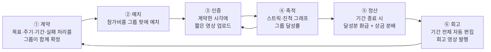
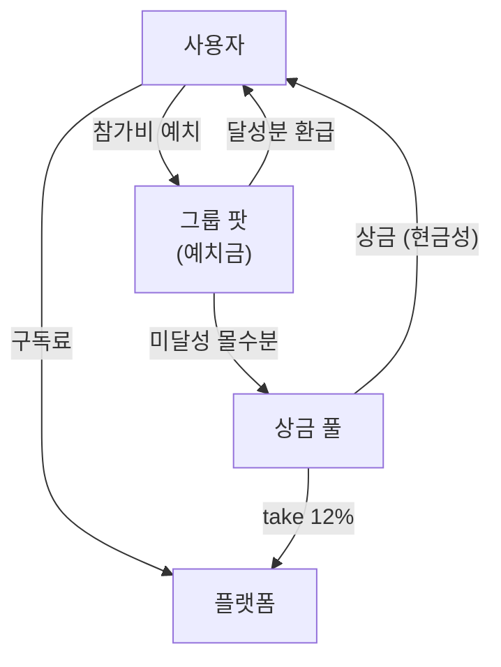

# 보상형 그룹별 일상 숏폼 공유 플랫폼 — 아이디어 정의서

> 작성일: 2026-08-09
> 지리적 범위: 대한민국 / 통화: KRW
> **문서 위치:** 본 문서는 아이디어의 **원본 정의서(anchor)**다. 시장 규모·세그먼트 근거는 아래 선행 문서에 있으며, 여기서는 **무엇을 만들 것인가**만 확정한다.
>
> | 선행 문서 | 역할 |
> |---|---|
> | `TAM-SAM-SOM 및 타겟 세그먼트 분석.md` | 시장 규모·세그먼트 매력도 |
> | `SAM 시장 세분화 맵(Market Segment Map).md` | 페인포인트 원인 분해 · 2×2 세분화 · SOM 확정 |
> | `지피티 리서치.md` / `제미나이 리서치.md` / `클로드 리서치` | 원자료 리서치 |

**표기 규약** (선행 문서와 동일): `[실측]` 1차 출처 직접 확인 / `[추정]` 실측치 + 명시 가정으로 계산 / `[러프]` 유사 시장 대입, 오차 ±50% 이상

---

## 0. 한 줄 정의

> **그룹이 함께 목표를 계약하고, 짧은 영상으로 서로에게 인증하고, 목표를 달성하면 현금성 보상으로 정산받는 그룹 단위 습관 플랫폼.**

셋로그가 만든 **"소수 그룹 × 짧은 영상 × 정기 공유"**라는 형식을 가져오되, 그 형식을 **친목이 아니라 자기계약의 이행 수단**으로 재배치한다.

---

## 1. 왜 이 아이디어인가 — 해결하려는 문제

선행 세분화 맵은 이 카테고리의 이탈 원인을 두 개로 압축했다.

| 코드 | 페인포인트 | 표면 증상 | **근본 원인** |
|---|---|---|---|
| **P1** | 알림 트리거의 강박 | 알림 피로, 알림 OFF, 앱 삭제 | **트리거 소유권이 플랫폼에 있음** — "내가 언제 찍을지를 내가 못 정한다" |
| **P2** | 콘텐츠 반복성의 지루함 | "매일 똑같은 게 올라온다" | **반복이 아무것도 축적하지 않음** — 어제의 기록이 오늘 아무 의미도 만들지 않음 |

**이것이 구조적 문제라는 증거** `[실측]`
- BeReal: DAU **-48%**, 재참여율 **19%**로 붕괴
- Zenly: MAU 4,000만까지 성장했으나 **수익모델 부재**로 2023년 서비스 종료
- 셋로그: 광고비 0원으로 국내 앱스토어 무료 1위, 카테고리 도달 **778만 / 1,450만 = 54%** — 즉 **수요는 증명됐고, 유지와 수익화가 미해결**이다

> **핵심 통찰:** 이 시장의 미해결 과제는 "사람을 모으는 것"이 아니다. 셋로그가 이미 증명했다. 미해결은 **모인 사람을 남기는 것(P1·P2)**과 **남은 사람에게서 돈을 버는 것(Zenly의 사인)**이다. 본 아이디어는 두 문제를 **하나의 장치 — 목표 계약과 정산 —**로 동시에 푼다.

---

## 2. ⚠️ 원안에서 바뀐 것 — 가장 중요한 설계 결정

원안은 **"짧은 영상을 공유할 때마다 포인트 적립"**이었다. 이를 **"계약한 목표를 달성했을 때 정산"**으로 확정한다.

### 2.1 왜 바꿨는가

Deci, Koestner & Ryan(1999) 메타분석은 **이미 내재적으로 동기부여된 활동에 유형(tangible) 보상을 붙이면 내재 동기가 실질적으로 훼손된다**는 것을 입증했다(과잉정당화 효과) `[실측]`.

> 친구와의 일상 공유는 **이미 내재 동기가 있는 활동**이다. 여기에 현금을 붙이면 관계가 화폐화되어 이탈이 오히려 가속된다. 즉 **"친구에게 영상 올리면 포인트"는 가장 직관적이면서 이론적으로 가장 위험한 설계**다.

같은 전도 현상이 Duolingo에서도 관측된다 — 사용자가 스트릭 연장을 **학습 자체보다 더 중요하게** 여기는 목적 전도 `[실측, Journal of Consumer Research]`.

### 2.2 무엇이 달라지는가

| | 원안 (공유 시 적립) | **확정안 (달성 시 정산)** |
|---|---|---|
| 보상이 붙는 대상 | 공유 행위 | **목표 달성** |
| 훼손되는 내재 동기 | 친구 관계 (있음 → 훼손) | **없음** (운동·습관 인증엔 애초에 재미가 없음) |
| 어뷰징 형태 | 무의미한 영상 양산 | 인증 위조 (난이도 훨씬 높음) |
| 영상의 역할 | 보상 청구 수단 | **달성의 증빙 + 그룹의 상호 감시** |
| 세분화 맵 좌표 | Q4 현행 SNS 존 ⛔ | **Q1 자기계약 존 ★** |

**영상 공유를 없애는 게 아니다.** 영상은 여전히 매일 올라간다. 다만 그것이 **포인트를 청구하는 행위**가 아니라 **목표 달성을 입증하는 행위**가 된다. 사용자 경험상 화면은 거의 같고, 동기 구조만 뒤바뀐다.

> **⚠️ 이 결정은 반증 가능하게 설계할 것.** 과잉정당화 효과의 *크기*에는 학계 논쟁이 있다(Cameron & Pierce 반론 ↔ Deci 등 재반박). 원안(공유 시 적립)을 소규모 A/B 셀로 남겨 실측할 것.

---

## 3. 제품 컨셉 — 핵심 루프



### 3.1 각 단계가 어떤 페인포인트를 푸는가

| 단계 | 사양 | 푸는 문제 |
|---|---|---|
| **① 계약** | 주기 '선택'이 아니라 **'계약'**. 시작 시 요일·시각·기간·실패 시 처리를 함께 확정하고 **계약 중에는 변경 불가**(자기구속) | **P1** — 트리거 소유권을 플랫폼에서 사용자에게 완전 이전. 알림은 "플랫폼의 명령"이 아니라 **"내가 과거에 한 약속"**이 된다 |
| **② 예치** | 참가비를 그룹 공동 팟에 예치. 100% 달성 시 **전액 환급** | 실행 의지를 금전으로 고정. 동시에 **보상 재원을 외부 광고 없이 자립** |
| **③ 인증** | 계약 시각 ±윈도우 내 짧은 영상 촬영. 위조 난도가 GPS보다 높음 | 그룹 상호 가시성 = 사회적 압력 |
| **④ 축적** | 스트릭 카운터 + 진척 그래프 + 그룹 달성률 보드 | **P2** — 반복을 **자산화**. 오늘의 기록이 내일의 숫자를 바꾼다 |
| **⑤ 정산** | 달성률에 따라 환급, 미달성 몰수분이 달성자 상금 재원 | **수익화** — Zenly가 실패한 지점 |
| **⑥ 회고** | 기간 종료 시 전체 영상 자동 편집 회고본 발행 | **P2** — 반복의 결과물이 손에 잡히는 형태로 남음 |

### 3.2 스트릭 전도 방어

스트릭이 기저 활동(운동)보다 중요해지면 목적 전도가 발생한다. **스트릭 상실 페널티에 상한을 두고, 복구권(streak freeze)을 제공**한다 `[Decision Lab, 'Streak Creep']`.

---

## 4. 타깃 — 운동·습관 챌린지 크루

선행 문서 2종이 **독립적으로 1순위로 지목한 세그먼트**다 (세분화 맵 A1 루틴 커미터 / TAM 문서 S4).

| 항목 | 값 |
|---|---|
| **정의** | 관계 밖의 목표(운동·기상·공부·금연 등)를 위해 스스로 촬영 주기를 계약하고 인증하는 집단 |
| **모집단** | A1 루틴 커미터 **128만 명** `[추정]` / Q1 자기계약 존 전체 209만, 중복 제거 시 **157만** |
| **왜 최적인가** | ① P1·P2가 구조적으로 낮음 ② **인증 행위에 애초에 내재 동기가 없어 과잉정당화 위험 없음** ③ 보상 수용률 높음 |
| **보상 수용률** | 재테크 경험자 중 앱테크 이용률 **51.1%**, Z세대 **62.4%** `[실측]` → 본 세그먼트에 55% 적용 |

### 확장 경로

```
Phase 1 (Y1)  A1 루틴 커미터 — 운동 루틴 코어
Phase 2 (Y2)  + A2 기한 스프린터(기한형 목표) + A3 페널티 팟 그룹
Phase 3 (Y3)  + B2 케어 리포터(요양·보육 증빙) — 기관 단위 계약
회피          D1 강제 트리거 유저 / C2 데일리 크루 — 과잉정당화 위험 최대 구역
```

> **⚠️ 아이러니 하나를 기록해 둔다.** 금액이 가장 큰 세그먼트는 C2 데일리 크루(**235억원**)이고, 이것이 셋로그의 실제 사용자층이다. 그럼에도 보상형 모델로는 접근하지 않는다 — 과잉정당화로 관계 자체가 훼손되기 때문. **이 배제 판단은 §2.2의 A/B 셀로 반증 가능하게 설계할 것.**

---

## 5. 수익 구조 (확정)

### 5.1 채택 — 2개 축

| # | 수익원 | 과금 대상 | 산정 근거 | 규모 `[추정]` |
|---|---|---|---|---|
| **R1** | **그룹 단위 프리미엄 구독** | 그룹장 또는 개인 | SAM 800만 × 유료 전환 3% × 연 75,000원 | **약 180억원** |
| **R2** | **챌린지 참가비 take** | 챌린지 참가자 | 챌린저스 연 GMV 500억 수준 × take 12% | **약 60억원** |

**R1 프리미엄 구독 — 유료화 대상 후보**
- 영상 보관 기간 무제한 (무료: 30일)
- 그룹 인원 상한 해제
- 자동 편집 회고본 고화질 발행·다운로드
- 상세 진척 분석 / 그룹 리더보드
- 복구권(streak freeze) 추가 지급

> 벤치마크 — BackThen 월 $6.49(200GB), Between 인앱 구매(스티커·테마) `[실측]`

**R2 참가비 take — 정산 규칙 (설계안)**
```
참가비 예치 → 기간 종료 시
  ├ 100% 달성  → 전액 환급 + 상금 배분
  ├ 부분 달성  → 달성률 비례 환급
  └ 미달성 몰수분 → ⅓ 플랫폼 take(12%) / ⅔ 달성자 상금 풀
```

### 5.2 배제 — 2개 축과 그 대가

| 배제한 수익원 | 배제 이유 | **잃는 것** |
|---|---|---|
| 브랜드 스폰서 챌린지 | 광고주 영업 의존, 사용자 경험 오염 | 선행 문서 기준 **약 400억원** — 단일 최대 수익원 |
| 리워드 광고 오퍼월 | '앱테크 앱' 이미지가 일상 공유 UX와 충돌 | ARPU가 캐시워크 수준(5,470원)에 수렴할 위험은 회피 |

> ### ⚠️ 이 선택이 시장 규모에 미치는 영향 — 반드시 반영할 것
>
> 선행 문서의 **SAM 700억원**은 보상형 광고 400억을 포함한 수치다. 광고 축 2개를 배제하면:
>
> ```
> 접근 가능 SAM = 구독 180억 + 참가비 take 60억 ≈ 240억원   [추정]
> ```
>
> 즉 **SAM이 700억 → 약 240억으로 좁아진다(-66%)**. 이에 따라 선행 문서의 **SOM 3년차 75억원(SAM 대비 10.8%) 추정은 그대로 쓸 수 없다** — 좁아진 SAM 240억 대비로는 31%가 되어 신규 진입자 3년 점유율로 비현실적이다.
>
> **→ SOM 재산정이 필요하다.** 광고를 뺀 ARPU를 다시 쌓으면 Y3 매출은 **20~35억원 밴드** `[러프]`가 될 가능성이 높다. 이는 별도 과업으로 §9에 등록한다.
>
> **다만 이 선택이 사는 것도 명확하다** — 광고주 영업 없이 **Day 1부터 재원이 자립**하고, Zenly형 "수익모델 부재로 종료" 리스크가 구조적으로 제거된다. 시장은 좁아지지만 생존은 확실해진다.

### 5.3 자금 흐름 — 폐쇄 루프



> **구조적 특징:** 보상 재원에 **외부 광고주가 없다.** 사용자가 낸 돈이 사용자에게 돌아가고 플랫폼은 그 흐름에서 수수료를 뗀다. 광고 영업 없이 자립하지만, **제로섬 구조**라 신규 사용자에게 "돈을 잃을 수 있다"는 진입 장벽이 생긴다.
>
> **완화 프레이밍:** 참가비는 **"거는 돈"이 아니라 "나에게 맡기는 돈"**이다. 100% 달성 시 전액 환급이므로, 성실한 사용자에게 손실은 0이다. 온보딩 카피와 첫 챌린지 설계에서 이 프레이밍이 전환율을 좌우한다.

---

## 6. 보상 설계

| 항목 | 확정 |
|---|---|
| **지급 트리거** | **목표 달성 시 정산** (공유 시 적립 아님 — §2) |
| **교환 형태** | **현금성만** — 기프티콘 / 포인트 전환 |
| **재원** | 참가비 예치금 몰수분 + 구독료 (외부 광고 재원 없음) |
| **디지털 재화** | 채택하지 않음 — 다만 §5.1 구독 특전으로 일부 흡수 |

### 6.1 현금성 단독 선택의 득실

**얻는 것** — 동기 부여가 가장 강력하고, 앱테크 수용층(Z세대 62.4% `[실측]`)과 정확히 맞물린다. "보상형"이라는 차별점이 흐려지지 않는다.

**치러야 할 비용**
1. **원가 부담** — 포인트 재원이 그대로 비용. 단, 본 구조에서는 사용자 예치금이 재원이므로 **플랫폼의 순비용은 0에 가깝다**. 이것이 현금성 단독을 택할 수 있게 해주는 유일한 조건이다.
2. **어뷰징 방어 비용** — 현금이 걸리면 인증 위조 시도가 반드시 발생한다.
3. **정산 인프라** — 환급·상금 지급의 실시간 정확성이 곧 신뢰다. 여기서 한 번 사고가 나면 회복이 어렵다.

### 6.2 어뷰징 방어 (필수 사양)

| 벡터 | 방어 |
|---|---|
| 과거 영상 재업로드 | 촬영 시점 서버 검증 · 갤러리 업로드 차단 (실시간 촬영만) |
| 타인 영상 도용 | 영상 해시 중복 검사 |
| 유령 그룹 (자기 계정 다수) | 그룹 생성 시 본인 인증 · 기기 지문 · 동일 결제수단 탐지 |
| 담합 (서로 인증 눈감아주기) | 그룹 내 상호 검증 + 랜덤 샘플 심사 |
| 대리 인증 | 얼굴 일관성 검사 (동일 챌린지 내) |

> ⚠️ 위 목록은 **MVP 필수**다. 현금성 보상을 붙이면서 이것들을 나중으로 미루면, 초기 사용자 풀이 어뷰저로 오염되어 회복 불가능해진다.

---

## 7. 포지셔닝 — 무엇과 어떻게 다른가

| | 셋로그 / BeReal | 챌린저스 | **본 서비스** |
|---|---|---|---|
| **핵심 활동** | 친목 (일상 공유) | 습관 인증 | **습관 인증 + 그룹 공유** |
| **트리거** | 플랫폼 소유 ⛔ | 사용자 계약 ✅ | **그룹 공동 계약** ✅ |
| **콘텐츠 형식** | 짧은 영상 ✅ | 주로 사진 | **짧은 영상** ✅ |
| **관계 구조** | 친한 소수 그룹 ✅ | 익명 다수 | **친한 소수 그룹** ✅ |
| **보상** | 없음 ⛔ | 참가비 환급 | **환급 + 상금** |
| **반복의 축적** | 없음 ⛔ | 달성률 | **스트릭 + 진척 + 회고 영상** ✅ |
| **수익모델** | 미확립 ⛔ | 참가비 take | **구독 + take** ✅ |

> **차별화 문장:** 셋로그는 그룹과 영상은 있지만 **이유가 없고**, 챌린저스는 이유는 있지만 **그룹과 영상이 없다.** 본 서비스는 **셋로그의 형식에 챌린저스의 이유를 결합**한다.

---

## 8. 리스크 — 미해결 항목

우선순위: 🔴 진입 전 반드시 해소 / 🟡 MVP 중 해소 / 🟢 관찰

| | 리스크 | 내용 | 대응 방향 |
|---|---|---|---|
| 🔴 | **사행성 규제** | 참가비를 걸고 결과에 따라 재분배하는 구조. 사행행위규제법 저촉 여부 검토 필수 | **우연성 배제 논리** — 결과가 전적으로 본인 행위로 통제되고, 100% 달성 시 전액 환급이면 사행이 아니라는 구성. 챌린저스 선례 확인 필요 `[미검증]` **→ 법률 검토 선행** |
| 🔴 | **전자금융거래법** | 예치금 보관 + 포인트 현금 전환은 선불전자지급수단 해당 가능 | 등록 요건·예치금 분리 보관 의무 확인. PG·에스크로 위탁 검토 |
| 🟡 | **세무** | 상금 지급 시 기타소득 원천징수 의무 | 지급액 임계 설계 + 자동 원천징수 |
| 🟡 | **제로섬 진입 장벽** | "돈을 잃을 수 있다"는 인식이 신규 유입을 막음 | 첫 챌린지 참가비 0원 / 플랫폼 부담 상금 (CAC로 회계 처리) |
| 🟡 | **어뷰징** | 현금이 걸리면 반드시 발생 | §6.2 방어 사양 MVP 포함 |
| 🟡 | **SOM 과대 추정** | 선행 문서 75억은 광고 400억 포함 전제 | §9 재산정 과업 |
| 🟢 | **과잉정당화 판단 자체** | 배제 결정이 이론 하나에 걸려 있음 | A/B 셀로 반증 가능하게 |
| 🟢 | **개인정보** | 영상에 얼굴·장소 포함, 미성년 사용자 가능성 | 보관 기간 상한 · 그룹 외 노출 차단 · 만 14세 미만 정책 |

---

## 9. 다음 단계

| # | 과업 | 이유 |
|---|---|---|
| **1** | **SOM 재산정** — 광고 수익원 배제를 반영해 접근 가능 SAM 240억 기준으로 3개년 재추정 | 현재 75억 추정이 수익 구조 확정과 불일치 (§5.2) |
| **2** | **사행성·전금법 법률 검토** | 🔴 이것이 부정되면 R2(참가비 take) 전체가 무너진다 — 진입 전 최우선 |
| 3 | 수요 검증 — A1 루틴 커미터 대상 참가비 지불의사(WTP) 조사 | 구독 전환 3%·GMV 가정의 실측 근거 확보 |
| 4 | MVP 범위 확정 및 화면 설계 | §3 루프 6단계 + §6.2 어뷰징 방어 |
| 5 | A/B 셀 설계 — 원안(공유 시 적립) vs 확정안(달성 시 정산) | §2.2 배제 판단의 반증 |

---

## 부록. 한 장 요약

| 항목 | 확정 |
|---|---|
| **한 줄 정의** | 그룹이 목표를 계약하고, 짧은 영상으로 인증하고, 달성하면 현금성 보상으로 정산받는 그룹 단위 습관 플랫폼 |
| **푸는 문제** | P1 알림 강박(트리거 소유권 이전) · P2 반복의 지루함(반복의 자산화) · Zenly형 수익모델 부재 |
| **초기 타깃** | 운동·습관 챌린지 크루 (A1 루틴 커미터, 모집단 128만) |
| **보상 트리거** | **목표 달성 시 정산** (공유 시 적립 ❌) |
| **보상 형태** | 현금성 (기프티콘·포인트 전환) |
| **보상 재원** | 참가비 예치금 몰수분 — 외부 광고주 없음 |
| **수익 구조** | R1 그룹 프리미엄 구독(180억) + R2 참가비 take 12%(60억) |
| **접근 가능 SAM** | **약 240억원** `[추정]` — 광고 배제로 700억에서 축소 |
| **3년차 SOM** | **재산정 필요** — 잠정 20~35억원 밴드 `[러프]` |
| **최대 리스크** | 🔴 사행성·전자금융거래법 (부정 시 R2 붕괴) |
| **핵심 원칙** | 보상은 **공유가 아니라 달성**에 붙인다 — 관계를 화폐화하지 않는다 |
