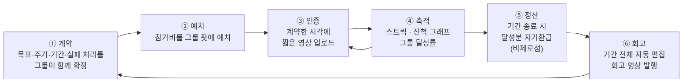
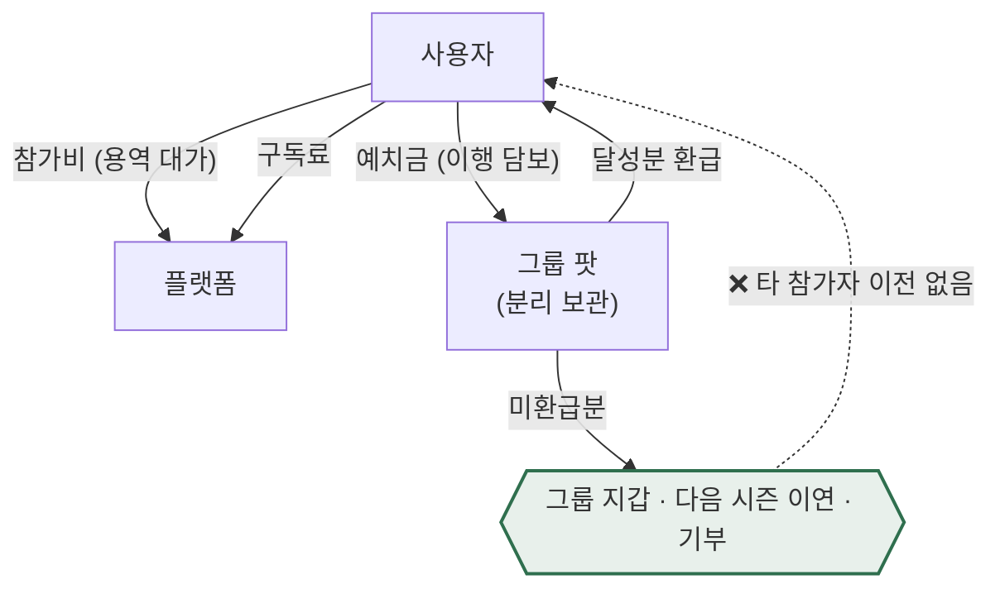
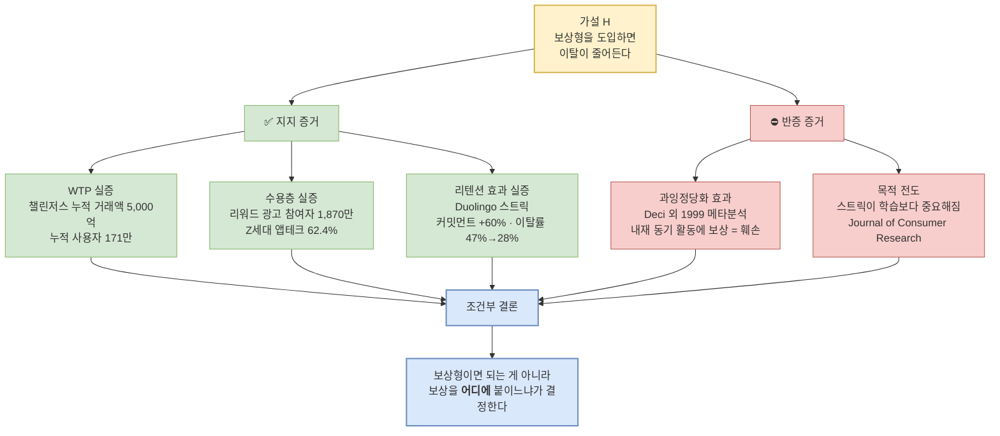
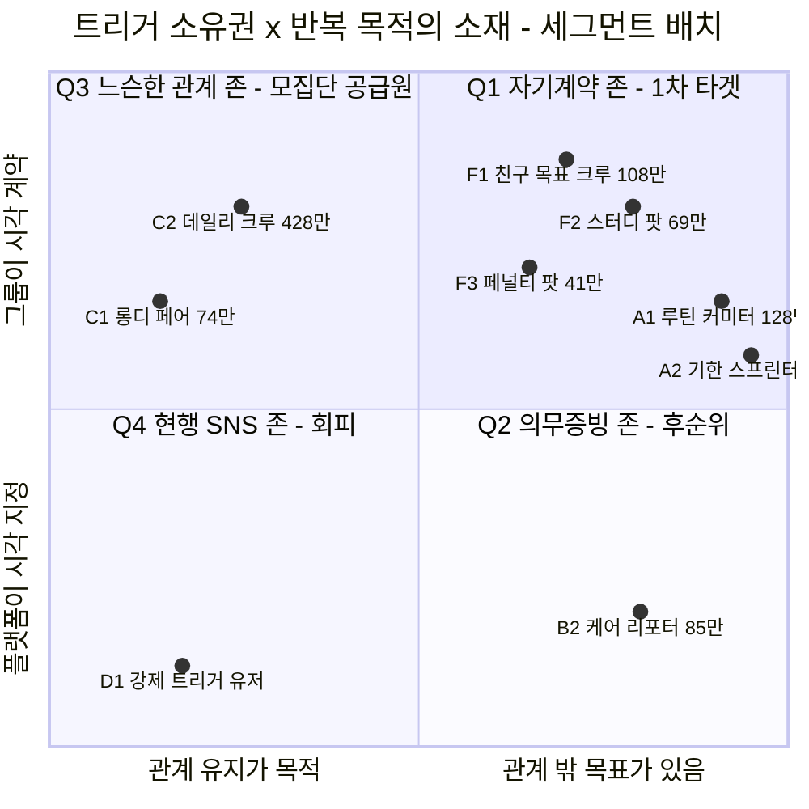
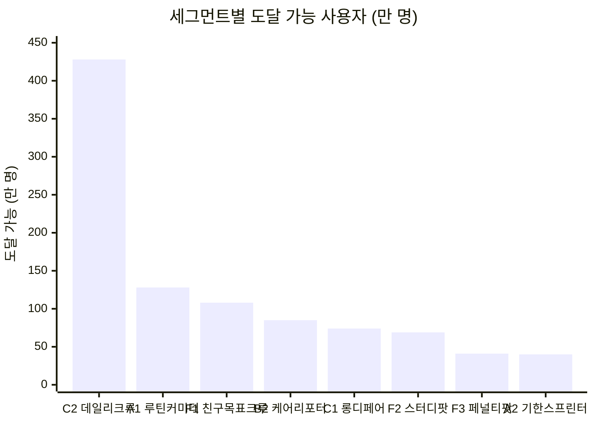
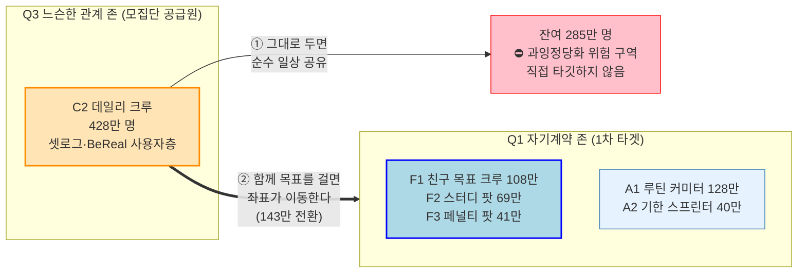
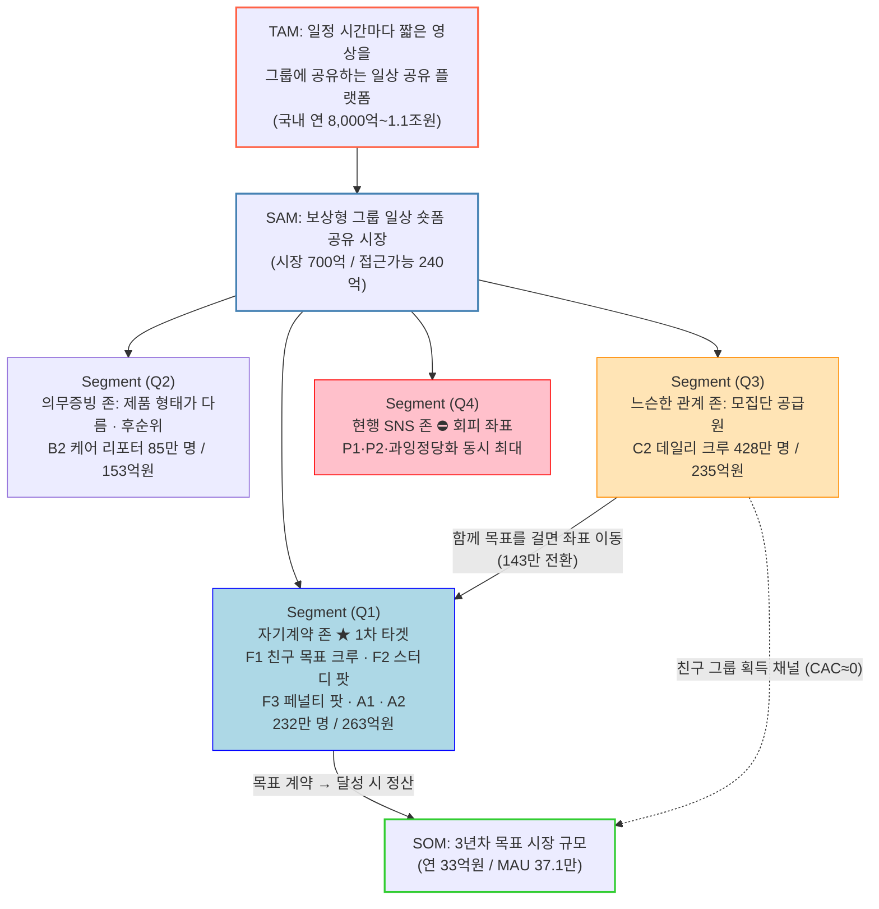

# 보상형 그룹별 일상 숏폼 공유 플랫폼 — 시장분석 종합보고서

> 작성일: 2026-08-09 / 지리적 범위: 대한민국 / 통화: KRW
> 대상 독자: **이 아이디어를 처음 보는 사람** (투자자·신규 합류 팀원·심사역)
> 근거 문서: `보상형 그룹별 일상 숏폼 공유 플랫폼(아이디어).md` (제품 정의) · `리서치 원본/` (초기 탐색)
> **최종 확정안 반영** — 정산 구조는 08 단계에서 **비제로섬 자기환급**으로 확정됐다(§1.4).

---

## 0. 30초 요약

**우리가 만드는 것** — 친구 그룹이 *"우리 다이어트하자"*, *"같이 공부하자"* 처럼 **함께 목표를 계약**하고, 매일 **짧은 영상으로 서로에게 인증**하고, **달성하면 현금성 보상으로 정산**받는 앱.

| 층위 | 정의 | 규모 |
|---|---|---|
| **TAM** | 일정 시간마다 짧은 영상을 그룹에 공유하는 일상 공유 플랫폼 시장 | **연 8,000억 ~ 1조 1,000억원** |
| **SAM** | 그중 **보상형** — 보상이 참여를 구동하는 시장 | **시장 700억원** / **접근 가능 240억원** |
| **SOM** | 우리가 3년 안에 실제로 가져올 수 있는 매출 | **연 33억원** (밴드 20~61억) |
| **1차 타깃** | F1 친구 목표 크루 | **108만 명** |

**이 문서의 결론 한 줄** — 시장은 이미 셋로그가 **광고비 0원으로 MAU 778만**을 모아 증명했다. 미해결은 *모으는 것*이 아니라 **남기는 것과 돈 버는 것**이고, 그 둘을 **"보상을 공유가 아니라 목표 달성에 붙인다"**는 한 가지 설계로 동시에 푼다.

**표기 규약**

| 표기 | 의미 |
|---|---|
| `[실측]` | 1차 출처(정부 통계·기업 공시·조사기관 리포트)에서 직접 확인한 수치 |
| `[추정]` | 실측치 + 명시된 가정을 거쳐 계산한 수치. 계산식을 함께 기재 |
| `[러프]` | 대응 실측 데이터가 없어 유사 시장 대입으로 산출. **오차 ±50% 이상 가능** |

---

## 1. 아이디어 요약

### 1.1 한 줄 정의

> **그룹이 함께 목표를 계약하고, 짧은 영상으로 서로에게 인증하고, 목표를 달성하면 현금성 보상으로 정산받는 그룹 단위 습관 플랫폼.**

셋로그가 만든 **"소수 그룹 × 짧은 영상 × 정기 공유"**라는 형식을 그대로 가져오되, 그 형식을 **친목이 아니라 자기계약의 이행 수단**으로 재배치한다.

### 1.2 핵심 루프



### 1.3 가장 중요한 설계 결정 — "공유 시 적립"이 아니라 "달성 시 정산"

원안은 *"짧은 영상을 공유할 때마다 포인트 적립"*이었다. 이를 **"계약한 목표를 달성했을 때 정산"**으로 바꿨다.

| | 원안 (공유 시 적립) | **확정안 (달성 시 정산)** |
|---|---|---|
| 보상이 붙는 대상 | 공유 행위 | **목표 달성** |
| 훼손되는 내재 동기 | 친구 관계 (있음 → 훼손) | **없음** — 운동·습관 인증엔 애초에 재미가 없다 |
| 어뷰징 형태 | 무의미한 영상 양산 | 인증 위조 (난이도 훨씬 높음) |
| 영상의 역할 | 보상 청구 수단 | **달성의 증빙 + 그룹의 상호 감시** |

**바꾼 이유** — Deci·Koestner·Ryan(1999) 메타분석은 **이미 내재적으로 동기부여된 활동에 유형(tangible) 보상을 붙이면 내재 동기가 훼손된다**는 것을 입증했다(과잉정당화 효과) `[실측]`. 친구와의 일상 공유는 이미 내재 동기가 있는 활동이므로, 여기에 현금을 붙이면 **관계가 화폐화되어 이탈이 오히려 가속**된다.

> **⚠️ 영상 공유를 없애는 게 아니다.** 영상은 여전히 매일 올라간다. 다만 그것이 *포인트를 청구하는 행위*가 아니라 *목표 달성을 입증하는 행위*가 된다. **화면은 거의 같고, 동기 구조만 뒤바뀐다.**

### 1.4 수익 구조 (확정)

| # | 수익원 | 산정 근거 | 규모 `[추정]` |
|---|---|---|---|
| **R1** | 그룹 단위 프리미엄 구독 | SAM 800만 × 유료 전환 3% × 연 75,000원 | **약 180억원** |
| **R2** | 챌린지 참가비 take (12%) | 챌린저스 연 GMV 500억 수준 × take 12% | **약 60억원** |
| ❌ 배제 | 브랜드 스폰서 챌린지 | 광고주 영업 의존, UX 오염 | (약 400억원 포기) |
| ❌ 배제 | 리워드 광고 오퍼월 | '앱테크 앱' 이미지가 일상 공유 UX와 충돌 | — |

**자금 흐름 — 비제로섬 폐쇄 루프**



> **구조적 특징** — 보상 재원에 **외부 광고주가 없다.** Zenly형 *"수익모델 부재로 종료"* 리스크가 구조적으로 제거되며, **참가자 사이의 득실 이전도 없다** — 내가 실패해도 그 돈이 남에게 가지 않는다.
>
> **왜 제로섬을 버렸나** — 초기 설계는 *"미달성 몰수분 ⅔를 달성자 상금으로"*였다. ① 경쟁 9곳 중 **제로섬 현행 운영사 0곳**(챌린저스는 흑자 후 스스로 폐기, stickK는 18년간 자선단체로 우회) ② *"못 한 사람 돈을 내가 먹는 거잖아요"*가 **예치 이탈의 독립 원인** ③ 사행성의 *"재물의 득실"* 요건에 정면으로 걸린다 — 이 셋이 뒤집었다.
>
> ⚠️ **카피 주의** — *"거는 돈이 아니라 맡기는 돈"*, *"원금 보장"* 류 표현은 **유사수신 규제** 요건에 근접하므로 쓰지 않는다. **"달성률만큼 돌려받는 이행 담보"**로 설명한다.

### 1.5 최대 리스크

| 우선순위 | 리스크 | 대응 |
|---|---|---|
| 🔴 진입 전 필수 | **전자지급결제대행업(PG) 등록** — 참가비를 받아 성패로 환급액을 계산해 지급하는 것은 **그 자체가 자금정산** | PG·에스크로에 **자금 보관·정산 실행을 전부 위탁**하고 자사는 달성률만 전달. **정산 구조와 무관하게 발생하는 임계 경로** |
| 🔴 진입 전 필수 | **사행성 규제** — 참가비를 걸고 결과에 따라 재분배 | **득실의 상호성 제거** — 비제로섬으로 참가자 간 재물 이전을 없앴다. ⚠️ 제로섬을 **선택지로도 열지 않는다** |
| 🔴 진입 전 필수 | **유사수신** — *"달성하면 전액 환급"*이 원금 전액 지급 약정에 근접 | 참가비·예치금 **분리**, 원금 초과 보상 없음, *"원금 보장"* 카피 금지 |
| 🟡 MVP 중 | **전자금융거래법(선불업)** — 포인트·이연 크레딧 도입 시 선불전자지급수단 해당 가능 | **Y1은 원 결제수단 환급만** |
| 🟡 MVP 중 | **어뷰징** — 현금이 걸리면 반드시 발생 | 실시간 촬영만 허용 · 영상 해시 중복 검사 · 본인 인증 · 랜덤 샘플 심사 |
| 🟡 MVP 중 | 세무 — 원천징수·예치금 부채 인식 | 회계·세무 자문 별도 |

---

## 2. TAM 시장 — 연 8,000억 ~ 1조 1,000억원

> **TAM 정의** — 일정 시간마다 짧은 영상을 그룹에 공유하는 **일상 공유 플랫폼 시장 전체**(국내). 보상형 여부와 무관하며, 이 수요를 회수하는 경쟁·인접 서비스의 매출을 모두 포함한다.

### 2.1 사용자 base — 약 1,450만 명

| 항목 | 수치 | 출처 |
|---|---|---|
| 국내 총인구 (2026.7) | **5,108만 명** `[실측]` | 행정안전부 「주민등록 인구통계」 |
| 국내 SNS 이용자 | **4,890만 명** (인구 대비 94.7%) `[실측]` | DataReportal 「Digital 2026: South Korea」 |
| SNS 이용률 (미디어패널 기준) | **60.7%** (전년 58.1% → +2.6%p) `[실측]` | KISDI 「세대별 SNS 이용 현황」 (2025.1) |
| 학령기(6–21세) | 550.8만 명 `[실측]` | KOSIS 인구상황판 (2026.6) |
| 청년기(22–34세) | 602.2만 명 `[실측]` | 동일 |
| 중년기(35–49세) | 1,421.1만 명 `[실측]` | 동일 |

**핵심 연령대(10–39세) 도출** `[추정]`
```
학령기 중 10세 이상   550.8만 × (12/16세분)   ≈ 413만
청년기 22–34세 전체                           = 602만
중년기 중 35–39세     1,421.1만 × (5/15세분)  ≈ 474만
  ※ 국내는 45–49 코호트가 더 크므로 과대 추정 → 15% 하향 = 403만
────────────────────────────────────────────────────
10–39세 합계                                  ≈ 1,418만 ~ 1,500만 명
```
→ **TAM 인구 base ≈ 1,450만 명**

### 2.2 이 포맷이 실제로 먹힌다는 증거 — 셋로그

| 지표 | 수치 | 출처 |
|---|---|---|
| **셋로그 MAU** | **778만 명** (2026.5) — **광고비 0원**으로 달성 `[실측]` | 와이즈앱·리테일 |
| 연령 구성 | 20대 45.1% / 10대 이하 23.6% / 30대 22.5% → **10~30대 91.2%** `[실측]` | 동일 |
| 성별 편중 | 10·20대 이용자 중 여성 **76.2%** `[실측]` | 동일 |
| 국내 숏폼 이용률 | 유튜브 쇼츠 **75%** / 인스타 릴스 **43%**(10~30대 71~53%) / 틱톡 20% `[실측]` | 컨슈머인사이트 (2025.8) |

> **쉽게 말하면** — 778만 명은 국내 10~39세 1,450만 명의 **53.7%**다. 마케팅비를 한 푼도 안 쓰고 절반 이상에 도달했다는 뜻이므로, 이 숫자는 시장의 **상한이 아니라 하한**이다.

### 2.3 얼마짜리 시장인가 — ARPU 벤치마크

| 서비스 | 매출 | 사용자 | 연 ARPU | 성격 | 출처 |
|---|---|---|---|---|---|
| BeReal (Voodoo) | €30M (2025) | MAU 4,000만+ | 약 1,180원 `[추정]` | 순수 광고, 수익화 1년차 | Voodoo |
| Locket | $14M (연 추정) | DAU 900만 | 약 2,230원 `[추정]` | 위젯 + 셀럽 슬롯 | Systemaic |
| **캐시워크(넛지헬스케어)** | **1,056억원 (2023)** `[실측]` | MAU 600만(2020 실측) | **10,560~17,600원** `[추정]` | 국내 보상형 | 뉴스1 (2024.3.12) |
| Life360 | $489.5M (FY2025) | MAU 9,580만 | 약 7,300원 `[추정]` | 안전 구독 + 광고 | Life360 IR |
| 당근 | 2,690억원 (2025 별도) | MAU 약 1,900만 | 약 14,160원 `[추정]` | 로컬 광고 | 매일일보 |

### 2.4 TAM 금액

```
도달 가능 사용자 = 1,450만 × 카테고리 수용률 60% = 870만 명   [추정]
  ※ 수용률 60% = 셋로그 실측 도달률 53.7% + 경쟁 서비스·미도달 잔여

× 블렌디드 연 ARPU 9,200원 (광고 5,500 + 구독·커머스 3,700) ≈ 800억원
```

TAM은 **경쟁 서비스 전체가 나눠 갖는 시장**이므로, 이 수요를 흡수하는 인접재(인스타 스토리·클로즈프렌즈, 카카오톡, 숏폼 플랫폼, 앱테크 앱)의 광고·구독 매출까지 포함해야 한다.

**교차검증** `[추정]`
```
국내 디지털 광고 시장                 11조 2,619억원  [실측: DMC리포트 2025]
× 소셜·커뮤니케이션 앱 비중 8~10%    =  9,000억 ~ 1조 1,300억원
+ 소셜 앱 인앱결제·구독 레이어
  (Life360 ARPPC $132/년 ≈ 19만원, 유료 Circle 280만 [실측]이 증명)
```

**참고 대사** — 국내 광고산업 총 취급액 **19조 7,885억원**(2024), 그중 온라인 부문 **8조 19억원(56.0%)** `[실측: 광고산업조사]`. 집계 기준이 달라 직접 비교는 불가하나 자릿수는 정합한다.

> ## **국내 TAM ≈ 연 8,000억 ~ 1조 1,000억원** `[추정]`
>
> **⚠️ TAM은 의사결정 변수가 아니다.** 오차가 크므로 단독으로 투자 판단 근거로 쓰지 말 것. 실질 판단은 SAM·SOM에서 이뤄진다.

---

## 3. 문제 및 가설

### 3.1 이 시장의 진짜 문제 — 획득이 아니라 유지

셋로그·BeReal·Zenly가 공통으로 증명한 것은 **획득은 쉽고 유지·수익화는 어렵다**는 것이다.

| 서비스 | 무엇을 증명했나 | 수치 |
|---|---|---|
| **셋로그** | 획득은 된다 | 광고비 0원 → MAU **778만** `[실측]` |
| **BeReal** | 유지가 안 된다 | DAU 2,000만 → 10.4M (**-48%**), 월 다운로드 1,200만 → 330만 (**-72.5%**), 일일 사용 **5분 미만**, 휴면 재참여율 **19%** `[실측]` |
| **Zenly** | 돈을 못 번다 | MAU 4,000만까지 성장했으나 **수익모델 부재**로 2023년 서비스 종료 `[실측]` |
| **TikTok Now** | 거대 플랫폼도 실패한다 | 2022.9 출시 → 2023년 조용히 종료 `[실측]` |

### 3.2 이탈 원인 두 가지 — 그리고 그 **근본** 원인

| 코드 | 표면 증상 | **근본 원인** | 근거 |
|---|---|---|---|
| **P1<br/>알림 트리거의 강박** | 알림 피로 → 알림 OFF → 앱 삭제 | **트리거 소유권이 플랫폼에 있음**<br/>"내가 언제 찍을지를 내가 못 정한다" | 대학생 심층 인터뷰 `[실측: Mountain Scholar]`<br/>267명 대상 다차원 디지털 스트레스 척도 연구에서 알림 강박이 우울·불안의 직접 예측 변수로 확인 `[실측]` |
| **P2<br/>콘텐츠 반복성의 지루함** | "매일 똑같은 게 올라온다" | **반복이 아무것도 축적하지 않음**<br/>어제의 기록이 오늘 아무 의미도 만들지 않음 | 필터·편집 금지 + 무작위 타이밍 = 노트북 모니터·천장 사진의 반복 양산 `[실측: arXiv 2408.02883]` |

> **P1의 목소리** — *"친구들과 하이킹 중에 누군가 '지금 비리얼 알림이 울렸으면 좋겠다'고 말했습니다. 그 순간 앱이 내 삶을 통제하고 있다는 끔찍한 기분이 들었습니다."* — 대학생 심층 인터뷰 `[실측]`

**시장의 기존 대응은 모두 절반이었다**

| 대응 | 사례 | 한계 |
|---|---|---|
| ① 강제성 완화 | BeReal — 늦은 게시 허용 | 재밌는 순간까지 기다렸다 올려 '진정성' 취지가 붕괴 |
| ② 트리거 제거 | Locket — 알림 없음 (누적 8,000만 DL) | 일일 리듬 훅 소멸 → 리텐션 훅을 다른 데서 확보해야 함 |
| ③ 주기 선택권 | 셋로그 — 매시간/3시간/끔 선택 | 절충안이나 여전히 **주어진 선택지 안에서만** 고르는 구조 |

**셋 다 트리거 소유권을 사용자에게 완전히 이전하지는 않았다.** 여기가 공백이다.

### 3.3 가설

> ### **H. 보상형 시스템을 도입하면 P1·P2로 인한 이탈을 줄일 수 있다.**
>
> 대상: 10~20대 (셋로그 사용자의 68.7%가 이 구간 `[실측]`)

---

## 4. 가설 검증

### 4.1 검증 구조



### 4.2 지지 증거 — 보상은 실제로 작동한다

| # | 증거 | 수치 | 출처 |
|---|---|---|---|
| S1 | **목표에 돈을 거는 WTP가 실재한다** | 챌린저스 누적 거래액 **5,000억원**, 누적 사용자 **171만 명**(2024.3), 2023년 첫 연간 흑자 `[실측]` | 테크42 (2024.4.26) |
| S2 | **보상 수용층이 이미 크다** | 국내 리워드 광고 참여자 **1,870만 명**(전 국민 36.6%), Z세대 앱테크 이용률 **62.4%**(세대 최고) `[실측]` | 버즈빌 / 대학내일20대연구소 |
| S3 | **반복이 숫자로 쌓이면 지루함이 사라진다** | Duolingo 스트릭 → 커밋먼트 **+60%**, 이탈률 47%(2020) → **28%**(2026), DAU 월간 잔존 **55%** `[실측]` | Trophy / Orizon 케이스 스터디 |
| S4 | **보상형 사업은 실제로 돈이 된다** | 캐시워크(넛지헬스케어) 2023 매출 **1,056억원** — 2020년 328억 대비 3.2배 `[실측]` | 뉴스1 (2024.3.12) |

### 4.3 반증 증거 — 잘못 붙이면 오히려 이탈을 가속한다

| # | 증거 | 내용 | 출처 |
|---|---|---|---|
| R1 | **과잉정당화 효과** | 이미 내재적으로 동기부여된 활동에 유형 보상을 붙이면 **내재 동기가 실질적으로 훼손**된다. Cameron & Pierce의 반론 메타분석을 재검증해 도출된 인지평가이론(CET)의 핵심 근거 `[실측]` | Deci, Koestner & Ryan (1999, 2001) |
| R2 | **목적 전도(Streak Creep)** | 사용자가 스트릭 연장을 **기저 활동(학습) 자체보다 더 중요하게** 여기는 전도 현상. 보상 지표가 목적을 대체한다 `[실측]` | *Journal of Consumer Research* / The Decision Lab |

> **R1이 이 가설에 갖는 함의** — *"친구에게 일상 영상을 올리면 포인트를 준다"*는 모델은 **가장 직관적이면서 이론적으로 가장 위험한 설계**다. 친구와의 일상 공유는 이미 내재 동기가 있는 활동이므로, 현금을 붙이면 관계가 화폐화되어 이탈이 가속된다.

### 4.4 조건부 결론

> ### **가설 H는 "무조건 참"이 아니라 "조건부 참"이다.**
>
> | 무엇에 보상을 붙이는가 | 훼손되는 내재 동기 | 판정 |
> |---|---|---|
> | 친구에게 **일상 영상을 올리는 행위** | 관계 그 자체 (있음) | ⛔ **가설 기각** — 이탈 가속 |
> | 친구 그룹이 함께 건 **목표의 달성** | 없음 — 다이어트·공부·독서 인증에 애초에 재미가 없다 | ✅ **가설 지지** |
>
> **즉, "보상형이면 이탈이 줄어든다"가 아니라 "보상을 목표 달성에 붙이면 이탈이 줄어든다"가 검증 가능한 형태의 가설이다.**

**이 결론이 제품에 부과하는 사양**

| 페인포인트 | 해법 | 구체 사양 |
|---|---|---|
| **P1 강박** | 트리거 소유권을 **그룹에게** 완전 이전 | 주기 '선택'이 아니라 **'계약'**. 시작 시 그룹이 요일·시각·기간·실패 처리를 함께 확정하고 **계약 중 변경 불가**(자기구속). 알림은 "플랫폼의 명령"이 아니라 **"우리가 과거에 한 약속"**이 된다 |
| **P2 지루함** | 반복의 **자산화** | 스트릭 카운터 + 그룹 달성률 보드 + 기간 종료 시 **자동 편집 회고본** |
| **R1 과잉정당화** | 보상을 **달성**에 연결 | "영상을 올려서" 포인트를 주지 말고 "목표를 달성해서" 정산 |
| **R2 목적 전도** | 스트릭 페널티에 **상한** | 복구권(streak freeze) 제공 |

### 4.5 아직 검증되지 않은 것 — 파일럿 설계

| # | 미검증 명제 | 검증 방법 | 통과 기준 |
|---|---|---|---|
| V1 | **"달성에 붙이면 관계는 안전하다"** — 이 문서의 핵심 전제 | A/B 셀: 원안(공유 시 적립) vs 확정안(달성 시 정산) | 확정안 셀의 W4 리텐션이 유의하게 높음 |
| V2 | **친구끼리 돈이 오가도 관계가 불편해지지 않는다** — 과잉정당화와는 **별개 층위**의 위험 | 파일럿 종료 후 관계 만족도 설문 | 참가 전 대비 유의한 하락 없음 |
| V3 | 알림 강박이 실제로 해소되는가 | 계약형 알림 vs 랜덤 알림 A/B | 계약형의 알림 OFF 비율이 유의하게 낮음 |
| V4 | 보상 수용률 55% 가정 | 파일럿 내 리워드 옵트인율 측정 | **50% 이상** |

---

## 5. SAM 시장 도출 — 시장 700억 / 접근 가능 240억

> **SAM 정의** — TAM 중 **보상형**, 즉 공유·인증·달성 행위에 명시적 보상이 지급되어 참여를 구동하는 시장.

보상형 시장을 직접 집계한 통계는 존재하지 않는다. 따라서 **SNS 시장 규모에 "보상형 비율"을 곱하는 방식**으로 추론한다. 먼저 그 비율을 실측으로 고정한다.

### 5.1 보상형 비율 ① — 사용자 기준

| 지표 | 수치 | 출처 |
|---|---|---|
| 국내 리워드 광고 참여자 | **1,870만 명** = 전 국민의 **36.6%** `[실측]` | 버즈빌 「2025 리워드 광고 트렌드 리포트」 |
| 최근 1년 내 리워드 앱 이용 경험 | **37.7%** `[러프, 2차 출처]` | 나무위키 「보상형 플랫폼」 인용 조사 |
| 재테크 경험자 중 앱테크 이용률 | **51.1%** `[실측]` | 대학내일20대연구소 (2025) |
| **Z세대 앱테크 이용률** | **62.4%** (세대 최고) `[실측]` | 동일 |

두 독립 소스가 **36.6% ↔ 37.7%**로 수렴한다. 여기에 본 카테고리의 연령 편중(셋로그 10~20대 68.7%)을 가중한다.

```
보상 수용률 = 62.4%(Z세대) × 68.7% + 36.6%(그 외) × 31.3%
            = 42.9% + 11.5% = 54.3%  →  55% 적용   [추정]
```

> **주목할 정합** — 우리가 풀려는 문제가 **10~20대의 이탈**인데, 보상 수용률이 가장 높은 세대가 정확히 그 10~20대(62.4%)다.

### 5.2 보상형 비율 ② — 매출 기준 (보상형 SNS 레퍼런스)

| 레퍼런스 | 계산 | 비율 |
|---|---|---|
| **X(구 트위터)** — 일부 보상 제도 | 크리에이터 광고수익 배분 월 $5M ≈ 연 $60M ÷ X 글로벌 광고매출 **$2.26B**(2025) `[실측]` | **2.7%** |
| **국내 리워드 광고 시장** | 2,250억~3,380억 ÷ 디지털 광고 11조 2,619억 `[추정]` | **2.0~3.0%** |
| **캐시워크 단독** | 넛지헬스케어 2023 매출 **1,056억** `[실측]` ÷ 11조 2,619억 | **0.94%** |
| **TikTok** — 일부 보상 제도 | Creator Rewards 1,000뷰당 $0.40~$1.00 (구 Creator Fund $1B 대체) `[실측]` | 총액 미공개 |
| **Steemit** — 보상형 커뮤니티 원형 | 등록 사용자 약 124만, 콘텐츠 보상 전액을 토큰으로 환류 `[실측]` | 참고 좌표 |

→ **매출 기준 보상형 비율 = 2~3%** `[추정]`. 세 계산이 독립적으로 같은 밴드에 들어온다.

> ### ⚠️ 이 시장의 정체 — 사용자 55% vs 매출 2~3%
> 사람의 **3분의 1 이상**이 보상형을 쓰는데 시장 매출로 회수된 비율은 **2~3%**에 불과하다. 수요는 있으나 **수익화 구조가 미개척**이라는 뜻이며, 이것이 진입 기회이자 동시에 *"쉽게 돈이 되지 않는다"*는 경고다.

### 5.3 세 경로로 산정

**경로 A — 사용자 비율법**
```
TAM 인구 1,450만 × 보상 수용률 55%  = 800만 명 (SAM 사용자 base)
× 보상형 연 ARPU 8,700원             = 약 696억원
```
> ARPU 8,700원: 캐시워크 실측 ARPU가 10,560~17,600원까지 올라왔으나, 신규 서비스는 광고 인벤토리 판매력이 낮으므로 보수적으로 유지 `[추정]`

**경로 B — SNS 시장 비율법**
```
국내 디지털 광고 시장           11조 2,619억원  [실측: DMC리포트]
× SNS 비중 25~30%              = 2.8조 ~ 3.4조원  [러프: 글로벌 SNS 광고 = 디지털의 27.7% 대입]
× 보상형 비율 2~3% (§5.2)      = 560억 ~ 1,020억원   중앙값 약 790억원
```

**경로 C — 접근 가능 SAM (광고 수익원 배제 반영)**
```
TAM 8,000억~1.1조 × 보상형 실현 비율 2~3% = 160억 ~ 330억원
확정 수익 구조: 구독 180억 + 참가비 take 60억 = 240억원 ✅ 밴드 중앙
```

### 5.4 확정

> | 구분 | 금액 | 밴드 | 근거 |
> |---|---|---|---|
> | **시장 SAM** | **약 700억원** | 560억~1,020억 | 경로 A 696억 ↔ 경로 B 790억 수렴 |
> | **접근 가능 SAM** | **약 240억원** | 160억~330억 | 경로 C ↔ 확정 수익 구조 수렴 |
>
> **갭 460억원 = 광고 수익원.** 이는 추정 오차가 아니라 **의도적으로 포기한 부분**이다(§1.4). 광고주 영업 없이 Day 1부터 재원이 자립하고 Zenly형 종료 리스크가 제거되는 대가로 시장의 66%를 접는다. **시장은 좁아지지만 생존은 확실해진다.**

---

## 6. Market Segment Map

### 6.1 왜 나이·성별로 자르지 않는가

이탈 원인이 **인구통계가 아니라 구조**이기 때문이다. "20대 여성"이라는 묶음은 P1·P2를 설명하지 못한다. 대신 **P1·P2의 근본 원인 두 개를 그대로 축으로 세운다.**

| 축 | 이름 | 양 끝 | 대응 페인포인트 |
|---|---|---|---|
| **Y (세로)** | **트리거 소유권**<br/>Trigger Ownership | 아래 = 플랫폼·기관이 시각 지정 (P1 높음)<br/>위 = 사용자·그룹이 시각 계약 (P1 낮음) | **P1** |
| **X (가로)** | **반복 목적의 소재**<br/>Locus of Repetition Purpose | 왼쪽 = 관계 유지가 목적 (P2 높음)<br/>오른쪽 = 관계 밖 목표가 있음 (P2 낮음) | **P2** |

### 6.2 세그먼트 배치 — 좌표평면 · 매트릭스

같은 세분화를 **두 가지 형식**으로 겹쳐 본다. 축은 동일하고, 답하는 질문이 다르다.

| | 형식 | 답하는 질문 |
|---|---|---|
| (1) | **좌표평면** | 세그먼트 **하나하나가 정확히 어디에** 있는가 |
| (2) | **4분면(2×2) 매트릭스** | 사분면별로 **누가 묶이고, 얼마고, 왜 그 순위인가** |

#### (1) 좌표평면 — 세그먼트별 정확한 위치



#### (2) 4분면(2×2) 매트릭스

| ⬇️ 세로축 ＼ 가로축 ➡️ | **◀ 관계형**<br/>반복 목적 = 관계 유지 그 자체<br/>**(P2 높음)** | **목적형 ▶**<br/>반복 목적 = 관계 밖의 목표<br/>**(P2 낮음)** |
|:---|:---|:---|
| **▲ 사용자·그룹 소유**<br/>촬영 시각을 그룹이<br/>사전에 **계약**<br/>**(P1 낮음)** | 🟠 **Q3 · 느슨한 관계 존** 🥈<br/>*모집단 공급원*<br/><br/>― C2 데일리 크루 **428만**<br/>― C1 롱디 페어 **74만**<br/><br/>**합계 502만 명 / 309억원**<br/><br/>P1 낮음 · P2 **잔존**<br/>과잉정당화 **있음**<br/><br/>**→ 직접 타깃 ✕ · 공급원 ○**<br/>셋로그가 광고비 0원으로 모은 네트워크.<br/>이 중 **143만**이 Q1으로 이동 가능 | 🔵 **Q1 · 자기계약 존 ★** 🥇<br/>***1차 타겟***<br/><br/>― **F1 친구 목표 크루 108만**<br/>― F2 스터디 팟 **69만**<br/>― F3 페널티 팟 **41만**<br/>― A1 루틴 커미터 **128만**<br/>― A2 기한 스프린터 **40만**<br/><br/>**중복 제거 232만 명 / 263억원**<br/><br/>P1 낮음 · P2 낮음<br/>과잉정당화 **없음**<br/><br/>**→ SOM 코어** (3년차 33억원) |
| **▼ 외부 소유**<br/>플랫폼·기관·고용주가<br/>시각을 **지정**<br/>**(P1 높음)** | 🔴 **Q4 · 현행 SNS 존** ⛔<br/>*회피 좌표*<br/><br/>― D1 강제 트리거 유저<br/>　 (BeReal 원형)<br/><br/>**정량화 제외**<br/><br/>P1 **최대** · P2 **최대**<br/>과잉정당화 **최대**<br/><br/>**→ 진입 금지**<br/>BeReal DAU −48% · 재참여율 19%<br/>TikTok Now 종료 | ⚪ **Q2 · 의무증빙 존**<br/>*후순위 (Y3+ 옵션)*<br/><br/>― B2 케어 리포터 **85만**<br/>― (B1 현장증빙 · B3 캠페인은<br/>　 범위 밖)<br/><br/>**85만 명 / 153억원**<br/><br/>P1 높음(업무라 무해) · P2 낮음<br/>과잉정당화 없음<br/><br/>**→ ARPU 최고(18,000원)이나<br/>기관 B2B라 제품이 다름** |

> **매트릭스 읽는 법** — 가로축은 *"반복에 관계 밖의 목표가 있는가"*(→ P2 해소), 세로축은 *"촬영 시각을 누가 정하는가"*(→ P1 해소)다. **오른쪽 위로 갈수록 두 페인포인트가 동시에 낮아지고**, 그 칸이 Q1이다.

> **맵이 즉시 알려주는 것** — BeReal은 Q4, 셋로그는 Q3에 있다. BeReal의 리텐션 붕괴는 실행 실패가 아니라 **좌표의 결과**다. 그리고 **보상을 Q4에 붙이는 것이 최악**이다: 관계형(내재 동기 有) × 외부 트리거(자율성 박탈)에 유형 보상을 얹으면 세 실패 요인이 동시에 작동한다.

### 6.3 세그먼트 정의와 규모

#### F계열 — 관계 기원 (이미 존재하는 친구 그룹) ★ 1차 타깃

| 코드 | 이름 | 무엇을 하는 사람인가 | 도달 가능 | 연 ARPU<br/>(접근가능) | 금액 |
|---|---|---|---:|---:|---:|
| **F1** | **친구 목표 크루** | *"우리 다이어트하자"* — 친구 그룹의 운동·체중·생활습관 공동 목표 | **108만** | 7,000원 | **76억** |
| **F2** | **스터디 팟** | *"매일 공부하자", "책 매일 읽자"* — 학습·독서 공동 목표 | **69만** | 6,000원 | **41억** |
| **F3** | **페널티 팟 그룹** | 불참 시 벌금 규칙을 **이미 운영 중인** 스터디·동아리 | **41만** | 6,000원 | **25억** |

**F1 규모 도출** `[추정]`
```
① 셋로그 MAU (그룹 일상 공유 실사용 인구)     778만 명  [실측: 와이즈앱 2026.5]
② × 생활체육 규칙적 참여율 62.9%             = 489만 명  [실측: 문체부 2025]
③ × 친구 동반 실천 비율 40%                  = 196만 명  [러프]
   (근거: 국민생활체육조사의 참여 동반자 1순위가 '친구'와 '혼자'
    [실측, 세부 비율 미공개]. '친구' 단독이 40%를 넘지 않는다고 보수 가정)
④ × 보상 수용률 55%                          = 108만 명  ← 도달 가능
```

**F2 규모 도출** `[러프]`
```
① 열품타(열정품은타이머) MAU                  210만 명  [러프, 2차 출처]
   (누적 1,200만 · DAU 66만 — 그룹 스터디 인증이 핵심 기능인 국내 최대 서비스)
② × 그룹 기능 실사용 비율 60%                = 126만 명  [러프]
③ × 보상 수용률 55%                          =  69만 명  ← 도달 가능

인접 모집단(중복이라 별도 가산 안 함): 성인 연간 독서율 38.5%, 성인 독서활동 중
독서모임 참여 비중 1위 [실측: 문체부 2025 국민독서실태조사]
```

**F3 규모 도출** `[러프]`
```
① 모임 앱 누적 615만(소모임 500만 + 문토 100만 + 트레바리 15만) × MAU 전환 15% ≈ 92만
② + 앱 외부 모임(카톡 기반) 1.7배 = 약 250만 명   [러프 — 검증 불가]
③ × 벌금 규칙 운영 30% = 75만 → × 55% = 41만 명  ← 도달 가능
```

#### A계열 — 개인 기원 (같은 제품으로 커버)

| 코드 | 이름 | 무엇을 하는 사람인가 | 도달 가능 | 연 ARPU<br/>(접근가능) | 금액 |
|---|---|---|---:|---:|---:|
| **A1** | **루틴 커미터** | 운동·기상·공부 등 **무기한 습관**에 스스로 돈을 걸고 인증 (챌린저스형) | **128만** | 6,000원 | **77억** |
| **A2** | **기한 스프린터** | 바디프로필·수험·감량 등 **종료일이 정해진** 단기 집중 목표 | **40만** | 12,000원 | **48억** |

**A1 규모 도출** `[추정]`
```
① 만 10세 이상 인구                     4,870만 명  [실측: 통계청]
② × 생활체육 참여율 62.9%              = 3,063만 명  [실측: 문체부 2025]
③ × 20~49세 비중 42.3%                 = 1,296만 명
④ × 디지털 인증 앱 사용률 18%           =   233만 명
   (근거: 손목닥터9988 참여자 200만 / 서울 인구 940만 = 21.3% [실측] → 15% 하향)
⑤ × 보상 수용률 55%                    =   128만 명  ← 도달 가능
```

> **교차검증** — 챌린저스 누적 거래액 5,000억 ÷ 평균 참가비 3만원 = 누적 1,667만 건 ÷ 5.5년 ÷ 1인 연 4회 = **연간 활성 참여자 약 76만 명** `[추정]`. 도달 가능 128만의 59%로, 1위 사업자 단독 점유율로는 높은 편이므로 ④의 18% 가정이 **오히려 보수적**일 수 있다.
>
> **시장 공백** — 챌린저스는 2023년 초 뷰티 커머스로 피벗했다(2024년 매출 150억) `[실측]`. **5,000억이 증명한 WTP는 남았고, 이를 회수할 사업자는 없다.**

#### Q1 합계 — 중복 제거

```
F계열  F1 108만 + F2 69만 + F3 41만 = 218만 × 0.75 (상호 중복 25%)  = 164만
A계열  A1 128만 + A2 40만          = 168만 × 0.75 (A1↔A2 40%)      = 126만
A ∪ F  (164 + 126) = 290만 × 0.80 (A↔F 교차 중복 20%)              = 232만  ← SOM 모집단
```

| | 도달 가능 | 시장 기준 금액 | 접근 가능 금액 |
|---|---:|---:|---:|
| 단순 합 (중복 포함) | 386만 명 | 438억원 | 267억원 |
| **중복 제거 0.60 적용** | **232만 명** | **263억원** | **160억원** |

### 6.4 세그먼트 규모 비교



> **읽는 법** — 규모 1위인 **C2 데일리 크루(428만)는 우리가 직접 타깃하지 않는다.** 순수 일상 공유에 현금을 붙이면 과잉정당화가 발생하기 때문이다(§4.3). 대신 그 안에서 *"함께 목표를 거는"* 사람들만 뽑아 F1·F2로 전환한다 — 다음 그림이 그 메커니즘이다.

### 6.5 핵심 메커니즘 — Q3는 배제 구역이 아니라 공급원이다



> **이것이 이 분석의 핵심 발견이다.**
> 셋로그가 **광고비 0원으로 모은 778만 명의 친구 그룹 네트워크**가 우리의 획득 채널이 된다(CAC ≈ 0). 그리고 *"함께 목표를 건다"*는 **한 가지 행동**이 그들을 과잉정당화 위험 밖으로 옮긴다.
>
> 챌린저스형(A계열)의 최대 약점은 **획득**이었다 — 크루는 학급처럼 자동으로 생기지 않는다. F계열은 **그룹이 이미 형성돼 있어서** 그 약점이 없다.

### 6.6 타깃하지 않는 구역과 그 이유

| 구역 | 세그먼트 | 규모 | 왜 지금 가지 않는가 |
|---|---|---:|---|
| Q3 | C1 롱디 페어 | 74만 / 74억 | 그룹 크기 2명 → **바이럴 계수 구조적으로 1 미만**, 관계 종료·전역·귀국 시 이탈률 100% |
| Q2 | B2 케어 리포터 | 85만 / 153억 | ARPU 최고(18,000원)이나 **기관 단위 B2B 계약** — 제품·영업·정산 구조가 전부 다름. **Y3+ 옵션** |
| Q2 | B1 현장 증빙 워커 | 77만 / 116억 | **노동 감시 도구 전용 리스크**. "그룹에 일상을 공유"하는 제품이 아님 → 범위 밖 |
| Q2 | B3 캠페인 참여자 | 435만 / 131억 | 조달·입찰 사이클 6~12개월, ARPU 3,000원(A1의 1/4) → 범위 밖 |
| Q4 | D1 강제 트리거 유저 | — | **회피 좌표** — BeReal DAU -48%, 월 다운로드 -72.5%, 재참여율 19%, TikTok Now 종료 |

**SAM 대사** `[추정]`

| 구역 | 도달 가능 | 금액 (시장 기준) |
|---|---:|---:|
| Q1 자기계약 존 (중복 제거 후) | 232만 | 263억 |
| Q3 잔여 C2 + C1 | 359만 | 231억 |
| Q2 B2 | 85만 | 153억 |
| **합계** | **676만** | **647억** |
| **SAM (§5.4)** | 800만 | **700억** ✅ 근사 |

---

## 7. SOM 시장 도출 — 3년차 연 33억원

> **SOM 정의** — 위 세분화로 확정한 타깃(Q1 자기계약 존)에서 **3년 내 실제로 확보 가능한 매출**.

### 7.1 왜 Q1 전체가 하나의 SOM인가

F1·F2·F3·A1·A2는 **하나의 제품으로 커버된다.** 다섯 모두 *"목표를 정하고 → 주기를 계약하고 → 그룹에 짧은 영상으로 인증하고 → 재원을 정산한다"*는 동일 흐름이며, 차이는 **그룹의 기원**(친구 / 익명), **목표의 기한**(무기한 / 기한형), **재원 출처**(본인 / 그룹 상호)뿐이다.

**SOM 모집단 = 232만 명** (§6.3)

### 7.2 3개년 추정

| | Year 1 | Year 2 | Year 3 |
|---|---|---|---|
| **범위** | **F1 친구 목표 크루**<br/>(운동·다이어트) | + F2 스터디 팟 + A1 | Q1 전체 (F + A) |
| **모집단** | 108만 | 232만 | 232만 |
| **침투율** `[추정]` | 4% | 8% | 16% |
| **MAU** | **4.3만** | **18.6만** | **37.1만** |
| **연 ARPU** `[추정]` | 4,000원<br/>(수익화 착수 전) | 7,000원 | 9,000원 |
| **매출** | **1.7억원** | **13억원** | **33억원** |

> **Y3 ARPU 9,000원의 구성** `[추정]` — 참가비 take 6,750원(참가비 3만원 × 연 1.9회 × take 12%) + 구독 2,250원(유료 전환 3% × 연 75,000원). **광고 수익 0원.**
>
> **Y1을 F1으로 시작하는 이유** — 그룹이 이미 형성돼 있어 CAC가 가장 낮고, 셋로그가 실증한 유기적 확산 경로를 그대로 탄다.

### 7.3 시나리오 밴드

| 시나리오 | Y3 MAU | ARPU | Y3 매출 | 접근가능 SAM(240억) 대비 |
|---|---|---|---|---|
| 보수 | 25만 | 8,000원 | **20억원** | 8.3% |
| **기준** | **37.1만** | **9,000원** | **33억원** | **13.8%** |
| 낙관 | 55만 | 11,000원 | **61억원** | 25.4% |

> ## **SOM (3년차) ≈ 연 33억원** `[추정]` — 밴드 20억 ~ 61억원
> **SOM / 접근 가능 SAM = 13.8%** — 신규 진입자가 3년 내 확보할 점유율로 합리적 범위(5~15%) 안 ✅
> **SOM / 시장 SAM = 4.7%**

**⚠️ 침투율 가정의 취약점** — Y3 16%는 셋로그의 자연 도달률 53.7%보다 낮아 보수적으로 읽히지만, 셋로그는 **비보상형 무료 서비스**로 마찰이 없었다. 보상형은 정산·세무·어뷰징 방지라는 구조적 마찰이 추가되므로 동일 확산 속도를 가정해선 안 된다.

### 7.4 이 숫자를 신뢰하기 전에 확인할 것

| 검증 대상 | 방법 | 통과 기준 |
|---|---|---|
| **F1의 '친구 동반 실천 40%'** — 가장 약한 고리 | 문체부 국민생활체육조사 **최종결과보고서 원자료** 확인 | 실측치로 대체 |
| 친구 그룹의 참가비 WTP | 수도권 3개 대학·직장 친구 그룹 파일럿 | 그룹 생성 후 **W4 리텐션 25% 이상** |
| 보상 수용률 55% | 파일럿 내 리워드 옵트인율 | **50% 이상** |
| 사행성·전자금융거래법 | 사업 구조 사전 법률 검토 | 🔴 **부정 시 R2 참가비 take 전체가 무너짐 — 최우선** |

### 7.5 알려진 한계 (요약)

1. **F1의 '친구 동반 실천 40%'가 `[러프]`다.** 국민생활체육조사가 참여 동반자 세부 비율을 비공개해 추정에 의존했다. F1 108만의 불확실성이 가장 크다.
2. **F2의 열품타 MAU 210만은 2차 출처다.** 1차 공시가 아니며, '그룹 기능 실사용 60%'도 근거 없는 가정이다.
3. **SAM 경로 A와 B는 완전히 독립적이지 않다.** 둘 다 국내 디지털 광고 11.26조에 부분 의존하므로 수렴이 곧 검증은 아니다.
4. **보상 수용률 55%는 '앱테크 이용률' 프록시다.** 앱테크 수용과 "친구에게 인증 영상을 올리고 보상받겠다"는 수용은 같지 않다.
5. **F계열 진입의 전제가 §4.4의 조건부 결론 하나에 걸려 있다.** 친구 사이에 돈이 오가면 **관계 자체가 불편해질** 별개의 위험이 있으며, 이는 과잉정당화와 다른 층위다.
6. **중복 제거 계수(0.75 / 0.80)는 근사값**이며 실제 겹침률은 파일럿 설문으로만 측정 가능하다.

---

## 8. 전체 구조 정리 — TAM → SAM → Segment → SOM



### 최종 권고

| # | 권고 |
|---|---|
| 1 | **TAM = 연 8,000억~1.1조원** — 도달 가능 870만 명 × 블렌디드 ARPU 9,200원, 디지털 광고 비중으로 교차검증 |
| 2 | **SAM = 시장 700억원 / 접근 가능 240억원** — SNS 시장 비율법과 확정 수익 구조가 각각 수렴 |
| 3 | **SOM = Q1 자기계약 존, 3년차 연 33억원** (밴드 20~61억, 접근가능 SAM 대비 13.8%) |
| 4 | **1차 타깃 = F1 친구 목표 크루 108만 명** — *"우리 다이어트하자"*, *"같이 공부하자"*, *"책 매일 읽자"* 를 이미 말하고 있는 친구 그룹 |
| 5 | **핵심 메커니즘 = Q3 → Q1 좌표 이동** — 셋로그가 광고비 0원으로 모은 네트워크가 획득 채널이 되고, "함께 목표를 건다"는 한 가지 행동이 그들을 과잉정당화 위험 밖으로 옮긴다 |
| 6 | **성립 조건 = 보상을 공유가 아니라 달성에 붙일 것.** 이 원칙이 깨지면 F계열 전체가 Q4(회피 구역)로 되돌아간다 |
| 7 | **진입 전 최우선 = 사행성·전자금융거래법 법률 검토.** 부정되면 참가비 take 수익원 전체가 무너진다 |

---

## 9. 출처

### 인구 · 이용 실태 (§2)
1. 행정안전부, 「주민등록 인구통계」 (2026.7 총인구 5,108만) — https://jumin.mois.go.kr/ageStatMonth.do
2. KOSIS, 「인구상황판 — 연령대별 인구구조」 (2026.6) — https://kosis.kr/visual/populationKorea/PopulationDashBoardMain.do
3. DataReportal, "Digital 2026: South Korea" (SNS 이용자 4,890만) — https://datareportal.com/reports/digital-2026-south-korea
4. 정보통신정책연구원(KISDI), 「세대별 SNS 이용 현황」 (SNS 이용률 60.7%) — https://www.kisdi.re.kr/report/view.do?key=m2101113025790&masterId=4333447&arrMasterId=4333447&artId=1674096
5. 컨슈머인사이트, 「숏폼 한번 보면 평균 21분… 4명 중 3명 유튜브로 본다」 (2025.8) — https://www.consumerinsight.co.kr/
6. 와이즈앱·리테일, "셋로그 앱 MAU 778만 명" (2026.6) — https://www.wiseapp.co.kr/insight/detail/1011/setlog-sns-app-mau-in-korea
7. 뉴시스, "20대 홀린 '2초 일상 SNS' 셋로그…지난달 780만명 몰렸다" (2026.6.5) — https://www.newsis.com/view/NISX20260605_0003657349
8. 한국일보, "[트렌드 2026] 꾸미지 않아도 괜찮은 SNS '셋로그'의 유행" (2026.6.25) — https://v.daum.net/v/20260625110202630

### 광고 시장 · ARPU 벤치마크 (§2.3, §2.4, §5)
9. DMC리포트, 「2025 & 2026 디지털 광고 시장 동향 보고서」 (국내 디지털 광고 11조 2,619억원) — https://www.dmcreport.co.kr/contentview?dr_code=DMCRPF2025366468
10. e-나라지표, 「매체별 광고비 현황(광고산업조사)」 (2024 총 취급액 19조 7,885억 / 온라인 8조 19억) — https://www.index.go.kr/unity/potal/main/EachDtlPageDetail.do?idx_cd=1649
11. KOBACO, 「2025 방송통신광고비 조사보고서」 — https://www.kobaco.co.kr/site/adstat/board/broadcastprice/1291
12. ITBizNews, "성장하는 전세계 SNS 광고시장, 한국서 인기있는 SNS 앱은?" (SNS 광고 = 디지털 광고의 27.7%) — https://www.itbiznews.com/news/articleView.html?idxno=19324
13. 오픈애즈, "25년 8월 SNS 앱 동향" (카카오톡 4,819만·인스타 2,741만·밴드 1,708만·틱톡 832만) — https://openads.co.kr/content/contentDetail?contsId=17503
14. 뉴스1, "'캐시워크' 넛지헬스케어, 작년 매출 1056억원…'사상 최대'" (2024.3.12) — https://www.news1.kr/industry/sb-founded/5347235
15. 이데일리, "캐시워크 성공 2막 여는 넛지헬스케어" (2020 매출 328억·MAU 600만) — https://edaily.co.kr/News/Read?mediaCodeNo=257&newsId=01157846629243752
16. Voodoo, "2025: a year of growth and transformation for Voodoo" (BeReal €30M) — https://voodoo.io/news/2025-a-year-of-growth-and-transformation-for-voodoo
17. Systemaic, "Locket Widget revenue, ad spend and growth channels" — https://www.systemaic.com/teardowns/locket-widget
18. Life360, "Life360 Reports Record Q4 2025 Results" (매출 $489.5M·MAU 9,580만·유료 Circle 280만) — https://investors.life360.com/news-releases/news-release-details/life360-reports-record-q4-2025-results
19. 매일일보, "비즈프로필 300만개 돌파…당근, 로컬 마케팅 강화" — https://www.m-i.kr/news/articleView.html?idxno=1378447

### 이탈 원인 · 과잉정당화 (§3, §4)
20. Zhang et al., "Sharing, Not Showing Off: How BeReal Approaches Authentic Self-Presentation on Social Media Through Its Design", arXiv:2408.02883 — https://arxiv.org/html/2408.02883v1
21. Deci, Koestner & Ryan (1999), "The effects of extrinsic rewards on intrinsic motivation: A meta-analysis" — https://www.researchgate.net/publication/232453941
22. Deci, Koestner & Ryan (2001), "Extrinsic Rewards and Intrinsic Motivation in Education: Reconsidered Once Again", *Review of Educational Research*, 71(1) — https://journals.sagepub.com/doi/10.3102/00346543071001001
23. Mountain Scholar, "A Media Dependent Study on College-Aged Teens and their Cellphone Use" (BeReal 심층 인터뷰) — https://mountainscholar.org/bitstreams/54e390f6-918f-40f2-95e7-b6dac5a32069/download
24. "Social Media Use: Association with Digital Stress and Anxiety and Depression Symptoms in Youth" (267명 대학생 연구) — https://www.researchgate.net/publication/380231992
25. Trophy, "Duolingo Gamification Strategy: A Full Case Study (2026)" (스트릭 +60% · 이탈률 47%→28% · DAU 잔존 55%) — https://trophy.so/blog/duolingo-gamification-case-study
26. Orizon, "Duolingo's Gamification Secrets: How Streaks & XP Boost Engagement by 60%" — https://www.orizon.co/blog/duolingos-gamification-secrets
27. The Decision Lab, "Streak Creep: The perils of too much gamification" (*Journal of Consumer Research* 인용) — https://thedecisionlab.com/insights/consumer-insights/streak-creep-the-perils-of-too-much-gamification
28. Amra & Elma, "Top 20 BeReal Marketing Statistics 2026" (DAU -48% · 월 다운로드 -72.5% · 재참여율 19%) — https://www.amraandelma.com/bereal-marketing-statistics/

### 보상형 비율 · 보상형 SNS/커뮤니티 레퍼런스 (§5)
29. 버즈빌, 「2025 리워드 광고 트렌드 리포트」 (리워드 광고 참여자 1,870만) — https://www.buzzvil.com/resources/4XB6VokVync7FhMWtkdzH
30. 대학내일20대연구소, 「세대별 앱테크 이용 행태 기획조사 2025」 (앱테크 이용률 51.1% / Z세대 62.4%) — https://www.20slab.org/Archives/39013
31. 나무위키, 「보상형 플랫폼」 (리워드 앱 인지 76.9% / 최근 1년 이용 37.7%) `[2차 출처]` — https://namu.wiki/w/보상형%20플랫폼
32. Yahoo Finance / eMarketer, "X Ad Revenue Surges for First Time Since Elon Musk Purchase" (X 글로벌 광고매출 $2.26B, 2025) — https://finance.yahoo.com/news/x-ad-revenue-surges-first-193411912.html
33. Influencer Marketing Hub, "X (Twitter) Ads Revenue Sharing: Eligibility & Payout Math" (크리에이터 배분 월 $5M) — https://influencermarketinghub.com/x-twitter-ads-revenue-sharing/
34. Fourthwall, "Is TikTok's Creator Rewards Program Worth the Payout?" (1,000뷰당 $0.40~$1.00, 구 Creator Fund $1B) — https://fourthwall.com/blog/is-tiktoks-creator-rewards-program-worth-the-payout
35. Wikipedia, "Steemit" (보상형 커뮤니티 원형, 등록 사용자 약 124만) — https://en.wikipedia.org/wiki/Steemit
36. 테크42, "버즈빌, '리워드 광고 시장 연평균 17% 성장'" — https://www.tech42.co.kr/

### 세그먼트 규모 근거 (§6)
37. 문화체육관광부, "'25년 국민 생활체육 참여율 62.9%, 전년 대비 2.2%p 상승" (만 10세 이상 9,000명 대상, 참여 동반자 항목 포함) — https://www.mcst.go.kr/site/s_notice/press/pressView.jsp?pSeq=22201
38. e-나라지표, 「국민생활체육 참여현황」 — https://www.index.go.kr/unity/potal/main/EachDtlPageDetail.do?idx_cd=1658
39. 문화체육관광부, 「2025년 국민 독서실태조사」 (성인 독서율 38.5%, 성인 독서활동 중 독서모임 참여 1위) — https://zdnet.co.kr/view/?no=20260306130551
40. 나무위키, 「열정 품은 타이머」 (누적 1,200만 · MAU 210만 · DAU 66만) `[2차 출처]` — https://namu.wiki/w/열정%20품은%20타이머
41. 소모임 (누적 500만) — https://www.somoim.co.kr/ / 문토 (누적 100만) — https://apps.apple.com/kr/app/id1535886772 / 트레바리 (15만) — https://m.trevari.co.kr/
42. 테크42, "화이트큐브, 습관 형성 플랫폼 챌린저스로 2023년 첫 연간 흑자 달성" (2024.3 기준 누적 사용자 171만 · 누적 거래액 5,000억) — https://www.tech42.co.kr/
43. 플래텀, "뷰티 앱으로 피봇한 '챌린저스', 2024년 연 매출 150억 원" — https://platum.kr/archives/249818
44. KB경영연구소, 「KB자영업 분석 보고서 — 피트니스 센터 현황」 (전국 9,900개) — https://www.kbfg.com/kbresearch/report/reportView.do?reportId=2000125
45. 서울시 미디어허브, "걷기만 해도 10만 포인트! 손목닥터9988" (참여자 200만 돌파) — https://mediahub.seoul.go.kr/archives/2010449
46. 국민건강보험공단, 「2024 노인장기요양보험 통계연보」 (종사인력 70.5만 · 기관 29,058곳) — https://policy.kiom.re.kr/sub040101/view/page/1/id/MjMxMg==
47. 헤럴드경제, "'배달 라이더 도대체 몇 명일까?'…플랫폼 종사자 통계 발표 못해" (88.3만, 국가통계 미승인) — https://biz.heraldcorp.com/article/10497462

### 규제 (§1.5)
48. 「위치정보의 보호 및 이용 등에 관한 법률」 (시행 2025.10.01) — https://www.law.go.kr/
49. 「전자금융거래법」 — 선불전자지급수단 등록 요건 — https://www.law.go.kr/
