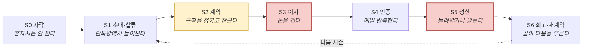
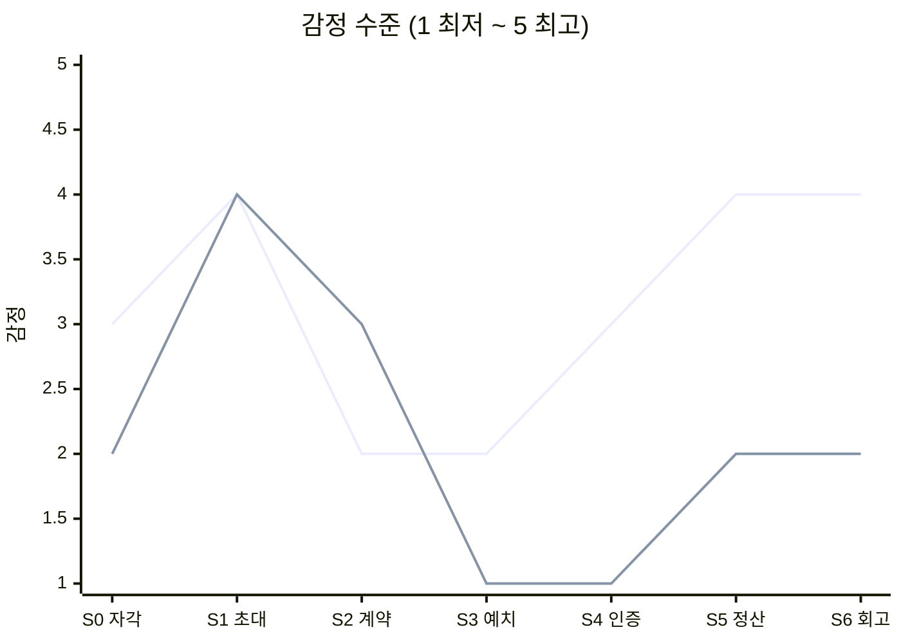

# 05-3. 고객 여정지도 (Customer Journey Map)

> 작성일: 2026-08-10
> 지리적 범위: 대한민국 / 통화: KRW
> **문서 위치:** `methodology-customer-journey-map.md`의 §3을 **보상형 그룹별 일상 숏폼 공유 플랫폼**에 적용한 산출물이다. 대상 인물은 05-2 페르소나 스펙트럼 12종이다.

| 선행 문서 | 역할 |
|---|---|
| `05-personas/methodology-customer-journey-map.md` | CJM 방법론 · 6열 구조 · 단계 재정의 경고 |
| `05-personas/persona-02-spectrum.md` | 대상 인물 12종 (Core 5 · Adjacent 3 · Extreme 2 · Non-user 2) |
| `04-tam-sam-som/보상형 그룹별 일상 숏폼 공유 플랫폼(아이디어).md` | 핵심 루프 6단계 · 수익 구조 · 리스크 |

---

## 0. 단계 정의 — 왜 범용 5단계를 쓰지 않는가

> 방법론의 경고: *"표를 먼저 놓고 칸을 채우면, 어느 서비스에 붙여도 말이 되지만 어느 서비스도 설명하지 못하는 문서가 나온다."*

범용 5단계(문제 인식 · 탐색 · 의사결정 · 사용 · 유지)는 이 서비스의 **세 가지 특수성**을 담지 못한다.

| # | 이 서비스만의 특수성 | 범용 단계가 놓치는 것 |
|---|---|---|
| 1 | **개인이 검색해서 오지 않는다. 친구가 그룹째 데려온다** | "탐색"이 없다. 대신 **초대**가 있고, 초대에는 제안자의 사회적 비용이 따른다 |
| 2 | **결제가 지출이 아니라 회수 가능한 위험 감수다** | "의사결정 → 구매"로는 *돈을 걸었다가 돌려받거나 잃는* 구조가 표현되지 않는다 |
| 3 | **끝이 있다. 그리고 그 끝이 다음 시작을 결정한다** | "유지"는 연속을 전제하지만, 이 제품은 **시즌제**이며 정산과 재계약이라는 분기가 있다 |

### 도출한 7단계

| 단계 | 정의 | 대응 제품 루프 |
|---|---|---|
| **S0 자각** | "혼자서는 안 된다"를 인정하는 시점 | — (진입 전) |
| **S1 초대·합류** | 검색이 아니라 **그룹 단위로 유입**된다 | — (획득) |
| **S2 계약** | 요일·시각·기간·실패 처리를 그룹이 합의하고 **잠근다** | ① 계약 |
| **S3 예치** | 참가비를 그룹 팟에 **건다** | ② 예치 |
| **S4 인증** | 계약한 시각 ±윈도우에 짧은 영상을 올린다 | ③ 인증 · ④ 축적 |
| **S5 정산** | 달성률에 따라 환급 / 몰수 / 상금 분배 | ⑤ 정산 |
| **S6 회고·재계약** | 회고본 발행 → 다음 시즌 또는 이탈 | ⑥ 회고 |

> ### ✅ 리트머스 테스트 통과 확인
>
> 방법론의 자가 점검 — *"단계 이름을 다른 서비스에 그대로 붙여도 어색하지 않다면 우리 것이 아니다."*
>
> **`예치` · `정산` · `재계약`** 세 단계는 가구·자동차 시장에 붙이면 성립하지 않는다. **`계약`** 역시 일반적인 "의사결정"과 다르다 — 집단 합의이고, 한번 잠그면 바꿀 수 없다. 이 서비스에서만 성립하는 단계가 **최소 4개** 확보됐다.

---

## 1. 전체 여정 — 누가 어디까지 도달하는가

> 12명 전원이 S6까지 가지 않는다. **어디서 멈추는가가 곧 Pain Point의 위치**다.

| 페르소나 | S0 | S1 | S2 | S3 | S4 | S5 | S6 | 종착 지점 |
|---|:-:|:-:|:-:|:-:|:-:|:-:|:-:|---|
| 🔵 C-01 정하윤 (캡틴) | ● | ● | ● | ● | ● | ● | ● | 완주 → **역할 고정 번아웃 위험** |
| 🔵 C-02 김도현 (러너) | ● | ● | ● | ⚠️ | ⚠️ | ● | ◐ | **S4 무응답형 이탈** |
| 🔵 C-03 박서연 (스터디) | ● | ● | ● | ● | ⚠️ | ● | ● | 완주, 단 **인증 판정 모호** |
| 🔵 C-04 이준호 (루틴) | ● | ⚠️ | ● | ● | ● | ● | ● | 완주, 단 **그룹이 없어 S1 우회 필요** |
| 🔵 C-05 최민지 (스프린터) | ● | ● | ● | ● | ● | ● | ● | 완주 → **최고 ARPU** |
| 🟢 A-01 한지우 (총무) | ● | ⚠️ | ⚠️ | ⚠️ | ● | ● | ● | 완주, 단 **집단 이주 비용** |
| 🟢 A-02 윤채원 (데일리) | ⚠️ | ● | ● | ⛔ | — | — | — | **S3 관계 화폐화 거부** |
| 🟢 A-03 홍다인 (앱테크) | ● | ⚠️ | ● | ⛔ | — | — | — | **S3 적립→예치 문턱** |
| 🔴 E-01 강수빈 (교대근무) | ● | ● | ⛔ | — | — | — | — | **S2 계약 자체가 불가능** |
| 🔴 E-02 임태경 (상습 미달성) | ● | ● | ● | ● | ⚠️ | ⛔ | ↺ | **S5 손실 → S1 재진입 루프** |
| ⚪ N-01 서지훈 (알림 이탈) | ⛔ | — | — | — | — | — | — | **S0 카테고리 낙인** |
| ⚪ N-02 조은비 (현금 거부) | ● | ● | ● | ⛔ | — | — | — | **S3 도덕 판단** |

`●` 통과 · `◐` 약화된 통과 · `⚠️` 마찰 · `⛔` 이탈 · `↺` 순환

> ### 🔍 한눈에 보이는 것
> **S3 예치에서 4명이 멈춘다** — A-02 · A-03 · N-02가 여기서 영구 이탈하고, C-02가 심하게 흔들린다. **단일 최대 이탈 관문**이다.
> **S2 계약에서 E-01이 부러진다** — 이탈이 아니라 **구조적 배제**다. 이 사람은 쓰고 싶어도 못 쓴다.
> **S5 정산은 통과율이 높지만 관계를 손상시킨다** — 이탈로 집계되지 않아 더 위험하다.

---

## 2. 🔵 Core — 핵심 사용자

Core 5명은 **하나의 여정이 아니다.** 그룹을 **여는 사람**과 **초대받는 사람**은 같은 화면에서 정반대의 통증을 겪는다. 두 여정을 각각 그리고, 나머지 3명은 분기점만 정리한다.

---

### 2-1. C-01 정하윤 (26) — 크루 캡틴 · 개설자 여정

| 단계 | 고객 행동 | 고객 생각 | 감정 | **Pain Point** | 개선 기회 |
|---|---|---|---|---|---|
| **S0 자각** | 헬스장 6개월 등록해 놓고 3주째 안 감. 단톡방에 "우리 진짜 운동하자" 던짐 | "혼자는 안 되네. 같이 하면 되지 않을까" | 결심 + 자기혐오 | **실패 원인을 의지로 오귀인한다** — 구조 문제를 개인 의지 탓으로 돌려, 다음에도 "더 굳게 결심하기"라는 같은 방식을 반복한다 | "혼자 실패는 의지가 아니라 구조" 진단 콘텐츠로 문제 재정의 |
| **S1 초대·합류** | 친구 4명 단톡방에 링크를 던지고 반응을 기다림 | "몇 명이나 들어올까. 강요처럼 보이면 어쩌지" | 기대 + 눈치 | **제안 행위 자체에 사회적 비용이 있다** — 초대가 거절되면 관계에 어색함이 남으므로, 캡틴은 제안 전에 이미 심리적 비용을 지불한다 | 부담 없는 초대 카피 · 미응답자 자동 재촉 금지 · 첫 시즌 참가비 0원으로 거절 사유 제거 |
| **S2 계약** | 목표·요일·시각·기간·실패 처리를 합의. 4명 일정이 전부 다름 | "22시로 하면 야근하는 애가 못 하는데… 조율하다 시작을 못 하겠다" | 조율 피로 · 시작 전 소진 | **합의 비용이 시작 직전에 몰린다** — 계약 항목이 많을수록 그룹은 시작하기도 전에 지치고, '변경 불가' 원칙이 이 부담을 증폭시킨다 | 프리셋 계약 템플릿(주 3회 운동 등) · 조율 항목 최소화 · 미합의 항목 다수결 자동 확정 |
| **S3 예치** | 그룹장으로서 먼저 결제하고 친구들에게 결제를 독려 | "내가 먼저 내야 애들이 내지. 안 내는 애 있으면 또 내가 말해야 하네" | 부담 + 기시감 | **독촉 역할이 첫 단계에서 재발한다** — 미납자 추적이 그룹장에게 돌아오면서, 이 서비스를 쓰는 이유(독촉하지 않으려고)가 시작도 전에 배신당한다 | 미납 알림을 시스템이 발송(그룹장 이름 비노출) · 전원 결제 완료 전까지 시작 자동 보류 |
| **S4 인증** | 매일 인증하고 그룹 달성률 보드를 확인. 안 하는 친구가 눈에 띔 | "쟤 3일째 안 하네. 말해야 하나" | 안도 ↔ 감시자 감각 재발 | **가시성이 감시로 전환된다** — 달성률 보드가 관리 도구로 읽히는 순간 캡틴은 다시 판정자가 되고, S0에서 벗어나려던 위치로 되돌아간다 | 미달성자에게 시스템이 직접 리마인드 · 캡틴 화면에는 개인별 미달성 대신 **그룹 총계만** 노출 |
| **S5 정산** | 기간 종료. 본인은 완주해 환급 + 상금 수령. 못 한 친구는 몰수 | "내가 쟤 돈을 먹은 건가" | 성취 + 죄책감 | **제로섬이 관계 비용으로 청구된다** — 상금의 출처가 친구의 손실이라는 사실이 정산 화면에서 드러난다. F계열(친구 그룹) 최대 위험 지점 | 상금 출처 비가시화 · **전원 달성 시 그룹 보너스**로 구조 전환 · 미달성분 다음 시즌 이월 옵션 |
| **S6 회고·재계약** | 회고본을 받아 단톡방에 공유. "우리 또 할래?" | "생각보다 잘 나왔네. 이번엔 애들이 먼저 하자고 하려나" | 뿌듯 + 다음 시즌 부담 | **캡틴 역할이 고정된다** — 다음 시즌도 개설·조율·독촉이 같은 사람에게 돌아가면 번아웃으로 **그룹 자체가 소멸**한다. A-01 총무의 2년차 번아웃이 이 경로의 종착점이다 | 캡틴 자동 로테이션 · 시즌 종료 시 다음 캡틴 지명 · **구독 혜택을 캡틴에게 귀속** |

---

### 2-2. C-02 김도현 (24) — 크루 러너 · 참여자 여정

| 단계 | 고객 행동 | 고객 생각 | 감정 | **Pain Point** | 개선 기회 |
|---|---|---|---|---|---|
| **S0 자각** | 혼자 시작했다 3일 만에 관둔 이력이 여러 번 | "또 안 되겠지" | 체념 | **반복 실패로 기대치가 바닥이다** — 새 도구에 기대를 걸지 않으므로 초기 이탈 문턱이 매우 낮다 | 첫 3일 집중 온보딩 · 초반 성공 경험을 의도적으로 설계 |
| **S1 초대·합류** | 링크를 탭해 앱 설치, 그룹 정보 확인 | "친구가 부른 거니까 일단 볼까" | 반가움 | **가치를 경험하기 전에 비용이 먼저 보인다** — 가입 직후 참가비 금액이 노출되면 제품을 이해하기 전에 이탈한다 | 가입 → 그룹 구경 → 결제 순서로 재배치 · 첫 시즌 무료 셀 |
| **S2 계약** | 캡틴이 정한 조건을 확인하고 수용 여부만 결정 | "22시면 알바 끝나고 딱인데, 주 5회는 좀 센데" | 눈치 (반대하면 분위기가 깨짐) | **협상력 없이 동의한다** — 계약 설계에 참여하지 못한 채 수용/거절만 가능하고, 반대 의사는 관계 비용 때문에 표현되지 않는다. 결과적으로 **본인에게 무리한 계약을 안고 시작**하며 이것이 S4 실패의 원인이 된다 | 익명 난이도 투표 · **같은 그룹 안에서 개인별 목표 강도 차등** 허용 |
| **S3 예치** | 참가비 3만원 결제 화면에서 손이 멈춤 | "이거 못 하면 날리는 거잖아" | 경계 · 손실 공포 | **'맡기는 돈' 프레이밍이 결제 화면에서 무너진다** — 카드 결제 UI 자체가 '지출' 신호라, 100% 달성 시 전액 환급이라는 설명이 체감되지 않는다 | 달성률별 회수액 **환급 시뮬레이터** · 첫 시즌 참가비 0원 · 예치금 잔액 상시 상단 노출 |
| **S4 인증** | 며칠 하다 이틀 밀림. 알림만 쌓아두고 앱을 안 엶 | "지금 올리면 밀린 게 티 나는데" | 죄책감 → 회피 | **밀린 순간 복귀 비용이 급등한다** — 미달성이 그룹에 그대로 노출되므로 하루 빠짐이 '민망함'을 만들고, 그것이 영구 이탈로 굳는다. **명시적 탈퇴가 아니라 무응답형 이탈**이라 개입 타이밍을 잡을 수 없다 | 복구권(streak freeze) **기본 지급** · 미달성 사유 비공개 옵션 · 2일 연속 미달성 시 그룹이 아닌 **개인에게 조용한 리마인드** |
| **S5 정산** | 부분 달성으로 일부 몰수. 그 돈이 완주한 친구에게 감 | "결국 내가 돈 내고 쟤 준 거네" | 억울함 + 자책 | **손실이 관계에 귀속된다** — 잃은 돈의 수령자가 익명이 아니라 '아는 친구'라서, 손실이 개인의 실패를 넘어 **관계 부채**로 인식된다 | 몰수분의 친구 귀속 비율 축소 · 1인 손실 상한 · 미달성분 다음 시즌 이월 |
| **S6 회고·재계약** | 회고본에 자기 분량이 적음. 다음 시즌 초대에 응답을 미룸 | "이번엔 빠질까" | 위축 | **회고본이 완주자만의 기록이 된다** — 부분 달성자에게 회고본은 성과물이 아니라 실패 증거라서, 재계약 동기를 오히려 꺾는다 | 부분 달성자 관점 편집(가장 잘한 주 하이라이트) · 그룹 대비가 아닌 **개인 진척 중심** 회고 |

---

### 2-3. 나머지 Core 3명 — 분기점만

> C-03·C-04·C-05는 위 두 여정의 변주다. **갈라지는 단계만** 정리한다.

| 페르소나 | 갈라지는 단계 | 무엇이 다른가 | **Pain Point** |
|---|---|---|---|
| **C-03 박서연** 스터디 페이서 | **S4 인증** | 인증 대상이 신체 활동이 아니라 **학습 결과물**(편 책·푼 문제집)이다 | **'했다'의 판정 기준이 모호하다** — 책을 펴 든 영상과 실제로 공부한 것 사이의 간극을 시스템이 구분하지 못한다. 열품타의 "켜두고 딴짓" 문제가 형태만 바꿔 재현된다 |
| **C-04 이준호** 루틴 커미터 | **S1 초대·합류** | 데려올 친구가 없다. 초대 경로가 아니라 **오픈 매칭**으로 들어온다 | **그룹 제품인데 그룹 없이 도착한다** — 낯선 사람과 묶이면 S4의 사회적 압력이 약해지고, 서로 눈감아주는 담합 위험이 동시에 커진다. A계열 전체의 구조적 약점 |
| **C-05 최민지** 기한 스프린터 | **S2 계약 · S6 회고** | 기간이 D-day로 고정되고 참가비가 고액이다. 회고본이 부산물이 아니라 **결과물 그 자체**다 | **재진입 주기가 길다** — 시즌제라 완주 후 다음 목표가 생길 때까지 공백이 길고, 그 사이 앱을 열 이유가 없다. LTV가 단발에 그칠 위험 |

---

### 2-4. Core 감정 곡선

> **위 선 = C-01 캡틴 / 아래 선 = C-02 러너.**
>
> 두 선이 **S3~S5 구간에서 최대로 벌어진다.** 캡틴은 S2 조율에서 한 번 꺾였다가 완주하며 회복하는 반면, 러너는 **S3에서 바닥을 치고 회복하지 못한다.** 같은 제품, 같은 그룹, 같은 화면인데 정반대의 곡선이 나온다 — 이것이 Core를 하나의 여정으로 그리면 안 되는 이유다.

---

## 3. 🟢 Adjacent — 확장 사용자

> 세 명 모두 **이미 다른 것으로 이 문제를 풀고 있다.** 따라서 S0(자각)이 아니라 **전환 비용**이 여정의 주제가 된다.

---

### 3-1. A-01 한지우 (29) — 벌금 총무 · 이식(migration) 여정

| 단계 | 고객 행동 | 고객 생각 | 감정 | **Pain Point** | 개선 기회 |
|---|---|---|---|---|---|
| **S0 자각** | 이미 2년째 벌금 규칙을 운영 중. 문제는 이미 알고 있음 | "이걸 계속 내가 손으로 해야 하나" | 번아웃 | **자각이 아니라 한계 인식이다** — 문제를 몰라서가 아니라 지쳐서 온다. 따라서 필요한 건 설득이 아니라 **전환 근거** |  "총무가 하던 일을 시스템이 한다" 단일 메시지로 소구 |
| **S1 초대·합류** | 크루원 18명을 전부 옮겨야 함 | "18명한테 앱 깔라고 또 공지해야 하네" | 막막함 | **집단 이주 비용이 크다** — 전원 설치·가입이 필요하고, 한 명이라도 안 넘어오면 앱과 엑셀을 **이원 운영**하게 되어 총무 부담이 오히려 늘어난다 | 미가입자 대리 등록 · 부분 이주 허용(하이브리드 모드) · 기존 출석 데이터 임포트 |
| **S2 계약** | 기존 규칙(불참 5천원)을 앱 계약으로 번역 | "우리는 아프면 봐줬는데 이건 그런 게 없네" | 위화감 | **관행과 자동 집행이 충돌한다** — 2년간 굳은 재량(사정 봐주기)이 '변경 불가' 원칙과 부딪히고, 규칙을 그대로 옮기면 오히려 **더 각박해졌다**는 반발이 나온다 | 예외 쿼터(시즌당 면제권 N회) · 그룹 합의로 발동하는 사면 기능 |
| **S3 예치** | 기존엔 사후 징수, 앱은 **사전 예치** | "안 내던 돈을 미리 내라니 애들이 뭐라 하겠는데" | 부담 | **징수 시점이 앞당겨진다** — 크루원 체감상 '벌금'이 '참가비'로 바뀌며, 실제로 내는 총액이 같아도 **먼저 내는 것**에 대한 저항이 발생한다 | 사후 정산 모드 제공 · 초기 시즌은 소액 예치로 시작 |
| **S4 인증** | 처음으로 인증 수단이 생김 | "이제 갔다고만 하면 안 되겠네" | 안도(총무) ↔ 압박(크루원) | **총무의 해방이 크루원에겐 감시 강화다** — 같은 기능이 역할에 따라 정반대로 체감된다 | 인증 강도를 그룹이 선택 · 도입 시즌은 인증 실패 무벌칙 |
| **S5 정산** | 자동 분배 실행 | "회식비로 쓰던 건 이제 못 하네" | 상실감 | **벌금 사용처 재량이 사라진다** — 기존엔 모인 벌금을 회식·비품에 썼는데, 자동 분배가 그 공동 재원을 없앤다 | **그룹 공동 지갑** 옵션(몰수분을 개인 분배 대신 크루 활동비로 적립) |
| **S6 회고·재계약** | 총무 업무가 줄어듦 | "편해졌는데… 그럼 나는 뭐 하지" | 양가감정 | **총무의 존재 이유가 흐려진다** — 판정자에서 내려오는 것이 목표였지만, 역할이 사라지면 크루 운영의 구심점도 함께 약해진다 | 총무를 '운영자'에서 '기획자'로 재배치(시즌 설계·리더보드 큐레이션 권한) |

---

### 3-2. A-02 윤채원 (19) — 데일리 크루 · 전환 여정 *(S3에서 종료)*

| 단계 | 고객 행동 | 고객 생각 | 감정 | **Pain Point** | 개선 기회 |
|---|---|---|---|---|---|
| **S0 자각** | 셋로그 4개월차. 천장·강의실 사진만 반복 | "재밌었는데 왜 이제 재미없지" | 지루함 | **문제 정의가 어긋나 있다** — 이 사람의 통증은 P2(반복이 지루함)인데 제품이 파는 것은 목표 달성이다. **아프긴 한데 우리가 파는 약이 그 병의 약이 아니다** | 목표가 아니라 **축적**으로 소구 — "매일 찍는 게 뭔가로 남는다" |
| **S1 초대·합류** | 친구가 "이번 달만 같이 뭐 해볼래?" | "그 정도면 뭐" | 가벼운 호기심 | **전환 트리거가 한 문장에 달려 있다** — 이 문장이 나오지 않으면 428만 명 전체가 그냥 셋로그에 머문다. 전환이 사용자 간 대화에 의존하는데 제품이 그 대화를 유도하지 못한다 | 셋로그 그룹을 통째로 초대하는 진입점 · "이번 달만" 초단기 시즌 상품 |
| **S2 계약** | 친구들과 목표를 정해봄 | "우리 그냥 노는 사인데 규칙까지?" | 어색함 | **친목 그룹에 규칙이 들어오면 그룹의 성격이 바뀐다** — 계약은 관계를 과업 관계로 재정의하고, 이 사람이 지키고 싶었던 것(친구와 그냥 연결돼 있기)을 훼손한다 | 벌칙 없는 '가벼운 시즌' 모드 · 계약이 아닌 '약속' 언어 사용 |
| **S3 예치** ⛔ | 참가비 화면에서 그룹 전체가 멈춤 | **"우리끼리 돈을?"** | 거부감 | **관계 화폐화 거부 — 여정 종료 지점.** 친목 그룹에 금전 규칙이 들어오는 순간 관계가 거래로 재정의된다고 느낀다. 과잉정당화 이론이 예측한 지점이 그대로 실현된다 `[실측: Deci·Koestner·Ryan 1999]` | **참가비 없는 트랙 분리** — Q3 전환 대상에게는 예치 단계 자체를 제거하고 구독/축적 가치만으로 유지 |
| S4~S6 | — | — | — | **도달하지 않음** | — |

> **⚠️ 이 여정이 알려주는 것** — A-02를 S3까지 끌고 가는 설계 자체가 잘못됐다. 이 사람은 **획득 채널이지 과금 대상이 아니다.** 여정을 S2에서 끊고 무료 트랙으로 분리하는 것이 정답에 가깝다.

---

### 3-3. A-03 홍다인 (34) — 앱테크 루틴러 · 문턱 여정 *(S3에서 종료)*

| 단계 | 고객 행동 | 고객 생각 | 감정 | **Pain Point** | 개선 기회 |
|---|---|---|---|---|---|
| **S0 자각** | 5년째 리워드 앱을 도는데 월 1만원, 변화 없음 | "내가 이걸 왜 하고 있지" | 공허함 | **보상이 아무것도 만들지 않는다** — 적립은 쌓이는데 습관·건강은 그대로다. 보상형 앱에서 P2(반복이 축적되지 않음)가 재현된 형태 | "포인트 말고 결과가 남는다" 대비 소구 |
| **S1 초대·합류** | 친구 초대가 아니라 **광고·검색으로 혼자 유입** | "이것도 리워드 앱인가?" | 익숙함 | **보상형 유입자는 그룹 없이 도착한다** — 이 제품은 그룹 제품인데 앱테크 경로로 온 사람은 함께할 사람이 없어, 도착 즉시 오픈 매칭이라는 우회로가 필요하다 | 보상형 유입 전용 온보딩 · 목표별 자동 그룹 매칭 |
| **S2 계약** | 목표·주기 설정. 이 단계는 익숙함 | "이 정도는 할 수 있지" | 자신감 | **난이도를 과대 설정한다** — 손실 경험이 없어 자기 실행력을 낙관하고, 첫 시즌 실패 확률이 높아진다 | 첫 시즌 난이도 자동 하향 · 과거 앱테크 활동량 기반 목표 추천 |
| **S3 예치** ⛔ | 예치·몰수 설명을 읽고 멈춤 | "지금까지는 받기만 했는데, 이건 잃을 수도 있네" | 경계 | **'받는 돈'에서 '거는 돈'으로의 전환 문턱 — 여정 종료 지점.** 5년간 한 번도 돈을 걸어본 적이 없어, 손실 가능성이 인생 처음 등장한다. 보상 수용률 55% 가정이 **'적립 수용'이지 '예치 수용'이 아니라는 것**이 여기서 드러난다 | 무예치 체험 시즌(플랫폼 부담 상금) → 소액 예치 → 정상 예치 **단계적 사다리** |
| S4~S6 | — | — | — | **도달하지 않음** | — |

> **⚠️ 이 여정이 알려주는 것** — S3의 문턱을 넘기느냐가 **SAM 800만 명 추정 전체의 전제**다. 무예치 → 소액 → 정상으로 이어지는 사다리가 없으면, 보상 수용층이라는 가장 큰 인접 시장이 통째로 S3 앞에 쌓인다.

---

## 4. 🔴 Extreme — 극단 사용자

> 두 사람의 여정은 **제품이 어디서 부러지는지**를 보여준다. 이탈이 아니라 **구조적 배제**와 **위험한 순환**이다.

---

### 4-1. E-01 강수빈 (27) — 교대근무 인증 실패자 *(S2에서 배제)*

| 단계 | 고객 행동 | 고객 생각 | 감정 | **Pain Point** | 개선 기회 |
|---|---|---|---|---|---|
| **S0 자각** | 습관 앱을 깔 때마다 3주 안에 실패. 실패 사유가 매번 같음 | "이번에도 안 되겠지" | 만성 피로 + 예견된 체념 | **기대 없이 진입한다** — 반복 실패가 자기효능감을 이미 깎아둔 상태라, 첫 마찰에서 곧바로 이탈한다 | 온보딩에서 불규칙 근무 여부를 먼저 묻고 경로를 분기 |
| **S1 초대·합류** | 동료 간호사들과 그룹을 만들려 함 | "우리끼리는 시간이 맞으려나" | 기대 | **동료 그룹조차 시간이 안 맞는다** — 3교대는 같은 팀 안에서도 근무가 엇갈려, 그룹 형성 자체가 어렵다 | 시각 동기화가 아닌 **비동기 그룹** 지원 |
| **S2 계약** ⛔ | 고정 시각 선택 화면에서 근무표와 충돌 | "이번 주는 22시가 되는데 다음 주는 근무 중인데. 이걸 어떻게 적지" | 좌절 | **계약 UI가 고정 시각을 전제한다 — 여정 종료 지점.** 2주마다 바뀌는 근무표를 표현할 수단이 없어 계약 단계에서 이미 실패가 예정된다. **P1(알림 강박)을 푸는 핵심 장치인 '변경 불가'가 이 사람에게는 그대로 배제 장치가 된다** | **주간 총량 계약**(시각 아닌 횟수) · 근무표 업로드 연동 · 유동 윈도우(±4시간) |
| *(만약 통과한다면)* **S4 인증** | 나이트 근무 다음 날 미달성 누적 | "게을러서가 아닌데" | 억울함 | **실패 사유를 구분하지 않는다** — 게으름과 근무 충돌이 동일한 '미달성'으로 기록되어, 시스템이 이 사람의 노력을 인정할 방법이 없다 | 사유 태깅(근무/질병/개인) · 사유별 페널티 차등 |
| *(만약 통과한다면)* **S5 정산** | 몰수 발생 | "돈까지 잃네" | 자책 심화 | **실패 경험이 제품 밖 자기인식까지 손상시킨다** — 금전 손실이 "역시 나는 안 되는 사람"이라는 서사를 강화해, 습관 형성이라는 제품 목적과 정반대 결과를 만든다 | 불규칙 근무자 전용 무벌칙 트랙 |

---

### 4-2. E-02 임태경 (33) — 상습 미달성자 *(S5 → S1 순환)*

| 단계 | 고객 행동 | 고객 생각 | 감정 | **Pain Point** | 개선 기회 |
|---|---|---|---|---|---|
| **S0 자각** | 6번 참가해 1번 완주. 그럼에도 다시 결심 | "이번엔 다를 거야" | 결심 | **실패 이력이 진입을 막지 않는다** — 시스템이 과거 완주율을 진입 판단에 쓰지 않아, 같은 실패가 반복 가능한 상태로 방치된다 | 과거 완주율 기반 난이도·참가비 자동 조정 |
| **S1 초대·합류** | 오픈 매칭으로 재진입 | "이번 방은 좀 널널해 보이네" | 기대 | **재진입에 아무 마찰이 없다** — 직전 시즌 손실 직후에도 즉시 재참가할 수 있어, 손실 추격이 제도적으로 허용된다 | 연속 미달성 시 **쿨다운 기간** 강제 |
| **S2 계약** | 무리한 난이도로 설정 | "이 정도는 해야 의미가 있지" | 과열 | **손실 회복 심리가 난이도를 끌어올린다** — 잃은 돈을 만회하려면 더 크게 걸어야 한다는 판단이 실패 확률을 다시 높인다 | 직전 실패 시 난이도 상향 제한 |
| **S3 예치** | 소득이 불안정한데 3만원 예치 | "이번엔 진짜 할 거니까" | 각오 | **지불 능력을 확인하지 않는다** — 소득 대비 과도한 예치를 시스템이 걸러내지 않는다 | 월 누적 예치 상한 · 소득 대비 경고 |
| **S4 인증** | 야간 배달·교대로 인증 시각을 자주 놓침 | "오늘도 못 했네" | 무력감 | **불규칙 노동과 고정 계약이 충돌한다** — E-01과 같은 구조적 원인인데, 여기에 금전 손실이 얹혀 피해가 배가된다 | E-01과 동일 처방(주간 총량·유동 윈도우) |
| **S5 정산** ⛔↺ | 1~2만원 몰수. 그 돈이 완주자에게 감 | "또 잃었네. 다음엔 만회해야지" | 학습된 무력감 + 만회 욕구 | **손실 후 재참가가 제품에 의해 촉진된다** — 상금 풀 구조상 상습 미달성자의 손실이 곧 완주자의 보상 재원이므로, **시스템에는 이 순환을 멈출 유인이 없다.** 🔴 사행성 심사에서 가장 먼저 지적될 지점이며, 재참여 동기가 회복 의지인지 손실 추격인지 본인도 구분하지 못한다 | **누적 손실 상한** · 연속 실패 시 강제 휴식 · 난이도 자동 하향 · 손실 누계 대시보드 상시 노출 |
| **S6 회고·재계약** | 회고본을 열지 않고 다음 챌린지 검색 | "다음 건 뭐 있지" | 조급함 | **회고가 작동하지 않는다** — 회고본은 완주자를 위한 장치라, 이 사람에게는 여정이 S5에서 곧장 S1으로 되돌아가며 성찰 구간이 통째로 빠진다 | 미완주자 전용 회고(실패 패턴 분석 → 다음 목표 하향 제안) |

> ### ⚠️ 이 여정은 제품 리스크다
> E-02의 순환은 **이탈이 아니라 잔존**으로 집계된다. 리텐션 지표상으로는 우량 사용자로 보이지만, 실제로는 **손실이 누적되는 사용자가 상금 재원을 공급하는 구조**다. 지표만 보면 발견되지 않으므로, **손실 누계를 별도 지표로 관리**해야 한다.

---

## 5. ⚪ Non-user — 비활성 사용자

> 두 사람의 여정은 **짧다.** 짧다는 것이 발견이다 — 어디서 끊기는지가 곧 시장 진입 장벽의 위치다.

---

### 5-1. N-01 서지훈 (25) — 알림 이탈자 *(S0에서 종료)*

| 단계 | 고객 행동 | 고객 생각 | 감정 | **Pain Point** | 개선 기회 |
|---|---|---|---|---|---|
| **S0 자각** ⛔ | 앱 이름을 듣는 순간 분류가 끝남 | **"또 알림이지?"** | 경계 · 피로 | **카테고리 낙인 — 여정 종료 지점.** 제품 설명을 듣기 전에 '알림 앱'으로 분류되어 **설명 기회 자체가 생기지 않는다.** BeReal에서 "지금 알림 울렸으면 좋겠다"고 생각한 경험이 카테고리 전체에 대한 거부로 굳었다 | 진입 카피에서 알림을 언급하지 않고 **"알림을 내가 정한다"**를 첫 문장으로 |
| *(설명을 듣는다면)* **S1** | 차이를 설명받음 | "계약형이든 뭐든 결국 울리는 거잖아" | 방어 강화 | **차별점이 설명을 요구하는데 이 사람은 설명을 듣지 않는다** — "트리거 소유권 이전"은 한 문장으로 전달되지 않는 개념이라, 설명이 길어질수록 방어가 세진다 | 설명 대신 **체험** — 알림 없는 무음 시즌 1주 |

> **⚠️ 판단** — 이 사람을 데려오려고 만든 기능은 코어를 망가뜨릴 확률이 높다. 다만 **"계약형 알림이 이 거부감을 실제로 푸는가"**는 A/B로 확인할 가치가 있다(05-1 V3 검증 항목).

---

### 5-2. N-02 조은비 (35) — 현금 구조 거부자 *(S3에서 종료)*

| 단계 | 고객 행동 | 고객 생각 | 감정 | **Pain Point** | 개선 기회 |
|---|---|---|---|---|---|
| **S0 자각** | 습관을 만들고 싶다는 needs는 있음 | "운동은 해야 하는데" | 의지 | — (여기까지는 정상 진입) | — |
| **S1 초대·합류** | 지인에게 앱을 소개받음 | "요즘 이런 게 있구나" | 호기심 | **소개자에 대한 신뢰로 들어온다** — 제품이 아니라 사람을 보고 진입하므로, 이후 단계에서 거부하면 **소개자와의 관계까지 어색해진다** | 거절해도 소개자에게 알림이 가지 않는 조용한 이탈 경로 |
| **S2 계약** | 목표 설정까지는 무리 없이 진행 | "이건 괜찮네" | 기대 | **여기까지 문제가 없어서 S3의 충격이 더 크다** — 계약 단계가 매끄러울수록 예치 단계의 이질감이 부각된다 | 예치 구조를 S1~S2에서 미리 투명하게 고지 |
| **S3 예치** ⛔ | 예치·몰수·상금 분배 구조를 이해한 순간 종료 | **"그럼 못 한 사람 돈을 내가 먹는 거잖아요"** | 도덕적 불편 · 불신 | **환급 논리가 도덕 판단을 이기지 못한다 — 여정 종료 지점.** *"100% 달성 시 전액 환급"*은 **손실 우려**에 대한 답이지만, 이 사람의 반대는 손실이 아니라 **'남의 손실로 내가 이익을 얻는 구조'**다. 논점이 어긋나 있어 완화 프레이밍이 겨냥하는 과녁 자체가 틀렸다 | **비제로섬 트랙** — 상금 재원을 몰수분이 아니라 플랫폼·구독료에서 조달하는 모드 분리 |

> ### 🔍 이 여정의 발견
> 아이디어 정의서의 완화 프레이밍(*"거는 돈이 아니라 맡기는 돈"*)은 **C-02 러너(손실 공포)에게는 유효하지만 N-02(도덕 판단)에게는 무효**하다. 두 사람의 거부 이유가 다른데 하나의 카피로 대응하고 있었다. **보상 수용률 55%의 나머지 45% 중 상당수가 이 유형일 가능성**이 있어 규모 추정이 필요하다 `[미측정]`.

---

## 6. Pain Point 종합 — 단계별 집약

> 12명의 여정에서 나온 Pain Point를 단계별로 모으면 **어느 단계가 구조적으로 아픈지**가 드러난다.

| 단계 | 이탈·마찰 인원 | **공통 Pain Point (단계의 본질적 통증)** | 성격 |
|---|:-:|---|---|
| **S0 자각** | 1명 이탈 | **카테고리 낙인** — 설명 이전에 분류가 끝난다 | 인식 |
| **S1 초대·합류** | 3명 마찰 | **그룹 제품인데 그룹 없이 도착하거나(C-04·A-03), 그룹째 옮겨야 한다(A-01)** | 획득 |
| **S2 계약** | 1명 배제 2명 마찰 | **'변경 불가'가 자기구속 장치이자 배제 장치다** — 합의 비용은 시작 전에 몰리고, 불규칙 생활자는 계약 자체를 쓸 수 없다 | 🔧 설계 |
| **S3 예치** | **4명 이탈** | **'받는 돈 → 거는 돈' 전환 문턱** — 손실 공포(C-02)·관계 화폐화(A-02)·경험 부재(A-03)·도덕 판단(N-02)이 **서로 다른 이유로 같은 화면에서 멈춘다** | 💰 **최대 이탈 관문** |
| **S4 인증** | 3명 마찰 | **밀린 순간 복귀 비용이 급등하고, 실패 사유가 구분되지 않는다** — 이탈이 무응답 형태라 개입 타이밍이 없다 | 리텐션 |
| **S5 정산** | 1명 순환 | **제로섬이 관계·자기인식 비용으로 청구된다** — 상금의 출처가 아는 사람의 손실이라는 사실이 드러난다 | ⚖️ 윤리·관계 |
| **S6 회고·재계약** | 2명 약화 | **회고본이 완주자만의 기록이고, 캡틴 역할이 고정된다** — 재계약 동력이 특정 인물과 특정 결과에만 붙는다 | 확산 |

### 세 줄 요약

> **1. S3 예치가 단일 최대 이탈 관문이다.** 4명이 여기서 멈추는데 **이유가 전부 다르다.** 하나의 프레이밍으로 대응할 수 없으며, 이유별로 다른 처방(무료 트랙 / 사다리 / 비제로섬 모드)이 필요하다.
>
> **2. S2 계약의 '변경 불가'는 양날이다.** P1(알림 강박)을 푸는 핵심 장치인데, 불규칙 생활자에게는 그대로 배제 장치가 된다. 이것은 개선 과제가 아니라 **설계 전제의 재검토** 대상이다.
>
> **3. S5 정산은 이탈로 집계되지 않아서 더 위험하다.** 캡틴의 죄책감, 러너의 관계 부채, 상습 미달성자의 손실 순환은 모두 지표상 '잔존'으로 잡힌다. **손실 누계를 별도 지표로 관리**하지 않으면 발견되지 않는다.

---

## 7. 개선 기회 우선순위

| 순위 | 개선 과제 | 겨냥하는 Pain Point | 근거 |
|:-:|---|---|---|
| **1** | **S3 예치 사다리** — 무예치 체험 → 소액 → 정상 | C-02 손실 공포 · A-03 경험 부재 | 최대 이탈 관문이고, 4명 중 2명이 이 처방으로 통과 가능 |
| **2** | **비제로섬 트랙 분리** — 상금 재원을 몰수분이 아닌 구독료에서 조달 | N-02 도덕 판단 · C-01/C-02 관계 비용 | S3·S5의 통증을 동시에 제거. 단 수익 구조 재설계 필요 |
| **3** | **주간 총량 계약 + 유동 윈도우** | E-01 구조적 배제 · E-02 불규칙 노동 | 배제된 집단을 복구. 교대·유동 근무자 규모 확인 선행 `[미측정]` |
| **4** | **복구권 기본 지급 + 미달성 사유 태깅** | C-02 무응답형 이탈 · E-01 사유 미구분 | 리텐션 직결. 구현 난도 낮음 |
| **5** | **캡틴 부담 이관** — 시스템 발송 리마인드, 캡틴 화면 총계만 노출, 역할 로테이션 | C-01 독촉 재발·역할 고정 | 캡틴 번아웃은 **그룹 전체 소멸**로 이어짐 |
| **6** | **누적 손실 상한 + 강제 휴식** | E-02 손실 순환 | 🔴 사행성 심사 대응과 직결 — 규제 리스크라 우선순위 상향 여지 있음 |
| **7** | **부분 달성자 관점 회고본** | C-02 재계약 동력 상실 | 회고본이 실패 증거가 되지 않도록 |
| **8** | **Q3 무료 트랙 분리** — A-02를 S2에서 끊고 과금하지 않음 | A-02 관계 화폐화 | 획득 채널을 과금 대상으로 착각하지 않기 |

---

## 부록. 이 문서의 한계

1. **여정 전체가 추론이다.** 사용자 인터뷰·행동 로그가 없고, 12명은 05-2에서 생성된 가상 인물이다. 05-2 자체가 ② 현실성 평가를 거치지 않은 ① 단계 산출물이므로 **여정지도도 같은 미검증 상태를 물려받는다.**
2. **감정 곡선의 수치는 서술적 표현이지 측정값이 아니다.** 상대적 형태만 의미가 있다.
3. **제품이 아직 존재하지 않는다.** S2~S6은 아이디어 정의서의 설계안을 전제로 그렸으므로, 실제 구현이 달라지면 여정도 달라진다.
4. **이탈 지점은 가정이다.** "S3에서 4명이 멈춘다"는 페르소나 서술에서 논리적으로 도출한 것이지 관측된 이탈률이 아니다. **파일럿에서 단계별 퍼널을 실측해야 한다.**
5. **S1 이전(인지·유입 경로)이 얕다.** 셋로그 네트워크를 통한 유기적 확산을 전제했으나, 그 확산이 실제로 일어나는지는 미검증이다.
