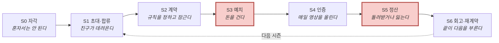
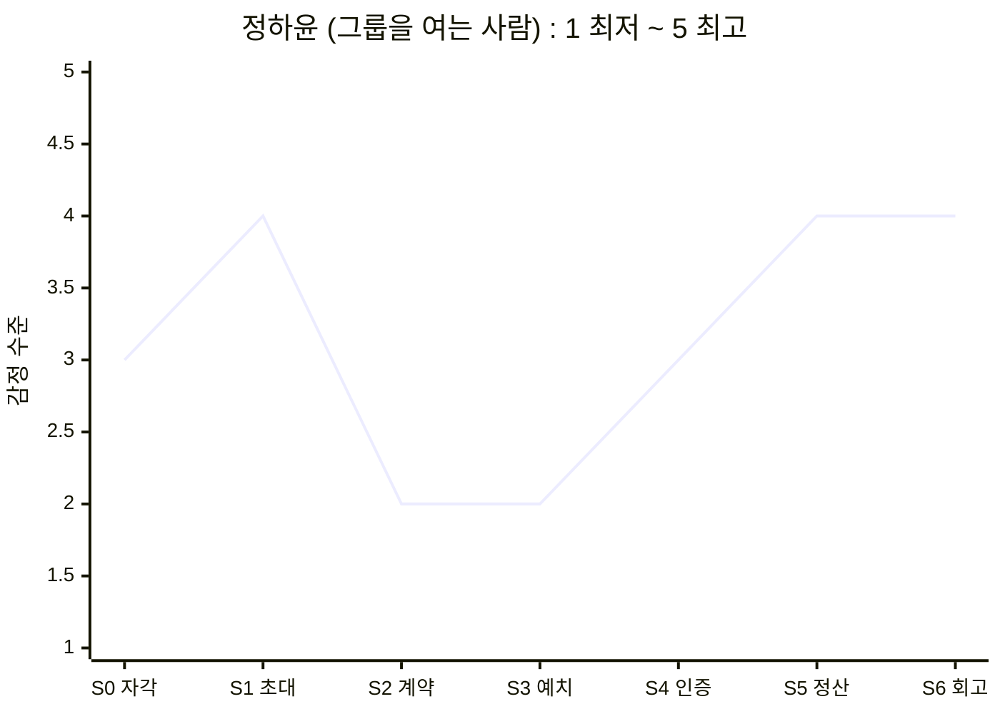
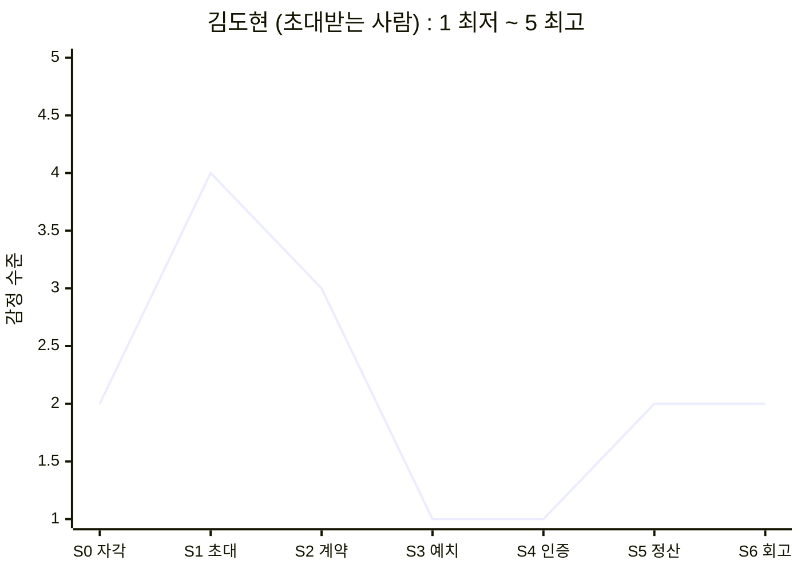

# 05-3. 고객 여정지도 (Customer Journey Map)

> 작성일: 2026-08-10 · 개정: 2026-08-11 (**14명 전원 여정 전개**)
> 지리적 범위: 대한민국 / 통화: KRW

---

## 0. 먼저 읽어주세요 — 3분 배경

> ### ⚠️ 정산 구조에 대한 표기 — 이 문서를 읽기 전에
> 본 여정지도는 **당시 설계였던 제로섬 정산**(미달성 몰수분이 완주자 상금이 되는 구조)을 전제로 통증을 진단했다. **그 구조는 이후 08 고객가치선언문 단계에서 `비제로섬 자기환급`으로 확정 변경됐다.**
>
> **그럼에도 이 진단을 그대로 둔다** — S3·S5의 통증(정하윤 *"내가 쟤 돈을 먹은 건가"* · 조은비 *"못 한 사람 돈을 내가 먹는 거잖아요"* · 강수빈의 손실 순환)은 **제로섬을 폐기하게 만든 근거 그 자체**이기 때문이다. 이 기록을 지우면 왜 비제로섬을 택했는지가 사라진다.
>
> **읽는 법** — 제로섬을 전제로 한 통증 서술은 **"해소된 문제의 진단서"**로 읽고, 현재 채택된 구조는 04 아이디어 정의서 §5.3과 08 VPS를 보면 된다.

이 문서만 읽어도 이해되도록 배경을 먼저 정리합니다. 앞선 문서를 읽지 않아도 괜찮습니다.

### 이 서비스는 무엇인가

> 친구들끼리 *"우리 이번 달엔 운동하자"* 처럼 **목표를 함께 정하고**, 시작할 때 **참가비를 미리 걸고**, 매일 **짧은 영상으로 서로에게 인증**하고, 기간이 끝나면 **해낸 만큼 돌려받는** 앱입니다.
>
> 100% 해내면 **전액 환급 + 상금**까지 받습니다. 그 상금은 못 해낸 사람의 몰수금에서 나옵니다.

### 이 문서는 무엇인가

> 이 앱을 쓸 만한 사람 — 그리고 **안 쓸 사람** — 가상 인물 **14명 전원**이 앱을 알기 전부터 시즌이 끝난 뒤까지 무엇을 하고, 무슨 생각을 하고, 어떤 감정을 느끼고, **어디서 아파하는지**를 **한 사람씩 단계별로** 그린 지도입니다.
>
> 목적은 예쁜 그림이 아니라 **"어디를 고쳐야 하는가"**를 찾는 것입니다.

### 등장인물 14명

| | 이름 (나이) | 하는 일 | 한 줄 소개 | 여정 |
|---|---|---|---|:-:|
| 🔵 **핵심** *주력 고객* | **정하윤** (26) | 마케터 | 단톡방에 *"운동하자"*를 먼저 꺼내는 방장 | [§2-1](#2-1--정하윤-26--그룹을-여는-사람) |
| | **김도현** (24) | 취업 준비생 | 초대는 반가운데 **참가비 3만원**에서 손이 멈춤 | [§2-2](#2-2--김도현-24--초대받는-사람) |
| | **박서연** (22) | 회계사 수험생 | 매일 목표를 세우는데 **매번 못 채움** | [§2-3](#2-3--박서연-22--목표를-세우고-매번-미달하는-사람) |
| | **이준호** (31) | 개발자 | 돈 걸 곳이 사라진 미라클모닝 경험자 | [§2-4](#2-4--이준호-31--친구-없이-혼자-거는-사람) |
| | **최민지** (28) | 프리랜서 디자이너 | 12주 뒤 바디프로필, 버틸 장치가 없음 | [§2-5](#2-5--최민지-28--마감일이-박혀-있는-사람) |
| 🟢 **확장** *이미 다른 걸로 해결 중* | **한지우** (29) | 러닝크루 총무 | 2년째 엑셀·계좌이체로 벌금을 걷는 중 | [§3-1](#3-1--한지우-29--이미-벌금을-걷고-있는-사람) |
| | **윤채원** (19) | 대학 1학년 | 셋로그 4개월차, **학기마다 한두 번 단기 목표** | [§3-2](#3-2--윤채원-19--가끔만-목표가-생기는-사람) |
| | **홍다인** (34) | 회사 총무팀 | 5년째 앱테크, 포인트만 쌓이고 습관은 그대로 | [§3-3](#3-3--홍다인-34--받기만-해본-사람) |
| | **송재현** (27) | 직장인 | 인스타 운동 부계정, **편집이 부담** | [§3-4](#3-4--송재현-27--혼자-기록만-하고-싶은-사람) |
| | **여민석** (39) | 인사팀 복지 담당 | 사내 챌린지가 **2주면 참여율 반토막** | [§3-5](#3-5--여민석-39--회사-돈으로-돌리는-사람) |
| 🔴 **극단** *제품이 부러지는 자리* | **강수빈** (27) | 3교대 간호사 | 근무표 때문에 실패하고 **돈까지 잃음** | [§4-1](#4-1--강수빈-27--지킬-수-없는-약속을-한-사람) |
| | **배유진** (24) | 대학 4학년 | 헬스장이 촬영 금지라 **인증할 곳이 없음** | [§4-2](#4-2--배유진-24--찍을-곳이-없는-사람) |
| ⚪ **비활성** *안 쓰는 사람* | **서지훈** (25) | 대학원생 | BeReal을 지운 뒤 **이런 앱 자체를 거부** | [§5-1](#5-1--서지훈-25--설명을-듣지-않는-사람) |
| | **조은비** (35) | 초등교사 | 친구끼리 **돈이 오가는 구조**를 못 받아들임 | [§5-2](#5-2--조은비-35--구조-자체를-거부하는-사람) |

> 14명은 앞선 문서 `persona-02-spectrum.md`에서 만든 **가상 인물**입니다. 실제 인터뷰 대상이 아닙니다.

### 여정의 7단계

일반적인 고객 여정(문제 인식 → 탐색 → 구매 → 사용 → 유지)을 쓰지 않았습니다. 이 서비스에는 **그 틀로 담을 수 없는 세 가지**가 있어서입니다.

| 이 서비스의 특징 | 그래서 필요한 단계 |
|---|---|
| 개인이 검색해서 오지 않는다. **친구가 그룹째 데려온다** | "탐색"이 아니라 **초대** |
| 결제가 지출이 아니다. **걸었다가 돌려받거나 잃는다** | "구매"가 아니라 **예치**와 **정산** |
| 끝이 있다. 그리고 **그 끝이 다음 시작을 결정한다** | "유지"가 아니라 **회고·재계약** |

| 단계 | 쉽게 말하면 |
|---|---|
| **S0 자각** | *"혼자서는 안 되는구나"*를 인정하는 순간 |
| **S1 초대·합류** | 친구가 링크를 보내고, 앱에 들어온다 |
| **S2 계약** | 목표·요일·시각·기간·벌칙을 함께 정하고 **잠근다** (중간에 못 바꿈) |
| **S3 예치** | 참가비를 그룹 공동 통장에 미리 넣는다 |
| **S4 인증** | 약속한 시각에 짧은 영상을 올린다. 매일 반복 |
| **S5 정산** | 기간 종료. 해낸 만큼 돌려받고, 못 한 만큼은 남에게 간다 |
| **S6 회고·재계약** | 전체 영상이 한 편으로 자동 편집돼 나온다. 다음 시즌을 할지 결정한다 |

> **`예치`·`정산`·`재계약`은 가구나 자동차를 살 때는 나오지 않는 단계입니다.** 이 서비스에만 있는 관문이라 이렇게 이름을 붙였습니다.

---

## 1. 한눈에 보기 — 누가 어디서 멈추는가

**14명 전원이 끝까지 가지 않습니다. 멈추는 자리가 곧 고쳐야 할 자리입니다.**

| 이름 | **S0** 자각 | **S1** 초대 | **S2** 계약 | **S3** 예치 | **S4** 인증 | **S5** 정산 | **S6** 회고 | 어디서 어떻게 끝나나 |
|---|:-:|:-:|:-:|:-:|:-:|:-:|:-:|---|
| 🔵 **정하윤** 방장 | ● | ● | ● | ● | ● | ● | ● | 완주. 단 **다음 시즌도 자기가 총대** → 번아웃 위험 |
| 🔵 **김도현** 참여자 | ● | ● | ⚠️ | ⚠️ | ⚠️ | ● | ◐ | **S4에서 말없이 사라진다** |
| 🔵 **박서연** 수험생 | ● | ⚠️ | ⚠️ | ● | ⚠️ | ⚠️ | ⚠️ | 완주. 단 **출석은 100%인데 목표는 미달** |
| 🔵 **이준호** 루틴 | ● | ⚠️ | ⚠️ | ● | ⚠️ | ● | ⚠️ | 완주. 단 **무기한 습관인데 제품은 시즌제** |
| 🔵 **최민지** 스프린터 | ● | ⚠️ | ⚠️ | ● | ⚠️ | ● | ⚠️ | 완주. **가장 많이 지불하지만 단발로 끝날 위험** |
| 🟢 **한지우** 총무 | ● | ⚠️ | ⚠️ | ⚠️ | ● | ⚠️ | ⚠️ | 완주. 단 **18명을 다 옮겨야 한다** |
| 🟢 **윤채원** 데일리 | ● | ● | ⚠️ | ⛔ | — | — | — | **S3에서 이탈** — *"우리끼리 돈을?"* |
| 🟢 **홍다인** 앱테크 | ● | ⚠️ | ⚠️ | ⛔ | — | — | — | **S3에서 이탈** — 돈을 걸어본 적이 없다 |
| 🟢 **송재현** 운동 기록 | ● | ⚠️ | ⚠️ | ○ | ● | ○ | ● | **무료 트랙으로 완주** (걸 마감일이 없음) |
| 🟢 **여민석** 사내 담당 | ● | ⚠️ | ⚠️ | ● | ⚠️ | ⚠️ | ⚠️ | 완주. 단 **회사가 돈을 낸다** |
| 🔴 **강수빈** 교대근무 | ● | ⚠️ | ⚠️ | ● | ⛔ | ↺ | ↺ | **지킬 수 없는 약속 → 반복 실패 → 손실 순환** |
| 🔴 **배유진** 촬영 불가 | ● | ● | ● | ● | ⛔ | ⛔ | ⛔ | **돈은 걸었는데 인증할 장소가 없다** |
| ⚪ **서지훈** 알림 거부 | ⛔ | — | — | — | — | — | — | **설명을 듣기도 전에 끝난다** |
| ⚪ **조은비** 현금 거부 | ● | ● | ● | ⛔ | — | — | — | **S3에서 이탈** — 도덕적으로 못 받아들인다 |

**기호** · `●` 통과 · `◐` 겨우 통과 · `○` 해당 없음(무료 트랙) · `⚠️` 힘들지만 통과 · `⛔` 여기서 끝 · `↺` 처음으로 되돌아감

### 이 표에서 바로 보이는 것

> **① S3 예치가 가장 큰 벽입니다.** 윤채원·홍다인·조은비가 **여기서 완전히 이탈**하고 김도현도 흔들립니다. 4명인데 **이유가 전부 다릅니다** — 손실이 무섭거나(김도현), 친구 사이에 돈이 껄끄럽거나(윤채원), 걸어본 적이 없거나(홍다인), 남의 손실로 이득 보는 게 싫거나(조은비).
>
> **② S4에서 두 사람이 부러집니다 — 이탈이 아니라 배제입니다.** 강수빈은 근무표 때문에, 배유진은 촬영 금지 헬스장 때문에 **쓰고 싶어도 못 씁니다.** 둘 다 **이미 돈을 건 뒤에** 막히므로 손실까지 발생합니다.
>
> **③ 완주자 6명도 전부 어딘가 아픕니다.** ⚠️가 하나도 없는 사람은 없습니다. 완주는 이탈로 집계되지 않아 **더 늦게 발견됩니다.**

---

## 2. 🔵 핵심 5명

> 이 다섯 명이 매출과 확산을 만듭니다. **다섯 명의 여정이 전부 다릅니다** — 그룹을 여는 사람, 초대받는 사람, 목표를 세우는 사람, 혼자 오는 사람, 마감일이 있는 사람.

---

### 2-1. 🔵 정하윤 (26) — 그룹을 여는 사람

> 대학 친구 4명 단톡방의 사실상 방장. 헬스장을 6개월 등록해 놓고 3주째 안 가고 있습니다.

| 단계 | 무엇을 하나 | 무슨 생각을 하나 | 감정 | **Pain Point (아픈 지점)** | 개선 기회 |
|---|---|---|---|---|---|
| **S0** 자각 | 단톡방에 *"우리 진짜 운동하자"*를 던진다 | *"혼자는 안 되네. 같이 하면 되지 않을까"* | 결심 + 자기혐오 | **실패를 의지 탓으로 돌린다.** 구조 문제인데 *"더 굳게 결심하면 된다"*로 결론 내려, 다음에도 같은 방식을 반복한다 | *"혼자 실패는 의지가 아니라 구조"* 진단 콘텐츠로 문제를 다시 정의 |
| **S1** 초대 | 친구 4명에게 링크를 보내고 반응을 기다린다 | *"몇 명이나 들어올까. 강요처럼 보이면 어쩌지"* | 기대 + 눈치 | **초대를 보내는 것 자체가 부담이다.** 거절당하면 관계가 어색해지므로 **제안 전에 이미 심리적 비용을 치른다** | 부담 없는 초대 문구 · 미응답자 자동 재촉 금지 · 첫 시즌 참가비 0원 |
| **S2** 계약 | 목표·요일·시각·기간·벌칙을 합의한다. 4명 일정이 전부 다르다 | *"22시로 하면 야근하는 애가 못 하는데… 조율하다 시작을 못 하겠다"* | 조율 피로 · 시작 전 소진 | **합의 비용이 시작 직전에 몰린다.** 정할 게 많을수록 그룹은 **시작하기도 전에 지친다** | 프리셋 템플릿 · 정할 항목 최소화 · 미합의 항목 다수결 자동 확정 |
| **S3** 예치 | 방장으로서 먼저 결제하고 친구들에게 결제를 독려한다 | *"내가 먼저 내야 애들이 내지. 안 내는 애 있으면 또 내가 말해야 하네"* | 부담 + 기시감 | **독촉 역할이 첫 단계에서 되살아난다.** 미납자 추적이 방장에게 돌아오면서 **이 앱을 쓰는 이유가 시작도 전에 배신당한다** | 미납 알림 시스템 발송(방장 이름 비노출) · 전원 결제 전까지 시작 보류 |
| **S4** 인증 | 매일 인증하고 그룹 달성률 보드를 본다. 안 하는 친구가 눈에 띈다 | *"쟤 3일째 안 하네. 말해야 하나"* | 안도 ↔ 감시자 감각 | **보이는 것이 감시로 바뀐다.** 달성률 보드가 관리 도구로 읽히는 순간 방장은 다시 **판정자 자리로 되돌아간다** | 미달성자에게 시스템이 직접 알림 · 방장 화면엔 **그룹 총계만** |
| **S5** 정산 | 완주해서 환급 + 상금을 받는다. 못 한 친구는 몰수당한다 | *"내가 쟤 돈을 먹은 건가"* | 성취 + 죄책감 | **상금의 출처가 친구의 손실이라는 사실이 화면에 드러난다.** 친구 그룹에서 가장 위험한 지점 | 상금 출처 비노출 · **전원 달성 시 그룹 보너스** · 몰수분 이월 |
| **S6** 회고 | 회고 영상을 단톡방에 공유한다. *"우리 또 할래?"* | *"잘 나왔네. 이번엔 애들이 먼저 하자고 하려나"* | 뿌듯 + 다음 시즌 부담 | **방장 역할이 고정된다.** 다음 시즌도 개설·조율·독촉이 같은 사람에게 돌아가면 번아웃으로 **그룹 자체가 사라진다** | 방장 자동 로테이션 · 다음 방장 지명 · **구독 혜택을 방장에게** |

---

### 2-2. 🔵 김도현 (24) — 초대받는 사람

> 취업 준비생, 카페 아르바이트 주 3회. 지출에 민감합니다. **카톡 단톡방 인증방을 해본 경험**이 있습니다.

| 단계 | 무엇을 하나 | 무슨 생각을 하나 | 감정 | **Pain Point** | 개선 기회 |
|---|---|---|---|---|---|
| **S0** 자각 | 친구들과 했던 카톡 인증방이 2주 만에 조용해졌다. 혼자서도 3일을 넘긴 적이 없다 | *"돈이 안 걸리니까 아무도 안 하지"* | 체념 + 원인 파악 | **무료로는 안 된다는 결론까지는 왔는데 대안을 겪어본 적이 없다.** 강제력이 필요하다는 건 아는데 **돈을 거는 방식은 처음이라 판단 근거가 없다** | *"무료 인증방이 왜 2주 만에 죽는가"* 설명 → 첫 시즌 무료 체험 |
| **S1** 초대 | 링크를 눌러 앱을 깔고 그룹 정보를 확인한다 | *"친구가 부른 거니까 일단 볼까"* | 반가움 | **가치를 겪기 전에 비용이 먼저 보인다.** 가입 직후 참가비가 뜨면 앱을 이해하기 전에 나간다 | 가입 → 그룹 구경 → 결제 순서로 재배치 |
| **S2** 계약 | 방장이 정한 조건을 확인하고 수락/거절만 한다 | *"22시면 알바 끝나고 딱인데, 주 5회는 좀 센데"* | 눈치 | **협상력 없이 동의한다.** 조건 설계에 참여하지 못하고, 반대 의사는 관계가 어색해질까 봐 말하지 못한다. 결국 **무리한 약속을 안고 시작하며 이것이 S4 실패의 원인이 된다** | 익명 난이도 투표 · **같은 그룹 안에서 개인별 강도 차등** |
| **S3** 예치 | 참가비 3만원 결제 화면에서 손이 멈춘다 | *"무료로는 안 되는 걸 아는데… 이건 잃을 수도 있잖아"* | 경계 · 손실 공포 | **필요성은 인정하는데 결정을 못 한다.** 결제 화면 자체가 '지출' 신호를 주고, *"100% 하면 전액 환급"*이 체감되지 않는다. **강제력이 필요하다는 판단과 잃을 수 있다는 공포가 같은 화면에서 부딪힌다** | **환급 시뮬레이터** · 첫 시즌 0원 · 예치금 잔액 상시 표시 |
| **S4** 인증 | 며칠 하다 이틀 밀린다. 알림만 쌓아두고 앱을 안 연다 | *"지금 올리면 밀린 게 티 나는데"* | 죄책감 → 회피 | **한 번 밀리면 돌아오는 비용이 급등한다.** 미달성이 그룹에 그대로 보이므로 하루 빠짐이 '민망함'이 되고 영구 이탈로 굳는다. **탈퇴가 아니라 무응답으로 사라져 붙잡을 타이밍이 없다** | 복구권 **기본 지급** · 미달성 사유 비공개 · 2일 연속 미달성 시 **개인에게만** 알림 |
| **S5** 정산 | 부분 달성으로 일부 몰수. 그 돈이 완주한 친구에게 간다 | *"결국 내가 돈 내고 쟤 준 거네"* | 억울함 + 자책 | **손실이 관계에 귀속된다.** 돈을 받은 사람이 익명이 아니라 **아는 친구**라서, 손실이 개인 실패를 넘어 **관계 부채**로 느껴진다 | 친구 귀속 비율 축소 · 1인 손실 상한 · 몰수분 이월 |
| **S6** 회고 | 회고 영상에 자기 분량이 적다. 다음 시즌 초대에 답을 미룬다 | *"이번엔 빠질까"* | 위축 | **회고 영상이 완주자만의 기록이 된다.** 부분 달성자에게는 성과물이 아니라 **실패 증거**라서 다시 할 마음을 꺾는다 | 부분 달성자 관점 편집 · 그룹 비교가 아닌 **개인 진척 중심** |

---

### 2-3. 🔵 박서연 (22) — 목표를 세우고 매번 미달하는 사람

> 지방 국립대 3학년, 공인회계사 1차 준비. **매일 아침 목표를 정합니다** — *오늘 8시간, 재무회계 3단원까지.* 열품타로 시간을 잽니다.

| 단계 | 무엇을 하나 | 무슨 생각을 하나 | 감정 | **Pain Point** | 개선 기회 |
|---|---|---|---|---|---|
| **S0** 자각 | 매일 목표를 세우지만 6시간·2단원에서 끝난다. 그게 매일 반복된다 | *"시간은 채웠는데 왜 진도는 안 나갔지"* | 성실한 불안 | **미달이 매일 반복되는데 그 사실이 어디에도 안 남는다.** 시간만 기록되니 무엇이 부족했는지 알 수 없고, 다음 날 또 같은 목표를 세운다 | 목표와 실제를 **나란히 기록**하는 온보딩 |
| **S1** 초대 | 월 1회 오프라인 스터디 그룹 멤버들과 함께 들어온다 | *"모임 사이가 통째로 비는데 이걸로 채워지려나"* | 기대 | **기존 스터디 그룹은 주기가 길어 일상 리듬을 못 만든다.** 그룹은 있는데 **매일 만나는 접점이 없다** | 기존 스터디 그룹 통째 초대 · 오프라인 모임과 온라인 인증을 한 시즌으로 묶기 |
| **S2** 계약 | 매일 22시 인증, 시험일까지 12주로 잠근다 | *"22시면 독서실 나올 시간이니까"* | 결의 | **계약에 '했다/안 했다'만 넣을 수 있다.** 이 사람이 진짜 걸고 싶은 건 *"매일 3단원"*인데, **분량 목표를 계약 항목으로 넣을 수단이 없다** | **정량 목표**(분량·범위)를 계약 항목으로 지원 |
| **S3** 예치 | 3만원을 건다. 수험생이라 부담이지만 강제력이 필요해 낸다 | *"이 정도는 걸어야 안 미루지"* | 각오 | **비교적 낮음.** 이미 독서실·인강을 자기 돈으로 결제해온 사람이라 지불 저항이 작다 | 수험 기간형 **장기 시즌 요금** |
| **S4** 인증 ⚠️ | 매일 22시에 오늘 푼 문제집을 찍는다 | *"오늘도 목표엔 못 미쳤는데 인증은 되네"* | 찜찜함 | **인증은 통과인데 목표는 미달이다.** 앱이 '했다'로 찍어주니 **미달이 오히려 가려지고**, 열품타에서 겪던 자기기만이 형태만 바꿔 재현된다 | 목표 대비 **달성률 입력** · **미달 폭 추이 그래프** · 연속 미달 시 목표 하향 제안 |
| **S5** 정산 ⚠️ | 인증률이 높아 전액 환급 + 상금을 받는다 | *"돈은 돌려받았는데 진도는 그대로네"* | 허탈 | **보상이 실제 성과와 무관하게 지급된다.** 출석 100%·목표 달성 60%인데도 만점 취급이라, **보상이 잘못된 행동을 강화한다** | 인증률이 아니라 **목표 달성률 기준** 정산 옵션 |
| **S6** 회고 ⚠️ | 12주 회고본을 시험 결과와 함께 본다 | *"이거 다음 시험 때도 쓸까"* | 조건부 만족 | **시험이 끝나면 목표가 사라진다.** 합격하든 떨어지든 **다음 시즌을 할 이유가 자동으로 생기지 않는다** | 합격 후 다음 자격증 · 불합격 후 재도전 시즌 자동 제안 |

> **핵심** — 이 사람의 여정은 한 줄로 이어집니다. **출석은 되는데 목표는 미달**이고, 앱이 그 미달을 안 보여주니 **문제가 해결된 것처럼 보이지만 그대로 남습니다.** S5에서 보상까지 지급되면 잘못된 상태가 강화됩니다.

---

### 2-4. 🔵 이준호 (31) — 친구 없이 혼자 거는 사람

> 판교 IT 기업 개발자 5년차. 챌린저스에서 미라클모닝 챌린지에 회당 2만원씩 4번 참가한 이력이 있습니다.

| 단계 | 무엇을 하나 | 무슨 생각을 하나 | 감정 | **Pain Point** | 개선 기회 |
|---|---|---|---|---|---|
| **S0** 자각 | 챌린저스가 뷰티 커머스로 바뀌어 돈 걸 곳이 없다. 알람 5개로 버티는 중 | *"돈을 안 걸면 나는 못 일어나는데"* | 담담한 자기 불신 | **대체재가 사라진 수요가 방치돼 있다.** 이미 검증된 지불 의사가 **갈 곳 없이 남아 있다** | *"챌린저스 하시던 분"* 타깃 카피로 직접 소구 |
| **S1** 초대 ⚠️ | 함께 할 친구가 없다. **낯선 사람과 자동 매칭**으로 들어온다 | *"모르는 사람들이랑 되려나"* | 반신반의 | **그룹 제품인데 그룹 없이 도착한다.** 매칭 품질이 이 사람의 전체 경험을 좌우하는데 **본인이 통제할 수단이 없다** | 목표·시간대·강도 기준 매칭 · 첫 시즌 후 매칭 만족도 조사 |
| **S2** 계약 ⚠️ | 아침 6시 기상으로 계약한다. 그런데 기간을 정해야 한다 | *"기간을 정하는 게 이상한데. 나는 계속 할 건데"* | 위화감 | **시즌제가 무기한 습관과 안 맞는다.** 끝나는 날이 있어야 하는 구조라 **갱신할 때마다 이탈 지점이 새로 생긴다** | **자동 갱신 시즌** · 종료일 없는 무기한 모드 |
| **S3** 예치 | 2만원을 건다. 익숙한 절차라 망설임이 없다 | *"이게 있어야 일어나지"* | 무덤덤 | **낮음.** 다만 시즌마다 결제를 반복해야 해서 **작은 마찰이 계속 쌓인다** | 시즌 **자동 결제** · 구독형 예치 |
| **S4** 인증 ⚠️ | 매일 6시에 기상 인증을 올린다 | *"아무도 나 안 보는데"* | 느슨함 | **낯선 그룹은 사회적 압력이 약하고, 서로 눈감아주는 담합이 생긴다.** 챌린저스에서 겪던 약점이 그대로 재현된다 | 랜덤 샘플 심사 · 그룹 내 상호 검증 가중치 · 매칭 그룹 규모 하한 |
| **S5** 정산 | 완주해서 환급 + 상금을 받는다 | *"이번에도 됐네"* | 기쁨보다 **안도** | **낮음.** 이 사람에게 정산은 목적이 아니라 안전장치의 확인이다 | — |
| **S6** 회고 ⚠️ | 회고본이 나오지만 별 감흥이 없다. 다음 시즌 갱신만 원한다 | *"이거 말고 그냥 계속 돌아가면 안 되나"* | 무관심 | **회고본이 이 사람에게는 가치가 없다.** 무기한 습관형에게 *'끝을 기념하는 장치'*는 의미가 없고, **오히려 갱신 마찰만 만든다** | 회고본 대신 **누적 스트릭·연속 기록** 강조 · 무갱신 자동 연장 |

> **핵심** — 이 사람의 축은 **"무기한 습관인데 제품은 시즌제"**입니다. S2·S6의 통증이 같은 원인에서 나옵니다. 시즌 개념을 끄는 모드 하나로 두 지점을 동시에 풀 수 있습니다.

---

### 2-5. 🔵 최민지 (28) — 마감일이 박혀 있는 사람

> 프리랜서 디자이너. 12주 뒤 바디프로필 촬영을 예약하고 예약금 25만원을 이미 냈습니다. 예전에 5주차에 무너진 적이 있습니다.

| 단계 | 무엇을 하나 | 무슨 생각을 하나 | 감정 | **Pain Point** | 개선 기회 |
|---|---|---|---|---|---|
| **S0** 자각 | 촬영일은 박혀 있고 예약금도 냈는데, 그 사이를 버티게 할 장치가 없다 | *"5주차만 넘기면 되는데 매번 거기서 무너지네"* | 초조 | **마감은 있는데 중간을 지탱하는 게 없다.** 무료 앱은 그만둬도 아무 일이 안 일어나 **강제력이 0이다** | D-day 역산 시즌 설계 |
| **S1** 초대 ⚠️ | 바디프로필 준비 오픈채팅방에서 알게 돼, 준비생 2~3명과 그룹을 만든다 | *"촬영일이 비슷한 사람이 있으려나"* | 기대 반 걱정 반 | **같은 D-day를 가진 사람을 찾기 어렵다.** 기간과 목표가 정확히 맞아야 하는데 **매칭 조건이 까다롭다** | **D-day 기반 매칭**(촬영 시기가 비슷한 사람끼리) |
| **S2** 계약 ⚠️ | 12주 고정, 주 6회, 고액 참가비로 잠근다 | *"더 세게 걸어야 안 무너지지"* | 과열 | **난이도를 스스로 과대 설정한다.** 실패 비용이 크다는 걸 아니까 오히려 무리하게 잡고, **5주차 붕괴 위험이 커진다** | 5주차 중간 점검 · **난이도 조정 1회 허용**(자기구속의 예외 설계) |
| **S3** 예치 | 10만원 이상도 낸다. 지불 저항이 14명 중 가장 낮다 | *"이 정도는 걸어야 안 도망가지"* | 결의 | **낮음.** 오히려 **상한이 낮으면 강제력이 부족하다**고 느낀다 | 고액 예치 **상한 확대** |
| **S4** 인증 ⚠️ | 주 6회 인증. 5주차에 고비가 온다 | *"이번 주만 넘기자"* | 붕괴 공포 | **가장 힘든 구간에 가장 지원이 없다.** 5주차 붕괴는 **예측 가능한데도 앱이 아무것도 하지 않는다** | 5주차 **집중 개입** — 코칭 콘텐츠 · 중간 보상 · 그룹 체크인 |
| **S5** 정산 | 완주해서 전액 환급 + 상금을 받는다 | *"돈보다 사진이 중요한데"* | 무덤덤 | **정산이 이 사람의 진짜 보상이 아니다.** 돈은 부차적이고 **결과물이 본질인데 정산 화면이 마지막 경험이 된다** | 정산과 **회고본 발행을 한 화면에서** 함께 |
| **S6** 회고 ⚠️ | 회고 영상을 받는다. 이게 사실상 결과물이다 | *"12주를 어떻게 버텼는지가 여기 있어야 하는데"* | 기대 → 조건부 | ① **과정이 안 남으면 이 사람을 잃는다.** 예전 완주 때 남은 게 결과 사진 몇 장뿐이었고 **가장 힘들었던 구간이 가장 기록이 없었다** ② 시즌제라 **다음 목표가 생길 때까지 앱을 열 이유가 없다** | 주차별 변화를 담은 **장편 회고본** · 시즌 사이 개인 기록 모드 |

> **핵심** — **가장 많이 지불하는 고객인데 가장 단발로 끝날 위험이 큽니다.** S6의 회고본이 기대를 못 채우면 다시 오지 않습니다.

---

### 2-6. 감정 곡선 — 여는 사람 vs 초대받는 사람

> **정하윤은 S2에서 한 번 꺾였다가 완주하며 회복합니다. 김도현은 S3에서 바닥을 치고 끝까지 못 올라옵니다.** 같은 제품, 같은 그룹, 같은 화면인데 곡선이 정반대입니다.

### 14명의 감정 최저점 — 어디서 가장 힘든가

| 최저점 단계 | 그 단계에서 가장 힘든 사람 | 어떤 감정인가 |
|---|---|---|
| **S0 자각** | **서지훈** | 경계 · 피로 — *"또 알림이지?"* |
| **S2 계약** | **정하윤** · **여민석** | 조율 피로 · 시작 전 소진 |
| **S3 예치** | **김도현** · **윤채원** · **홍다인** · **조은비** · **한지우** | 손실 공포 · 거부감 · 도덕적 불편 |
| **S4 인증** | **강수빈** · **배유진** · **박서연** | 억울함 · 수치심 · 찜찜함 |
| **S5 정산** | **강수빈** · **배유진** | 학습된 무력감 · 부당함 |
| **S6 회고** | **최민지** · **이준호** | 허탈 · 무관심 |

> **최저점이 S3·S4에 몰려 있습니다.** 14명 중 **9명**이 이 두 단계에서 가장 힘들어합니다.

---

## 3. 🟢 확장 5명 — 이미 다른 걸로 해결 중인 사람들

> 다섯 명 모두 **이미 무언가로 이 문제를 풀고 있습니다.** 그래서 여정의 주제가 "문제를 깨닫는 것"이 아니라 **"갈아탈 이유"**입니다.

---

### 3-1. 🟢 한지우 (29) — 이미 벌금을 걷고 있는 사람

> 주말 러닝크루 운영진 겸 총무. 크루원 18명. **불참 시 5천원 벌금 규칙을 2년째 직접 운영 중**입니다.

| 단계 | 무엇을 하나 | 무슨 생각을 하나 | 감정 | **Pain Point** | 개선 기회 |
|---|---|---|---|---|---|
| **S0** 자각 | 벌금을 카톡으로 독촉하고 계좌이체로 받아 엑셀에 적는다 | *"이걸 계속 내가 손으로 해야 하나"* | 번아웃 | **자각이 아니라 한계 인식이다.** 문제를 몰라서가 아니라 **지쳐서 온다.** 필요한 건 설득이 아니라 **전환 근거** | *"총무가 하던 일을 시스템이 한다"* 단일 메시지 |
| **S1** 초대 ⚠️ | 크루원 18명을 전부 옮겨야 한다 | *"18명한테 앱 깔라고 또 공지해야 하네"* | 막막함 | **집단 이주 비용이 크다.** 한 명이라도 안 넘어오면 앱과 엑셀을 **동시에 운영**하게 되어 총무 부담이 오히려 늘어난다 | 미가입자 대리 등록 · 부분 이주 허용 · 기존 출석 데이터 가져오기 |
| **S2** 계약 ⚠️ | 기존 규칙(불참 5천원)을 앱 계약으로 옮긴다 | *"우리는 아프면 봐줬는데 이건 그런 게 없네"* | 위화감 | **관행과 자동 집행이 충돌한다.** 2년간 굳은 재량이 사라지면, 규칙을 그대로 옮겼는데도 **더 각박해졌다는 반발**이 나온다 | 시즌당 면제권 N회 · 그룹 합의로 발동하는 사면 기능 |
| **S3** 예치 ⚠️ | 기존엔 사후 징수였는데 앱은 **사전 예치**다 | *"안 내던 돈을 미리 내라니 애들이 뭐라 하겠는데"* | 부담 | **내는 시점이 앞당겨진다.** 총액이 같아도 크루원 체감은 *"안 내던 돈을 미리 낸다"*가 되어 저항이 생긴다 | 사후 정산 모드 제공 · 첫 시즌은 소액으로 |
| **S4** 인증 | 처음으로 인증 수단이 생긴다 | *"이제 갔다고만 하면 안 되겠네"* | 안도(총무) ↔ 압박(크루원) | **총무의 해방이 크루원에겐 감시 강화다.** 같은 기능이 역할에 따라 **정반대로 체감된다** | 인증 강도를 그룹이 선택 · 도입 시즌은 인증 실패 무벌칙 |
| **S5** 정산 ⚠️ | 자동 분배가 실행된다 | *"회식비로 쓰던 건 이제 못 하네"* | 상실감 | **벌금 사용처 재량이 사라진다.** 기존엔 모인 벌금을 회식·비품에 썼는데 **자동 분배가 그 공동 재원을 없앤다** | **그룹 공동 지갑** 옵션 — 몰수분을 개인 분배 대신 크루 활동비로 |
| **S6** 회고 ⚠️ | 총무 업무가 확 줄어든다 | *"편해졌는데… 그럼 나는 뭐 하지"* | 양가감정 | **총무의 존재 이유가 흐려진다.** 판정자에서 내려오는 게 목표였는데, **역할이 사라지면 크루 운영의 구심점도 약해진다** | 총무를 '운영자'에서 '기획자'로 — 시즌 설계·리더보드 큐레이션 권한 |

> **핵심** — 필요한 건 설득이 아니라 **이주 도구**입니다. 대신 **18명을 옮기는 마찰**과 **총무 정체성 상실**이라는 두 개의 뜻밖의 장벽이 있습니다.

---

### 3-2. 🟢 윤채원 (19) — 가끔만 목표가 생기는 사람

> 친구 7명과 셋로그를 4개월째 쓰는 대학 1학년. 평소엔 일상만 공유하지만 **학기마다 한두 번 단기 목표를 함께 잡습니다** — 2주 다이어트, 시험 벼락치기, 여행비 저축, 공모전 스프린트.

| 단계 | 무엇을 하나 | 무슨 생각을 하나 | 감정 | **Pain Point** | 개선 기회 |
|---|---|---|---|---|---|
| **S0** 자각 | 단기 목표를 잡을 때마다 도구가 없어 흩어진다 (다이어트는 단톡방, 공부는 열품타, 저축은 카톡 정산) | *"매번 이렇게 흩어지네"* | 아쉬움 | **목표가 생기는 순간이 짧고 예측이 안 된다.** 상시 마케팅으로는 안 닿고, **그 순간에 맞춰 제시되지 않으면 또 단톡방으로 간다** | 학기 일정에 맞춘 시즌 제안 · **"이번 2주만" 초단기 상품** |
| **S1** 초대 | 친구가 *"이번 달만 같이 뭐 해볼래?"* 하고 링크를 보낸다 | *"그 정도면 뭐"* | 가벼운 호기심 | **전환이 친구의 한마디에 달려 있다.** 그 말이 안 나오면 그냥 셋로그에 머무는데, **앱이 그 대화를 만들어내지 못한다** | 셋로그 그룹을 **통째로 초대**하는 진입점 |
| **S2** 계약 ⚠️ | 친구들과 목표를 정해 본다 | *"우리 그냥 노는 사인데 규칙까지?"* | 어색함 | **친목 그룹에 규칙이 들어오면 그룹의 성격이 바뀐다.** 이 사람이 지키고 싶었던 것(친구와 그냥 연결돼 있기)을 훼손한다 | 벌칙 없는 **가벼운 시즌** 모드 · '계약'이 아니라 '약속'이라는 말 |
| **S3** 예치 ⛔ | 참가비 화면에서 **그룹 전체가 멈춘다** | **"우리끼리 돈을?"** | 거부감 | **여정 종료 지점.** 친목 그룹에 돈 규칙이 들어오는 순간 **관계가 거래로 재정의된다**고 느낀다 | **참가비 없는 무료 트랙 분리** — 예치 단계 자체를 없앤다 |
| **S4~S6** | **도달하지 않음** | — | — | 이 사람이 S4 이후까지 갔다면 오히려 **가장 좋은 사용자**가 됐을 가능성이 높다. 이미 매일 영상을 올리는 습관이 있기 때문이다. **S3 하나가 그 가능성을 통째로 막는다** | — |

> **핵심** — 이 사람을 S3까지 끌고 가는 설계가 잘못됐습니다. **획득 채널이지 과금 대상이 아닙니다.** 다만 **학기마다 오는 그 한두 번의 순간**이 진짜 전환 창구입니다.

---

### 3-3. 🟢 홍다인 (34) — 받기만 해본 사람

> 회사 총무팀 대리. 캐시워크·토스 만보기를 **5년째 매일** 돕니다. 월 적립 1만원 안팎. 보상에는 거부감이 전혀 없습니다.

| 단계 | 무엇을 하나 | 무슨 생각을 하나 | 감정 | **Pain Point** | 개선 기회 |
|---|---|---|---|---|---|
| **S0** 자각 | 5년째 리워드 앱을 도는데 건강도 습관도 그대로다 | *"내가 이걸 왜 하고 있지"* | 공허함 | **보상이 아무것도 만들지 않는다.** 적립은 쌓이는데 **변화가 안 쌓인다** | *"포인트 말고 결과가 남는다"* 대비 소구 |
| **S1** 초대 ⚠️ | 친구 초대가 아니라 **광고·검색으로 혼자 온다** | *"이것도 리워드 앱인가?"* | 익숙함 | **그룹 제품인데 혼자 도착한다.** 함께할 사람이 없어 **도착 즉시 우회로가 필요하다** | 보상형 유입 전용 온보딩 · 목표별 자동 매칭 |
| **S2** 계약 ⚠️ | 목표와 주기를 설정한다. 이 단계는 익숙하다 | *"이 정도는 할 수 있지"* | 자신감 | **난이도를 과대 설정한다.** 손실을 겪어본 적이 없어 자기 실행력을 낙관하고, **첫 시즌 실패 확률이 높아진다** | 첫 시즌 난이도 자동 하향 · 과거 활동량 기반 목표 추천 |
| **S3** 예치 ⛔ | 예치·몰수 설명을 읽고 멈춘다 | *"지금까지는 받기만 했는데, 이건 잃을 수도 있네"* | 경계 | **여정 종료 지점. '받는 돈'에서 '거는 돈'으로 넘어가는 문턱.** 5년간 한 번도 돈을 걸어본 적이 없어 **손실 가능성이 인생 처음 등장한다** | **무예치 체험 → 소액 예치 → 정상 예치** 단계적 사다리 |
| **S4~S6** | **도달하지 않음** | — | — | 이 사람은 **매일 앱을 여는 습관이 이미 완성돼 있다.** S3만 넘기면 리텐션이 가장 좋은 사용자가 될 수 있는데, **그 앞에서 전부 멈춘다** | — |

> **핵심** — 이 문턱을 넘기는지가 **시장 규모 추정 전체의 전제**입니다. 사다리가 없으면 가장 큰 인접 시장이 통째로 S3 앞에 쌓입니다.

---

### 3-4. 🟢 송재현 (27) — 혼자 기록만 하고 싶은 사람

> 직장인 3년차, 주 4회 헬스장. 1년 전 운동 기록용 인스타 부계정을 팠습니다. **기간이 정해진 목표는 없고, 꾸준함 자체를 남기려는 사람입니다.**

| 단계 | 무엇을 하나 | 무슨 생각을 하나 | 감정 | **Pain Point / 기회** | 대응 |
|---|---|---|---|---|---|
| **S0** 자각 | 운동은 꾸준한데 **기록만 띄엄띄엄**이다. 찍는 걸 까먹고, 찍어도 편집이 부담이다 | *"아 오늘도 안 찍었네"* | 뿌듯함 ↔ 자책 | **도구의 마찰이 꾸준함을 끊는다.** 운동은 했는데 기록이 비면 **안 한 것처럼 느껴진다** | 이 사람의 두 마찰이 우리 앱의 두 기능(**약속한 시각의 짧은 영상 · 자동 편집**)과 정확히 맞물린다 |
| **S1** 초대 ⚠️ | 친구 초대가 아니라 혼자 들어온다. 걸 마감일도 없다 | *"이거 나 혼자 써도 되나"* | 망설임 | **기존 흐름에 들어갈 자리가 없다.** 그룹도 없고 마감일도 없어서 **그룹 계약 중심 온보딩에서 갈 곳이 없다** | **개인 기록 모드**를 첫 화면 선택지로 노출 |
| **S2** 계약 ⚠️ | 혼자 *"주 4회"* 정도로 약속한다 | *"이건 나랑 나의 약속이네"* | 담담함 | **혼자 하는 약속은 자기구속이 약하다.** 지켜볼 사람이 없어 **그룹 계약의 핵심 장치가 빠진다** | 팔로워 공개 인증 · 느슨한 오픈 그룹 연결 |
| **S3** 예치 ○ | **해당 없음** | — | — | **결함이 아니라 트랙 구분이다.** 걸 마감일이 없으므로 예치가 성립하지 않는다 | **개인 기록용은 무료로 열어 둔다** |
| **S4** 인증 | 운동 후 짧은 영상을 올린다. 편집 부담이 사라졌다 | *"이건 진짜 편하네"* | 만족 | **낮음 — 여기가 이 사람의 만족 지점이다.** 찍는 순간이 정해져 있어 까먹지 않고, 편집이 자동이라 그냥 쌓인다 | — |
| **S5** 정산 ○ | **해당 없음** | — | — | 돌려받을 돈이 없으므로 이 단계가 비어 있다 | 대신 **누적 기록 요약**을 이 자리에 배치 |
| **S6** 회고 | 자동 편집된 회고본을 **인스타에 올린다** | *"이건 그냥 올려도 되네"* | 만족 | **기회 — 발행이 그대로 획득 채널이 된다.** 다만 앱 표기나 워터마크가 없으면 **획득 효과가 0이다** | 회고본에 브랜드 표기 · 공유 링크에 초대 기능 내장 |

> **핵심** — 이 사람에게는 돈을 받지 않습니다. **대신 셋을 얻습니다.** ① 사용자 기반이 넓어지고 ② 나중에 그룹을 만들거나 초대받을 때 **이미 앱 안에 있고** ③ 인스타에 올라가는 회고본이 광고가 됩니다. 구독료는 보관 기간·고화질 같은 상위 특전에서 나옵니다.

---

### 3-5. 🟢 여민석 (39) — 회사 돈으로 돌리는 사람

> 임직원 320명 회사의 인사팀 복지 담당 6년차. 매년 걷기 대회·부서별 운동 인증을 기획합니다. **예산은 복지비에서 나옵니다.**

| 단계 | 무엇을 하나 | 무슨 생각을 하나 | 감정 | **Pain Point** | 개선 기회 |
|---|---|---|---|---|---|
| **S0** 자각 | 매년 챌린지를 여는데 2주면 참여율이 반토막 난다. 집계는 전부 수작업이다 | *"올해는 좀 다르게 해야 하는데"* | 매년 반복되는 피로 | **참여율이 떨어지는 원인을 모른다.** 카톡·게시판으로 받으니 **누가 언제 이탈했는지 데이터가 없다** | 이탈 시점 자동 기록 · 전년 대비 비교 |
| **S1** 도입 ⚠️ | 개인이 아니라 **조직이 도입을 결정**한다 | *"품의 올리고 예산 잡으려면 몇 달인데"* | 막막함 | **영업 사이클이 길다.** 예산 편성·품의·연간 계획에 묶여 **개인 가입처럼 즉시 시작할 수 없다** | 연간 예산 주기에 맞춘 제안서 템플릿 · 소규모 파일럿 요금제 |
| **S2** 계약 ⚠️ | 부서별 목표를 **담당자가 대신 설계**한다 | *"우리 부서는 주 3회 정도가 맞겠지"* | 책임감 | **당사자가 자기 약속을 만들지 않는다.** 이 앱의 핵심은 *"내가 과거에 한 약속"*인데, 조직 경로에서는 **"회사가 시킨 것"**이 되어 **알림 강박이 되살아난다** | 회사는 **틀만** 정하고 세부 조건은 **직원 그룹이 직접 계약** |
| **S3** 예치 | **회사가 예산으로 공동 통장을 채운다** | *"직원 돈은 안 들어가니까 반발은 없겠네"* | 안심 | **양날이다.** 개인이 잃을 게 없으니 **S3 이탈 요인 3개가 한꺼번에 사라지지만**, 동시에 **잃을 게 없으면 강제력도 약해진다** | 회사 예산 + 소액 개인 예치를 **섞는** 구조 |
| **S4** 인증 ⚠️ | 직원들이 인증하고, 담당자는 관리 화면을 본다 | *"참여율 떨어지는 게 보이는데 내가 뭘 할 수가 없네"* | 무력감 | **참여율이 떨어질 때 담당자가 쓸 수단이 없다.** 개인에게 직접 독촉하면 사내 문제가 되고, **시스템에도 개입 장치가 없다** | 부서장 리마인드 · **익명 참여율 공지** · 팀 단위 넛지 |
| **S5** 정산 ⚠️ | 결과를 경영진에 보고해야 한다 | *"참여 인원 말고 뭘 보고하지"* | 답답함 | **조직용 화면이 없다.** 개인 정산 화면만 있고 **부서별 달성률·지속률·이탈 시점** 같은 보고용 숫자를 뽑을 수 없다 | 관리자 대시보드 · 부서별 리포트 자동 생성 |
| **S6** 회고 ⚠️ | 결과 보고 후 내년 예산이 결정된다 | *"이 숫자로 내년 예산이 나올까"* | 긴장 | **재계약이 개인 만족이 아니라 보고서 숫자로 결정된다.** 직원이 아무리 만족해도 **경영진을 설득할 지표가 없으면 다음 해가 없다** | 연간 리포트 자동 생성 · 전년 대비 개선폭 강조 |

> ### 🔍 이 여정이 가장 중요한 이유
> 지금까지 확인된 **최대 이탈 관문은 S3 예치**인데, **이 경로에서는 개인이 돈을 걸지 않습니다.** 회사가 예산으로 채우고 직원은 잃을 게 없습니다. **가장 큰 벽을 구조적으로 우회하는 유일한 경로**입니다.
>
> 대가는 **긴 영업 사이클**과 **"회사가 시킨 것"이 되는 위험**입니다. 후자가 더 위험합니다 — **자기구속이라는 제품의 근본 원리가 무너지기 때문**입니다.

---

## 4. 🔴 극단 2명 — 쓰고 싶어도 못 쓰는 사람들

> 두 사람은 **이탈이 아니라 배제**입니다. 그리고 둘 다 **이미 돈을 건 뒤에** 막히므로 손실까지 발생합니다.

---

### 4-1. 🔴 강수빈 (27) — 지킬 수 없는 약속을 한 사람

> 종합병원 3교대 간호사 4년차. **근무표가 2주 단위로 바뀌고** 데이·이브닝·나이트가 섞입니다. 유료 챌린지 참가 6회 중 완주는 1회입니다.

| 단계 | 무엇을 하나 | 무슨 생각을 하나 | 감정 | **Pain Point** | 개선 기회 |
|---|---|---|---|---|---|
| **S0** 자각 | 습관 앱을 깔 때마다 3주 안에 실패한다. **실패 사유가 매번 같다** | *"이번에도 안 되겠지"* | 만성 피로 + 예견된 체념 | **기대 없이 진입한다.** 반복 실패가 자기효능감을 이미 깎아둔 상태라 **첫 마찰에서 곧바로 이탈한다** | 온보딩에서 불규칙 근무 여부를 먼저 묻고 경로를 분기 |
| **S1** 초대 ⚠️ | 동료 간호사들과 그룹을 만들려 한다 | *"우리끼리는 시간이 맞으려나"* | 기대 | **동료 그룹조차 시간이 안 맞는다.** 3교대는 같은 팀 안에서도 근무가 엇갈려 **그룹 형성 자체가 어렵다** | 시각 동기화가 아닌 **비동기 그룹** 지원 |
| **S2** 계약 ⚠️ | 고정 시각을 골라 계약을 잠근다 | *"이번 주는 22시가 되는데… 일단 이걸로 해보자"* | 불안한 낙관 | **지킬 수 없는 약속을 스스로 고르는데, 그걸 알아차릴 장치가 없다.** 문제는 *'중간에 못 바꾼다'*는 규칙이 아니다 — 자기구속은 이 앱의 핵심이므로 유지해야 한다. **문제는 계약 전에 아무것도 묻지 않는다는 것**이다 | **① 계약 전 진단 설문** — 직업·근무 형태·주간 패턴을 본인이 되짚어 **지킬 수 있는 조건을 스스로 고르게** 한다 **② 주간 총량 계약** — 시각 대신 *"주 4회"*처럼 **횟수로** 약속 |
| **S3** 예치 | 3만원을 건다 | *"돈 걸면 이번엔 되겠지"* | 각오 | **지불 능력이나 완주 이력을 확인하지 않는다.** 6번 중 1번 완주한 사람인데 **시스템은 그 이력을 진입 판단에 쓰지 않는다** | 과거 완주율 기반 난이도·참가비 자동 조정 |
| **S4** 인증 ⛔ | 나이트 근무 다음 날부터 미달성이 쌓인다 | *"게을러서가 아닌데"* | 억울함 | **실패 사유를 구분하지 않는다.** 게으름과 근무 충돌이 똑같은 '미달성'으로 기록되어 **시스템이 이 사람의 노력을 인정할 방법이 없다** | 사유 태깅(근무/질병/개인) · 사유별 페널티 차등 |
| **S5** 정산 ↺ | 3만원 중 1~2만원이 몰수돼 완주자에게 간다 | *"또 잃었네. 다음엔 만회해야지"* | 학습된 무력감 + 만회 욕구 | **손실 후 재참가를 제품이 촉진한다.** 이 사람의 손실이 곧 완주자의 상금 재원이라 **시스템에는 이 순환을 멈출 유인이 없다.** 재참여 동기가 회복 의지인지 손실 추격인지 **본인도 구분하지 못한다** | **누적 손실 상한** · 연속 실패 시 강제 휴식 · 손실 누계 상시 표시 |
| **S6** 회고 ↺ | 회고본을 열지 않고 다음 챌린지를 검색한다 | *"다음 건 뭐 있지"* | 조급함 | **회고가 작동하지 않는다.** 회고본은 완주자를 위한 장치라, 이 사람은 **S5에서 곧장 S1으로 되돌아가며 성찰 구간이 통째로 빠진다** | 미완주자 전용 회고 — 실패 패턴 분석 → 다음 목표 하향 제안 |

> ### ⚠️ 이 여정은 제품 리스크입니다
> **원인과 결과가 한 줄로 이어집니다** — 계약 전 진단이 없어서 → 지킬 수 없는 약속을 하고 → 반복 실패하고 → 손실이 쌓이고 → 그 손실이 남의 상금이 됩니다.
>
> 즉 **사행성 리스크의 원인이 설계 구멍**입니다. 계약 전 진단 설문과 주간 총량 계약이 그대로 **규제 리스크 완화책**이 됩니다.
>
> 더 위험한 것은 **이 순환이 이탈이 아니라 잔존으로 집계된다**는 점입니다. 리텐션 지표에서는 우량 사용자로 보입니다. **손실 누계를 별도 지표로 보지 않으면 발견되지 않습니다.**

---

### 4-2. 🔴 배유진 (24) — 찍을 곳이 없는 사람

> 대학 4학년. 학교 체육관과 동네 헬스장에서 주 4회 운동합니다. **두 곳 다 촬영 금지 규정**이 있고, 붐비는 시간엔 뒤로 다른 사람들이 전부 찍힙니다.

| 단계 | 무엇을 하나 | 무슨 생각을 하나 | 감정 | **Pain Point** | 개선 기회 |
|---|---|---|---|---|---|
| **S0** 자각 | 운동은 꾸준히 하는데 그걸 증명할 방법이 없다 | *"했다고 말만 하면 누가 믿어주나"* | 답답함 | **증명 욕구는 있는데 증명 수단이 제한돼 있다.** 이 사람은 인증 자체를 원하지만 **가능한 형태가 아니다** | 인증 수단을 **여러 개** 제공한다는 것을 진입 시점에 알린다 |
| **S1** 초대 | 친구 초대로 합류한다 | *"같이 하면 재밌겠다"* | 기대 | 낮음 — 여기까지는 다른 사람과 다르지 않다 | — |
| **S2** 계약 | 목표와 시각을 정한다. 아무 문제 없이 통과한다 | *"할 수 있겠는데"* | 기대 | **문제가 없다는 게 문제다.** 촬영 가능 여부를 **아무도 묻지 않는다** | S2 진단 설문에 **운동 장소의 촬영 가능 여부** 포함 |
| **S3** 예치 | 3만원을 건다 | *"이 정도면 열심히 하겠지"* | 결의 | **돈을 걸고 나서야 막힌다.** 진단이 없으니 **실패가 예정된 상태로 결제가 완료된다** | 계약 확정 전에 인증 방식 시뮬레이션 1회 |
| **S4** 인증 ⛔ | 헬스장에서 폰을 들면 눈총을 받는다. 제지당한 적도 있다 | *"이거 찍어도 되나"* | 눈치 · 수치심 | **인증 수단이 하나뿐이라 촬영 불가 환경이 곧 배제 환경이 된다.** 결국 탈의실에서 억지로 찍거나 포기한다. 이는 개인 성향이 아니라 **환경 제약**이다 | 얼굴 자동 블러 · **기구 계기판·기록 화면만 인증** · 웨어러블 데이터 연동 |
| **S5** 정산 ⛔ | 인증을 못 해 몰수당한다 | *"운동은 했는데 돈만 잃었네"* | 부당함 | **실제로 운동을 했는데 증명 수단이 없어서 잃는다.** 강수빈과 결말은 같지만 **원인이 다르다** — 근무표가 아니라 **장소**다 | 대체 인증 도입 전까지 **촬영 제약 사용자 무벌칙 트랙** |
| **S6** 회고 ⛔ | 회고본에 남은 영상이 거의 없다. 재계약하지 않는다 | *"다신 안 해"* | 단절 | **부당한 손실은 재계약을 완전히 끊는다.** 자기 잘못으로 실패한 사람과 달리, **제품 탓이라고 인식하면 복귀 확률이 0에 가깝다** | 몰수 전 사유 확인 절차 · 환경 제약 확인 시 예치금 반환 |

> ### ⚠️ 여기에 정면 충돌이 있습니다
> 대체 인증 수단(블러·계기판·웨어러블)은 **어뷰징 방어와 부딪힙니다.** 현재 방어책은 *실시간 촬영만 허용 · 갤러리 업로드 차단 · 얼굴 일관성 검사*인데, **포용성을 넓힐수록 위조 난도가 낮아집니다.**
>
> **수단마다 위조 난도를 따로 설계**하지 않으면 둘 중 하나를 반드시 포기하게 됩니다.

---

## 5. ⚪ 비활성 2명 — 안 쓰는 사람들

> 두 사람의 여정은 **짧습니다.** 짧다는 것이 곧 발견입니다 — 어디서 끊기는지가 시장 진입 장벽의 위치입니다.

---

### 5-1. ⚪ 서지훈 (25) — 설명을 듣지 않는 사람

> 대학원 석사과정. BeReal을 2022년에 깔았다가 6개월 만에 지웠고, 셋로그도 2주 만에 알림을 끄고 방치했습니다.

| 단계 | 무엇을 하나 | 무슨 생각을 하나 | 감정 | **Pain Point** | 개선 기회 |
|---|---|---|---|---|---|
| **S0** 자각 ⛔ | 앱 이름을 듣는 순간 분류가 끝난다 | **"또 알림이지?"** | 경계 · 피로 | **설명을 듣기도 전에 분류가 끝난다.** BeReal에서 *"지금 알림 울렸으면 좋겠다"*고 생각한 순간 소름이 끼쳐 지웠고, 그 경험이 **이런 앱 전체에 대한 거부**로 굳었다 | 첫 문장을 **"알림을 내가 정한다"**로 · 알림이라는 단어를 앞세우지 않기 |
| *(설명을 듣는다면)* **S1** | 차이를 설명받는다 | *"계약형이든 뭐든 결국 울리는 거잖아"* | 방어 강화 | **차별점이 설명을 요구하는데 이 사람은 설명을 듣지 않는다.** *"트리거 소유권 이전"*은 한 문장으로 전달되지 않는 개념이라 **설명이 길어질수록 방어가 세진다** | 설명 대신 **체험** — 알림 없는 무음 시즌 1주 |
| **S2~S6** | **도달하지 않음** | — | — | 이 사람을 데려오려고 만든 기능은 **핵심 고객 경험을 망가뜨릴 확률이 높다.** 알림을 약하게 만들수록 정하윤·김도현의 리듬이 무너진다 | — |

> **핵심** — **전략적으로 포기하는 것이 맞는 사람**입니다. 다만 *"약속형 알림이 이 거부감을 실제로 푸는가"*는 A/B로 확인할 가치가 있습니다.

---

### 5-2. ⚪ 조은비 (35) — 구조 자체를 거부하는 사람

> 초등학교 교사, 두 자녀 양육 중. 소액 투자·앱테크를 전혀 하지 않습니다. **습관을 만들고 싶은 마음은 있습니다.**

| 단계 | 무엇을 하나 | 무슨 생각을 하나 | 감정 | **Pain Point** | 개선 기회 |
|---|---|---|---|---|---|
| **S0** 자각 | 운동을 해야 한다는 생각은 늘 있다 | *"올해는 진짜 해야 하는데"* | 의지 | 없음 — **정상적으로 진입한다.** 이 사람은 니즈가 분명하다 | — |
| **S1** 초대 | 지인에게 앱을 소개받는다 | *"요즘 이런 게 있구나"* | 호기심 | **제품이 아니라 사람을 보고 들어온다.** 그래서 나중에 거절하면 **소개자와의 관계까지 어색해진다** | 거절해도 소개자에게 알림이 가지 않는 **조용한 이탈 경로** |
| **S2** 계약 | 목표 설정까지는 무리 없이 진행된다 | *"이건 괜찮네"* | 기대 | **여기까지 문제가 없어서 S3의 충격이 더 크다.** 계약이 매끄러울수록 예치의 이질감이 부각된다 | 예치 구조를 **S1~S2에서 미리 투명하게** 고지 |
| **S3** 예치 ⛔ | 예치·몰수·상금 분배 구조를 이해한 순간 끝난다 | **"그럼 못 한 사람 돈을 내가 먹는 거잖아요"** | 도덕적 불편 · 불신 | **여정 종료 지점. 환급 논리가 도덕 판단을 이기지 못한다.** *"100% 하면 전액 환급"*은 **손실 걱정**에 대한 답인데, 이 사람의 반대는 손실이 아니라 **'남의 손실로 내가 이득 보는 구조'**다. **답하려는 질문 자체가 다르다** | **비제로섬 트랙** — 상금 재원을 몰수분이 아니라 플랫폼·구독료에서 조달 |
| **S4~S6** | **도달하지 않음** | — | — | 니즈도 있고 지불 능력도 있는데 **구조 하나 때문에 통째로 빠진다.** 이 층의 규모가 얼마인지 아직 모른다 `[미측정]` | — |

> ### 🔍 여기서 나온 중요한 발견
> *"거는 돈이 아니라 맡기는 돈"*이라는 완화 문구는 **김도현(손실 공포)에게는 유효하지만 조은비(도덕 판단)에게는 무효**합니다. 두 사람의 거부 이유가 다른데 **하나의 카피로 대응하고 있었습니다.**

---

## 6. Pain Point 종합 — 단계별로 모아 보기

> 14명의 여정에서 나온 아픈 지점을 단계별로 모으면 **어느 단계가 구조적으로 아픈지**가 드러납니다.

| 단계 | 걸리는 사람 | **이 단계의 본질적 통증** | 성격 |
|---|---|---|---|
| **S0 자각** | **서지훈** 이탈 | **설명 이전에 분류가 끝난다** | 인식 |
| **S1 초대** | **이준호 · 홍다인 · 송재현** (그룹 없이 도착) **한지우** (18명 이주) · **여민석** (조직 결정) **박서연 · 최민지 · 강수빈** (맞는 사람 찾기 어려움) | **그룹 제품인데 그룹이 없거나, 맞는 그룹을 만들 수 없다** | 획득 |
| **S2 계약** | **강수빈 · 배유진** (지킬 수 있는지 안 물음) **정하윤 · 김도현** (조율·협상력) **이준호** (시즌제 불일치) · **박서연** (정량 목표 불가) **최민지** (난이도 과대) · **여민석** (남이 대신 설계) | **계약 전에 아무것도 묻지 않고, 계약에 담을 수 있는 형태가 하나뿐이다** | 🔧 설계 |
| **S3 예치** | **김도현 · 윤채원 · 홍다인 · 조은비** — **4명 이탈** **한지우** (징수 시점 전환) | **'받는 돈 → 거는 돈' 전환 문턱.** 손실 공포·관계 화폐화·경험 부재·도덕 판단이 **서로 다른 이유로 같은 화면에서 멈춘다** | 💰 **최대 관문** |
| **S4 인증** | **강수빈 · 배유진** 배제 **김도현** (복귀 비용) · **박서연** (미달이 안 보임) **이준호** (압력 약화) · **최민지** (5주차) **여민석** (개입 수단 없음) | **인증 수단도 판정 방식도 하나뿐이고, 한 번 밀리면 복귀 비용이 급등한다** | 리텐션·포용성 |
| **S5 정산** | **강수빈** 순환 · **배유진** 부당 몰수 **정하윤 · 김도현** 관계 손상 **박서연** (성과와 무관한 보상) · **한지우** (재원 상실) **여민석** (보고 불가) | **상금의 출처가 아는 사람의 손실이라는 사실이 드러나고, 보상이 실제 성과와 어긋난다** | ⚖️ 윤리·관계 |
| **S6 회고** | **정하윤** (역할 고정) · **김도현** (실패 증거) **최민지** (과정 부재) · **이준호** (무가치) **한지우** (정체성) · **여민석** (예산 심사) | **회고본이 완주자·시즌형에게만 맞고, 재계약 동력이 특정 인물에게만 붙는다** | 확산 |

### 다섯 줄 요약

> **① S3 예치가 가장 큰 벽입니다.** 4명이 멈추는데 **이유가 전부 다릅니다.** 하나의 문구로는 안 되고, 이유별로 다른 처방이 필요합니다.
>
> **② S2 계약의 문제는 '못 바꾸는 것'이 아니라 '묻지 않는 것'입니다.** 자기구속은 핵심이므로 유지해야 합니다. **계약 전에 생활 패턴과 촬영 환경을 묻는 진단**이 없어 지킬 수 없는 약속에 서명하게 됩니다.
>
> **③ 계약에 담을 수 있는 형태가 하나뿐입니다.** 고정 시각·이진 판정·시즌제 — 이 세 전제가 각각 강수빈, 박서연, 이준호를 막습니다. **계약의 표현력을 넓히는 것**이 세 사람을 동시에 푸는 길입니다.
>
> **④ S4에서 두 사람이 배제됩니다.** 강수빈(근무표)과 배유진(촬영 금지) 모두 **돈을 건 뒤에** 막힙니다.
>
> **⑤ 완주자 6명도 전부 아픕니다.** 방장의 죄책감, 참여자의 관계 부채, 수험생의 허탈, 스프린터의 단발 종료는 모두 지표상 **'잔존'**으로 잡힙니다. 이탈률만 보면 **아무 문제 없어 보입니다.**

---

## 7. 개선 기회 우선순위

| 순위 | 무엇을 고치나 | 어느 단계 | **누구의 무엇을 푸나** | 왜 이 순위인가 |
|:-:|---|:-:|---|---|
| **1** | **계약 전 진단 설문** — 직업·근무 형태·주간 패턴·운동 장소의 촬영 가능 여부를 본인이 되짚게 한다 | S2 | **강수빈**의 *지킬 수 없는 약속* **배유진**의 *찍을 곳 없음* | **배제된 두 사람을 한 번에 복구**하고 사행성 리스크의 원인까지 줄인다. 구현 난도도 낮다 |
| **2** | **예치 사다리** — 무예치 체험 → 소액 → 정상 | S3 | **김도현**의 *손실 공포* **홍다인**의 *예치 경험 부재* | 최대 관문이고, 여기서 멈추는 4명 중 **2명이 이 처방으로 통과 가능** |
| **3** | **계약 표현력 확대** — 정량 목표 · 주간 총량 · 무기한 모드 | S2 | **박서연**의 *분량 목표 불가* **강수빈**의 *고정 시각 불가* **이준호**의 *시즌제 불일치* | 서로 달라 보이던 **세 사람의 통증이 같은 원인**에서 나온다 |
| **4** ✅ **채택됨** | **비제로섬 트랙** — 상금 재원을 몰수분이 아니라 구독료에서 조달 | S3·S5 | **조은비**의 *도덕 판단* **정하윤·김도현**의 *관계 비용* | 두 단계의 통증을 동시에 제거. 단 **수익 구조 재설계가 선행** → **08 §0.6 D2에서 비제로섬 자기환급으로 확정.** 이 문서의 제안이 최종 채택된 유일한 항목이다 |
| **5** | **대체 인증 수단** — 얼굴 블러 · 기구 계기판 · 웨어러블 | S4 | **배유진**의 *환경 제약* | 포용성에 필수. 단 **어뷰징 방어와 충돌**하므로 수단별 위조 난도 설계 필요 |
| **6** | **복구권 기본 지급 + 미달성 사유 태깅** | S4 | **김도현**의 *무응답 이탈* **강수빈**의 *사유 미구분* | 리텐션 직결이면서 구현 난도가 가장 낮다 |
| **7** | **목표 달성률 기반 기록·정산** — 이진 판정을 부분 달성으로 | S4·S5 | **박서연**의 *미달이 가려짐과 잘못된 보상* | 보상이 잘못된 행동을 강화하는 구조를 끊는다 |
| **8** | **방장 부담 이관** — 리마인드 시스템 발송, 총계만 노출, 역할 로테이션 | S3·S4·S6 | **정하윤**의 *독촉 재발과 역할 고정* | 방장 번아웃은 개인 이탈이 아니라 **그룹 전체 소멸** |
| **9** | **누적 손실 상한 + 연속 실패 시 강제 휴식** | S5 | **강수빈**의 *손실 순환* | 🔴 사행성 심사와 직결 — **우선순위 상향 여지 있음** |
| **10** | **무료 개인 트랙** — 그룹 없이 기록만 하는 모드 | S1·S3 | **송재현**의 *들어갈 자리 없음* **윤채원**의 *관계 화폐화 거부* | 매출은 없지만 **획득 자산**. 회고본 발행이 그대로 광고가 된다 |
| **11** | **장편 회고본 + 회고 유형 분기** — 완주자·미완주자·무기한형 각각 | S6 | **최민지**의 *과정 부재* · **김도현**의 *실패 증거* **이준호**의 *무가치* | 한 종류 회고본이 세 유형 모두에게 안 맞는다 |
| **12** | **조직용 관리자 대시보드** — 부서별 달성률·지속률 리포트 | S5·S6 | **여민석**의 *보고할 숫자 없음* | 조직 경로 성립 조건. 단 영업 사이클이 길어 후순위 |

### 이 제안 12건이 최종 기능으로 어떻게 확정됐는가

> **후속 단계와의 일관성 확인** — 아래는 08 고객가치선언문의 `Job`-`Feature` Map(기능 24종 / MVP 11종)과의 대응이다. **12건 전부가 기능으로 살아남았고, 그중 7건이 MVP에 들어갔다.**

| # | 이 문서의 제안 | 확정 기능 | MVP | 후속 단계에서 바뀐 것 |
|:-:|---|---|:-:|---|
| 1 | 계약 전 진단 설문 | **F01** 계약 전 라이프스타일 진단 | **✔** | 그대로. 난이도 1로 **MVP 최저 비용 항목** |
| 2 | 예치 사다리 | **F07** 0원 체험 시즌 | **✔** | *"무예치 → 소액 → 정상"* 3단계 중 **1단계(0원 체험)만 MVP**로 축소 |
| 3 | 계약 표현력 확대 | **F12** 진도형 · **F13** 총량형 · **F23** 무기한 계약 | ✖ | **세 기능으로 분리**되고 전부 Y2 이후로 이연 — `SEG-F2` 진입 전 필수 |
| 4 | 비제로섬 트랙 | **F06** 정산 방식 (기본값 비제로섬) | **✔** | ✅ **채택.** 재원을 *"구독료"*가 아니라 **"본인 예치금 자기환급"**으로 바꿔 더 단순해졌다 |
| 5 | 대체 인증 수단 | **F16** 대체 인증 (블러·기구화면·웨어러블) | **✔** | **MVP로 승격**(당초 예상보다 상향) — 촬영 제약이 *"성향이 아니라 환경"*으로 재해석됐기 때문 |
| 6 | 복구권 + 미달성 사유 태깅 | **F24** 조용한 복귀 경로 · **F17** 예외 처리 | ✖ | **두 기능으로 분리.** 사유 태깅은 예외 승인 흐름으로 흡수 |
| 7 | 달성률 기반 기록·정산 | **F10** 목표 대비 진도 표시 | ✖ | **우선순위 상향** — 없으면 `SEG-F2`에 오히려 **역효과**임이 모의 인터뷰에서 확인 |
| 8 | 방장 부담 이관 | **F05** 자동 독촉 · **F18** 역할 로테이션 | F05 **✔** | **분리.** 독촉 자동화는 MVP, 로테이션은 Y2 |
| 9 | 누적 손실 상한 + 강제 휴식 | **F15** 손실 상한·강제 휴식 | ✖ | *"우선순위 상향 여지"* 판단이 맞았다 — **비제로섬에서도 필요**하다고 재확인 |
| 10 | 무료 개인 트랙 | **F21** 개인 무료 트랙 | ✖ | **Y2로 이연** — 매출 0인데 F04·F11 개발 부담은 동일하기 때문 |
| 11 | 장편 회고본 + 유형 분기 | **F11** 자동 편집 회고본 (미달일 포함) | **✔** | *"유형 분기"*는 빠지고 **"못 한 날도 포함"**만 남았다 |
| 12 | 조직용 관리자 대시보드 | **F20** 조직 관리자 대시보드 | ✖ | **Y3로 이연** (수익 3층 중 마지막) |

> **이 표가 말하는 것** — 여정지도가 잡아낸 통증은 **하나도 버려지지 않았다.** 다만 후속 단계에서 ① **분리**(3·6·8번이 각각 2~3개 기능으로) ② **축소**(2번 사다리 → 0원 체험만) ③ **이연**(진입 세그먼트가 `SEG-F1` 단독으로 좁혀지며 5건이 Y2+로)이 일어났다. **기능이 사라진 게 아니라 순서가 정해진 것이다.**

---

## 부록. 이 문서의 한계

1. **여정 전체가 추론입니다.** 사용자 인터뷰나 행동 로그가 없고, 14명은 `persona-02-spectrum.md`에서 만든 가상 인물입니다. 그 문서 자체가 검증 단계를 거치지 않았으므로 **여정지도도 같은 미검증 상태를 물려받습니다.**
2. **이탈 지점은 가정입니다.** *"S3에서 4명이 멈춘다"*는 페르소나 서술에서 논리적으로 끌어낸 것이지 **관측된 이탈률이 아닙니다.** 파일럿에서 단계별 퍼널을 실측해야 합니다.
3. **감정 곡선과 최저점 배치는 서술적 표현이지 측정값이 아닙니다.** 상대적인 형태만 의미가 있습니다.
4. **제품이 아직 존재하지 않습니다.** S2~S6은 설계안을 전제로 그렸으므로 실제 구현이 달라지면 여정도 달라집니다.
5. **여민석(조직 경로)은 전례를 대입한 추론입니다.** 사내 건강 챌린지가 실재하는 것은 확인됐지만, **"회사가 공동 통장을 채우는" 구조가 법적·회계적으로 성립하는지는 검토하지 않았습니다.**
6. **완주자의 S5·S6 서술이 상대적으로 약합니다.** 이탈자의 통증은 원인이 뚜렷한데, 완주자의 통증(허탈·무관심·정체성 상실)은 **추론의 폭이 더 큽니다.**
7. **S1 이전(인지·유입 경로)이 얕습니다.** 셋로그 네트워크를 통한 유기적 확산을 전제했으나, 그 확산이 실제로 일어나는지는 미검증입니다.
