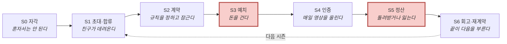
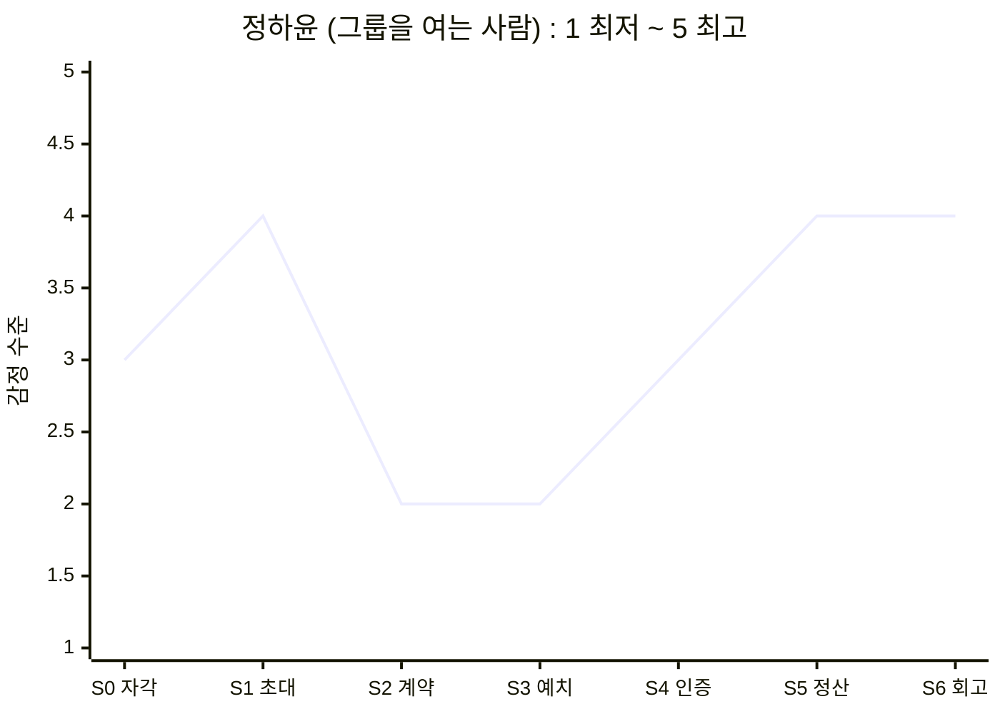
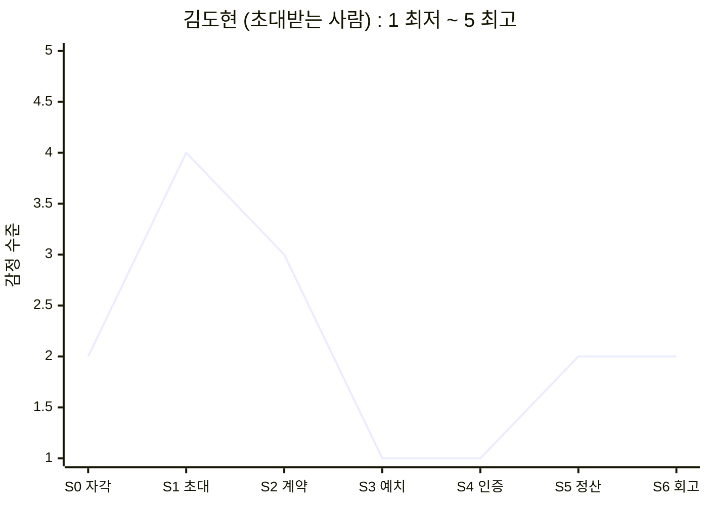

# 05-3. 고객 여정지도 (Customer Journey Map)

> 작성일: 2026-08-10 · 개정: 2026-08-10 (페르소나 14종 반영)
> 지리적 범위: 대한민국 / 통화: KRW

---

## 0. 먼저 읽어주세요 — 3분 배경

이 문서만 읽어도 이해되도록, 필요한 배경을 먼저 정리합니다. 앞선 문서를 읽지 않아도 괜찮습니다.

### 이 서비스는 무엇인가

> 친구들끼리 *"우리 이번 달엔 운동하자"* 처럼 **목표를 함께 정하고**, 시작할 때 **참가비를 미리 걸고**, 매일 **짧은 영상으로 서로에게 인증**하고, 기간이 끝나면 **해낸 만큼 돌려받는** 앱입니다.
>
> 100% 해내면 **전액 환급 + 상금**까지 받습니다. 그 상금은 못 해낸 사람의 몰수금에서 나옵니다.

### 이 문서는 무엇인가

> 이 앱을 쓸 만한 사람 — 그리고 **안 쓸 사람** — 가상 인물 **14명**이 앱을 알기 전부터 시즌이 끝난 뒤까지 무엇을 하고, 무슨 생각을 하고, 어떤 감정을 느끼고, **어디서 아파하는지**를 단계별로 정리한 지도입니다.
>
> 목적은 예쁜 그림이 아니라 **"어디를 고쳐야 하는가"**를 찾는 것입니다.

### 등장인물 14명

| | 이름 (나이) | 하는 일 | 한 줄 소개 |
|---|---|---|---|
| 🔵 **핵심** *주력 고객* | **정하윤** (26) | 마케터 | 단톡방에 *"운동하자"*를 먼저 꺼내는 방장 |
| | **김도현** (24) | 취업 준비생 | 초대는 반가운데 **참가비 3만원**에서 손이 멈춤 |
| | **박서연** (22) | 회계사 수험생 | 매일 목표를 세우는데 **매번 못 채움** |
| | **이준호** (31) | 개발자 | 돈 걸 곳이 사라진 미라클모닝 경험자 |
| | **최민지** (28) | 프리랜서 디자이너 | 12주 뒤 바디프로필, 버틸 장치가 없음 |
| 🟢 **확장** *이미 다른 걸로 해결 중* | **한지우** (29) | 러닝크루 총무 | 2년째 엑셀·계좌이체로 벌금을 걷는 중 |
| | **윤채원** (19) | 대학 1학년 | 셋로그 4개월차, **학기마다 한두 번 단기 목표**를 잡음 |
| | **홍다인** (34) | 회사 총무팀 | 5년째 앱테크, 포인트만 쌓이고 습관은 그대로 |
| | **송재현** (27) | 직장인 | 인스타 운동 부계정 운영, **편집이 부담** |
| | **여민석** (39) | 인사팀 복지 담당 | 사내 건강 챌린지가 **2주면 참여율 반토막** |
| 🔴 **극단** *제품이 부러지는 자리* | **강수빈** (27) | 3교대 간호사 | 근무표 때문에 실패하고 **돈까지 잃음** |
| | **배유진** (24) | 대학 4학년 | 헬스장이 촬영 금지라 **인증할 곳이 없음** |
| ⚪ **비활성** *안 쓰는 사람* | **서지훈** (25) | 대학원생 | BeReal을 지운 뒤 **이런 앱 자체를 거부** |
| | **조은비** (35) | 초등교사 | 친구끼리 **돈이 오가는 구조**를 받아들이지 못함 |

> 14명은 앞선 문서 `persona-02-spectrum.md`에서 만든 **가상 인물**입니다. 실제 인터뷰 대상이 아닙니다.

### 여정의 7단계

일반적인 고객 여정(문제 인식 → 탐색 → 구매 → 사용 → 유지)을 쓰지 않았습니다. 이 서비스에는 **그 틀로 담을 수 없는 세 가지**가 있어서입니다.

| 이 서비스의 특징 | 그래서 필요한 단계 |
|---|---|
| 개인이 검색해서 오지 않는다. **친구가 그룹째 데려온다** | "탐색"이 아니라 **초대** |
| 결제가 지출이 아니다. **걸었다가 돌려받거나 잃는다** | "구매"가 아니라 **예치**와 **정산** |
| 끝이 있다. 그리고 **그 끝이 다음 시작을 결정한다** | "유지"가 아니라 **회고·재계약** |

| 단계 | 쉽게 말하면 |
|---|---|
| **S0 자각** | *"혼자서는 안 되는구나"*를 인정하는 순간 |
| **S1 초대·합류** | 친구가 링크를 보내고, 앱에 들어온다 |
| **S2 계약** | 목표·요일·시각·기간·벌칙을 함께 정하고 **잠근다** (중간에 못 바꿈) |
| **S3 예치** | 참가비를 그룹 공동 통장에 미리 넣는다 |
| **S4 인증** | 약속한 시각에 짧은 영상을 올린다. 매일 반복 |
| **S5 정산** | 기간 종료. 해낸 만큼 돌려받고, 못 한 만큼은 남에게 간다 |
| **S6 회고·재계약** | 전체 영상이 한 편으로 자동 편집돼 나온다. 다음 시즌을 할지 결정한다 |

> **`예치`·`정산`·`재계약`은 가구나 자동차를 살 때는 나오지 않는 단계입니다.** 이 서비스에만 있는 관문이라 이렇게 이름을 붙였습니다.

---

## 1. 한눈에 보기 — 누가 어디서 멈추는가

**14명 전원이 끝까지 가지 않습니다. 멈추는 자리가 곧 고쳐야 할 자리입니다.**

| 이름 | **S0** 자각 | **S1** 초대 | **S2** 계약 | **S3** 예치 | **S4** 인증 | **S5** 정산 | **S6** 회고 | 어디서 어떻게 끝나나 |
|---|:-:|:-:|:-:|:-:|:-:|:-:|:-:|---|
| 🔵 **정하윤** 캡틴 | ● | ● | ● | ● | ● | ● | ● | 완주. 단 **다음 시즌도 자기가 총대** → 번아웃 위험 |
| 🔵 **김도현** 러너 | ● | ● | ● | ⚠️ | ⚠️ | ● | ◐ | **S4에서 말없이 사라진다** |
| 🔵 **박서연** 수험생 | ● | ● | ● | ● | ⚠️ | ● | ● | 완주. 단 **목표 미달이 그대로 반복** |
| 🔵 **이준호** 루틴 | ● | ⚠️ | ● | ● | ● | ● | ● | 완주. 단 **함께 할 친구가 없다** |
| 🔵 **최민지** 스프린터 | ● | ● | ● | ● | ● | ● | ● | 완주. **가장 많이 지불하는 고객** |
| 🟢 **한지우** 총무 | ● | ⚠️ | ⚠️ | ⚠️ | ● | ● | ● | 완주. 단 **18명을 다 옮겨야 한다** |
| 🟢 **윤채원** 데일리 | ● | ● | ⚠️ | ⛔ | — | — | — | **S3에서 이탈** — *"우리끼리 돈을?"* |
| 🟢 **홍다인** 앱테크 | ● | ⚠️ | ● | ⛔ | — | — | — | **S3에서 이탈** — 돈을 걸어본 적이 없다 |
| 🟢 **송재현** 운동 기록 | ● | ⚠️ | ● | ○ | ● | ○ | ● | **무료 트랙으로 완주** (걸 마감일이 없음) |
| 🟢 **여민석** 사내 담당 | ● | ⚠️ | ⚠️ | ● | ● | ⚠️ | ● | 완주. 단 **회사가 돈을 낸다** |
| 🔴 **강수빈** 교대근무 | ● | ● | ⚠️ | ● | ⛔ | ↺ | — | **지킬 수 없는 약속에 서명 → 반복 실패 → 손실 순환** |
| 🔴 **배유진** 촬영 불가 | ● | ● | ● | ● | ⛔ | ⛔ | — | **돈은 걸었는데 인증할 장소가 없다** |
| ⚪ **서지훈** 알림 거부 | ⛔ | — | — | — | — | — | — | **설명을 듣기도 전에 끝난다** |
| ⚪ **조은비** 현금 거부 | ● | ● | ● | ⛔ | — | — | — | **S3에서 이탈** — 도덕적으로 못 받아들인다 |

**기호** · `●` 통과 · `◐` 겨우 통과 · `○` 해당 없음(무료 트랙) · `⚠️` 힘들지만 통과 · `⛔` 여기서 끝 · `↺` 처음으로 되돌아감

### 이 표에서 바로 보이는 것 세 가지

> **① S3 예치가 가장 큰 벽입니다.**
> 윤채원·홍다인·조은비가 **여기서 완전히 이탈**하고, 김도현도 심하게 흔들립니다. 4명인데 **이유가 전부 다릅니다** — 손실이 무섭거나(김도현), 친구 사이에 돈이 껄끄럽거나(윤채원), 돈을 걸어본 적이 없거나(홍다인), 남의 손실로 이득 보는 게 싫거나(조은비).
>
> **② S4 인증에서 두 사람이 부러집니다 — 이건 이탈이 아니라 배제입니다.**
> 강수빈은 근무표 때문에, 배유진은 촬영 금지 헬스장 때문에 **쓰고 싶어도 못 씁니다.** 둘 다 **이미 돈을 건 뒤에** 막히므로 손실까지 발생합니다.
>
> **③ 끝까지 간 사람도 아픕니다.**
> 정하윤은 다음 시즌도 자기가 총대를 메야 하고, 박서연은 목표 미달이 그대로 반복되고, 여민석은 정작 보고할 숫자가 없습니다. **완주는 이탈로 집계되지 않아서 더 늦게 발견됩니다.**

---

## 2. 핵심 두 여정 — 같은 화면, 정반대의 경험

Core 5명은 **하나의 여정이 아닙니다.** 그룹을 **여는 사람**과 **초대받는 사람**은 같은 앱에서 정반대로 아파합니다. 이 둘만 전 단계를 펼치고, 나머지 12명은 **갈라지는 지점만** 봅니다.

---

### 2-1. 🔵 정하윤 (26) — 그룹을 여는 사람

> 대학 친구 4명 단톡방의 사실상 방장. 헬스장을 6개월 등록해 놓고 3주째 안 가고 있습니다.

| 단계 | 무엇을 하나 | 무슨 생각을 하나 | 감정 | **Pain Point (아픈 지점)** | 개선 기회 |
|---|---|---|---|---|---|
| **S0** 자각 | 단톡방에 *"우리 진짜 운동하자"*를 던진다 | *"혼자는 안 되네. 같이 하면 되지 않을까"* | 결심 + 자기혐오 | **실패를 의지 탓으로 돌린다.** 구조 문제인데 *"더 굳게 결심하면 된다"*로 결론 내려, 다음에도 같은 방식을 반복한다 | *"혼자 실패는 의지가 아니라 구조"* 라는 진단 콘텐츠로 문제를 다시 정의해 준다 |
| **S1** 초대 | 친구 4명에게 링크를 보내고 반응을 기다린다 | *"몇 명이나 들어올까. 강요처럼 보이면 어쩌지"* | 기대 + 눈치 | **초대를 보내는 것 자체가 부담이다.** 거절당하면 관계가 어색해지므로, **제안 전에 이미 심리적 비용을 치른다** | 부담 없는 초대 문구 · 미응답자에게 자동 재촉 금지 · 첫 시즌 참가비 0원으로 거절 사유 제거 |
| **S2** 계약 | 목표·요일·시각·기간·벌칙을 합의한다. 4명 일정이 전부 다르다 | *"22시로 하면 야근하는 애가 못 하는데… 조율하다 시작을 못 하겠다"* | 조율 피로 · 시작 전 소진 | **합의 비용이 시작 직전에 몰린다.** 정할 게 많을수록 그룹은 **시작하기도 전에 지친다** | 프리셋 템플릿(*주 3회 운동* 등) · 정할 항목 최소화 · 미합의 항목은 다수결 자동 확정 |
| **S3** 예치 | 방장으로서 먼저 결제하고 친구들에게 결제를 독려한다 | *"내가 먼저 내야 애들이 내지. 안 내는 애 있으면 또 내가 말해야 하네"* | 부담 + 기시감 | **독촉 역할이 첫 단계에서 되살아난다.** 미납자 추적이 방장에게 돌아오면서, **이 앱을 쓰는 이유(독촉 안 하려고)가 시작도 전에 배신당한다** | 미납 알림을 시스템이 발송(방장 이름 노출 금지) · 전원 결제 전까지 시작 자동 보류 |
| **S4** 인증 | 매일 인증하고 그룹 달성률 보드를 본다. 안 하는 친구가 눈에 띈다 | *"쟤 3일째 안 하네. 말해야 하나"* | 안도 ↔ 감시자 감각 재발 | **보이는 것이 감시로 바뀐다.** 달성률 보드가 관리 도구로 읽히는 순간, 방장은 다시 **판정자 자리로 되돌아간다** | 미달성자에게 시스템이 직접 리마인드 · 방장 화면에는 개인별 미달성 대신 **그룹 총계만** 표시 |
| **S5** 정산 | 본인은 완주해 환급 + 상금을 받는다. 못 한 친구는 몰수당한다 | *"내가 쟤 돈을 먹은 건가"* | 성취 + 죄책감 | **상금의 출처가 친구의 손실이라는 사실이 화면에 드러난다.** 친구 그룹에서 가장 위험한 지점 | 상금 출처 비노출 · **전원 달성 시 그룹 보너스**로 구조 전환 · 몰수분 다음 시즌 이월 |
| **S6** 회고 | 자동 편집된 회고 영상을 단톡방에 공유한다. *"우리 또 할래?"* | *"생각보다 잘 나왔네. 이번엔 애들이 먼저 하자고 하려나"* | 뿌듯 + 다음 시즌 부담 | **방장 역할이 고정된다.** 다음 시즌도 개설·조율·독촉이 같은 사람에게 돌아가면, 번아웃으로 **그룹 자체가 사라진다** | 방장 자동 로테이션 · 시즌 종료 시 다음 방장 지명 · **구독 혜택을 방장에게 귀속** |

---

### 2-2. 🔵 김도현 (24) — 초대받는 사람

> 취업 준비생, 카페 아르바이트 주 3회. 지출에 민감합니다. **친구들과 카톡 단톡방 인증방을 해본 경험**이 있습니다.

| 단계 | 무엇을 하나 | 무슨 생각을 하나 | 감정 | **Pain Point (아픈 지점)** | 개선 기회 |
|---|---|---|---|---|---|
| **S0** 자각 | 친구들과 했던 카톡 인증방이 2주 만에 조용해졌다. 혼자서도 3일을 넘긴 적이 없다 | *"돈이 안 걸리니까 아무도 안 하지"* | 체념 + 원인 파악 | **무료로는 안 된다는 결론까지는 왔는데, 그 대안을 겪어본 적이 없다.** 강제력이 필요하다는 건 아는데 **돈을 거는 방식은 처음이라 판단 근거가 없다** | *"무료 인증방이 왜 2주 만에 죽는가"*를 먼저 설명 → 첫 시즌은 참가비 없이 체험 |
| **S1** 초대 | 링크를 눌러 앱을 깔고 그룹 정보를 확인한다 | *"친구가 부른 거니까 일단 볼까"* | 반가움 | **가치를 겪기 전에 비용이 먼저 보인다.** 가입 직후 참가비 금액이 뜨면, 앱을 이해하기 전에 나간다 | 가입 → 그룹 구경 → 결제 순서로 재배치 · 첫 시즌 무료 셀 |
| **S2** 계약 | 방장이 정한 조건을 확인하고 수락/거절만 한다 | *"22시면 알바 끝나고 딱인데, 주 5회는 좀 센데"* | 눈치 (반대하면 분위기가 깨짐) | **협상력 없이 동의한다.** 조건 설계에 참여하지 못하고, 반대 의사는 관계가 어색해질까 봐 말하지 못한다. 결국 **자기에게 무리한 약속을 안고 시작하며, 이것이 S4 실패의 원인이 된다** | 익명 난이도 투표 · **같은 그룹 안에서 개인별 목표 강도 차등** 허용 |
| **S3** 예치 | 참가비 3만원 결제 화면에서 손이 멈춘다 | *"무료로는 안 되는 걸 아는데… 이건 잃을 수도 있잖아"* | 경계 · 손실 공포 | **필요성은 인정하는데 결정을 못 한다.** 카드 결제 화면 자체가 '지출' 신호를 주고, *"100% 하면 전액 환급"*이라는 설명이 체감되지 않는다. **강제력이 필요하다는 판단과 잃을 수 있다는 공포가 같은 화면에서 부딪힌다** | 달성률별 회수액을 미리 보여주는 **환급 시뮬레이터** · 첫 시즌 참가비 0원 · 예치금 잔액 상시 표시 |
| **S4** 인증 | 며칠 하다 이틀 밀린다. 알림만 쌓아두고 앱을 안 연다 | *"지금 올리면 밀린 게 티 나는데"* | 죄책감 → 회피 | **한 번 밀리면 돌아오는 비용이 급등한다.** 미달성이 그룹에 그대로 보이므로 하루 빠짐이 '민망함'을 만들고, 그게 영구 이탈로 굳는다. **탈퇴가 아니라 무응답으로 사라지기 때문에 붙잡을 타이밍이 없다** | 복구권(streak freeze) **기본 지급** · 미달성 사유 비공개 옵션 · 2일 연속 미달성 시 그룹이 아닌 **개인에게만 조용히 알림** |
| **S5** 정산 | 부분 달성으로 일부 몰수. 그 돈이 완주한 친구에게 간다 | *"결국 내가 돈 내고 쟤 준 거네"* | 억울함 + 자책 | **손실이 관계에 귀속된다.** 잃은 돈을 받은 사람이 익명이 아니라 **아는 친구**라서, 손실이 개인 실패를 넘어 **관계 부채**로 느껴진다 | 몰수분의 친구 귀속 비율 축소 · 1인 손실 상한 · 몰수분 다음 시즌 이월 |
| **S6** 회고 | 회고 영상에 자기 분량이 적다. 다음 시즌 초대에 답을 미룬다 | *"이번엔 빠질까"* | 위축 | **회고 영상이 완주자만의 기록이 된다.** 부분 달성자에게는 성과물이 아니라 **실패 증거**라서, 다시 할 마음을 오히려 꺾는다 | 부분 달성자 관점 편집(가장 잘한 주 하이라이트) · 그룹 비교가 아닌 **개인 진척 중심** |

---

### 2-3. 두 사람의 감정 곡선

| 단계 | **정하윤** (여는 사람) | **김도현** (초대받는 사람) | 차이 |
|---|---|---|:-:|
| S0 자각 | 3 — 결심 + 자기혐오 | 2 — 체념 | 1 |
| S1 초대 | 4 — 기대 + 눈치 | 4 — 반가움 | 0 |
| S2 계약 | 2 — 조율 피로 | 3 — 눈치 | 1 |
| S3 예치 | 2 — 부담 + 기시감 | **1 — 손실 공포** | **1** |
| S4 인증 | 3 — 안도 ↔ 감시자 감각 | **1 — 죄책감 → 회피** | **2** |
| S5 정산 | 4 — 성취 + 죄책감 | 2 — 억울함 + 자책 | **2** |
| S6 회고 | 4 — 뿌듯 + 부담 | 2 — 위축 | **2** |

> **정하윤은 S2에서 한 번 꺾였다가 완주하며 회복합니다. 김도현은 S3에서 바닥을 치고 끝까지 못 올라옵니다.**
>
> 같은 제품, 같은 그룹, 같은 화면인데 곡선이 정반대입니다. **Core를 하나의 여정으로 그리면 안 되는 이유**가 여기 있습니다.

---

## 3. 🔵 나머지 핵심 3명 — 갈라지는 지점만

| 이름 | 갈라지는 단계 | 무엇이 다른가 | **Pain Point** | 개선 기회 |
|---|---|---|---|---|
| **박서연** (22) 수험생 | **S4 인증** | 인증 대상이 몸이 아니라 **공부한 결과물**(편 책·푼 문제집)이고, **매일 목표치를 스스로 세운다** (*오늘 8시간, 3단원까지*) | **미달을 보여주는 화면이 없다.** 우리 앱도 *했다/안 했다* 이진 판정이라, "8시간 목표에 6시간"이 그냥 달성이나 미달로만 찍힌다. **목표 대비 얼마나 못 갔는지가 안 보이면 이 사람의 통증(매일 미달)은 그대로 남는다** | 목표치 대비 **부분 달성률** 기록 · **미달 폭 추이 그래프** · 목표를 스스로 낮출 수 있게 유도 |
| **이준호** (31) 루틴 | **S1 초대** | 데려올 친구가 없다. 초대가 아니라 **낯선 사람과 자동 매칭**으로 들어온다 | **그룹 제품인데 그룹 없이 도착한다.** 낯선 사람과 묶이면 S4의 사회적 압력이 약해지고, **서로 눈감아주는 담합 위험**이 동시에 커진다 | 목표별 자동 매칭 · 매칭 그룹은 랜덤 샘플 심사 강화 |
| **최민지** (28) 스프린터 | **S2 계약 S6 회고** | 기간이 D-day로 고정되고 참가비가 가장 높다. 회고 영상이 부산물이 아니라 **결과물 그 자체**다 | ① **과정이 안 남으면 이 사람을 잃는다.** 예전에 완주했을 때 남은 게 결과 사진 몇 장뿐이었고, 정작 가장 힘들었던 구간이 가장 기록이 없었다. 회고 영상이 그 기대를 못 채우면 **가장 많이 지불하는 고객을 단발로 잃는다** ② 시즌제라 **다음 목표가 생길 때까지 앱을 열 이유가 없다** | 12주 전 과정을 담은 **장편 회고본**(주차별 변화 대비) · 시즌 사이 유지용 개인 기록 모드 |

---

## 4. 🟢 확장 5명 — 이미 다른 걸로 해결 중인 사람들

> 다섯 명 모두 **이미 무언가로 이 문제를 풀고 있습니다.** 그래서 여정의 주제가 "문제를 깨닫는 것"이 아니라 **"갈아탈 이유"**입니다.

---

### 4-1. 한지우 (29) — 러닝크루 총무 · *옮겨오는 여정*

> 크루원 18명, **불참 시 5천원 벌금 규칙을 2년째 직접 운영 중.** 문제를 몰라서가 아니라 지쳐서 옵니다.

| 단계 | 무엇을 하나 | 감정 | **Pain Point** | 개선 기회 |
|---|---|---|---|---|
| **S1** 초대 | 크루원 18명을 전부 옮겨야 한다 | 막막함 | **집단 이주 비용이 크다.** 한 명이라도 안 넘어오면 앱과 엑셀을 **동시에 운영**하게 되어 총무 부담이 오히려 늘어난다 | 미가입자 대리 등록 · 부분 이주 허용 · 기존 출석 데이터 가져오기 |
| **S2** 계약 | 기존 규칙을 앱 계약으로 옮긴다 | 위화감 | **관행과 자동 집행이 충돌한다.** 2년간 굳은 재량(*"아프면 봐준다"*)이 사라지면, 규칙을 그대로 옮겼는데도 **더 각박해졌다**는 반발이 나온다 | 시즌당 면제권 N회 · 그룹 합의로 발동하는 사면 기능 |
| **S3** 예치 | 기존엔 사후 징수, 앱은 **사전 예치** | 부담 | **내는 시점이 앞당겨진다.** 총액이 같아도 크루원 체감은 *"안 내던 돈을 미리 낸다"*가 되어 저항이 생긴다 | 사후 정산 모드 제공 · 첫 시즌은 소액으로 |
| **S5** 정산 | 자동 분배가 실행된다 | 상실감 | **벌금 사용처 재량이 사라진다.** 기존엔 모인 벌금을 회식·비품에 썼는데, 자동 분배가 그 공동 재원을 없앤다 | **그룹 공동 지갑** 옵션 — 몰수분을 개인 분배 대신 크루 활동비로 적립 |

> **핵심** — 이 사람에게 필요한 건 설득이 아니라 **이주 도구**입니다. *"총무가 하던 일을 시스템이 한다"* 한 문장이면 충분하고, 대신 **18명을 옮기는 마찰**을 없애야 합니다.

---

### 4-2. 윤채원 (19) — 셋로그 사용자 · *S3에서 종료*

> 친구 7명과 셋로그를 4개월째 쓰는 대학 1학년. **평소엔 목표 없이 일상만 공유하지만, 학기마다 한두 번 단기 목표를 함께 잡습니다** — 여름 앞두고 2주 다이어트, 시험 2주 벼락치기, 여행비 3개월 저축, 공모전 2주 스프린트.

| 단계 | 무엇을 하나 | 무슨 생각을 하나 | 감정 | **Pain Point** | 개선 기회 |
|---|---|---|---|---|---|
| **S0** 자각 | 단기 목표를 잡을 때마다 도구가 없어 흩어진다 (다이어트는 단톡방, 공부는 열품타, 저축은 카톡 정산) | *"매번 이렇게 흩어지네"* | 아쉬움 | **목표가 생기는 순간이 짧고 예측이 안 된다.** 상시 마케팅으로는 안 닿고, **그 순간에 맞춰 제시되지 않으면 또 단톡방으로 간다** | 시즌 시작 시점을 학기 일정에 맞춰 제안 · **"이번 2주만" 초단기 상품** |
| **S1** 초대 | 친구가 *"이번 달만 같이 뭐 해볼래?"* | *"그 정도면 뭐"* | 가벼운 호기심 | **전환이 친구의 한마디에 달려 있다.** 그 말이 안 나오면 그냥 셋로그에 머무는데, 앱이 그 대화를 만들어내지 못한다 | 셋로그 그룹을 **통째로 초대**하는 진입점 |
| **S2** 계약 | 친구들과 목표를 정해 본다 | *"우리 그냥 노는 사인데 규칙까지?"* | 어색함 | **친목 그룹에 규칙이 들어오면 그룹의 성격이 바뀐다.** 이 사람이 지키고 싶었던 것(친구와 그냥 연결돼 있기)을 훼손한다 | 벌칙 없는 **가벼운 시즌** 모드 · '계약' 대신 '약속'이라는 말 사용 |
| **S3** 예치 ⛔ | 참가비 화면에서 **그룹 전체가 멈춘다** | **"우리끼리 돈을?"** | 거부감 | **여정 종료.** 친목 그룹에 돈 규칙이 들어오는 순간 관계가 거래로 재정의된다고 느낀다 | **참가비 없는 무료 트랙 분리** — 예치 단계 자체를 없애고 축적 가치만으로 유지 |

> **핵심** — 이 사람을 S3까지 끌고 가는 설계가 잘못됐습니다. **획득 채널이지 과금 대상이 아닙니다.** 다만 **학기마다 오는 그 한두 번의 순간**이 진짜 전환 창구입니다.

---

### 4-3. 홍다인 (34) — 앱테크 5년차 · *S3에서 종료*

> 캐시워크·토스 만보기를 5년째 매일 돕니다. 월 적립 1만원 안팎. **보상에는 거부감이 전혀 없습니다.**

| 단계 | 무엇을 하나 | 무슨 생각을 하나 | 감정 | **Pain Point** | 개선 기회 |
|---|---|---|---|---|---|
| **S0** 자각 | 5년째 리워드 앱을 도는데 변화가 없다 | *"내가 이걸 왜 하고 있지"* | 공허함 | **보상이 아무것도 만들지 않는다.** 적립은 쌓이는데 습관·건강은 그대로다 | *"포인트 말고 결과가 남는다"* 대비 소구 |
| **S1** 초대 | 친구 초대가 아니라 **광고·검색으로 혼자 온다** | *"이것도 리워드 앱인가?"* | 익숙함 | **그룹 제품인데 혼자 도착한다.** 함께할 사람이 없어 도착 즉시 우회로가 필요하다 | 보상형 유입 전용 온보딩 · 목표별 자동 매칭 |
| **S3** 예치 ⛔ | 예치·몰수 설명을 읽고 멈춘다 | *"지금까지는 받기만 했는데, 이건 잃을 수도 있네"* | 경계 | **여정 종료. '받는 돈'에서 '거는 돈'으로 넘어가는 문턱.** 5년간 한 번도 돈을 걸어본 적이 없어 **손실 가능성이 인생 처음 등장한다** | **무예치 체험 → 소액 예치 → 정상 예치** 단계적 사다리 |

> **핵심** — 이 문턱을 넘기는지가 **시장 규모 추정 전체의 전제**입니다. 사다리가 없으면 가장 큰 인접 시장이 통째로 S3 앞에 쌓입니다.

---

### 4-4. 송재현 (27) — 인스타 운동 부계정 · *무료 트랙 완주*

> 1년 전 운동 기록용 인스타 부계정을 팠습니다. `#오운완` 태그로 올립니다. **기간이 정해진 목표는 없고, 꾸준함 자체를 남기려는 사람입니다.**

| 단계 | 무엇을 하나 | 무슨 생각을 하나 | 감정 | **Pain Point / 기회** | 대응 |
|---|---|---|---|---|---|
| **S0** 자각 | 운동은 꾸준한데 **기록만 띄엄띄엄**이다. 찍는 걸 까먹고, 찍어도 편집이 부담이다 | *"아 오늘도 안 찍었네"* | 뿌듯함 ↔ 자책 | **도구의 마찰이 꾸준함을 끊는다.** 운동은 했는데 기록이 비면 **안 한 것처럼 느껴진다** | 이 사람의 두 마찰이 우리 앱의 두 기능(**약속한 시각의 짧은 영상 · 자동 편집**)과 정확히 맞물린다 |
| **S1** 초대 | 친구 초대가 아니라 혼자 들어온다. 걸 마감일도 없다 | *"이거 나 혼자 써도 되나"* | 망설임 | **기존 흐름에 들어갈 자리가 없다.** 그룹도 없고 마감일도 없어서, 그룹 계약 중심 온보딩에서 갈 곳이 없다 | **개인 기록 모드**를 첫 화면 선택지로 노출 |
| **S3·S5** 예치·정산 | **해당 없음** | — | — | **이건 결함이 아니라 트랙 구분이다.** 걸 마감일이 없으므로 예치가 성립하지 않는다 | **개인 기록용은 무료로 열어 둔다.** 매출이 아니라 **획득 자산**으로 본다 |
| **S6** 회고 | 자동 편집된 회고본을 **인스타에 올린다** | *"이건 그냥 올려도 되네"* | 만족 | **기회 — 발행이 그대로 획득 채널이 된다.** 다만 앱 표기나 워터마크가 없으면 **획득 효과가 0이다** | 회고본에 브랜드 표기 · 공유 링크에 초대 기능 내장 |

> **핵심** — 이 사람에게는 돈을 받지 않습니다. **대신 셋을 얻습니다.** ① 사용자 기반이 넓어지고 ② 나중에 그룹을 만들거나 초대받을 때 **이미 앱 안에 있고** ③ 인스타에 올라가는 회고본이 광고가 됩니다. 구독료는 보관 기간·고화질 같은 상위 특전에서 자연스럽게 나옵니다.

---

### 4-5. 여민석 (39) — 사내 건강 챌린지 담당자 · *회사가 돈을 낸다*

> 임직원 320명 회사의 인사팀 복지 담당 6년차. 매년 걷기 대회·부서별 운동 인증을 기획합니다. **예산은 복지비에서 나옵니다.**

| 단계 | 무엇을 하나 | 무슨 생각을 하나 | 감정 | **Pain Point** | 개선 기회 |
|---|---|---|---|---|---|
| **S1** 도입 결정 | 개인이 아니라 **조직이 도입을 결정**한다 | *"품의 올리고 예산 잡으려면 몇 달인데"* | 막막함 | **영업 사이클이 길다.** 예산 편성·품의·연간 계획에 묶여 **개인 가입처럼 즉시 시작할 수 없다** | 연간 예산 주기에 맞춘 제안서 템플릿 · 소규모 파일럿 요금제 |
| **S2** 계약 | 부서별 목표를 **담당자가 대신 설계**한다 | *"우리 부서는 주 3회 정도가 맞겠지"* | 책임감 | **당사자가 자기 약속을 만들지 않는다.** 이 앱의 핵심은 *"내가 과거에 한 약속"*인데, 조직 경로에서는 **"회사가 시킨 것"**이 되어 알림 강박이 되살아난다 | 회사는 **틀만** 정하고 세부 조건은 **직원 그룹이 직접 계약**하게 분리 |
| **S3** 예치 | **회사가 예산으로 공동 통장을 채운다** | *"직원 돈은 안 들어가니까 반발은 없겠네"* | 안심 | **양날이다.** 개인이 잃을 게 없으니 **S3 이탈 요인 3개가 한꺼번에 사라지지만**, 동시에 **잃을 게 없으면 강제력도 약해진다** | 회사 예산 + 소액 개인 예치를 **섞는** 구조 검토 |
| **S5** 정산 | 결과를 경영진에 보고해야 한다 | *"참여 인원 말고 뭘 보고하지"* | 답답함 | **조직용 화면이 없다.** 개인 정산 화면만 있고, **부서별 달성률·지속률·이탈 시점** 같은 보고 가능한 숫자를 뽑아낼 수 없다 | 관리자 대시보드 · 부서별 리포트 자동 생성 |

> ### 🔍 이 여정이 가장 중요한 이유
> 지금까지 확인된 **최대 이탈 관문은 S3 예치**입니다. 김도현·홍다인·조은비가 모두 여기서 멈춥니다.
>
> **그런데 이 경로에서는 개인이 돈을 걸지 않습니다.** 회사가 예산으로 채우고 직원은 잃을 게 없습니다. **가장 큰 벽을 구조적으로 우회하는 유일한 경로**입니다.
>
> 대가는 **긴 영업 사이클**과 **"회사가 시킨 것"이 되는 위험**입니다. 후자가 더 위험합니다 — 자기구속이라는 제품의 근본 원리가 무너지기 때문입니다.

---

## 5. 🔴 극단 2명 — 쓰고 싶어도 못 쓰는 사람들

> 두 사람은 **이탈이 아니라 배제**입니다. 그리고 둘 다 **이미 돈을 건 뒤에** 막히므로 손실까지 발생합니다.

---

### 5-1. 강수빈 (27) — 3교대 간호사 · *반복 실패 → 손실 순환*

> **근무표가 2주 단위로 바뀌고** 데이·이브닝·나이트가 섞입니다. 유료 챌린지 참가 6회 중 완주는 1회입니다.

| 단계 | 무엇을 하나 | 무슨 생각을 하나 | 감정 | **Pain Point** | 개선 기회 |
|---|---|---|---|---|---|
| **S2** 계약 ⚠️ | 고정 시각을 골라 계약을 잠근다 | *"이번 주는 22시가 되는데… 일단 이걸로 해보자"* | 불안한 낙관 | **지킬 수 없는 약속을 스스로 고르는데, 그걸 알아차릴 장치가 없다.** 문제는 '중간에 못 바꾼다'는 규칙이 아니다 — 자기구속은 이 앱의 핵심이므로 유지해야 한다. **문제는 계약 전에 아무것도 묻지 않는다는 것**이다 | **① 계약 전 진단 설문** — 직업·근무 형태·주간 생활 패턴을 본인이 직접 되짚게 해서 **지킬 수 있는 조건을 스스로 고르게** 만든다 **② 주간 총량 계약** — 시각을 못 고정하는 사람은 *"주 4회"*처럼 **횟수로** 약속하게 한다 |
| **S4** 인증 ⛔ | 나이트 근무 다음 날 미달성이 쌓인다 | *"게을러서가 아닌데"* | 억울함 | **실패 사유를 구분하지 않는다.** 게으름과 근무 충돌이 똑같은 '미달성'으로 기록되어, **시스템이 이 사람의 노력을 인정할 방법이 없다** | 사유 태깅(근무/질병/개인) · 사유별 페널티 차등 |
| **S5** 정산 ↺ | 3만원 중 1~2만원이 몰수돼 완주자에게 간다. 그리고 **다시 참가한다** | *"또 잃었네. 다음엔 만회해야지"* | 학습된 무력감 + 만회 욕구 | **손실 후 재참가를 제품이 촉진한다.** 이 사람의 손실이 곧 완주자의 상금 재원이므로 **시스템에는 이 순환을 멈출 유인이 없다.** 재참여 동기가 회복 의지인지 손실 추격인지 본인도 구분하지 못한다 | **누적 손실 상한** · 연속 실패 시 강제 휴식 · 난이도 자동 하향 · 손실 누계 상시 표시 |

> ### ⚠️ 이 여정은 제품 리스크입니다
> **원인과 결과가 한 줄로 이어집니다** — 계약 전 진단이 없어서 → 지킬 수 없는 약속을 하고 → 반복 실패하고 → 손실이 쌓이고 → 그 손실이 남의 상금이 됩니다.
>
> 즉 **사행성 리스크의 원인이 설계 구멍**입니다. 계약 전 진단 설문과 주간 총량 계약을 넣는 것이 그대로 **규제 리스크 완화책**이 됩니다.
>
> 더 위험한 것은 **이 순환이 이탈이 아니라 잔존으로 집계된다**는 점입니다. 리텐션 지표에서는 우량 사용자로 보입니다. **손실 누계를 별도 지표로 보지 않으면 발견되지 않습니다.**

---

### 5-2. 배유진 (24) — 촬영 금지 환경 · *돈은 걸었는데 찍을 곳이 없다*

> 학교 체육관과 동네 헬스장에서 주 4회 운동합니다. **두 곳 다 촬영 금지 규정**이 있고, 붐비는 시간엔 뒤로 다른 사람들이 전부 찍힙니다.

| 단계 | 무엇을 하나 | 무슨 생각을 하나 | 감정 | **Pain Point** | 개선 기회 |
|---|---|---|---|---|---|
| **S2·S3** 계약·예치 | 여기까지는 문제없이 통과한다 | *"할 수 있겠는데"* | 기대 | **문제가 없다는 게 문제다.** 촬영 가능 여부를 아무도 묻지 않아, **돈을 걸고 나서야 막힌다** | S2 진단 설문에 **운동 장소의 촬영 가능 여부** 포함 |
| **S4** 인증 ⛔ | 헬스장에서 폰을 들면 눈총을 받는다. 제지당한 적도 있다 | *"이거 찍어도 되나"* | 눈치 · 수치심 | **인증 수단이 하나뿐이라, 촬영 불가 환경이 곧 배제 환경이 된다.** 결국 탈의실에서 억지로 찍거나 포기한다. 이는 개인 성향이 아니라 **환경 제약**이다 | 얼굴 자동 블러 · **기구 계기판·기록 화면만 인증** · 웨어러블 데이터 연동 |
| **S5** 정산 ⛔ | 인증을 못 해 몰수당한다 | *"운동은 했는데 돈만 잃었네"* | 억울함 | **운동을 실제로 했는데 증명 수단이 없어서 잃는다.** 강수빈과 결말은 같지만 **원인이 다르다** — 근무표가 아니라 장소다 | 대체 인증 수단 도입 전까지 **촬영 제약 사용자 무벌칙 트랙** |

> ### ⚠️ 여기에 정면 충돌이 있습니다
> 대체 인증 수단(블러·계기판·웨어러블)은 **어뷰징 방어와 부딪힙니다.** 현재 방어책은 *실시간 촬영만 허용 · 갤러리 업로드 차단 · 얼굴 일관성 검사*인데, **포용성을 넓힐수록 위조 난도가 낮아집니다.**
>
> **수단마다 위조 난도를 따로 설계**하지 않으면 둘 중 하나를 반드시 포기하게 됩니다.

---

## 6. ⚪ 비활성 2명 — 안 쓰는 사람들

> 두 사람의 여정은 **짧습니다.** 짧다는 것이 곧 발견입니다 — 어디서 끊기는지가 시장 진입 장벽의 위치입니다.

| 이름 | 어디서 끝나나 | 무슨 생각을 하나 | **Pain Point** | 개선 기회 |
|---|---|---|---|---|
| **서지훈** (25) 대학원생 | **S0 자각** ⛔ 앱 이름을 듣는 순간 | **"또 알림이지?"** | **설명을 듣기도 전에 분류가 끝난다.** BeReal에서 *"지금 알림 울렸으면 좋겠다"*고 생각한 순간 소름이 끼쳐 지웠고, 그 경험이 **이런 앱 전체에 대한 거부**로 굳었다. 차별점(*알림을 내가 정한다*)은 한 문장으로 전달되지 않는 개념이라, **설명이 길어질수록 방어가 세진다** | 첫 문장을 **"알림을 내가 정한다"**로 · 설명 대신 **체험**(알림 없는 무음 시즌 1주) |
| **조은비** (35) 초등교사 | **S3 예치** ⛔ 구조를 이해한 순간 | **"그럼 못 한 사람 돈을 내가 먹는 거잖아요"** | **환급 논리가 도덕 판단을 이기지 못한다.** *"100% 하면 전액 환급"*은 **손실 걱정**에 대한 답인데, 이 사람의 반대는 손실이 아니라 **'남의 손실로 내가 이득 보는 구조'**다. **답하려는 질문 자체가 다르다** | **비제로섬 트랙** — 상금 재원을 몰수분이 아니라 플랫폼·구독료에서 조달하는 모드 분리 |

> ### 🔍 여기서 나온 중요한 발견
> *"거는 돈이 아니라 맡기는 돈"*이라는 완화 문구는 **김도현(손실 공포)에게는 유효하지만 조은비(도덕 판단)에게는 무효**합니다. 두 사람의 거부 이유가 다른데 **하나의 카피로 대응하고 있었습니다.**
>
> 서지훈에 대해서는 판단이 다릅니다 — **이 사람을 데려오려고 만든 기능은 핵심 고객 경험을 망가뜨릴 확률이 높습니다.** 다만 *"약속형 알림이 이 거부감을 실제로 푸는가"*는 A/B로 확인할 가치가 있습니다.

---

## 7. Pain Point 종합 — 단계별로 모아 보기

> 14명의 여정에서 나온 아픈 지점을 단계별로 모으면 **어느 단계가 구조적으로 아픈지**가 드러납니다.

| 단계 | 걸리는 사람 | **이 단계의 본질적 통증** | 성격 |
|---|---|---|---|
| **S0 자각** | **서지훈** 이탈 | **설명 이전에 분류가 끝난다** | 인식 |
| **S1 초대** | **이준호 · 홍다인 · 송재현** (그룹 없이 도착) **한지우** (18명을 옮겨야) **여민석** (조직 결정) | **그룹 제품인데 그룹 없이 오거나, 그룹째 옮겨야 한다** | 획득 |
| **S2 계약** | **강수빈** (지킬 수 없는 약속) **정하윤 · 김도현** (조율·협상력) **여민석** (남이 대신 설계) | **계약 전에 아무것도 묻지 않는다.** 합의 비용은 시작 전에 몰리고, 지킬 수 있는지는 확인되지 않는다 | 🔧 설계 |
| **S3 예치** | **김도현 · 윤채원 · 홍다인 · 조은비** — **4명 이탈** | **'받는 돈 → 거는 돈' 전환 문턱.** 손실 공포·관계 화폐화·경험 부재·도덕 판단이 **서로 다른 이유로 같은 화면에서 멈춘다** | 💰 **최대 관문** |
| **S4 인증** | **강수빈 · 배유진** 배제 **김도현 · 박서연** 마찰 | **한 번 밀리면 복귀 비용이 급등하고, 인증 수단과 판정 방식이 하나뿐이다** | 리텐션·포용성 |
| **S5 정산** | **강수빈** 순환 **배유진** 부당 몰수 **정하윤 · 김도현** 관계 손상 **여민석** 보고 불가 | **상금의 출처가 아는 사람의 손실이라는 사실이 드러난다.** 그리고 조직용 집계 화면이 없다 | ⚖️ 윤리·관계 |
| **S6 회고** | **정하윤 · 김도현 · 최민지** | **회고본이 완주자만의 기록이고, 방장 역할이 고정된다** | 확산 |

### 네 줄 요약

> **① S3 예치가 가장 큰 벽입니다.** 4명이 멈추는데 **이유가 전부 다릅니다.** 하나의 문구로는 안 되고, 이유별로 다른 처방(무료 트랙 / 예치 사다리 / 비제로섬 모드)이 필요합니다.
>
> **② S2 계약의 문제는 '못 바꾸는 것'이 아니라 '묻지 않는 것'입니다.** 자기구속은 이 앱의 핵심이므로 유지해야 합니다. **계약 전에 생활 패턴과 촬영 환경을 묻는 진단**이 없어서, 지킬 수 없는 약속에 서명하게 됩니다.
>
> **③ S4에서 두 사람이 배제됩니다.** 강수빈(근무표)과 배유진(촬영 금지) 모두 **돈을 건 뒤에** 막힙니다. 인증 수단이 하나뿐인 것이 원인입니다.
>
> **④ 완주자도 아프고, 그게 더 늦게 발견됩니다.** 방장의 죄책감, 러너의 관계 부채, 강수빈의 손실 순환은 모두 지표상 **'잔존'**으로 잡힙니다. **손실 누계를 별도 지표로 관리**하지 않으면 보이지 않습니다.

---

## 8. 개선 기회 우선순위

| 순위 | 무엇을 고치나 | 어느 단계 | **누구의 무엇을 푸나** | 왜 이 순위인가 |
|:-:|---|:-:|---|---|
| **1** | **계약 전 진단 설문** — 직업·근무 형태·주간 패턴·운동 장소의 촬영 가능 여부를 본인이 되짚게 한다 | S2 계약 | **강수빈**의 *지킬 수 없는 약속* **배유진**의 *찍을 곳 없음* | **배제된 두 사람을 한 번에 복구**하고, 사행성 리스크의 원인까지 함께 줄인다. 구현 난도도 낮다 |
| **2** | **예치 사다리** — 무예치 체험 → 소액 예치 → 정상 예치 | S3 예치 | **김도현**의 *손실 공포* **홍다인**의 *예치 경험 부재* | 최대 관문이고, 여기서 멈추는 4명 중 **2명이 이 처방으로 통과 가능** |
| **3** | **비제로섬 트랙** — 상금 재원을 몰수분이 아니라 구독료·플랫폼에서 조달 | S3 예치 S5 정산 | **조은비**의 *도덕 판단* **정하윤·김도현**의 *관계 비용* | S3와 S5의 통증을 동시에 제거. 단 **수익 구조 재설계가 선행**돼야 한다 |
| **4** | **주간 총량 계약 + 유동 윈도우** — 시각이 아니라 횟수로 약속 | S2 계약 | **강수빈**의 *불규칙 근무* | 1번(진단)이 문제를 찾아주고, 이것이 처방이 된다. 교대 근무자 규모 확인 선행 `[미측정]` |
| **5** | **대체 인증 수단** — 얼굴 블러 · 기구 계기판 · 웨어러블 연동 | S4 인증 | **배유진**의 *환경 제약* | 포용성에 필수. 단 **어뷰징 방어와 충돌**하므로 수단별 위조 난도 설계가 함께 필요 |
| **6** | **복구권 기본 지급 + 미달성 사유 태깅** | S4 인증 | **김도현**의 *무응답 이탈* **강수빈**의 *사유 미구분* | 리텐션 직결이면서 구현 난도가 가장 낮다 |
| **7** | **방장 부담 이관** — 리마인드 시스템 발송, 방장 화면은 총계만, 역할 로테이션 | S3·S4·S6 | **정하윤**의 *독촉 재발과 역할 고정* | 방장 번아웃은 개인 이탈이 아니라 **그룹 전체 소멸**로 이어진다 |
| **8** | **누적 손실 상한 + 연속 실패 시 강제 휴식** | S5 정산 | **강수빈**의 *손실 순환* | 🔴 사행성 심사 대응과 직결 — 규제 리스크라 **우선순위 상향 여지 있음** |
| **9** | **부분 달성 기록** — 목표치 대비 달성률과 미달 폭 추이 | S4 인증 | **박서연**의 *미달이 안 보임* | 이진 판정(했다/안 했다)으로는 이 사람의 통증이 그대로 남는다 |
| **10** | **무료 개인 트랙** — 그룹 없이 기록만 하는 모드 | S1·S3 | **송재현**의 *들어갈 자리 없음* **윤채원**의 *관계 화폐화 거부* | 매출은 없지만 **획득 자산**. 회고본 발행이 그대로 광고가 된다 |
| **11** | **장편 회고본** — 주차별 변화를 담은 과정 기록 | S6 회고 | **최민지**의 *과정이 안 남음* **김도현**의 *실패 증거가 됨* | 가장 많이 지불하는 고객을 단발로 잃지 않기 위해 |
| **12** | **조직용 관리자 대시보드** — 부서별 달성률·지속률 리포트 | S5 정산 | **여민석**의 *보고할 숫자 없음* | 조직 경로 자체의 성립 조건. 단 영업 사이클이 길어 후순위 |

---

## 부록. 이 문서의 한계

1. **여정 전체가 추론입니다.** 사용자 인터뷰나 행동 로그가 없고, 14명은 `persona-02-spectrum.md`에서 만든 가상 인물입니다. 그 문서 자체가 검증 단계를 거치지 않았으므로 **여정지도도 같은 미검증 상태를 물려받습니다.**
2. **이탈 지점은 가정입니다.** *"S3에서 4명이 멈춘다"*는 페르소나 서술에서 논리적으로 끌어낸 것이지 **관측된 이탈률이 아닙니다.** 파일럿에서 단계별 퍼널을 실측해야 합니다.
3. **감정 곡선의 숫자는 서술적 표현이지 측정값이 아닙니다.** 상대적인 형태만 의미가 있습니다.
4. **제품이 아직 존재하지 않습니다.** S2~S6은 설계안을 전제로 그렸으므로, 실제 구현이 달라지면 여정도 달라집니다.
5. **여민석(조직 경로)은 전례를 대입한 추론입니다.** 사내 건강 챌린지가 실재하는 것은 확인됐지만, **"회사가 공동 통장을 채우는" 구조가 법적·회계적으로 성립하는지는 검토하지 않았습니다.**
6. **S1 이전(인지·유입 경로)이 얕습니다.** 셋로그 네트워크를 통한 유기적 확산을 전제했으나, 그 확산이 실제로 일어나는지는 미검증입니다.
