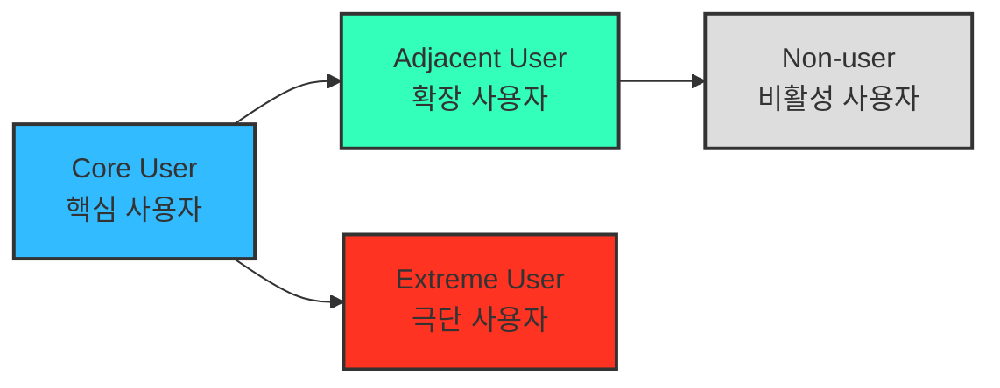

# 05 — 페르소나 · 페르소나 스펙트럼 · 고객 여정지도 분석 방법론

> 본 문서는 05 챕터에서 진행할 모든 고객 정의 분석의 **기준 프레임**입니다.
> 개별 분석 결과는 이 방법론을 그대로 적용해 별도 문서로 작성합니다.

**이 문서의 범위** — 챕터 구성(페르소나 → 페르소나 스펙트럼 → 고객 여정지도)에 따라 **§2 페르소나 스펙트럼**과 **§3 고객 여정지도**가 확정돼 있으며, §1은 후속 작성 예정입니다. 절 번호는 챕터 구성 순서를 그대로 따릅니다.

---

## 2. **페르소나 스펙트럼 (Persona Spectrum)**

> 더 정확한 방법으로 내 서비스를 둘러싼 "여러 유형의 페르소나와 유형별 특성"을 파악하고, 구체적인 사례까지 확인합니다!

- 극단적·비전형적 사용자까지 포함해 서비스의 **포용성(Inclusivity)** 과 **사용 맥락의 다양성**을 확보하는 분석 방법.



**페르소나 스펙트럼 유형별 설명**

| 구분 | 설명 | 목적 | 생성 포인트 |
| --- | --- | --- | --- |
| **핵심(Core)** | 이상적인 주요 고객군 | 주력 타깃 설정 | 매출/사용 빈도 중심 |
| **확장(Adjacent)** | 유사 문제를 가진 인접 시장군 | 확장 기회 탐색 | 유사 니즈/다른 맥락 |
| **극단(Extreme)** | 제약·극단적 상황을 가진 사용자 | 제품 개선 및 포용적 설계 | 실패·불편·대안 사용 중심 |
| **비활성(Non-user)** | 아직 사용하지 않거나 회피하는 집단 | 시장 진입 장벽 및 거부 요인 파악 | 인식·가치·신뢰 결여 중심 |

**페르소나 스펙트럼 도출 핵심 질문**

- (확장) "유사한 제품/서비스를 사용하고 있는 사람은 누구인가?"
- (비활성) "이 제품/서비스를 `사용할 수 없는 사람`은 누구인가?"
- (극단) "가장 자주 실패를 경험하는 사람은 누구인가?"

> 💡 **AI 활용 방향**
> AI를 고객의 '다양한 가능성'을 빠르게 탐색하는 프로토타이핑 파트너로 삼아 각 사용자 군의 맥락적 특성과 감정적 동기를 가상으로 생성

### ⚙️ **AI 기반 다중 페르소나 생성 및 평가 워크플로우**

| 단계 | 목적 | AI 프롬프트 예시 | 산출물 |
| --- | --- | --- | --- |
| **① 1차 생성 (Divergent Thinking)** | 각 스펙트럼 유형별 3~5개 버전 생성 | "핵심 사용자 5명, 확장 사용자 3명, 극단 사용자 2명, 비활성 사용자 2명을 만들어줘. 각자는 이름, 직무, 문제, 목표, 감정, 대체 솔루션을 포함해." | 총 10~12개 페르소나 원본 |
| **② 2차 평가 (Convergent Filtering)** | 생성된 페르소나를 평가 및 선별 | "각 페르소나를 문제·행동·맥락의 현실성 기준으로 평가해, 상위 1개씩만 추천해줘." | 4개 대표 페르소나 (Core, Adjacent, Extreme, Non-user) |
| **③ 3차 보정 (Contextual Rewriting)** | 사업 주제에 맞게 언어 및 상황 맞춤화 | "우리의 서비스 맥락(예: SaaS 컨설팅 플랫폼)에 맞춰 다시 기술해줘." | 실제 적용 가능한 4종 페르소나 카드 |
| **④ 4차 검증 (AI Peer Review)** | 다중 AI 교차검증 | "이 4명의 페르소나가 실제 시장에서 존재할 확률과 근거를 설명해줘." | 검증 코멘트 요약 리포트 |
| **⑤ 5차 통합 (Spectrum Map)** | 페르소나 간 관계 구조화 | Mermaid / Figma로 시각화 | Persona Spectrum Map 완성 |

---

## 3. **고객 여정지도 (Customer Journey Map, CJM)**

> 고객이 "문제를 인식 → 해결을 탐색 → 구매/사용 → 평가/유지"와 같은 과정에서 겪는 경험, 감정, Pain Point를 시각화한 흐름도.

### ❓ 고객 여정의 단계를 정의하는 방법

참고 문헌 · IBM 「고객 여정 지도란 무엇인가」 — https://www.ibm.com/kr-ko/think/topics/customer-journey-map

> 🖼️ 원본 자료 · `스크린샷 2025-11-05 오후 5.15.22.png` — 단계 정의 방법 도식 (파일 미첨부)

### 💡 비즈니스 유형별로 `매우 다른` 맞춤형 고객 여정지도가 도출될 수 있음!

> 잘 만들어진 고객 여정지도는 **내 서비스에 대해 고객의 생각과 행동 반경을 잘 담고 있는 체계적인 분석도구**

| 시장 | 그 시장에서만 나타나는 핵심 단계 |
|---|---|
| **가구** | **`실측`** · **`조립/설치`** |
| **자동차** | **`비교`** · **`시승`** · **`협상`** |

> 🖼️ 원본 자료 · 가구 `2024062811125844038-1.jpg` / 자동차 `스크린샷 2025-11-05 오후 5.20.22.png` (파일 미첨부)

> ***"예쁘면 다 좋은 게 아니라, 지식으로서 가치있는 부분을 가독성 높고 재사용하기 쉽게 추출하기"***

### 3-1. 기본 구성 — 6열 구조

| **단계** | 고객 행동 | 고객 생각 | 감정 | Pain Point | 개선 기회 |
| --- | --- | --- | --- | --- | --- |
| **문제 인식** | 불편함을 느낌 | "이 문제 왜 생기는 거지?" | 불안 | 정보 부족 | 문제 원인 콘텐츠 제공 |
| **탐색** | 대안을 찾음 | "이건 괜찮아 보이는데?" | 기대 | 복잡한 비교 | 비교 툴 제공 |
| **의사결정** | 선택 고민 | "이걸 사도 될까?" | 불안 | 신뢰 부족 | 후기·데모 제공 |
| **사용** | 실제 사용 | "생각보다 어렵네" | 실망 | UX 미흡 | 온보딩 개선 |
| **유지** | 반복 사용 | "이제 익숙해졌네" | 안정 | 가치 감소 | 리텐션 캠페인 |

---

> # ⚠️ 반드시 기억할 것 — 단계는 매번 새로 정의한다
>
> **고객 여정지도는 항상 같은 단계로 작성되는 균일한 산출물이 아니다.**
> 위 §3-1의 다섯 단계(문제 인식 · 탐색 · 의사결정 · 사용 · 유지)는 **템플릿이 아니라 예시**다. 이 표를 그대로 가져다 칸만 채우면, 어느 서비스에 붙여도 말이 되지만 **어느 서비스도 설명하지 못하는** 문서가 나온다.
>
> **왜 그런가** — 가구 시장의 고객은 `실측`과 `조립/설치`라는 관문을 반드시 통과하고, 자동차 시장의 고객은 `비교`·`시승`·`협상`을 통과한다. 이 단계들이 빠진 여정지도는 그 시장의 고객을 설명하지 못한다. **핵심 단계는 서비스의 특성에서 도출되는 것이지, 프레임워크가 미리 정해주는 것이 아니다.**
>
> **따라서 작성 순서가 뒤집혀야 한다**
> ```
> ❌ 표를 먼저 놓고 → 칸을 채운다
> ✅ 그 서비스에서 고객이 실제로 통과하는 관문을 먼저 찾고 → 그것을 단계로 세운다
> ```
>
> **자가 점검 (리트머스 테스트)**
> 완성한 여정지도의 **단계 이름을 다른 서비스에 그대로 붙여봤을 때 어색하지 않다면**, 그 여정지도는 아직 **우리 서비스의 것이 아니다.** 그 서비스에서만 성립하는 단계 이름이 최소 하나는 나와야 한다.
