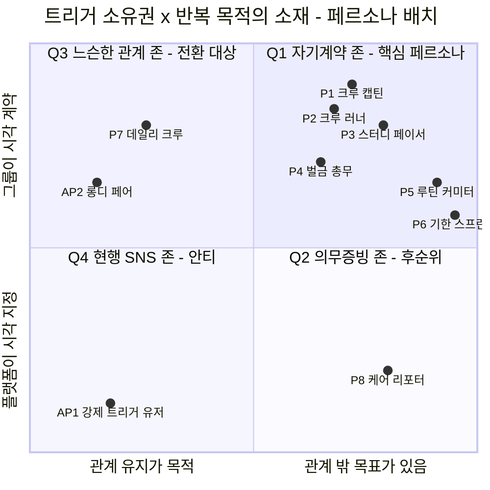

# 05-1. 일반 페르소나 추출 — 보상형 그룹별 일상 숏폼 공유 플랫폼

> 작성일: 2026-08-10
> 지리적 범위: 대한민국 / 통화: KRW
> **문서 위치:** 본 문서는 **04 챕터의 Market Segment Map에서 세그먼트 단위로 페르소나를 추출**한 결과다. 방법론 §1(페르소나)에 해당하며, **세그먼트 1:1 대응**이 원칙이다.
>
> | 구분 | 문서 | 성격 |
> |---|---|---|
> | **05-1 (본 문서)** | `persona-01-general.md` | 세그먼트 기반 · 8종 + 안티 3종 · **집단 단위** |
> | 05-2 | `persona-02-spectrum.md` | 스펙트럼 기반 · Core/Adjacent/Extreme/Non-user · **개인 단위** |
>
> 두 문서는 대체 관계가 아니라 **입력 → 출력** 관계다. 05-2는 본 문서의 세그먼트 페르소나를 원재료로 삼아 극단·비활성 사용자까지 확장한다.
> **문서 위치(상세):** 시장 규모·세그먼트 정의는 아래 선행 문서에 있으며, 여기서는 **그 세그먼트가 실제로 어떤 사람인가**만 확정한다.
>
> | 선행 문서 | 역할 |
> |---|---|
> | `04-tam-sam-som/시장분석 종합보고서 (TAM-SAM-SOM).md` | TAM·SAM·SOM · Market Segment Map(§6) · 세그먼트 규모 |
> | `04-tam-sam-som/보상형 그룹별 일상 숏폼 공유 플랫폼(아이디어).md` | 제품 정의 · 핵심 루프 6단계 · 수익 구조 · 어뷰징 방어 |

**표기 규약** (선행 문서와 동일): `[실측]` 1차 출처 직접 확인 / `[추정]` 실측치 + 명시 가정으로 계산 / `[러프]` 유사 시장 대입, 오차 ±50% 이상

---

## 0. 한 장 요약

| # | 페르소나 유형명 | 원 세그먼트 | 역할 | 주요 문제 | 목표 | 사용 맥락 |
|---|---|---|---|---|---|---|
| **P1** | **크루 캡틴** | F1 (108만) | 그룹 개설자·계약 설계자 | 단톡방 챌린지가 2주 만에 소멸, 독촉자 역할이 나에게만 | 관계를 상하지 않고 그룹을 완주시키기 | 결심 시점에 단톡방에서 제안 → 앱에서 계약 개설 |
| **P2** | **크루 러너** | F1 (108만) | 초대받은 참가자·예치금 결제 주체 | "돈을 잃을 수 있다"는 진입 장벽, 밀리면 미안해서 조용히 이탈 | 남의 리듬에 얹어서 해내기 · 손해 0 | 초대 링크 → 첫 챌린지 → 인증 시각 ±윈도우 촬영 |
| **P3** | **스터디 페이서** | F2 (69만) | 학습·독서 그룹의 인증 관리자 | 타이머는 시간만 재고 "뭘 했는지"는 증명 안 됨 | 매일 했다는 사실을 자산으로 남기기 | 도서관·카페·책상, 고정 시각(예: 22:00) 인증 |
| **P4** | **벌금 총무** | F3 (41만) | 이미 벌금 규칙을 운영 중인 모임 운영진 | 벌금 수금·정산이 수기라 신뢰 마찰과 감정 소모 | 규칙 집행을 사람이 아니라 시스템이 하게 | 기존 규칙을 앱 계약으로 이식, 자동 몰수·분배 |
| **P5** | **루틴 커미터** | A1 (128만) | 친구 그룹 없이 목표만 있는 개인 참가자 | 챌린저스 피벗 이후 갈 곳 없음, 혼자 하면 3일 | 무기한 습관을 돈으로 고정 | 오픈 그룹 매칭 → 헬스장·집, 기상/운동 인증 |
| **P6** | **기한 스프린터** | A2 (40만) | 종료일이 박힌 단기 집중 참가자 | 실패 비용은 큰데 중간 이탈 방지 장치가 없음 | D-day까지 완주 · 실패가 실제로 아프기를 원함 | 8~12주 시즌제, 고액 참가비, 회고본이 결과물 |
| **P7** | **데일리 크루** | C2 (428만) | 셋로그·BeReal 현 사용자 — **획득 채널** | P2 반복의 지루함으로 몇 달 뒤 이탈 | 친구와 계속 연결돼 있기 (달성이 아님) | 이미 그룹 존재 → 한 문장으로 F1/F2 전환 |
| **P8** | **케어 리포터** | B2 (85만) | 기관 소속 증빙 수행자 (계약 주체 = 기관) | 증빙이 업무 부담, 분쟁 시 방어 수단 부재 | 증빙 시간 단축 · 자기 방어 | 근무 중, 기관 지정 시각, 보호자에게 공유 |

**안티 페르소나** — AP1 강제 트리거 유저(D1) · AP2 롱디 페어(C1) · AP3 인증 어뷰저

### 이 8+3인이 이후 어떻게 됐는가 — 최종 확정안과의 대응

> **후속 단계와의 일관성 확인** — 여기의 세그먼트 단위 페르소나는 05-2에서 **개인 단위 14인**으로 전개됐고, 08에서 **Y1 진입 스코프**가 확정됐다. **어느 것이 지금 유효한지**를 한 표로 고정한다.

| # | 유형 | 05-2 전개 | **08 최종 스코프** |
|:-:|---|---|---|
| **P1** | 크루 캡틴 | → C-01 정하윤 | **Y1 코어** — Pain `01` DOS 1.86, F05 자동 독촉의 근거 |
| **P2** | 크루 러너 | → C-02 김도현 | **Y1 코어** — Pain `04` DOS 1.86, F07 0원 체험의 근거 |
| **P3** | 스터디 페이서 | → C-03 박서연 | **Y2** — `SEG-F2` 진입은 F10·F12(진도형)가 전제 |
| **P4** | 벌금 총무 | → A-01 한지우 *(Core→Adjacent 재배치)* | **Y2** — `SEG-F3`. 신규 수요가 아니라 **기존 해법의 이식** 대상 |
| **P5** | 루틴 커미터 | → C-04 이준호 | **Y2** — Pain `11`이 **DOS 최고(2.21)**인데도 이연. **점수가 아니라 진입 순서 판단**(그룹을 새로 만들어 줘야 해서 CAC가 높다) |
| **P6** | 기한 스프린터 | → C-05 최민지 | **Y3** — ARPU 최고(12,000원)이나 세그먼트가 40만으로 가장 작다 |
| **P7** | 데일리 크루 | → A-02 윤채원 | **직접 과금 대상 아님 · 획득 채널** — Q3→Q1 전환 공급원(143만) |
| **P8** | 케어 리포터 | **미승계** | **범위 밖** — 기관이 계약 주체인 B2B라 *"유사 니즈·다른 맥락"*이 아니라 **제품 자체가 다르다.** 조직 경로는 P8이 아니라 **05-2에서 새로 발산한 여민석(사내 챌린지 담당)**이 담당한다 |
| **AP1** | 강제 트리거 유저 | → N-01 서지훈 (안티 → 비활성으로 재해석) | **회피 유지** — Goal이 제품과 반대라 AOS **0.0** |
| **AP2** | 롱디 페어 | **미승계** | **배제 유지** — 2인 구조라 바이럴 계수가 구조적으로 1 미만 |
| **AP3** | 인증 어뷰저 | **미승계** (고객이 아니라 위협 모델) | **별도 트랙으로 살아 있다** — 어뷰징 방어 5벡터가 MVP 필수 사양 |

> **⚠️ 세 건(P8·AP2·AP3)은 05-2에서 빠졌지만 "폐기"가 아니다.** P8은 별도 제품, AP2는 배제 결정, AP3는 **고객이 아니라 방어 대상**으로 성격이 바뀐 것이다. **왜 뺐는지가 판단 기록이므로 이 표를 남긴다.**

---

## 1. 추출 방법 — 세그먼트에서 페르소나로

### 1.1 무엇을 추가했는가

Market Segment Map은 **두 축**으로 세그먼트를 갈랐다.

| 축 | 이름 | 대응 페인포인트 |
|---|---|---|
| Y (세로) | 트리거 소유권 — 촬영 시각을 누가 정하는가 | **P1** 알림 트리거의 강박 |
| X (가로) | 반복 목적의 소재 — 반복에 관계 밖 목표가 있는가 | **P2** 콘텐츠 반복성의 지루함 |

이 두 축은 **집단의 성질**을 가르지만 **집단 안의 사람**을 가르지는 못한다. 페르소나 추출에서는 **축 하나를 더 세운다.**

> ### **Z축 — 그룹 내 역할 (계약을 설계하는가, 수용하는가)**

**왜 필요한가** — 본 서비스는 개인 제품이 아니라 **그룹 제품**이다. 같은 F1 세그먼트 안에서도 *"우리 다이어트하자"를 먼저 꺼낸 사람*과 *초대 링크를 받고 참가비를 결제한 사람*은 **의사결정도, 이탈 사유도, 과금 대상도 다르다.**

| | 캡틴 (계약 설계) | 러너 (계약 수용) |
|---|---|---|
| 핵심 판단 | 목표·주기·기간·참가비를 **얼마로 걸 것인가** | 이 조건을 **받아들일 것인가** |
| 과금 축 | **R1 그룹 프리미엄 구독** (그룹장 또는 개인) | **R2 참가비 take** (예치금 결제) |
| 이탈 사유 | 운영 부담 · 독촉자 역할의 피로 | 제로섬 손실 공포 · 미안함에 의한 조용한 이탈 |
| 획득 기여 | 그룹을 통째로 데려옴 (CAC≈0의 실제 주체) | 다음 시즌의 캡틴 후보 |

**따라서 F1은 P1(캡틴)·P2(러너) 두 페르소나로 분리한다.** F2·F3·A1·A2는 이 역할 구분이 세그먼트 정의 자체에 이미 흡수돼 있어(F3 = 총무가 정의, A계열 = 개인 참가) 단일 페르소나로 둔다.

### 1.2 어느 세그먼트를 페르소나로 승격했는가

| 구역 | 세그먼트 | 처리 | 이유 |
|---|---|---|---|
| **Q1 자기계약 존** | F1 · F2 · F3 · A1 · A2 | **핵심 페르소나 6종** (F1은 2분할) | SOM 코어. 232만 명 / 263억원 |
| **Q3 느슨한 관계 존** | C2 데일리 크루 | **전환 대상 페르소나 1종** | 직접 과금 대상은 아니나 **획득 채널**이라 설계 대상 |
| | C1 롱디 페어 | 안티 페르소나 | 2인 그룹 → 바이럴 계수 구조적 1 미만 |
| **Q2 의무증빙 존** | B2 케어 리포터 | **후순위 페르소나 1종** (Y3+) | ARPU 최고(18,000원)이나 B2B라 제품이 다름 |
| | B1 현장증빙 · B3 캠페인 | 제외 | 선행 문서에서 범위 밖으로 확정 |
| **Q4 현행 SNS 존** | D1 강제 트리거 유저 | 안티 페르소나 | 회피 좌표 — 진입 금지 |

### 1.3 페르소나 좌표

> **읽는 법** — 오른쪽 위로 갈수록 P1·P2가 동시에 낮아진다. **P1~P6이 Q1(자기계약 존)에 모여 있고, P7은 왼쪽 위에서 오른쪽으로 끌어와야 하는 대상**이다.

---

## 2. 핵심 페르소나 (Q1 자기계약 존)

### P1. 크루 캡틴 — *"우리 다이어트하자"를 먼저 꺼내는 사람*

| 항목 | 내용 |
|---|---|
| **원 세그먼트** | F1 친구 목표 크루 — 도달 가능 **108만 명** `[추정]` / 연 ARPU 7,000원 / 76억원 |
| **역할** | **그룹 개설자·계약 설계자.** 목표·요일·시각·기간·참가비·실패 처리를 제안하고 멤버를 초대한다. 그룹 안에서 규칙의 저자이자, 지금까지는 **독촉하는 사람**이기도 했다. 수익 구조상 **R1 그룹 프리미엄 구독의 1차 과금 대상**. |
| **주요 문제** | ① 단톡방에서 시작한 챌린지가 2주면 흐지부지된다 — 누가 했는지 추적할 방법이 없고, 확인·독촉 부담이 전부 본인에게 쏠린다. ② 그 독촉이 반복되면 **관계가 상한다.** 규칙을 만든 사람이 미움받는 구조. ③ 셋로그류를 써봤지만 **알림이 내 리듬을 지배**한다(P1) — 결국 알림 OFF. ④ 어제 올린 영상이 오늘 아무 의미도 만들지 않는다(P2). |
| **목표** | **관계를 해치지 않으면서 그룹을 끝까지 끌고 가는 것.** 본인이 독촉자가 되는 대신 **규칙이 대신 압박해주기**를 원한다. 기간이 끝났을 때 "우리 이거 해냈다"는 증거가 손에 남기를 원한다. |
| **사용 맥락** | 연초·여름 직전·시험 종료 직후 등 **결심 시점**에 단톡방에서 먼저 제안 → 앱에서 계약 개설(요일·시각·기간·참가비 확정, 이후 변경 불가) → 매일 인증 시각에 **그룹 달성률 보드**를 확인 → 기간 종료 후 자동 편집 **회고본을 단톡방에 공유** = 다음 크루의 획득 채널. |
| **제품 훅** | 핵심 루프 **① 계약 · ④ 축적 · ⑥ 회고**. 계약 화면이 이 페르소나의 첫 화면이자 이탈 지점. |

---

### P2. 크루 러너 — *초대받아 들어왔지만 남고 싶은 사람*

| 항목 | 내용 |
|---|---|
| **원 세그먼트** | F1 친구 목표 크루 (동일 108만 모집단 내 참가자 측) |
| **역할** | **참가자.** 계약 조건을 만들지 않고 **수용 여부만 결정**한다. 실질적인 **예치금 결제 주체**이자 **R2 참가비 take의 원천**. 캡틴이 그룹을 데려오면, 리텐션은 이 사람이 결정한다. |
| **주요 문제** | ① **"돈을 잃을 수 있다"** — 제로섬 구조가 신규 유입의 1차 장벽. 참가비 프레이밍이 잘못되면 온보딩에서 그대로 이탈. ② 인증이 하루 이틀 밀리면 **그룹에 미안해서 조용히 사라진다** — 명시적 이탈이 아니라 무응답형 이탈이라 붙잡을 타이밍이 없다. ③ 영상에 얼굴·장소가 남는 부담. 매일 같은 방에서 찍는 게 창피하다. ④ 친구 사이에 돈이 오가는 게 **관계상 불편**할 수 있다 `[미검증 — 선행 문서 V2]`. |
| **목표** | **혼자서는 안 되던 것을 남의 리듬에 얹어서 해내는 것.** 그리고 **손해는 보지 않는 것** — 100% 달성 시 전액 환급이 이 사람의 심리적 안전장치다. |
| **사용 맥락** | 단톡방 초대 링크 → 온보딩에서 *"거는 돈이 아니라 나에게 맡기는 돈"* 프레이밍을 만남 → **첫 챌린지 참가비 0원**(플랫폼 부담 상금, CAC로 회계 처리) → 인증 시각 ±윈도우 안에서 실시간 촬영 → 스트릭이 쌓이면 다음 시즌의 캡틴 후보가 된다. |
| **제품 훅** | 핵심 루프 **② 예치 · ③ 인증**. 온보딩 카피와 첫 챌린지 설계가 전환율을 좌우한다. |

---

### P3. 스터디 페이서 — *"매일 공부하자"를 유지시키는 사람*

| 항목 | 내용 |
|---|---|
| **원 세그먼트** | F2 스터디 팟 — 도달 가능 **69만 명** `[러프]` / 연 ARPU 6,000원 / 41억원 |
| **역할** | 학습·독서 그룹의 **인증 관리자 또는 참가자.** 열품타(MAU 210만 `[러프]`)·독서모임과 이미 병행 중이며, 그룹 진척을 눈으로 확인하는 습관이 있다. |
| **주요 문제** | ① 타이머 앱은 **시간만 재고 무엇을 했는지는 증명하지 못한다** — 켜두고 딴짓하는 문제. ② 독서모임은 월 1회라 **그 사이가 통째로 비어 있다.** ③ 반복이 축적되지 않는다(P2) — 어제 3시간 공부한 사실이 오늘 아무 숫자도 바꾸지 않는다. ④ 시험·자격증까지 몇 달을 혼자 버텨야 한다. |
| **목표** | **"공부 시간"이 아니라 "매일 했다는 사실 자체"를 자산으로 남기는 것.** 시험일까지 리듬을 유지하고, 그룹 안에서 자기 진도가 어디쯤인지 확인하는 것. |
| **사용 맥락** | 도서관·카페·집 책상. 그룹이 계약한 고정 시각(예: 매일 22:00)에 **오늘 편 책·푼 문제집·작성한 코드**를 2~4초 영상으로 인증 → 주간 진척 그래프에서 그룹 비교 → 시즌 종료 시 회고본이 학습 기록으로 남는다. |
| **제품 훅** | 핵심 루프 **③ 인증 · ④ 축적**. Duolingo 스트릭 효과(커밋먼트 +60%, 이탈률 47%→28% `[실측]`)가 가장 직접적으로 작동하는 페르소나. |

---

### P4. 벌금 총무 — *이미 벌금을 걷고 있는 사람*

| 항목 | 내용 |
|---|---|
| **원 세그먼트** | F3 페널티 팟 그룹 — 도달 가능 **41만 명** `[러프]` / 연 ARPU 6,000원 / 25억원 |
| **역할** | **불참 시 벌금 규칙을 이미 운영 중인** 스터디·동아리·모임의 총무·운영진. 현금 흐름을 직접 관리하며, 그룹 안에서 **판정자**의 위치에 있다. |
| **주요 문제** | ① 벌금 수금·정산이 **전부 수기(계좌이체·엑셀)** — 누가 냈는지 매번 확인해야 한다. ② 판정이 사람 손에 있으니 **봐주기·불공정 시비**가 생기고, 그 감정 소모가 총무에게 집중된다. ③ 쌓인 벌금을 어디에 쓸지 매번 협의해야 한다. ④ 규칙은 있는데 **인증 수단이 없다** — "했다고 하면 한 것"이 되는 구조. |
| **목표** | **규칙 집행의 주체를 사람에서 시스템으로 옮기는 것.** 본인이 판정자에서 관찰자로 내려오고, 정산이 자동·투명해지는 것. |
| **사용 맥락** | 기존 오프라인 규칙을 **앱 계약으로 그대로 이식(마이그레이션)** → 미달성 몰수와 달성자 분배가 자동 실행 → 총무는 정산 내역만 확인. **이미 벌금 WTP가 증명된 집단**이라 전환 마찰이 가장 낮다. |
| **제품 훅** | 핵심 루프 **① 계약 · ⑤ 정산**. 이 페르소나에게는 정산 정확성이 곧 제품 신뢰다. |

---

### P5. 루틴 커미터 — *친구는 없고 목표만 있는 사람*

| 항목 | 내용 |
|---|---|
| **원 세그먼트** | A1 루틴 커미터 — 도달 가능 **128만 명** `[추정]` / 연 ARPU 6,000원 / 77억원 |
| **역할** | **개인 참가자.** 함께 걸 친구 그룹이 없고 목표만 있다. 챌린저스형 사용자로, 스스로 돈을 걸어본 경험이 이미 있다. |
| **주요 문제** | ① **갈 곳이 없다** — 챌린저스가 2023년 뷰티 커머스로 피벗해, 누적 거래액 5,000억이 증명한 WTP를 회수할 사업자가 비어 있다 `[실측]`. ② 익명 다수 챌린지는 **사회적 압력이 약하다** — 아무도 나를 안 보고 있다. ③ 혼자 하면 3일. 운동·기상은 애초에 재미가 없는 활동이다. ④ 그룹이 학급처럼 자동으로 생기지 않는다 — **획득이 A계열의 구조적 약점.** |
| **목표** | **무기한 습관(운동·기상·금연)을 돈으로 고정하는 것.** 하고 싶어서가 아니라 **잃지 않기 위해** 한다. |
| **사용 맥락** | 친구 그룹이 없으므로 **오픈 그룹 매칭**으로 편성 → 헬스장·집. 기상 인증은 아침 알람 직후, 운동 인증은 퇴근 후 저녁. 인증 행위 자체에 내재 동기가 없어 **과잉정당화 위험이 구조적으로 0**인 페르소나. |
| **제품 훅** | 핵심 루프 **② 예치 · ⑤ 정산**. 교차검증: 챌린저스 기준 연간 활성 참여자 약 76만 명 `[추정]` = 도달 가능 128만의 59%. |

---

### P6. 기한 스프린터 — *D-day가 박혀 있는 사람*

| 항목 | 내용 |
|---|---|
| **원 세그먼트** | A2 기한 스프린터 — 도달 가능 **40만 명** `[추정]` / 연 ARPU **12,000원(개인 최고)** / 48억원 |
| **역할** | **종료일이 정해진 단기 집중 참가자.** 바디프로필 촬영일, 수험일, 결혼식 등 **되돌릴 수 없는 마감**을 이미 예약해 둔 상태로 진입한다. |
| **주요 문제** | ① 실패 비용이 이미 크지만(촬영 예약금·수험료·기간 손실) **중간 이탈을 막아주는 장치가 없다.** ② 기간이 짧아 **무료 서비스로는 강제력이 생기지 않는다** — 습관이 자리 잡기 전에 마감이 온다. ③ 진행 상황이 눈에 안 보여 중반에 무너진다. ④ 완주해도 과정이 남지 않는다 — 결과 사진 한 장뿐. |
| **목표** | **D-day까지 완주하는 것.** 그리고 특이하게도 **실패가 실제로 아프기를 원한다** — 참가비 수용도가 전 페르소나 중 가장 높은 이유(ARPU 12,000원). |
| **사용 맥락** | **8~12주 시즌제**로 진입, 고액 참가비 예치. 주 5~6회 고빈도 인증 → 진척 그래프가 신체·점수 변화와 함께 움직임 → 종료 시 **회고본이 비포/애프터 결과물 그 자체**가 되어 자발적으로 외부에 공유된다(획득 채널로 재순환). |
| **제품 훅** | 핵심 루프 **④ 축적 · ⑥ 회고**. 단기·고액이라 **정산 사고에 가장 민감한** 페르소나이기도 하다. |

---

## 3. 전환 대상 · 후순위 페르소나

### P7. 데일리 크루 — *가장 크지만 직접 팔지 않는 사람* (Q3, 전환 대상)

| 항목 | 내용 |
|---|---|
| **원 세그먼트** | C2 데일리 크루 — 도달 가능 **428만 명** (전 세그먼트 1위) / 235억원 |
| **역할** | **셋로그·BeReal의 현 사용자층.** 직접 과금 대상이 **아니다.** 이 서비스에서 이 사람의 역할은 고객이 아니라 **획득 채널** — 광고비 0원으로 이미 형성된 친구 그룹 네트워크 그 자체(CAC≈0). |
| **주요 문제** | ① 반복이 축적되지 않아 몇 달 뒤 *"매일 똑같은 게 올라온다"*로 이탈(P2). ② 알림 트리거가 플랫폼 소유라 강박이 남아 있다(P1). ③ ⚠️ **이 사람에게 "영상 올리면 포인트"를 붙이면 안 된다** — 친구와의 일상 공유는 이미 내재 동기가 있는 활동이라 과잉정당화로 관계가 화폐화되고 이탈이 **가속**된다 `[실측: Deci·Koestner·Ryan 1999]`. |
| **목표** | **친구와 계속 연결돼 있는 것.** 목표 달성이 아니다 — 이 차이가 P1~P6과의 결정적 분기점이다. |
| **사용 맥락** | 그룹이 **이미 존재한다.** *"이번 달만 같이 뭐 해볼래?"* 라는 **한 문장**이 이 사람을 F1/F2 좌표로 이동시킨다. 선행 문서는 428만 중 **143만이 전환 가능**하다고 본다 `[추정]`. 나머지 285만은 그대로 두고 직접 타깃하지 않는다. |
| **제품 훅** | 전환 진입점 = **그룹 단위 초대**. 개인 가입이 아니라 기존 단톡방을 통째로 데려오는 플로우가 이 페르소나의 유일한 접점. |

---

### P8. 케어 리포터 — *업무로 증빙하는 사람* (Q2, Y3+ 후순위)

| 항목 | 내용 |
|---|---|
| **원 세그먼트** | B2 케어 리포터 — 도달 가능 **85만 명** / 연 ARPU **18,000원(전 세그먼트 최고)** / 153억원 |
| **역할** | 요양보호사·보육교사 등 **기관 소속 증빙 수행자.** 결정적 차이 — **계약 주체가 개인이 아니라 기관(B2B)**이다. 사용자와 구매자가 분리된 유일한 페르소나. |
| **주요 문제** | ① 증빙 자체가 **업무 부담**이며 본인이 원해서 하는 일이 아니다. ② 트리거를 기관이 소유한다(P1 높음) — 다만 **업무 맥락이라 무해**하다. 이 점이 Q4와 갈리는 지점. ③ 분쟁(보호자 항의·사고)이 발생했을 때 **자기를 방어할 기록이 없다.** |
| **목표** | **증빙에 드는 시간을 줄이는 것**, 그리고 문제가 생겼을 때 **기록으로 자신을 방어하는 것.** 보상은 부차적이다. |
| **사용 맥락** | 근무 중, 기관이 지정한 시각에 촬영 → 보호자에게 공유. **소비자 제품과 영업·정산·계약 구조가 전부 다르다** — 그래서 ARPU가 가장 높은데도 **Y3 이후 옵션**으로 미룬다. |
| **⚠️ 경고** | 이 페르소나를 조기에 넣으면 제품이 **"노동 감시 도구"**로 재정의될 위험이 있다. 같은 이유로 B1 현장증빙 워커는 아예 범위 밖. |

---

## 4. 안티 페르소나 — 명시적으로 만들지 않는 사람

| # | 유형명 | 원 세그먼트 | 왜 배제하는가 |
|---|---|---|---|
| **AP1** | **강제 트리거 유저** | D1 (Q4 현행 SNS 존) | 플랫폼이 시각을 지정(P1 최대) × 반복 목적이 관계 유지(P2 최대). 여기에 유형 보상을 얹으면 **세 실패 요인이 동시에 작동**한다. BeReal DAU **-48%**, 월 다운로드 **-72.5%**, 재참여율 **19%**, TikTok Now 종료 `[실측]`. **진입 금지 좌표.** |
| **AP2** | **롱디 페어** | C1 (Q3, 74만 / 74억) | 그룹 크기가 **2명**이라 바이럴 계수가 구조적으로 1 미만. 관계 종료·전역·귀국 시 **이탈률 100%**. 그룹 최소 인원 정책(3인 이상)으로 자연 배제된다. |
| **AP3** | **인증 어뷰저** | *맵 밖 — 아이디어 정의서 §6.2에서 도출* | 세그먼트 맵에는 없지만 **현금성 보상을 붙이는 순간 반드시 생긴다.** 과거 영상 재업로드 · 타인 영상 도용 · 유령 그룹(자기 계정 다수) · 담합(서로 눈감아주기) · 대리 인증. 방어를 MVP에서 미루면 초기 사용자 풀이 오염되어 **회복이 불가능**하다. |

> **AP3에 대한 주의** — 안티 페르소나이지만 **설계 대상**이다. 나머지 둘은 "만들지 않는다"로 끝나지만, 어뷰저는 "막는 기능을 만든다"로 이어진다.

---

## 5. 페르소나 × 핵심 루프 — 누가 어느 단계의 주체인가

| 루프 단계 | 주 주체 | 부 주체 | 이 단계의 실패 = 누구의 이탈 |
|---|---|---|---|
| **① 계약** | P1 크루 캡틴 · P4 벌금 총무 | P3 | 캡틴이 계약 화면에서 이탈하면 **그룹 전체가 진입하지 않는다** |
| **② 예치** | P2 크루 러너 · P5 루틴 커미터 | P6 | 제로섬 공포 → 러너 이탈 (온보딩 프레이밍이 방어) |
| **③ 인증** | P2 · P3 · P5 | 전원 | 촬영 부담·창피함 → 조용한 이탈 |
| **④ 축적** | P3 스터디 페이서 · P6 기한 스프린터 | P1 | 반복이 안 쌓이면 **P2 페인포인트가 그대로 재발** |
| **⑤ 정산** | P4 벌금 총무 · P5 루틴 커미터 | P6 | 정산 사고 = 신뢰 붕괴, 회복 불가 |
| **⑥ 회고** | P1 크루 캡틴 · P6 기한 스프린터 | P3 | 회고본이 약하면 **다음 시즌 재계약과 외부 확산이 동시에 끊긴다** |

> **읽는 법** — **P1(캡틴)이 루프의 시작과 끝을 모두 쥔다.** 계약을 열고 회고본을 밖으로 퍼뜨리는 사람이 같은 사람이므로, 이 페르소나 하나가 **획득·리텐션·재계약 세 지표를 동시에 결정**한다. 반면 매출은 P2·P5(예치)와 P6(고액 참가비)에서 나온다 — **획득 주체와 과금 주체가 분리돼 있다는 것**이 이 제품의 구조적 특징이다.

---

## 6. 확장 경로 위의 페르소나

| 시점 | 범위 | 활성화되는 페르소나 |
|---|---|---|
| **Year 1** | F1 (운동·다이어트 코어) — MAU 4.3만 / 1.7억원 | **P1 크루 캡틴 · P2 크루 러너** + 획득 채널로 **P7** |
| **Year 2** | + F2 + A1 — MAU 18.6만 / 13억원 | + **P3 스터디 페이서 · P5 루틴 커미터** |
| **Year 3** | Q1 전체 (F + A) — MAU 37.1만 / 33억원 | + **P4 벌금 총무 · P6 기한 스프린터** |
| **Y3+** | Q2 기관 계약 (옵션) | **P8 케어 리포터** — 제품·영업 구조가 다르므로 별도 판단 |
| **전 구간** | — | **AP1·AP2 배제 유지 / AP3 방어는 MVP부터** |

---

## 7. 이 페르소나들을 신뢰하기 전에 확인할 것

| # | 미검증 항목 | 영향받는 페르소나 | 검증 방법 |
|---|---|---|---|
| 1 | **F1의 '친구 동반 실천 40%'가 `[러프]`** — 선행 문서가 스스로 "가장 약한 고리"로 지목 | **P1 · P2** (전체의 1차 타깃) | 국민생활체육조사 최종결과보고서 원자료 확인 |
| 2 | **친구 사이에 돈이 오가도 관계가 불편해지지 않는가** — 과잉정당화와 **별개 층위**의 위험 | **P1 · P2** | 파일럿 종료 후 관계 만족도 설문 (참가 전 대비 유의한 하락 없을 것) |
| 3 | **캡틴/러너 역할 분리가 실재하는가** — 본 문서가 세운 Z축 자체의 가정 | P1 ↔ P2 분리 전체 | 파일럿에서 그룹 개설자와 참가자의 W4 리텐션·이탈 사유를 분리 측정 |
| 4 | **F2 모집단이 2차 출처(열품타 MAU 210만) 기반** | **P3** | 1차 공시 확인 또는 대체 모집단 |
| 5 | **보상 수용률 55%는 '앱테크 이용률' 프록시** — 앱테크 수용 ≠ "친구에게 인증 영상 올리고 보상받기" 수용 | 전 페르소나의 도달 가능 수치 | 파일럿 내 리워드 옵트인율 **50% 이상** |
| 6 | **C2 → F1/F2 전환 143만이 `[추정]`** | **P7** (획득 전략 전체) | 셋로그 사용자 대상 전환 의향 조사 |

> ⚠️ **1·2·3번이 부정되면 P1·P2가 무너지고, 그러면 Y1 계획(F1 단독 진입)이 통째로 재설계 대상이 된다.** 페르소나 검증의 우선순위는 규모순이 아니라 **의존도순**이다.

---

## 부록. 다음 단계 (챕터 05 잔여 과업)

| # | 과업 | 비고 |
|---|---|---|
| 1 | **페르소나 스펙트럼** — Core/Adjacent/Extreme/Non-user 축으로 확장 | ✅ 착수 → `persona-02-spectrum.md` (워크플로우 ① 1차 생성 완료) |
| 2 | **고객 여정지도** — P1(캡틴)·P2(러너) 2종 우선 | 인지 → 초대 → 계약 → 인증 → 정산 → 재계약, 감정 곡선 포함 |
| 3 | Pain Point 목록 정련 | 본 문서 §2 '주요 문제'를 여정 단계별로 재배치 |
