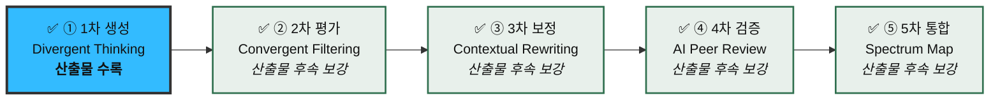
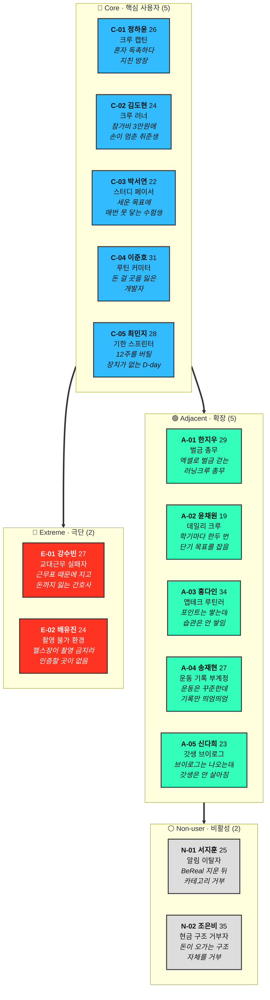

# 05-2. 페르소나 스펙트럼 (Persona Spectrum)

> 작성일: 2026-08-10
> 지리적 범위: 대한민국 / 통화: KRW
> **문서 위치:** 본 문서는 방법론 §2 「AI 기반 다중 페르소나 생성 및 평가 워크플로우」의 산출물이다.
> **진행 상태:** 5단계 워크플로우 **전 단계 완료 처리.** 다만 현재 문서에 실린 것은 **① 1차 생성 산출물(선별·검증 전 원본 14종)**이며, **②~⑤의 산출물은 후속 작업에서 보강한다**(§8).
> **개정 이력**
> - 2026-08-10 (1차) — C-01·C-02·C-04·A-02 서술 보정 / 구 E-01·E-02를 **강수빈 1명으로 병합** / **A-04 송재현 · E-02 배유진 신설** (12종 → 13종)
> - 2026-08-10 (2차) — **C-03 박서연을 '목표 미달 반복'으로 재정의** / **A-05 신다희 신설** (13종 → 14종)

| 선행 문서 | 역할 |
|---|---|
| `05-personas/methodology.md` | 스펙트럼 4분류 정의 · 5단계 워크플로우 |
| `05-personas/persona-01-general.md` | 세그먼트 기반 페르소나 8종 + 안티 3종 (본 문서의 원재료) |
| `04-tam-sam-som/시장분석 종합보고서 (TAM-SAM-SOM).md` | Market Segment Map · 세그먼트 규모 |
| `04-tam-sam-som/보상형 그룹별 일상 숏폼 공유 플랫폼(아이디어).md` | 제품 정의 · 핵심 루프 · 리스크 |

---

## 0. 이 문서의 단계와 성격

> **진행 표기 규칙** — 5단계 모두 **완료 처리**했으나, 실제 산출물이 문서에 실린 것은 ① 뿐이다. ②~⑤는 후속 작업에서 채운다(§8).

> ### ⚠️ 이 문서를 읽을 때의 전제
>
> **① 단계는 "고르는" 단계가 아니라 "펼치는" 단계다.** 아래 14명은 현실성 검증도, 우선순위 판단도 거치지 않았다. 서로 겹치는 페르소나, 시장 규모가 확인되지 않은 페르소나, 제품이 감당 못 할 수 있는 페르소나가 **의도적으로 섞여 있다.** 이들을 걸러내는 것은 ② 2차 평가의 일이다.
>
> 따라서 **이 문서의 어떤 페르소나도 아직 "우리 고객"이 아니다.**

### 생성 규칙

| 항목 | 값 |
|---|---|
| **생성 수량** | 핵심 5 · 확장 **5** · 극단 2 · 비활성 2 = **총 14명** *(최초 5·3·2·2=12 → 피드백 반영 2회를 거쳐 확장 축이 2개 늘었다)* |
| **필수 항목** | 이름 · 직무 · 문제 · 목표 · 감정 · 대체 솔루션 (방법론 ① 단계 규격) |
| **제외 항목** | `사용 맥락` — ③ 3차 보정(Contextual Rewriting)에서 서비스 맥락에 맞춰 부여 |
| **원재료** | 05-1의 세그먼트 페르소나 8종 + 세그먼트 맵 밖에서 새로 발산한 4종 |

### 05-1 문서와의 대응 관계

| 05-1 (세그먼트 단위) | → | 05-2 (개인 단위) | 비고 |
|---|---|---|---|
| P1 크루 캡틴 | → | **C-01 정하윤** | 승계 |
| P2 크루 러너 | → | **C-02 김도현** | 승계 |
| P3 스터디 페이서 | → | **C-03 박서연** | 승계 |
| P5 루틴 커미터 | → | **C-04 이준호** | 승계 |
| P6 기한 스프린터 | → | **C-05 최민지** | 승계 |
| P4 벌금 총무 | → | **A-01 한지우** | **Core → Adjacent로 재배치** (아래 §2 사유) |
| P7 데일리 크루 | → | **A-02 윤채원** | 승계 |
| AP1 강제 트리거 유저 | → | **N-01 서지훈** | 안티 → 비활성으로 재해석 |
| — | → | **A-03 홍다인** | 🆕 신규 발산 |
| — | → | **A-04 송재현** | 🆕 **피드백 반영 신설** — 인스타 운동 기록 부계정 운영자 |
| — | → | **A-05 신다희** | 🆕 **피드백 반영 신설(2차)** — 셋로그로 갓생 브이로그를 만드는 사람 |
| — | → | **E-01 강수빈** | 🆕 신규 발산 — **구 E-02 임태경과 병합**(아래 §4 사유) |
| — | → | **E-02 배유진** | 🆕 **피드백 반영 신설** — §6 후보 풀 '얼굴·장소 노출 거부자'에서 승격 |
| — | → | **N-02 조은비** | 🆕 신규 발산 |
| P8 케어 리포터 | → | (미승계) | **기관이 계약 주체인 B2B라 "유사 니즈·다른 맥락"이 아니라 제품 자체가 다름.** 세그먼트 맵도 "제품·영업·정산 구조가 전부 다름"으로 규정 → §6 후보 풀로 이동 |
| AP2 롱디 페어 | → | (미승계) | 2인 구조라 스펙트럼 4분류와 축이 다름 → ②에서 재검토 |
| AP3 인증 어뷰저 | → | (미승계) | 고객이 아니라 위협 모델 → 별도 트랙 유지 |

---

## 1. 스펙트럼 배치

---

## 2. 🔵 Core — 핵심 사용자 5명

> **생성 포인트: 매출 / 사용 빈도 중심.** Q1 자기계약 존(232만 명 / 263억원)에서 금액·빈도 상위 5개 세그먼트를 인격화했다.
>
> **⚠️ 재배치 하나** — 05-1에서 Core(Q1)였던 **P4 벌금 총무**를 Adjacent로 옮겼다. 이유: 이 사람은 이미 **오프라인에서 동일한 문제를 다른 메커니즘(현금 벌금 + 계좌이체)으로 해결하고 있다.** 스펙트럼 정의상 "유사 니즈 · 다른 맥락"은 Adjacent의 정의 그 자체다. 신규 수요 창출이 아니라 **기존 해법의 이식(migration)** 대상이라는 점이 제품 전략상 중요해 분류를 바꿨다. ②에서 뒤집힐 수 있는 판단으로 남겨둔다.

---

### C-01 · 정하윤 (26, 여) — 크루 캡틴

| 항목 | 내용 |
|---|---|
| **직무** | 서울 중소기업 마케팅 3년차. 헬스장 6개월 등록했으나 3주째 안 감. 대학 친구 4명 단톡방의 사실상 방장. |
| **문제** | 단톡방에 "우리 운동 인증방 만들자" 해서 만든 방이 **2주 만에 죽었다.** 처음 사흘은 다 같이 올리다가 한 명이 빠지자 도미노처럼 조용해졌다. 안 하는 친구에게 말을 거는 역할이 자동으로 본인 몫이 되고, 그러다 보니 **본인이 잔소리꾼이 됐다.** 지금 그 방은 살아 있지만 아무도 안 올린다. |
| **목표** | 친구들 앞에서 잔소리꾼이 되지 않으면서 3개월을 완주하는 것. 끝났을 때 "우리 진짜 했다"고 말할 수 있는 **증거**를 남기는 것. |
| **감정** | 책임감과 피로가 같은 크기로 있다. 시작할 땐 신났다가 3일째 *"내가 왜 이걸 관리하고 있지"* 하는 억울함. 친구가 조용히 빠질 때는 서운함보다 **민망함**이 크다. |
| **대체 솔루션** | 카카오톡 단톡방에 운동 사진 올리기 / 인스타 스토리 운동 인증 / 헬스장 앱 출석 체크 / 결국 아무것도 안 함 |

---

### C-02 · 김도현 (24, 남) — 크루 러너

| 항목 | 내용 |
|---|---|
| **직무** | 대학교 4학년 취업 준비생. 주 3회 카페 아르바이트. 고정 수입이 적고 지출에 민감. |
| **용어 · '인증방'이란** | 친구들끼리 **매일 운동·공부한 것을 사진이나 짧은 영상으로 올려 서로 확인하는 방**이다. 김도현은 두 종류를 겪었다. **① 카톡 단톡방 인증방 (무료)** — 대학 친구들과 해봤다. 돈이 안 걸려 강제력이 없었고, 빠져도 아무 일이 안 일어나 **2주 만에 흐지부지**됐다. **② 참가비를 거는 인증방 (유료)** — 지금 초대받은 것이 이쪽이다. 시작 전에 참가비를 예치하고, 기간이 끝나면 달성률만큼 돌려받는다. |
| **문제** | **문제는 ②에서 발생한다.** 초대는 반가웠는데 **"참가비 3만원"에서 손이 멈췄다.** 돈이 없어서가 아니라 **잃을 것 같아서**다 — ①에서는 빠져도 잃는 게 없었는데 ②는 다르다. 그리고 막상 시작해도, 며칠 밀리면 방에 들어가기가 민망해서 알림만 쌓아두다 **말없이 나온다.** |
| **목표** | 혼자서는 3일을 넘긴 적 없는 걸 **친구 리듬에 얹어서** 해내기. 그리고 낸 돈은 전부 돌려받기. |
| **감정** | 초대받았을 때 반가움 → 참가비 화면에서 경계 → 이틀 밀렸을 때 죄책감 → 조용히 이탈할 때 **안도와 자책이 섞임.** |
| **대체 솔루션** | 무료 습관 앱 / 챌린저스 무료 챌린지 / 그냥 안 함 / 친구에게 "나는 응원만 할게" |

---

### C-03 · 박서연 (22, 여) — 스터디 페이서

| 항목 | 내용 |
|---|---|
| **직무** | 지방 국립대 3학년, 공인회계사 1차 준비. **매일 아침 목표를 정해두고** 시작한다 — *오늘 8시간, 재무회계 3단원까지.* 열품타로 시간을 잰다. |
| **문제** | **세운 목표에 거의 매번 못 닿는다.** 실제로는 6시간에 2단원 중반에서 끝나고, 그게 하루 이틀이 아니라 **매일 반복된다.** 열품타는 앉아 있던 시간만 재줄 뿐 **목표 대비 얼마나 못 갔는지**는 보여주지 않고, 미달로 끝난 날에도 아무 일이 일어나지 않는다. 스터디 그룹은 월 1회 오프라인이라 **그 사이가 통째로 비어 있다.** |
| **목표** | 세운 목표에 **실제로 도달하는 것.** *"몇 시간 앉아 있었나"*가 아니라 *"오늘 목표한 데까지 갔나"*가 남기를 원한다. 시험일까지 **미달 폭이 줄어드는 게 눈에 보이면** 좋겠다. |
| **감정** | 성실한데 늘 불안하다. 아침엔 의욕적인데 **저녁마다 미달로 하루를 마감**하니 자신감이 조금씩 깎인다. 비교당하는 게 싫으면서도 **비교되지 않으면 안 한다.** 목표를 낮추면 편해질 걸 알지만, 낮추면 시험에 못 붙을 것 같아 **못 낮춘다.** |
| **대체 솔루션** | 열품타 / 스터디플래너 앱·다이어리(계획-실제 병기) / 스터디카페 좌석 인증샷 / 노션 데일리 로그 / 유튜브 캠스터디 라이브 |

---

### C-04 · 이준호 (31, 남) — 루틴 커미터

| 항목 | 내용 |
|---|---|
| **직무** | 판교 IT 기업 백엔드 개발자 5년차, 주 2회 재택. 챌린저스에서 미라클모닝 챌린지 4회 참가 이력. |
| **직전 경험 · 챌린저스는 어떻게 돈을 걸었나** | **참가비를 미리 걸고 매일 사진으로 인증한 뒤, 달성률만큼 돌려받는 앱**이다. 흐름은 단순하다. ① 챌린지 선택 (예: *2주간 매일 아침 6시 전 기상 인증*) ② **참가비 예치** — 이준호는 회당 2만원씩 4번 걸었다 ③ 기간 중 매일 정해진 시각에 사진 인증 ④ 종료 시 **달성률에 따라 환급** — 100% 달성하면 전액 환급에 더해 **미달성자가 놓친 돈에서 나온 상금**까지 받는다 즉 **"해내면 조금 벌고, 못 하면 잃는"** 구조이며, 이 손실 가능성이 이 사람에게는 유일하게 작동한 강제 장치였다. |
| **문제** | **챌린저스가 뷰티 커머스로 피벗하면서 돈 걸 곳이 사라졌다.** 같이 할 친구가 없다 — 회사 사람과는 이런 걸 안 하고 대학 친구들은 흩어졌다. 익명 다수 챌린지는 **아무도 나를 안 봐서** 압박이 약하다. |
| **목표** | 아침 6시 기상을 **무기한으로** 고정하는 것. 재미가 아니라 **손실 회피**로 굴리는 것. |
| **감정** | 자기 의지에 대한 불신이 기본값. *"나는 돈을 걸어야만 하는 사람"*이라는 걸 담담하게 받아들였다. 성공했을 때 기쁨보다 **안도**가 크다. |
| **대체 솔루션** | 축소된 챌린저스 챌린지 / 미션형 알람 앱(문제를 풀어야 꺼지는 알라미류) / 기상 인증 오픈채팅방 / 알람 5개 연달아 맞추기 |
| **🔍 대체 솔루션 검토 — PT 선결제를 제외함** | 이전 판에는 'PT 선결제'가 있었으나 **부적합으로 판단해 뺐다.** ① **목표가 어긋난다** — 이 사람의 목표는 *기상*인데 PT는 운동 대체재다. ② **손실 회피가 작동하지 않는다** — PT비는 가든 안 가든 소진되므로 "달성하면 돌려받는" 구조가 없고, 안 가면 그냥 전액 손실이다. ③ **트리거 소유권이 반대다** — 트레이너라는 외부 강제자가 시각을 정하는데, 이 사람은 스스로 걸고 스스로 지키는 쪽을 택해 온 사람이다. |

---

### C-05 · 최민지 (28, 여) — 기한 스프린터

| 항목 | 내용 |
|---|---|
| **직무** | 프리랜서 그래픽 디자이너. 12주 뒤 바디프로필 촬영 예약 완료(예약금 25만원 결제 상태). |
| **문제** | 촬영일은 박혀 있고 예약금도 냈는데 **그 사이 12주를 버티게 해주는 장치가 없다.** 5주차쯤 무너진다. 무료 앱은 그만둬도 아무 일이 안 일어나서 강제력이 0이다. |
| **목표** | D-day까지 완주. 그리고 특이하게도 — **중간에 포기하면 진짜로 아프기를 원한다.** 참가비가 높을수록 좋다. |
| **감정** | 초반 과열 → 5주차 붕괴 공포 → 완주 시엔 **과정 자체를 남기고 싶은** 욕구. 결과 사진 한 장만 남는 게 늘 아쉬웠다. |
| **대체 솔루션** | PT 10회 선결제 / 인스타 비공개 계정 데일리 기록 / 바디프로필 준비 오픈채팅방 |

---

## 3. 🟢 Adjacent — 확장 사용자 5명

> **도출 질문: "유사한 제품/서비스를 사용하고 있는 사람은 누구인가?"**
> 다섯 명 모두 **이미 무언가로 이 문제를 풀고 있다.** 신규 수요를 만드는 게 아니라 **기존 해법을 갈아타게 하는** 대상이라는 점에서 Core와 다르다.

| 코드 | 인물 | 담당하는 축 |
|---|---|---|
| A-01 | 한지우 | 같은 문제 / **다른 도구** (엑셀·계좌이체) |
| A-02 | 윤채원 | 같은 포맷 / **다른 목적** (친목, 간헐적 목표) |
| A-03 | 홍다인 | 같은 보상 / **다른 행위** (적립만 하고 예치는 안 함) |
| A-04 | 송재현 | 같은 행위 / **다른 무대** (공개 SNS에 혼자 기록) |
| A-05 | 신다희 | 같은 형식 / **다른 공급자** (짧은 영상·자동 편집을 셋로그가 이미 제공) |

> **A-04와 A-05는 짝으로 읽어야 한다.** 통증이 같은데(운동·일상을 영상으로 남기고 싶다) **한쪽은 도구가 없어 실패하고, 다른 쪽은 셋로그로 이미 해결했다.** 우리 사양이 답이 되는 지점과 답이 되지 못하는 지점이 이 둘 사이에 있다.

---

### A-01 · 한지우 (29, 남) — 벌금 총무 *(05-1 P4에서 재배치)*

| 항목 | 내용 |
|---|---|
| **직무** | 직장인 5년차. 주말 러닝크루 운영진 겸 총무, 크루원 18명. **불참 시 5천원 벌금 규칙을 2년째 직접 운영 중.** |
| **문제** | 벌금을 카톡으로 독촉하고 계좌이체로 받아 엑셀에 적는다. 누가 냈는지 매번 확인해야 하고, *"저 그날 아팠는데요"*를 **판정하는 것도 총무 몫**이다. 인증 수단이 없어서 결국 "갔다고 하면 간 것"이 된다. |
| **목표** | **판정자 자리에서 내려오는 것.** 규칙이 자동으로 집행되고 본인은 결과만 확인하는 상태. |
| **감정** | 총무 2년차의 번아웃. **규칙을 만든 사람이 미움받는 구조**에 지쳤다. 그만두고 싶은데 그만두면 크루가 없어질 것 같아 못 그만둔다. |
| **대체 솔루션** | 엑셀 + 계좌이체 + 카톡 독촉 / 네이버 밴드 출석체크 / 카카오페이 정산하기 |

---

### A-02 · 윤채원 (19, 여) — 데일리 크루

| 항목 | 내용 |
|---|---|
| **직무** | 대학교 1학년, 여자 친구들 7명 그룹. 셋로그를 4개월째 사용하며 하루 평균 6~8개 업로드. **평소엔 목표 없이 일상만 공유하지만, 학기마다 한두 번은 친구들과 단기 목표를 함께 잡는다** — 여름 앞두고 2주 다이어트, 중간고사 2주 벼락치기, 방학 여행비 3개월 모으기, 공모전 마감 2주 스프린트. |
| **문제** | ① 처음 두 달은 매일 재밌었는데 지금은 **천장·모니터·강의실 사진만 반복된다.** 수업 중 알림이 울리면 스트레스. 그렇다고 지우기는 아깝다 — **친구들이 다 거기 있어서.** ② 그리고 **단기 목표를 잡을 때마다 매번 도구가 없다.** 다이어트는 단톡방, 시험공부는 열품타, 여행비 저축은 카톡 정산으로 **흩어지고**, 어느 것도 2주를 못 넘긴다. 목표가 끝나면 기록도 함께 사라진다. |
| **목표** | 기본값은 **친구들과 계속 연결돼 있는 것**이다. 다만 학기마다 한두 번 *"이번엔 진짜 해보자"* 하는 순간이 오고, **그때만 목표가 생긴다.** 상시 목표형이 아니라 **간헐적 목표형**이라는 점이 Core와 갈리는 지점이다. |
| **감정** | 평상시엔 익숙함과 지루함이 반반. *"재밌었는데 왜 이제 재미없지"*에 대한 답을 본인도 모른다. 단기 목표를 잡을 땐 **잠깐 확 타올랐다가 2주 안에 식는다.** 돈 이야기가 나오면 **"우리끼리 돈을?"** 하고 거부감이 먼저 온다. |
| **대체 솔루션** | 셋로그(계속 사용) / 인스타 close friends 스토리 / 단톡방 사진 공유 / 단기 목표용 임시 단톡방·열품타·카톡 정산하기 |
| **🔍 전환 창구가 여기 있다** | **그룹이 함께 목표를 거는 것이 이 서비스의 핵심**인데, 이 사람은 이미 **학기마다 한두 번 그 행동을 하고 있다.** 다만 도구 없이 맨손으로 한다. 따라서 전환은 "일상 공유를 목표 공유로 바꾸세요"가 아니라 **"이번 2주짜리 목표, 도구 있는 데서 해보자"**여야 한다. Q3 → Q1 좌표 이동의 **실제 트리거가 이 간헐적 순간**이다. |
| **⚠️** | **직접 과금 대상이 아니라 획득 채널.** *간헐적 목표 순간*에만 초단기 시즌을 제시해야 하며, **평상시 일상 공유에 "영상 올리면 포인트"를 붙이는 순간** 과잉정당화로 관계가 화폐화된다 `[실측: Deci·Koestner·Ryan 1999]`. |

---

### A-03 · 홍다인 (34, 여) — 앱테크 루틴러 🆕

| 항목 | 내용 |
|---|---|
| **직무** | 중견기업 총무팀 대리 7년차, 왕복 통근 2시간. 캐시워크·토스 만보기·오퍼월 리워드를 **5년째 매일** 돈다. 월 적립 1만원 안팎. |
| **문제** | 하루 30분 넘게 리워드 앱을 도는데 **건강도 습관도 하나도 안 바뀐다.** 걸음 수는 목표라기보다 **이미 걸은 걸 정산받는 것**에 가깝다. 보상 자체엔 완전히 익숙한데, **그 보상이 아무것도 만들어내지 않는다** — P2(반복이 축적되지 않음)가 보상형 앱에서 그대로 재현되는 형태다. |
| **목표** | 어차피 쓰는 시간과 손품이라면 **포인트가 아니라 실제 변화로 바꾸는 것.** 다만 돈을 *받는* 건 익숙해도 *거는* 건 아직 한 번도 안 해봤다. |
| **감정** | 보상에 대한 거부감이 **0에 가깝다** — 오히려 능숙하다. 대신 *"내가 이걸 왜 하고 있지"* 하는 공허함이 주기적으로 온다. 예치·몰수 설명을 들으면 **적립에서 예치로 넘어가는 문턱**에서 정확히 멈춘다. |
| **대체 솔루션** | 캐시워크 / 토스 만보기 / 오퍼월 리워드 앱 / 카카오페이 구슬 / 손목닥터9988 |
| **🔍 왜 Adjacent인가** | A-01은 *같은 문제 / 다른 도구*, A-02는 *같은 포맷 / 다른 목적*을 맡는다. 이 사람은 비어 있던 축인 **같은 보상 / 다른 행위**다. 보상형 수용은 이미 100%인데 *"보상을 받는"* 쪽에서 *"보상을 걸고 받는"* 쪽으로 **한 번도 넘어온 적이 없다.** |
| **🔍 드러난 검증 지점** | 세그먼트 맵의 **보상 수용률 55% 가정이 바로 이 층에서 유도됐다**(리워드 광고 참여자 1,870만·36.6%, Z세대 앱테크 62.4% `[실측]`). 그런데 원문 스스로 한계 #4에서 *"앱테크 수용 ≠ 친구에게 인증 영상 올리고 보상받기 수용"*이라고 지적했다. **이 페르소나는 그 갭을 인격화한 것**이며, 여기서 전환이 일어나는지가 SAM 추정 전체의 전제를 좌우한다. |

---

### A-04 · 송재현 (27, 남) — 운동 기록 부계정 운영자 🆕

| 항목 | 내용 |
|---|---|
| **직무** | 직장인 3년차, 주 4회 헬스장. **1년 전 운동 기록용 인스타 부계정을 팠다.** 팔로워는 지인 위주 40명 남짓이고 `#오운완` 태그로 올린다. 기간이 정해진 목표는 없다 — **꾸준함 그 자체를 남기려는 것**이 목적이다. |
| **문제** | 목표가 아니라 **지속을 기록하고 싶은데 도구가 그걸 못 받쳐준다.** ① 운동에 집중하다 보면 **찍는 것 자체를 까먹는다** — 끝나고 나서야 *"아 오늘도 안 찍었네."* ② 어쩌다 찍어도 **길게 찍힌 원본을 잘라 붙여야 릴스로 올라간다.** 편집이 귀찮아 갤러리에 미편집 영상만 쌓인다. 결과적으로 **운동은 꾸준한데 기록만 띄엄띄엄**이고, 피드에 뚫린 구멍이 실제보다 게을러 보이게 만든다. |
| **목표** | **기간 없는 꾸준함을 눈에 보이는 형태로 누적하는 것.** 남에게 자랑하려는 게 아니라 *"내가 이만큼 했다"*는 축적이 갖고 싶다. 편집 없이 그냥 올라가면 가장 좋다. |
| **감정** | 뿌듯함과 자책이 번갈아 온다. **운동은 했는데 기록이 비면 안 한 것처럼 느껴진다.** 부계정 피드에 구멍이 보이면 신경 쓰이고, 그러다 한동안 아예 안 올리는 구간이 생긴다. |
| **대체 솔루션** | 인스타 부계정(`#오운완`) / 헬스장 앱 운동 기록 / 애플 피트니스·스트라바 / 갤러리에 쌓아둔 미편집 영상 |
| **🔍 왜 Adjacent인가** | 남은 축인 **같은 행위 / 다른 무대**를 담당한다. 운동 영상 기록이라는 **행위는 이미 하고 있는데**, 무대가 그룹이 아니라 **공개 SNS이고 혼자**다. 전환에 필요한 것은 새 습관이 아니라 **무대 이동**뿐이다. |
| **🔍 제품 적합도 — 그리고 어긋남** | 이 사람의 두 마찰(**촬영 타이밍을 놓침 · 편집 부담**)은 우리 제품의 두 사양(**계약한 시각의 짧은 영상 · 자동 편집 회고본**)이 정확히 겨냥하는 지점이다. **14종 중 제품 사양과 통증이 가장 정직하게 맞물리는 인물.** 다만 **기간이 정해져 있지 않아 예치·정산 구조와는 맞지 않는다** — 걸 마감일이 없다. 즉 이 사람은 **R2 참가비 take가 아니라 R1 구독**의 대상이며, 이는 광고 없는 수익 구조에서 **구독 축의 실체를 보여주는 첫 인물**이기도 하다. ⚠️ 단, **바로 아래 A-05 신다희와 반드시 함께 읽어야 한다** — 같은 통증을 셋로그가 이미 무료로 풀어주고 있기 때문이다. |

---

### A-05 · 신다희 (23, 여) — 갓생 브이로그 크리에이터 🆕

| 항목 | 내용 |
|---|---|
| **직무** | 대학교 3학년, 휴학하고 자격증 준비 + 아르바이트 병행. **`#갓생` 브이로그를 만들고 싶어** 인스타 계정을 운영한다. 영상 편집은 배워본 적이 없고 자신도 없다. 그래서 **셋로그를 쓴다** — 부담 없이 짧게 찍어두면 **하루치를 자동으로 한 편으로 붙여 주고 저장까지 된다.** 그 결과물을 인스타에 올린다. |
| **문제** | **촬영과 편집이라는 벽은 셋로그가 이미 없애 줬다.** 부담 없이 찍히고, 알아서 붙고, 저장되고, 올라간다. **문제는 그다음이다** — 브이로그는 매일 나오는데 **정작 갓생이 안 살아진다.** 영상에는 카페·책상·지하철만 반복되고, *오늘 무엇을 해내기로 했는지*와 *해냈는지*는 어디에도 없다. **기록은 쌓이는데 실행은 그대로**라서, 편집된 하루를 볼 때마다 *"이게 갓생 맞나"* 싶다. |
| **목표** | *"갓생 사는 척"*이 아니라 **실제로 갓생을 살고 그게 영상으로 남는 것.** 다만 지금의 편의 — 부담 없이 찍고, 알아서 편집되고, 모아보고, 인스타에 올리는 것 — 은 **절대 포기할 생각이 없다.** |
| **감정** | 셋로그에는 **만족한다.** 불편한 게 없다. 다만 결과물을 볼 때 **공허하다** — 예쁘게 편집됐는데 내용이 없다. 새 앱을 권하면 *"셋로그로 되는데 왜?"*가 첫 반응이다. |
| **대체 솔루션** | 셋로그(자동 편집·저장) → 인스타 릴스 발행 / 갤러리 수동 편집(시도했다 포기) / VLLO·CapCut(어렵게 느껴 안 씀) |
| **🔍 왜 Adjacent인가** | 남은 축인 **같은 형식 / 다른 공급자**를 담당한다. *짧은 영상 · 자동 편집 · 아카이브*라는 **우리 제품의 형식을 이 사람은 이미 셋로그에서 얻고 있다.** 전환에 필요한 것은 형식이 아니라 **형식 위에 얹을 이유**다. |
| **🔍 가장 아픈 발견** | **자동 편집 회고본은 차별점이 아니다.** 셋로그가 이미 무료로 준다. 바로 위 **A-04 송재현에게는 우리 사양이 곧 답**이었지만(편집 도구가 없어 기록이 끊김), **이 사람은 그 문제를 이미 해결한 상태로 도착한다.** 따라서 이 사람을 데려올 근거는 **목표 계약과 정산 — 셋로그에 없는 것 — 뿐**이다. `#갓생`이라는 단어 자체가 목표 지향이라 전환 여지는 분명히 있으나, **"영상을 예쁘게 만들어 드립니다"로는 절대 넘어오지 않는다.** |

---

## 4. 🔴 Extreme — 극단 사용자 2명

> **도출 질문: "가장 자주 실패를 경험하는 사람은 누구인가?"**
> 두 명 모두 **의지가 약해서 실패하는 사람이 아니다.** 제품의 핵심 장치 — **고정 시각 계약**(강수빈)과 **영상 인증**(배유진) — 이 이들에게는 그대로 **배제 장치**로 작동한다는 것이 이 구간의 발견이다.
>
> **⚠️ 병합 하나** — 이전 판의 *E-01 교대근무 인증 실패자*와 *E-02 상습 미달성자*를 **강수빈 한 명으로 합쳤다.** 두 사람의 근본 원인이 같았기 때문이다 — 불규칙한 생활과 고정 계약의 충돌이 반복 실패를 낳고, 그 반복 실패가 손실 누적으로 이어진다. **따로 두면 인과가 끊기고, 합치면 하나의 사슬로 읽힌다.**

---

### E-01 · 강수빈 (27, 여) — 교대근무 인증 실패자 *(구 E-02 상습 미달성자 병합)*

| 항목 | 내용 |
|---|---|
| **직무** | 종합병원 3교대 간호사 4년차. **근무표가 2주 단위로 바뀌고** 데이·이브닝·나이트가 섞인다. 습관 앱과 유료 챌린지를 여러 번 시도했고, **참가 6회 중 완주는 1회**다. |
| **문제** | **고정 시각 계약이 구조적으로 불가능하다.** 이번 주엔 22시가 가능한데 다음 주 그 시각은 근무 중이다. 나이트 근무 다음 날엔 인증할 체력도 없다. 그래서 **매번 미달성이 쌓이고**, 참가비 3만원 중 1~2만원이 몰수돼 완주한 사람에게 간다. **게을러서가 아니라 근무표 때문에 실패하는데, 시스템은 그 둘을 구분하지 않는다.** 실패 사유가 매번 같은데도 매번 같은 대가를 치른다. |
| **목표** | 불규칙한 삶 속에서도 **무언가를 유지하고 있다는 감각.** 실패가 자기 탓이 아니라 근무표 탓임을 **시스템이 알아주는 것.** 그리고 **잃은 만큼이라도 회복하는 것.** |
| **감정** | 만성 피로 위에 얹힌 죄책감. 새 앱을 깔면서 *"이번에도 안 되겠지"*를 먼저 예상한다. 실패가 누적될수록 자기효능감이 깎이는데도 **또 참가한다** — 이 재참여 동기가 **회복 의지인지 손실 추격인지 본인도 구분하지 못한다.** |
| **대체 솔루션** | 아무것도 안 함 / 주 단위 목표만 있는 앱 / 근무표 기반 수기 체크리스트 / 다른 챌린지에 재참가(반복) |
| **🔍 드러난 설계 구멍** | **'계약 중 변경 불가'(자기구속)는 P1 알림 강박을 푸는 핵심 장치인데, 교대근무자에게는 그대로 배제 장치가 된다.** 근무표 연동, 시각 계약이 아닌 **주간 총량 계약**, 유동 윈도우 같은 대안이 필요하다. 교대·유동 근무자는 국내 취업자 중 무시할 수 없는 비중이며 **규모 확인이 필요하다** `[미측정]`. |
| **🔍 드러난 윤리·규제 리스크** | 위 설계 구멍이 그대로 다음 문제로 이어진다 — **구조적으로 실패할 수밖에 없는 사람이 상금 재원을 계속 공급하는 구조**가 된다. 사행성 심사에서 가장 먼저 지적될 지점이며(🔴 진입 전 필수 리스크와 직결), 제품 신뢰 측면에서도 방치할 수 없다. **누적 손실 상한, 연속 실패 시 강제 휴식, 난이도 자동 하향**을 MVP 범위에서 검토해야 한다. |
| **🔍 병합으로 드러난 것** | 두 문제를 각각 다른 사람에게 붙여 뒀을 때는 *설계 구멍*과 *규제 리스크*가 별개로 보였다. **한 사람으로 합치자 인과가 드러난다** — 근무표 충돌 → 반복 실패 → 손실 누적 → 재원 공급. **규제 리스크의 원인이 설계 구멍이었다는 뜻**이며, 따라서 주간 총량 계약을 넣는 것이 곧 사행성 리스크 완화책이기도 하다. |

---

### E-02 · 배유진 (24, 여) — 촬영 불가 환경 사용자 🆕

| 항목 | 내용 |
|---|---|
| **직무** | 대학 4학년. 학교 체육관과 동네 헬스장에서 주 4회 운동. **두 곳 다 촬영 금지 규정이 있고**, 붐비는 시간대엔 뒤로 다른 사람들이 전부 찍힌다. 체형이 찍히는 것에 대한 부담도 크다. |
| **문제** | **인증 수단이 영상 하나뿐인데 찍을 수 있는 장소가 없다.** 헬스장에서 폰을 들면 눈총을 받고 실제로 제지당한 적도 있다. 얼굴과 몸이 그룹에 남는 것도 부담이다. 결국 **탈의실에서 억지로 찍거나, 아예 인증을 포기한다.** |
| **목표** | 운동한 걸 증명하고 싶다. 다만 **자기 얼굴·몸·주변 사람이 찍히지 않는 방식으로.** |
| **감정** | 눈치와 수치심. 인증할 때마다 *"이거 찍어도 되나"* 하고 주변을 살핀다. 올릴 때 **잘 나온 각도를 고르게 되는데**, 그러다 보면 애초에 이 서비스의 전제(꾸밈 없는 인증)와 어긋난다는 자각도 있다. |
| **대체 솔루션** | 운동 기구 계기판만 찍기 / 애플워치·스마트밴드 기록 캡처 / 헬스장 출입 기록 / 그냥 안 함 |
| **🔍 드러난 설계 구멍** | **영상 인증을 단일 수단으로 강제하면 촬영 불가 환경이 곧 배제 환경이 된다.** 국내 헬스장 상당수가 촬영을 금지하고 타인 초상권 문제도 있으므로, 이는 개인 성향이 아니라 **환경 제약**이다. 얼굴 자동 블러, 기구·기록 화면만 인증, 웨어러블 데이터 연동 같은 **대체 인증 수단**이 필요하다. |
| **⚠️ 정면 충돌 지점** | 그런데 대체 인증 수단은 **어뷰징 방어(실시간 촬영만 허용 · 갤러리 업로드 차단 · 얼굴 일관성 검사)와 정면으로 부딪힌다.** 포용성을 넓힐수록 위조 난도가 낮아진다. **수단마다 위조 난도를 따로 설계**하지 않으면 둘 중 하나를 반드시 포기하게 된다 — 이 서비스에서 **포용성과 어뷰징 방어가 트레이드오프 관계**임을 드러내는 첫 인물이다. |

---

## 5. ⚪ Non-user — 비활성 사용자 2명

> **도출 질문: "이 제품/서비스를 `사용할 수 없는 사람`은 누구인가?"**
> 두 사람의 거부 이유가 서로 다르다 — **N-01은 카테고리 자체를 거부**하고, **N-02는 수익 구조를 거부**한다. 후자가 시장 진입 장벽의 본체다.

---

### N-01 · 서지훈 (25, 남) — 알림 이탈자 *(05-1 AP1에서 재해석)*

| 항목 | 내용 |
|---|---|
| **직무** | 대학원 석사과정. BeReal 2022년 가입 후 6개월 만에 삭제. 셋로그도 2주 만에 알림 OFF 후 방치. |
| **문제** | **앱이 자기 하루를 지배하는 느낌**을 견디지 못한다. 친구들과 하이킹 중에 *"지금 알림 울렸으면 좋겠다"*고 생각한 순간 소름이 끼쳐 지웠다. 이 경험이 **카테고리 전체에 대한 거부감**으로 굳었다. |
| **목표** | 알림에 통제당하지 않는 것. **이 사람의 목표는 제품을 쓰는 게 아니라 안 쓰는 것이다.** |
| **감정** | 피로와 경계. 새 앱을 권하면 *"또 알림이지?"*가 첫 반응. 설명을 더 하면 방어가 더 세진다. |
| **대체 솔루션** | 아무것도 안 씀 / 종이 다이어리 / 카메라 앨범 |
| **⚠️** | 회피 좌표(Q4). **이 사람을 데려오려고 만든 기능은 코어를 망가뜨릴 확률이 높다.** 다만 "계약형 알림"이 실제로 이 거부감을 푸는지는 A/B로 확인할 가치가 있다 — 05-1 V3 검증 항목. |

---

### N-02 · 조은비 (35, 여) — 현금 구조 거부자 🆕

| 항목 | 내용 |
|---|---|
| **직무** | 초등학교 교사, 두 자녀 양육 중. 소액 투자·앱테크 모두 하지 않음. |
| **문제** | **"친구랑 돈 걸고 운동한다"는 구조 자체를 받아들이지 못한다.** 도박처럼 느껴지고, 친구 사이에 돈이 오가면 관계가 상한다고 믿는다. *100% 달성 시 전액 환급*이라는 설명을 들어도 **"그럼 못 한 사람 돈을 내가 먹는 거잖아요"**에서 멈춘다. |
| **목표** | 습관은 만들고 싶다. 다만 **돈이 개입하지 않는 방식으로.** |
| **감정** | 불신과 도덕적 불편함. 사행성 관련 뉴스에 민감하고, **자녀가 이런 앱을 쓸까 봐** 걱정한다. |
| **대체 솔루션** | 무료 습관 앱 / 동네 운동 모임 / 아무것도 안 함 |
| **🔍 드러난 시장 리스크** | **제로섬 구조를 어떻게 프레이밍해도 이 층은 남는다.** *"거는 돈이 아니라 맡기는 돈"* 완화 프레이밍이 겨냥하는 대상이 바로 이 사람이며, 프레이밍이 실패하면 이 사람은 영구 이탈이다. **보상 수용률 55% 가정의 나머지 45%가 여기 있을 가능성**이 있어 규모 추정이 필요하다 `[미측정]`. |

---

## 6. 슬롯 밖 후보 (생성했으나 14명에 포함하지 않음)

> ②·③ 단계에서 교체 후보로 쓸 수 있도록 남긴다. **Extreme·Non-user 후보가 특히 많이 남았다** — 이 서비스가 영상 촬영·현금·고정 시각이라는 세 개의 강한 제약을 동시에 걸기 때문이다.
>
> ↗️ **'얼굴·장소 노출 거부자'는 E-02 배유진으로 승격**되어 이 목록에서 빠졌다.

| 구분 | 후보 | 왜 남겼는가 |
|---|---|---|
| Extreme | **지체·시각 장애 사용자** | 촬영·확인 행위 자체의 접근성. 포용적 설계의 정통 주제 |
| Extreme | **저사양 기기 · 알뜰 데이터 요금제** | 매일 영상 업로드가 데이터·저장 비용으로 직결 |
| Non-user | **만 14세 미만** | *"사용할 수 없는 사람"*의 가장 정확한 답 — 결제·개인정보 정책상 구조적 배제. 셋로그 사용자의 10대 이하 비중 23.6% `[실측]`와 충돌 |
| Non-user | **해외 거주 한국인** | 시차로 계약 시각이 어긋남 |
| Adjacent | **케어 리포터 (05-1 P8 오현숙)** | ↩️ **A-03에서 강등.** 기관이 계약 주체인 B2B라 "유사 니즈·다른 맥락"이 아니라 제품 자체가 다르다. ARPU 18,000원으로 전 세그먼트 최고지만 Y3+ 별도 트랙 |
| Adjacent | **기업 복지 담당자** | 사내 건강 챌린지 운영 니즈. B2B2C 경로 |
| Adjacent | **PT 트레이너 · 스터디 리더** | 고객 관리 도구로 전용할 수 있는 공급 측 사용자 |

---

## 7. ① 단계가 이미 드러낸 것

> 발산 단계지만, 확장·극단·비활성을 강제로 생성하자 **05-1에서는 보이지 않던 문제 일곱 개**가 드러났다. 이것이 스펙트럼을 하는 이유다.

| # | 발견 | 출처 | 성격 |
|---|---|---|---|
| **1** | **'계약 중 변경 불가'가 교대근무자에게는 배제 장치가 된다** | **강수빈** (E-01) | 🔧 설계 구멍 — P1 해법이 특정 집단에겐 역효과 |
| **2** | **구조적으로 실패할 수밖에 없는 사람이 상금 재원을 공급한다** | **강수빈** (E-01) | ⚖️ 윤리·규제 — 🔴 사행성 심사와 직결. **원인은 발견 1** |
| **3** | **영상 인증 단일 수단이 촬영 불가 환경을 배제하고, 대체 수단은 어뷰징 방어와 충돌한다** | **배유진** (E-02) | 🔧 설계 — 포용성 ↔ 위조 방어 **트레이드오프** |
| **4** | **완화 프레이밍이 실패하면 남는 영구 거부층의 규모가 미측정** | **조은비** (N-02) | 📉 시장 — 보상 수용률 55% 가정의 반대편 |
| **5** | **보상 수용률 55%는 '적립 수용'이지 '예치 수용'이 아닐 수 있다** | **홍다인** (A-03) | 📉 시장 — SAM 800만 명 추정 전체의 전제 |
| **6** | **제품 사양과 가장 잘 맞물리는 인물이 예치 구조와는 안 맞는다** | **송재현** (A-04) | 💰 수익 — R2 참가비가 아니라 **R1 구독**의 대상 |
| **7** | **자동 편집 회고본은 차별점이 아니다 — 셋로그가 이미 무료로 준다** | **신다희** (A-05) | ⚔️ 경쟁 — 남는 차별점은 **목표 계약과 정산뿐** |

> **1~4는 05-1(세그먼트 기반)에서는 나올 수 없었다.** 세그먼트 맵은 *"우리가 팔 수 있는 사람"*을 그린 지도라 **실패하는 사람과 거부하는 사람이 애초에 좌표에 없었기 때문**이다.
>
> **5는 성격이 다르다.** 05-1이 한계 #4에서 이미 *"앱테크 수용 ≠ 인증 영상 올리고 보상받기 수용"*이라고 적어뒀지만 **각주로만 남아 있었다.** 그 한 줄을 사람으로 세우자 **적립 → 예치 사이의 문턱**이라는 구체적 전환 지점으로 바뀌었고, 검증 가능한 형태가 됐다.
>
> **6이 가장 뒤늦게 나왔다.** 통증과 제품 사양이 가장 정확히 맞물리는 사람을 찾고 보니, **그 사람에게는 걸 마감일이 없어 참가비 모델이 성립하지 않았다.** 수익 구조의 두 축(R1 구독 / R2 참가비 take)이 **서로 다른 사람을 향한다**는 것이 인물 단위로 확인된 셈이다.
>
> **7이 가장 뼈아프다.** 6에서 "우리 사양이 정확히 겨냥한다"고 판정한 그 사양(자동 편집 회고본)을 **셋로그가 이미 무료로 제공하고 있었다.** 포지셔닝 문서의 비교표는 셋로그의 약점을 *"반복의 축적이 없음"*으로 적었지만, **하루치 자동 편집과 저장은 이미 있다.** 남는 차별점은 **목표 계약과 정산** 두 가지로 좁혀지며, 이는 §7 전체에서 **경쟁 축에 관한 유일한 발견**이다.

---

## 8. 후속 보강 — ②~⑤ 산출물

> 워크플로우는 **완료 처리**됐으나 ②~⑤의 산출물은 아직 문서에 없다. 아래는 실제 수행 시 채울 자리와, 그때 반드시 판정해야 할 쟁점이다.

| 단계 | 채울 산출물 | 입력 |
|---|---|---|
| **②** 2차 평가 | Core / Adjacent / Extreme / Non-user **각 1명 = 대표 4종** | 본 문서 14명 + §6 후보 풀 7명 |
| **③** 3차 보정 | 대표 4종의 **사용 맥락** 복원 + 서비스 언어로 재기술 | ② 결과 + 05-1의 사용 맥락 서술 |
| **④** 4차 검증 | 4종의 **실재 확률과 근거** 코멘트 | ③ 결과 + 세그먼트 규모 실측치 |
| **⑤** 5차 통합 | **Persona Spectrum Map** (관계 구조 시각화) | ④ 통과분 |

**②를 실행할 때 반드시 판정해야 할 쟁점**

| # | 쟁점 | 왜 걸리는가 |
|---|---|---|
| 1 | **A-01 벌금 총무를 Core로 되돌릴 것인가** | 세그먼트상 Q1 코어인데 본 문서가 Adjacent로 옮겼다. 분류 기준(세그먼트 소속 vs 대체 솔루션 보유 여부)을 확정해야 한다 |
| 2 | **Core 대표 1명을 누구로 할 것인가** | 정하윤(캡틴, 획득·리텐션 결정)과 김도현(러너, 매출 원천)이 **서로 다른 지표를 쥐고 있어** 하나로 압축하면 반드시 하나를 잃는다 |
| 3 | **Adjacent 대표를 누구로 할 것인가 — 5명으로 늘었다** | 다섯 축(다른 도구·다른 목적·다른 보상·다른 무대·다른 공급자)이 각각 다른 수익원을 향한다. **송재현·신다희는 R1 구독, 나머지는 R2 참가비** 쪽이라 대표 선정이 곧 수익 축 선택이 된다 |
| 3-1 | **A-04 송재현과 A-05 신다희를 합칠 것인가** | 통증(영상으로 남기고 싶다)이 같고 무대(인스타)도 같다. 다만 **한쪽은 미해결, 다른 쪽은 셋로그로 해결**이라 합치면 발견 6과 7의 대비가 사라진다. **분리 유지가 정보량이 크지만 중복 소지도 있다** |
| 4 | **강수빈의 두 발견 중 무엇을 먼저 볼 것인가** | 병합으로 한 인물에 설계 구멍과 규제 리스크가 겹쳤다. **인과상 설계 구멍이 원인**이므로 그쪽을 먼저 푸는 것이 맞아 보이나, 규제는 진입 전 필수라 시급성이 역전될 수 있다 |
| 5 | **배유진의 트레이드오프를 어느 쪽으로 결정할 것인가** | 포용성(대체 인증 수단)과 어뷰징 방어(실시간 촬영만)가 정면 충돌한다. 이는 ②에서 고를 문제가 아니라 **제품 결정**으로 올려야 할 수도 있다 |
| 6 | **AP2 롱디 페어 · AP3 인증 어뷰저를 스펙트럼에 편입할 것인가** | 4분류 축과 성격이 달라 미승계 상태다. 별도 트랙으로 유지할지 결정 필요 |

---

## 부록. 이 문서의 한계

1. **14명 전원이 미검증이다.** 현실성 평가(②)와 다중 AI 교차검증(④)을 거치지 않았다.
2. **이름·나이·직무는 서술 장치이지 데이터가 아니다.** 연령·성별 구성만 세그먼트 실측치(셋로그 10~30대 91.2%, 10·20대 여성 76.2% `[실측]`)에 맞췄다.
3. **신규 발산 6명(A-03·A-04·A-05·E-01·E-02·N-02)은 시장 규모가 미측정이다.** 세그먼트 맵에 좌표가 없는 사람들이므로 모집단 추정이 별도로 필요하다. 특히 **교대·유동 근무자(강수빈)와 촬영 불가 환경(배유진)은 규모를 모른 채 설계 구멍만 확인된 상태**다.
4. **감정 서술은 인터뷰가 아니라 추론이다.** 05-1이 인용한 대학생 심층 인터뷰 `[실측]` 외에는 1차 자료가 없다.
5. **A-01의 Core → Adjacent 재배치는 본 문서의 판단이며 방법론이 규정한 바가 아니다.** ②에서 뒤집힐 수 있다.
6. **구 E-01·E-02의 강수빈 병합은 인과 가설에 기댄 것이다.** "근무표 충돌이 손실 누적의 원인"이라는 연결은 논리적으로는 성립하나 **관측된 바가 아니다.** 실제로는 불규칙 근무와 무관하게 손실을 누적하는 별개 집단이 존재할 수 있으며, 그렇다면 두 인물을 다시 분리해야 한다.
7. **생성 규칙이 5·3·2·2에서 5·5·2·2로 바뀌었다.** 방법론이 정한 수량은 아니며, 피드백 반영 2회를 거치며 확장 축이 둘 더 필요하다고 판단해 늘린 것이다. **확장이 핵심과 같은 수(5명)가 된 것은 ②에서 축소를 검토할 신호로 볼 수 있다.**
8. **A-05 신다희의 셋로그 기능 서술은 2차 출처 기반이다.** *"하루치 영상을 자동으로 한 편으로 붙여 주고 저장한다"*는 선행 문서의 셋로그 설명(2~4초 영상 → 하루 끝에 분할 브이로그로 자동 합성)에 근거했으나, **저장·외부 발행 범위와 무료/유료 경계는 직접 확인하지 않았다.** 발견 7(자동 편집은 차별점이 아니다)이 이 서술에 걸려 있으므로 **1차 확인이 필요하다.**
