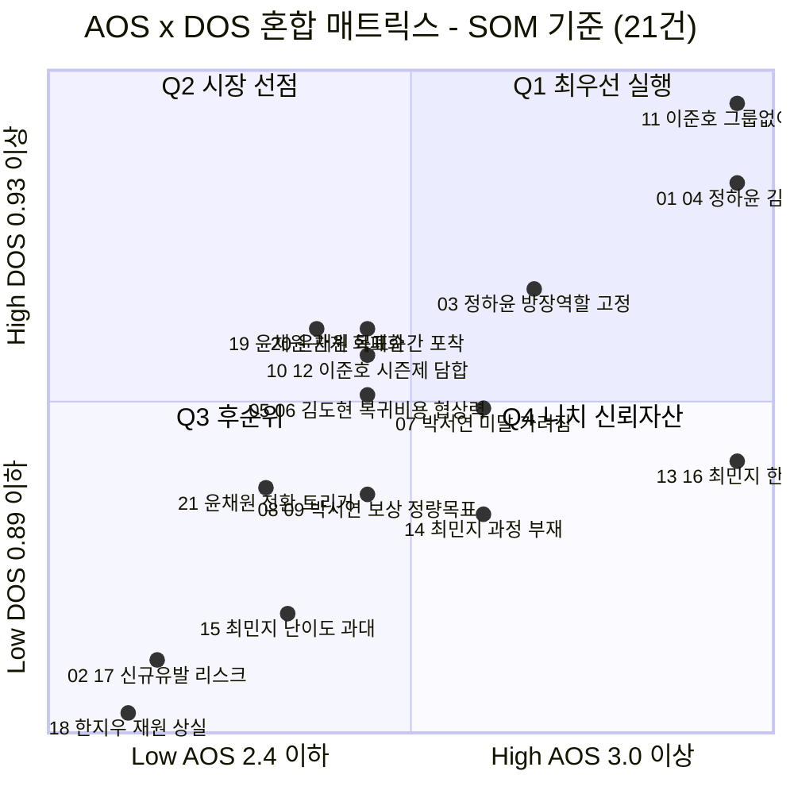
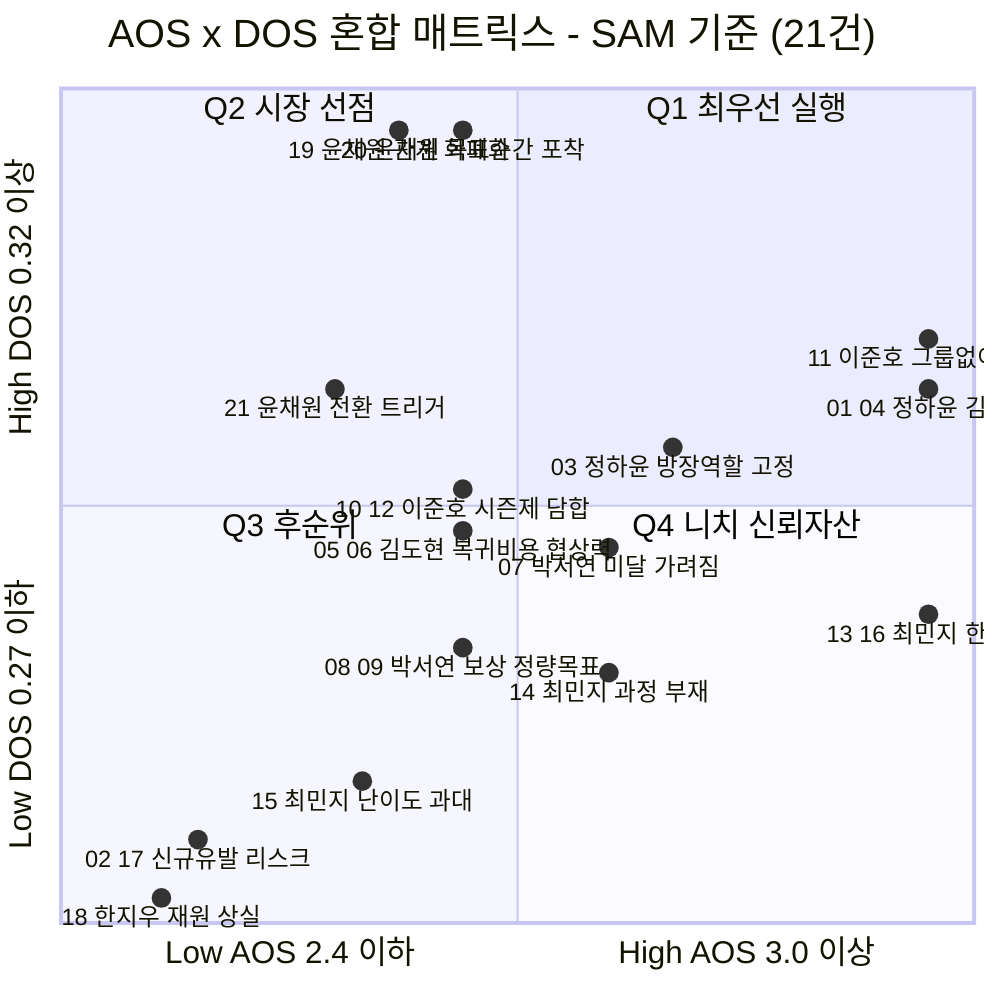

# 06-4. AOS × DOS 혼합 매트릭스

> 작성일: 2026-08-11

고객 절실도(AOS)와 시장 가중 점수(DOS)를 **두 축으로 교차 배치**한 매트릭스입니다. DOS 두 버전(SAM·SOM)에 대해 각각 그렸습니다.

**대상 21건** — 36건 중 Market Relevance가 산출된 항목만. 모수 미측정 15건(22~36)은 Y축 값이 없어 배치 불가입니다.

---

## 0. 축과 사분면의 의미

| 축 | 지표 | 무엇을 뜻하나 |
|---|---|---|
| **X (가로)** | **AOS** = `I × (1 − S/5)` | **고객 절실도** — 이 사람에게 얼마나 아픈가 |
| **Y (세로)** | **DOS** = `(I − S) × MR` | **시장 가중** — 그 아픔이 시장에서 얼마나 큰가 |

| 사분면 | 조건 | 이름 | 전략 |
|:-:|---|---|---|
| **Q1** ↗ 우상단 | 높은 AOS + 높은 DOS | 🔥 **최우선 실행** | 고객도 절실하고 시장도 크다 → **MVP 1순위** |
| **Q2** ↖ 좌상단 | 낮은 AOS + 높은 DOS | 📈 **시장 선점** | 통증은 보통인데 대상이 많다 → **규모로 정당화** |
| **Q4** ↘ 우하단 | 높은 AOS + 낮은 DOS | 💎 **니치 · 신뢰 자산** | 소수에게 결정적 → **충성도·차별화 재료** |
| **Q3** ↙ 좌하단 | 낮은 AOS + 낮은 DOS | ⚫ **후순위** | 둘 다 낮다 → 자원 배분 재검토 |

---

## 1. 기준선 — 각 지표의 중앙값

| 축 | 중앙값 | High 조건 |
|---|:-:|---|
| **AOS** | **2.4** | > 2.4 (즉 3.0 이상) |
| **DOS (SOM)** | **0.89** | > 0.89 |
| **DOS (SAM)** | **0.27** | > 0.27 |

> **경계선 값(중앙값 그 자체)은 Low에 포함**했습니다 — AOS 채점과 동일한 규칙입니다.

---

## 2. 매트릭스 — **SOM 기준** (기준안)

> 좌표가 같은 항목은 하나의 점으로 묶었습니다(15개 점 = 21건). 축 위치는 **사분면 경계가 중앙값에 오도록** 배치한 것이라 눈금 간격이 균등하지 않습니다.

### 사분면 배치 — SOM 기준

| | **◀ Low AOS** (≤2.4) | **High AOS ▶** (>2.4) |
|:---|:---|:---|
| **▲ High DOS** (>0.89) | 📈 **Q2 · 시장 선점 — 6건** `20` 윤채원 목표 순간 (2.4 / 1.23) `19` 윤채원 관계 화폐화 (2.0 / 1.23) `10` 이준호 시즌제 (2.4 / 1.10) `12` 이준호 담합 (2.4 / 1.10) `05` 김도현 복귀 비용 (2.4 / 0.93) `06` 김도현 협상력 (2.4 / 0.93) | 🔥 **Q1 · 최우선 실행 — 4건** **`11` 이준호 그룹 없이 도착 (4.0 / 2.21)** **`01` 정하윤 독촉 재발 (4.0 / 1.86)** **`04` 김도현 참가비 결정 불가 (4.0 / 1.86)** `03` 정하윤 방장 역할 고정 (3.2 / 1.40) |
| **▼ Low DOS** (≤0.89) | ⚫ **Q3 · 후순위 — 7건** `08` `09` 박서연 (2.4 / 0.59) `21` 윤채원 전환 트리거 (1.6 / 0.62) `15` 최민지 난이도 과대 (1.8 / 0.17) `02` `17` 신규 유발 (0.8 / 0.00) `18` 한지우 재원 상실 (0.6 / −0.18) | 💎 **Q4 · 니치 — 4건** `13` 최민지 5주차 붕괴 (4.0 / 0.69) `16` 한지우 집단 이주 (4.0 / 0.71) `07` 박서연 미달 가려짐 (3.0 / 0.89) `14` 최민지 과정 부재 (3.0 / 0.52) |

---

## 3. 매트릭스 — **SAM 기준** (대조)

### 사분면 배치 — SAM 기준

| | **◀ Low AOS** (≤2.4) | **High AOS ▶** (>2.4) |
|:---|:---|:---|
| **▲ High DOS** (>0.27) | 📈 **Q2 · 시장 선점 — 5건** `20` `19` 윤채원 (1.07) `21` 윤채원 전환 트리거 (0.54) `10` `12` 이준호 (0.32) | 🔥 **Q1 · 최우선 실행 — 4건** **`11` 이준호 (4.0 / 0.64)** **`01` 정하윤 · `04` 김도현 (4.0 / 0.54)** `03` 정하윤 (3.2 / 0.41) |
| **▼ Low DOS** (≤0.27) | ⚫ **Q3 · 후순위 — 8건** `05` `06` 김도현 (0.27) `08` `09` 박서연 (0.17) `15` 최민지 (0.05) `02` `17` (0.00) · `18` (−0.05) | 💎 **Q4 · 니치 — 4건** `07` 박서연 (3.0 / 0.26) `13` `16` 최민지 · 한지우 (4.0 / 0.20) `14` 최민지 (3.0 / 0.15) |

---

## 4. 두 버전 비교 — 해설

### ① **Q1(최우선)은 두 버전이 완전히 같습니다**

| | Q1 구성 |
|---|---|
| **SOM 기준** | `11` `01` `04` `03` |
| **SAM 기준** | `11` `01` `04` `03` |

> **모수를 무엇으로 잡든 최우선 4건은 바뀌지 않습니다.** 모수 논쟁의 실질은 *"C2를 시장으로 셀 것인가"* 하나뿐인데, **그 논쟁이 최우선 판단에는 영향을 주지 않습니다.**
>
> 즉 **미측정 15건의 모수 추정을 기다리지 않고도 Q1 4건은 지금 착수할 수 있습니다.**

### ② Q4(니치)도 두 버전이 같습니다 — `07` `13` `14` `16`

**최민지 2건 · 박서연 2건 · 한지우 1건**이 여기 모입니다. 이들의 공통점은 **AOS 3.0~4.0의 강한 통증인데 세그먼트가 작다**는 것입니다(A2 40만 · F2 69만 · F3 41만).

> **버릴 항목이 아닙니다.** 소수에게 결정적인 문제라 **충성도와 차별화의 재료**가 됩니다. 특히 `13` 최민지의 *5주차 붕괴*는 A2가 **ARPU 12,000원으로 전 세그먼트 최고**라는 점과 함께 봐야 합니다 — 인원은 적어도 **1인당 가치가 가장 큽니다.**

### ③ 움직이는 것은 윤채원과 김도현뿐입니다

| # | 항목 | SAM | SOM | 왜 |
|:-:|---|:-:|:-:|---|
| `21` | 윤채원 전환 트리거 | 📈 Q2 | ⚫ Q3 | C2 분자가 428만 → 143만으로 줄지만 분모가 800만 → 232만으로 더 크게 줄어 DOS는 0.54 → 0.62로 **오름**. 그런데 중앙값이 0.27 → 0.89로 더 크게 올라 Low로 내려감 |
| `05` `06` | 김도현 복귀 비용·협상력 | ⚫ Q3 | 📈 Q2 | F1 비중이 0.135 → 0.466으로 3.5배 커짐 |

나머지 **17건은 사분면이 동일**합니다.

### ④ Q3 좌하단 끝의 세 항목은 성격이 다릅니다

`02` 상금 출처 = 친구 손실 · `17` 관행과 자동 집행 충돌 · `18` 공동 재원 상실 — **두 축 모두 최하위**입니다.

> 그런데 이 셋은 **"아직 안 풀린 문제"가 아니라 "우리 제품이 새로 만드는 문제"**입니다. 기존 대체 솔루션에서는 잘 충족되고 있어 점수가 낮게 나올 뿐입니다.
>
> **매트릭스 좌하단에 있다고 무시하면 안 됩니다.** 후순위가 아니라 **아예 다른 트랙(신규 유발 리스크)**으로 빼야 합니다.

---

## 5. 이 매트릭스가 제안하는 실행 순서

| 순서 | 대상 | 근거 |
|:-:|---|---|
| **1** | **Q1 4건** — `11` 오픈 매칭 품질 · `01` 방장 독촉 이관 · `04` 예치 사다리 · `03` 방장 역할 로테이션 | 두 버전 모두 최우선. **모수 추정을 기다릴 필요 없음** |
| **2** | **Q4 4건** 중 `13` 5주차 개입 | 인원은 작지만 **ARPU 최고 세그먼트(A2 12,000원)** |
| **3** | **Q2 6건** 중 `05` `06` 김도현 | F1은 Y1 진입 세그먼트라 초기 리텐션에 직결 |
| **4** | **트랙 분리** — `02` `17` `18` | 기회가 아니라 **신규 유발 리스크** |
| **5** | **보류 15건 모수 추정** | AOS 상위 10건 중 5건이 여기 있어 **매트릭스가 아직 절반만 그려진 상태** |

---

## 부록. 이 매트릭스의 한계

1. **21건만 그려져 있습니다.** 36건 중 **15건(42%)은 Y축 값이 없어 배치 자체가 불가능**합니다. 특히 AOS 상위 10건 중 5건이 빠져 있으므로, **지금의 Q1이 최종 Q1이 아닐 수 있습니다.**
2. **X축과 Y축이 독립이 아닙니다.** AOS와 DOS 모두 같은 `Importance`·`Satisfaction`에서 출발하므로 두 축은 상관관계가 있습니다. 좌상단(Q2)과 우하단(Q4)이 상대적으로 비는 것은 그 때문입니다 — **완전히 직교하는 두 관점의 교차가 아닙니다.**
3. **Market Relevance가 세그먼트 단위입니다.** 같은 인물의 Pain 3건이 전부 같은 MR을 받으므로, **Y축의 인물 내 순서는 `I−S`로만 결정**됩니다.
4. **인원 기준 MR을 썼습니다.** 금액 기준(÷263억)으로 바꾸면 F2(박서연)가 0.297 → 0.156으로 크게 내려가고 A2(최민지)는 0.172 → 0.183으로 올라갑니다. **박서연 3건의 위치가 가장 민감합니다.**
5. **차트의 점 위치는 근사입니다.** 좌표가 같거나 매우 가까운 항목(`01`·`04`, `13`·`16` 등)은 하나의 점으로 묶었습니다. 정확한 값은 배치표를 보십시오.
6. **모든 입력값이 미검증입니다.** I·S 72개는 작성자 판단이고, 세그먼트 모수는 04 문서의 `[추정]`·`[러프]` 값입니다.
