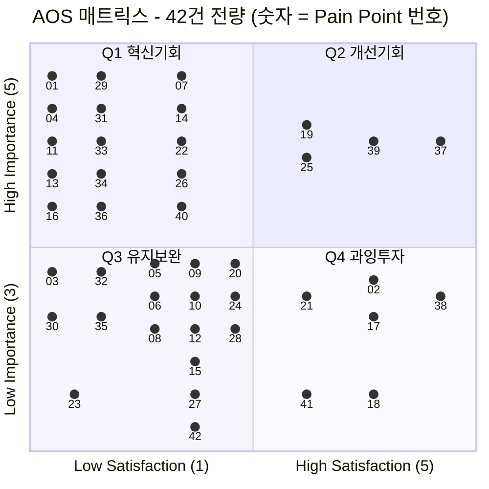

# 06-2. AOS 채점 결과 — 42건 기회 우선순위

> 작성일: 2026-08-11

```
AOS = Importance × (1 − Satisfaction / 5)
```

| 항목 | 이 문서에서 쓴 기준 |
|---|---|
| **대상** | 인벤토리 42건 전량. 비활성 사용자 6건(37~42)도 포함 |
| **Importance** | **페르소나 본인 관점에서 Goal의 중요도.** 사업 관점 가중치는 넣지 않았습니다 — 넣으면 "우리가 팔고 싶은 것"이 상위로 올라와 도구의 목적이 훼손됩니다 |
| **Satisfaction** | **기존 대체 솔루션이 그 Goal을 얼마나 이뤄주는가.** 우리 제품은 아직 없어 측정 불가이므로 각 인물의 `대체 솔루션`을 기준선으로 삼았습니다 |

---

## 1. Importance — 고객 입장의 중요도 (1~5)

### 척도 기준

| 점수 | 의미 |
|:-:|---|
| **5** | 이 Goal이 막히면 **서비스를 쓸 이유가 없다.** 그 인물의 상위 Goal 그 자체 |
| **4** | 상위 Goal 달성에 **직접적으로 필요**하다 |
| **3** | 있으면 좋고 없으면 불편한 수준 |
| **2** | 부차적 |
| **1** | 거의 무관 |

### 분포

| 점수 | 건수 | 해당 번호 |
|:-:|:-:|---|
| **5** | 19 | 01, 04, 07, 11, 13, 14, 16, 19, 22, 25, 26, 29, 31, 33, 34, 36, 37, 39, 40 |
| **4** | 17 | 02, 03, 05, 06, 08, 09, 10, 12, 17, 20, 21, 24, 28, 30, 32, 35, 38 |
| **3** | 6 | 15, 18, 23, 27, 41, 42 |
| 2 · 1 | 0 | — |

> **중앙값 = 4.** 2점·1점이 하나도 없는 이유는 **인물당 대표 3건만 골라냈기 때문**입니다(선별 기준 자체가 "중요한 것"). 이 편중은 §5 해설 ⑤에서 다룹니다.

---

## 2. Satisfaction — 대체 솔루션의 현재 충족 수준 (1~5)

### 척도 기준

| 점수 | 의미 | 판단 근거 |
|:-:|---|---|
| **5** | 기존 방식으로 **이미 충분히 이뤄지고 있다** | 대체 솔루션이 이 Goal을 완전히 충족 |
| **4** | 대체로 이뤄진다 | 불편은 있으나 목적은 달성 |
| **3** | 절반쯤 | 되기도 하고 안 되기도 함 |
| **2** | 거의 안 된다 | 시도는 하는데 결과가 안 남음 |
| **1** | **전혀 안 된다** | 대체 수단 자체가 없음 |

### 분포

| 점수 | 건수 | 해당 번호 |
|:-:|:-:|---|
| **1** | 15 | 01, 03, 04, 11, 13, 16, 23, 29, 30, 31, 32, 33, 34, 35, 36 |
| **2** | 17 | 05, 06, 07, 08, 09, 10, 12, 14, 15, 20, 22, 24, 26, 27, 28, 40, 42 |
| **3** | 4 | 19, 21, 25, 41 |
| **4** | 4 | 02, 17, 18, 39 |
| **5** | 2 | 37, 38 |

> **중앙값 = 2.** 32건(76%)이 1~2점입니다 — **기존 대체 솔루션이 대부분의 Goal을 못 풀어주고 있다**는 뜻이며, 이 시장이 미개척이라는 신호입니다.

---

## 3. AOS 계산 — 42건 전체 (내림차순)

| 순위 | # | 인물 | 단계 | Pain Point | Goal | **I** | **S** | 1−S/5 | **AOS** | 사분면 |
|:-:|:-:|---|:-:|---|---|:-:|:-:|:-:|:-:|:-:|
| **1** | 01 | 정하윤 | S3·S4 | 독촉 역할 재발 | 잔소리 없이 그룹이 굴러가게 | 5 | 1 | 0.8 | **4.0** | 🔥 Q1 |
| **1** | 04 | 김도현 | S3 | 참가비 앞에서 결정 불가 | 강제력은 얻되 돈은 안 잃기 | 5 | 1 | 0.8 | **4.0** | 🔥 Q1 |
| **1** | 11 | 이준호 | S1 | 그룹 없이 도착 | 나를 지켜보는 사람 갖기 | 5 | 1 | 0.8 | **4.0** | 🔥 Q1 |
| **1** | 13 | 최민지 | S4 | 5주차 붕괴에 개입 없음 | 무너지는 구간 넘겨 D-day까지 | 5 | 1 | 0.8 | **4.0** | 🔥 Q1 |
| **1** | 16 | 한지우 | S1 | 크루 18명 집단 이주 | 한 번에 옮겨 손 작업 끝내기 | 5 | 1 | 0.8 | **4.0** | 🔥 Q1 |
| **1** | 29 | 여민석 | S5 | 보고용 숫자 없음 | 경영진에 낼 숫자 확보 | 5 | 1 | 0.8 | **4.0** | 🔥 Q1 |
| **1** | 31 | 강수빈 | S2 | 계약 전 진단 부재 | 내 근무표로 지킬 조건 고르기 | 5 | 1 | 0.8 | **4.0** | 🔥 Q1 |
| **1** | 33 | 강수빈 | S5 | 손실 순환 | 잃기만 하는 자리에서 벗어나기 | 5 | 1 | 0.8 | **4.0** | 🔥 Q1 |
| **1** | 34 | 배유진 | S4 | 인증 수단이 하나뿐 | 촬영 금지 장소에서도 증명 | 5 | 1 | 0.8 | **4.0** | 🔥 Q1 |
| **1** | 36 | 배유진 | S5 | 부당 몰수 | 실제로 한 운동을 인정받기 | 5 | 1 | 0.8 | **4.0** | 🔥 Q1 |
| **11** | 03 | 정하윤 | S6 | 방장 역할 고정 | 총대 안 메고 이어가기 | 4 | 1 | 0.8 | **3.2** | ⚫ Q3 |
| **11** | 30 | 여민석 | S4 | 개입 수단 없음 | 참여율 떨어질 때 손 쓰기 | 4 | 1 | 0.8 | **3.2** | ⚫ Q3 |
| **11** | 32 | 강수빈 | S4 | 실패 사유 미구분 | 근무 탓과 게으름 탓 구분받기 | 4 | 1 | 0.8 | **3.2** | ⚫ Q3 |
| **11** | 35 | 배유진 | S3 | 돈 걸고 나서야 막힘 | 걸기 전에 할 수 있는지 확인 | 4 | 1 | 0.8 | **3.2** | ⚫ Q3 |
| **15** | 07 | 박서연 | S4 | 미달이 가려짐 | 목표까지 갔는지 정확히 알기 | 5 | 2 | 0.6 | **3.0** | 🔥 Q1 |
| **15** | 14 | 최민지 | S6 | 과정이 안 남음 | 12주 과정이 손에 잡히게 | 5 | 2 | 0.6 | **3.0** | 🔥 Q1 |
| **15** | 22 | 홍다인 | S3 | 예치 문턱 | 손실 위험 없이 먼저 겪어보기 | 5 | 2 | 0.6 | **3.0** | 🔥 Q1 |
| **15** | 26 | 송재현 | S0 | 촬영·편집 마찰 | 신경 안 쓰고 기록이 쌓이기 | 5 | 2 | 0.6 | **3.0** | 🔥 Q1 |
| **15** | 40 | 조은비 | S3 | 도덕 판단과 논점 불일치 | 남에게 손해 안 끼치며 습관 만들기 | 5 | 2 | 0.6 | **3.0** | 🔥 Q1 |
| **20** | 05 | 김도현 | S4 | 복귀 비용 급등 | 밀려도 조용히 돌아오기 | 4 | 2 | 0.6 | **2.4** | ⚫ Q3 |
| **20** | 06 | 김도현 | S2 | 협상력 없이 동의 | 내가 지킬 강도로 참여 | 4 | 2 | 0.6 | **2.4** | ⚫ Q3 |
| **20** | 08 | 박서연 | S5 | 성과와 무관한 보상 | 출석 아니라 진도로 평가받기 | 4 | 2 | 0.6 | **2.4** | ⚫ Q3 |
| **20** | 09 | 박서연 | S2 | 정량 목표 불가 | "매일 3단원"을 약속으로 걸기 | 4 | 2 | 0.6 | **2.4** | ⚫ Q3 |
| **20** | 10 | 이준호 | S2·S6 | 시즌제 불일치 | 끝나는 날 없이 계속 | 4 | 2 | 0.6 | **2.4** | ⚫ Q3 |
| **20** | 12 | 이준호 | S4 | 압력 약화·담합 | 실제 압박 받기 | 4 | 2 | 0.6 | **2.4** | ⚫ Q3 |
| **20** | 20 | 윤채원 | S0 | 목표 순간 포착 실패 | 목표 생긴 순간에 시작 | 4 | 2 | 0.6 | **2.4** | ⚫ Q3 |
| **20** | 23 | 홍다인 | S1 | 혼자 도착 | 함께할 그룹 배정받기 | 3 | 1 | 0.8 | **2.4** | ⚫ Q3 |
| **20** | 24 | 홍다인 | S2 | 난이도 낙관 | 첫 시즌을 성공으로 | 4 | 2 | 0.6 | **2.4** | ⚫ Q3 |
| **20** | 28 | 여민석 | S2 | 대리 설계 | 직원이 스스로 한 약속으로 | 4 | 2 | 0.6 | **2.4** | ⚫ Q3 |
| **30** | 19 | 윤채원 | S3 | 관계 화폐화 거부 | 관계 그대로 두고 목표만 해내기 | 5 | 3 | 0.4 | **2.0** | 💎 Q2 |
| **30** | 25 | 송재현 | S1 | 들어갈 자리 없음 | 그룹 없이 혼자 시작 | 5 | 3 | 0.4 | **2.0** | 💎 Q2 |
| **32** | 15 | 최민지 | S2 | 난이도 과대 설정 | 실패 안 할 만큼만 세게 걸기 | 3 | 2 | 0.6 | **1.8** | ⚫ Q3 |
| **32** | 27 | 송재현 | S2 | 자기구속 약함 | 혼자서도 최소 강제력 | 3 | 2 | 0.6 | **1.8** | ⚫ Q3 |
| **32** | 42 | 조은비 | S2 | 구조 고지 늦음 | 결정 전에 구조를 전부 알기 | 3 | 2 | 0.6 | **1.8** | ⚫ Q3 |
| **35** | 21 | 윤채원 | S1 | 전환 트리거 부재 | 친구들 통째로 데려와 시작 | 4 | 3 | 0.4 | **1.6** | ⚠️ Q4 |
| **36** | 41 | 조은비 | S1 | 소개자 관계 부담 | 거절해도 관계 안 상하기 | 3 | 3 | 0.4 | **1.2** | ⚠️ Q4 |
| **37** | 39 | 서지훈 | S0 | 통제 상실 경험 잔존 | 내 하루 리듬을 내가 정하기 | 5 | 4 | 0.2 | **1.0** | 💎 Q2 |
| **38** | 02 | 정하윤 | S5 | 상금 출처 = 친구 손실 | 관계 안 상하고 성취 누리기 | 4 | 4 | 0.2 | **0.8** | ⚠️ Q4 |
| **38** | 17 | 한지우 | S2 | 관행과 자동 집행 충돌 | 자동화하되 예외는 남기기 | 4 | 4 | 0.2 | **0.8** | ⚠️ Q4 |
| **40** | 18 | 한지우 | S5 | 공동 재원 상실 | 모인 돈을 크루 활동에 쓰기 | 3 | 4 | 0.2 | **0.6** | ⚠️ Q4 |
| **41** | 37 | 서지훈 | S0 | 카테고리 낙인 | ⚠️ 알림에 하루 안 뺏기기 | 5 | 5 | 0.0 | **0.0** | 💎 Q2 |
| **41** | 38 | 서지훈 | S1 | 설명이 안 통함 | ⚠️ 설득당하지 않고 판단 유지 | 4 | 5 | 0.0 | **0.0** | ⚠️ Q4 |

---

## 4. Matrix 시각화 — 중앙값 기준 사분면

### 경계 설정

| 축 | 중앙값 | High / Low 경계 |
|---|:-:|---|
| **Y · Importance** | **4** | High = **5** · Low = 3~4 |
| **X · Satisfaction** | **2** | High = **3 이상** · Low = 1~2 |

> **경계선 값(중앙값 그 자체)은 Low에 포함**했습니다. 1~5 이산 척도에서 중앙값이 최빈값과 겹치면 어느 쪽이든 넣어야 하는데, **보수적으로(덜 중요·덜 만족) 처리**하는 쪽을 택했습니다.
> 반대로 처리하면(중앙값 포함 = High) Q1이 14건, Q2가 22건이 되어 **Satisfaction 2점을 "만족한다"고 부르는 해석상 모순**이 생깁니다.

### 사분면 배치 — 42건

| | **◀ Low Satisfaction**<br/>(1~2점) | **High Satisfaction ▶**<br/>(3~5점) |
|:---|:---|:---|
| **▲ High Importance**<br/>(5점) | 🔥 **Q1 · 혁신기회 — 15건**<br/>**AOS 4.0** 01 04 11 13 16 29 31 33 34 36<br/>**AOS 3.0** 07 14 22 26 40<br/><br/>**→ JTBD 인터뷰·MVP 실험 최우선** | 💎 **Q2 · 개선기회 — 4건**<br/>**AOS 2.0** 19 25<br/>**AOS 1.0** 39 · **AOS 0.0** 37<br/><br/>**→ 지속적 개선** |
| **▼ Low Importance**<br/>(3~4점) | ⚫ **Q3 · 유지·보완 — 17건**<br/>**AOS 3.2** 03 30 32 35<br/>**AOS 2.4** 05 06 08 09 10 12 20 23 24 28<br/>**AOS 1.8** 15 27 42<br/><br/>**→ UX·마케팅 최적화** | ⚠️ **Q4 · 과잉투자 위험 — 6건**<br/>**AOS 1.6** 21 · **AOS 1.2** 41<br/>**AOS 0.8** 02 17 · **AOS 0.6** 18<br/>**AOS 0.0** 38<br/><br/>**→ 자원 분배 재검토** |

### 42건 전량 배치



> **읽는 법** — 42건을 **하나도 묶지 않고 전부** 찍었습니다. 숫자는 Pain Point 번호이며, 인물·항목명은 §3 채점표에서 확인하십시오.
>
> ⚠️ **같은 (Importance, Satisfaction) 값을 갖는 항목은 원래 완전히 한 점에 겹칩니다.** 42건이 실제로는 **14개 좌표**에만 놓이기 때문입니다. 전부 보이게 하려고 **같은 좌표군 안에서만 상하·좌우로 벌려** 두었으므로, **덩어리 내부의 위치는 아무 의미가 없습니다** — 예컨대 좌상단의 10개 점(`01` `04` `11` `13` `16` `29` `31` `33` `34` `36`)은 전부 동일한 I=5 · S=1 · AOS 4.0입니다.
>
> 축 위치도 **사분면 경계가 중앙값에 오도록 배치**한 것이라 눈금 간격이 균등하지 않습니다. 정확한 값은 §3 표를 보십시오.

### 좌표군 — 42건이 실제로 놓이는 14개 위치

| (I, S) | AOS | 건수 | 해당 번호 |
|:-:|:-:|:-:|---|
| **I5 · S1** | **4.0** | **10** | 01 04 11 13 16 29 31 33 34 36 |
| I5 · S2 | 3.0 | 5 | 07 14 22 26 40 |
| I5 · S3 | 2.0 | 2 | 19 25 |
| I5 · S4 | 1.0 | 1 | 39 |
| I5 · S5 | 0.0 | 1 | 37 |
| I4 · S1 | 3.2 | 4 | 03 30 32 35 |
| **I4 · S2** | **2.4** | **9** | 05 06 08 09 10 12 20 24 28 |
| I4 · S3 | 1.6 | 1 | 21 |
| I4 · S4 | 0.8 | 2 | 02 17 |
| I4 · S5 | 0.0 | 1 | 38 |
| I3 · S1 | 2.4 | 1 | 23 |
| I3 · S2 | 1.8 | 3 | 15 27 42 |
| I3 · S3 | 1.2 | 1 | 41 |
| I3 · S4 | 0.6 | 1 | 18 |

> **두 덩어리에 19건(45%)이 몰려 있습니다** — I5·S1 10건과 I4·S2 9건. 이것이 §5 해설 ⑤에서 말하는 변별력 문제의 시각적 형태입니다.

---

## 5. 해설 — 이 결과에서 읽어야 할 것 다섯 가지

### ① Satisfaction을 Goal 기준으로 매기면 "제품을 안 쓰는 게 목표인 사람"이 자동으로 걸러집니다

서지훈(37·38)은 Pain 기준으로 채점하면 Importance가 높고 Satisfaction이 낮아 **최상위로 올라오는** 유형입니다. 그런데 실제 결과는 **AOS 0.0, 공동 41위**입니다.

| | Pain 기준으로 채점하면 | **Goal 기준으로 채점하면** |
|---|---|---|
| 무엇을 묻나 | *"알림 앱이라고 분류당하는 게 얼마나 해결됐나"* | *"알림에 하루를 안 뺏기는 게 얼마나 이뤄졌나"* |
| Satisfaction | 1 (전혀 해결 안 됨) | **5 (앱을 안 쓰니 완벽히 달성 중)** |
| AOS | 4.0 → 최상위 ❌ | **0.0 → 최하위 ✅** |

> **이것이 Importance를 "Pain**/Goal**의 중요도"로 정의하는 이유입니다.** Goal을 함께 적지 않으면 *"우리가 풀수록 고객이 멀어지는 문제"*가 최우선 기회로 올라옵니다.

### ② 최상위 10건 중 4건이 극단 사용자 2명에게서 나왔습니다

강수빈·배유진은 14명 중 2명(14%)인데, **그들의 Pain 6건 중 5건이 AOS 3.2 이상**입니다.

| 인물 | 항목 | AOS |
|---|---|:-:|
| 강수빈 | 31 진단 부재 · 33 손실 순환 | **4.0** |
| 배유진 | 34 단일 인증 수단 · 36 부당 몰수 | **4.0** |
| 강수빈 | 32 사유 미구분 | 3.2 |
| 배유진 | 35 사후 발견 | 3.2 |

이유는 명확합니다 — **이들의 Goal은 "쓸 수 있게 해달라"는 기본 요구인데, 기존 대체 솔루션이 전혀(S=1) 못 풀어줍니다.** 배제된 사람의 통증이 구조적으로 가장 큰 AOS를 만듭니다.

> **포용적 설계가 곧 최대 기회로 나왔다**는 뜻입니다. 이는 05-3 여정지도가 개선 1순위로 `계약 전 진단 설문`을 꼽은 것과 **독립적으로 같은 결론**에 도달한 것입니다.

### ③ AOS가 못 잡는 통증이 있습니다 — "우리가 새로 만드는 문제"

최하위권을 보면 성격이 뚜렷합니다.

| # | 항목 | AOS | 왜 낮게 나왔나 |
|:-:|---|:-:|---|
| 02 | 상금 출처가 친구의 손실 | 0.8 | 단톡방엔 **애초에 돈이 안 걸려** 이 문제 자체가 없음 (S=4) |
| 17 | 관행과 자동 집행 충돌 | 0.8 | 지금은 총무 재량으로 **예외가 완전히 가능** (S=4) |
| 18 | 공동 재원 상실 | 0.6 | 지금은 모인 벌금을 **알아서 쓰고 있음** (S=4) |

셋 다 **기존 대체 솔루션에는 없던 문제이고, 우리 제품이 도입되면 새로 생기는 문제**입니다. Satisfaction이 높게 잡히니 AOS는 자동으로 낮아집니다.

> ⚠️ **AOS는 "기존에 안 풀린 문제"를 찾는 도구지, "우리가 새로 만들 문제"를 잡는 도구가 아닙니다.**
> 02·17·18번을 *"저기회 영역"*으로 읽고 방치하면, 도입 후에 그대로 이탈 요인이 됩니다. **별도 트랙(신규 유발 리스크)으로 관리해야 합니다.**

### ④ 사분면과 AOS 순위가 어긋나는 구간이 있습니다

**Q3(유지·보완)에 AOS 3.2가 4건 있는데, 이는 Q1(혁신기회) 최하위 3.0보다 높습니다.**

| 항목 | 사분면 | AOS |
|---|:-:|:-:|
| 03 방장 역할 고정 · 30 개입 수단 없음 · 32 사유 미구분 · 35 사후 발견 | ⚫ Q3 | **3.2** |
| 07 미달 가려짐 · 14 과정 부재 · 22 예치 문턱 · 26 도구 마찰 · 40 도덕 판단 | 🔥 Q1 | **3.0** |

Importance 4점·Satisfaction 1점 조합(3.2)이 Importance 5점·Satisfaction 2점 조합(3.0)을 이깁니다. **사분면은 두 축을 자르기만 하고 AOS는 곱하기 때문**에 생기는 필연적 어긋남입니다.

> **결론: 사분면은 "성격 분류"로 쓰고, 실행 순서는 AOS 순위로 정하십시오.** 위 4건은 Q3에 있어도 상위 11~14위이므로 후순위로 밀면 안 됩니다.

### ⑤ Importance에 5점이 19건(45%)이라 변별력이 약합니다

Importance 2점·1점이 **하나도 없습니다.** 인물당 대표 3건만 골라낸 결과입니다 — 선별 기준 자체가 *"중요한 것"*이었으니 당연한 결과지만, **점수의 절반 이상 구간이 비어 있어 순위가 뭉칩니다.**

실제로 **AOS 4.0에 10건이 동점**이라 1위부터 10위까지 우열이 없습니다. 실행 순서를 정하려면 **2차 정렬 기준**이 필요합니다.

| 2차 기준 후보 | 적용하면 |
|---|---|
| **공유 인원** | 31·35(진단 부재)는 2명, 04·22(예치 문턱)는 4명이 겪음 |
| **구현 난도** | 31 진단 설문은 가볍고, 33 손실 순환은 수익 구조 재설계 필요 |
| **규제 시급성** | 33·36은 🔴 사행성 심사와 직결 |

---

## 부록. 이 채점의 한계

1. **Importance·Satisfaction 84개 값은 전부 작성자의 판단입니다.** 실제 고객 조사가 아니며, 각 인물의 페르소나·여정지도 서술에서 추론했습니다. **AOS는 입력값의 신뢰도를 넘지 못합니다.**
2. **원본이 가상 인물입니다.** 14명은 검증되지 않은 페르소나이므로 이 순위 전체가 같은 미검증 상태를 물려받습니다.
3. **Satisfaction 기준이 인물마다 다른 대체 솔루션을 봅니다.** 김도현은 단톡방, 홍다인은 캐시워크, 여민석은 엑셀 집계입니다. **서로 다른 기준선을 하나의 순위로 합친 것**이므로 인물 간 비교는 인물 내 비교보다 약합니다.
4. **경계선 값 처리(중앙값 = Low)는 선택입니다.** 반대로 하면 Q1이 14건 → Q2가 22건으로 완전히 다른 그림이 됩니다. 애초에 고정 기준선(3.0)도 평균±σ도 쓸 수 없어 중앙값을 택한 것 자체가 **표본이 편중돼 있다는 신호**입니다.
5. **차트의 점 위치는 좌표군 단위로만 정확합니다.** 42건이 14개 좌표에만 놓여 원래는 점이 완전히 겹치므로, 전부 보이도록 **좌표군 안에서 인위적으로 벌려** 배치했습니다. 덩어리 내부의 상대 위치는 데이터가 아닙니다. 또한 **버블 크기(AOS)는 mermaid 사분면 차트가 지원하지 않아** 표현하지 못했습니다.
