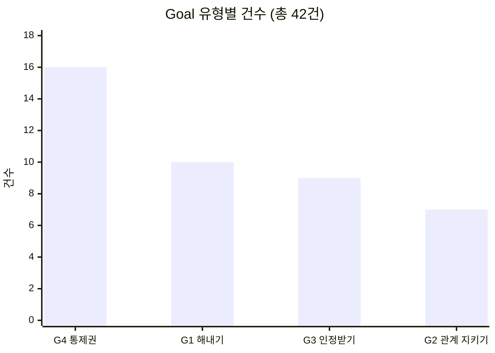
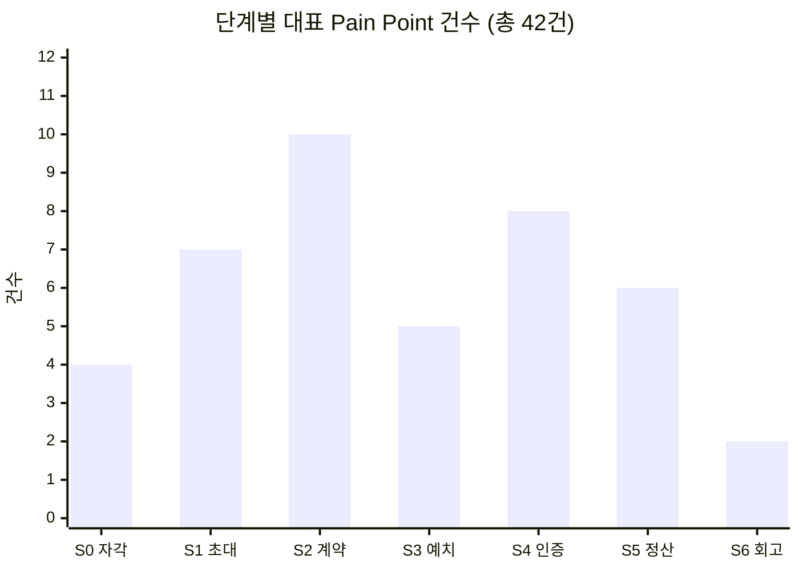

# 06-1. 대표 Pain Point 인벤토리 — 42건

> 작성일: 2026-08-11

14명 × 7단계 고객 여정의 Pain Point 90건 이상 중 **① 여정을 끊거나 배제하는 것 → ② 다른 통증의 원인이 되는 것 → ③ 여러 사람이 공유하는 것** 순으로 인물마다 3건씩 남긴 **42건**입니다. 각 Pain에 **Goal**을 함께 붙였습니다.

### 표기 규약

| 열 | 의미 |
|---|---|
| **단계** | 여정 7단계 중 어디서 발생하는가 (`S0` 자각 → `S6` 회고) |
| **Goal** | **그 순간, 그 화면에서** 이루려던 것 — §1의 인물 상위 Goal과는 층위가 다릅니다 |
| **유형** | 🚧 진입장벽 · 🔧 설계 결함 · 🤝 관계 비용 · 📉 리텐션 · ⚖️ 윤리·규제 |
| **영향** | `⛔ 이탈` 여기서 나감 · `🚫 배제` 쓰고 싶어도 못 씀 · `⚠️ 마찰` 힘들지만 통과 · `🔄 순환` 되돌아감 · `👁 잔존` 남아 있지만 지표에 안 잡힘 |

> **Pain은 "무엇이 막혔나", Goal은 "무엇을 하려다 막혔나"입니다.** Pain만으로는 중요도를 매길 수 없습니다 — 그 Pain이 **무엇을 막고 있는지**를 알아야 합니다.

---

## 1. 인물별 상위 Goal — 42건의 기준선

각 Pain의 중요도는 **이 상위 Goal을 얼마나 막느냐**로 판단합니다.

| 인물 | **상위 Goal — 이 사람이 궁극적으로 이루려는 것** |
|---|---|
| 🔵 **정하윤** 방장 | **잔소리꾼이 되지 않으면서 그룹을 완주시키는 것.** 끝났을 때 *"우리 진짜 했다"*고 말할 증거를 남기는 것 |
| 🔵 **김도현** 참여자 | **혼자서는 안 되던 것을 친구 리듬에 얹어 해내는 것.** 그리고 낸 돈은 전부 돌려받는 것 |
| 🔵 **박서연** 수험생 | **세운 목표에 실제로 도달하는 것.** 시험일까지 미달 폭이 줄어드는 게 눈에 보이는 것 |
| 🔵 **이준호** 루틴 | **아침 6시 기상을 무기한으로 고정하는 것.** 재미가 아니라 손실 회피로 굴리는 것 |
| 🔵 **최민지** 스프린터 | **D-day까지 완주하는 것.** 그리고 결과가 아니라 **과정**이 남는 것 |
| 🟢 **한지우** 총무 | **판정자 자리에서 내려오는 것.** 규칙이 자동 집행되고 본인은 결과만 확인하는 상태 |
| 🟢 **윤채원** 데일리 | **친구들과 계속 연결돼 있는 것**이 기본. 다만 학기마다 오는 단기 목표는 도구 있는 데서 해내는 것 |
| 🟢 **홍다인** 앱테크 | **포인트가 아니라 실제 변화로 바꾸는 것.** 쓰는 시간과 손품이 아깝지 않게 |
| 🟢 **송재현** 운동 기록 | **기간 없는 꾸준함을 눈에 보이는 형태로 누적하는 것.** 편집 없이 그냥 쌓이면 가장 좋음 |
| 🟢 **여민석** 사내 담당 | **예산 안에서 끝까지 가는 챌린지를 돌리는 것.** 그리고 보고 가능한 숫자를 남기는 것 |
| 🔴 **강수빈** 교대근무 | **불규칙한 삶에서도 무언가를 유지하고 있다는 감각.** 실패가 근무표 탓임을 시스템이 알아주는 것 |
| 🔴 **배유진** 촬영 불가 | **운동한 걸 증명하는 것.** 다만 얼굴·몸·주변 사람이 안 찍히는 방식으로 |
| ⚪ **서지훈** 알림 거부 | **알림에 통제당하지 않는 것.** ⚠️ 이 사람의 목표는 제품을 쓰는 게 아니라 **안 쓰는 것**입니다 |
| ⚪ **조은비** 현금 거부 | **습관은 만들되, 돈이 개입하지 않는 방식으로.** 남에게 손해를 끼치지 않으면서 |

---

## 2. 전체 인벤토리 — 42건

### 🔵 핵심 사용자 (15건)

| # | 인물 | 단계 | **Pain Point — 무엇이 막혔나** | **Goal — 무엇을 하려다 막혔나** | 근본 원인 | 유형 | 영향 |
|:-:|---|:-:|---|---|---|:-:|:-:|
| 01 | **정하윤** | S3·S4 | **독촉 역할이 시작 단계부터 되살아난다** — 이 앱을 쓰는 이유가 시작 전에 배신당한다 | 잔소리하지 않고도 그룹이 굴러가게 하는 것 | 미납·미달성 추적이 방장에게 귀속 | 🔧 | 👁 |
| 02 | 정하윤 | S5 | **상금의 출처가 친구의 손실이라는 사실이 화면에 드러난다** | 완주의 성취를 관계를 상하지 않고 누리는 것 | 제로섬 재원 구조 | 🤝 | 👁 |
| 03 | 정하윤 | S6 | **방장 역할이 고정돼 번아웃 → 그룹 자체가 사라진다** | 다음 시즌을 내가 총대 메지 않고도 이어가는 것 | 역할 로테이션 장치 없음 | 📉 | 👁 |
| 04 | **김도현** | S3 | **강제력이 필요한 걸 알면서도 참가비 앞에서 결정을 못 한다** | 강제력은 얻되 돈은 잃지 않는 것 | 손실을 겪어본 적이 없어 판단 근거 부재 | 🚧 | ⛔ |
| 05 | 김도현 | S4 | **한 번 밀리면 복귀 비용이 급등해 무응답으로 사라진다** | 하루 밀려도 조용히 돌아와 이어가는 것 | 미달성이 그룹에 그대로 노출 | 📉 | ⛔ |
| 06 | 김도현 | S2 | **협상력 없이 무리한 약속에 동의한다** — 이것이 S4 실패의 원인 | 내가 지킬 수 있는 강도로 참여하는 것 | 계약 설계에 참여 못 함 + 반대의 관계 비용 | 🔧 | ⚠️ |
| 07 | **박서연** | S4 | **인증은 통과인데 목표는 미달이라, 앱이 오히려 미달을 가린다** | 오늘 목표한 데까지 갔는지를 정확히 아는 것 | 했다/안 했다 이진 판정 | 🔧 | ⚠️ |
| 08 | 박서연 | S5 | **보상이 실제 성과와 무관하게 지급돼 잘못된 상태를 강화한다** | 출석이 아니라 진도로 평가받는 것 | 인증률 기준 정산 | ⚖️ | 👁 |
| 09 | 박서연 | S2 | **분량·범위 목표를 계약에 넣을 수 없다** | *"매일 3단원"*을 약속으로 걸 수 있는 것 | 계약 표현력 부족 | 🔧 | ⚠️ |
| 10 | **이준호** | S2·S6 | **무기한 습관인데 제품은 시즌제라, 갱신마다 이탈 지점이 새로 생긴다** | 끝나는 날 없이 계속 굴러가게 하는 것 | 종료일을 전제한 시즌 구조 | 🔧 | ⚠️ |
| 11 | 이준호 | S1 | **그룹 제품인데 그룹 없이 도착하고, 매칭 품질을 통제할 수 없다** | 친구가 없어도 나를 지켜보는 사람을 갖는 것 | 오픈 매칭 의존 | 🚧 | ⚠️ |
| 12 | 이준호 | S4 | **낯선 그룹은 사회적 압력이 약하고 담합 위험이 커진다** | 아무도 안 보는 상태를 벗어나 실제 압박을 받는 것 | 관계 기반 압력 부재 | 📉 | ⚠️ |
| 13 | **최민지** | S4 | **5주차 붕괴가 예측 가능한데 앱이 아무것도 하지 않는다** | 무너지는 구간을 넘겨 D-day까지 가는 것 | 구간별 개입 장치 없음 | 📉 | ⚠️ |
| 14 | 최민지 | S6 | **과정이 안 남고 결과만 남는다** — 가장 힘들었던 구간이 가장 기록이 없다 | 12주를 어떻게 통과했는지가 손에 잡히게 남는 것 | 회고본이 요약 중심 | 📉 | 👁 |
| 15 | 최민지 | S2 | **실패 비용이 커서 난이도를 스스로 과대 설정한다** | 실패하지 않을 만큼만 세게 거는 것 | 자기구속에 조정 장치 없음 | 🔧 | ⚠️ |

### 🟢 확장 사용자 (15건)

| # | 인물 | 단계 | **Pain Point — 무엇이 막혔나** | **Goal — 무엇을 하려다 막혔나** | 근본 원인 | 유형 | 영향 |
|:-:|---|:-:|---|---|---|:-:|:-:|
| 16 | **한지우** | S1 | **크루원 18명을 다 옮겨야 하고, 한 명이라도 남으면 이중 운영이 된다** | 크루를 한 번에 옮겨 손 작업을 끝내는 것 | 집단 이주 비용 | 🚧 | ⚠️ |
| 17 | 한지우 | S2 | **2년간의 재량(봐주기)이 자동 집행과 충돌해 "더 각박해졌다"는 반발이 난다** | 규칙은 자동화하되 인간적인 예외는 남기는 것 | 예외 처리 수단 부재 | 🤝 | ⚠️ |
| 18 | 한지우 | S5 | **자동 분배가 회식비로 쓰던 공동 재원을 없앤다** | 모인 돈을 크루 활동에 계속 쓰는 것 | 분배가 개인 귀속으로 고정 | 🤝 | 👁 |
| 19 | **윤채원** | S3 | **친목 그룹에 돈이 들어오는 순간 관계가 거래로 재정의된다** | 친구 관계를 그대로 둔 채 이번 목표만 해내는 것 | 제로섬 예치 | 🤝 | ⛔ |
| 20 | 윤채원 | S0 | **목표가 생기는 순간이 짧고 예측 불가라 상시 마케팅으로는 안 닿는다** | 목표가 생긴 바로 그 순간에 시작하는 것 | 간헐적 목표형 | 🚧 | ⚠️ |
| 21 | 윤채원 | S1 | **전환이 친구의 한마디에 달려 있는데 앱이 그 대화를 만들지 못한다** | 친구들을 통째로 데려와 같이 시작하는 것 | 그룹 통째 전환 진입점 부재 | 🚧 | ⚠️ |
| 22 | **홍다인** | S3 | **5년간 받기만 해본 사람에게 손실 가능성이 인생 처음 등장한다** | 손실 위험 없이 이 구조를 먼저 겪어보는 것 | 예치 경험 없음 | 🚧 | ⛔ |
| 23 | 홍다인 | S1 | **보상형 유입자는 그룹 없이 혼자 도착한다** | 혼자 왔어도 함께할 그룹을 배정받는 것 | 개인 광고·검색 유입 경로 | 🚧 | ⚠️ |
| 24 | 홍다인 | S2 | **손실 경험이 없어 난이도를 낙관하고 첫 시즌 실패 확률이 높아진다** | 첫 시즌을 성공으로 끝내는 것 | 난이도 추천 장치 부재 | 🔧 | ⚠️ |
| 25 | **송재현** | S1 | **그룹도 마감일도 없어 그룹 계약 중심 온보딩에 들어갈 자리가 없다** | 그룹 없이 혼자서도 기록을 시작하는 것 | 개인 트랙 부재 | 🚧 | ⚠️ |
| 26 | 송재현 | S0 | **촬영·편집 마찰이 꾸준함을 끊어 기록이 띄엄띄엄해진다** | 찍는 것도 편집도 신경 안 쓰고 기록이 쌓이는 것 | 기존 도구(인스타)의 편집 부담 | 📉 | ⚠️ |
| 27 | 송재현 | S2 | **혼자 하는 약속은 지켜볼 사람이 없어 자기구속이 약하다** | 혼자서도 지켜지는 최소한의 강제력을 갖는 것 | 그룹 압력 부재 | 🔧 | ⚠️ |
| 28 | **여민석** | S2 | **담당자가 대신 설계해 "회사가 시킨 것"이 되고 자기구속 원리가 무너진다** | 직원이 **스스로 한 약속**으로 느끼게 만드는 것 | 계약 주체와 이행 주체의 분리 | 🔧 | ⚠️ |
| 29 | 여민석 | S5 | **부서별 달성률·지속률 같은 보고용 숫자를 뽑을 수 없다** | 경영진에 낼 숫자를 확보하는 것 | 조직용 화면 부재 | 🔧 | 👁 |
| 30 | 여민석 | S4 | **참여율이 떨어져도 담당자가 쓸 개입 수단이 없다** | 참여율이 떨어질 때 손을 쓸 수 있는 것 | 관리자 도구 부재 | 📉 | ⚠️ |

### 🔴 극단 사용자 (6건)

| # | 인물 | 단계 | **Pain Point — 무엇이 막혔나** | **Goal — 무엇을 하려다 막혔나** | 근본 원인 | 유형 | 영향 |
|:-:|---|:-:|---|---|---|:-:|:-:|
| 31 | **강수빈** | S2 | **계약 전에 아무것도 묻지 않아, 지킬 수 없는 약속에 서명한다** | 내 근무표로 **지킬 수 있는 조건**을 고르는 것 | 계약 전 진단 절차 부재 | 🔧 | 🚫 |
| 32 | 강수빈 | S4 | **게으름과 근무 충돌이 똑같은 '미달성'으로 기록된다** | 근무 때문에 못 한 것과 게을러서 못 한 것을 구분받는 것 | 실패 사유를 구분하지 않음 | 🔧 | 🚫 |
| 33 | 강수빈 | S5 | **구조적 실패자의 손실이 상금 재원이라 시스템에 순환을 멈출 유인이 없다** | 잃기만 하는 자리에서 벗어나는 것 | 제로섬 재원 구조 | ⚖️ | 🔄 |
| 34 | **배유진** | S4 | **인증 수단이 하나뿐이라 촬영 불가 환경이 곧 배제 환경이 된다** | 촬영이 금지된 곳에서도 운동을 증명하는 것 | 단일 인증 수단(실시간 영상) | 🔧 | 🚫 |
| 35 | 배유진 | S3 | **촬영 가능 여부를 묻지 않아 돈을 걸고 나서야 막힌다** | 돈을 걸기 전에 내가 할 수 있는지 확인하는 것 | 계약 전 진단 절차 부재 | 🚧 | 🚫 |
| 36 | 배유진 | S5 | **실제로 운동했는데 증명 수단이 없어 몰수당한다** | 실제로 한 운동을 인정받는 것 | 대체 인증 수단 부재 | ⚖️ | 🚫 |

### ⚪ 비활성 사용자 (6건)

| # | 인물 | 단계 | **Pain Point — 무엇이 막혔나** | **Goal — 무엇을 하려다 막혔나** | 근본 원인 | 유형 | 영향 |
|:-:|---|:-:|---|---|---|:-:|:-:|
| 37 | **서지훈** | S0 | **앱 이름을 듣는 순간 '알림 앱'으로 분류돼 설명 기회가 안 생긴다** | ⚠️ **알림에 하루를 뺏기지 않는 것** (= 이 앱을 안 쓰는 것) | 카테고리 낙인 | 🚧 | ⛔ |
| 38 | 서지훈 | S1 | **차별점이 한 문장으로 전달되지 않아, 설명이 길어질수록 방어가 세진다** | ⚠️ 설득당하지 않고 자기 판단을 유지하는 것 | 개념(트리거 소유권)의 전달 난도 | 🚧 | ⛔ |
| 39 | 서지훈 | S0 | **과거 앱이 하루를 지배한 경험이 통제 상실감으로 남아 있다** | 내 하루의 리듬을 내가 정하는 것 | BeReal 사용 경험 | 📉 | ⛔ |
| 40 | **조은비** | S3 | **환급 논리는 손실 걱정에 답하는데, 이 사람의 반대는 도덕 판단이라 논점이 어긋난다** | 남에게 손해를 끼치지 않으면서 습관을 만드는 것 | 제로섬 구조 자체 | ⚖️ | ⛔ |
| 41 | 조은비 | S1 | **제품이 아니라 소개자를 보고 들어와, 거절하면 관계까지 어색해진다** | 거절해도 지인 관계를 상하지 않는 것 | 지인 소개 유입 | 🤝 | ⚠️ |
| 42 | 조은비 | S2 | **계약까지 매끄러워서 예치의 이질감이 오히려 증폭된다** | 결정하기 전에 구조를 전부 알고 있는 것 | 구조 고지 시점이 늦음 | 🚧 | ⚠️ |

---

## 3. Goal로 다시 보기 — 사람들이 진짜 원하는 것은 네 가지

42개의 Pain별 Goal을 성격으로 묶으면 **네 덩어리**가 됩니다.

| Goal 유형 | 한 줄 정의 | 건수 | 해당 번호 |
|---|---|:-:|---|
| **G4 통제권** *Autonomy* | **조건과 리듬을 내가 정하고 싶다** | **16** | 03, 06, 09, 10, 16, 20, 22, 25, 28, 30, 31, 35, 37, 38, 39, 42 |
| **G1 해내기** *Achievement* | 목표를 실제로 달성하고 싶다 | 10 | 04, 05, 11, 12, 13, 15, 21, 23, 24, 27 |
| **G3 인정받기** *Recognition* | 내가 한 것이 제대로 기록·평가되었으면 | 9 | 07, 08, 14, 26, 29, 32, 33, 34, 36 |
| **G2 관계 지키기** *Relationship* | 사람 사이가 상하지 않았으면 | 7 | 01, 02, 17, 18, 19, 40, 41 |

---

### 📝 해설 — Goal을 붙이자 드러난 것 세 가지

**① 가장 많이 막히는 것은 "해내기"가 아니라 "통제권"입니다.**

42건 중 **16건(38%)**이 *"조건과 리듬을 내가 정하고 싶다"*는 Goal에서 막힙니다. 목표 달성 자체(G1, 10건)보다 많습니다.

이것이 아픈 이유는 **이 제품의 존재 이유가 바로 통제권이기 때문**입니다. 원래 설계는 *"알림 트리거의 소유권을 플랫폼에서 사용자에게 넘긴다"*였습니다. 그런데 실제 여정을 따라가 보니, 사용자는 **여전히 자기 조건을 정하지 못하는 지점에서 가장 많이 막힙니다** — 근무표를 못 넣고(31), 분량 목표를 못 걸고(09), 시즌을 안 끝내지 못하고(10), 혼자 시작하지 못하고(25), 회사가 대신 약속을 정합니다(28).

> **트리거 시각은 사용자에게 넘겼는데, 계약의 나머지 조건은 여전히 제품이 쥐고 있습니다.** 이것이 42건이 가리키는 가장 큰 구조적 진단입니다.

**② 같은 화면에서 멈춰도 Goal이 다르면 처방이 다릅니다.**

04·22·40번은 모두 **S3 예치**에서 멈춥니다. 그런데 Goal을 보면 전혀 다른 사람들입니다.

| # | 인물 | Goal | 사다리로 풀리나 |
|:-:|---|---|:-:|
| 04 | 김도현 | 강제력은 얻되 **돈은 잃지 않는 것** | ✅ 무예치 체험이 답 |
| 22 | 홍다인 | 손실 위험 없이 **먼저 겪어보는 것** | ✅ 무예치 체험이 답 |
| 40 | 조은비 | **남에게 손해를 끼치지 않으면서** 습관을 만드는 것 | ❌ 안 풀림 |

앞의 둘은 *"내가 잃을까 봐"*이고 조은비는 *"남이 잃는 게 싫어서"*입니다. **예치 사다리는 앞의 둘만 통과시키고 조은비는 그대로 남깁니다.** Pain만 보면 "S3에서 4명 이탈"로 한 덩어리지만, Goal을 보면 **처방이 둘로 갈립니다.**

**③ Goal이 제품과 반대 방향인 사람이 있습니다.**

37·38번(서지훈)의 Goal은 **"이 앱을 안 쓰는 것"**입니다. Pain만 보면 매우 중요하고 전혀 해결되지 않은 것처럼 보이지만, **Goal로 보면 지금 안 쓰고 있으므로 이미 완전히 충족된 상태**입니다.

> AOS는 *"우리가 풀면 고객이 좋아할 문제"*를 찾는 도구인데, 이 Goal은 **우리가 풀수록 고객이 멀어지는** 종류입니다. Goal 없이 Pain만으로 채점하면 이런 항목이 최상위로 올라옵니다.

---

## 4. 단계별로 다시 보기 — 어느 관문에 몰려 있나

| 단계 | 건수 | 해당 번호 | 이 단계의 성격 |
|---|:-:|---|---|
| **S0** 자각 | 4 | 20, 26, 37, 39 | 진입 전 인식 — **설명 기회를 얻느냐** |
| **S1** 초대 | 7 | 11, 16, 21, 23, 25, 38, 41 | **그룹이 없거나, 그룹째 옮겨야 한다** |
| **S2** 계약 | **10** | 06, 09, 10, 15, 17, 24, 27, 28, 31, 42 | 🔴 **최다 — 묻지 않고, 담을 형태가 하나뿐이다** |
| **S3** 예치 | 5 | 04, 19, 22, 35, 40 | 🔴 **이탈 4건 집중 — 최대 이탈 관문** |
| **S4** 인증 | 8 | 01, 05, 07, 12, 13, 30, 32, 34 | 수단·판정이 하나뿐이고, 복귀 비용이 크다 |
| **S5** 정산 | 6 | 02, 08, 18, 29, 33, 36 | 제로섬이 관계·윤리 비용으로 청구된다 |
| **S6** 회고 | 2 | 03, 14 | 재계약 동력이 특정 인물·결과에만 붙는다 |

> **건수가 가장 많은 곳은 S2 계약(10건)인데, 이탈이 가장 많은 곳은 S3 예치(4건)입니다.**
> **S2는 넓게 아프고 S3는 깊게 끊깁니다.** 그리고 §3에서 본 대로 **S2의 통증은 대부분 "통제권"(G4)**입니다 — 계약에 내 조건을 못 넣는 것이 넓게 아픈 이유입니다.

---

## 5. 유형별 · 공유 묶음

### 5-1. 유형별 분포

| 유형 | 건수 | 해당 번호 | 고치는 주체 |
|---|:-:|---|---|
| 🔧 **설계 결함** | **13** | 01, 06, 07, 09, 10, 15, 24, 27, 28, 29, 31, 32, 34 | 제품 설계 — 가장 많고 대부분 S2·S4에 몰려 있다 |
| 🚧 **진입장벽** | **12** | 04, 11, 16, 20, 21, 22, 23, 25, 35, 37, 38, 42 | 온보딩·마케팅·요금 구조 |
| 📉 **리텐션** | 8 | 03, 05, 12, 13, 14, 26, 30, 39 | 유지 장치·개입 타이밍 |
| 🤝 **관계 비용** | 7 | 02, 17, 18, 19, 40, 41 | 정산 구조·언어 설계 |
| ⚖️ **윤리·규제** | 4 | 08, 33, 36, 40 | 🔴 수익 구조 재검토 — 방치하면 사행성 심사와 직결 |

*(40번은 관계 비용과 윤리·규제 양쪽에 걸쳐 있어 두 곳 모두에 표기)*

### 5-2. 여러 사람이 공유하는 묶음

> **하나를 고치면 여러 명이 동시에 복구됩니다.**

| 묶음 | 번호 | 겪는 사람 | 공통 Goal | 공통 원인 |
|---|---|:-:|---|---|
| **① 예치 문턱** | 04, 19, 22, 40 | **4명** | *(갈림 — §3 해설 ② 참조)* | 참가비를 거는 행위 자체 |
| **② 제로섬 재원** | 02, 19, 33, 40 | **4명** | 남의 손실 위에 서지 않는 것 | 상금이 타인의 몰수금에서 나온다 |
| **③ 계약 표현력 부족** | 09, 10, 31 | **3명** | **내 조건으로 약속하는 것** (G4) | 고정 시각 · 이진 판정 · 시즌제 |
| **④ 그룹 없이 도착** | 11, 23, 25 | **3명** | 함께할 사람을 갖는 것 | 그룹 제품인데 개인이 혼자 유입 |
| **⑤ 계약 전 진단 부재** | 31, 35 | **2명** | 걸기 전에 할 수 있는지 확인하는 것 | 지킬 수 있는지 묻지 않는다 |
| **⑥ 난이도 과대 설정** | 15, 24 | **2명** | 첫 시즌을 성공으로 끝내는 것 | 손실 경험 유무와 무관하게 무리하게 잡음 |

> **①과 ②가 겹칩니다** — 19·40번은 두 묶음 모두에 들어갑니다. **예치를 거부하는 이유가 곧 제로섬 구조**라는 뜻이며, 사실상 **하나의 수익 구조 문제**입니다.

---

## 부록. 이 인벤토리의 한계

1. **42건은 90건 이상에서 골라낸 것입니다.** 인물마다 3건으로 자르면서 **탈락한 통증이 인물당 1~4건씩** 있습니다. 특히 정하윤(S1 초대 부담·S2 합의 비용)과 배유진(S6 복귀 불가)은 탈락분도 강한 편입니다.
2. **한지우 3건은 상위 Goal을 정면으로 다루지 않습니다.** 상위 Goal은 *"판정자 자리에서 내려오는 것"*인데 뽑힌 3건(16 이주·17 관행 충돌·18 재원 상실)은 **전부 도입과 운영의 부작용**입니다. 정작 *"판정에서 해방되는 순간"*은 여정지도 S4에 있는데 탈락했습니다 → **재선별 후보**입니다.
3. **Pain별 Goal은 역산한 추론입니다.** 여정지도의 행동·생각·감정에서 *"그래서 무엇을 하려던 것인가"*를 되짚어 쓴 것이며, **본인에게 물어본 것이 아닙니다.**
4. **Goal 4분류(G1~G4)는 본 문서의 판단입니다.** 방법론이 규정한 체계가 아니며, 하나의 Goal이 두 유형에 걸치는 경우 주된 쪽으로 배정했습니다.
5. **선별 기준이 "이탈 우선"이라 완주자의 통증이 상대적으로 적게 뽑혔습니다.** 완주자의 통증은 지표에 안 잡히므로 **과소평가될 위험**이 구조적으로 있습니다.
6. **원본 여정지도 자체가 미검증입니다.** 14명은 가상 인물이고 이탈 지점은 관측이 아니라 논리적 추론입니다. **이 인벤토리도 같은 상태를 물려받습니다.**
