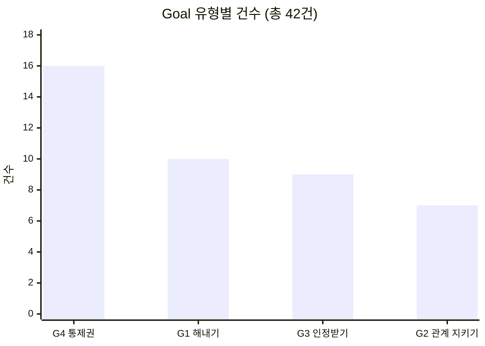
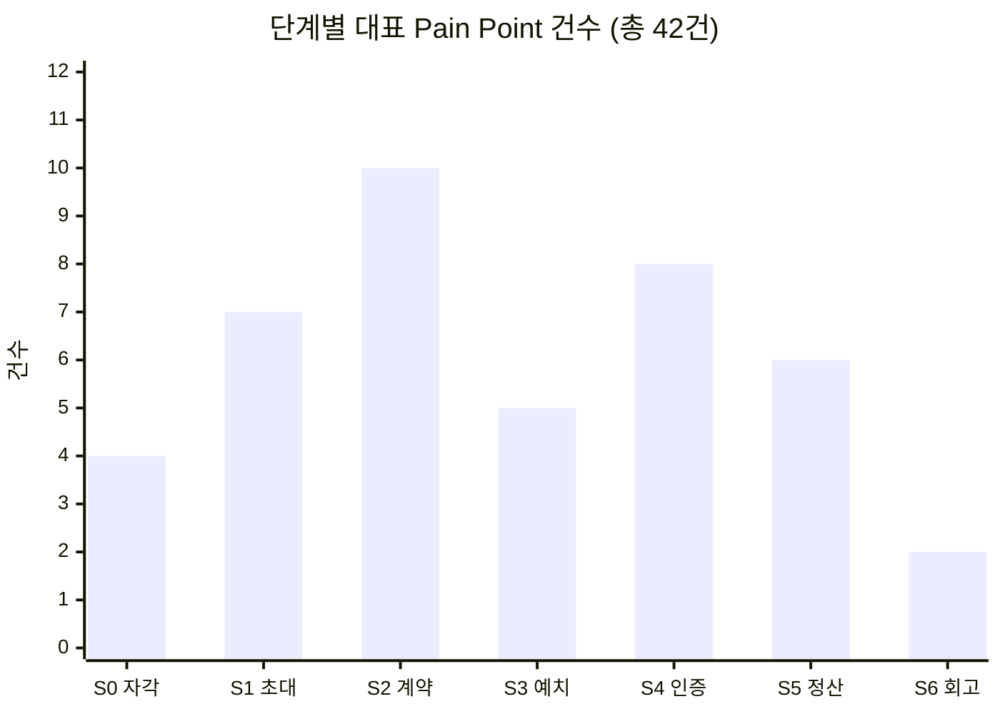
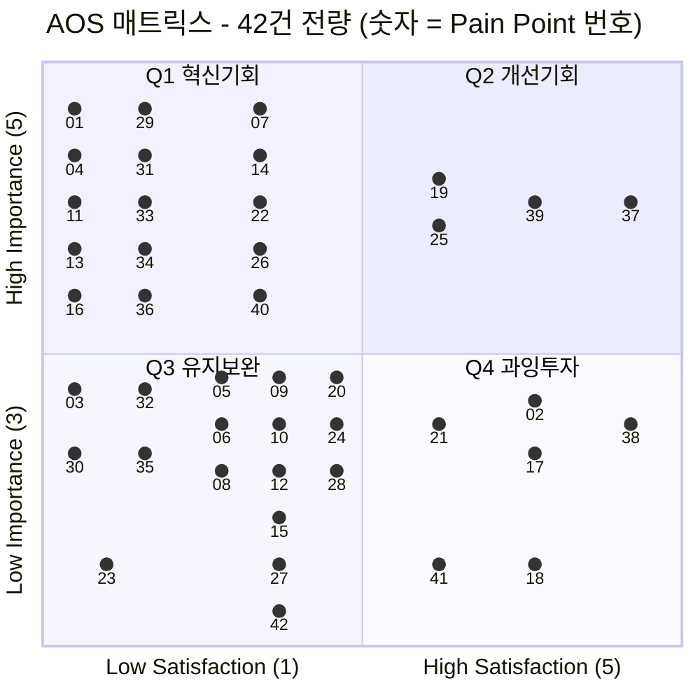
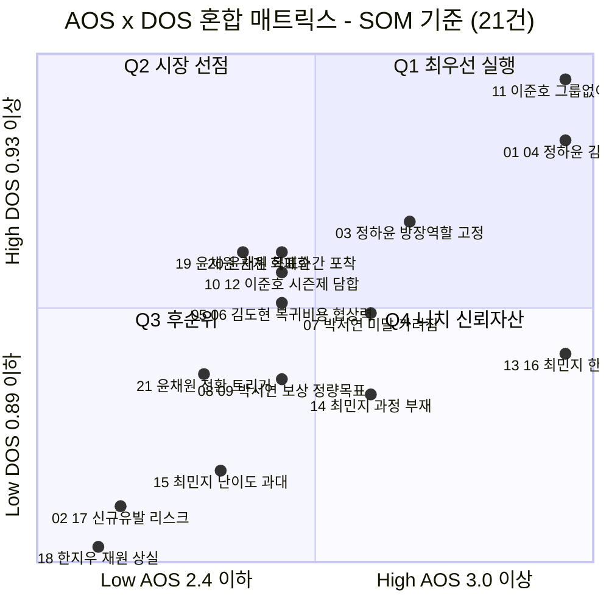
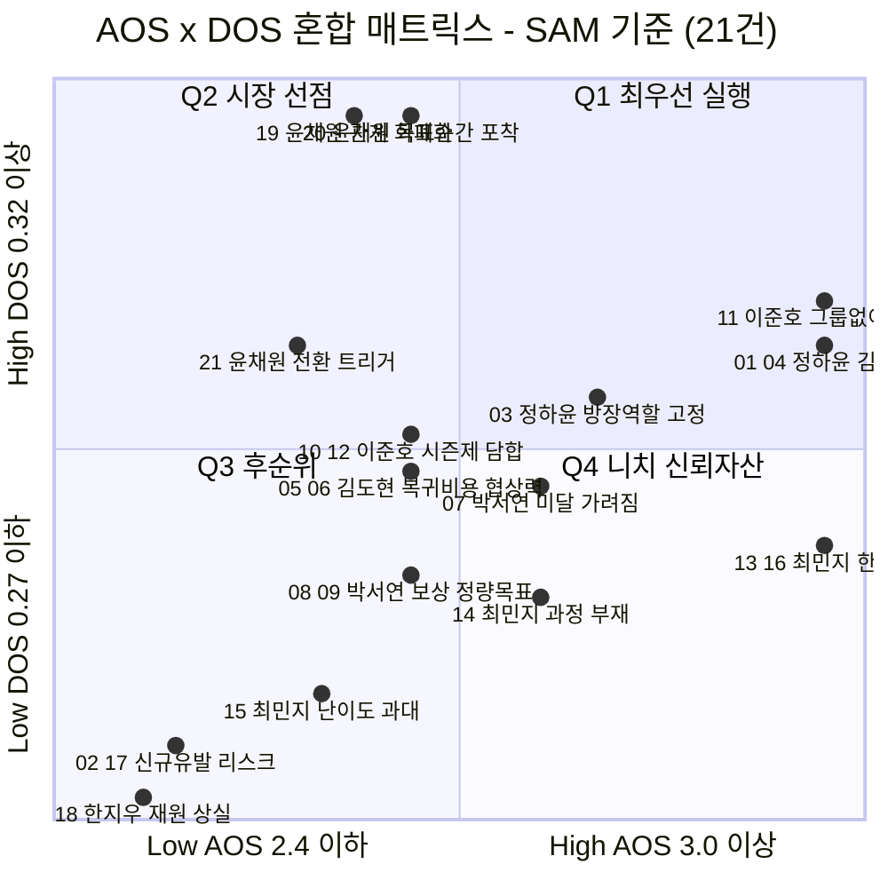

# 06. 시장기회 분석 — 기회점수(AOS·DOS) 종합

> 작성일: 2026-08-11 · 통합 정리: 2026-08-14
> 지리적 범위: 대한민국 / 통화: KRW
> **문서 성격:** 06 챕터의 **분석 결과 합본.** 원래 4개 문서(Pain 인벤토리 · AOS 채점 · DOS 채점 · 혼합 매트릭스)로 나뉘어 있었으나, **하나의 연속된 채점 체인**이므로 한 문서로 합쳤다. 분석 방법(공식·척도 정의)은 `methodology.md`에 따로 있다.

## 이 문서의 구조

| 부 | 내용 | 산출 |
|:-:|---|---|
| **Ⅰ** | 대표 Pain Point 인벤토리 — 42건 | 채점 대상 확정 · Goal 4분류 |
| **Ⅱ** | AOS 채점 — 고객 절실도 | 42건 점수 · 사분면 Q1~Q4 |
| **Ⅲ** | DOS 채점 — 시장 가중 | 36건 중 21건 산출 · **SOM 기준 채택** |
| **Ⅳ** | AOS × DOS 혼합 매트릭스 | 실행 순서 |
| **Ⅴ** | 통합 한계 | 이 채점 전체를 믿기 전에 알아야 할 것 |

```
AOS = Importance × (1 − Satisfaction / 5)          ← 불만족을 비율로
DOS = (Importance − Satisfaction) × Market Relevance  ← 불만족을 차이로 (음수 가능)
```

> **⚠️ 모수 채택 결론을 먼저 밝힌다** — DOS는 SAM(800만) · SOM(232만) 두 기준으로 계산했고, **SOM 기준을 채택**했다. SAM 기준은 *"직접 타깃하지 않기로 한 세그먼트(C2 데일리 크루)"*를 1순위로 올리기 때문이다. **아래 Ⅲ·Ⅳ의 SAM 버전은 그 판단의 대조군으로만 읽을 것.**

---

# Ⅰ. 대표 Pain Point 인벤토리 — 42건

> 작성일: 2026-08-11

14명 × 7단계 고객 여정의 Pain Point 90건 이상 중 **① 여정을 끊거나 배제하는 것 → ② 다른 통증의 원인이 되는 것 → ③ 여러 사람이 공유하는 것** 순으로 인물마다 3건씩 남긴 **42건**입니다. 각 Pain에 **Goal**을 함께 붙였습니다.

#### 표기 규약

| 열 | 의미 |
|---|---|
| **단계** | 여정 7단계 중 어디서 발생하는가 (`S0` 자각 → `S6` 회고) |
| **Goal** | **그 순간, 그 화면에서** 이루려던 것 — §1의 인물 상위 Goal과는 층위가 다릅니다 |
| **유형** | 🚧 진입장벽 · 🔧 설계 결함 · 🤝 관계 비용 · 📉 리텐션 · ⚖️ 윤리·규제 |
| **영향** | `⛔ 이탈` 여기서 나감 · `🚫 배제` 쓰고 싶어도 못 씀 · `⚠️ 마찰` 힘들지만 통과 · `🔄 순환` 되돌아감 · `👁 잔존` 남아 있지만 지표에 안 잡힘 |

> **Pain은 "무엇이 막혔나", Goal은 "무엇을 하려다 막혔나"입니다.** Pain만으로는 중요도를 매길 수 없습니다 — 그 Pain이 **무엇을 막고 있는지**를 알아야 합니다.

> ### ⚠️ 정산 구조에 대한 표기
> `02`·`19`·`33`·`40` 네 건은 **당시 설계였던 제로섬 정산**(미달성 몰수분이 완주자 상금이 되는 구조)에서 발생한 통증입니다. **그 구조는 08 고객가치선언문 단계에서 `비제로섬 자기환급`으로 확정 변경됐습니다.**
>
> **네 건을 목록에서 빼지 않은 이유** — 이 통증들이 **제로섬을 폐기하게 만든 근거**이고, AOS·DOS 채점(06-2·06-3)과 세 가치 선언(08)이 전부 이 42건 위에 서 있기 때문입니다. 번호를 지우면 후속 문서의 근거가 함께 무너집니다.
>
> **읽는 법** — 이 네 건은 *"미해결 통증"*이 아니라 **"해소된 통증과 그 해소 근거"**로 읽으십시오.

---

### 1. 인물별 상위 Goal — 42건의 기준선

각 Pain의 중요도는 **이 상위 Goal을 얼마나 막느냐**로 판단합니다.

| 인물 | **상위 Goal — 이 사람이 궁극적으로 이루려는 것** |
|---|---|
| 🔵 **정하윤** 방장 | **잔소리꾼이 되지 않으면서 그룹을 완주시키는 것.** 끝났을 때 *"우리 진짜 했다"*고 말할 증거를 남기는 것 |
| 🔵 **김도현** 참여자 | **혼자서는 안 되던 것을 친구 리듬에 얹어 해내는 것.** 그리고 낸 돈은 전부 돌려받는 것 |
| 🔵 **박서연** 수험생 | **세운 목표에 실제로 도달하는 것.** 시험일까지 미달 폭이 줄어드는 게 눈에 보이는 것 |
| 🔵 **이준호** 루틴 | **아침 6시 기상을 무기한으로 고정하는 것.** 재미가 아니라 손실 회피로 굴리는 것 |
| 🔵 **최민지** 스프린터 | **D-day까지 완주하는 것.** 그리고 결과가 아니라 **과정**이 남는 것 |
| 🟢 **한지우** 총무 | **판정자 자리에서 내려오는 것.** 규칙이 자동 집행되고 본인은 결과만 확인하는 상태 |
| 🟢 **윤채원** 데일리 | **친구들과 계속 연결돼 있는 것**이 기본. 다만 학기마다 오는 단기 목표는 도구 있는 데서 해내는 것 |
| 🟢 **홍다인** 앱테크 | **포인트가 아니라 실제 변화로 바꾸는 것.** 쓰는 시간과 손품이 아깝지 않게 |
| 🟢 **송재현** 운동 기록 | **기간 없는 꾸준함을 눈에 보이는 형태로 누적하는 것.** 편집 없이 그냥 쌓이면 가장 좋음 |
| 🟢 **여민석** 사내 담당 | **예산 안에서 끝까지 가는 챌린지를 돌리는 것.** 그리고 보고 가능한 숫자를 남기는 것 |
| 🔴 **강수빈** 교대근무 | **불규칙한 삶에서도 무언가를 유지하고 있다는 감각.** 실패가 근무표 탓임을 시스템이 알아주는 것 |
| 🔴 **배유진** 촬영 불가 | **운동한 걸 증명하는 것.** 다만 얼굴·몸·주변 사람이 안 찍히는 방식으로 |
| ⚪ **서지훈** 알림 거부 | **알림에 통제당하지 않는 것.** ⚠️ 이 사람의 목표는 제품을 쓰는 게 아니라 **안 쓰는 것**입니다 |
| ⚪ **조은비** 현금 거부 | **습관은 만들되, 돈이 개입하지 않는 방식으로.** 남에게 손해를 끼치지 않으면서 |

---

### 2. 전체 인벤토리 — 42건

#### 🔵 핵심 사용자 (15건)

| # | 인물 | 단계 | **Pain Point — 무엇이 막혔나** | **Goal — 무엇을 하려다 막혔나** | 근본 원인 | 유형 | 영향 |
|:-:|---|:-:|---|---|---|:-:|:-:|
| 01 | **정하윤** | S3·S4 | **독촉 역할이 시작 단계부터 되살아난다** — 이 앱을 쓰는 이유가 시작 전에 배신당한다 | 잔소리하지 않고도 그룹이 굴러가게 하는 것 | 미납·미달성 추적이 방장에게 귀속 | 🔧 | 👁 |
| 02 | 정하윤 | S5 | **상금의 출처가 친구의 손실이라는 사실이 화면에 드러난다** | 완주의 성취를 관계를 상하지 않고 누리는 것 | 제로섬 재원 구조 | 🤝 | 👁 |
| 03 | 정하윤 | S6 | **방장 역할이 고정돼 번아웃 → 그룹 자체가 사라진다** | 다음 시즌을 내가 총대 메지 않고도 이어가는 것 | 역할 로테이션 장치 없음 | 📉 | 👁 |
| 04 | **김도현** | S3 | **강제력이 필요한 걸 알면서도 참가비 앞에서 결정을 못 한다** | 강제력은 얻되 돈은 잃지 않는 것 | 손실을 겪어본 적이 없어 판단 근거 부재 | 🚧 | ⛔ |
| 05 | 김도현 | S4 | **한 번 밀리면 복귀 비용이 급등해 무응답으로 사라진다** | 하루 밀려도 조용히 돌아와 이어가는 것 | 미달성이 그룹에 그대로 노출 | 📉 | ⛔ |
| 06 | 김도현 | S2 | **협상력 없이 무리한 약속에 동의한다** — 이것이 S4 실패의 원인 | 내가 지킬 수 있는 강도로 참여하는 것 | 계약 설계에 참여 못 함 + 반대의 관계 비용 | 🔧 | ⚠️ |
| 07 | **박서연** | S4 | **인증은 통과인데 목표는 미달이라, 앱이 오히려 미달을 가린다** | 오늘 목표한 데까지 갔는지를 정확히 아는 것 | 했다/안 했다 이진 판정 | 🔧 | ⚠️ |
| 08 | 박서연 | S5 | **보상이 실제 성과와 무관하게 지급돼 잘못된 상태를 강화한다** | 출석이 아니라 진도로 평가받는 것 | 인증률 기준 정산 | ⚖️ | 👁 |
| 09 | 박서연 | S2 | **분량·범위 목표를 계약에 넣을 수 없다** | *"매일 3단원"*을 약속으로 걸 수 있는 것 | 계약 표현력 부족 | 🔧 | ⚠️ |
| 10 | **이준호** | S2·S6 | **무기한 습관인데 제품은 시즌제라, 갱신마다 이탈 지점이 새로 생긴다** | 끝나는 날 없이 계속 굴러가게 하는 것 | 종료일을 전제한 시즌 구조 | 🔧 | ⚠️ |
| 11 | 이준호 | S1 | **그룹 제품인데 그룹 없이 도착하고, 매칭 품질을 통제할 수 없다** | 친구가 없어도 나를 지켜보는 사람을 갖는 것 | 오픈 매칭 의존 | 🚧 | ⚠️ |
| 12 | 이준호 | S4 | **낯선 그룹은 사회적 압력이 약하고 담합 위험이 커진다** | 아무도 안 보는 상태를 벗어나 실제 압박을 받는 것 | 관계 기반 압력 부재 | 📉 | ⚠️ |
| 13 | **최민지** | S4 | **5주차 붕괴가 예측 가능한데 앱이 아무것도 하지 않는다** | 무너지는 구간을 넘겨 D-day까지 가는 것 | 구간별 개입 장치 없음 | 📉 | ⚠️ |
| 14 | 최민지 | S6 | **과정이 안 남고 결과만 남는다** — 가장 힘들었던 구간이 가장 기록이 없다 | 12주를 어떻게 통과했는지가 손에 잡히게 남는 것 | 회고본이 요약 중심 | 📉 | 👁 |
| 15 | 최민지 | S2 | **실패 비용이 커서 난이도를 스스로 과대 설정한다** | 실패하지 않을 만큼만 세게 거는 것 | 자기구속에 조정 장치 없음 | 🔧 | ⚠️ |

#### 🟢 확장 사용자 (15건)

| # | 인물 | 단계 | **Pain Point — 무엇이 막혔나** | **Goal — 무엇을 하려다 막혔나** | 근본 원인 | 유형 | 영향 |
|:-:|---|:-:|---|---|---|:-:|:-:|
| 16 | **한지우** | S1 | **크루원 18명을 다 옮겨야 하고, 한 명이라도 남으면 이중 운영이 된다** | 크루를 한 번에 옮겨 손 작업을 끝내는 것 | 집단 이주 비용 | 🚧 | ⚠️ |
| 17 | 한지우 | S2 | **2년간의 재량(봐주기)이 자동 집행과 충돌해 "더 각박해졌다"는 반발이 난다** | 규칙은 자동화하되 인간적인 예외는 남기는 것 | 예외 처리 수단 부재 | 🤝 | ⚠️ |
| 18 | 한지우 | S5 | **자동 분배가 회식비로 쓰던 공동 재원을 없앤다** | 모인 돈을 크루 활동에 계속 쓰는 것 | 분배가 개인 귀속으로 고정 | 🤝 | 👁 |
| 19 | **윤채원** | S3 | **친목 그룹에 돈이 들어오는 순간 관계가 거래로 재정의된다** | 친구 관계를 그대로 둔 채 이번 목표만 해내는 것 | 제로섬 예치 | 🤝 | ⛔ |
| 20 | 윤채원 | S0 | **목표가 생기는 순간이 짧고 예측 불가라 상시 마케팅으로는 안 닿는다** | 목표가 생긴 바로 그 순간에 시작하는 것 | 간헐적 목표형 | 🚧 | ⚠️ |
| 21 | 윤채원 | S1 | **전환이 친구의 한마디에 달려 있는데 앱이 그 대화를 만들지 못한다** | 친구들을 통째로 데려와 같이 시작하는 것 | 그룹 통째 전환 진입점 부재 | 🚧 | ⚠️ |
| 22 | **홍다인** | S3 | **5년간 받기만 해본 사람에게 손실 가능성이 인생 처음 등장한다** | 손실 위험 없이 이 구조를 먼저 겪어보는 것 | 예치 경험 없음 | 🚧 | ⛔ |
| 23 | 홍다인 | S1 | **보상형 유입자는 그룹 없이 혼자 도착한다** | 혼자 왔어도 함께할 그룹을 배정받는 것 | 개인 광고·검색 유입 경로 | 🚧 | ⚠️ |
| 24 | 홍다인 | S2 | **손실 경험이 없어 난이도를 낙관하고 첫 시즌 실패 확률이 높아진다** | 첫 시즌을 성공으로 끝내는 것 | 난이도 추천 장치 부재 | 🔧 | ⚠️ |
| 25 | **송재현** | S1 | **그룹도 마감일도 없어 그룹 계약 중심 온보딩에 들어갈 자리가 없다** | 그룹 없이 혼자서도 기록을 시작하는 것 | 개인 트랙 부재 | 🚧 | ⚠️ |
| 26 | 송재현 | S0 | **촬영·편집 마찰이 꾸준함을 끊어 기록이 띄엄띄엄해진다** | 찍는 것도 편집도 신경 안 쓰고 기록이 쌓이는 것 | 기존 도구(인스타)의 편집 부담 | 📉 | ⚠️ |
| 27 | 송재현 | S2 | **혼자 하는 약속은 지켜볼 사람이 없어 자기구속이 약하다** | 혼자서도 지켜지는 최소한의 강제력을 갖는 것 | 그룹 압력 부재 | 🔧 | ⚠️ |
| 28 | **여민석** | S2 | **담당자가 대신 설계해 "회사가 시킨 것"이 되고 자기구속 원리가 무너진다** | 직원이 **스스로 한 약속**으로 느끼게 만드는 것 | 계약 주체와 이행 주체의 분리 | 🔧 | ⚠️ |
| 29 | 여민석 | S5 | **부서별 달성률·지속률 같은 보고용 숫자를 뽑을 수 없다** | 경영진에 낼 숫자를 확보하는 것 | 조직용 화면 부재 | 🔧 | 👁 |
| 30 | 여민석 | S4 | **참여율이 떨어져도 담당자가 쓸 개입 수단이 없다** | 참여율이 떨어질 때 손을 쓸 수 있는 것 | 관리자 도구 부재 | 📉 | ⚠️ |

#### 🔴 극단 사용자 (6건)

| # | 인물 | 단계 | **Pain Point — 무엇이 막혔나** | **Goal — 무엇을 하려다 막혔나** | 근본 원인 | 유형 | 영향 |
|:-:|---|:-:|---|---|---|:-:|:-:|
| 31 | **강수빈** | S2 | **계약 전에 아무것도 묻지 않아, 지킬 수 없는 약속에 서명한다** | 내 근무표로 **지킬 수 있는 조건**을 고르는 것 | 계약 전 진단 절차 부재 | 🔧 | 🚫 |
| 32 | 강수빈 | S4 | **게으름과 근무 충돌이 똑같은 '미달성'으로 기록된다** | 근무 때문에 못 한 것과 게을러서 못 한 것을 구분받는 것 | 실패 사유를 구분하지 않음 | 🔧 | 🚫 |
| 33 | 강수빈 | S5 | **구조적 실패자의 손실이 상금 재원이라 시스템에 순환을 멈출 유인이 없다** | 잃기만 하는 자리에서 벗어나는 것 | 제로섬 재원 구조 | ⚖️ | 🔄 |
| 34 | **배유진** | S4 | **인증 수단이 하나뿐이라 촬영 불가 환경이 곧 배제 환경이 된다** | 촬영이 금지된 곳에서도 운동을 증명하는 것 | 단일 인증 수단(실시간 영상) | 🔧 | 🚫 |
| 35 | 배유진 | S3 | **촬영 가능 여부를 묻지 않아 돈을 걸고 나서야 막힌다** | 돈을 걸기 전에 내가 할 수 있는지 확인하는 것 | 계약 전 진단 절차 부재 | 🚧 | 🚫 |
| 36 | 배유진 | S5 | **실제로 운동했는데 증명 수단이 없어 몰수당한다** | 실제로 한 운동을 인정받는 것 | 대체 인증 수단 부재 | ⚖️ | 🚫 |

#### ⚪ 비활성 사용자 (6건)

| # | 인물 | 단계 | **Pain Point — 무엇이 막혔나** | **Goal — 무엇을 하려다 막혔나** | 근본 원인 | 유형 | 영향 |
|:-:|---|:-:|---|---|---|:-:|:-:|
| 37 | **서지훈** | S0 | **앱 이름을 듣는 순간 '알림 앱'으로 분류돼 설명 기회가 안 생긴다** | ⚠️ **알림에 하루를 뺏기지 않는 것** (= 이 앱을 안 쓰는 것) | 카테고리 낙인 | 🚧 | ⛔ |
| 38 | 서지훈 | S1 | **차별점이 한 문장으로 전달되지 않아, 설명이 길어질수록 방어가 세진다** | ⚠️ 설득당하지 않고 자기 판단을 유지하는 것 | 개념(트리거 소유권)의 전달 난도 | 🚧 | ⛔ |
| 39 | 서지훈 | S0 | **과거 앱이 하루를 지배한 경험이 통제 상실감으로 남아 있다** | 내 하루의 리듬을 내가 정하는 것 | BeReal 사용 경험 | 📉 | ⛔ |
| 40 | **조은비** | S3 | **환급 논리는 손실 걱정에 답하는데, 이 사람의 반대는 도덕 판단이라 논점이 어긋난다** | 남에게 손해를 끼치지 않으면서 습관을 만드는 것 | 제로섬 구조 자체 | ⚖️ | ⛔ |
| 41 | 조은비 | S1 | **제품이 아니라 소개자를 보고 들어와, 거절하면 관계까지 어색해진다** | 거절해도 지인 관계를 상하지 않는 것 | 지인 소개 유입 | 🤝 | ⚠️ |
| 42 | 조은비 | S2 | **계약까지 매끄러워서 예치의 이질감이 오히려 증폭된다** | 결정하기 전에 구조를 전부 알고 있는 것 | 구조 고지 시점이 늦음 | 🚧 | ⚠️ |

---

### 3. Goal로 다시 보기 — 사람들이 진짜 원하는 것은 네 가지

42개의 Pain별 Goal을 성격으로 묶으면 **네 덩어리**가 됩니다.



| Goal 유형 | 한 줄 정의 | 건수 | 해당 번호 |
|---|---|:-:|---|
| **G4 통제권**<br/>*Autonomy* | **조건과 리듬을 내가 정하고 싶다** | **16** | 03, 06, 09, 10, 16, 20, 22, 25, 28, 30, 31, 35, 37, 38, 39, 42 |
| **G1 해내기**<br/>*Achievement* | 목표를 실제로 달성하고 싶다 | 10 | 04, 05, 11, 12, 13, 15, 21, 23, 24, 27 |
| **G3 인정받기**<br/>*Recognition* | 내가 한 것이 제대로 기록·평가되었으면 | 9 | 07, 08, 14, 26, 29, 32, 33, 34, 36 |
| **G2 관계 지키기**<br/>*Relationship* | 사람 사이가 상하지 않았으면 | 7 | 01, 02, 17, 18, 19, 40, 41 |

---

#### 📝 해설 — Goal을 붙이자 드러난 것 세 가지

**① 가장 많이 막히는 것은 "해내기"가 아니라 "통제권"입니다.**

42건 중 **16건(38%)**이 *"조건과 리듬을 내가 정하고 싶다"*는 Goal에서 막힙니다. 목표 달성 자체(G1, 10건)보다 많습니다.

이것이 아픈 이유는 **이 제품의 존재 이유가 바로 통제권이기 때문**입니다. 원래 설계는 *"알림 트리거의 소유권을 플랫폼에서 사용자에게 넘긴다"*였습니다. 그런데 실제 여정을 따라가 보니, 사용자는 **여전히 자기 조건을 정하지 못하는 지점에서 가장 많이 막힙니다** — 근무표를 못 넣고(31), 분량 목표를 못 걸고(09), 시즌을 안 끝내지 못하고(10), 혼자 시작하지 못하고(25), 회사가 대신 약속을 정합니다(28).

> **트리거 시각은 사용자에게 넘겼는데, 계약의 나머지 조건은 여전히 제품이 쥐고 있습니다.** 이것이 42건이 가리키는 가장 큰 구조적 진단입니다.

**② 같은 화면에서 멈춰도 Goal이 다르면 처방이 다릅니다.**

04·22·40번은 모두 **S3 예치**에서 멈춥니다. 그런데 Goal을 보면 전혀 다른 사람들입니다.

| # | 인물 | Goal | 사다리로 풀리나 |
|:-:|---|---|:-:|
| 04 | 김도현 | 강제력은 얻되 **돈은 잃지 않는 것** | ✅ 무예치 체험이 답 |
| 22 | 홍다인 | 손실 위험 없이 **먼저 겪어보는 것** | ✅ 무예치 체험이 답 |
| 40 | 조은비 | **남에게 손해를 끼치지 않으면서** 습관을 만드는 것 | ❌ 안 풀림 |

앞의 둘은 *"내가 잃을까 봐"*이고 조은비는 *"남이 잃는 게 싫어서"*입니다. **예치 사다리는 앞의 둘만 통과시키고 조은비는 그대로 남깁니다.** Pain만 보면 "S3에서 4명 이탈"로 한 덩어리지만, Goal을 보면 **처방이 둘로 갈립니다.**

**③ Goal이 제품과 반대 방향인 사람이 있습니다.**

37·38번(서지훈)의 Goal은 **"이 앱을 안 쓰는 것"**입니다. Pain만 보면 매우 중요하고 전혀 해결되지 않은 것처럼 보이지만, **Goal로 보면 지금 안 쓰고 있으므로 이미 완전히 충족된 상태**입니다.

> AOS는 *"우리가 풀면 고객이 좋아할 문제"*를 찾는 도구인데, 이 Goal은 **우리가 풀수록 고객이 멀어지는** 종류입니다. Goal 없이 Pain만으로 채점하면 이런 항목이 최상위로 올라옵니다.

---

### 4. 단계별로 다시 보기 — 어느 관문에 몰려 있나



| 단계 | 건수 | 해당 번호 | 이 단계의 성격 |
|---|:-:|---|---|
| **S0** 자각 | 4 | 20, 26, 37, 39 | 진입 전 인식 — **설명 기회를 얻느냐** |
| **S1** 초대 | 7 | 11, 16, 21, 23, 25, 38, 41 | **그룹이 없거나, 그룹째 옮겨야 한다** |
| **S2** 계약 | **10** | 06, 09, 10, 15, 17, 24, 27, 28, 31, 42 | 🔴 **최다 — 묻지 않고, 담을 형태가 하나뿐이다** |
| **S3** 예치 | 5 | 04, 19, 22, 35, 40 | 🔴 **이탈 4건 집중 — 최대 이탈 관문** |
| **S4** 인증 | 8 | 01, 05, 07, 12, 13, 30, 32, 34 | 수단·판정이 하나뿐이고, 복귀 비용이 크다 |
| **S5** 정산 | 6 | 02, 08, 18, 29, 33, 36 | 제로섬이 관계·윤리 비용으로 청구된다 |
| **S6** 회고 | 2 | 03, 14 | 재계약 동력이 특정 인물·결과에만 붙는다 |

> **건수가 가장 많은 곳은 S2 계약(10건)인데, 이탈이 가장 많은 곳은 S3 예치(4건)입니다.**
> **S2는 넓게 아프고 S3는 깊게 끊깁니다.** 그리고 §3에서 본 대로 **S2의 통증은 대부분 "통제권"(G4)**입니다 — 계약에 내 조건을 못 넣는 것이 넓게 아픈 이유입니다.

---

### 5. 유형별 · 공유 묶음

#### 5-1. 유형별 분포

| 유형 | 건수 | 해당 번호 | 고치는 주체 |
|---|:-:|---|---|
| 🔧 **설계 결함** | **13** | 01, 06, 07, 09, 10, 15, 24, 27, 28, 29, 31, 32, 34 | 제품 설계 — 가장 많고 대부분 S2·S4에 몰려 있다 |
| 🚧 **진입장벽** | **12** | 04, 11, 16, 20, 21, 22, 23, 25, 35, 37, 38, 42 | 온보딩·마케팅·요금 구조 |
| 📉 **리텐션** | 8 | 03, 05, 12, 13, 14, 26, 30, 39 | 유지 장치·개입 타이밍 |
| 🤝 **관계 비용** | 7 | 02, 17, 18, 19, 40, 41 | 정산 구조·언어 설계 |
| ⚖️ **윤리·규제** | 4 | 08, 33, 36, 40 | 🔴 수익 구조 재검토 — 방치하면 사행성 심사와 직결 |

*(40번은 관계 비용과 윤리·규제 양쪽에 걸쳐 있어 두 곳 모두에 표기)*

#### 5-2. 여러 사람이 공유하는 묶음

> **하나를 고치면 여러 명이 동시에 복구됩니다.**

| 묶음 | 번호 | 겪는 사람 | 공통 Goal | 공통 원인 |
|---|---|:-:|---|---|
| **① 예치 문턱** | 04, 19, 22, 40 | **4명** | *(갈림 — §3 해설 ② 참조)* | 참가비를 거는 행위 자체 |
| **② 제로섬 재원** ✅ **해소됨** | 02, 19, 33, 40 | **4명** | 남의 손실 위에 서지 않는 것 | 상금이 타인의 몰수금에서 나온다 → **08 §0.6 D2에서 비제로섬 자기환급으로 확정. 이 묶음 4건이 그 결정의 직접 근거다** |
| **③ 계약 표현력 부족** | 09, 10, 31 | **3명** | **내 조건으로 약속하는 것** (G4) | 고정 시각 · 이진 판정 · 시즌제 |
| **④ 그룹 없이 도착** | 11, 23, 25 | **3명** | 함께할 사람을 갖는 것 | 그룹 제품인데 개인이 혼자 유입 |
| **⑤ 계약 전 진단 부재** | 31, 35 | **2명** | 걸기 전에 할 수 있는지 확인하는 것 | 지킬 수 있는지 묻지 않는다 |
| **⑥ 난이도 과대 설정** | 15, 24 | **2명** | 첫 시즌을 성공으로 끝내는 것 | 손실 경험 유무와 무관하게 무리하게 잡음 |

> **①과 ②가 겹칩니다** — 19·40번은 두 묶음 모두에 들어갑니다. **예치를 거부하는 이유가 곧 제로섬 구조**라는 뜻이며, 사실상 **하나의 수익 구조 문제**입니다.

---

### 부록. 이 인벤토리의 한계

1. **42건은 90건 이상에서 골라낸 것입니다.** 인물마다 3건으로 자르면서 **탈락한 통증이 인물당 1~4건씩** 있습니다. 특히 정하윤(S1 초대 부담·S2 합의 비용)과 배유진(S6 복귀 불가)은 탈락분도 강한 편입니다.
2. **한지우 3건은 상위 Goal을 정면으로 다루지 않습니다.** 상위 Goal은 *"판정자 자리에서 내려오는 것"*인데 뽑힌 3건(16 이주·17 관행 충돌·18 재원 상실)은 **전부 도입과 운영의 부작용**입니다. 정작 *"판정에서 해방되는 순간"*은 여정지도 S4에 있는데 탈락했습니다 → **재선별 후보**입니다.
3. **Pain별 Goal은 역산한 추론입니다.** 여정지도의 행동·생각·감정에서 *"그래서 무엇을 하려던 것인가"*를 되짚어 쓴 것이며, **본인에게 물어본 것이 아닙니다.**
4. **Goal 4분류(G1~G4)는 본 문서의 판단입니다.** 방법론이 규정한 체계가 아니며, 하나의 Goal이 두 유형에 걸치는 경우 주된 쪽으로 배정했습니다.
5. **선별 기준이 "이탈 우선"이라 완주자의 통증이 상대적으로 적게 뽑혔습니다.** 완주자의 통증은 지표에 안 잡히므로 **과소평가될 위험**이 구조적으로 있습니다.
6. **원본 여정지도 자체가 미검증입니다.** 14명은 가상 인물이고 이탈 지점은 관측이 아니라 논리적 추론입니다. **이 인벤토리도 같은 상태를 물려받습니다.**

---

# Ⅱ. AOS 채점 — 42건 기회 우선순위

> 작성일: 2026-08-11

```
AOS = Importance × (1 − Satisfaction / 5)
```

| 항목 | 이 문서에서 쓴 기준 |
|---|---|
| **대상** | 인벤토리 42건 전량. 비활성 사용자 6건(37~42)도 포함 |
| **Importance** | **페르소나 본인 관점에서 Goal의 중요도.** 사업 관점 가중치는 넣지 않았습니다 — 넣으면 "우리가 팔고 싶은 것"이 상위로 올라와 도구의 목적이 훼손됩니다 |
| **Satisfaction** | **기존 대체 솔루션이 그 Goal을 얼마나 이뤄주는가.** 우리 제품은 아직 없어 측정 불가이므로 각 인물의 `대체 솔루션`을 기준선으로 삼았습니다 |

---

### 1. Importance — 고객 입장의 중요도 (1~5)

#### 척도 기준

| 점수 | 의미 |
|:-:|---|
| **5** | 이 Goal이 막히면 **서비스를 쓸 이유가 없다.** 그 인물의 상위 Goal 그 자체 |
| **4** | 상위 Goal 달성에 **직접적으로 필요**하다 |
| **3** | 있으면 좋고 없으면 불편한 수준 |
| **2** | 부차적 |
| **1** | 거의 무관 |

#### 분포

| 점수 | 건수 | 해당 번호 |
|:-:|:-:|---|
| **5** | 19 | 01, 04, 07, 11, 13, 14, 16, 19, 22, 25, 26, 29, 31, 33, 34, 36, 37, 39, 40 |
| **4** | 17 | 02, 03, 05, 06, 08, 09, 10, 12, 17, 20, 21, 24, 28, 30, 32, 35, 38 |
| **3** | 6 | 15, 18, 23, 27, 41, 42 |
| 2 · 1 | 0 | — |

> **중앙값 = 4.** 2점·1점이 하나도 없는 이유는 **인물당 대표 3건만 골라냈기 때문**입니다(선별 기준 자체가 "중요한 것"). 이 편중은 §5 해설 ⑤에서 다룹니다.

---

### 2. Satisfaction — 대체 솔루션의 현재 충족 수준 (1~5)

#### 척도 기준

| 점수 | 의미 | 판단 근거 |
|:-:|---|---|
| **5** | 기존 방식으로 **이미 충분히 이뤄지고 있다** | 대체 솔루션이 이 Goal을 완전히 충족 |
| **4** | 대체로 이뤄진다 | 불편은 있으나 목적은 달성 |
| **3** | 절반쯤 | 되기도 하고 안 되기도 함 |
| **2** | 거의 안 된다 | 시도는 하는데 결과가 안 남음 |
| **1** | **전혀 안 된다** | 대체 수단 자체가 없음 |

#### 분포

| 점수 | 건수 | 해당 번호 |
|:-:|:-:|---|
| **1** | 15 | 01, 03, 04, 11, 13, 16, 23, 29, 30, 31, 32, 33, 34, 35, 36 |
| **2** | 17 | 05, 06, 07, 08, 09, 10, 12, 14, 15, 20, 22, 24, 26, 27, 28, 40, 42 |
| **3** | 4 | 19, 21, 25, 41 |
| **4** | 4 | 02, 17, 18, 39 |
| **5** | 2 | 37, 38 |

> **중앙값 = 2.** 32건(76%)이 1~2점입니다 — **기존 대체 솔루션이 대부분의 Goal을 못 풀어주고 있다**는 뜻이며, 이 시장이 미개척이라는 신호입니다.

---

### 3. AOS 계산 — 42건 전체 (내림차순)

| 순위 | # | 인물 | 단계 | Pain Point | Goal | **I** | **S** | 1−S/5 | **AOS** | 사분면 |
|:-:|:-:|---|:-:|---|---|:-:|:-:|:-:|:-:|:-:|
| **1** | 01 | 정하윤 | S3·S4 | 독촉 역할 재발 | 잔소리 없이 그룹이 굴러가게 | 5 | 1 | 0.8 | **4.0** | 🔥 Q1 |
| **1** | 04 | 김도현 | S3 | 참가비 앞에서 결정 불가 | 강제력은 얻되 돈은 안 잃기 | 5 | 1 | 0.8 | **4.0** | 🔥 Q1 |
| **1** | 11 | 이준호 | S1 | 그룹 없이 도착 | 나를 지켜보는 사람 갖기 | 5 | 1 | 0.8 | **4.0** | 🔥 Q1 |
| **1** | 13 | 최민지 | S4 | 5주차 붕괴에 개입 없음 | 무너지는 구간 넘겨 D-day까지 | 5 | 1 | 0.8 | **4.0** | 🔥 Q1 |
| **1** | 16 | 한지우 | S1 | 크루 18명 집단 이주 | 한 번에 옮겨 손 작업 끝내기 | 5 | 1 | 0.8 | **4.0** | 🔥 Q1 |
| **1** | 29 | 여민석 | S5 | 보고용 숫자 없음 | 경영진에 낼 숫자 확보 | 5 | 1 | 0.8 | **4.0** | 🔥 Q1 |
| **1** | 31 | 강수빈 | S2 | 계약 전 진단 부재 | 내 근무표로 지킬 조건 고르기 | 5 | 1 | 0.8 | **4.0** | 🔥 Q1 |
| **1** | 33 | 강수빈 | S5 | 손실 순환 | 잃기만 하는 자리에서 벗어나기 | 5 | 1 | 0.8 | **4.0** | 🔥 Q1 |
| **1** | 34 | 배유진 | S4 | 인증 수단이 하나뿐 | 촬영 금지 장소에서도 증명 | 5 | 1 | 0.8 | **4.0** | 🔥 Q1 |
| **1** | 36 | 배유진 | S5 | 부당 몰수 | 실제로 한 운동을 인정받기 | 5 | 1 | 0.8 | **4.0** | 🔥 Q1 |
| **11** | 03 | 정하윤 | S6 | 방장 역할 고정 | 총대 안 메고 이어가기 | 4 | 1 | 0.8 | **3.2** | ⚫ Q3 |
| **11** | 30 | 여민석 | S4 | 개입 수단 없음 | 참여율 떨어질 때 손 쓰기 | 4 | 1 | 0.8 | **3.2** | ⚫ Q3 |
| **11** | 32 | 강수빈 | S4 | 실패 사유 미구분 | 근무 탓과 게으름 탓 구분받기 | 4 | 1 | 0.8 | **3.2** | ⚫ Q3 |
| **11** | 35 | 배유진 | S3 | 돈 걸고 나서야 막힘 | 걸기 전에 할 수 있는지 확인 | 4 | 1 | 0.8 | **3.2** | ⚫ Q3 |
| **15** | 07 | 박서연 | S4 | 미달이 가려짐 | 목표까지 갔는지 정확히 알기 | 5 | 2 | 0.6 | **3.0** | 🔥 Q1 |
| **15** | 14 | 최민지 | S6 | 과정이 안 남음 | 12주 과정이 손에 잡히게 | 5 | 2 | 0.6 | **3.0** | 🔥 Q1 |
| **15** | 22 | 홍다인 | S3 | 예치 문턱 | 손실 위험 없이 먼저 겪어보기 | 5 | 2 | 0.6 | **3.0** | 🔥 Q1 |
| **15** | 26 | 송재현 | S0 | 촬영·편집 마찰 | 신경 안 쓰고 기록이 쌓이기 | 5 | 2 | 0.6 | **3.0** | 🔥 Q1 |
| **15** | 40 | 조은비 | S3 | 도덕 판단과 논점 불일치 | 남에게 손해 안 끼치며 습관 만들기 | 5 | 2 | 0.6 | **3.0** | 🔥 Q1 |
| **20** | 05 | 김도현 | S4 | 복귀 비용 급등 | 밀려도 조용히 돌아오기 | 4 | 2 | 0.6 | **2.4** | ⚫ Q3 |
| **20** | 06 | 김도현 | S2 | 협상력 없이 동의 | 내가 지킬 강도로 참여 | 4 | 2 | 0.6 | **2.4** | ⚫ Q3 |
| **20** | 08 | 박서연 | S5 | 성과와 무관한 보상 | 출석 아니라 진도로 평가받기 | 4 | 2 | 0.6 | **2.4** | ⚫ Q3 |
| **20** | 09 | 박서연 | S2 | 정량 목표 불가 | "매일 3단원"을 약속으로 걸기 | 4 | 2 | 0.6 | **2.4** | ⚫ Q3 |
| **20** | 10 | 이준호 | S2·S6 | 시즌제 불일치 | 끝나는 날 없이 계속 | 4 | 2 | 0.6 | **2.4** | ⚫ Q3 |
| **20** | 12 | 이준호 | S4 | 압력 약화·담합 | 실제 압박 받기 | 4 | 2 | 0.6 | **2.4** | ⚫ Q3 |
| **20** | 20 | 윤채원 | S0 | 목표 순간 포착 실패 | 목표 생긴 순간에 시작 | 4 | 2 | 0.6 | **2.4** | ⚫ Q3 |
| **20** | 23 | 홍다인 | S1 | 혼자 도착 | 함께할 그룹 배정받기 | 3 | 1 | 0.8 | **2.4** | ⚫ Q3 |
| **20** | 24 | 홍다인 | S2 | 난이도 낙관 | 첫 시즌을 성공으로 | 4 | 2 | 0.6 | **2.4** | ⚫ Q3 |
| **20** | 28 | 여민석 | S2 | 대리 설계 | 직원이 스스로 한 약속으로 | 4 | 2 | 0.6 | **2.4** | ⚫ Q3 |
| **30** | 19 | 윤채원 | S3 | 관계 화폐화 거부 | 관계 그대로 두고 목표만 해내기 | 5 | 3 | 0.4 | **2.0** | 💎 Q2 |
| **30** | 25 | 송재현 | S1 | 들어갈 자리 없음 | 그룹 없이 혼자 시작 | 5 | 3 | 0.4 | **2.0** | 💎 Q2 |
| **32** | 15 | 최민지 | S2 | 난이도 과대 설정 | 실패 안 할 만큼만 세게 걸기 | 3 | 2 | 0.6 | **1.8** | ⚫ Q3 |
| **32** | 27 | 송재현 | S2 | 자기구속 약함 | 혼자서도 최소 강제력 | 3 | 2 | 0.6 | **1.8** | ⚫ Q3 |
| **32** | 42 | 조은비 | S2 | 구조 고지 늦음 | 결정 전에 구조를 전부 알기 | 3 | 2 | 0.6 | **1.8** | ⚫ Q3 |
| **35** | 21 | 윤채원 | S1 | 전환 트리거 부재 | 친구들 통째로 데려와 시작 | 4 | 3 | 0.4 | **1.6** | ⚠️ Q4 |
| **36** | 41 | 조은비 | S1 | 소개자 관계 부담 | 거절해도 관계 안 상하기 | 3 | 3 | 0.4 | **1.2** | ⚠️ Q4 |
| **37** | 39 | 서지훈 | S0 | 통제 상실 경험 잔존 | 내 하루 리듬을 내가 정하기 | 5 | 4 | 0.2 | **1.0** | 💎 Q2 |
| **38** | 02 | 정하윤 | S5 | 상금 출처 = 친구 손실 | 관계 안 상하고 성취 누리기 | 4 | 4 | 0.2 | **0.8** | ⚠️ Q4 |
| **38** | 17 | 한지우 | S2 | 관행과 자동 집행 충돌 | 자동화하되 예외는 남기기 | 4 | 4 | 0.2 | **0.8** | ⚠️ Q4 |
| **40** | 18 | 한지우 | S5 | 공동 재원 상실 | 모인 돈을 크루 활동에 쓰기 | 3 | 4 | 0.2 | **0.6** | ⚠️ Q4 |
| **41** | 37 | 서지훈 | S0 | 카테고리 낙인 | ⚠️ 알림에 하루 안 뺏기기 | 5 | 5 | 0.0 | **0.0** | 💎 Q2 |
| **41** | 38 | 서지훈 | S1 | 설명이 안 통함 | ⚠️ 설득당하지 않고 판단 유지 | 4 | 5 | 0.0 | **0.0** | ⚠️ Q4 |

---

### 4. Matrix 시각화 — 중앙값 기준 사분면

#### 경계 설정

| 축 | 중앙값 | High / Low 경계 |
|---|:-:|---|
| **Y · Importance** | **4** | High = **5** · Low = 3~4 |
| **X · Satisfaction** | **2** | High = **3 이상** · Low = 1~2 |

> **경계선 값(중앙값 그 자체)은 Low에 포함**했습니다. 1~5 이산 척도에서 중앙값이 최빈값과 겹치면 어느 쪽이든 넣어야 하는데, **보수적으로(덜 중요·덜 만족) 처리**하는 쪽을 택했습니다.
> 반대로 처리하면(중앙값 포함 = High) Q1이 14건, Q2가 22건이 되어 **Satisfaction 2점을 "만족한다"고 부르는 해석상 모순**이 생깁니다.

#### 사분면 배치 — 42건

| | **◀ Low Satisfaction**<br/>(1~2점) | **High Satisfaction ▶**<br/>(3~5점) |
|:---|:---|:---|
| **▲ High Importance**<br/>(5점) | 🔥 **Q1 · 혁신기회 — 15건**<br/>**AOS 4.0** 01 04 11 13 16 29 31 33 34 36<br/>**AOS 3.0** 07 14 22 26 40<br/><br/>**→ JTBD 인터뷰·MVP 실험 최우선** | 💎 **Q2 · 개선기회 — 4건**<br/>**AOS 2.0** 19 25<br/>**AOS 1.0** 39 · **AOS 0.0** 37<br/><br/>**→ 지속적 개선** |
| **▼ Low Importance**<br/>(3~4점) | ⚫ **Q3 · 유지·보완 — 17건**<br/>**AOS 3.2** 03 30 32 35<br/>**AOS 2.4** 05 06 08 09 10 12 20 23 24 28<br/>**AOS 1.8** 15 27 42<br/><br/>**→ UX·마케팅 최적화** | ⚠️ **Q4 · 과잉투자 위험 — 6건**<br/>**AOS 1.6** 21 · **AOS 1.2** 41<br/>**AOS 0.8** 02 17 · **AOS 0.6** 18<br/>**AOS 0.0** 38<br/><br/>**→ 자원 분배 재검토** |

#### 42건 전량 배치



> **읽는 법** — 42건을 **하나도 묶지 않고 전부** 찍었습니다. 숫자는 Pain Point 번호이며, 인물·항목명은 §3 채점표에서 확인하십시오.
>
> ⚠️ **같은 (Importance, Satisfaction) 값을 갖는 항목은 원래 완전히 한 점에 겹칩니다.** 42건이 실제로는 **14개 좌표**에만 놓이기 때문입니다. 전부 보이게 하려고 **같은 좌표군 안에서만 상하·좌우로 벌려** 두었으므로, **덩어리 내부의 위치는 아무 의미가 없습니다** — 예컨대 좌상단의 10개 점(`01` `04` `11` `13` `16` `29` `31` `33` `34` `36`)은 전부 동일한 I=5 · S=1 · AOS 4.0입니다.
>
> 축 위치도 **사분면 경계가 중앙값에 오도록 배치**한 것이라 눈금 간격이 균등하지 않습니다. 정확한 값은 §3 표를 보십시오.

#### 좌표군 — 42건이 실제로 놓이는 14개 위치

| (I, S) | AOS | 건수 | 해당 번호 |
|:-:|:-:|:-:|---|
| **I5 · S1** | **4.0** | **10** | 01 04 11 13 16 29 31 33 34 36 |
| I5 · S2 | 3.0 | 5 | 07 14 22 26 40 |
| I5 · S3 | 2.0 | 2 | 19 25 |
| I5 · S4 | 1.0 | 1 | 39 |
| I5 · S5 | 0.0 | 1 | 37 |
| I4 · S1 | 3.2 | 4 | 03 30 32 35 |
| **I4 · S2** | **2.4** | **9** | 05 06 08 09 10 12 20 24 28 |
| I4 · S3 | 1.6 | 1 | 21 |
| I4 · S4 | 0.8 | 2 | 02 17 |
| I4 · S5 | 0.0 | 1 | 38 |
| I3 · S1 | 2.4 | 1 | 23 |
| I3 · S2 | 1.8 | 3 | 15 27 42 |
| I3 · S3 | 1.2 | 1 | 41 |
| I3 · S4 | 0.6 | 1 | 18 |

> **두 덩어리에 19건(45%)이 몰려 있습니다** — I5·S1 10건과 I4·S2 9건. 이것이 §5 해설 ⑤에서 말하는 변별력 문제의 시각적 형태입니다.

---

### 5. 해설 — 이 결과에서 읽어야 할 것 다섯 가지

#### ① Satisfaction을 Goal 기준으로 매기면 "제품을 안 쓰는 게 목표인 사람"이 자동으로 걸러집니다

서지훈(37·38)은 Pain 기준으로 채점하면 Importance가 높고 Satisfaction이 낮아 **최상위로 올라오는** 유형입니다. 그런데 실제 결과는 **AOS 0.0, 공동 41위**입니다.

| | Pain 기준으로 채점하면 | **Goal 기준으로 채점하면** |
|---|---|---|
| 무엇을 묻나 | *"알림 앱이라고 분류당하는 게 얼마나 해결됐나"* | *"알림에 하루를 안 뺏기는 게 얼마나 이뤄졌나"* |
| Satisfaction | 1 (전혀 해결 안 됨) | **5 (앱을 안 쓰니 완벽히 달성 중)** |
| AOS | 4.0 → 최상위 ❌ | **0.0 → 최하위 ✅** |

> **이것이 Importance를 "Pain**/Goal**의 중요도"로 정의하는 이유입니다.** Goal을 함께 적지 않으면 *"우리가 풀수록 고객이 멀어지는 문제"*가 최우선 기회로 올라옵니다.

#### ② 최상위 10건 중 4건이 극단 사용자 2명에게서 나왔습니다

강수빈·배유진은 14명 중 2명(14%)인데, **그들의 Pain 6건 중 5건이 AOS 3.2 이상**입니다.

| 인물 | 항목 | AOS |
|---|---|:-:|
| 강수빈 | 31 진단 부재 · 33 손실 순환 | **4.0** |
| 배유진 | 34 단일 인증 수단 · 36 부당 몰수 | **4.0** |
| 강수빈 | 32 사유 미구분 | 3.2 |
| 배유진 | 35 사후 발견 | 3.2 |

이유는 명확합니다 — **이들의 Goal은 "쓸 수 있게 해달라"는 기본 요구인데, 기존 대체 솔루션이 전혀(S=1) 못 풀어줍니다.** 배제된 사람의 통증이 구조적으로 가장 큰 AOS를 만듭니다.

> **포용적 설계가 곧 최대 기회로 나왔다**는 뜻입니다. 이는 05-3 여정지도가 개선 1순위로 `계약 전 진단 설문`을 꼽은 것과 **독립적으로 같은 결론**에 도달한 것입니다.

#### ③ AOS가 못 잡는 통증이 있습니다 — "우리가 새로 만드는 문제"

최하위권을 보면 성격이 뚜렷합니다.

| # | 항목 | AOS | 왜 낮게 나왔나 |
|:-:|---|:-:|---|
| 02 | 상금 출처가 친구의 손실 | 0.8 | 단톡방엔 **애초에 돈이 안 걸려** 이 문제 자체가 없음 (S=4) |
| 17 | 관행과 자동 집행 충돌 | 0.8 | 지금은 총무 재량으로 **예외가 완전히 가능** (S=4) |
| 18 | 공동 재원 상실 | 0.6 | 지금은 모인 벌금을 **알아서 쓰고 있음** (S=4) |

셋 다 **기존 대체 솔루션에는 없던 문제이고, 우리 제품이 도입되면 새로 생기는 문제**입니다. Satisfaction이 높게 잡히니 AOS는 자동으로 낮아집니다.

> ⚠️ **AOS는 "기존에 안 풀린 문제"를 찾는 도구지, "우리가 새로 만들 문제"를 잡는 도구가 아닙니다.**
> 02·17·18번을 *"저기회 영역"*으로 읽고 방치하면, 도입 후에 그대로 이탈 요인이 됩니다. **별도 트랙(신규 유발 리스크)으로 관리해야 합니다.**

#### ④ 사분면과 AOS 순위가 어긋나는 구간이 있습니다

**Q3(유지·보완)에 AOS 3.2가 4건 있는데, 이는 Q1(혁신기회) 최하위 3.0보다 높습니다.**

| 항목 | 사분면 | AOS |
|---|:-:|:-:|
| 03 방장 역할 고정 · 30 개입 수단 없음 · 32 사유 미구분 · 35 사후 발견 | ⚫ Q3 | **3.2** |
| 07 미달 가려짐 · 14 과정 부재 · 22 예치 문턱 · 26 도구 마찰 · 40 도덕 판단 | 🔥 Q1 | **3.0** |

Importance 4점·Satisfaction 1점 조합(3.2)이 Importance 5점·Satisfaction 2점 조합(3.0)을 이깁니다. **사분면은 두 축을 자르기만 하고 AOS는 곱하기 때문**에 생기는 필연적 어긋남입니다.

> **결론: 사분면은 "성격 분류"로 쓰고, 실행 순서는 AOS 순위로 정하십시오.** 위 4건은 Q3에 있어도 상위 11~14위이므로 후순위로 밀면 안 됩니다.

#### ⑤ Importance에 5점이 19건(45%)이라 변별력이 약합니다

Importance 2점·1점이 **하나도 없습니다.** 인물당 대표 3건만 골라낸 결과입니다 — 선별 기준 자체가 *"중요한 것"*이었으니 당연한 결과지만, **점수의 절반 이상 구간이 비어 있어 순위가 뭉칩니다.**

실제로 **AOS 4.0에 10건이 동점**이라 1위부터 10위까지 우열이 없습니다. 실행 순서를 정하려면 **2차 정렬 기준**이 필요합니다.

| 2차 기준 후보 | 적용하면 |
|---|---|
| **공유 인원** | 31·35(진단 부재)는 2명, 04·22(예치 문턱)는 4명이 겪음 |
| **구현 난도** | 31 진단 설문은 가볍고, 33 손실 순환은 수익 구조 재설계 필요 |
| **규제 시급성** | 33·36은 🔴 사행성 심사와 직결 |

---

### 부록. 이 채점의 한계

1. **Importance·Satisfaction 84개 값은 전부 작성자의 판단입니다.** 실제 고객 조사가 아니며, 각 인물의 페르소나·여정지도 서술에서 추론했습니다. **AOS는 입력값의 신뢰도를 넘지 못합니다.**
2. **원본이 가상 인물입니다.** 14명은 검증되지 않은 페르소나이므로 이 순위 전체가 같은 미검증 상태를 물려받습니다.
3. **Satisfaction 기준이 인물마다 다른 대체 솔루션을 봅니다.** 김도현은 단톡방, 홍다인은 캐시워크, 여민석은 엑셀 집계입니다. **서로 다른 기준선을 하나의 순위로 합친 것**이므로 인물 간 비교는 인물 내 비교보다 약합니다.
4. **경계선 값 처리(중앙값 = Low)는 선택입니다.** 반대로 하면 Q1이 14건 → Q2가 22건으로 완전히 다른 그림이 됩니다. 애초에 고정 기준선(3.0)도 평균±σ도 쓸 수 없어 중앙값을 택한 것 자체가 **표본이 편중돼 있다는 신호**입니다.
5. **차트의 점 위치는 좌표군 단위로만 정확합니다.** 42건이 14개 좌표에만 놓여 원래는 점이 완전히 겹치므로, 전부 보이도록 **좌표군 안에서 인위적으로 벌려** 배치했습니다. 덩어리 내부의 상대 위치는 데이터가 아닙니다. 또한 **버블 크기(AOS)는 mermaid 사분면 차트가 지원하지 않아** 표현하지 못했습니다.

---

# Ⅲ. DOS 채점 — SAM · SOM 두 버전

> 작성일: 2026-08-11

```
DOS = (Importance − Satisfaction) × Market Relevance
```

모수 선택이 결과를 얼마나 바꾸는지 보기 위해 **SAM 기준과 SOM 기준을 나란히** 계산했습니다.

| 항목 | 내용 |
|---|---|
| **대상** | 01~36번 **36건.** 비활성 사용자 6건(37~42)은 Goal 방향이 제품과 반대라 제외 |
| **불만족 항** | `Importance − Satisfaction` — **AOS의 비율식(`1−S/5`)이 아니라 차이값**이며, **음수가 나올 수 있습니다** |
| **Market Relevance** | `해당 Pain을 겪는 세그먼트의 도달 가능 인원 ÷ 모수` — **인원 기준**(금액 아님) |
| **버전 A 모수** | **SAM 사용자 base 800만 명** (TAM 1,450만 × 보상 수용률 55%) |
| **버전 B 모수** | **SOM 모집단 232만 명** (Q1 자기계약 존, 중복 제거) |

> ⚠️ **36건 중 15건은 두 버전 모두 계산 불가입니다.** 해당 인물이 Market Segment Map 밖에서 새로 발산된 페르소나라 **모수 자체가 `[미측정]`**입니다(§5).

---

### 1. Market Relevance 산출

#### 인물 → 세그먼트 → 모수 매핑

| 인물 | 담당 번호 | 세그먼트 | 도달 가능 인원 | **MR (SAM)**<br/>÷800만 | **MR (SOM)**<br/>÷232만 |
|---|---|---|---:|:-:|:-:|
| 정하윤 · 김도현 | 01~06 | **F1** 친구 목표 크루 | 108만 | **0.135** | **0.466** |
| 박서연 | 07~09 | **F2** 스터디 팟 | 69만 | **0.086** | **0.297** |
| 이준호 | 10~12 | **A1** 루틴 커미터 | 128만 | **0.160** | **0.552** |
| 최민지 | 13~15 | **A2** 기한 스프린터 | 40만 | **0.050** | **0.172** |
| 한지우 | 16~18 | **F3** 페널티 팟 그룹 | 41만 | **0.051** | **0.177** |
| 윤채원 | 19~21 | **C2** 데일리 크루 | 428만<br/>*(Q1 전환분 143만)* | **0.535** | **0.616** ※ |
| 홍다인 | 22~24 | 앱테크 — 맵 밖 | `[미측정]` | ✕ | ✕ |
| 송재현 | 25~27 | 개인 기록 — 맵 밖 | `[미측정]` | ✕ | ✕ |
| 여민석 | 28~30 | 조직 — 맵 밖 | `[미측정]` | ✕ | ✕ |
| 강수빈 | 31~33 | 교대근무 — 맵 밖 | `[미측정]` | ✕ | ✕ |
| 배유진 | 34~36 | 촬영 불가 — 맵 밖 | `[미측정]` | ✕ | ✕ |

> ※ **윤채원만 두 버전의 분자가 다릅니다.** C2는 Q1 밖(Q3)이므로 SAM 기준으로는 전체 428만을, SOM 기준으로는 **Q1으로 이동 가능한 143만**을 분자로 썼습니다.

---

### 2. 버전 A — **SAM 기준** (분모 800만 명)

| 순위 | # | 인물 | 세그먼트 | Pain Point | I | S | I−S | MR | **DOS** |
|:-:|:-:|---|:-:|---|:-:|:-:|:-:|:-:|:-:|
| **1** | 19 | 윤채원 | C2 | 관계 화폐화 거부 | 5 | 3 | 2 | 0.535 | **1.07** |
| **1** | 20 | 윤채원 | C2 | 목표 순간 포착 실패 | 4 | 2 | 2 | 0.535 | **1.07** |
| **3** | 11 | 이준호 | A1 | 그룹 없이 도착 | 5 | 1 | 4 | 0.160 | **0.64** |
| **4** | 01 | 정하윤 | F1 | 독촉 역할 재발 | 5 | 1 | 4 | 0.135 | **0.54** |
| **4** | 04 | 김도현 | F1 | 참가비 앞에서 결정 불가 | 5 | 1 | 4 | 0.135 | **0.54** |
| **4** | 21 | 윤채원 | C2 | 전환 트리거 부재 | 4 | 3 | 1 | 0.535 | **0.54** |
| **7** | 03 | 정하윤 | F1 | 방장 역할 고정 | 4 | 1 | 3 | 0.135 | **0.41** |
| **8** | 10 | 이준호 | A1 | 시즌제 불일치 | 4 | 2 | 2 | 0.160 | **0.32** |
| **8** | 12 | 이준호 | A1 | 압력 약화·담합 | 4 | 2 | 2 | 0.160 | **0.32** |
| **10** | 05 | 김도현 | F1 | 복귀 비용 급등 | 4 | 2 | 2 | 0.135 | **0.27** |
| **10** | 06 | 김도현 | F1 | 협상력 없이 동의 | 4 | 2 | 2 | 0.135 | **0.27** |
| **12** | 07 | 박서연 | F2 | 미달이 가려짐 | 5 | 2 | 3 | 0.086 | **0.26** |
| **13** | 13 | 최민지 | A2 | 5주차 붕괴에 개입 없음 | 5 | 1 | 4 | 0.050 | **0.20** |
| **13** | 16 | 한지우 | F3 | 크루 18명 집단 이주 | 5 | 1 | 4 | 0.051 | **0.20** |
| **15** | 08 | 박서연 | F2 | 성과와 무관한 보상 | 4 | 2 | 2 | 0.086 | **0.17** |
| **15** | 09 | 박서연 | F2 | 정량 목표 불가 | 4 | 2 | 2 | 0.086 | **0.17** |
| **17** | 14 | 최민지 | A2 | 과정이 안 남음 | 5 | 2 | 3 | 0.050 | **0.15** |
| **18** | 15 | 최민지 | A2 | 난이도 과대 설정 | 3 | 2 | 1 | 0.050 | **0.05** |
| **19** | 02 | 정하윤 | F1 | 상금 출처 = 친구 손실 | 4 | 4 | 0 | 0.135 | **0.00** |
| **19** | 17 | 한지우 | F3 | 관행과 자동 집행 충돌 | 4 | 4 | 0 | 0.051 | **0.00** |
| **21** | 18 | 한지우 | F3 | 공동 재원 상실 | 3 | 4 | −1 | 0.051 | **−0.05** |
| — | 22~36 | 홍다인·송재현·여민석·강수빈·배유진 | 맵 밖 | *(15건)* | | | | ✕ | **계산 보류** |

---

### 3. 버전 B — **SOM 기준** (분모 232만 명)

| 순위 | # | 인물 | 세그먼트 | Pain Point | I | S | I−S | MR | **DOS** |
|:-:|:-:|---|:-:|---|:-:|:-:|:-:|:-:|:-:|
| **1** | 11 | 이준호 | A1 | 그룹 없이 도착 | 5 | 1 | 4 | 0.552 | **2.21** |
| **2** | 01 | 정하윤 | F1 | 독촉 역할 재발 | 5 | 1 | 4 | 0.466 | **1.86** |
| **2** | 04 | 김도현 | F1 | 참가비 앞에서 결정 불가 | 5 | 1 | 4 | 0.466 | **1.86** |
| **4** | 03 | 정하윤 | F1 | 방장 역할 고정 | 4 | 1 | 3 | 0.466 | **1.40** |
| **5** | 19 | 윤채원 | C2 | 관계 화폐화 거부 | 5 | 3 | 2 | 0.616 | **1.23** |
| **5** | 20 | 윤채원 | C2 | 목표 순간 포착 실패 | 4 | 2 | 2 | 0.616 | **1.23** |
| **7** | 10 | 이준호 | A1 | 시즌제 불일치 | 4 | 2 | 2 | 0.552 | **1.10** |
| **7** | 12 | 이준호 | A1 | 압력 약화·담합 | 4 | 2 | 2 | 0.552 | **1.10** |
| **9** | 05 | 김도현 | F1 | 복귀 비용 급등 | 4 | 2 | 2 | 0.466 | **0.93** |
| **9** | 06 | 김도현 | F1 | 협상력 없이 동의 | 4 | 2 | 2 | 0.466 | **0.93** |
| **11** | 07 | 박서연 | F2 | 미달이 가려짐 | 5 | 2 | 3 | 0.297 | **0.89** |
| **12** | 16 | 한지우 | F3 | 크루 18명 집단 이주 | 5 | 1 | 4 | 0.177 | **0.71** |
| **13** | 13 | 최민지 | A2 | 5주차 붕괴에 개입 없음 | 5 | 1 | 4 | 0.172 | **0.69** |
| **14** | 21 | 윤채원 | C2 | 전환 트리거 부재 | 4 | 3 | 1 | 0.616 | **0.62** |
| **15** | 08 | 박서연 | F2 | 성과와 무관한 보상 | 4 | 2 | 2 | 0.297 | **0.59** |
| **15** | 09 | 박서연 | F2 | 정량 목표 불가 | 4 | 2 | 2 | 0.297 | **0.59** |
| **17** | 14 | 최민지 | A2 | 과정이 안 남음 | 5 | 2 | 3 | 0.172 | **0.52** |
| **18** | 15 | 최민지 | A2 | 난이도 과대 설정 | 3 | 2 | 1 | 0.172 | **0.17** |
| **19** | 02 | 정하윤 | F1 | 상금 출처 = 친구 손실 | 4 | 4 | 0 | 0.466 | **0.00** |
| **19** | 17 | 한지우 | F3 | 관행과 자동 집행 충돌 | 4 | 4 | 0 | 0.177 | **0.00** |
| **21** | 18 | 한지우 | F3 | 공동 재원 상실 | 3 | 4 | −1 | 0.177 | **−0.18** |
| — | 22~36 | 홍다인·송재현·여민석·강수빈·배유진 | 맵 밖 | *(15건)* | | | | ✕ | **계산 보류** |

---

### 4. 두 버전 비교

#### 순위 변동

| # | Pain Point | 인물 | SAM 순위 | SOM 순위 | 변동 |
|:-:|---|---|:-:|:-:|:-:|
| **19** | 관계 화폐화 거부 | 윤채원 | **1** | 5 | 🔻 4 |
| **20** | 목표 순간 포착 실패 | 윤채원 | **1** | 5 | 🔻 4 |
| **21** | 전환 트리거 부재 | 윤채원 | 4 | **14** | 🔻 10 |
| **11** | 그룹 없이 도착 | 이준호 | 3 | **1** | 🔺 2 |
| **01** | 독촉 역할 재발 | 정하윤 | 4 | **2** | 🔺 2 |
| **04** | 참가비 앞에서 결정 불가 | 김도현 | 4 | **2** | 🔺 2 |
| **03** | 방장 역할 고정 | 정하윤 | 7 | **4** | 🔺 3 |
| 나머지 14건 | | | | | 변동 ±2 이내 |

#### 📝 해설

**① SAM 기준은 "타깃하지 않기로 한 세그먼트"를 1위로 올립니다.**

SAM 버전의 1위는 **윤채원(19·20번)**입니다. C2 데일리 크루 428만 명이 SAM 800만의 **53.5%**를 차지하기 때문입니다.

그런데 04 시장분석 문서는 C2를 **`직접 타깃 ✕ · 공급원 ○`** 로 명시 배제했습니다. 과잉정당화로 관계가 화폐화되기 때문이며, 윤채원은 **획득 채널이지 과금 대상이 아닙니다.**

> **즉 SAM 기준 DOS는 "우리가 돈을 받지 않기로 한 사람의 Pain"을 최우선 기회로 지목합니다.**

**② SOM 기준은 그 오류를 자동으로 걸러냅니다.**

분모를 Q1 자기계약 존으로 좁히면 윤채원의 분자도 **전체 428만이 아니라 전환 가능분 143만**으로 바뀝니다. 그 결과 19·20번은 1위 → 5위, 21번은 4위 → 14위로 내려가고, **Q1 코어 세그먼트(A1·F1)가 상위를 차지**합니다.

**③ DOS는 AOS가 못 푼 동점을 갈라 줍니다.**

AOS에서 **4.0 동점이던 10건** 중 계산 가능한 5건이 SOM 기준 DOS에서 이렇게 벌어집니다.

| # | 인물 | AOS | **DOS (SOM)** | 이유 |
|:-:|---|:-:|:-:|---|
| 11 | 이준호 | 4.0 | **2.21** | A1 128만 — Q1 최대 세그먼트 |
| 01 · 04 | 정하윤 · 김도현 | 4.0 | **1.86** | F1 108만 |
| 16 | 한지우 | 4.0 | **0.71** | F3 41만 — Q1 최소 |
| 13 | 최민지 | 4.0 | **0.69** | A2 40만 |

**같은 통증 강도인데 시장 크기가 3.2배 차이**입니다. 한지우·최민지의 Pain은 고객 개인에게는 똑같이 절실하지만, **사업 관점에서는 후순위**라는 뜻입니다.

**④ 음수가 하나 나왔습니다 — 18번.**

한지우의 *"공동 재원 상실"*은 Importance 3 · Satisfaction 4라 `I−S = −1`, DOS가 음수(−0.05 / −0.18)입니다.

> 이는 **오류가 아니라 "이미 필요 이상으로 충족된 상태"**라는 신호입니다. 지금은 총무가 벌금을 알아서 회식비로 쓰고 있어 이 Goal이 잘 이뤄지고 있습니다. **우리 제품이 도입되면서 오히려 나빠지는 항목**이므로, 기회가 아니라 **신규 유발 리스크 트랙**으로 관리해야 합니다.

**⑤ 두 버전의 순위는 대체로 같습니다 — 윤채원만 빼면.**

21건 중 17건이 변동 ±2 이내입니다. **모수 선택이 바꾸는 것은 사실상 C2(윤채원) 3건의 위치뿐**입니다. 나머지 세그먼트는 두 모수에서 상대 비율이 유지되기 때문입니다.

> 따라서 **모수 논쟁의 실질은 "C2를 시장으로 셀 것인가"** 한 가지로 압축됩니다. 04 문서가 이미 배제 결정을 내렸으므로 **SOM 기준(버전 B)을 채택하는 것이 일관됩니다.**

---

### 5. 계산 보류 15건 — 가장 중요한 공백

| 인물 | 번호 | AOS | 필요한 모수 |
|---|---|:-:|---|
| **여민석** | 28, 29, 30 | **4.0**(29) · 3.2(30) · 2.4(28) | 사내 건강 챌린지를 운영하는 국내 기업 수 · 임직원 규모 |
| **강수빈** | 31, 32, 33 | **4.0**(31·33) · 3.2(32) | 교대·유동 근무자 중 습관 형성 수요층 |
| **배유진** | 34, 35, 36 | **4.0**(34·36) · 3.2(35) | 촬영 제약 환경에서 운동하는 인구 |
| **홍다인** | 22, 23, 24 | 3.0(22) · 2.4(23·24) | 앱테크 이용자 중 예치형 전환 가능층 |
| **송재현** | 25, 26, 27 | 2.0(25) · 3.0(26) · 1.8(27) | 개인 운동 기록 SNS 운영자 |

> ### 🔴 이것이 이번 분석의 최대 공백입니다
> **AOS 상위 10건 중 5건**(29 · 31 · 33 · 34 · 36)이 여기 들어 있습니다. 즉 **고객 관점에서 가장 절실한 문제의 절반이 시장 규모를 모른 채 남아 있습니다.**
>
> 이 15건을 DOS 0으로 처리하면 **AOS 최상위가 DOS에서 통째로 사라집니다.** 그래서 0이 아니라 **`계산 보류`**로 표기했습니다. 모수를 추정해 넣기 전까지 두 점수는 **같은 선상에서 비교할 수 없습니다.**

---

### 부록. 이 계산의 한계

1. **Market Relevance가 세그먼트 단위입니다.** 같은 인물의 Pain 3건이 **전부 같은 MR**을 받으므로, 버전 내 순위는 사실상 `I−S`로만 갈립니다. Pain별로 다른 비중을 주려면 *"그 세그먼트 안에서 이 Pain을 겪는 비율"*을 따로 추정해야 합니다.
2. **비중 합이 1을 넘습니다.** SOM 기준 F1~A2 비중 합계가 1.66입니다(개별 합 386만 vs 중복 제거 232만). **상대 비교용으로만** 쓰고 절대 점유율로 읽지 마십시오.
3. **DOS와 AOS는 불만족을 다르게 셉니다.** AOS는 비율(`1−S/5`), DOS는 차이(`I−S`)입니다. **두 점수의 절대값은 비교 대상이 아니며**, 각각의 순위만 비교해야 합니다.
4. **모수는 04 문서의 `[추정]`·`[러프]` 값입니다.** F1 108만은 문서 스스로 *"가장 약한 고리"*로 지목한 `친구 동반 실천 40% [러프]`에 기대고 있습니다.
5. **I·S 값 72개는 고객 조사가 아니라 작성자의 판단입니다.**

---

# Ⅳ. AOS × DOS 혼합 매트릭스

> 작성일: 2026-08-11

고객 절실도(AOS)와 시장 가중 점수(DOS)를 **두 축으로 교차 배치**한 매트릭스입니다. DOS 두 버전(SAM·SOM)에 대해 각각 그렸습니다.

**대상 21건** — 36건 중 Market Relevance가 산출된 항목만. 모수 미측정 15건(22~36)은 Y축 값이 없어 배치 불가입니다.

---

### 0. 축과 사분면의 의미

| 축 | 지표 | 무엇을 뜻하나 |
|---|---|---|
| **X (가로)** | **AOS** = `I × (1 − S/5)` | **고객 절실도** — 이 사람에게 얼마나 아픈가 |
| **Y (세로)** | **DOS** = `(I − S) × MR` | **시장 가중** — 그 아픔이 시장에서 얼마나 큰가 |

| 사분면 | 조건 | 이름 | 전략 |
|:-:|---|---|---|
| **Q1** ↗ 우상단 | 높은 AOS + 높은 DOS | 🔥 **최우선 실행** | 고객도 절실하고 시장도 크다 → **MVP 1순위** |
| **Q2** ↖ 좌상단 | 낮은 AOS + 높은 DOS | 📈 **시장 선점** | 통증은 보통인데 대상이 많다 → **규모로 정당화** |
| **Q4** ↘ 우하단 | 높은 AOS + 낮은 DOS | 💎 **니치 · 신뢰 자산** | 소수에게 결정적 → **충성도·차별화 재료** |
| **Q3** ↙ 좌하단 | 낮은 AOS + 낮은 DOS | ⚫ **후순위** | 둘 다 낮다 → 자원 배분 재검토 |

---

### 1. 기준선 — 각 지표의 중앙값

| 축 | 중앙값 | High 조건 |
|---|:-:|---|
| **AOS** | **2.4** | > 2.4 (즉 3.0 이상) |
| **DOS (SOM)** | **0.89** | > 0.89 |
| **DOS (SAM)** | **0.27** | > 0.27 |

> **경계선 값(중앙값 그 자체)은 Low에 포함**했습니다 — AOS 채점과 동일한 규칙입니다.

---

### 2. 매트릭스 — **SOM 기준** (기준안)



> 좌표가 같은 항목은 하나의 점으로 묶었습니다(15개 점 = 21건). 축 위치는 **사분면 경계가 중앙값에 오도록** 배치한 것이라 눈금 간격이 균등하지 않습니다.

#### 사분면 배치 — SOM 기준

| | **◀ Low AOS** (≤2.4) | **High AOS ▶** (>2.4) |
|:---|:---|:---|
| **▲ High DOS**<br/>(>0.89) | 📈 **Q2 · 시장 선점 — 6건**<br/>`20` 윤채원 목표 순간 (2.4 / 1.23)<br/>`19` 윤채원 관계 화폐화 (2.0 / 1.23)<br/>`10` 이준호 시즌제 (2.4 / 1.10)<br/>`12` 이준호 담합 (2.4 / 1.10)<br/>`05` 김도현 복귀 비용 (2.4 / 0.93)<br/>`06` 김도현 협상력 (2.4 / 0.93) | 🔥 **Q1 · 최우선 실행 — 4건**<br/>**`11` 이준호 그룹 없이 도착 (4.0 / 2.21)**<br/>**`01` 정하윤 독촉 재발 (4.0 / 1.86)**<br/>**`04` 김도현 참가비 결정 불가 (4.0 / 1.86)**<br/>`03` 정하윤 방장 역할 고정 (3.2 / 1.40) |
| **▼ Low DOS**<br/>(≤0.89) | ⚫ **Q3 · 후순위 — 7건**<br/>`08` `09` 박서연 (2.4 / 0.59)<br/>`21` 윤채원 전환 트리거 (1.6 / 0.62)<br/>`15` 최민지 난이도 과대 (1.8 / 0.17)<br/>`02` `17` 신규 유발 (0.8 / 0.00)<br/>`18` 한지우 재원 상실 (0.6 / −0.18) | 💎 **Q4 · 니치 — 4건**<br/>`13` 최민지 5주차 붕괴 (4.0 / 0.69)<br/>`16` 한지우 집단 이주 (4.0 / 0.71)<br/>`07` 박서연 미달 가려짐 (3.0 / 0.89)<br/>`14` 최민지 과정 부재 (3.0 / 0.52) |

---

### 3. 매트릭스 — **SAM 기준** (대조)



#### 사분면 배치 — SAM 기준

| | **◀ Low AOS** (≤2.4) | **High AOS ▶** (>2.4) |
|:---|:---|:---|
| **▲ High DOS**<br/>(>0.27) | 📈 **Q2 · 시장 선점 — 5건**<br/>`20` `19` 윤채원 (1.07)<br/>`21` 윤채원 전환 트리거 (0.54)<br/>`10` `12` 이준호 (0.32) | 🔥 **Q1 · 최우선 실행 — 4건**<br/>**`11` 이준호 (4.0 / 0.64)**<br/>**`01` 정하윤 · `04` 김도현 (4.0 / 0.54)**<br/>`03` 정하윤 (3.2 / 0.41) |
| **▼ Low DOS**<br/>(≤0.27) | ⚫ **Q3 · 후순위 — 8건**<br/>`05` `06` 김도현 (0.27)<br/>`08` `09` 박서연 (0.17)<br/>`15` 최민지 (0.05)<br/>`02` `17` (0.00) · `18` (−0.05) | 💎 **Q4 · 니치 — 4건**<br/>`07` 박서연 (3.0 / 0.26)<br/>`13` `16` 최민지 · 한지우 (4.0 / 0.20)<br/>`14` 최민지 (3.0 / 0.15) |

---

### 4. 두 버전 비교 — 해설

#### ① **Q1(최우선)은 두 버전이 완전히 같습니다**

| | Q1 구성 |
|---|---|
| **SOM 기준** | `11` `01` `04` `03` |
| **SAM 기준** | `11` `01` `04` `03` |

> **모수를 무엇으로 잡든 최우선 4건은 바뀌지 않습니다.** 모수 논쟁의 실질은 *"C2를 시장으로 셀 것인가"* 하나뿐인데, **그 논쟁이 최우선 판단에는 영향을 주지 않습니다.**
>
> 즉 **미측정 15건의 모수 추정을 기다리지 않고도 Q1 4건은 지금 착수할 수 있습니다.**

#### ② Q4(니치)도 두 버전이 같습니다 — `07` `13` `14` `16`

**최민지 2건 · 박서연 2건 · 한지우 1건**이 여기 모입니다. 이들의 공통점은 **AOS 3.0~4.0의 강한 통증인데 세그먼트가 작다**는 것입니다(A2 40만 · F2 69만 · F3 41만).

> **버릴 항목이 아닙니다.** 소수에게 결정적인 문제라 **충성도와 차별화의 재료**가 됩니다. 특히 `13` 최민지의 *5주차 붕괴*는 A2가 **ARPU 12,000원으로 전 세그먼트 최고**라는 점과 함께 봐야 합니다 — 인원은 적어도 **1인당 가치가 가장 큽니다.**

#### ③ 움직이는 것은 윤채원과 김도현뿐입니다

| # | 항목 | SAM | SOM | 왜 |
|:-:|---|:-:|:-:|---|
| `21` | 윤채원 전환 트리거 | 📈 Q2 | ⚫ Q3 | C2 분자가 428만 → 143만으로 줄지만 분모가 800만 → 232만으로 더 크게 줄어 DOS는 0.54 → 0.62로 **오름**. 그런데 중앙값이 0.27 → 0.89로 더 크게 올라 Low로 내려감 |
| `05` `06` | 김도현 복귀 비용·협상력 | ⚫ Q3 | 📈 Q2 | F1 비중이 0.135 → 0.466으로 3.5배 커짐 |

나머지 **17건은 사분면이 동일**합니다.

#### ④ Q3 좌하단 끝의 세 항목은 성격이 다릅니다

`02` 상금 출처 = 친구 손실 · `17` 관행과 자동 집행 충돌 · `18` 공동 재원 상실 — **두 축 모두 최하위**입니다.

> 그런데 이 셋은 **"아직 안 풀린 문제"가 아니라 "우리 제품이 새로 만드는 문제"**입니다. 기존 대체 솔루션에서는 잘 충족되고 있어 점수가 낮게 나올 뿐입니다.
>
> **매트릭스 좌하단에 있다고 무시하면 안 됩니다.** 후순위가 아니라 **아예 다른 트랙(신규 유발 리스크)**으로 빼야 합니다.

---

### 5. 이 매트릭스가 제안하는 실행 순서

| 순서 | 대상 | 근거 |
|:-:|---|---|
| **1** | **Q1 4건** — `11` 오픈 매칭 품질 · `01` 방장 독촉 이관 · `04` 예치 사다리 · `03` 방장 역할 로테이션 | 두 버전 모두 최우선. **모수 추정을 기다릴 필요 없음** |
| **2** | **Q4 4건** 중 `13` 5주차 개입 | 인원은 작지만 **ARPU 최고 세그먼트(A2 12,000원)** |
| **3** | **Q2 6건** 중 `05` `06` 김도현 | F1은 Y1 진입 세그먼트라 초기 리텐션에 직결 |
| **4** | **트랙 분리** — `02` `17` `18` | 기회가 아니라 **신규 유발 리스크** |
| **5** | **보류 15건 모수 추정** | AOS 상위 10건 중 5건이 여기 있어 **매트릭스가 아직 절반만 그려진 상태** |

---

### 부록. 이 매트릭스의 한계

1. **21건만 그려져 있습니다.** 36건 중 **15건(42%)은 Y축 값이 없어 배치 자체가 불가능**합니다. 특히 AOS 상위 10건 중 5건이 빠져 있으므로, **지금의 Q1이 최종 Q1이 아닐 수 있습니다.**
2. **X축과 Y축이 독립이 아닙니다.** AOS와 DOS 모두 같은 `Importance`·`Satisfaction`에서 출발하므로 두 축은 상관관계가 있습니다. 좌상단(Q2)과 우하단(Q4)이 상대적으로 비는 것은 그 때문입니다 — **완전히 직교하는 두 관점의 교차가 아닙니다.**
3. **Market Relevance가 세그먼트 단위입니다.** 같은 인물의 Pain 3건이 전부 같은 MR을 받으므로, **Y축의 인물 내 순서는 `I−S`로만 결정**됩니다.
4. **인원 기준 MR을 썼습니다.** 금액 기준(÷263억)으로 바꾸면 F2(박서연)가 0.297 → 0.156으로 크게 내려가고 A2(최민지)는 0.172 → 0.183으로 올라갑니다. **박서연 3건의 위치가 가장 민감합니다.**
5. **차트의 점 위치는 근사입니다.** 좌표가 같거나 매우 가까운 항목(`01`·`04`, `13`·`16` 등)은 하나의 점으로 묶었습니다. 정확한 값은 배치표를 보십시오.
6. **모든 입력값이 미검증입니다.** I·S 72개는 작성자 판단이고, 세그먼트 모수는 04 문서의 `[추정]`·`[러프]` 값입니다.

---

# Ⅴ. 통합 한계 — 이 채점 전체를 믿기 전에

각 부의 `부록`에 부별 한계가 있고, 아래는 **네 부에 공통으로 걸리는 것**이다.

| # | 한계 | 무엇이 흔들리나 |
|:-:|---|---|
| **1** | **입력값 72개(I·S)가 전부 작성자 판단이다.** 고객 조사가 아니라 페르소나·여정지도 서술에서 추론했다 | **AOS·DOS 전 순위.** 채점은 입력값의 신뢰도를 넘지 못한다 |
| **2** | **원본 14인이 가상 인물이다.** 페르소나 문서 자체가 검증 단계(②~⑤ 중 ④ 교차검증)를 거치지 않았다 | 42건 인벤토리부터 매트릭스까지 **전 체인이 같은 미검증 상태를 물려받는다** |
| **3** | **36건 중 15건(42%)의 DOS가 `계산 보류`다.** 세그먼트 맵 밖에서 발산된 5인의 모수가 미측정이다 | **AOS 상위 10건 중 5건**이 매트릭스에 배치되지 않았다 — **지금의 Q1이 최종 Q1이 아닐 수 있다** |
| **4** | **AOS와 DOS는 불만족을 다르게 센다** (비율 `1−S/5` vs 차이 `I−S`) | **두 점수의 절대값은 비교 대상이 아니다.** 각각의 순위만 비교해야 한다 |
| **5** | **사분면 경계는 중앙값이고, 경계값은 Low에 넣었다** | 반대로 처리하면 AOS Q1이 15건 → 14건, Q2가 4건 → 22건으로 **그림이 완전히 달라진다** |
| **6** | **선별 기준이 "이탈 우선"이라 완주자의 통증이 적게 뽑혔다** | 완주자의 통증은 지표에 안 잡히므로 **과소평가가 구조적으로 발생한다** |

> ### 📌 이 문서를 읽는 법 두 가지
>
> **① 절 번호(`§`)는 각 부 내부 기준이다.** Ⅰ~Ⅳ가 원래 독립 문서였으므로, 본문의 *"§3 해설 ②"* 같은 참조는 **그 부 안의 절**을 가리킨다.
>
> **② 이 채점이 후속 단계에서 어떻게 쓰였는가** — AOS·DOS는 **기능 우선순위(F01~F24)와 MVP 11종 선정의 정량 근거**가 됐고, 특히 DOS(SOM) 상위 4건이 **진입 세그먼트를 `SEG-F1` 단독으로 좁히는 판단**의 근거가 됐다. 다만 **AOS 4.0 동점 10건은 DOS로도 다 갈리지 않아**, 최종 우선순위는 *공유 인원 · 구현 난도 · 규제 시급성*이라는 2차 기준으로 정해졌다.
