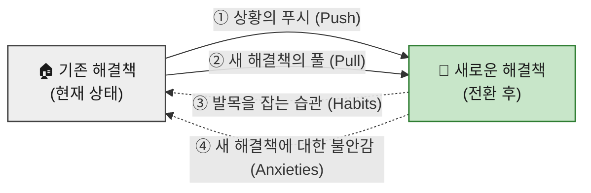

# 07 — 고객 상황을 객관화하는 JTBD 분석 방법론

> 본 문서는 07 챕터에서 진행할 **JTBD(Jobs-To-Be-Done) 분석**의 **기준 프레임**입니다.
> 개별 분석 결과는 이 방법론을 그대로 적용해 별도 문서로 작성합니다.

**이 문서의 범위** — JTBD **인터뷰를 실제로 수행하기 위한 행동 방침**을 다룹니다. 준비·질문·경청의 세 국면에 대한 컨텍스트 추출본입니다.

**선행 문서** — 이 분석은 앞 챕터의 산출물을 **재료로** 씁니다.

| 문서 | 여기서 가져오는 것 |
|---|---|
| `05-personas/persona-02-spectrum.md` | 인터뷰 대상이 될 사용자 유형(핵심·확장·극단·비활성) |
| `06-opportunity-score/기회점수-분석-종합.md` (Ⅱ부) | Q1(혁신기회)으로 분류된 항목 — 방법론상 **JTBD 인터뷰 1순위 대상** |

---

## 1️⃣ 인터뷰 준비 및 구조

### ⏱️ 시간 배정

클래식한 **생성 연구(generative research)** 세션과 유사하게, 인터뷰 시간은 보통 **60분에서 90분**을 배정합니다.

> 이 기법에 익숙하지 않은 경우 **편안함을 느끼는 데 시간이 걸리기 때문**입니다.

### 🎯 고유한 참가자 모집 (Recruiting)

JTBD의 핵심은 **전환 행동(switching behavior)** 을 이해하는 것이므로, 특히 다음 세 그룹을 스크리닝하여 모집합니다.

| # | 모집 대상 | 무엇을 알 수 있나 |
|:-:|---|---|
| **①** | 최근에 우리 제품/서비스를 **사용하기 시작한** 사람들 | 우리에게로 **전환한** 이유 |
| **②** | 최근에 우리 제품/서비스 **사용을 중단한** 사람들 | 우리를 **떠난** 이유 |
| **③** | 우리 제품/서비스에 대해 **아직 들어본 적이 없는** 사람들 | 경쟁 제품으로 이끄는 요소 |

> 이들을 통해 사람들이 우리 제품/서비스로 **전환하거나 떠나는 이유**, 그리고 **경쟁 제품으로 이끄는 푸시/풀(Pushes/Pulls) 요소**를 이해하고자 합니다.

---

## 2️⃣ 심층 목표 파헤치기 (Focus on Deeper Goals)

| 원칙 | 내용 |
|---|---|
| **표면적 답변 피하기** | 단순히 사용자에게 **왜 다른 제품으로 전환했는지 직설적으로 묻는 것을 피해야** 합니다. 그렇게 하면 행동을 유도하는 **더 깊은 목표에 도달할 수 없습니다.** |
| **'전환 사건'에 집중** | 인터뷰이는 대화의 방향을 이끌도록 **허용하되**, 연구자는 참가자가 변화를 일으키게 된 **'전환 사건(switch event)'** 에 초점을 맞춰야 합니다. |
| **스토리텔링 유도** | 깊은 목표와 행동을 이해하려면 사용자가 무언가를 **하기로 결정한 배경에 대한 이야기**를 하도록 유도해야 합니다. 생성 연구와 마찬가지로 질문을 심층적으로 파고들되, **특정 방식으로** 진행해야 합니다. |

---

## 3️⃣ 핵심 질문 전략 (Interview Scripting)

연구자는 다음과 같은 주요 질문을 포함하여 대화의 맥락을 잡을 수 있으며, 이는 **대안 및 맥락 파악**에 중점을 둡니다.

### 🔍 대안 및 맥락 파악 질문

- 제품/서비스를 시도하기 **전에 다른 어떤 해결책을 고려**했습니까?
- 이러한 해결책을 고려할 때 **무엇을 찾고 있었습니까**?
- **무엇을 해결하려고** 했습니까?
- 이 제품/서비스들을 **어떻게 찾아보았는지** 이야기해 주십시오.
- 실제로 **사용해 본 다른 해결책**은 무엇입니까?
- 시도하거나 사용해 본 다른 해결책 중에서 **좋았던 점과 싫었던 점**은 무엇입니까?
- 이 제품/서비스를 **사용할 수 없었다면 대신 무엇을 했을** 것입니까?
- **주변 사람들이** 시도하거나 사용해 본 해결책은 무엇입니까?
- **과거와 비교했을 때** 지금 무엇을 하고 있습니까?

### 💓 맥락 및 감정적 질문

> 경쟁사 및 잠재적인 전환 행동을 파악한 **후에** 더 감정적인 질문을 통해 깊이 파고들기 시작합니다.

- 문제를 해결할 무언가가 필요하다는 것을 **언제 처음 깨달았습니까**?
- 고려 중인 선택에 대해 **다른 사람과 이야기했습니까**? 대화는 어땠습니까?
- 이 제품/서비스를 사용하면 **어떤 모습일지 상상**했습니까?
- 제품/서비스로부터 **무엇을 원했습니까**?
- 이 제품/서비스를 구매/사용하는 것에 대해 **불안감(anxiety)이 있었습니까**?
- 사용하는 것에 대해 **걱정하게 만드는 요소**가 있었습니까?

### 🧠 스토리텔링을 위한 연상 유도

> 사용자의 기억은 **사람, 장소, 냄새 또는 소리와의 연상**을 통해 회상되는 경우가 많습니다.

- 그때는 **하루 중 몇 시**였습니까?
- **집**에 있었습니까, **직장**에 있었습니까?
- 뒤에서 **TV가 켜져** 있었습니까?
- **당신은 어떤 상태**였습니까 *(who they were)*?

---

## 4️⃣ 경청해야 할 4가지 전환 동인 (Listening for the Switch)

인터뷰를 진행하는 동안, **전환을 유도한 동기나 페인 포인트(pain points)** 에 귀 기울여야 합니다.

| # | 동인 | 무엇을 듣는가 |
|:-:|---|---|
| **1** | **상황의 푸시 (Push)** | 특정 상황 중 **무엇이 그들을 새로운 해결책을 찾도록 이끌었습니까**? |
| **2** | **새로운 해결책의 풀 (Pull)** | 새로운 해결책의 **어떤 점이 그것을 시도하고 싶게 만들었습니까**? |
| **3** | **발목을 잡는 습관 (Habits)** | 새로운 해결책을 시도하는 것을 **방해할 수 있는 그들의 습관**은 무엇이었습니까? |
| **4** | **새로운 해결책에 대한 불안감 (Anxieties)** | 새로운 해결책을 시도하거나 사용하는 것에 대해 **어떤 불안감을 느꼈습니까**? |

> **①·②는 전환을 만드는 힘**이고, **③·④는 전환을 막는 힘**입니다. 네 가지를 모두 듣지 않으면 *"왜 안 바꾸는가"* 를 설명할 수 없습니다.

---

## 5️⃣ 인터뷰 결과 보고서 작성법

> 인터뷰를 **어떻게 수행하는가**는 위 1️⃣~4️⃣가, **결과를 어떤 형식으로 남기는가**는 아래가 다룬다.

> 본 문서는 07 챕터 **JTBD 인터뷰의 결과를 정리하는** 방법론입니다.
> 개별 보고서는 이 서식을 그대로 적용해 별도 문서로 작성합니다.

**이 문서의 범위** — 인터뷰를 **어떻게 수행하는가**는 `methodology.md`가 다루고, 본 문서는 그 결과를 **어떤 형식으로 남기는가**를 다룹니다.

| 관련 문서 | 다루는 범위 |
|---|---|
| `07-jtbd/methodology.md` | 인터뷰 **수행** — 준비·질문 전략·4가지 전환 동인 |
| **본 문서 5️⃣** | 인터뷰 **정리** — 결과 필드·요약 카드·Outcome 목록표 |
| `07-jtbd/JTBD-분석-종합.md` Ⅰ부 | 대상 9명 / 10건과 우선순위 |
| `07-jtbd/JTBD-분석-종합.md` Ⅱ부 | 공통 문항 + 페르소나별 문항 |

---

### 1️⃣ JTBD 인터뷰 실행에서 얻을 수 있는 결과의 목록

인터뷰 1회에서 아래 **10개 필드**를 채웁니다.

| 필드 | 작성 가이드 |
|---|---|
| **Persona / Segment** | 코어·확장·극단·비활성 중 분류 + 짧은 설명(직무/맥락) |
| **Situation (When …)** | 전환을 유발한 **"상황적 맥락"** 한 문장 |
| **Job Statement (… I want to …)** | 사용자가 **"해결하려는 핵심 일(진보)"** 한 문장 |
| **Desired Outcome (… so I can …)** | **달성하고 싶은 결과(측정 가능 표현)** |
| **4 Forces** | **Push**(현상 불만), **Pull**(새 솔루션 매력), **Habit**(관성), **Anxiety**(불안) 각 1–2줄 |
| **Current Solutions / Workarounds** | 현재 쓰는 대체수단(툴/사람/엑셀/수기 등) |
| **Switch Triggers / Barriers** | 채택/이탈을 유발한 **계기**와 **장애요인** |
| **Evidence (Quotes / Data)** | 인터뷰 인용 1–2개 + 로그/지표/리뷰 근거 |
| **Priority (AOS / DOS)** | `AOS = Imp × (1 − Sat/5)` · `DOS = (Imp − Sat) × TAM(%)` |
| **Notes** | 실험 아이디어, 리스크, 추정 가설 |

---

### 2️⃣ JTBD 요약 카드

> **"실질적인 잠재고객 인터뷰"** 를 수행한 후 아래와 같은 항목 구성으로 **핵심 인사이트를 요약**합니다.

### 작성 예시

*(아래는 극단적으로 짧은 예시입니다)*

| 구분 | 내용 |
|---|---|
| **Persona / Segment** | **코어** — 초기 단계 **`B2B SaaS 비즈니스`의 운영 매니저** (5~20명 조직) |
| **Situation** | **월말 경영회의를 48시간 앞둔 상황** |
| **Job Statement** | **지표를 한 번에 모아 경영진용 리포트를 신뢰성 있게 제출하고자 함** |
| **Desired Outcome** | **에러 0건, 취합 시간 4시간 → 30분 단축, 승인 1회 통과** |
| **4 Forces** | **Push:** 수작업 취합 스트레스 **Pull:** 자동 수집·요약에 대한 기대 **Habit:** 익숙한 스프레드시트 중심 업무 패턴 **Anxiety:** 새 툴 도입 시 권한/보안 이슈 |
| **Current Solutions** | **Google Sheet + 수동 CSV 업로드 + Slack 요청** |
| **Switch Triggers / Barriers** | **Trigger:** CFO의 *"오탈자 지적"* 이후 자동화 도구 탐색 시작 **Barrier:** 보안·권한 관리 이슈로 도입 보류 |
| **Evidence (근거)** | *"전표가 늦게 들어와 엑셀을 다시 합쳐요."* 지난 3개월 평균 취합시간 **5.6시간** |
| **Priority (AOS / DOS)** | **AOS = 3.0** · **DOS = 2.4** (Importance=5, Satisfaction=2, TAM=0.8) |
| **Notes (추가 메모)** | **MVP:** 3소스 연결 · 자동 요약 · PDF 내보내기 중심 SSO 통합 필수 |

---

### 3️⃣ 인터뷰 결과 → Outcome 목록 표

> **JTBD 인터뷰 결과, 내가 제공할 수 있는 솔루션의 고객경험 향상 수준에 대한 가상의 목록표.**

| Outcome (고객이 원하는 결과) | Importance (1–5) | Satisfaction (1–5) | **AOS** | TAM(%) | **DOS** | 증거 (인용/로그) |
|---|:-:|:-:|:-:|:-:|:-:|---|
| 취합 시간 단축(4h→30m) | 5 | 2 | **3.0** | 0.8 | **2.4** | *"밤샘 취합, 매달 반복"* |
| 에러 0건 | 5 | 3 | 2.0 | 0.5 | 1.0 | *"오탈자 한번 나면 재작업"* |
| 승인 1회 통과 | 4 | 3 | 1.6 | 0.6 | 0.6 | 승인 1.8회 평균 |

---

> ### 📌 본 프로젝트에 적용할 때 — 용어 하나를 맞춰야 합니다
>
> DOS의 세 번째 항이 본 문서에서는 **`TAM(%)`**, 06 챕터에서는 **`Market Relevance`**로 불립니다. **같은 자리에 들어가는 값**이지만 본 프로젝트가 실제로 계산한 방식은 아래와 같습니다.
>
> | | 본 문서 표기 | 06 챕터에서 실제로 쓴 값 |
> |---|---|---|
> | 이름 | `TAM(%)` | `Market Relevance` |
> | 분자 | — | 해당 Pain을 겪는 **세그먼트의 도달 가능 인원** |
> | 분모 | — | **SOM 모집단 232만 명** (채택 기준안) |
>
> 즉 06 챕터는 TAM이 아니라 **SOM을 분모로** 썼습니다. SAM(800만) 기준도 함께 계산했으나, 04 문서가 배제 결정을 내린 세그먼트를 1위로 올리는 문제가 있어 SOM 기준을 채택했습니다.
>
> **보고서에 값을 옮길 때는 어느 모수로 계산한 값인지 반드시 병기하십시오.** 두 기준의 DOS는 절대값이 3~4배 차이 납니다.
