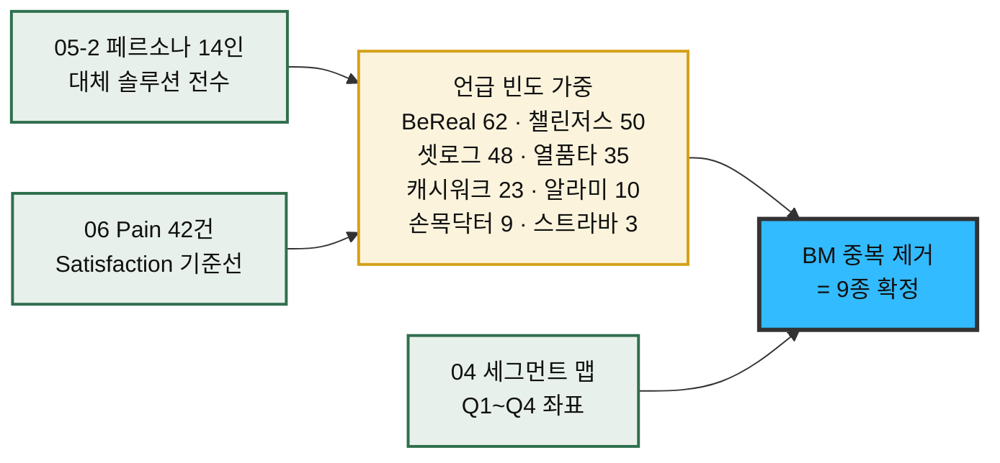
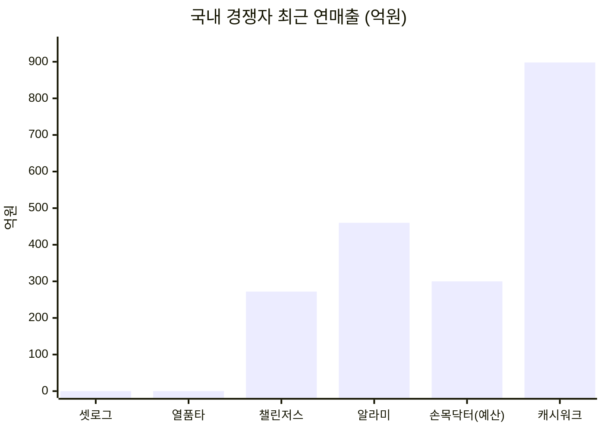

# 08-1. 경쟁 대상 재정의 — 경쟁 서비스 9종 브리핑 · 가치 선언문 도출

> 작성일: 2026-08-13 / 지리적 범위: 대한민국(+글로벌 벤치마크) / 통화: KRW·USD·EUR
> **문서 위치:** 08 고객가치선언문 챕터의 **입력 문서**다. README가 07 JTBD 챕터의 산출물로 규정한 **「경쟁 대상 재정의」**를 수행하고, 그 결과를 자사 가치 선언문 도출(`08-2`)의 재료로 넘긴다.
> **관점:** 기업 가치 선언(Value Declaration)과 브랜딩 리서치. *"이 회사는 무엇을 팔아서 돈을 버는가"* 와 *"이 회사는 무엇을 믿는다고 선언하는가"* 를 함께 본다.

| 선행 문서 | 이 문서가 가져다 쓴 것 |
|---|---|
| `04-tam-sam-som/시장분석 종합보고서 (TAM-SAM-SOM).md` | Market Segment Map 4사분면 · TAM/SAM/SOM · 수익 구조 R1·R2 |
| `05-personas/persona-02-spectrum.md` | 14인 페르소나의 **대체 솔루션** 목록 = 경쟁자 1차 후보 풀 |
| `05-personas/customer-journey-map.md` | S0~S6 7단계 여정 — 경쟁자가 어느 단계에서 우리를 대체하는가 |
| `06-opportunity-score/pain-point-inventory.md` | Pain 42건 · Goal 4분류(G1~G4) |
| `06-opportunity-score/aos-scoring.md` · `dos-scoring.md` · `aos-dos-matrix.md` | AOS/DOS 점수 — 경쟁자별 위협 지점의 우선순위 |
| `07-jtbd/interview-targets.md` · `mock-interviews/` | 9인 인터뷰 대상 — 각자가 **실제로 고용 중인** 서비스 |

---

## 0. 30초 요약

**경쟁자를 "같은 카테고리 앱"이 아니라 "같은 Job에 고용되는 모든 것"으로 정의했다.** JTBD 관점에서 경쟁자는 제품 분류가 아니라 **고객이 그 일을 시키려고 지금 쓰고 있는 것**이다.

| 경쟁 축 | 서비스 | 우리가 뺏기는 것 |
|---|---|---|
| **① 돈을 거는 계약 구조** | 챌린저스 · stickK | 수익 모델 그 자체 (R2 참가비 take) |
| **② 그룹 정시 숏폼 인증 포맷** | 셋로그 · BeReal | 획득 채널과 사용자 시간 |
| **③ 목표 그룹 버티컬** | 열품타 | F2 스터디 팟 세그먼트 69만 명 |
| **④ 보상 수용층 선점** | 캐시워크 | SAM 800만의 전제인 "보상 수용률 55%" |
| **⑤ 조직·공공 재원** | 손목닥터9988 | 예치 관문을 우회하는 3층 수익 구조 |
| **⑥ 개인 자기구속·기록** | 알라미 · 스트라바 | 무료 개인 트랙(A-04 송재현)과 R1 구독 |

**이 문서의 결론 한 줄** — 9개 경쟁자 중 **어느 하나도 "그룹이 함께 목표를 계약하고, 짧은 영상으로 서로에게 인증하고, 달성률로 정산받는다"는 세 요소를 동시에 갖고 있지 않다.** 다만 세 요소를 **각각 하나씩** 가진 사업자가 모두 우리보다 크고, 그중 가장 가까웠던 사업자(챌린저스)는 그 자리를 **스스로 떠났다.**

**표기 규약** — 본 저장소 규약을 승계한다. `[실측]` 1차·준1차 출처 확인 / `[추정]` 명시된 가정을 거친 계산 / `[러프]` 유사 대입, 오차 ±50% 이상 가능.

---

## 1. 경쟁자를 어떻게 골랐는가

### 1.1 도출 경로 — 페르소나의 "대체 솔루션"에서 역산

경쟁자를 시장 카테고리에서 하향식으로 뽑지 않았다. **14인 페르소나가 문서에 적어 둔 `대체 솔루션` 항목**을 전수 수집하고, 저장소 전체에서 서비스명이 몇 번 언급됐는지로 가중치를 준 뒤, **비즈니스 모델이 서로 다른 것만** 남겼다.

> **왜 이 방식인가** — `06-2 AOS 채점`은 Satisfaction을 *"기존 대체 솔루션이 그 Goal을 얼마나 이뤄주는가"*로 정의했다. 즉 **AOS 점수 42개는 전부 이 경쟁자들을 기준선으로 매겨진 값**이다. 경쟁자 목록이 바뀌면 AOS 순위 전체가 흔들린다. 따라서 경쟁자는 임의로 고를 대상이 아니라 **이미 채점에 쓰인 기준선을 명시화하는 작업**이다.

### 1.2 최종 9종과 대응 페르소나

| # | 서비스 | 경쟁 축 | 위협받는 페르소나 | 관련 Pain (AOS) |
|:-:|---|---|---|---|
| **A** | **챌린저스** (화이트큐브) | 돈을 거는 계약 | 🔵 C-04 이준호 · C-02 김도현 | `11` 그룹 없이 도착 **4.0** · `04` 참가비 결정 불가 **4.0** |
| **B** | **셋로그** (뉴챗) | 그룹 정시 숏폼 포맷 | 🟢 A-02 윤채원 | `19` 관계 화폐화 2.0 · `20` 목표 순간 포착 2.4 |
| **C** | **열품타** (팔로) | 스터디 버티컬 | 🔵 C-03 박서연 | `07` 미달이 가려짐 **3.0** · `09` 정량 목표 불가 2.4 |
| **D** | **캐시워크** (넛지헬스케어) | 보상 수용층 선점 | 🟢 A-03 홍다인 | `22` 예치 문턱 **3.0** |
| **E** | **손목닥터9988** (서울시) | 조직·공공 재원 | 🟢 A-05 여민석 | `29` 보고용 숫자 없음 **4.0** |
| **F** | **알라미** (딜라이트룸) | 개인 자기구속 | 🔵 C-04 이준호 | `12` 압력 약화·담합 2.4 |
| **G** | **스트라바** (Strava) | 개인 기록 축적 + 구독 | 🟢 A-04 송재현 | `26` 촬영·편집 마찰 **3.0** · `25` 들어갈 자리 없음 2.0 |
| **H** | **stickK** | 커밋먼트 계약 원형 | 🔵 C-05 최민지 · 🔴 E-01 강수빈 | `13` 5주차 붕괴 **4.0** · `33` 손실 순환 **4.0** |
| **I** | **BeReal** (Voodoo) | 강제 트리거 포맷 | ⚪ N-01 서지훈 | `37` 카테고리 낙인 0.0 · `39` 통제 상실 1.0 |

> **⚠️ I(BeReal)만 성격이 다르다.** 세그먼트 맵이 **Q4 회피 좌표**로 규정한 대상이라, 뺏기지 않으려는 경쟁자가 아니라 **닮지 않으려는 반면교사**다. 그럼에도 표에 넣은 이유는 § 5-I에서 다룬다.

---

## 2. 경쟁 서비스 브리핑 표 — 비즈니스 규모 · 핵심 BM · 사업 전략

> **읽는 법** — 규모 수치는 **가장 최근 확인 가능한 회계연도** 기준이다. 출처 열의 링크는 전부 실제 접근 가능 여부를 확인했다. 국내 비상장사는 공시 기준(별도/연결)에 따라 수치가 갈리므로 **차이가 나는 항목은 두 값을 모두 적고 차이를 명기**했다.

| # | 서비스 (운영사) | 비즈니스 규모 | 핵심 비즈니스 모델 | 사업 전략의 특징 | 근거 출처 (검증 링크) |
|:-:|---|---|---|---|---|
| **A** | **챌린저스** 화이트큐브 *(2018 출시)* | **2025 매출 272억원** `[실측]` 2024 147~150억 → **+85%** 2023 첫 연간 흑자 누적 사용자 **171만**(2024.3) → **200만** **습관 시절 누적 거래액 5,000억원** 제휴 브랜드 **1,015개** · 마케팅 집행 **약 1만 건**(2025) 일본: 10개월 누적 **26억원** · 가입자 6.7만 | **① 구(舊) BM** — 참가비 예치 → 사진 인증 → 달성률 환급 + 미달성자 몰수금 상금화. 플랫폼은 거래액에서 수수료 **② 현(現) BM** — 뷰티·생활용품 최대 90% 할인 판매 후, **실사용·영수증 인증 미션 수행 시 구매액 80%+ 캐시백.** 실질 수익원은 **브랜드사의 성과연동형 광고비** | **"인증하면 돈이 돌아온다"는 메커니즘은 유지한 채 대상만 행동 → 소비로 갈아탔다.** 2023년 초 뷰티 커머스 피벗. 현재 앱 명칭이 iOS *"챌린저스 — 뷰티 득템 앱"*, Android *"챌린저스 — 돈이 돌아오는 쇼핑 앱"*으로, **습관 형성은 브랜드 전면에서 사실상 내려갔다.** 2040 여성 자기관리층을 **랭킹 알고리즘을 움직이는 마이크로 트렌드 생성 집단**으로 재정의해 브랜드사에 판매 | [플래텀 '2025 매출 272억'](https://platum.kr/archives/278211) · [유니콘팩토리 '연매출 272억'](https://www.unicornfactory.co.kr/article/2025122910033793049) · [플래텀 '2024 매출 150억'](https://platum.kr/archives/249818) · [스타트업엔 '뷰티 피벗 2.5배'](https://www.startupn.kr/news/articleView.html?idxno=50192) · [이데일리 '습관보다 소비가 강했다'](https://edaily.co.kr/News/Read?mediaCodeNo=257&newsId=04457526645480408) · [Google Play 앱 등재](https://play.google.com/store/apps/details?id=kr.co.whitecube.chlngers) · [App Store 앱 등재](https://apps.apple.com/kr/app/id1438855824) · [THE VC 기업정보](https://thevc.kr/whitecube) |
| **B** | **셋로그 (setlog)** 뉴챗(New Chat) *(2025 말 iOS 출시)* | **MAU 778만 명** (2026.5) `[실측]` **광고비 0원**으로 달성 10~30대 **91.2%** (20대 45.1 / 10대 이하 23.6 / 30대 22.5) 10·20대 중 여성 **76.2%** 2026.4 안드로이드 확장 직후 앱스토어 1위 매출·수익 **공개된 바 없음** | **현재 수익 모델 없음(미공개).** 1~3시간 주기 알림 → 2~4초 영상 촬영 → 하루치를 **자동 분할 화면 브이로그로 합성**. 무료·무광고에 가까운 상태로 사용자만 축적 중 | **획득을 완전히 유기적 확산에 걸었다.** 마케팅비 0원으로 국내 10~39세 인구(약 1,450만)의 **53.7%에 도달**. 전략의 핵심은 **편집 노동의 제거** — "찍는다"와 "올린다" 사이의 모든 마찰을 자동 합성으로 없앴다. 서울·미국 사무소 병행 운영으로 처음부터 글로벌 확장을 전제. **⚠️ 최대 리스크가 수익 모델 부재**이며, 이는 MAU 4,000만에서 종료된 Zenly와 같은 좌표다 | [와이즈앱 'MAU 778만'](https://www.wiseapp.co.kr/insight/detail/1011/setlog-sns-app-mau-in-korea) · [뉴시스 '지난달 780만명'](https://www.newsis.com/view/NISX20260605_0003657349) · [한국일보 트렌드 2026](https://v.daum.net/v/20260625110202630) · [쿠키딜 '2세대 영상 앱' 분석](https://cookiedeal.io/blog/post/%EC%95%B1%EC%8A%A4%ED%86%A0%EC%96%B4-1%EC%9C%84-%EC%85%8B%EB%A1%9C%EA%B7%B8%EC%9D%98-%EC%9C%84%EB%A0%A5-%EB%8F%88%EA%B3%BC-%EC%82%AC%EB%9E%8C%EC%9D%B4-%EB%AA%B0%EB%A6%AC%EB%8A%94-2%EC%84%B8%EB%8C%80-%EC%98%81%EC%83%81-%EC%95%B1-%EB%A6%AC%EC%8A%A4%ED%8A%B8) · [THE VC 뉴챗 기업정보](https://thevc.kr/newchat) · [App Store 등재](https://apps.apple.com/kr/app/setlog/id6587576438) |
| **C** | **열품타** (열정 품은 타이머) 주식회사 팔로(Pallo) *(2018 출시 · 법인 2020.11)* | **MAU 210만 명** `[러프, 2차 출처]` 누적 가입자 **1,200만 명** 스터디 그룹 **100만 개 이상** 교육 카테고리 압도적 1위 — 경쟁 B사 90만 / C사 50만 / D사 17만 **마케팅 없이 100% 바이럴** 대표 백운천 · 소규모 조직 | **무료 앱 + 인앱 광고·인앱 구매.** `[러프]` 공부 시간 측정 타이머를 무료로 열고 수험생 트래픽을 축적. **구체적 매출 구성은 공개된 바 없으며**, 스토어 등재상 무료 배포 + 인앱 구매 구조가 확인된다 | **"시간을 잰다"는 단일 기능으로 버티컬을 독점했다.** 실시간 랭킹과 스터디 그룹으로 **상호 감시를 게임화**해, 도구를 그대로 리텐션 장치로 전환. 조직을 극도로 작게 유지하는 **고효율 저비용 구조** — 법인 설립 2020.11, 대표이자 앱 개발자가 동일인(백운천). **⚠️ 구조적 공백** — 측정하는 것이 *앉아 있던 시간*뿐이라 **목표 대비 진도**는 다루지 않는다. 이것이 박서연 Pain `07`(AOS 3.0)의 정확한 발생 지점 | [나무위키 '열정 품은 타이머'](https://namu.wiki/w/%EC%97%B4%EC%A0%95%20%ED%92%88%EC%9D%80%20%ED%83%80%EC%9D%B4%EB%A8%B8) · [혁신의숲 팔로 기업정보](https://www.innoforest.co.kr/company/CP00010666) · [App Store 등재(개발자 UnCheon Baek)](https://apps.apple.com/kr/app/%EC%97%B4%ED%92%88%ED%83%80/id1441909643) · [Google Play 등재](https://play.google.com/store/apps/details?id=com.pallo.passiontimerscoped) · [로켓펀치 팔로](https://www.rocketpunch.com/companies/pallo) |
| **D** | **캐시워크** 넛지헬스케어 *(2017 출시)* | **2025 매출 898억원** (전년비 +2.2%) `[실측]` 영업이익 **72.5억원** (영업이익률 8.1%) 추이: 2022 613.1억 → 2023 792.3억 → 2024 878.9억 → 2025 898억 **⚠️ 2023년 "1,056억원(사상 최대)" 보도 병존** — 연결/별도 기준 차이로 보이며 본 표는 별도 시계열을 채택 MAU 600만(2020 실측) | **리워드 광고 + 커머스.** 걸음 수 100보당 1캐시 적립 → 적립 캐시를 기프티콘·상품 구매에 사용. 실제 수익은 **잠금화면·오퍼월 광고 노출과 제휴 커머스 마진**에서 발생 | **"이미 하고 있는 행동을 정산해 준다"**는 무마찰 진입이 핵심. 사용자는 새 습관을 만들 필요가 없고 **잃을 것도 없다.** 이 구조가 국내에 **보상형 수용 인구를 대량으로 학습**시켰다. 매출 규모는 크나 2024→2025 성장률이 +2.2%로 둔화, **적립형 모델의 성장 한계**를 시사. **⚠️ 우리에게 양날** — 보상 수용층을 만들어 준 은인이자, *"보상은 받는 것"*이라는 인식을 굳혀 **예치 전환의 심리적 문턱을 세운 장본인**(Pain `22`) | [뉴스1 '2023 매출 1056억 사상 최대'](https://www.news1.kr/industry/sb-founded/5347235) · [플래텀 '2023 연매출 1,000억'](https://platum.kr/archives/223980) · [사람인 재무정보(2025 매출 898억)](https://m.saramin.co.kr/job-search/company-info-view/finance?csn=M2ttVnFiU3hHVUp2SE5xZkZFQ01MQT09) · [THE VC 결제·고객 분석](https://thevc.kr/nudgehealthcare/consumer-transactions) · [이데일리 '캐시워크 성공 2막'](https://edaily.co.kr/News/Read?mediaCodeNo=257&newsId=01157846629243752) · [잡코리아 기업정보](https://www.jobkorea.co.kr/recruit/co_read/c/cashwalk) |
| **E** | **손목닥터9988** 서울특별시 *(2021 시작)* | **참여자 200만 명 돌파** (2025.3) `[실측]` 2024.6 100만 → 2025.3 200만 (9개월 만에 2배) **포인트 예산: 2021 약 15억(참여자 5만) → 2024 232억 → 2025 300억원 초과 전망** 2026년까지 누적 **303만 명 모집 목표** 서울 인구 940만 대비 참여율 **21.3%** | **공공 예산 기반 인센티브 사업 (수익 모델 없음).** 1일 8,000보 달성 시 200P(70세 이상 5,000보), **1P = 1원**, 연 최대 10만P. 서울페이 가맹 병원·약국·편의점에서 현금처럼 사용 | **재원이 사용자도 광고주도 아닌 "예산"이다.** 참여자는 **잃을 것이 전혀 없고 달성하면 받는다** — 제로섬이 아예 없는 구조. 스마트워치 없이 스마트폰만으로 참여 가능하게 열어 접근성 장벽을 제거하고 상시 모집으로 전환. **⚠️ 구조적 취약점이 공개적으로 지적됐다** — 시의회가 *"효과성 검증 없이 예산만 300억까지 확대"*를 문제 삼았고, 시는 포인트 상한을 17만 → 10만P로 하향. **"참여자 수는 늘었는데 건강이 좋아졌다는 증거가 없다"**는 것이 쟁점 | [서울 정책아카이브 공식 페이지](https://www.seoul.go.kr/policy/view.do?id=67) · [서울시 미디어허브 '참여자 200만 돌파'](https://mediahub.seoul.go.kr/archives/2010449) · [서울Pn '예산 300억 확대·효과성 검증 촉구'](https://www.seoul.co.kr/news/publicnews/local_govern/smc_movement/2024/11/20/20241120500062) · [세계일보(전남) 시의원 지적 상세](https://jeonnam.thesegye.com/news/view/1065575445682085) · [서울시 청년정책 상세](https://youth.seoul.go.kr/infoData/plcyInfo/view.do?plcyBizId=R2024041821927) |
| **F** | **알라미 (Alarmy)** 딜라이트룸 *(2012 출시)* | **2025 매출 460억원 · 영업이익 200억원** `[실측]` **영업이익률 40% 초과** 추이: 2023 230억 → 2024 337억 → 2025 460억 (3년 연속 성장) 글로벌 누적 다운로드 **1억 건** **MAU 700만 명** 애드테크 자회 사업 'DARO' 연 매출 100억 돌파 **외부 투자 유치 없이 달성** | **광고 + 구독 이원 구조.** 미션(수학 문제·사진 촬영·흔들기)을 완수해야 알람이 꺼지는 앱을 무료 배포하고, 광고 제거·고급 미션을 구독으로 판매. 여기에 **자체 애드테크(DARO)를 별도 수익원으로 분사 성장** | **"의지를 믿지 않는다"를 제품 기능으로 직역했다.** 사용자가 스스로 끄지 못하게 만드는 것이 곧 제품 가치. 기상이라는 **매일 반드시 발생하는 단일 순간**을 점유해 리텐션을 구조적으로 확보. 투자 없이 영업이익률 40%를 낸 뒤, **자사 트래픽 운영 노하우를 애드테크 상품으로 외부 판매**하는 2차 수익화에 성공. **⚠️ 우리와의 접점** — 이준호(C-04)가 챌린저스 공백을 메우려 쓰는 대체재가 정확히 이 계열이다. 다만 **혼자 하는 강제력**이라 그룹 압력은 없다 | [플래텀 '2025 매출 460억·영업이익 200억'](https://platum.kr/archives/279441) · [뉴스와이어 공식 보도자료](https://www.newswire.co.kr/newsRead.php?no=1026731) · [유니콘팩토리 '역대 최대 실적'](https://www.unicornfactory.co.kr/article/2026011309500633471) · [모비인사이드 '영업이익률 40%가 의미하는 것'](https://www.mobiinside.co.kr/2026/01/13/delightroom-2025-performance/) · [벤처스퀘어 실적 보도](https://www.venturesquare.net/1032467) · [AB180 딜라이트룸 인터뷰](https://blog.ab180.co/posts/delightroom-interview) |
| **G** | **스트라바 (Strava)** 미국 *(2009 출시)* | **2025 매출 약 $415M** (전년비 +18.5%) `[실측]` *(일부 추정치는 $500M까지 제시 — 하한 채택)* 등록 사용자 **1.8억 명**(2025) → **1.95억 명 이상**(2026.4), 185개국 월 300만 명 순증 2025년 기록된 활동 **40억 건** 2025.4 러닝 코칭 앱 **Runna 인수**, 2025.5 사이클링 앱 The Breakaway 인수 | **구독(Subscription) 단일 축.** 기록·소셜 피드는 무료, 세그먼트 순위·상세 분석·목표 관리는 유료. Runna 인수 후 **Strava + Runna 번들 $149.99/년** 출시 | **"기록이 곧 정체성"**이라는 축적 자산을 리텐션 해자로 삼는다. 오래 쓸수록 떠나기 어려워지는 구조. 클럽·챌린지·세그먼트 리더보드로 **금전 없이 사회적 압력만으로** 지속을 만든다 — 우리와 정반대의 해법. 2025년 인수 2건으로 *"기록 플랫폼"*에서 *"훈련 코칭 플랫폼"*으로 가치 축을 확장, **구독 ARPU 인상 근거를 스스로 만들었다.** **⚠️ 우리와의 접점** — A-04 송재현의 *"기간 없는 꾸준함을 누적하고 싶다"*를 이미 정면으로 겨냥한다 | [Business of Apps — Strava 통계](https://www.businessofapps.com/data/strava-statistics/) · [Sacra — Strava 매출·성장률](https://sacra.com/c/strava/) · [Strava 공식 보도자료 — Runna 인수](https://press.strava.com/articles/strava-to-acquire-runna-a-leading-running-training-app) · [Runna 공식 발표](https://www.runna.com/strava-acquires-runna) · [Contrary Research — 사업 구조 분석](https://research.contrary.com/company/strava) · [Forbes — 인수의 구독자 영향](https://www.forbes.com/sites/andrewwilliams/2025/04/17/strava-acquires-runna-what-it-means-for-subscribers/) |
| **H** | **stickK** 미국 *(2008 출시)* | 누적 커밋먼트 계약 **465,000건 이상** `[실측]` 누적 **걸린 금액 $42M 이상** 사용자 **60만 명 이상** 예일대 행동경제학자들이 설립 *소비자 웹사이트는 무료 — 기업 웰니스 B2B가 유료 축* | **행동경제학 이론의 제품화 + B2B 웰니스.** 사용자가 목표·기한·판돈·**심판(Referee)**·응원자를 지정해 계약을 맺고, 실패 시 판돈이 자선단체 또는 **"안티-채리티"(자신이 싫어하는 단체)**로 이전. 소비자용은 무료이고 기업 대상 프로그램이 유료 | **"돈을 걸면 목표 달성률이 오른다"를 세계 최초로 상품화한 원형.** 우리 R2 참가비 모델의 **이론적 조상**이다. 결정적 설계 차이 — **몰수금이 다른 참가자에게 가지 않는다.** 자선단체로 흘려보내 **제로섬을 구조적으로 회피**했다. 조은비(N-02)의 *"그럼 못 한 사람 돈을 내가 먹는 거잖아요"*가 여기서는 성립하지 않는다. 제3자 심판(Referee)을 두어 **인증 판정 책임을 플랫폼 밖으로 이전** — 한지우(A-01)의 *"판정자 자리에서 내려오고 싶다"*에 대한 다른 해답 | [stickK 공식 소개(About)](https://www.stickk.com/aboutus) · [stickK 공식 사이트](https://www.stickk.com/) · [stickK 작동 방식(Help Center)](https://stickk.zendesk.com/hc/en-us/articles/206833157-How-it-Works) · [stickK FAQ — 재정적 커밋먼트](https://www.stickk.com/faq/financial/Commitment+Contracts) · [Wikipedia — StickK](https://en.wikipedia.org/wiki/StickK) · [stickK LinkedIn 기업정보](https://www.linkedin.com/company/stickk-com-llc) |
| **I** | **BeReal** Voodoo (프랑스) *(2020 출시 · 2024 피인수)* | **2025 매출 €30M** `[실측]` — 수익화 1년차 MAU 4,000만 명 이상 **⚠️ DAU 2,000만 → 1,040만 (-48%)** 월 다운로드 1,200만 → 330만 (**-72.5%**) 일일 사용 시간 **5분 미만** 휴면 사용자 재참여율 **19%** 연 ARPU 약 1,180원 `[추정]` | **순수 광고.** 하루 1회 무작위 시각 알림 → 2분 내 전·후면 동시 촬영 → 친구에게만 공개. Voodoo 인수 후 광고 수익화 착수 | **강제 트리거를 정체성으로 삼았고, 그것 때문에 무너졌다.** *"꾸미지 않은 진짜"*를 만들려고 **촬영 시각의 소유권을 플랫폼이 쥐었는데**, 이것이 사용자에게 통제 상실감으로 돌아와 이탈을 낳았다. 늦은 게시 허용으로 강제성을 완화하자 이번엔 **재밌는 순간까지 기다렸다 올려 '진정성'이라는 전제 자체가 붕괴**했다. **⚠️ 우리에게 반면교사** — 세그먼트 맵이 이 좌표를 **Q4 진입 금지**로 규정한 근거가 이 수치들이다 | [Voodoo 공식 — 2025 성과(BeReal €30M)](https://voodoo.io/news/2025-a-year-of-growth-and-transformation-for-voodoo) · [Amra & Elma — BeReal 통계 2026](https://www.amraandelma.com/bereal-marketing-statistics/) · [arXiv 2408.02883 — BeReal 진정성 설계 연구](https://arxiv.org/html/2408.02883v1) · [Mountain Scholar — 대학생 심층 인터뷰](https://mountainscholar.org/bitstreams/54e390f6-918f-40f2-95e7-b6dac5a32069/download) |

### 2.1 규모 한눈에 비교

> **⚠️ 이 차트를 오해하지 말 것.** 셋로그와 열품타의 0은 *매출이 없다*는 뜻이 아니라 **공개된 매출 수치가 없다**는 뜻이다(셋로그는 수익 모델 미공개, 열품타는 비공개 소규모 법인). 손목닥터9988은 매출이 아니라 **집행 예산**이므로 성격이 다르다 — 같은 축에 놓은 것은 *"이 시장에 흐르는 돈의 자릿수"*를 보기 위한 것이지 사업 성과 비교가 아니다.

---

## 3. 기업별 핵심 가치와 주요 사업활동

> 이 섹션은 **"이 회사가 무엇을 가장 중요하게 여기는가"를 말이 아니라 행동에서 읽는다.** 각 항목은 ① 핵심 가치 ② 그 가치가 드러나는 구체적 사업활동 ③ 우리 프로젝트에 주는 함의 순으로 구성했다.

---

### A. 챌린저스 — "행동에 돈을 걸게 하는 기술"의 이전

**핵심 가치 · 지속되는 행동은 의지가 아니라 손실 회피에서 나온다.**

**주요 사업활동**

| 시기 | 활동 | 무엇을 증명했나 |
|---|---|---|
| 2018~2022 | 참가비 예치형 습관 챌린지 운영 | **누적 거래액 5,000억원** — 목표에 돈을 거는 WTP가 국내에 실재한다는 사실 |
| 2023 초 | **뷰티 커머스로 피벗** | 같은 사용자에게 **소비 인증**이 행동 인증보다 훨씬 높은 단가로 팔린다 |
| 2023 | 첫 연간 흑자 달성 | 피벗이 재무적으로 옳았다 |
| 2024 | 매출 150억원 (전년비 2.5배) | 커머스 모델의 스케일 확인 |
| 2025 | **매출 272억원 (+85%)** · 제휴 브랜드 1,015개 · 마케팅 집행 약 1만 건 | 브랜드사에게 **성과연동형 광고 매체**로 자리매김 |
| 2025 | 일본 진출 10개월 누적 매출 26억원 · 가입자 6.7만 | 메커니즘의 국가 이식 가능성 |

**가장 중요한 관찰** — 챌린저스는 **핵심 메커니즘을 버리지 않았다.** *"돈을 걸고 → 인증하고 → 달성하면 돌려받는다"*는 루프는 그대로다. 바뀐 것은 **인증의 대상**뿐이다. 운동 인증이 화장품 실사용 인증으로 바뀌었고, 그러자 재원이 **사용자의 몰수금(제로섬)에서 브랜드사의 광고 예산(포지티브섬)으로** 옮겨갔다.

> **우리에게 주는 함의 — 이것이 이 문서에서 가장 값비싼 정보다.**
> 저장소는 챌린저스의 피벗을 *"5,000억이 증명한 WTP가 회수되지 않은 채 남았다"*는 **시장 공백**으로 읽었다. 그 독법은 유효하다. 다만 반대편 독법도 함께 봐야 한다 — **국내에서 이 메커니즘을 가장 오래 운영한 팀이, 흑자를 낸 뒤에, 제로섬 재원을 스스로 버렸다.** 그들이 무엇을 보고 그렇게 했는지는 우리 R2(참가비 take 12%, 약 60억원)의 타당성에 직결되는 질문이다. `06` 인벤토리가 `02`·`19`·`33`·`40`을 **"제로섬 재원" 묶음 4건**으로 분리해 둔 것과 정확히 같은 지점을 가리킨다.

---

### B. 셋로그 — "꾸미지 않아도 괜찮다"를 편집 노동의 제거로 구현

**핵심 가치 · 기록의 진정성은 강요가 아니라 마찰 제거에서 나온다.**

**주요 사업활동**

- **자동 합성 브이로그** — 1~3시간마다 2~4초 영상을 찍으면 하루 끝에 분할 화면 영상 일기 한 편이 **자동으로** 만들어진다. 사용자는 편집을 한 번도 하지 않는다.
- **주기 선택권 부여** — 알림 주기를 매시간·3시간·끔 중에서 고를 수 있다. BeReal의 완전 무작위와 대비되는 **부분적 통제권 이양**.
- **광고비 0원 확산** — 2025년 말 iOS 출시, 2026년 4월 안드로이드 확장 직후 앱스토어 1위. **MAU 778만** 도달까지 유료 마케팅을 집행하지 않았다.
- **인구 구성의 극단적 편중** — 10~30대 91.2%, 10·20대 이용자 중 여성 76.2%. 특정 코호트를 정확히 관통했다.
- **글로벌 병행 구조** — 서울과 미국에 사무소를 두고 출발.

> **우리에게 주는 함의** — 셋로그는 우리의 **경쟁자이자 획득 채널**이라는 이중 지위에 있다. 세그먼트 맵은 셋로그 사용자층(C2 데일리 크루 428만)을 **Q3 → Q1 좌표 이동 대상**으로 설계했고, 그중 143만을 전환 가능분으로 잡았다. 그런데 이 관계는 **셋로그가 수익화를 시작하는 순간 성격이 바뀐다.** 현재 셋로그의 최대 리스크(수익 모델 부재)가 해소되는 방향이 만약 *"목표·챌린지 기능 추가"*라면, 우리의 획득 채널이 그날로 정면 경쟁자가 된다. 그리고 그들은 이미 **778만 명을 갖고 있다.**

---

### C. 열품타 — "혼자 하는 공부를 남들 앞에서 하게 만든다"

**핵심 가치 · 집중은 측정되고 비교될 때 유지된다.**

**주요 사업활동**

- **시간 측정의 도구화** — 공부 시간을 재는 단일 기능을 무료로 열어 수험생 트래픽을 확보. 누적 가입자 1,200만 명.
- **실시간 랭킹과 스터디 그룹** — **100만 개 이상의 스터디 그룹**. 같은 목표를 가진 사람들이 서로의 공부 화면을 실시간으로 확인한다. 금전 없이 **상호 감시만으로** 지속을 만든다.
- **100% 바이럴 획득** — 마케팅 집행 없이 카테고리 1위(경쟁 2위 90만 대비 2.3배).
- **극소 조직 운영** — 2020년 11월 설립 법인(대표 백운천), 소수 인원으로 MAU 210만 규모를 운영. 앱스토어 등재 개발자명이 대표 본인과 동일하다.
- **⚠️ 수익 구조는 확인되지 않았다** — 무료 배포 + 인앱 구매까지가 스토어에서 확인 가능한 전부이며, **매출·광고 매출 구성은 공개된 자료가 없다.** 본 문서가 이 회사를 "고효율 저비용"으로 서술한 것은 조직 규모와 마케팅비 0원이라는 두 사실에서 나온 추론이지 재무 확인이 아니다.

> **우리에게 주는 함의 — 그리고 이 회사가 못 하는 것.**
> 열품타는 **"얼마나 앉아 있었나"**를 측정한다. 박서연(C-03)이 아픈 지점은 정확히 그 다음이다 — *"오늘 목표한 데까지 갔나"*는 아무도 재주지 않는다. `06` 인벤토리 Pain `07`(**AOS 3.0 · 혁신기회**)이 *"인증은 통과인데 목표는 미달이라, 앱이 오히려 미달을 가린다"*로 적시한 것이 이것이다. 즉 **열품타는 F2 세그먼트를 점유하고 있지만 그 세그먼트의 상위 Goal은 해결하지 못한 상태**다. 다만 이 공백을 파고들려면 우리가 **"진도"를 계약 가능한 형태로 표현**할 수 있어야 하는데, 이는 Pain `09`(정량 목표 계약 불가)로 우리에게도 아직 미해결이다.

---

### D. 캐시워크 — "이미 한 일을 정산해 준다"

**핵심 가치 · 보상의 문턱은 낮을수록 넓게 퍼진다.**

**주요 사업활동**

- **무마찰 적립** — 걸음 수 100보당 1캐시. 사용자는 새 행동을 시작할 필요가 없다. **이미 걷고 있던 걸음을 정산받는다.**
- **잠금화면·오퍼월 광고** — 적립의 재원을 광고주가 댄다. 사용자에게는 **잃을 것이 구조적으로 없다.**
- **캐시 → 커머스 순환** — 적립 캐시를 기프티콘·상품 구매에 쓰게 해 광고 매출을 커머스 마진으로 한 번 더 회수.
- **재무 규모** — 2022년 613.1억 → 2025년 898억원으로 성장했으나, **2024→2025 성장률은 +2.2%로 급격히 둔화**. 영업이익률 8.1%.

> **우리에게 주는 함의 — 우리 SAM 추정 전체가 이 회사에 걸려 있다.**
> `04` 문서의 SAM 800만 명은 **"보상 수용률 55%"** 가정 위에 서 있고, 그 55%는 리워드 광고 참여자 1,870만·Z세대 앱테크 62.4% 같은 **캐시워크형 적립 경험**에서 유도됐다. 그런데 `05-2` 문서가 한계 #4에서 스스로 지적했듯 **"적립 수용 ≠ 예치 수용"**이다. 홍다인(A-03)은 이 갭을 인격화한 인물이고, Pain `22`(AOS 3.0)는 *"5년간 받기만 해본 사람에게 손실 가능성이 인생 처음 등장한다"*로 그 문턱을 명시한다.
> **캐시워크는 우리 시장을 만들어 준 동시에 우리 진입 장벽을 세웠다.** 그리고 그들의 성장 둔화(+2.2%)는 **적립형 모델이 한계에 닿았다**는 신호이자, 그 사용자들이 다음 단계를 찾고 있을 수 있다는 신호이기도 하다.

---

### E. 손목닥터9988 — "시민 건강은 공공이 값을 치른다"

**핵심 가치 · 건강 행동의 비용은 개인이 아니라 공동체가 부담한다.**

**주요 사업활동**

- **예산 기반 인센티브** — 1일 8,000보 달성 시 200P(70세 이상은 5,000보로 완화). 1P=1원, 연 최대 10만P. 서울페이 가맹 병원·약국·편의점에서 사용.
- **참여자 확대** — 2024년 6월 100만 → **2025년 3월 200만 명**(9개월 만에 2배). 2026년까지 누적 303만 명 목표. 서울 인구 940만 대비 참여율 21.3%.
- **예산의 기하급수 증가** — 2021년 약 15억(참여자 5만) → **2024년 232억 → 2025년 300억원 초과 전망.**
- **접근성 확대** — 2024년부터 스마트워치 없이 스마트폰만으로 참여 가능. 상시 모집 전환.
- **⚠️ 공개적으로 제기된 문제** — 시의회가 *"효과성 검증 없이 예산만 300억까지 확대"*를 지적. 이에 시는 포인트 상한을 **17만 → 연 10만P로 하향**하고 지급 항목을 신체활동 중심으로 단순화.

> **우리에게 주는 함의 — 두 방향으로 읽힌다.**
> **① 기회 방향** — 여민석(A-05)이 여는 조직 재원 경로의 **실재 증명**이다. `05-2` 문서 발견 7은 *"최대 이탈 관문인 예치를 우회하는 경로가 조직 재원에 있다"*고 적었는데, 손목닥터9988은 그것이 **연 300억 규모로 이미 집행되고 있다**는 증거다. 우리의 3층 수익 구조(개인 무료 / 개인 그룹 참가비 / 조직 예산)의 세 번째 층에 실제 예산이 흐르고 있다.
> **② 경고 방향** — 이 사업이 지금 받고 있는 지적이 바로 **여민석의 Pain `29`(보고용 숫자 없음 · AOS 4.0)와 같은 문제**다. *"참여자 200만"은 있는데 "건강이 좋아졌다"는 증거가 없다.* 조직·공공 재원 경로에 들어가려면 **참여율이 아니라 지속률·달성률·이탈 시점을 보고 가능한 형태로 내놓는 것**이 곧 제품 사양이라는 뜻이다. 이것은 우리에게 **경쟁 우위의 자리**이기도 하다.

---

### F. 알라미 — "당신의 의지를 믿지 않는다"

**핵심 가치 · 지켜지지 않는 약속은 장치로 지켜야 한다.**

**주요 사업활동**

- **끌 수 없는 알람** — 수학 문제 풀기, 지정 장소 사진 찍기, 흔들기 등 미션을 완수해야 알람이 꺼진다. **제품 가치가 "불편함" 그 자체**다.
- **무료 + 구독 이원화** — 기본 기능 무료, 광고 제거·고급 미션을 구독으로 판매. 광고와 구독이 함께 전년 대비 40% 이상 성장.
- **재무 성과** — 2023년 230억 → 2024년 337억 → **2025년 매출 460억원 · 영업이익 200억원(영업이익률 40% 초과)**. **외부 투자 없이** 달성.
- **애드테크 2차 수익화** — 자사 광고 운영 역량을 'DARO'라는 별도 상품으로 만들어 **연 매출 100억원 돌파**. 앱 회사가 인프라 회사로 확장한 사례.
- **규모** — 글로벌 누적 다운로드 1억 건, MAU 700만 명.

> **우리에게 주는 함의** — 알라미는 **"자기구속을 돈 받고 판다"는 명제를 국내에서 가장 수익성 높게 증명한 회사**다. 영업이익률 40%는 이 카테고리가 구조적으로 남는 장사임을 보여준다. 다만 알라미의 강제력은 **혼자 완결된다** — 지켜보는 사람도, 걸린 돈도 없다. 이준호(C-04)가 챌린저스 공백 이후 알라미류로 옮겨갔지만 여전히 *"아무도 나를 안 봐서 압박이 약하다"*(Pain `12`)고 말하는 이유가 여기 있다. **우리의 차별점은 강제력의 유무가 아니라 강제력의 사회적 형태다.**

---

### G. 스트라바 — "기록이 곧 당신이다"

**핵심 가치 · 축적된 기록은 그 자체로 정체성이며, 정체성은 구독할 가치가 있다.**

**주요 사업활동**

- **기록 무료 · 해석 유료** — 활동 기록과 소셜 피드는 무료, 세그먼트 순위·상세 분석·목표 관리는 구독. **데이터는 주되 의미는 판다.**
- **금전 없는 사회적 압력** — 클럽, 챌린지, 세그먼트 리더보드, 쿠도스(Kudos). 돈 한 푼 걸지 않고 지속을 만든다.
- **규모** — 등록 사용자 1.8억(2025) → **1.95억 명 이상**(2026.4), 185개국. 2025년 활동 **40억 건**. 월 300만 명 순증.
- **매출** — **2025년 약 $415M**(전년비 +18.5%).
- **가치 축 확장 (2025)** — 4월 러닝 코칭 앱 **Runna 인수**, 5월 사이클링 앱 The Breakaway 인수. 별도 앱으로 유지하되 API 생태계로 통합. **Strava + Runna 번들 $149.99/년** 출시.

> **우리에게 주는 함의 — 두 가지가 정면으로 부딪힌다.**
> **① 위협** — A-04 송재현의 Goal(*"기간 없는 꾸준함을 눈에 보이는 형태로 누적"*)은 스트라바가 15년간 갈고닦은 바로 그것이다. 우리가 무료 개인 트랙을 열 때 이 회사와 정면으로 만난다.
> **② 확인** — 그런데 스트라바는 **"기록"과 "코칭"은 팔아도 "약속의 집행"은 팔지 않는다.** 챌린지에 실패해도 아무 일이 일어나지 않는다. Runna 인수는 *"어떻게 훈련할지 알려준다"*는 방향이지 *"지키게 만든다"*는 방향이 아니다. **자기구속은 여전히 비어 있는 축이다.**

---

### H. stickK — "당신 자신에게 계약을 걸어라"

**핵심 가치 · 미래의 나는 신뢰할 수 없으므로, 현재의 내가 미래의 나를 구속해야 한다.**

**주요 사업활동**

- **커밋먼트 계약(Commitment Contract)** — 목표·기한·판돈·심판·응원자를 지정해 계약을 맺는다. 예일대 행동경제학자들이 이론을 그대로 제품화했다.
- **규모** — 누적 계약 **465,000건 이상**, 걸린 금액 **$42M 이상**, 사용자 **60만 명 이상**.
- **제3자 심판(Referee) 제도** — 달성 여부를 플랫폼이 아니라 **사용자가 지정한 사람**이 판정한다.
- **안티-채리티(Anti-Charity)** — 실패 시 판돈이 자선단체, 또는 **자신이 가장 싫어하는 단체**로 간다. 손실 회피를 극대화하는 장치.
- **수익 구조** — 소비자 웹사이트는 무료. **기업 웰니스 프로그램(B2B)**이 유료 축.

> **우리에게 주는 함의 — 설계상 가장 중요한 대조군이다.**
> stickK는 우리와 **같은 이론에서 출발해 정반대의 재원 설계**를 택했다. 몰수금이 **다른 참가자에게 가지 않는다.**
>
> | | stickK | 우리 안 |
> |---|---|---|
> | 몰수금 행선지 | 자선단체 / 안티-채리티 | **완주한 다른 참가자** |
> | 제로섬 여부 | ✕ 없음 | ⭕ 있음 |
> | 조은비(N-02)의 반대 | **성립하지 않음** | 성립함 |
> | 강수빈(E-01) 손실 순환 | 상금 재원 아님 → 순환 없음 | **`33` 손실 순환 (AOS 4.0 · ⚖️ 규제)** |
> | 판정 부담 | 심판(Referee)에게 이전 | 플랫폼이 보유 |
>
> `06` 인벤토리가 **"제로섬 재원" 묶음(`02`·`19`·`33`·`40`, 4명)**을 별도로 묶고 그중 `33`·`36`을 **🔴 사행성 심사 직결**로 표시한 것을 보면, stickK의 설계는 **그 4건을 한꺼번에 소거하는 이미 검증된 대안**이다. 채택 여부와 별개로, 우리 재원 설계를 정당화할 때 **반드시 비교 대상으로 세워야 하는 선례**다.

---

### I. BeReal — "꾸미지 않은 진짜"가 강제로 변한 순간

**핵심 가치 · 진정성은 준비할 시간을 주지 않을 때 나온다.**

**주요 사업활동과 그 결과**

- **무작위 단일 알림** — 하루 1회 예고 없는 시각에 알림, 2분 내 전·후면 동시 촬영. 필터·편집 금지.
- **수익화** — Voodoo 인수 후 광고 도입, **2025년 매출 €30M**. MAU 4,000만 이상 대비 연 ARPU 약 1,180원.
- **⚠️ 붕괴 지표** — DAU 2,000만 → 1,040만(**-48%**), 월 다운로드 1,200만 → 330만(**-72.5%**), 일일 사용 시간 5분 미만, 휴면 재참여율 **19%**.
- **강제성 완화 시도와 그 역설** — 늦은 게시를 허용하자 사용자들이 **재밌는 순간까지 기다렸다 올리기 시작**했고, '진정성'이라는 제품의 전제가 무너졌다.

> **우리에게 주는 함의** — 저장소가 이 사례에서 뽑아낸 진단은 명확하다. **문제는 알림이 아니라 알림 시각의 소유권**이다. *"친구들과 하이킹 중에 누군가 '지금 비리얼 알림이 울렸으면 좋겠다'고 말했습니다. 그 순간 앱이 내 삶을 통제하고 있다는 끔찍한 기분이 들었습니다."*(대학생 심층 인터뷰)
>
> 우리의 핵심 설계 — **촬영 시각을 그룹이 사전에 계약한다** — 는 이 문장에 대한 응답이다. 다만 `06` 인벤토리가 42건 중 **16건(38%)을 G4 통제권으로 분류**하며 지적했듯, **트리거 시각은 넘겼는데 계약의 나머지 조건은 여전히 제품이 쥐고 있다.** BeReal이 하나의 조건에서 실패했다면, 우리는 아직 여러 조건에서 같은 위험을 안고 있다.

---

## 4. 경쟁사별 가치 선언문 도출

> **방법** — § 2 브리핑과 § 3 사업활동에서 **말이 아니라 행동으로 드러난 신념**을 한두 문장으로 압축했다. 기업이 공식 발표한 슬로건이 아니라, **사업 활동을 근거로 역산한 선언문**이다. 각 선언 아래에 근거와 한계를 짧게 붙였다.

---

### A. 챌린저스

> **"사람은 결심으로 바뀌지 않는다. 잃을 것이 있을 때 바뀐다.**
> **그리고 그 원리는 습관에만 쓰이라는 법이 없다."**

**해설** — 앞 문장은 5,000억 거래액을 만든 창업 명제이고, 뒷 문장은 2023년 피벗을 설명하는 문장이다. 이 회사의 진짜 자산은 *습관*이 아니라 **"인증하면 돈이 돌아온다"는 행동 설계 능력**이었고, 그것을 소비에 옮기자 매출이 2년 만에 272억으로 커졌다. 브랜딩 관점에서 주목할 것은 **가치 선언을 바꾸지 않고도 사업을 완전히 바꿨다**는 점이다. 다만 대가가 있다 — 습관 형성 카테고리에서 이 회사의 이름은 이제 **떠난 사람의 이름**이다.

---

### B. 셋로그

> **"기록할 만한 하루가 따로 있는 게 아니다. 꾸미지 않아도 괜찮다.**
> **그러니 편집은 우리가 대신하겠다."**

**해설** — 앞 두 문장은 감성이고 마지막 문장이 사업이다. 이 회사는 *"진정성"*을 강요(BeReal)로 풀지 않고 **노동 제거**로 풀었다 — 2~4초만 찍으면 하루치가 자동으로 완성된다. 광고비 0원으로 MAU 778만을 모은 것은 이 한 문장이 정확했다는 증거다. **다만 이 선언에는 "그래서 우리는 무엇으로 먹고사는가"가 아직 없다.** Zenly가 MAU 4,000만에서 멈춘 자리와 같은 좌표이며, 그 답을 쓰는 순간 이 선언문은 다시 쓰여야 한다.

---

### C. 열품타

> **"공부는 혼자 하는 것이지만, 혼자 두면 안 되는 것이다.**
> **그래서 우리는 당신의 시간을 재고, 그 숫자를 남들 옆에 놓는다."**

**해설** — 이 회사는 동기부여를 설교하지 않는다. **측정하고 나란히 놓을 뿐**이다. 100만 개의 스터디 그룹과 실시간 랭킹이 그 선언의 구현체이며, 마케팅 없이 카테고리 2위의 2.3배를 확보한 것이 그 효력의 증거다. **선언의 경계도 분명하다 — 재는 것은 "시간"이지 "진도"가 아니다.** 이 경계선 바깥에 박서연(C-03)의 통증(AOS 3.0)이 그대로 남아 있으며, 그것이 곧 우리에게 열려 있는 공간이다.

---

### D. 캐시워크

> **"건강해지라고 요구하지 않는다. 당신이 이미 걸은 걸음에 값을 쳐줄 뿐이다."**

**해설** — 이 선언의 힘은 **아무것도 요구하지 않는다는 데** 있다. 새 습관도, 결심도, 예치금도 필요 없다. 그 무마찰성이 연 898억원 규모의 사업과, 국내에 **보상형 수용 인구**라는 자산을 만들었다. 동시에 이 선언은 우리에게 가장 높은 벽이다 — *"보상은 받는 것"*이라는 문장을 5년간 학습한 사람에게 *"먼저 거세요"*는 완전히 다른 언어다. 2024→2025 성장률 +2.2%는 **아무것도 요구하지 않는 모델이 도달할 수 있는 천장**을 보여준다.

---

### E. 손목닥터9988

> **"시민이 건강해지는 데 드는 비용은 시민 개인이 아니라 도시가 낸다.**
> **9988 — 99세까지 팔팔하게."**

**해설** — 유일하게 **수익을 목적으로 하지 않는 경쟁자**다. 그래서 가장 관대한 조건을 제시할 수 있다 — 참여자는 잃을 것이 없고 달성하면 받는다. 2021년 5만 명·15억원에서 2025년 200만 명·300억원으로 커진 것은 이 조건의 위력이다. **동시에 이 선언의 취약점도 공개적으로 드러났다** — 시의회가 *"효과성 검증 없이 예산만 확대됐다"*고 지적하자 시는 포인트 상한을 17만 → 10만P로 내렸다. **"참여했다"와 "건강해졌다" 사이를 증명하지 못하면 예산 기반 모델은 스스로 축소된다**는 뜻이며, 이는 조직 재원 경로에 들어가려는 모두에게 적용되는 조건이다.

---

### F. 알라미

> **"우리는 당신의 의지를 믿지 않는다. 그래서 당신이 끌 수 없는 알람을 만든다."**

**해설** — 가장 짧고 가장 정직한 선언이다. 대부분의 습관 앱이 *"당신은 할 수 있어요"*라고 말할 때, 이 회사는 **못 한다는 전제에서 출발해 장치를 판다.** 그 정직함이 영업이익률 40%, 매출 460억원, 다운로드 1억 건으로 돌아왔고, 외부 투자 없이 달성했다는 점이 이 명제의 자생력을 보여준다. **경계는 "혼자"라는 데 있다** — 알라미의 강제력에는 지켜보는 사람이 없다. 이준호(C-04)가 여전히 *"아무도 나를 안 봐서 압박이 약하다"*고 말하는 자리가 정확히 여기다.

---

### G. 스트라바

> **"당신이 달린 모든 거리는 사라지지 않는다.**
> **그 축적이 곧 당신이 어떤 사람인지를 말해준다."**

**해설** — 이 선언은 **강제하지 않고 소유하게 한다.** 기록이 쌓일수록 떠나기 어려워지는 구조라, 리텐션이 마케팅이 아니라 **자산의 함수**가 된다. 1.95억 명·연 40억 건의 활동·$415M 매출이 그 결과다. 2025년 Runna·The Breakaway 인수는 선언을 *"당신이 어떤 사람인지"*에서 *"어떤 사람이 될 수 있는지"*로 확장하는 움직임이며, 구독 단가를 올릴 명분을 스스로 만든 영리한 수순이다. **다만 이 선언 어디에도 "지키게 만든다"는 없다** — 실패에 대가가 없다는 것이 이 회사가 끝내 건드리지 않은 영역이다.

---

### H. stickK

> **"미래의 당신은 믿을 수 없는 사람이다. 그러니 지금의 당신이 미래의 당신에게 계약을 걸어라.**
> **단, 당신이 잃은 돈이 다른 사람의 상금이 되지는 않는다."**

**해설** — 앞 문장이 행동경제학이고, **뒷 문장이 윤리 설계**다. 판돈을 자선단체로 흘려보내는 이 한 가지 선택이 *"남의 실패로 내가 번다"*는 비난을 구조적으로 소거한다. 조은비(N-02)의 거부 — *"그럼 못 한 사람 돈을 내가 먹는 거잖아요"* — 는 stickK에서는 **애초에 발생하지 않는 문장**이다. 465,000건·$42M이라는 규모는 크지 않지만, 이 선언의 값어치는 규모가 아니라 **제로섬 없이도 커밋먼트가 작동한다는 18년치 증거**에 있다.

---

### I. BeReal

> **"진짜 당신은 준비할 시간이 없을 때 나온다. 그래서 우리가 시각을 정한다."**

**해설** — 이 선언은 **앞 절이 옳았기 때문에 뒷 절에서 무너졌다.** 준비 없는 순간이 진짜라는 통찰은 정확했고, 그래서 폭발적으로 성장했다. 그러나 *"그래서 우리가 정한다"*는 결론이 사용자에게 **통제 상실감**으로 되돌아왔다 — DAU -48%, 재참여율 19%. 강제성을 완화하자 이번엔 사람들이 좋은 순간을 기다렸다 올려 전제 자체가 붕괴했다. **선언의 앞 절은 지키고 뒷 절만 바꾸는 것** — 시각의 소유권을 플랫폼에서 그룹으로 옮기는 것 — 이 우리 제품의 출발점이며, 이 회사는 그 필요성을 **자기 실패로 증명한 유일한 경쟁자**다.

---

## 5. 종합 분석

### 5.1 경쟁 지형 — 세 요소를 동시에 가진 사업자가 없다

우리 제품은 **① 그룹 ② 짧은 영상 인증 ③ 금전 계약·정산** 세 요소의 결합이다. 9개 경쟁자를 이 세 축으로 채점하면 다음과 같다.

| 서비스 | ① 그룹 | ② 영상 인증 | ③ 금전 계약 | 결합 수 |
|---|:-:|:-:|:-:|:-:|
| 챌린저스 *(구 BM)* | △ 익명 다수 | ⭕ 사진 | ⭕ | **2.5** |
| 챌린저스 *(현 BM)* | ✕ | ⭕ 영수증 | △ 캐시백 | 1.5 |
| 셋로그 | ⭕ | ⭕ | ✕ | **2** |
| 열품타 | ⭕ | ✕ 타이머 | ✕ | 1 |
| 캐시워크 | ✕ | ✕ | △ 적립만 | 0.5 |
| 손목닥터9988 | ✕ | ✕ | △ 포인트 | 0.5 |
| 알라미 | ✕ | △ 미션 사진 | ✕ | 0.5 |
| 스트라바 | ⭕ 클럽 | △ 기록 | ✕ | 1.5 |
| stickK | △ 심판·응원자 | ✕ | ⭕ | **1.5** |
| BeReal | ⭕ | ⭕ | ✕ | **2** |

> **어느 칸도 3에 도달하지 않는다.** 그리고 가장 가까웠던 **챌린저스(2.5)는 그 자리를 스스로 떠났다.** 이것이 이 시장에 공백이 있다는 가장 강한 증거이자, **왜 아무도 그 자리에 없는지 물어야 하는 이유**이기도 하다.

### 5.2 세 가지 구조적 발견

**① 이 시장의 사업자들은 "재원을 어디서 조달하는가"로 갈린다 — 그리고 제로섬을 택한 곳이 없다.**

| 재원 유형 | 사업자 | 사용자가 잃을 위험 |
|---|---|---|
| 광고주가 낸다 | 캐시워크 · 열품타 · BeReal · 알라미(일부) | **없음** |
| 사용자가 구독료로 낸다 | 스트라바 · 알라미(일부) | 없음 (대가를 받고 냄) |
| 공공 예산이 낸다 | 손목닥터9988 | **없음** |
| 브랜드사가 낸다 | 챌린저스(현) | 없음 |
| 자선단체로 흘려보낸다 | stickK | 있음 (단, 타인의 상금은 아님) |
| **다른 사용자의 몰수금이 낸다** | **— 없음** | **있음** |

> **9개 경쟁자 중 "다른 참가자의 실패가 내 상금이 되는" 구조를 현재 운영 중인 곳은 하나도 없다.** 챌린저스는 그 구조를 5.5년 운영한 뒤 버렸고, stickK는 처음부터 우회했다. 우리 R2(참가비 take 12%, 약 60억원)는 **아무도 서 있지 않은 자리에 서 있다.** 이것이 차별화인지 회피된 함정인지는 이 문서가 답할 수 없으며, **`06`이 이미 "제로섬 재원" 묶음 4건과 사행성 심사 직결 2건으로 표시해 둔 그 질문 그대로**다.

**② 획득은 무료가, 수익은 유료가 가져간다 — 그리고 그 둘이 같은 회사인 적이 드물다.**

셋로그(MAU 778만, 매출 미공개)와 열품타(MAU 210만, 마케팅 0원)는 **획득에서 압도적**이지만 수익화가 비어 있거나 얇다. 반대로 캐시워크(898억)·알라미(460억)·스트라바($415M)는 **수익은 크되 "그룹이 함께 목표를 건다"는 행동은 만들지 못한다.**

> 우리 전략(셋로그 네트워크를 획득 채널로 쓰고 Q1 자기계약 존에서 과금)은 **이 분업을 한 회사 안에서 하겠다는 것**이다. 세그먼트 맵의 `Q3 → Q1 좌표 이동`이 곧 이 문장의 다른 표현이며, **전체 SOM 33억원이 이 이동의 성립 여부에 걸려 있다.**

**③ 조직·공공 재원 경로는 이미 열려 있으나, 입장료가 "증명"이다.**

손목닥터9988은 연 300억원 규모로 **여민석(A-05) 경로가 가설이 아님을 증명**한다. 그러나 같은 사업이 지금 *"효과성 검증 없이 예산만 확대됐다"*는 지적을 받고 포인트 상한을 내렸다. **참여자 수는 예산을 따오지만 예산을 지키지는 못한다.**

> 이것은 우리에게 **경쟁 우위의 좌표**다. 여민석의 Pain `29`(보고용 숫자 없음 · **AOS 4.0**)는 손목닥터9988이 지금 겪고 있는 문제와 정확히 같으며, **부서별 달성률·지속률·중도 이탈 시점을 내놓는 것**이 곧 이 시장의 입장권이다.

### 5.3 우리 가치 선언문의 자리 — 비어 있는 문장

9개 선언문을 나란히 놓으면 **아무도 말하지 않은 문장**이 드러난다.

| 선언의 유형 | 누가 말하고 있나 |
|---|---|
| *"당신 대신 우리가 정한다"* | BeReal · (초기) 챌린저스 |
| *"우리는 아무것도 요구하지 않는다"* | 캐시워크 · 손목닥터9988 |
| *"당신의 의지를 믿지 않는다"* | 알라미 · stickK |
| *"당신이 쌓은 것이 곧 당신이다"* | 스트라바 · 셋로그 |
| *"측정하고 나란히 놓겠다"* | 열품타 |
| **"우리끼리 정하고, 우리끼리 지킨다"** | **— 아무도 없음** |

> **이 시장의 모든 사업자는 강제력의 주체를 셋 중 하나로 놓는다 — 플랫폼(BeReal), 개인 자신(알라미·stickK), 혹은 아무도 아님(캐시워크·스트라바).** 강제력의 주체를 **관계**에 놓은 곳이 없다.
>
> **다만 이것이 공백인 이유도 함께 봐야 한다.** 관계에 강제력을 놓으면 관계가 비용을 치른다 — `06` 인벤토리의 🤝 관계 비용 7건(`01`·`02`·`17`·`18`·`19`·`40`·`41`)이 전부 그 청구서다. 정하윤이 잔소리꾼이 되고(`01`), 상금의 출처가 친구의 손실이며(`02`), 윤채원은 친목에 돈이 들어오는 순간 거부한다(`19`). **아무도 이 자리에 없는 것은 아무도 못 봐서가 아니라, 이 자리에 서면 관계가 비용을 낸다는 것을 알기 때문일 수 있다.**
>
> 따라서 우리 가치 선언문은 *"친구와 함께"*를 낭만으로 말해서는 안 되고, **관계가 치를 비용을 우리가 어떻게 대신 지불하는지**를 함께 말해야 한다. 그 지불 수단이 곧 제품 사양이다 — 독촉의 자동화(`01`), 역할 로테이션(`03`), 판정의 시스템 이전(`16`·`17`).

### 5.4 종합 판단 — 세 문장

1. **공백은 실재한다.** 세 요소를 동시에 가진 사업자가 없고, 가장 가까웠던 챌린저스가 떠나면서 5,000억원이 증명한 WTP가 회수되지 않은 채 남았다.
2. **그러나 공백의 원인을 아직 모른다.** 챌린저스가 흑자를 낸 뒤에 제로섬을 버렸고, stickK는 18년간 제로섬을 우회했으며, 9개 경쟁자 중 누구도 그 구조를 현재 운영하지 않는다. **이 세 사실이 같은 방향을 가리키는 것은 우연으로 보기 어렵다.**
3. **따라서 다음 검증은 "고객이 원하는가"가 아니라 "이 재원 구조가 지속 가능한가"여야 한다.** `07-1` 인터뷰 대상 9명은 전자를 확인하도록 설계됐다. 후자를 확인할 대상은 이번 라운드에 없다 — **조은비(N-02)와 강수빈(E-01)이 그 질문을 쥐고 있는데 둘 다 기준 1에서 탈락했다.**

---

## 부록. 이 문서의 한계

1. **경쟁자 9종은 페르소나의 `대체 솔루션` 목록에서 역산했다.** 그 목록 자체가 미검증 가상 인물의 서술이므로, **실제 고객이 쓰는 서비스와 다를 수 있다.** 특히 카카오톡 단톡방·네이버 밴드·인스타그램 같은 **범용 무료 대체재**는 BM이 우리와 겹치지 않는다는 이유로 제외했으나, `05-2`에서 14명 중 9명이 대체 솔루션으로 지목한 **실질 1위 경쟁자**다.
2. **가치 선언문 9건은 전부 본 문서의 역산이며 각 기업의 공식 선언이 아니다.** 사업활동에서 추론한 것이므로, 해당 기업이 스스로 내건 미션 문구와 다를 수 있다. **인용 시 반드시 "도출된 선언문"임을 밝혀야 한다.**
3. **캐시워크 매출에 기준 충돌이 있다.** 2023년을 두고 1,056억원(뉴스1·플래텀)과 792.3억원(사람인 재무정보)이 병존한다. 연결/별도 기준 차이로 판단해 별도 시계열을 채택했으나 **직접 확인한 공시 원본이 아니다.**
4. **열품타 MAU 210만은 2차 출처다.** 1차 공시가 아니며 `04` 문서도 같은 수치를 `[러프]`로 표기했다. 스터디 그룹 100만 개·누적 가입 1,200만도 같은 등급이다.
5. **셋로그는 비공개 정보가 지나치게 많다.** 매출·수익 모델·투자 유치·조직 규모가 모두 미확인이라, **경쟁 위협의 크기를 실제로 측정할 수 없다.** MAU 778만이라는 단 하나의 수치로 판단하고 있다.
6. **스트라바 매출에 출처 간 편차가 크다.** $415M(Business of Apps)과 약 $500M(다른 추정치)이 병존해 **하한을 채택**했다. 비상장사라 감사받은 재무제표가 없다.
7. **링크 검증 상태를 밝힌다.** 참고 문헌 52건 전부를 HTTP 요청으로 확인했다.
   - **정상 응답(200) 49건** — 링크가 살아 있고 접근 가능하다.
   - **봇 차단(403) 3건** — `stickK.com` 2건, `cookiedeal.io` 1건. 자동 수집만 막혔을 뿐 **일반 브라우저로는 접근 가능**하며, 검색엔진 색인과 Wikipedia 교차 확인으로 내용을 검증했다.
   - **폐기 1건** — 열품타 광고상품 소개서(`adure.net`)는 **도메인 전체가 응답하지 않아 근거에서 제외**했다. 이 때문에 열품타의 광고 매출 구조를 뒷받침할 수 없게 되어, § 2와 § 3-C의 서술을 *"무료 + 인앱 구매까지만 확인됨"*으로 낮췄다.
   - 또한 **플래텀·유니콘팩토리·Business of Apps 3건은 200 응답이나 자동 파싱이 막혀** 검색 결과 요약으로 수치를 교차 확인했다. 본문 전문을 직접 읽지는 못했다.
8. **§ 5.2 ①의 "제로섬을 운영 중인 곳이 없다"는 본 9종 범위 안에서만 참이다.** 국내외 소규모 사업자나 최근 진입자를 전수 조사하지 않았다.
9. **경쟁자별 위협의 크기를 정량화하지 않았다.** 어느 경쟁자가 우리 SOM 33억원 중 얼마를 가져가는지는 이 문서가 답하지 않는다. **KSF(03) 프레임으로 자사·경쟁사 역량 비교표를 만드는 것이 다음 단계다.**

---

## 참고 문헌 (전체 링크 목록)

### A. 챌린저스 · 화이트큐브
1. 플래텀, "챌린저스, 올해 매출 272억 원… 전년 대비 85% 성장" — https://platum.kr/archives/278211
2. 유니콘팩토리, "'브랜드·소비자 모두 마케팅 만족'…챌린저스, 연매출 272억 달성" — https://www.unicornfactory.co.kr/article/2025122910033793049
3. 플래텀, "뷰티 앱으로 피봇한 '챌린저스', 2024년 연 매출 150억 원" — https://platum.kr/archives/249818
4. 스타트업엔, "챌린저스, 뷰티 득템 앱으로 성공적인 피벗… 전년 대비 연 매출 2.5배 달성" — https://www.startupn.kr/news/articleView.html?idxno=50192
5. 이데일리, "'습관보다 소비가 강했다'…챌린저스, 커머스 피벗으로 날다" — https://edaily.co.kr/News/Read?mediaCodeNo=257&newsId=04457526645480408
6. THE VC, 화이트큐브(챌린저스) 기업정보 — https://thevc.kr/whitecube
7. Google Play, "챌린저스 - 돈이 돌아오는 쇼핑 앱" — https://play.google.com/store/apps/details?id=kr.co.whitecube.chlngers
8. App Store, "챌린저스 - 뷰티 득템 앱" — https://apps.apple.com/kr/app/id1438855824

### B. 셋로그 · 뉴챗
9. 와이즈앱·리테일, "셋로그 앱 MAU 778만 명…Z세대 여성 중심으로 확산" — https://www.wiseapp.co.kr/insight/detail/1011/setlog-sns-app-mau-in-korea
10. 뉴시스, "20대 홀린 '2초 일상 SNS' 셋로그…지난달 780만명 몰렸다" — https://www.newsis.com/view/NISX20260605_0003657349
11. 한국일보, "[트렌드 2026] 꾸미지 않아도 괜찮은 SNS '셋로그'의 유행" — https://v.daum.net/v/20260625110202630
12. 쿠키딜, "앱스토어 1위 '셋로그'의 위력, 돈과 사람이 몰리는 2세대 영상 앱 리스트" — https://cookiedeal.io/blog/post/%EC%95%B1%EC%8A%A4%ED%86%A0%EC%96%B4-1%EC%9C%84-%EC%85%8B%EB%A1%9C%EA%B7%B8%EC%9D%98-%EC%9C%84%EB%A0%A5-%EB%8F%88%EA%B3%BC-%EC%82%AC%EB%9E%8C%EC%9D%B4-%EB%AA%B0%EB%A6%AC%EB%8A%94-2%EC%84%B8%EB%8C%80-%EC%98%81%EC%83%81-%EC%95%B1-%EB%A6%AC%EC%8A%A4%ED%8A%B8
13. THE VC, 뉴챗(셋로그) 기업정보 — https://thevc.kr/newchat
14. App Store, setlog — https://apps.apple.com/kr/app/setlog/id6587576438

### C. 열품타 · 팔로
15. 나무위키, "열정 품은 타이머" — https://namu.wiki/w/%EC%97%B4%EC%A0%95%20%ED%92%88%EC%9D%80%20%ED%83%80%EC%9D%B4%EB%A8%B8
16. 혁신의숲, 팔로(열품타) 기업정보 — https://www.innoforest.co.kr/company/CP00010666
17. App Store, 열품타 (개발자 UnCheon Baek) — https://apps.apple.com/kr/app/%EC%97%B4%ED%92%88%ED%83%80/id1441909643
18. Google Play, YPT - Yeolpumta — https://play.google.com/store/apps/details?id=com.pallo.passiontimerscoped
19. 로켓펀치, 팔로(pallo) 기업정보 — https://www.rocketpunch.com/companies/pallo

### D. 캐시워크 · 넛지헬스케어
20. 뉴스1, "'캐시워크' 넛지헬스케어, 작년 매출 1056억원…'사상 최대'" — https://www.news1.kr/industry/sb-founded/5347235
21. 플래텀, "넛지헬스케어, 2023년 연 매출 1,000억…전년비 33% 상승" — https://platum.kr/archives/223980
22. 사람인, 넛지헬스케어(주) 재무정보 — https://m.saramin.co.kr/job-search/company-info-view/finance?csn=M2ttVnFiU3hHVUp2SE5xZkZFQ01MQT09
23. THE VC, 넛지헬스케어(캐시워크) 결제·고객 분석 — https://thevc.kr/nudgehealthcare/consumer-transactions
24. 이데일리, "캐시워크 성공 2막 여는 넛지헬스케어" — https://edaily.co.kr/News/Read?mediaCodeNo=257&newsId=01157846629243752
25. 잡코리아, 넛지헬스케어㈜ 기업정보 — https://www.jobkorea.co.kr/recruit/co_read/c/cashwalk

### E. 손목닥터9988 · 서울특별시
26. 서울특별시, 서울 정책아카이브 "손목닥터9988" — https://www.seoul.go.kr/policy/view.do?id=67
27. 서울시 미디어허브, "걷기만 해도 10만 포인트! 손목닥터9988" (참여자 200만 돌파) — https://mediahub.seoul.go.kr/archives/2010449
28. 서울Pn, "이병도 서울시의원 '손목닥터9988 예산 300억원 확대…효과성 검증 촉구'" — https://www.seoul.co.kr/news/publicnews/local_govern/smc_movement/2024/11/20/20241120500062
29. 세계일보(전남), "이병도 시의원, 서울시 '손목닥터9988' 효과성 검증 없이 예산 300억까지 확대" — https://jeonnam.thesegye.com/news/view/1065575445682085
30. 서울시 청년정책, "손목닥터9988" 상세 — https://youth.seoul.go.kr/infoData/plcyInfo/view.do?plcyBizId=R2024041821927

### F. 알라미 · 딜라이트룸
31. 플래텀, "딜라이트룸, 2025년 매출 460억·영업이익 200억 기록" — https://platum.kr/archives/279441
32. 뉴스와이어, "딜라이트룸, 2025년 매출 460억·영업이익 200억 달성" — https://www.newswire.co.kr/newsRead.php?no=1026731
33. 유니콘팩토리, "딜라이트룸, 역대 최대 실적 매출 460억·영업이익 200억 달성" — https://www.unicornfactory.co.kr/article/2026011309500633471
34. 모비인사이드, "알라미 만든 딜라이트룸, 매출 460억·영업이익률 40%가 의미하는 것" — https://www.mobiinside.co.kr/2026/01/13/delightroom-2025-performance/
35. 벤처스퀘어, "딜라이트룸, 2025년 매출 460억 원·영업이익 200억 원 기록" — https://www.venturesquare.net/1032467
36. AB180 Blog, "딜라이트룸, '글로벌 1위 알람 앱의 데이터 기반 마케팅 & 프로덕트 전략'" — https://blog.ab180.co/posts/delightroom-interview

### G. 스트라바 (Strava)
37. Business of Apps, "Strava Revenue and Usage Statistics (2026)" — https://www.businessofapps.com/data/strava-statistics/
38. Sacra, "Strava revenue, funding & growth rate" — https://sacra.com/c/strava/
39. Strava Press, "Strava to Acquire Runna, A Leading Running Training App" — https://press.strava.com/articles/strava-to-acquire-runna-a-leading-running-training-app
40. Runna, "Strava Acquires Runna" — https://www.runna.com/strava-acquires-runna
41. Contrary Research, "Strava Business Breakdown & Founding Story" — https://research.contrary.com/company/strava
42. Forbes, "Strava Acquires Runna: What It Means For Subscribers" (2025.4.17) — https://www.forbes.com/sites/andrewwilliams/2025/04/17/strava-acquires-runna-what-it-means-for-subscribers/

### H. stickK
43. stickK, "About Us" — https://www.stickk.com/aboutus
44. stickK 공식 사이트 — https://www.stickk.com/
45. stickK Help Center, "How it Works" — https://stickk.zendesk.com/hc/en-us/articles/206833157-How-it-Works
46. stickK FAQ, "Financial Commitments" — https://www.stickk.com/faq/financial/Commitment+Contracts
47. Wikipedia, "StickK" — https://en.wikipedia.org/wiki/StickK
48. LinkedIn, stickK.com LLC 기업정보 — https://www.linkedin.com/company/stickk-com-llc

### I. BeReal · Voodoo
49. Voodoo, "2025: a year of growth and transformation for Voodoo" — https://voodoo.io/news/2025-a-year-of-growth-and-transformation-for-voodoo
50. Amra & Elma, "Top 20 BeReal Marketing Statistics 2026" — https://www.amraandelma.com/bereal-marketing-statistics/
51. Zhang et al., "Sharing, Not Showing Off: How BeReal Approaches Authentic Self-Presentation on Social Media Through Its Design", arXiv:2408.02883 — https://arxiv.org/html/2408.02883v1
52. Mountain Scholar, "A Media Dependent Study on College-Aged Teens and their Cellphone Use" — https://mountainscholar.org/bitstreams/54e390f6-918f-40f2-95e7-b6dac5a32069/download
