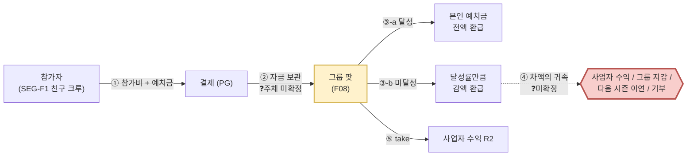
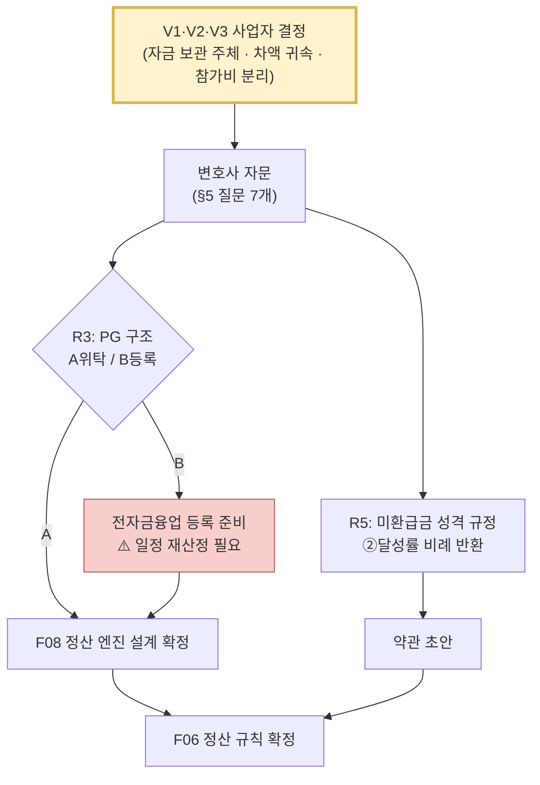

# Phase 0 법률 리스크 브리프 (내부 잠정) — 보상형 그룹 목표 인증 플랫폼

> ## 🚨 이 문서의 성격 — 먼저 읽을 것
>
> | 항목 | 값 |
> |---|---|
> | **문서 성격** | **내부 의사결정용 잠정 검토.** 변호사 자문이 **아니며 이를 대체하지 못한다.** 여기의 모든 판단은 `잠정`이고, 최종 판단 권한은 자문 변호사·감독당국에 있다 |
> | **작성자 자격** | 법률 전문가가 아니다. 조문·유권해석·보도자료를 대조한 **리서치 수준**의 판단이다 |
> | **검토 대상** | `08-고객가치선언문/보상형 그룹별 일상 숏폼 공유 플랫폼_VPS-v1_0-merged.md` §0 **D2(비제로섬 자기환급)** 및 이에 종속된 **F06(정산 방식) · F08(예치·정산 엔진)** |
> | **왜 지금인가** | 확정본 §8.1이 *"F08은 전금법·사행성 심사가 걸려 있어 법률 검토가 개발보다 먼저다 — 이것이 전체 일정의 임계 경로"*로 스스로 지목 (`E20`·§8.1 자기반박 ①②) |
> | 준거법 / 검토일 | 대한민국 / **2026-08-13** |
> | **법령 확인 방식** | 조문·유권해석을 **웹으로 대조**했다. 대조한 것은 `[확인]`, 조문 원문을 열지 못한 것은 `[미확인]`으로 구분 표기했다. 판례는 **원문을 직접 열지 않았다** — 전부 `[미확인]` |

---

## 0. 결론 요약 — 한 화면

| # | 쟁점 | 근거 법령 | 잠정 등급 | D2가 미치는 영향 | 설계 종속 |
|:-:|---|---|:-:|:-:|---|
| **R3** | **전자지급결제대행업(PG) 등록** | 전금법 §28② | 🔴 **높음** | 무관 — D2와 상관없이 발생 | **F08** |
| **R5** | **미환급금 몰수 조항의 약관 무효** | 약관규제법 §6·§8 | 🟠 중높음 | D2가 **낮춘다** | **F06** |
| **R1** | **도박·사행행위** | 형법 §246·§247, 사행행위규제법 §2 | 🟡 중간 (제로섬 옵션 노출 시 🔴) | D2가 **결정적으로 낮춘다** | **F06** |
| **R4** | **유사수신행위** | 유사수신법 §2 | 🟡 중간 | D2가 **오히려 올린다** ⚠️ | **F06** |
| **R2** | 선불전자지급수단 등록 | 전금법 §2xiv·§28① | 🟡 중간 (포인트·쇼핑 붙이면 🔴) | 무관 | **F08** |
| **R6** | 영상 인증의 개인정보 처리 | 개보법 §17·§23 | 🟡 중간 (설계로 해소) | 무관 | F04·F11 |
| **R7** | 미성년자 계약 취소권 | 민법 §5 | 🟢 낮음 (게이트로 해소) | 무관 | F01·F02 |
| **R8** | 성과 수치 광고 | 표시광고법 §3 | 🟢 낮음 | 무관 | 마케팅 |

### 핵심 발견 3가지

**① D2(비제로섬)는 사행성 리스크를 실제로 낮춘다 — 다만 흔히 말하는 이유 때문이 아니다.**
*"노력으로 달성하는 것이니 우연이 아니다"*는 논거는 **약하다.** 대법원 법리는 당사자의 **능력·기량이 개입해도 우연성이 배제되지 않는다**고 본다(골프·마작 도박 인정례) `[미확인 — 판례 원문 미대조]`. 실제로 강한 논거는 다른 데 있다: 도박의 요건은 *"재물을 걸고 우연에 의하여 **재물의 득실**을 결정"*하는 것인데, **비제로섬 자기환급은 참가자 사이의 득실 이전 자체를 없앤다.** 내가 실패해도 그 돈은 다른 참가자에게 가지 않고, 남이 실패해도 내 몫은 늘지 않는다. **다툴 재물이 없으면 도박의 구조가 성립하지 않는다.** → D2를 지킬 근거는 "노력"이 아니라 **"득실의 상호성 제거"**다.

**② 그런데 같은 선택이 유사수신 논점을 끌어올린다 — 이 비대칭이 이 브리프의 가장 중요한 발견이다.**
유사수신행위는 *"장래에 **원금의 전액 또는 이를 초과하는 금액**을 지급할 것을 약정하고 예탁금 등의 명목으로 금전을 받는 행위"* `[확인]`. **제로섬은 실패 시 원금을 잃으므로 이 문언에서 멀지만, 비제로섬 자기환급은 "달성하면 전액 돌려준다"는 약정에 가까워진다.** 사행성을 피하려는 설계가 수신 규제로 걸어 들어가는 구조다. 방어 논거는 있다(§2 R4) — 그러나 **D2를 "법적으로 안전한 선택"으로 부르는 것은 정확하지 않다. 위험의 종류를 바꾼 것이다.**

**③ 임계 경로는 사행성이 아니라 전자금융거래법이다.**
확정본은 F08의 리스크를 *"전금법 + 사행성"*으로 병기했지만, 실제로 가장 먼저 막는 것은 **전자지급결제대행업(PG) 등록**이다. 금융위·금감원 유권해석은 *"자금정산에 관여하는 경우 실제로 전자지급결제대행업을 영위하는 것"*으로 보아, 계열사가 PG를 수행하거나 **결제대금예치업자로 등록되어 있어도 자금정산에 관여하면 PG 등록이 필요**하다고 판단했다 `[확인]`. **참가비를 받아 성패에 따라 환급액을 계산해 지급하는 것은 그 자체가 자금정산이다.** → **F08의 자금 흐름 구조 확정이 F06(정산 규칙)보다 먼저다.** 확정본의 의존 그래프(`F02 → F08 → … → F06`)와 방향은 같지만, **법적 이유로도 그 순서가 강제된다.**

---

## 1. 검토 대상 사실관계 — 돈의 흐름이 곧 법적 성격이다

법적 판단은 서비스의 취지가 아니라 **돈이 누구 계정에 얼마나 머물고 누구에게 가는가**로 갈린다. D2 확정 후의 흐름은 다음과 같다.

### 법적 성격을 결정하는 미확정 변수 3개

| ❓ | 변수 | 왜 결정적인가 | 어느 쟁점을 흔드나 |
|:-:|---|---|---|
| **V1** | **② 예치금을 누가 보관하나** — 사업자 계정 / PG 계정 / 신탁·에스크로 | 사업자 계정을 경유하면 자금정산 관여가 명백해진다 | **R3**(결정적) · R2 |
| **V2** | **④ 미환급 차액이 누구에게 가나** — 사업자 수익 / 그룹 지갑 / 이연 크레딧 / 기부 | 사업자 귀속이면 *"몰수"*(R5), 타 참가자 귀속이면 *"득실 이전"*(R1), 이연이면 *"선불충전금"*(R2) | **R1 · R2 · R5 전부** |
| **V3** | **참가비와 예치금이 분리되어 있나** | 분리되면 *"용역 대가 + 이행 담보"*로 설명되고, 미분리면 전액이 판돈으로 보일 수 있다 | R1 · R4 · R5 |

> ⚠️ **확정본은 V1·V2·V3을 정하지 않았다.** §0 D2는 *"비제로섬 자기환급을 기본값"*으로만 정했고, 차액의 귀속·보관 주체·참가비 분리는 미정이다. **이 세 변수를 정하지 않으면 어떤 자문도 정확한 답을 줄 수 없다** — 자문 전에 사업자가 먼저 정해야 하는 사항이다(§5 Q0).

---

## 2. 쟁점별 검토

### R1. 도박·사행행위 — 🟡 중간 (제로섬 옵션 노출 시 🔴 높음)

| 항목 | 내용 |
|---|---|
| **근거** | 형법 §246(도박), §247(도박장소등개설) · 「사행행위 등 규제 및 처벌 특례법」 §2 `[확인 — 정의 요건]` |
| **사행행위 정의** | 여러 사람으로부터 **재물·재산상 이익을 모아** ⇢ **우연적 방법**으로 득실을 결정 ⇢ 재산상 **이익이나 손실**을 주는 행위 `[확인]` |

**요건 대조**

| 요건 | 비제로섬 자기환급 (D2 기본값) | 제로섬 (선택지로 열어둔 경우) |
|---|---|---|
| 재물을 모음 | ✔ 성립 (예치금) | ✔ 성립 |
| **우연적 방법** | △ **다툼 있음** — 목표 달성은 본인 행위에 달렸으나, 능력 개입이 우연성을 배제하지 않는다는 법리가 있다 `[미확인]`. 그룹 조건(전원 달성 시 가산 등)을 걸면 **타인 행위 의존 = 우연성 인정 소지 상승** | ✔ 성립 소지 높음 — 타인의 실패가 내 이익을 만든다 |
| **재물의 득실 이전** | ✕ **불성립** — 내 예치금은 나에게만 돌아오고, 타인의 실패는 내 몫을 늘리지 않는다 | ✔ 성립 — 실패자 → 달성자 이전이 명시적 |
| **잠정 판단** | **도박·사행행위 구성 소지 낮음.** 다만 ①그룹 연동 보상 ②미환급금의 타 참가자 귀속(V2) ③참가비·예치금 미분리(V3) 중 **하나라도 들어오면 판단이 뒤집힐 수 있다** | **구성 소지 있음.** 챌린저스가 이 구조로 운영했고 규제 조치 사례는 확인되지 않았으나, **선례가 적법성을 보증하지 않는다** |

**설계 조건 (이것을 지키면 R1은 관리 가능)**
1. 미환급금을 **다른 참가자에게 이전하지 않는다** (V2에서 "타 참가자 귀속" 배제 — D2의 법적 핵심)
2. **그룹 전원 달성 조건의 금전 보상**을 만들지 않는다 — 타인 행위에 내 금전이 걸리는 순간 우연성 논점이 살아난다. 그룹 효과는 **비금전 보상**(회고본·배지·기록)으로 준다
3. 달성 판정 기준을 **사전에 객관·검증가능**하게 고정하고 사후 변경하지 않는다 (판정에 사업자 재량이 크면 "우연" 논점이 커진다)
4. `[참고]` 「게임산업진흥에 관한 법률」의 사행성게임물 규제는 **게임물에 해당해야** 적용된다. 목표 인증 앱은 게임물로 보기 어려워 직접 적용 가능성은 낮다 `[미확인 — 등급분류 실무 미확인]`

---

### R2. 선불전자지급수단 발행·관리업 등록 — 🟡 중간 (포인트·쇼핑 결합 시 🔴)

| 항목 | 내용 |
|---|---|
| **근거** | 전금법 §2 제14호(정의) · §28①(등록) · 2024-09-15 시행 개정법 `[확인]` |
| **정의 요건** | ① 이전 가능한 금전적 가치가 전자적으로 저장 ② **발행인 외의 제3자로부터 재화·용역을 구입하고 그 대가를 지급**하는 데 사용 ③ 업종·가맹점 수 요건 (개정법: **업종 1개 이상 + 가맹점 2개 이상**, 지류 상품권 포함) `[확인]` |
| **등록 면제** | 발행 규모가 작은 경우 — **연간 발행액 500억원 미만 + 발행잔액 30억원 미만**, 또는 단일 가맹점 전용 `[확인 — 보도자료 기준, 시행령 조문 원문 `미확인`]` |
| **별도관리 의무** | 선불충전금의 **100% 이상**을 선불충전금관리기관을 통해 신탁 등으로 별도관리 + 국채·지방채·은행예치 등 안전자산 운용 `[확인]` |

**잠정 판단** — **순수 예치·환급 구조는 선불전자지급수단에 해당하지 않을 가능성이 높다.** 예치금은 *"제3자로부터 재화·용역을 구입하는 대가"*로 쓰이지 않고 **본인에게 반환**되기 때문에 정의 요건 ②를 충족하지 않는다.

**⚠️ 그런데 이 안전지대는 매우 쉽게 깨진다.**

| 이런 기능을 붙이면 | 결과 |
|---|---|
| 미환급금·달성 보상을 **포인트로 적립**해 앱 내/외부에서 상품 구매에 쓰게 함 (챌린저스의 쇼핑 모델) | **정의 요건 ②③ 충족 → 선불업 등록 + 충전금 100% 별도관리 의무 진입** |
| 미환급금을 **다음 시즌 크레딧으로 이연**(V2의 한 선택지) | 이연 크레딧이 서비스 이용에만 쓰이면 자사 전용이나, **범위가 넓어지면 동일 논점** |
| 예치금을 **참가자 간 이전** 가능하게 함 | *"이전 가능한 금전적 가치"* 요건 강화 |

**설계 조건** — Y1에는 **포인트 경제를 만들지 않는다.** 환급은 **원 결제수단으로의 반환**만 지원한다. 확정본 §8.2가 회고본·배지 같은 비금전 보상을 Phase 1에 두고 있어 이 조건과 충돌하지 않는다.

---

### R3. 전자지급결제대행업(PG) 등록 — 🔴 **높음 · 임계 경로**

| 항목 | 내용 |
|---|---|
| **근거** | 전금법 §28②(전자금융업 등록) · **금융위·금감원 유권해석** `[확인]` |
| **유권해석 요지** | 계열사가 PG를 수행하더라도 **모회사가 사업 과정에서 자금정산에 관여하면 실제로 PG를 영위하는 것**이므로 모회사도 PG 등록을 해야 한다. **결제대금예치업자로 등록되어 있어도** 자금정산에 관여하면 PG 등록이 필요하다 `[확인]` |

**왜 이것이 임계 경로인가** — 이 서비스의 본질은 *"여러 사람의 돈을 모아 두고, 성패를 판정해, 각자에게 얼마를 돌려줄지 계산해 지급하는 것"*이다. **이것을 자금정산이 아니라고 설명하기는 어렵다.** 즉 R3는 D2와 무관하게, 사행성 판단과 무관하게 **구조적으로 발생한다.** 확정본이 F08 난이도를 5로 매기고 MVP에 넣은 것은 타당하나, **그 난이도의 절반은 개발이 아니라 인허가 일정**이다.

**대응 경로 3안**

| 안 | 구조 | 리스크 | 비용·기간 |
|:-:|---|---|---|
| **A** | PG·에스크로 사업자에 **자금 보관·정산 실행을 전부 위탁**하고 자사는 **판정 결과(달성률)만 전달** | 낮음 — 자금을 만지지 않는다 | 수수료 상승, 파트너 의존, **정산 로직 유연성 제약** |
| **B** | **전자금융업 등록**(PG 또는 결제대금예치업)을 직접 취득 | 낮음 (적법) | **자본금·물적·인적 요건 + 심사 기간** → Y1 일정과 정면 충돌 가능 |
| **C** | 자사 계정에 예치금을 모아 직접 정산 | 🔴 **미등록 영업 리스크** | 없음 (착수는 빠름) — **권고하지 않음** |

**권고** — **A로 Y1을 시작하고, 거래액이 커지는 시점(Phase 2)에 B를 준비한다.** A는 §1의 V1(보관 주체)을 "PG/신탁"으로 고정하는 선택이며, **R2·R4·R5를 동시에 완화**하는 부수 효과가 있다(자금이 사업자 자산이 아니게 되므로).

---

### R4. 유사수신행위 — 🟡 중간 (⚠️ D2가 올린 위험)

| 항목 | 내용 |
|---|---|
| **근거** | 「유사수신행위의 규제에 관한 법률」 §2 `[확인]` |
| **요건** | ① 다른 법령에 따른 인가·허가·등록·신고 없이 ② **불특정 다수인**으로부터 ③ **자금 조달을 업으로** 하며 ④ 장래에 **원금 전액 또는 초과 금액 지급을 약정**하고 예금·예탁금 등 명목으로 금전을 받음 `[확인]` |
| **판례 법리** | 자금조달 대상이 사전에 개별 특정되지 않으면 **불특정 다수** 요건 충족. 다만 **실질적으로 상품·용역 거래가 매개된 자금 수입은 출자금 수입으로 보기 어렵고**, 거래를 가장·빙자해 실제로는 거래 없이 금원 수입만 있는 경우에 한해 유사수신으로 본다 `[확인 — 요지 / 판결 원문 미대조]` |

**요건 대조**

| 요건 | 잠정 판단 |
|---|---|
| 불특정 다수 | ✔ 충족 (앱 공개 모집) |
| **자금 조달을 업으로** | ✕ **불충족 논거 강함** — 예치금은 **운용·조달 목적이 아니라 이행 담보**이며, 수익은 참가비 take(R2 수익모델)에서 나온다. 자금을 굴려 수익을 내는 구조가 아니다 |
| **원금 전액 이상 지급 약정** | △ **위험 지점** — *"달성하면 전액 환급"*은 조건부이나 문언상 근접. **달성 보상으로 원금 초과 금전을 지급하면 요건에 더 가까워진다** |
| 상품·용역 거래 매개 | ✔ **핵심 방어** — 챌린지 운영·인증·회고본 제공이라는 **실질 용역이 존재**한다. 다만 참가비와 예치금이 미분리(V3)면 *"용역 대가"* 설명이 약해진다 |

**설계 조건**
1. **참가비(용역 대가)와 예치금(이행 담보)을 계정·약관·영수증에서 분리**한다 — V3를 "분리"로 고정. R1·R5도 동시에 완화된다
2. **원금 초과 금전 보상을 만들지 않는다** — 달성 보상은 비금전(회고본·배지·기록)으로. 확정본 D2가 이미 제로섬 상금을 버렸으므로 추가 포기는 없다
3. 예치금을 **사업자 자산과 분리 보관**한다 (R3의 A안과 동일 방향)
4. 마케팅에서 ***"돈이 돌아온다 / 원금 보장"***류 표현을 쓰지 않는다 — **이 문구 하나가 요건 ④의 증거가 될 수 있다**

---

### R5. 미환급금 몰수 조항의 약관 무효 — 🟠 중높음

| 항목 | 내용 |
|---|---|
| **근거** | 「약관의 규제에 관한 법률」 §6①(신의성실·부당하게 불리한 조항) · §8(손해배상액의 예정) `[확인]` |
| **법리** | 고객에게 **부당하게 과중한** 손해배상 의무를 부담시키는 약관 조항은 **무효**다. 민법 §398(법원의 감액)과 달리 **약관규제법에서는 감액이 아니라 전부 무효**로 판단된다 — 법원이 적당한 수준으로 깎아 효력을 유지시켜 주지 않는다 `[확인]` |

**왜 이 쟁점이 F06을 직접 설계하는가** — *"미달성 시 예치금의 일부를 돌려주지 않는다"*를 **위약금·손해배상액 예정으로 성격 규정하면, 사업자에게 실제 손해가 없는데 고객이 금전을 잃는 구조**가 되어 §8 무효 위험이 커진다. **무효가 되면 미환급금 전액을 반환해야 할 수 있고, 이는 수익 모델과 정산 엔진을 동시에 흔든다.**

**성격 규정 3안**

| 안 | 성격 | R5 위험 | 부작용 |
|:-:|---|:-:|---|
| **①** | 미달성 시 **위약금 몰수** | 🔴 높음 | 무효 시 전액 반환 리스크 |
| **②** | **달성률 비례 반환** — 미반환분은 *"이용한 서비스 기간에 대한 대가"* | 🟡 중간 | 실제 제공 역무와 금액의 **비례성 입증 필요** |
| **③** | **예치금은 전액 반환하고, 참가비(정액)만 수취** — 몰수 개념 자체를 없앤다 | 🟢 **낮음** | *"잃을 수 있다"*는 **강제력 유인 소멸** — 확정본 §5 선언 ①의 물리적 근거가 약해진다 |

**권고** — **②를 기본으로, ①을 배제한다.** ③은 R1·R4·R5를 한 번에 지우는 가장 안전한 구조지만 **제품의 핵심 메커니즘(금전 계약의 강제력)을 훼손**한다. 확정본 §7.5 반증 신호가 이미 *"챌린저스는 제로섬으로 5,000억을 만들었다"*를 남겨 두었으므로, **유인을 더 깎는 선택은 인터뷰 검증 전에 하지 않는 것이 낫다.** 단 ②를 택하려면 **약관에 반환 산식·역무 대가 근거를 명시**하고, 표시 시점(계약 전 F01 진단 화면)에 고객이 이해할 수 있게 제시해야 한다.

> `[참고]` 「전자상거래법」 §17 청약철회(7일)와의 관계 — **시즌 시작 전 철회는 전액 반환**을 원칙으로 두는 것이 안전하다. 시작 후에는 용역 개시로 보아 제한이 가능하나, **제한 사유를 약관에 구체적으로 적어야** 한다 `[미확인 — 조문 원문·유권해석 미대조]`.

---

### R6. 영상 인증의 개인정보 처리 — 🟡 중간 (설계로 해소 가능)

| 항목 | 내용 |
|---|---|
| **근거** | 개보법 §15(수집·이용) · §17(제3자 제공) · §23 + 시행령 §18(민감정보) `[확인 — 해설·가이드라인 기준]` |
| **핵심 정리** | **얼굴이 담긴 영상은 개인정보이지만, 원칙적으로 민감정보는 아니다** — 별도의 민감정보 동의는 필요하지 않다. 단 **특정 개인을 식별할 목적으로 기술적 수단을 통해 생성한 생체인식정보**는 민감정보에 해당한다 `[확인]` |

| 우리 기능 | 판단 |
|---|---|
| F04 실시간 무편집 영상 인증 (얼굴 노출) | **일반 개인정보** — 수집·이용 동의로 처리 가능 |
| 영상을 **그룹 구성원에게 공개** | **제3자 제공/공개**에 해당 → **별도 동의 + 공개 범위 고지** 필요. 그룹 외부 노출 금지가 기본값이어야 한다 |
| F11 회고본을 **외부 공유**(바이럴) | 공유 시점 **재동의** + 타인 얼굴이 담긴 경우 **그 타인의 동의**까지 필요 |
| 얼굴로 **본인 여부를 자동 판정**(대리 인증 방지 자동화) | 🔴 **민감정보(생체인식정보) 진입** — Y1에 넣지 말 것. F16(대체 인증)·F19(사람 개입)로 우회 |

**설계 조건** — ① 그룹 내 공개를 기본, 외부 공개는 옵트인 ② 시즌 종료 후 **보관 기간·파기 정책 명시** ③ **자동 얼굴 매칭은 Y1 배제** ④ 인증 영상은 판정 목적 외 이용 금지를 약관에 명시.

---

### R7·R8 — 🟢 낮음 (게이트·문구로 해소)

| # | 쟁점 | 조치 |
|:-:|---|---|
| **R7** | **미성년자 계약 취소권** (민법 §5) — 미성년자가 법정대리인 동의 없이 한 예치 계약은 **취소 가능**하고, 취소 시 반환 의무가 생긴다. 페르소나에 19세·학생층이 있어 실제 유입 가능성이 있다 | F01/F02에 **연령 확인 게이트**. 만 19세 미만은 **금전 예치 트랙 차단**(무예치 체험 F07으로 유도 — 확정본이 이미 가진 기능이라 추가 개발이 없다) |
| **R8** | **표시광고법 §3** 거짓·과장 광고 — 확정본이 B의 무출처 목표치(완주율 82%·바이럴 k>1.2 등)를 **전량 삭제**했으므로 현재는 위험이 없다. 위험은 **마케팅 단계에서 이 수치가 되살아날 때** 발생한다 | 실측 코호트 확보 전까지 **완주율·개선율 수치 광고 금지**를 마케팅 규칙으로 못 박는다 |

---

## 3. 임계 경로 재정의 — 무엇이 무엇보다 먼저인가

| 순서 | 할 일 | 왜 이 순서인가 |
|:-:|---|---|
| **0** | **V1·V2·V3을 사업자가 먼저 정한다** | 이것 없이는 자문 질문이 성립하지 않는다. **법률 문제가 아니라 경영 결정이다** |
| **1** | 자문 (§5) | R3 판정이 F08 아키텍처와 일정을 결정한다 |
| **2** | F08 자금 흐름 확정 → **약관 초안** | R5 대응은 약관 문구로 구현된다 |
| **3** | F06 정산 규칙 확정 | 위 결과의 종속 변수 |

> **확정본 §8.2 로드맵의 Phase 0(2026-09~11, 3개월)은 A안 기준으로만 성립한다.** B안(직접 등록)을 택하면 심사 기간이 더해져 **Phase 1 착수가 밀린다** — 확정본 부록 A #8이 *"Phase 0 기간은 특히 불확실"*이라 적어 둔 것이 이 지점이다.

---

## 4. D2 재검토 트리거 — 확정본 §0.3의 "뒤집힐 조건 ①"에 대한 답

확정본은 *"법률 검토에서 **비제로섬으로도 사행성 소지**가 있다고 판정되면 D2 재설계"*를 뒤집힘 조건으로 걸었다. **이 브리프의 잠정 답은 "비제로섬 자체가 사행성으로 판정될 소지는 낮다"이며, 따라서 D2는 유지된다.** 단 조건이 붙는다.

| D2를 유지하되 | 이유 |
|---|---|
| 제로섬을 **선택지로도 노출하지 않는다** (확정본은 *"선택지로 열되 기본 노출하지 않음"*) | 선택지로 존재하는 순간 **사업자가 사행 구조를 제공**한 것이 된다. 형법 §247(도박장소등개설)은 개설 행위 자체를 벌한다. **"기본값이 아니다"는 방어가 되지 않는다** ⚠️ **이것이 확정본 §0 D2와 이 브리프가 갈리는 유일한 지점이다** |
| **그룹 전원 달성 금전 보상**을 만들지 않는다 | 타인 행위에 내 금전이 걸리면 우연성 논점 부활 (R1) |
| 참가비·예치금을 분리한다 | R1·R4·R5 동시 완화 (V3) |

---

## 5. 변호사에게 물을 것 — 자문 의뢰 시 그대로 쓸 질문

> 먼저 **Q0을 사업자가 답해야** 나머지 질문이 성립한다.

| # | 질문 |
|:-:|---|
| **Q0** | *(사업자 자답)* 예치금 보관 주체(V1), 미환급 차액의 귀속(V2), 참가비·예치금 분리 여부(V3)를 확정한 자금 흐름도 |
| **Q1** | 위 자금 흐름에서 당사가 **전자지급결제대행업 또는 결제대금예치업 등록 대상**인가. PG·에스크로에 정산 실행을 전부 위탁하고 달성률만 전달하는 구조(A안)라면 등록 없이 영위 가능한가 |
| **Q2** | 미환급금을 **다른 참가자에게 이전하지 않는 구조**라면 형법 §246·§247 및 사행행위규제법 §2의 구성요건을 벗어나는가. **제로섬 옵션을 선택지로 제공**하는 것만으로 §247 위반 소지가 생기는가 |
| **Q3** | *"목표 달성 시 예치금 전액 반환"* 약정이 **유사수신법 §2의 원금 전액 지급 약정**에 해당할 소지가 있는가. 참가비·예치금 분리와 용역 실재가 방어 논거로 충분한가 |
| **Q4** | 달성률 비례 반환(R5 ②안)이 **약관규제법 §8의 손해배상액 예정으로 성격 규정될 위험**은 어느 정도인가. *"제공 역무의 대가"*로 규정하려면 산식·표시에 무엇이 필요한가 |
| **Q5** | 미환급금을 **다음 시즌 크레딧으로 이연**하면 전금법상 **선불전자지급수단**에 해당하는가. 자사 서비스 전용이면 달라지는가 |
| **Q6** | 인증 영상을 **그룹 구성원에게만 공개**하는 것의 개보법상 근거(§17 동의 범위)와, 회고본 **외부 공유** 시 필요한 동의 설계 |
| **Q7** | **만 19세 미만 차단**을 어느 수준(자기 신고 / 본인인증)으로 해야 민법 §5 취소 리스크를 관리할 수 있는가 |

---

## 6. 이 브리프의 한계 — 반드시 함께 읽을 것

1. **판례를 직접 열지 않았다.** R1의 우연성 법리, R4의 상품거래 매개 법리는 **요지 수준**으로만 확인했다. 판결문 원문 대조가 필요하다
2. **시행령·감독규정 조문 원문을 열지 않은 항목이 있다** — 특히 R2의 등록 면제 기준(500억/30억)은 **보도자료 기준**이다. 조문·별표 확인 필요
3. **유권해석은 사안별이다.** R3의 근거는 음식점 주문중개 사안에 대한 해석이며, **우리 사안과 사실관계가 다르다.** 유사 적용 가능성만 말할 수 있다
4. **금융위 법령해석 신청(비조치의견서)을 하지 않았다.** R3·R4는 **당국 확인이 가능한 쟁점**이며, 자문보다 이것이 더 확실한 답이 될 수 있다
5. **세무·회계(예치금의 부채 인식, 미환급금의 수익 인식 시점)를 다루지 않았다.** R5의 성격 규정이 **수익 인식 시점을 바꾼다** — 회계 자문이 별도로 필요하다
6. **검토일 2026-08-13 기준이다.** 전금법·선불업 제도는 최근 개정이 잦은 영역이므로 자문 시점에 **재확인이 필요하다**

---

## 부록. 확인한 근거

| # | 출처 | 확인 내용 |
|:-:|---|---|
| 1 | [사행행위 등 규제 및 처벌 특례법 — 국가법령정보센터](https://law.go.kr/LSW/lsInfoP.do?lsiSeq=162383) | 사행행위 정의 3요건 |
| 2 | [전자금융거래법 — 국가법령정보센터](https://www.law.go.kr/%EB%B2%95%EB%A0%B9/%EC%A0%84%EC%9E%90%EA%B8%88%EC%9C%B5%EA%B1%B0%EB%9E%98%EB%B2%95) · [시행령](https://www.law.go.kr/LSW/lsInfoP.do?lsId=010366) | 선불전자지급수단 정의·등록 |
| 3 | [금융위 보도자료 — 선불충전금 100% 보호](https://www.fsc.go.kr/no010101/83004) · [선불업 등록 처리 상황](https://www.fsc.go.kr/no010101/84178) · [이용자 보호 강화](https://fsc.go.kr/po010101/82339) | 2024-09-15 시행, 100% 별도관리, 업종 1개·가맹점 2개, 면제 기준 500억/30억 |
| 4 | [금융위·금감원 유권해석 — 전자금융업자 등록(결제대행업/결제대금예치업)](https://casenote.kr/%EA%B8%88%EC%9C%B5%EC%9C%84%EC%9B%90%ED%9A%8C%C2%B7%EA%B8%88%EC%9C%B5%EA%B0%90%EB%8F%85%EC%9B%90/b34141edca) | **자금정산 관여 시 PG 등록 필요** (R3의 핵심 근거) |
| 5 | [금융위 법령해석포털 — 선불전자지급수단](https://better.fsc.go.kr/fsc_new/replyCase/LawreqDetail.do?stNo=11&muNo=85&muGpNo=75&lawreqIdx=5041) · [법령용어 정의](https://www.law.go.kr/LSW/lsTrmInfoR.do?lsTrm=%EC%84%A0%EB%B6%88%EC%A0%84%EC%9E%90%EC%A7%80%EA%B8%89%EC%88%98%EB%8B%A8) | 제3자 재화·용역 구입 대가 요건 |
| 6 | [김·장 Finance Legal Update — 전금법 개정안](https://www.kimchang.com/upload/board/1692941072016.pdf) | 개정 전후 업종 요건 비교 |
| 7 | [유사수신행위 Q&A — 금융위](https://www.fsc.go.kr/po020201/27311) · [판례 — 국가법령정보센터](https://law.go.kr/LSW/precInfoP.do?mode=0&precSeq=174115) · [서울대 논문](https://law.snu.ac.kr/data/hb_award/5/hb_awards_5__Han_Byungki.pdf) | 원금 전액 이상 지급 약정, 상품거래 매개 법리 |
| 8 | [약관규제법 §8 — CaseNote](https://casenote.kr/%EB%B2%95%EB%A0%B9/%EC%95%BD%EA%B4%80%EC%9D%98_%EA%B7%9C%EC%A0%9C%EC%97%90_%EA%B4%80%ED%95%9C_%EB%B2%95%EB%A5%A0/%EC%A0%9C8%EC%A1%B0) · [대법원 2018다248855](https://casenote.kr/%EB%8C%80%EB%B2%95%EC%9B%90/2018%EB%8B%A4248855) | 과중한 손해배상액 예정 = 무효(감액 아님) |
| 9 | [개인정보보호위원회 표준 해석례(2022)](https://www.dataguidance.com/sites/default/files/2022_gaeinjeongbo_bohobeob_pyojun_haeseogrye.pdf) · [생체정보 가이드라인 해설](http://www.boannews.com/media/view.asp?idx=102064) | 얼굴 영상 = 개인정보, 원칙적 비민감 / 식별목적 생성 생체인식정보 = 민감정보 |
| 10 | [챌린저스 — 나무위키](https://namu.wiki/w/%EC%B1%8C%EB%A6%B0%EC%A0%80%EC%8A%A4) · [소비자원 분쟁조정 사례집](https://www.kca.go.kr/home/board/downloadlink.do?bid=00000176&did=1003158436) | 경쟁사 실제 구조: 85% 기준, **미환급금을 달성자 상금으로 지급(제로섬)**, 포인트·쇼핑 결합 |

> ⚠️ **부록의 URL은 확인 경로이지 법적 근거의 완전한 인용이 아니다.** 자문 시에는 조문 번호와 원문으로 제시할 것.
