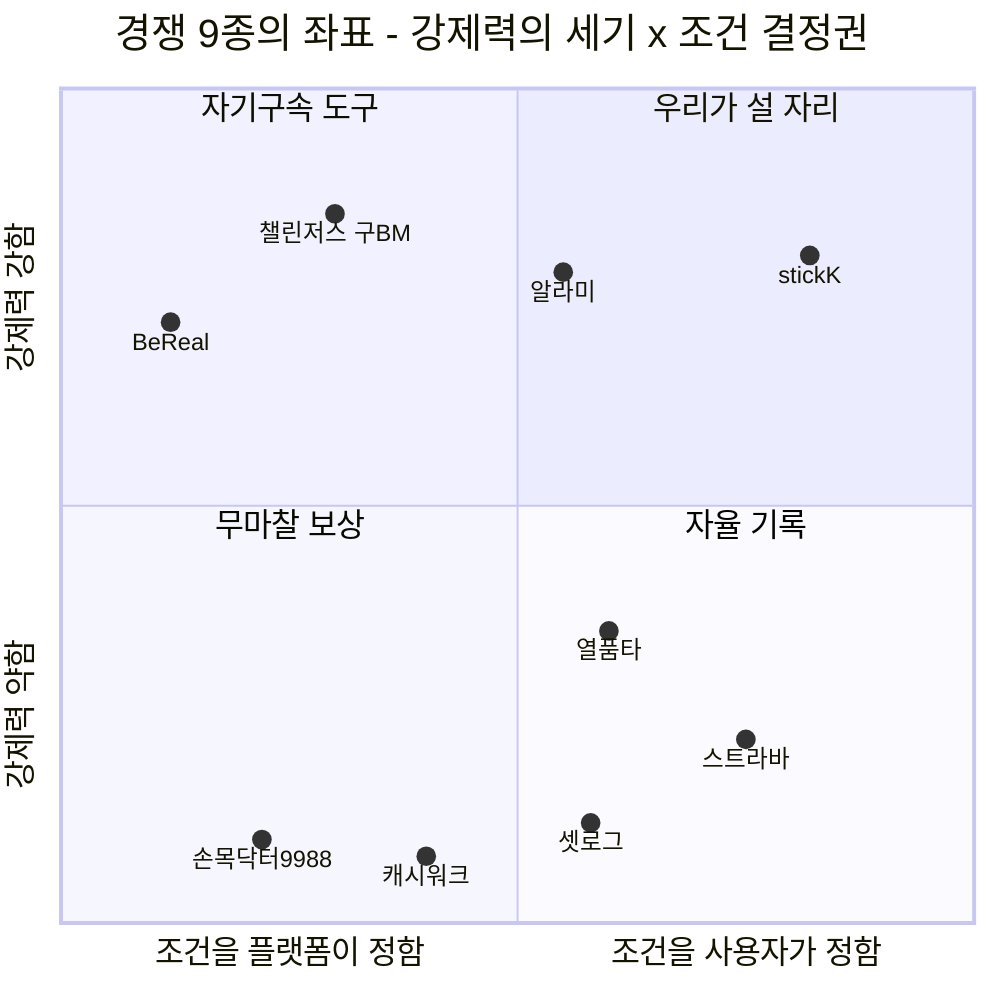
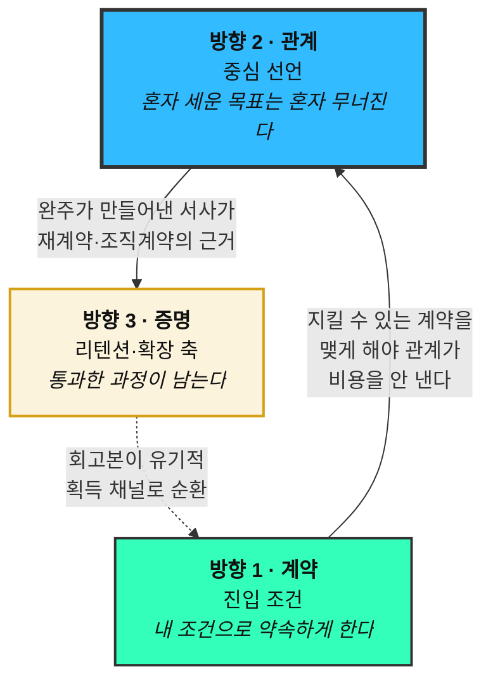

# 08-2. 자사 가치목표 선언 — 차별적 방향 3안

> 작성일: 2026-08-13 / 지리적 범위: 대한민국 / 통화: KRW
> **문서 성격:** 경쟁사 9종의 가치 선언문(`08-1`)을 기준선으로, **우리가 설 수 있는 자리 세 개**를 제안한다. 최종 선택 문서가 아니라 **선택지를 좁히는 문서**다.
> **입력:** 사용자가 제시한 가치 어필 3축 + `08-1` 경쟁 분석 + `04`~`07` 선행 산출물

| 선행 문서 | 이 문서가 가져다 쓴 것 |
|---|---|
| `08-고객가치선언문/competitive-landscape.md` | 경쟁사 9종 가치 선언문 · 빈 자리 진단(§5.3) · 재원 유형 6분류(§5.2) |
| `04-tam-sam-som/시장분석 종합보고서 (TAM-SAM-SOM).md` | 세그먼트 규모 · 수익 구조 R1·R2 · Q1 자기계약 존 |
| `05-personas/persona-02-spectrum.md` | 14인 페르소나 · 발견 7건(무료 개인 트랙 · 조직 재원) |
| `06-opportunity-score/pain-point-inventory.md` | Pain 42건 · Goal 4분류 · 공유 묶음 6종 |
| `06-opportunity-score/aos-scoring.md` · `dos-scoring.md` | AOS·DOS 점수 — 각 방향의 시장 근거 |

---

## 0. 30초 요약

**사용자가 제시한 3축은 "무엇을 만드는가"(제품 사양)이고, 가치목표 선언은 "왜 그것이 중요한가"(존재 이유)다.** 층위가 다르므로 1:1로 대응시키지 않았다.

> **같은 세 개의 사양으로 서로 다른 세 개의 회사를 만들 수 있다.** 어느 것을 브랜드의 **중심**에 놓느냐에 따라 제품 로드맵도, 미는 경쟁자도, 치를 대가도 달라진다. 그것이 아래 세 방향의 의미다.

| | 방향 | 한 줄 선언 | 중심에 놓는 것 |
|:-:|---|---|---|
| **1** | **계약** | *"우리는 당신의 하루를 정하지 않는다. 당신이 스스로 정한 약속만이 당신을 구속한다."* | **통제권** |
| **2** | **관계** | *"혼자 세운 목표는 혼자 무너진다. 우리는 그 사이에 친구를 넣고, 친구가 치를 비용은 우리가 대신 낸다."* | **강제력의 주체** |
| **3** | **증명** | *"완주의 증거는 결과 사진 한 장이 아니라, 당신이 통과한 12주 전체다."* | **남는 것** |

**권고 (§8 상세)** — **방향 2를 중심 선언으로, 방향 1을 진입 조건으로, 방향 3을 리텐션·확장 축으로.** 세 방향은 배타적이지 않지만 **중심은 하나여야** 브랜드가 한 문장으로 전달된다.

---

## 1. 출발점 — 경쟁사 9종이 이미 차지한 자리

`08-1` §5.3이 도출한 결과다. 이 지도가 비어 있는 칸을 가리킨다.

| 선언의 유형 | 누가 말하고 있나 | 강제력의 주체 |
|---|---|:-:|
| *"당신 대신 우리가 정한다"* | BeReal · (초기) 챌린저스 | **플랫폼** |
| *"우리는 아무것도 요구하지 않는다"* | 캐시워크 · 손목닥터9988 | **없음** |
| *"당신의 의지를 믿지 않는다"* | 알라미 · stickK | **개인 자신** |
| *"당신이 쌓은 것이 곧 당신이다"* | 스트라바 · 셋로그 | **없음** (축적이 대신함) |
| *"측정하고 나란히 놓겠다"* | 열품타 | **익명 타인** |
| **"우리끼리 정하고, 우리끼리 지킨다"** | **— 아무도 없음** | **관계** |

> **읽는 법** — 우상단(조건은 사용자가 정하는데 강제력은 강함)에 stickK 하나뿐이고, **그마저 "혼자" 하는 구조**다. 여기에 **그룹**을 넣으면 아무도 없는 자리가 된다. 좌표값은 §3~§5의 서술 근거에서 배치한 **정성 판단**이며 측정치가 아니다.

---

## 2. 사용자가 제시한 3축을 어떻게 배치했는가

| # | 사용자 제시 어필 | 이 문서의 해석 | 층위 |
|:-:|---|---|---|
| **①** | 목표에만 집중할 수 있는 챌린지 인증 | *"인증 자체가 부담이 되지 않게 한다"* — 촬영·편집·판정 마찰 제거 | **제품 사양** |
| **②** | 혼자가 아닌 그룹형 인증 | *"지켜보는 사람이 아는 사람이다"* — 익명 다수가 아닌 관계 기반 | **제품 사양 + 차별 축** |
| **③** | 결제·페이백으로 약간의 강제력 | *"손실 가능성이 행동을 만든다"* — 자기구속 장치 | **제품 사양** |

**세 축은 세 방향 모두에 들어간다. 다만 배역이 다르다.**

| | 방향 1 계약 | 방향 2 관계 | 방향 3 증명 |
|---|:-:|:-:|:-:|
| ① 목표 집중 인증 | 조연 | 조연 | **주연** |
| ② 그룹형 인증 | 조연 | **주연** | 조연 |
| ③ 결제·페이백 강제력 | **주연** | 조연 | 조연 |

> **⚠️ 하나만 미리 짚어 둔다.** ③의 *"페이백"*은 설계가 두 갈래로 갈리고, **그 선택은 세 방향 중 무엇을 고르든 따로 내려야 하는 결정**이다. `08-1`이 찾아낸 가장 무거운 발견이 여기 걸려 있어 **§7에서 독립 섹션으로** 다룬다.

---

## 3. 방향 1 — 「계약」 · 내가 정한 규칙만이 나를 구속한다

> ### 가치목표 선언
>
> **"우리는 당신의 하루를 정하지 않는다.**
> **당신이 스스로 정한 약속만이 당신을 구속한다."**

### 3.1 왜 이 방향인가

**근거 ① — 우리 고객이 가장 많이 막히는 곳이 바로 여기다.**
`06-1`이 Pain 42건의 Goal을 4분류했을 때, **G4 통제권이 16건(38%)으로 최다**였다. 목표 달성 자체(G1, 10건)보다 많다. 그리고 여정 단계별로도 **S2 계약이 10건으로 최다**다.

**근거 ② — 경쟁자의 실패 원인이 정확히 이 축이다.**
BeReal은 *"진짜는 준비할 시간이 없을 때 나온다"*는 앞 절이 옳았는데 *"그래서 우리가 시각을 정한다"*는 뒷 절에서 무너졌다(DAU −48%, 재참여율 19%). **문제는 알림이 아니라 알림 시각의 소유권**이었다.

**근거 ③ — 가장 절실한 통증 4건이 여기서 한꺼번에 풀린다.**
AOS 최상위 10건 중 4건이 극단 사용자 2명에게서 나왔고, 그 넷은 전부 *"내 조건으로 계약하게 해달라"*다.

| # | 인물 | Pain | AOS |
|:-:|---|---|:-:|
| `31` | 강수빈 | 계약 전 진단 부재 — 지킬 수 없는 약속에 서명 | **4.0** |
| `33` | 강수빈 | 손실 순환 — 구조적 실패자가 상금 재원 공급 | **4.0** |
| `34` | 배유진 | 인증 수단이 하나뿐 | **4.0** |
| `36` | 배유진 | 실제로 했는데 증명 못 해 몰수 | **4.0** |

### 3.2 이 선언이 밀어내는 경쟁자

| 경쟁자 | 그들의 선언 | 이 방향이 반박하는 지점 |
|---|---|---|
| **BeReal** | *"그래서 우리가 시각을 정한다"* | 시각의 소유권을 사용자에게 완전히 넘긴다 |
| **알라미** | *"당신이 끌 수 없는 알람을 만든다"* | 장치는 같되 **조건을 본인이 고른다** |
| **챌린저스**(구) | 제시된 챌린지 목록 중 선택 | 챌린지를 **직접 설계**한다 |

### 3.3 이 방향이 함의하는 제품 사양

1. **계약 전 진단 설문** — 직업·근무 형태·촬영 가능 환경을 되짚게 해 **지킬 수 있는 조건을 스스로 고르게** 한다 `[05-2 개선 1순위]`
2. **주간 총량 계약** — 시각을 고정할 수 없는 사람에게 *"주 4회"*처럼 **횟수로** 계약하게 한다
3. **대체 인증 수단** — 얼굴 자동 블러 · 기구/기록 화면 인증 · 웨어러블 연동
4. **안전장치** — 누적 손실 상한 · 연속 실패 시 강제 휴식 · 난이도 자동 하향

### 3.4 이 방향이 치르는 대가

- **⚠️ 통제권과 강제력은 반비례한다.** 조건을 자유롭게 고르게 하면 사람들은 **지킬 수 있는 쉬운 계약만 고른다.** 최민지(C-05)는 *"중간에 포기하면 진짜로 아프기를 원한다"*고 말하는 인물인데, 이 방향은 그 요구와 정면으로 부딪힌다.
- **⚠️ 포용성과 어뷰징 방어가 충돌한다.** 대체 인증 수단을 늘릴수록 위조 난도가 낮아진다 `[05-2 E-02 정면 충돌 지점]`. **수단마다 위조 난도를 따로 설계**하지 않으면 둘 중 하나를 포기하게 된다.
- **⚠️ 브랜드 전달이 어렵다.** *"트리거 소유권"*은 한 문장으로 전달되지 않는다 — Pain `38`이 지적한 그대로다.

### 3.5 검증 질문

- 계약 화면에서 조건을 자유롭게 고를 수 있다면, **실제로 더 어려운 조건을 고르는가 쉬운 조건을 고르는가?**
- 진단 설문을 통과한 사람의 완주율이 통과 안 한 사람보다 유의미하게 높은가?

---

## 4. 방향 2 — 「관계」 · 강제력을 사람에게 놓되, 관계 비용은 시스템이 낸다

> ### 가치목표 선언
>
> **"혼자 세운 목표는 혼자 무너진다. 우리는 그 사이에 친구를 넣는다.**
> **그리고 친구가 치를 비용은 우리가 대신 낸다."**

### 4.1 왜 이 방향인가

**근거 ① — 유일하게 완전히 비어 있는 자리다.**
§1 표에서 확인했듯 **9개 경쟁자 중 강제력의 주체를 관계에 놓은 곳이 하나도 없다.** 열품타는 익명 타인, 스트라바는 클럽이 있으나 실패에 대가가 없고, 알라미·stickK는 혼자다.

**근거 ② — 시장 가중 점수(DOS)가 가장 크다.**
SOM 기준 DOS 상위 4건이 전부 관계 기반 세그먼트다.

| # | 인물 | Pain | AOS | **DOS(SOM)** | 세그먼트 |
|:-:|---|---|:-:|:-:|---|
| `11` | 이준호 | 그룹 없이 도착 | 4.0 | **2.21** | A1 128만 |
| `01` | 정하윤 | 독촉 역할 재발 | 4.0 | **1.86** | F1 108만 |
| `04` | 김도현 | 참가비 앞 결정 불가 | 4.0 | **1.86** | F1 108만 |
| `03` | 정하윤 | 방장 역할 고정 | 3.2 | **1.40** | F1 108만 |

> **`06-4` 매트릭스의 Q1(최우선 실행) 4건이 전부 이 방향에 속한다.** 그리고 그 4건은 **SAM 기준과 SOM 기준 두 버전에서 동일**했다 — 모수 논쟁과 무관하게 최우선이라는 뜻이다.

**근거 ③ — 챌린저스의 최대 약점을 우리가 갖고 있지 않다.**
`04` 문서가 적었듯 챌린저스형(A계열)의 약점은 **획득**이었다 — 크루는 자동으로 생기지 않는다. F계열은 **그룹이 이미 형성돼 있어** 그 약점이 없다.

### 4.2 이 선언의 결정적 차별점 — 뒷 문장

**앞 문장(*"친구를 넣는다"*)만으로는 차별화가 되지 않는다.** 친구와 함께하자는 말은 누구나 한다. 차별은 **뒷 문장**에 있다.

`06-1`이 분류한 🤝 **관계 비용 7건**이 이 방향의 청구서다. 그리고 **그 청구서를 시스템이 대신 결제하는 것**이 제품의 정체다.

| 관계가 치를 비용 | # | 시스템이 대신 내는 방식 |
|---|:-:|---|
| 방장이 잔소리꾼이 된다 | `01` | **독촉의 자동 집행** — 추적·알림이 사람에게 귀속되지 않는다 |
| 방장 역할이 고정돼 번아웃 | `03` | **역할 로테이션** 장치 |
| 총무가 판정자가 된다 | `17` | **판정의 시스템 이전** (+ stickK식 제3자 심판 옵션) |
| 상금 출처가 친구의 손실 | `02` | **재원 구조 재설계** → §7 |
| 친목에 돈이 들어오면 관계가 거래가 됨 | `19` | **간헐적 목표 순간에만** 제안, 일상 공유엔 보상 미부착 |
| 공동 재원이 사라짐 | `18` | 분배 대상에 **그룹 지갑** 옵션 |
| 소개자 거절이 관계를 상하게 함 | `41` | **거절 흔적이 남지 않는** 초대 설계 |

> **이 표가 곧 로드맵이다.** *"친구와 함께"*를 낭만으로 말하면 경쟁 우위가 없고, **관계가 낼 비용의 목록과 대납 방식을 갖고 있을 때** 비로소 선언이 된다.

### 4.3 이 방향이 밀어내는 경쟁자

| 경쟁자 | 그들의 선언 | 이 방향이 반박하는 지점 |
|---|---|---|
| **열품타** | *"당신의 시간을 재고 남들 옆에 놓는다"* | 그 *남들*이 **모르는 사람**이다 — 압력이 얕다 |
| **스트라바** | *"당신이 쌓은 것이 곧 당신이다"* | 클럽·챌린지는 있으나 **실패에 아무 일도 안 일어난다** |
| **알라미 · stickK** | *"당신의 의지를 믿지 않는다"* | 강제력은 있으나 **지켜보는 사람이 없다** |
| **챌린저스**(구) | 익명 다수 챌린지 | 이준호가 *"아무도 나를 안 봐서 압박이 약하다"*고 한 지점 |

### 4.4 이 방향이 치르는 대가

- **⚠️ 관계는 회복이 안 되는 자산이다.** 제품 실패는 재시도할 수 있지만 **상한 관계는 되돌릴 수 없다.** 어뷰징이나 정산 오류 한 건이 사용자 이탈이 아니라 **친구 관계 파탄**으로 번질 수 있다.
- **⚠️ 그룹 단위 이탈이 발생한다.** 개인 이탈은 1명이지만 **방장이 지치면 그룹 전체가 사라진다**(Pain `03`). 리텐션 지표의 분산이 크다.
- **⚠️ 조은비(N-02) 층은 이 방향으로도 안 풀린다.** *"우리끼리 돈을?"*이라는 거부는 관계 비용 대납으로 해소되지 않는다 — 그것은 §7의 문제다.

### 4.5 검증 질문

- 아는 사람이 지켜볼 때와 모르는 사람이 지켜볼 때 **완주율 차이가 실제로 존재하는가?**
- 방장에게서 독촉 역할을 걷어내면, **그 역할이 정말 사라지는가 아니면 다른 사람에게 옮겨가는가?**

---

## 5. 방향 3 — 「증명」 · 남는 것이 결과가 아니라 과정이다

> ### 가치목표 선언
>
> **"완주의 증거는 결과 사진 한 장이 아니라, 당신이 통과한 12주 전체다.**
> **우리는 당신이 해냈다는 사실을 남에게 보여줄 수 있는 형태로 남긴다."**

### 5.1 왜 이 방향인가

**근거 ① — 세 인물이 서로 다른 자리에서 같은 것을 요구한다.**

| # | 인물 | 무엇을 원하나 | AOS |
|:-:|---|---|:-:|
| `14` | 최민지 (개인) | *"12주를 어떻게 통과했는지가 손에 잡히게"* — 가장 힘들었던 구간이 가장 기록이 없다 | 3.0 |
| `26` | 송재현 (개인) | *"신경 안 쓰고 기록이 쌓이기"* — 운동은 꾸준한데 기록만 띄엄띄엄 | 3.0 |
| `29` | 여민석 (조직) | *"경영진에 낼 숫자"* — 부서별 달성률·지속률·이탈 시점 | **4.0** |

**근거 ② — 조직·공공 재원 경로의 입장료가 정확히 "증명"이다.**
`08-1` §5.2 ③의 발견이다. 손목닥터9988은 연 300억원을 집행하며 참여자 200만을 모았는데, 시의회로부터 ***"효과성 검증 없이 예산만 확대됐다"***는 지적을 받고 포인트 상한을 17만 → 10만P로 내렸다.

> **참여자 수는 예산을 따오지만 예산을 지키지는 못한다.** 여민석의 Pain `29`(AOS 4.0)와 손목닥터9988이 지금 겪는 문제가 **같은 문제**다. 이것을 푸는 것이 곧 3층 수익 구조의 세 번째 층(조직 계약)에 들어가는 입장권이다.

**근거 ③ — 수익 구조 3층 전부에 붙는 유일한 축이다.**

| 층 | 이 방향이 만드는 것 |
|---|---|
| 개인 무료 (송재현) | 인스타에 발행되는 회고본 = **유기적 획득 자산**(CAC↓) |
| 개인 그룹 (최민지) | 재계약 동력 — *"다음 시즌을 또 할 이유"* |
| 조직 (여민석) | **보고 가능한 숫자** = 계약 갱신의 근거 |

### 5.2 이 방향이 밀어내는 경쟁자

| 경쟁자 | 그들의 선언 | 이 방향이 반박하는 지점 |
|---|---|---|
| **스트라바** | *"당신이 달린 모든 거리는 사라지지 않는다"* | 기록은 있으나 **약속의 집행이 없다** — 실패에 대가가 없으니 기록에 서사가 없다 |
| **셋로그** | *"꾸미지 않아도 괜찮다"* | 기록은 자동으로 쌓이나 **목표가 없어 무엇을 통과했는지 남지 않는다** |
| **손목닥터9988** | *"도시가 값을 치른다"* | 참여자 수는 있으나 **건강이 좋아졌다는 증거가 없다** |

### 5.3 이 방향이 치르는 대가

- **⚠️ 기록은 리텐션은 만들어도 획득은 못 만든다.** 아직 안 써본 사람에게 *"나중에 회고본이 남습니다"*는 구매 이유가 되지 않는다. **후행 지표에 브랜드를 거는 셈**이다.
- **⚠️ 자동 편집 회고본은 셋로그가 이미 제공한다.** `05-2` 한계 #9가 남겨 둔 미해결 과제이며, **차별점이 아닐 수 있다.** 우리 회고본이 다르려면 *"영상 모음"*이 아니라 **"계약 대비 달성의 서사"**여야 한다.
- **⚠️ 조직 경로는 영업 사이클이 길다** — 예산 편성·품의·연간 계획. 사용자와 구매자가 분리된다.

### 5.4 검증 질문

- 회고본을 받은 사용자의 **다음 시즌 재계약률**이 안 받은 사용자보다 높은가?
- 여민석 유형에게 **어떤 숫자를 보여줘야** 내년 예산 품의가 통과하는가?

---

## 6. 세 방향 비교

| 축 | **1 계약** | **2 관계** | **3 증명** |
|---|---|---|---|
| **중심에 놓는 것** | 통제권 | 강제력의 주체 | 남는 것 |
| **경쟁 공백의 크기** | 부분 (stickK가 근접) | **완전** (0곳) | 부분 (스트라바가 근접) |
| **시장 근거 (DOS)** | `계산 보류` — 모수 미측정 | **최상위 4건 전부** (2.21·1.86·1.86·1.40) | 혼재 (`14` 0.52 / `29` 보류) |
| **AOS 근거** | 4.0 4건 (극단 사용자) | 4.0 3건 + 3.2 1건 | 4.0 1건 + 3.0 2건 |
| **주연 어필** | ③ 결제·페이백 | ② 그룹형 | ① 목표 집중 인증 |
| **즉시 매출 기여** | 간접 (이탈 방지) | **직접** (R2 참가비) | 지연 (R1 구독·조직 계약) |
| **최대 리스크** | 통제권↑ = 강제력↓ | 관계는 회복 불가 | 후행 지표에 브랜드를 검 |
| **규제 노출** | **완화 방향** (`33`·`36` 해소) | 중립 | 중립 |
| **브랜드 전달성** | ✕ 어렵다 (개념어) | **◎ 쉽다** (한 문장) | ○ 보통 |
| **7단계 여정 중 방어 구간** | S2 계약 · S3 예치 | S1 초대 · S4 인증 | S5 정산 · S6 회고 |

> **주목할 어긋남 하나** — 방향 1은 **AOS(고객 절실도)가 가장 높은데 DOS(시장 가중)는 계산조차 안 된다.** 극단 사용자 2명의 세그먼트 모수가 `[미측정]`이기 때문이다(`06-3` §5). **가장 아픈 사람들의 시장 크기를 우리가 모른다**는 뜻이며, 이 공백이 해소되기 전까지 방향 1을 단독 중심으로 세우는 것은 근거가 한 축뿐이다.

---

## 7. ⚠️ 세 방향과 독립된 별도 결정 — "페이백"을 어떻게 설계할 것인가

사용자가 제시한 ③ *"결제 및 페이백"*은 **설계가 두 갈래로 갈리며, 그 선택은 세 방향 중 무엇을 고르든 따로 내려야 한다.** `08-1`이 찾아낸 가장 무거운 발견이 여기 걸려 있다.

### 7.1 두 갈래

| | **(가) 자기 환급형** | **(나) 제로섬 상금형** |
|---|---|---|
| 100% 달성 시 | 전액 환급 | 전액 환급 |
| 미달성분의 행선지 | **본인 몫에서 차감 → 플랫폼 수수료 / 자선 / 그룹 지갑** | **완주한 다른 참가자의 상금** |
| 내가 잘하면 | 내 돈을 지킨다 | 내 돈을 지키고 **남의 돈도 받는다** |
| 제로섬 여부 | ✕ | ⭕ |
| 선례 | **stickK** (18년 · 계약 465,000건 · $42M) | **챌린저스 구 BM** (5.5년 운영 후 **폐기**) |

### 7.2 이 선택이 즉시 바꾸는 것

| 지점 | (가) 자기 환급형 | (나) 제로섬 상금형 |
|---|---|---|
| 조은비 `40` *"못 한 사람 돈을 내가 먹는 거잖아요"* | **문장 자체가 성립 안 함** | 그대로 남음 (영구 이탈층) |
| 정하윤 `02` 상금 출처 = 친구의 손실 | 소거 | 남음 — **방향 2의 관계 비용에 직접 가산** |
| 강수빈 `33` 손실 순환 (⚖️ 사행성 직결) | 순환 구조 자체가 없음 | **🔴 규제 심사 최대 쟁점** |
| 윤채원 `19` 관계 화폐화 | 완화 | 남음 |
| R2 수익 (참가비 take 12% ≈ 60억) | 유지 가능 (수수료 원천만 바뀜) | 유지 |
| 사용자 유인의 세기 | 약함 — *"잃지 않는다"* | **강함** — *"벌 수 있다"* |

> **`06-1`의 공유 묶음 두 개가 이 한 번의 선택으로 함께 움직인다** — ① 예치 문턱(`04`·`19`·`22`·`40`, 4명) · ② 제로섬 재원(`02`·`19`·`33`·`40`, 4명). 두 묶음은 `19`·`40`에서 겹치며, `06-1`은 이를 *"사실상 하나의 수익 구조 문제"*로 규정했다.

### 7.3 판단 재료 — 아직 답이 아니다

**(나)를 지지하는 것** — 챌린저스가 이 구조로 **누적 거래액 5,000억원**을 만들었다. WTP는 실증됐다.

**(나)를 의심하게 하는 것** — `08-1` §5.2 ①의 발견이다.

> **경쟁자 9곳 중 "다른 참가자의 실패가 내 상금이 되는" 구조를 현재 운영 중인 곳이 하나도 없다.** 챌린저스는 **첫 연간 흑자를 낸 뒤에** 그 구조를 버렸고, stickK는 18년간 자선단체로 흘려보내며 우회했다. **이 두 사실이 같은 방향을 가리키는 것은 우연으로 보기 어렵다.**

**결정 방식 제안** — 이것은 문서로 답할 문제가 아니라 **① 법률 검토(사행성·전자금융거래법)와 ② 인터뷰**로 답할 문제다. 그런데 `07-1`이 지적했듯 **그 질문을 쥔 두 인물(조은비 N-02 · 강수빈 E-01)이 이번 인터뷰 라운드에서 모두 탈락했다.** 별도 트랙으로 만나야 한다.

---

## 8. 권고

### 8.1 중심은 방향 2, 나머지는 층으로

**왜 방향 2가 중심인가 — 세 가지**

1. **유일하게 완전한 경쟁 공백이다.** 방향 1은 stickK가, 방향 3은 스트라바가 이미 근접해 있다. 방향 2만 9곳 중 0곳이다.
2. **시장 근거가 두 축 모두에서 최상위다.** `06-4` 매트릭스 Q1(최우선 실행) 4건이 전부 여기 속하고, 그 4건은 **SAM·SOM 두 모수에서 동일**했다.
3. **브랜드가 한 문장으로 전달된다.** Pain `38`이 지적한 *"차별점이 한 문장으로 전달되지 않는다"*는 문제를 방향 2만 통과한다.

**왜 방향 1이 중심이 아니라 진입 조건인가**
방향 1의 사양(계약 전 진단·조건 선택권)이 **없으면 방향 2가 성립하지 않는다.** 지킬 수 없는 계약에 서명하게 만들면 실패가 쌓이고, 그 실패의 대가를 **관계가 낸다.** 즉 방향 1은 방향 2와 경쟁하는 선택지가 아니라 **방향 2의 전제 조건**이다. 다만 **브랜드의 중심 문장으로 삼기엔 전달이 어렵고 DOS 근거가 비어 있다.**

**왜 방향 3이 리텐션·확장 축인가**
즉시 매출이 아니라 **재계약과 조직 계약의 근거**를 만든다. 지금 중심에 놓으면 *"아직 안 써본 사람에게 후행 지표를 파는"* 상태가 된다. 다만 **3층 수익 구조 전부에 붙는 유일한 축**이므로 후순위가 아니라 **병행**이다.

### 8.2 이 권고가 뒤집힐 조건

| 조건 | 그러면 |
|---|---|
| 극단 사용자(강수빈·배유진) **세그먼트 모수가 크게 측정**되면 | 방향 1의 DOS가 채워져 **중심 후보로 올라온다** |
| 인터뷰에서 *"아는 사람이 봐도 압박이 안 된다"*가 확인되면 | 방향 2의 전제가 무너져 **방향 1로 중심 이동** |
| 법률 검토에서 **제로섬 구조가 불가** 판정되면 | §7 (가) 자기 환급형 확정 → **방향 2의 관계 비용이 줄어 오히려 유리** |
| 셋로그가 **목표·챌린지 기능을 추가**하면 | 획득 채널이 정면 경쟁자로 전환 — **방향 3(증명)의 차별화 시급성 급상승** |

---

## 부록. 이 문서의 한계

1. **세 방향은 상호 배타적이지 않다.** 실제로는 셋 다 제품에 들어가며, 이 문서가 정한 것은 *"무엇을 브랜드의 중심 문장으로 삼을 것인가"* 하나뿐이다. **조직 구조나 개발 우선순위를 셋으로 나누라는 뜻이 아니다.**
2. **§1 사분면 차트의 좌표는 정성 판단이다.** 각 경쟁자의 "강제력 세기"와 "조건 결정권"을 측정한 값이 아니라, `08-1` §3의 서술 근거에서 배치한 것이다. **점의 상대 위치는 논거의 요약이지 데이터가 아니다.**
3. **모든 시장 근거가 미검증 입력값에서 나왔다.** AOS·DOS는 작성자 판단인 I·S 값 72개와 `[추정]`·`[러프]` 모수에 기대고 있다. **§6 비교표의 우열은 인터뷰로 뒤집힐 수 있는 가설이다.**
4. **방향 1의 DOS가 비어 있어 세 방향을 같은 기준으로 비교하지 못했다.** 극단 사용자 2명의 모수가 `[미측정]`이라, §6 표에서 방향 1만 시장 근거 칸이 `계산 보류`다. **비교의 공정성이 깨진 상태**이며 §8.2에 뒤집힐 조건으로 명시했다.
5. **§7의 두 갈래는 재원 설계의 전부가 아니다.** 자선 이전·그룹 지갑·플랫폼 수수료 등 (가) 안의 하위 갈래를 더 나누지 않았고, **각각의 세무·전자금융거래법 취급이 다를 수 있다.**
6. **가치 선언문 3건은 초안이다.** 카피라이팅이 아니라 **포지션의 정의**로 쓴 문장이며, 실제 브랜드 문구는 별도 작업이 필요하다.
7. **사용자가 제시한 3축을 "제품 사양"으로 재해석한 것은 본 문서의 판단이다.** 사용자가 이미 가치 선언 층위로 의도했다면 이 재해석 자체가 틀렸을 수 있으며, 그 경우 §2의 배역표부터 다시 짜야 한다.
