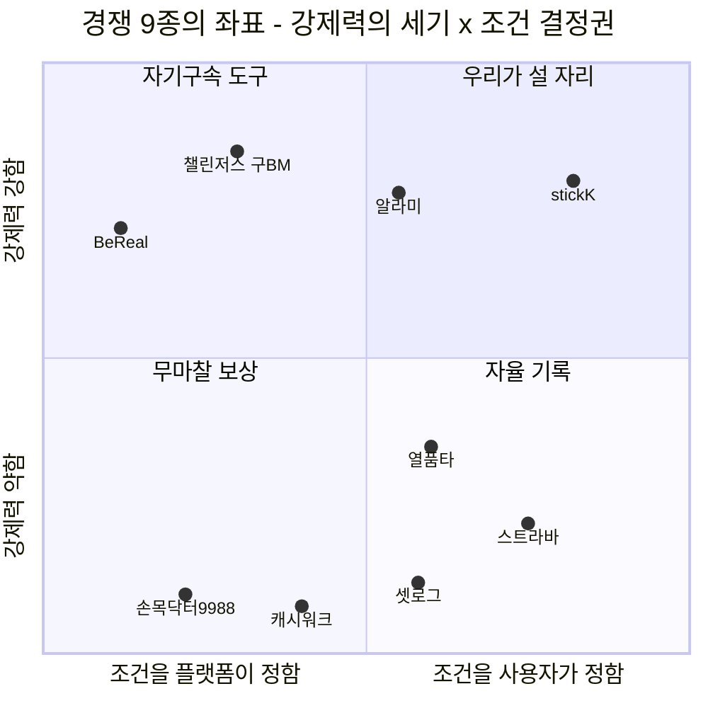
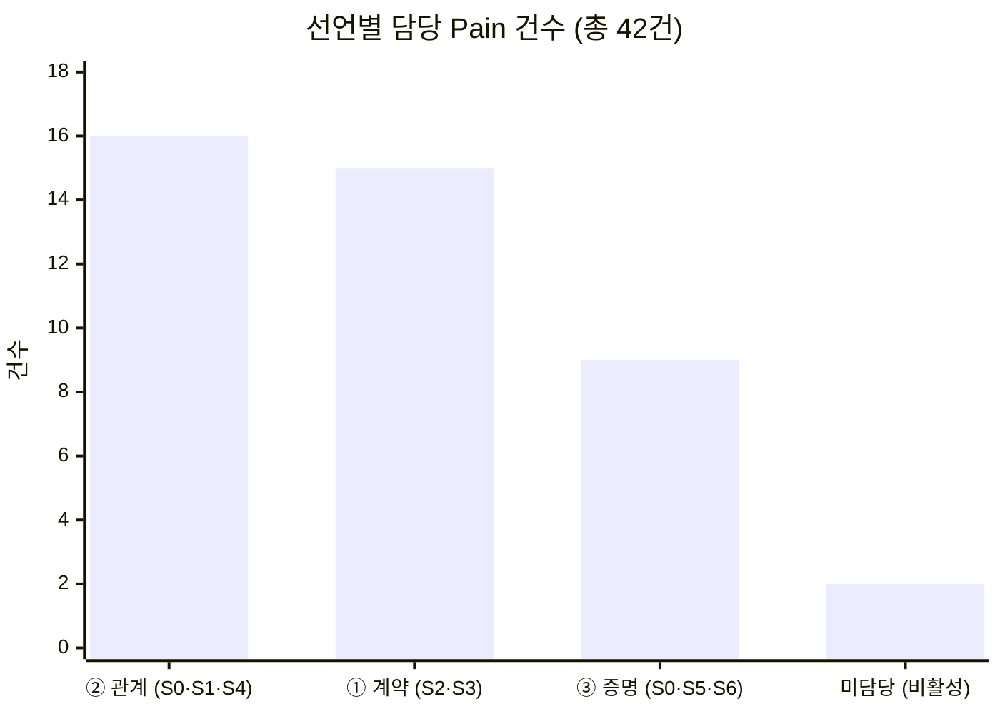
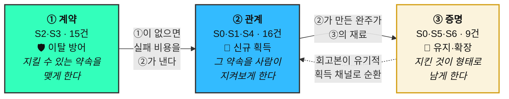

# 08-2. 자사 가치목표 선언 3종 — 여정 구간 분담 구조

> 작성일: 2026-08-13 / 지리적 범위: 대한민국 / 통화: KRW
> **문서 성격:** 경쟁사 9종의 가치 선언문(`08-1`)을 기준선으로, **우리가 세울 세 개의 선언과 그 셋이 모두 필요한 이유**를 근거로 도출한다.
> **개정 이력**
> - 2026-08-13 (1차) — 3방향 제안. 방향 2를 중심으로 두고 1·3을 종속시킨 구조
> - 2026-08-13 (2차) — **중심·종속 구조를 폐기하고 「여정 구간 분담」으로 재구성.** 세 선언이 7단계 관문을 나눠 맡으며 **하나를 빼면 관문 하나가 무방비**가 됨을 Pain 42건 분배로 증명 / **선언 1의 모수 공백을 공개 통계로 해소**(교대근무 임금근로자 229만·헬스 참여 10~39세 160만) / **근거 추적표 17건 신설** — 모든 결론에 근거 ID와 "이 근거가 틀리면 무엇이 무너지는가"를 부착

| 선행 문서 | 이 문서가 가져다 쓴 것 |
|---|---|
| `08-고객가치선언문/competitive-landscape.md` | 경쟁사 9종 가치 선언문 · 빈 자리 진단(§5.3) · 재원 유형 6분류(§5.2) |
| `06-opportunity-score/pain-point-inventory.md` | **Pain 42건의 단계별 분포** — 본 문서 병립 구조의 뼈대 |
| `06-opportunity-score/aos-scoring.md` · `dos-scoring.md` · `aos-dos-matrix.md` | AOS·DOS 점수 · Q1 사분면 |
| `04-tam-sam-som/시장분석 종합보고서 (TAM-SAM-SOM).md` | SAM 800만 · SOM 232만 · 수익 구조 R1·R2 |
| `05-personas/persona-02-spectrum.md` | 14인 페르소나 · 발견 7건 · 미측정 한계 목록 |

---

## 0. 30초 요약

**세 선언은 우열 관계가 아니라 담당 구간이 다르다.** Pain 42건을 고객 여정 7단계에 실제로 배치해 보면, 세 선언이 **겹치지 않고 40건을 나눠 맡는다**(나머지 2건은 비활성 사용자 몫이라 어느 선언도 담당하지 않는다).

| | 선언 | 한 줄 | 담당 관문 | Pain |
|:-:|---|---|---|:-:|
| **①** | **계약** | *"우리는 당신의 하루를 정하지 않는다. 당신이 스스로 정한 약속만이 당신을 구속한다."* | **S2 계약 · S3 예치** | **15건** |
| **②** | **관계** | *"혼자 세운 목표는 혼자 무너진다. 우리는 그 사이에 친구를 넣고, 친구가 치를 비용은 우리가 대신 낸다."* | **S0 자각 · S1 초대 · S4 인증** | **16건** |
| **③** | **증명** | *"완주의 증거는 결과 사진 한 장이 아니라, 당신이 통과한 12주 전체다."* | **S5 정산 · S6 회고** | **9건** |

> **"세 선언이 모두 필요하다"는 수사가 아니라 계산이다.** 하나를 빼면 그 구간 Pain이 통째로 무방비가 된다 — ①을 빼면 **최대 이탈 관문(S3)**이, ②를 빼면 **제품 정체성 자체**가, ③을 빼면 **재계약 동력**이 사라진다(§3.3).

**1차 판(2026-08-13 오전)에서 바뀐 것** — 그때는 *"방향 2를 중심으로, 1·3을 종속"*으로 썼다. **그 구조가 틀렸던 이유는 세 선언을 DOS 하나로 줄 세웠기 때문**이다. DOS는 **획득 지표**라 방어(①)와 유지(③)를 채점할 수 없다. 지표를 각 선언의 성격에 맞게 바꾸자 우열이 사라졌다(§8.1).

---

## 1. 출발점 — 경쟁사 9종이 이미 차지한 자리 `E07`

| 선언의 유형 | 누가 말하고 있나 | 강제력의 주체 |
|---|---|:-:|
| *"당신 대신 우리가 정한다"* | BeReal · (초기) 챌린저스 | **플랫폼** |
| *"우리는 아무것도 요구하지 않는다"* | 캐시워크 · 손목닥터9988 | **없음** |
| *"당신의 의지를 믿지 않는다"* | 알라미 · stickK | **개인 자신** |
| *"당신이 쌓은 것이 곧 당신이다"* | 스트라바 · 셋로그 | **없음** (축적이 대신함) |
| *"측정하고 나란히 놓겠다"* | 열품타 | **익명 타인** |
| **"우리끼리 정하고, 우리끼리 지킨다"** | **— 아무도 없음** | **관계** |

> 우상단(조건은 사용자가 정하는데 강제력은 강함)에 stickK 하나뿐이고 **그마저 "혼자" 하는 구조**다. 여기에 **그룹**을 넣으면 아무도 없는 자리가 된다. ⚠️ 좌표값은 `08-1` §3 서술 근거에서 배치한 **정성 판단**이며 측정치가 아니다.

---

## 2. 사용자가 제시한 3축을 어떻게 배치했는가

**주신 3축은 "무엇을 만드는가"(제품 사양)이고, 가치목표 선언은 "왜 그것이 중요한가"(존재 이유)다.** 층위가 달라 1:1로 대응시키지 않았다.

| # | 사용자 제시 어필 | 이 문서의 해석 |
|:-:|---|---|
| **①** | 목표에만 집중할 수 있는 챌린지 인증 | *"인증 자체가 부담이 되지 않게 한다"* — 촬영·편집·판정 마찰 제거 |
| **②** | 혼자가 아닌 그룹형 인증 | *"지켜보는 사람이 아는 사람이다"* — 익명 다수가 아닌 관계 기반 |
| **③** | 결제·페이백으로 약간의 강제력 | *"손실 가능성이 행동을 만든다"* — 자기구속 장치 |

**세 축은 세 선언 모두에 들어간다. 다만 배역이 다르다.**

| | 선언 ① 계약 | 선언 ② 관계 | 선언 ③ 증명 |
|---|:-:|:-:|:-:|
| ① 목표 집중 인증 | 조연 | 조연 | **주연** |
| ② 그룹형 인증 | 조연 | **주연** | 조연 |
| ③ 결제·페이백 강제력 | **주연** | 조연 | 조연 |

> **⚠️ ③의 *"페이백"*은 설계가 두 갈래로 갈리고, 그 선택은 세 선언 중 무엇을 세우든 따로 내려야 한다.** `08-1`이 찾아낸 가장 무거운 발견이 여기 걸려 있어 **§9에서 독립 섹션**으로 다룬다.

---

## 3. 세 선언이 모두 유효한 이유 — 여정 구간 분담

### 3.1 Pain 42건을 7단계에 배치하면 겹치지 않는다 `E17`

`06-1` §4의 단계별 분포를 그대로 가져와, 각 단계를 어느 선언이 담당하는지 배정했다.

| 단계 | 건수 | Pain 번호 | **담당 선언** |
|---|:-:|---|:-:|
| **S0** 자각 | 4 | `20` 목표 순간 포착 | **② 관계** |
| | | `26` 촬영·편집 마찰 | **③ 증명** |
| | | `37` `39` 서지훈 (비활성) | *— 없음* |
| **S1** 초대 | 7 | `11` `16` `21` `23` `25` `38` `41` | **② 관계** |
| **S2** 계약 | **10** 🔴 최다 | `06` `09` `10` `15` `17` `24` `27` `28` `31` `42` | **① 계약** |
| **S3** 예치 | 5 | `04` `19` `22` `35` `40` — 🔴 **이탈 4건 집중** | **① 계약** |
| **S4** 인증 | 8 | `01` `05` `07` `12` `13` `30` `32` `34` | **② 관계** |
| **S5** 정산 | 6 | `02` `08` `18` `29` `33` `36` | **③ 증명** |
| **S6** 회고 | 2 | `03` `14` | **③ 증명** |

**합계 검증** — ① 15 + ② 16 + ③ 9 + 미담당 2 = **42건** ✅

> **미담당 2건은 누락이 아니다.** `37`·`39`는 서지훈(N-01)의 Pain이고, `06-1` §3 해설 ③이 밝혔듯 **그의 Goal은 "이 앱을 안 쓰는 것"**이다. 우리가 풀수록 고객이 멀어지는 종류라 어느 선언도 담당하지 않는 것이 맞다.

### 3.2 왜 이 분배가 자의적이지 않은가

| 선언 | 담당 근거 |
|---|---|
| **① 계약** | S2·S3의 Pain은 전부 *"내 조건을 계약에 못 넣는다"* 또는 *"걸기 전에 확인 못 한다"*이다. `06-1` §3이 **S2의 통증 대부분을 G4 통제권**으로 분류한 것과 일치한다 `E01` `E02` |
| **② 관계** | S1은 *"그룹이 없거나 그룹째 옮겨야 한다"*, S4는 *"지켜보는 압력과 복귀 비용"*이다. 둘 다 **사람이 있어야만 발생하고 사람이 있어야만 풀리는** 통증이다 |
| **③ 증명** | S5는 *"정산이 관계·윤리 비용으로 청구된다"*, S6는 *"재계약 동력이 안 생긴다"*이다. 둘 다 **끝난 뒤에 무엇이 남았는가**의 문제다 |

### 3.3 하나를 빼면 무슨 일이 일어나는가 — 이것이 "모두 유효"의 증명이다

| 뺀 선언 | 무방비가 되는 구간 | 결과 |
|---|---|---|
| **① 계약을 빼면** | S2 10건 + S3 5건 = **15건** | **최대 이탈 관문(S3 예치, 이탈 4건)이 그대로 남는다.** 게다가 지킬 수 없는 계약이 반복 실패를 낳고, **그 실패 비용을 ②의 관계가 대신 낸다**(`31`→`33` 인과) — 즉 ①이 없으면 **②가 스스로 무너진다** |
| **② 관계를 빼면** | S0 1건 + S1 7건 + S4 8건 = **16건** | 그룹 제품인데 **그룹이 도착하지 않고**(S1), 인증에 **아무 압력이 없다**(S4). `08-1` §5.1의 3요소 중 하나가 빠지므로 **제품 정체성 자체가 소멸**한다 |
| **③ 증명을 빼면** | S0 1건 + S5 6건 + S6 2건 = **9건** | 정산의 윤리 비용이 방치되고(S5), 재계약 동력이 없어(S6) **1회성 제품**이 된다. 조직 재원 경로(3층 수익구조)의 입장권도 함께 사라진다 `E13` |

> ### 결론
> **세 선언은 서로 대체재가 아니라 보완재다.** 특히 ①과 ②는 **일방향 의존**이다 — ①이 없으면 ②가 무너지지만, ②가 없어도 ①은 (반쪽짜리로) 성립한다. 이 비대칭이 §10 운용 순서의 근거가 된다.

---

## 4. 선언 ① — 「계약」 · 내가 정한 규칙만이 나를 구속한다

> **"우리는 당신의 하루를 정하지 않는다.**
> **당신이 스스로 정한 약속만이 당신을 구속한다."**

**담당 관문:** S2 계약(10건) · S3 예치(5건) — 총 15건 · **지표 성격: 이탈 방어**

### 4.1 이 선언이 서는 근거

| ID | 근거 | 수치 |
|:-:|---|---|
| `E01` | **고객이 가장 많이 막히는 Goal이 통제권이다** — 4분류 중 최다 | G4 **16건 (38%)**, 목표 달성(G1) 10건보다 많음 |
| `E02` | **여정에서 통증이 가장 많은 관문이 계약이고, 가장 많이 끊기는 관문이 예치다** | S2 **10건**(최다) · S3 **이탈 4건**(최다) |
| `E03` | **가장 절실한 통증 4건이 전부 "내 조건으로 계약하게 해달라"다** | `31` `33` `34` `36` — 모두 **AOS 4.0** |
| `E04` | **교대근무 임금근로자 모수 확보** *(1차 판의 공백 해소)* | 임금근로자 **2,241.3만** × 교대근무 **10.2%** ≈ **229만 명** |
| `E05` | **촬영 제약 환경 모수 확보** *(동일)* | 10~39세 1,450만 × 생활체육 참여 **62.9%** × 보디빌딩 **17.5%** ≈ **160만 명** |
| `E06` | **이 선언의 가치는 신규 획득이 아니라 이탈 방어다** | SOM 232만 × 교대근무 10.2% ≈ **24만 명**이 고정 시각 계약으로는 **구조적으로 실패** |

**`E06`이 1차 판의 오류를 정정한다.** 1차 판은 이 선언의 DOS가 `계산 보류`라 비교표에서 불리했다. 그런데 모수를 채워 넣고 보니 **문제는 데이터가 아니라 지표였다.**

> 교대근무자·촬영 제약자는 **독립 세그먼트가 아니라 횡단 속성**이다. 강수빈은 간호사이면서 동시에 A1 루틴 커미터일 수 있다. 따라서 이들은 *"새로 얻는 시장"*이 아니라 **"기존 SOM 안에서 구조적으로 실패해 잃게 될 사람"**이다.
>
> **DOS는 획득 지표라 방어 가치를 애초에 채점할 수 없다.** `계산 보류`는 데이터 부족이 아니라 **지표 오적용의 증상**이었다.

### 4.2 이 선언이 밀어내는 경쟁자

| 경쟁자 | 그들의 선언 | 반박 지점 |
|---|---|---|
| **BeReal** | *"그래서 우리가 시각을 정한다"* | 시각의 소유권을 사용자에게 완전히 넘긴다 (DAU −48%가 그 결과) |
| **알라미** | *"당신이 끌 수 없는 알람을 만든다"* | 장치는 같되 **조건을 본인이 고른다** |
| **챌린저스**(구) | 제시된 챌린지 목록 중 선택 | 챌린지를 **직접 설계**한다 |

### 4.3 함의하는 제품 사양

1. **계약 전 진단 설문** — 직업·근무 형태·촬영 가능 환경을 되짚게 해 **지킬 수 있는 조건을 스스로 고르게** 한다 `[05-3 개선 1순위]`
2. **주간 총량 계약** — 시각을 고정할 수 없는 사람에게 *"주 4회"*처럼 **횟수로** 계약하게 한다
3. **대체 인증 수단** — 얼굴 자동 블러 · 기구/기록 화면 인증 · 웨어러블 연동
4. **안전장치** — 누적 손실 상한 · 연속 실패 시 강제 휴식 · 난이도 자동 하향

### 4.4 이 선언이 무너지는 조건

| 조건 | 무너지는 것 | 확인 방법 |
|---|---|---|
| 조건 선택권을 주자 **사람들이 쉬운 계약만 고른다** | 통제권과 강제력이 반비례 → 최민지(*"포기하면 진짜로 아프기를 원한다"*)와 정면 충돌 | 계약 화면 A/B — 자유 설계군의 평균 난이도가 프리셋군보다 낮은가 |
| **`E04`·`E05`의 10~39세 비중 가정(35%)이 틀리면** | 모수가 절반 이하로 줄어 `E06`의 24만이 흔들림 | 연령대별 교대근무 분포 원자료 확인 |
| 대체 인증 수단이 **어뷰징을 감당 못 하면** | 포용성↔위조 방어 트레이드오프에서 포용성을 포기해야 함 `[05-2 E-02]` | 수단별 위조 시도율 측정 |
| **진단 설문을 통과해도 완주율이 안 오르면** | 선언 전체의 인과가 부정됨 | 통과군 vs 미통과군 완주율 비교 |

---

## 5. 선언 ② — 「관계」 · 강제력을 사람에게 놓되, 관계 비용은 시스템이 낸다

> **"혼자 세운 목표는 혼자 무너진다. 우리는 그 사이에 친구를 넣는다.**
> **그리고 친구가 치를 비용은 우리가 대신 낸다."**

**담당 관문:** S0 자각(1건) · S1 초대(7건) · S4 인증(8건) — 총 16건 · **지표 성격: 신규 획득**

### 5.1 이 선언이 서는 근거

| ID | 근거 | 수치 |
|:-:|---|---|
| `E07` | **유일하게 완전히 비어 있는 자리다** | 경쟁 9곳 중 강제력 주체를 관계에 놓은 곳 **0곳** |
| `E08` | **시장 가중 점수 상위가 전부 관계 기반이다** | DOS(SOM) 1~4위: `11` **2.21** · `01` **1.86** · `04` **1.86** · `03` **1.40** |
| `E09` | **모수 논쟁과 무관하게 최우선이다** | `06-4` Q1 4건이 **SAM·SOM 두 버전에서 동일** |
| `E10` | **관계 비용 7건이 이 선언의 청구서다** | 🤝 `01` `02` `17` `18` `19` `40` `41` |
| `E11` | **챌린저스의 최대 약점(획득)을 우리는 갖고 있지 않다** | F계열은 **그룹이 이미 형성돼 있음** |

### 5.2 차별점은 앞 문장이 아니라 뒷 문장에 있다 `E10`

*"친구와 함께"*는 누구나 말한다. 차별은 **관계가 낼 비용의 목록과 대납 방식을 갖고 있는가**에서 갈린다.

| 관계가 치를 비용 | # | 시스템이 대신 내는 방식 |
|---|:-:|---|
| 방장이 잔소리꾼이 된다 | `01` | **독촉의 자동 집행** — 추적·알림이 사람에게 귀속되지 않는다 |
| 방장 역할이 고정돼 번아웃 | `03` | **역할 로테이션** 장치 |
| 총무가 판정자가 된다 | `17` | **판정의 시스템 이전** (+ stickK식 제3자 심판 옵션) |
| 상금 출처가 친구의 손실 | `02` | **재원 구조 재설계** → §9 |
| 친목에 돈이 들어오면 관계가 거래가 됨 | `19` | **간헐적 목표 순간에만** 제안, 일상 공유엔 보상 미부착 |
| 공동 재원이 사라짐 | `18` | 분배 대상에 **그룹 지갑** 옵션 |
| 소개자 거절이 관계를 상하게 함 | `41` | **거절 흔적이 남지 않는** 초대 설계 |

> **이 표가 곧 로드맵이다.** 7건 중 `03`은 S6(선언 ③ 구간), `02`는 S5(선언 ③ 구간)에 있다 — **관계 비용의 정산은 ③이 대신 치른다**는 뜻이며, 이것이 §3.3에서 말한 보완 관계의 구체적 형태다.

### 5.3 이 선언이 밀어내는 경쟁자

| 경쟁자 | 그들의 선언 | 반박 지점 |
|---|---|---|
| **열품타** | *"당신의 시간을 재고 남들 옆에 놓는다"* | 그 *남들*이 **모르는 사람**이다 |
| **스트라바** | *"당신이 쌓은 것이 곧 당신이다"* | 클럽은 있으나 **실패에 아무 일도 안 일어난다** |
| **알라미 · stickK** | *"당신의 의지를 믿지 않는다"* | 강제력은 있으나 **지켜보는 사람이 없다** |
| **챌린저스**(구) | 익명 다수 챌린지 | 이준호가 *"아무도 나를 안 봐서 압박이 약하다"*고 한 지점 |

### 5.4 이 선언이 무너지는 조건

| 조건 | 무너지는 것 | 확인 방법 |
|---|---|---|
| **아는 사람이 봐도 압박이 안 되면** | 선언 전체의 전제가 부정됨 | 지인 그룹 vs 익명 그룹 완주율 비교 — **가장 먼저 확인할 것** |
| 관계 비용 대납이 **역할을 없애는 게 아니라 옮기기만 하면** | `E10` 표가 무효 — 잔소리꾼이 방장에서 다른 사람으로 이동 | 방장 교체율·그룹 해체율 추적 |
| **그룹 단위 이탈이 개인 이탈보다 크면** | 리텐션 분산이 감당 불가 — 방장이 지치면 그룹 전체가 소멸(`03`) | 이탈 단위(개인/그룹) 분해 측정 |
| **`E08`의 I·S 값 72개가 실제와 다르면** | DOS 순위 자체가 재편 — 관계 기반의 규모 우위 소멸 | `07` JTBD 인터뷰 9명 |

> **⚠️ 조은비(N-02) 층은 이 선언으로 풀리지 않는다.** *"우리끼리 돈을?"*이라는 거부는 관계 비용 대납으로 해소되지 않는다 — 그것은 §9의 문제다.

---

## 6. 선언 ③ — 「증명」 · 남는 것이 결과가 아니라 과정이다

> **"완주의 증거는 결과 사진 한 장이 아니라, 당신이 통과한 12주 전체다.**
> **우리는 당신이 해냈다는 사실을 남에게 보여줄 수 있는 형태로 남긴다."**

**담당 관문:** S0 자각(1건) · S5 정산(6건) · S6 회고(2건) — 총 9건 · **지표 성격: 유지·확장**

### 6.1 이 선언이 서는 근거

| ID | 근거 | 수치 |
|:-:|---|---|
| `E12` | **세 인물이 서로 다른 자리에서 같은 것을 요구한다** | `14` 최민지 3.0 · `26` 송재현 3.0 · `29` 여민석 **4.0** |
| `E13` | **조직·공공 재원 경로의 입장료가 정확히 "증명"이다** | 손목닥터9988 연 **300억** 집행 · 참여자 **200만** → *"효과성 검증 없이 예산만 확대"* 지적으로 **포인트 상한 17만→10만P 하향** |
| `E14` | **조직 담당자의 통증이 AOS 최상위다** | `29` 보고용 숫자 없음 — **AOS 4.0** |

**`E13`이 이 선언의 사업적 가치를 결정한다.** 손목닥터9988이 지금 겪는 문제와 여민석의 `29`는 **같은 문제**다.

> **참여자 수는 예산을 따오지만 예산을 지키지는 못한다.** 부서별 달성률·지속률·중도 이탈 시점을 내놓는 것이 곧 3층 수익 구조의 세 번째 층(조직 계약)에 들어가는 입장권이다.

**수익 구조 3층 전부에 붙는 유일한 선언이다.**

| 층 | 이 선언이 만드는 것 |
|---|---|
| 개인 무료 (송재현) | 인스타에 발행되는 회고본 = **유기적 획득 자산**(CAC↓) |
| 개인 그룹 (최민지) | 재계약 동력 — *"다음 시즌을 또 할 이유"* |
| 조직 (여민석) | **보고 가능한 숫자** = 계약 갱신의 근거 |

### 6.2 이 선언이 밀어내는 경쟁자

| 경쟁자 | 그들의 선언 | 반박 지점 |
|---|---|---|
| **스트라바** | *"당신이 달린 모든 거리는 사라지지 않는다"* | 기록은 있으나 **약속의 집행이 없다** — 실패에 대가가 없으니 기록에 서사가 없다 |
| **셋로그** | *"꾸미지 않아도 괜찮다"* | 기록은 자동으로 쌓이나 **목표가 없어 무엇을 통과했는지 남지 않는다** |
| **손목닥터9988** | *"도시가 값을 치른다"* | 참여자 수는 있으나 **건강이 좋아졌다는 증거가 없다** |

### 6.3 이 선언이 무너지는 조건

| 조건 | 무너지는 것 | 확인 방법 |
|---|---|---|
| **`E15` 자동 편집 회고본을 셋로그가 이미 제공한다** | 차별점 소멸 — 우리 회고본이 *"영상 모음"*이면 후발 열위 | 셋로그 회고 기능과 **"계약 대비 달성의 서사"** 직접 비교 |
| 회고본을 받아도 **재계약률이 안 오르면** | 유지 가치가 부정됨 | 회고본 수령군 vs 미수령군 다음 시즌 재계약률 |
| 조직 담당자가 **우리 숫자로 예산 품의를 못 통과시키면** | `E13` 입장권 논리가 무효 | 여민석 유형 인터뷰 — *"어떤 숫자가 있어야 통과하는가"* |
| **영업 사이클이 예산 주기보다 길면** | 조직 경로가 Y3+ 로 밀림 | 첫 조직 계약까지의 리드타임 실측 |

> **⚠️ 구조적 약점 하나** — 이 선언은 **후행 지표에 브랜드를 건다.** 아직 안 써본 사람에게 *"나중에 회고본이 남습니다"*는 구매 이유가 되지 않는다. 그래서 획득이 아니라 **유지·확장** 지표로 분류했다.

---

## 7. 근거 추적표 — 결론에서 근거로 역추적

> **모든 결론에 근거 ID가 붙어 있고, 각 근거에는 "이것이 틀리면 무엇이 무너지는가"가 달려 있다.** 어느 근거가 인터뷰나 실측으로 뒤집혔을 때 **문서의 어느 부분을 다시 써야 하는지**를 즉시 찾기 위한 표다.

| ID | 근거 | 출처 | 등급 | 지지하는 결론 | **틀리면 무너지는 것** |
|:-:|---|---|:-:|---|---|
| `E01` | G4 통제권 Goal 16건(38%) — 4분류 중 최다 | `06-1` §3 | `추정` 작성자 분류 | 선언 ① 성립 | 선언 ①의 1순위 근거 소멸 → `E03`만 남아 극단 사용자 논거로 축소 |
| `E02` | S2 계약 10건(최다) · S3 예치 이탈 4건(최다) | `06-1` §4 | `추정` | 선언 ①의 담당 관문 · **§3 분배 구조** | **§3 여정 분담 전체를 재배치**해야 함 — 문서의 뼈대 |
| `E03` | AOS 4.0 10건 중 4건이 극단 사용자 2명(`31`·`33`·`34`·`36`) | `06-2` §5② | `추정` I·S 작성자 판단 | 선언 ①의 절실도 | 선언 ①이 "아픈 사람이 적은" 선언이 됨 |
| `E04` | 교대근무 임금근로자 ≈ **229만 명** | 임금근로자 2,241.3만 `[실측]` × 교대근무율 10.2% `[실측]` | `추정` | 선언 ①의 모수 | 선언 ①이 다시 `계산 보류`로 회귀 |
| `E05` | 헬스 참여 10~39세 ≈ **160만 명** | 생활체육 참여율 62.9% × 보디빌딩 17.5% `[실측]` | `추정` | 배유진 모수 | 촬영 제약 논거의 규모 근거 소멸 |
| `E06` | SOM 232만 중 ≈ **24만 명**이 구조적 실패 | `E04` 비율 × SOM 232만 | `러프` | **선언 ①의 가치 = 획득이 아니라 이탈 방어** | §8.1 지표 재정의가 무효 → 1차 판의 "중심·종속" 구조로 회귀 |
| `E07` | 경쟁 9곳 중 강제력 주체를 관계에 놓은 곳 **0** | `08-1` §5.3 | `실측` (9종 범위 내) | 선언 ②의 유일성 | 선언 ②가 차별화가 아닌 추격이 됨 |
| `E08` | DOS(SOM) 상위 4건 전부 관계 기반 | `06-3` §3 | `추정` | 선언 ②의 시장 규모 우위 | 선언 ②의 획득 지표 우위 소멸 |
| `E09` | `06-4` Q1 4건이 SAM·SOM 두 모수에서 동일 | `06-4` §4① | `추정` | 선언 ②가 모수 논쟁과 무관하게 최우선 | 모수 선택이 우선순위를 바꿈 → §10 순서 재검토 |
| `E10` | 관계 비용 🤝 **7건** | `06-1` §5-1 | `추정` | **선언 ②의 뒷 문장(대납)이 차별점** | 선언 ②가 *"친구와 함께"*라는 흔한 문장으로 축소 |
| `E11` | F계열은 그룹이 이미 형성돼 있어 챌린저스의 획득 약점이 없음 | `04` §6 | `추정` | 선언 ②의 CAC 우위 | 획득 비용 가정이 흔들려 SOM 33억 재추정 |
| `E12` | 과정 기록 요구가 개인·조직 3인에게서 동시 발생 | `06-1` `06-2` | `추정` | 선언 ③ 성립 | 선언 ③이 최민지 1인 요구로 축소 |
| `E13` | 손목닥터9988 연 300억 + *"효과성 검증 없이"* 지적 | `08-1` §3-E | `실측` | **선언 ③ = 조직 재원 입장권** | 선언 ③의 사업적 가치가 개인 리텐션으로 축소 |
| `E14` | 여민석 `29` 보고용 숫자 없음 — AOS 4.0 | `06-2` | `추정` | 선언 ③의 절실도 | — |
| `E15` | 자동 편집 회고본은 **셋로그가 이미 제공** | `05-2` 한계 #9 | `미검증` | **선언 ③의 최대 위험** | (반대 방향) 확인되면 선언 ③의 차별화가 오히려 강해짐 |
| `E16` | 제로섬 현행 운영사 0곳 · 챌린저스 흑자 후 폐기 · stickK 18년 우회 | `08-1` §5.2① | `실측` | §9 페이백 결정의 무게 | 제로섬 채택이 쉬워짐 → 선언 ②의 관계 비용 감소 |
| `E17` | 42건이 7단계에 분포, 세 선언이 겹치지 않고 40건 커버 | `06-1` §4 + 본 문서 §3 | `추정` | **세 선언이 모두 유효** ← 문서의 핵심 결론 | **병립 구조 전체가 무너져 다시 우열 판단으로 회귀** |

### 7.1 근거 등급 분포 — 이 문서가 얼마나 단단한가

| 등급 | 건수 | 해당 ID |
|---|:-:|---|
| `실측` | **3** | `E07` `E13` `E16` *(※ `E04`·`E05`는 입력 통계만 실측이고 결과값은 추정)* |
| `추정` | **12** | `E01` `E02` `E03` `E04` `E05` `E08` `E09` `E10` `E11` `E12` `E14` `E17` |
| `러프` | **1** | `E06` |
| `미검증` | **1** | `E15` |
| **합계** | **17** | |

> **⚠️ 정직하게 밝힌다 — 17건 중 12건이 `추정`이고, 그중 5건이 같은 뿌리에서 나온다.** I·S 값 72개(작성자 판단)에 기대는 것이 `E03` `E08` `E09` `E12` `E14`이므로, **`07` JTBD 인터뷰가 I·S 값을 뒤집으면 이 다섯이 동시에 흔들린다.** 근거 개수가 많다고 서로를 보강해 주는 것이 아니다.
>
> **반대로 `E02`와 `E17`은 단계별 분류에만 의존**하므로 I·S 값과 독립이다. 그래서 **§3의 병립 구조가 이 문서에서 가장 견고한 부분**이다 — 점수가 다 틀려도 "어느 관문에서 막히는가"는 남는다.

---

## 8. 세 선언 비교 — 같은 축으로 줄 세우지 않는다

### 8.1 1차 판의 오류와 정정 `E06`

| | 1차 판 | **2차 판 (현재)** |
|---|---|---|
| 비교 축 | **DOS 단일** | **선언별 지표 성격을 분리** |
| 결과 | 선언 ①이 `계산 보류`라 자동 열위 → "중심·종속" 구조 | 세 선언이 각자의 지표에서 평가되어 **우열 소멸** |
| 왜 틀렸나 | **DOS는 획득 지표다.** 방어(①)와 유지(③)를 채점할 수 없는 자로 셋을 재려 했다 | 방어는 *"몇 명을 안 잃는가"*, 유지는 *"몇 번 더 오는가"*로 잰다 |

### 8.2 비교표

| 축 | **① 계약** | **② 관계** | **③ 증명** |
|---|---|---|---|
| **담당 관문** | S2 · S3 | S0 · S1 · S4 | S0 · S5 · S6 |
| **Pain 커버** | **15건** | **16건** | **9건** |
| **지표 성격** | 🛡 **이탈 방어** | 🎯 **신규 획득** | 🔁 **유지·확장** |
| **규모 근거** | SOM 232만 중 **≈24만** 구조적 실패 방어 `E06` | DOS(SOM) **2.21·1.86·1.86·1.40** `E08` | 3층 수익 구조 **전부**에 기여 `E13` |
| **모수 상태** | `러프` — 이번 판에서 신규 확보 `E04` `E05` | `추정` — 세그먼트 맵 기반 | `계산 보류` — 조직 경로 모수 미측정 |
| **경쟁 공백** | 부분 (stickK가 근접) | **완전 (0곳)** `E07` | 부분 (스트라바가 근접) |
| **매출 기여 시점** | 즉시 (이탈 방지) | **즉시** (R2 참가비) | 지연 (R1 구독·조직 계약) |
| **최대 리스크** | 통제권↑ = 강제력↓ | 관계는 회복 불가 | 후행 지표에 브랜드를 검 |
| **규제 노출** | **완화 방향** (`33`·`36` 해소) | 중립 | 중립 |
| **브랜드 전달성** | ✕ 어렵다 (개념어) | **◎ 쉽다** (한 문장) | ○ 보통 |

> **모수 상태 행이 남은 숙제를 보여준다.** ①은 이번에 `계산 보류` → `러프`로 올라왔지만, **③의 조직 경로 모수는 여전히 비어 있다** — 사내 건강 챌린지를 운영하는 국내 기업 수와 임직원 규모가 `[미측정]`이다(`06-3` §5). **다음 판에서 ①과 같은 방식으로 메워야 한다.**

---

## 9. ⚠️ 세 선언과 독립된 별도 결정 — "페이백"을 어떻게 설계할 것인가 `E16`

사용자가 제시한 ③ *"결제 및 페이백"*은 **설계가 두 갈래로 갈리며, 그 선택은 세 선언 중 무엇을 세우든 따로 내려야 한다.**

### 9.1 두 갈래

| | **(가) 자기 환급형** | **(나) 제로섬 상금형** |
|---|---|---|
| 100% 달성 시 | 전액 환급 | 전액 환급 |
| 미달성분의 행선지 | **본인 몫에서 차감 → 플랫폼 수수료 / 자선 / 그룹 지갑** | **완주한 다른 참가자의 상금** |
| 내가 잘하면 | 내 돈을 지킨다 | 내 돈을 지키고 **남의 돈도 받는다** |
| 제로섬 여부 | ✕ | ⭕ |
| 선례 | **stickK** (18년 · 계약 465,000건 · $42M) | **챌린저스 구 BM** (5.5년 운영 후 **폐기**) |

### 9.2 이 선택이 즉시 바꾸는 것

| 지점 | (가) 자기 환급형 | (나) 제로섬 상금형 |
|---|---|---|
| 조은비 `40` *"못 한 사람 돈을 내가 먹는 거잖아요"* | **문장 자체가 성립 안 함** | 그대로 남음 (영구 이탈층) |
| 정하윤 `02` 상금 출처 = 친구의 손실 | 소거 | 남음 — **선언 ②의 관계 비용에 직접 가산** |
| 강수빈 `33` 손실 순환 (⚖️ 사행성 직결) | 순환 구조 자체가 없음 | **🔴 규제 심사 최대 쟁점** |
| 윤채원 `19` 관계 화폐화 | 완화 | 남음 |
| R2 수익 (참가비 take 12% ≈ 60억) | 유지 가능 (수수료 원천만 바뀜) | 유지 |
| 사용자 유인의 세기 | 약함 — *"잃지 않는다"* | **강함** — *"벌 수 있다"* |

> **`06-1`의 공유 묶음 두 개가 이 한 번의 선택으로 함께 움직인다** — ① 예치 문턱(`04`·`19`·`22`·`40`) · ② 제로섬 재원(`02`·`19`·`33`·`40`). 두 묶음은 `19`·`40`에서 겹치며 `06-1`은 이를 *"사실상 하나의 수익 구조 문제"*로 규정했다.

### 9.3 판단 재료

**(나)를 지지하는 것** — 챌린저스가 이 구조로 **누적 거래액 5,000억원**을 만들었다. WTP는 실증됐다.

**(나)를 의심하게 하는 것** `E16` —

> **경쟁 9곳 중 "다른 참가자의 실패가 내 상금이 되는" 구조를 현재 운영 중인 곳이 하나도 없다.** 챌린저스는 **첫 연간 흑자를 낸 뒤에** 그 구조를 버렸고, stickK는 18년간 자선단체로 흘려보내며 우회했다. **이 두 사실이 같은 방향을 가리키는 것은 우연으로 보기 어렵다.**

**결정 방식** — 문서로 답할 문제가 아니라 **① 법률 검토(사행성·전자금융거래법)와 ② 인터뷰**로 답할 문제다. 그런데 `07-1`이 지적했듯 **그 질문을 쥔 두 인물(조은비 N-02 · 강수빈 E-01)이 이번 인터뷰 라운드에서 모두 탈락했다.** 별도 트랙으로 만나야 한다.

---

## 10. 운용 순서 — 우열이 아니라 순서다

세 선언은 모두 유효하지만 **동시에 착수할 필요는 없다.** §3.3에서 확인한 **일방향 의존**이 순서를 정한다.

| 순서 | 선언 | 왜 이 순서인가 |
|:-:|---|---|
| **1** | **① 계약** | **②의 전제 조건이다.** 지킬 수 없는 계약을 맺게 하면 실패가 쌓이고, 그 대가를 관계가 낸다(`31`→`33` 인과). ①을 나중에 하면 ②가 스스로 무너진다 `E02` |
| **2** | **② 관계** | **유일한 완전 공백이고 즉시 매출로 이어진다** `E07` `E08`. 다만 브랜드 전면에 세울 문장은 이것이다 — 셋 중 유일하게 한 문장으로 전달된다 |
| **3** | **③ 증명** | ②가 만든 완주 사례가 있어야 재료가 생긴다. 조직 경로는 모수부터 메워야 한다 |

> ### ⚠️ 이 순서를 오해하지 말 것
> **착수 순서이지 중요도 순서가 아니다.** ③을 마지막에 두는 것은 덜 중요해서가 아니라 **앞의 둘이 만든 결과물을 재료로 쓰기 때문**이다. 그리고 **대외 브랜드 문장은 ②로 시작하되, 제품이 실제로 먼저 갖춰야 하는 것은 ①**이다 — 말과 순서가 어긋나는 구간이 존재하며, 이것은 결함이 아니라 의도된 배치다.

### 10.1 이 순서가 뒤집힐 조건

| 조건 | 그러면 |
|---|---|
| 인터뷰에서 *"아는 사람이 봐도 압박이 안 된다"*가 확인되면 | **②의 전제가 무너져 ①이 브랜드 전면으로** |
| `E04`·`E05` 모수가 **크게 측정**되면 (교대근무 10~39세 비중 ↑) | ①이 방어를 넘어 **획득 선언으로 승격** |
| 법률 검토에서 **제로섬 불가** 판정되면 | §9 (가) 확정 → **②의 관계 비용이 줄어 오히려 유리** |
| 셋로그가 **목표·챌린지 기능을 추가**하면 | 획득 채널이 정면 경쟁자로 전환 — **③의 차별화 시급성 급상승** `E15` |
| ③의 조직 경로 모수가 **크게 측정**되면 | ③을 ②와 **병행**으로 올림 |

---

## 부록. 이 문서의 한계

1. **`E04`·`E05`의 연령 보정이 가장 약한 고리다.** 교대근무 임금근로자 229만에서 10~39세 비중을 **35% `[러프]`**로 잡았는데, 이는 연령대별 교대근무 분포 원자료를 확인하지 않고 취업자 연령 구성에서 대입한 값이다. **이 가정이 절반으로 틀리면 `E06`의 24만이 12만이 된다.**
2. **교대근무율 10.2%는 근로환경조사 2014년 값이다.** 최신 회차 수치를 KOSIS에서 확인하려 했으나 **로그인(SSO)이 필요해 접근하지 못했다.** 12년 전 값이므로 산업 구조 변화가 반영되지 않았다.
3. **`E05`의 "보디빌딩 17.5%"는 생활체육 참여자 중 주 참여 종목 비율**이며, 그중 **촬영 제약을 실제로 겪는 비율은 측정하지 않았다.** 헬스장 촬영 금지 규정의 보급률에 대한 공개 통계를 찾지 못했다.
4. **근거 17건 중 12건이 `추정`이고 서로 독립이 아니다**(§7.1). I·S 값 72개라는 같은 뿌리에서 나온 것이 5건(`E03`·`E08`·`E09`·`E12`·`E14`)이라, 인터뷰 한 번에 동시에 흔들릴 수 있다.
5. **§3의 단계 배정은 본 문서의 판단이다.** `06-1`이 규정한 것은 단계별 분포까지이고, *"S2·S3는 선언 ①이 담당한다"*는 배정은 이 문서가 했다. **다르게 배정하면 §3.3의 "빼면 무방비" 논증이 달라진다.**
6. **③의 조직 경로 모수는 여전히 `계산 보류`다.** ①의 공백은 메웠으나 ③은 못 메웠으므로 **§8.2 비교표의 모수 상태 행이 아직 균질하지 않다.**
7. **§1 사분면 좌표는 정성 판단이다.** 측정치가 아니라 `08-1` §3 서술에서 배치한 것이며, 점의 상대 위치는 논거의 요약이다.
8. **가치 선언문 3건은 포지션의 정의이지 카피가 아니다.** 실제 브랜드 문구는 별도 작업이 필요하다.
9. **주신 3축을 "제품 사양"으로 재해석한 것은 본 문서의 판단이다.** 이미 가치 선언 층위로 의도하셨다면 §2의 배역표부터 다시 짜야 한다.

---

## 참고 문헌 — 이번 판에서 신규 확보한 통계

1. 국가데이터처, "2025년 8월 경제활동인구조사 근로형태별 부가조사 결과" (임금근로자 2,241.3만 명 · 비정규직 856.8만 명 · 비중 38.2%) — https://www.korea.kr/briefing/policyBriefingView.do?newsId=156722087
2. 국가데이터처 보도자료 원문 — https://www.kostat.go.kr/board.es?mid=a10301010000&bid=210&act=view&list_no=438874
3. 한국산업안전보건공단 산업안전보건연구원, 근로환경조사 「근무형태_교대근무」 (임금근로자 교대근무 실시율 10.2%, 2014년 표본 31,230명) — https://oshri.kosha.or.kr/kwcs/data/index.do?d1=2&d2=16
4. 한국산업안전보건공단 산업안전보건연구원, 근로환경조사 「교대근무 형태」 (교대/순환 47.8% 등 유형별 분포) — https://oshri.kosha.or.kr/kwcs/data/index.do?d1=2&d2=17
5. 산업안전보건연구원, 근로환경조사 조사 개요 — https://www.kosha.or.kr/oshri/researchField/introduction.do
6. 문화체육관광부, "2025년 국민생활체육조사" (참여율 62.9% · 걷기 40.5% · 보디빌딩 17.5% · 표본 9,000명) — https://www.mcst.go.kr/site/s_policy/dept/deptView.jsp?pSeq=2091&pDataCD=0417000000
7. 머니투데이, "생활체육 걷기-보디빌딩-등산 순… 문체부, 국민 9000명 조사 결과 발표" — https://www.mt.co.kr/sports/2026/01/19/2026011912100485038

> **링크 검증** — 위 7건 전량 HTTP 200 확인(2026-08-13). ⚠️ KOSIS 「교대근무 형태」 통계표(`orgId=380&tblId=DT_380002_E007`)는 **SSO 로그인이 필요해 접근하지 못했고**, 대신 같은 조사의 공개 페이지(출처 3·4)를 썼다. 이것이 부록 한계 2의 원인이다.
>
> **경쟁사 9종 관련 출처 52건은 `08-1 competitive-landscape.md` 참고 문헌 절에 있다.** 중복 게재하지 않는다.
