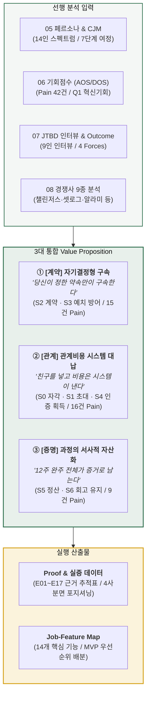
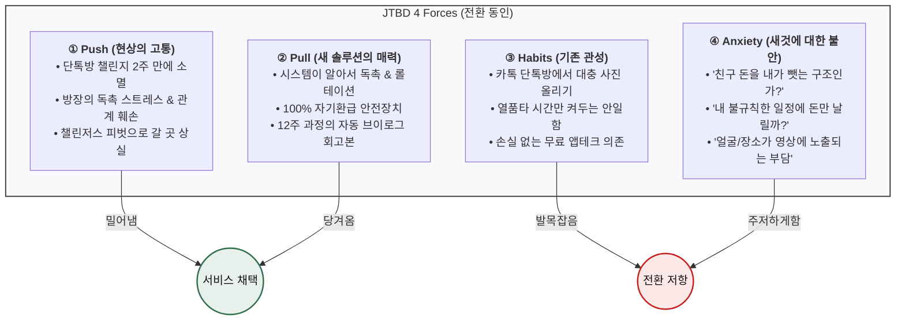
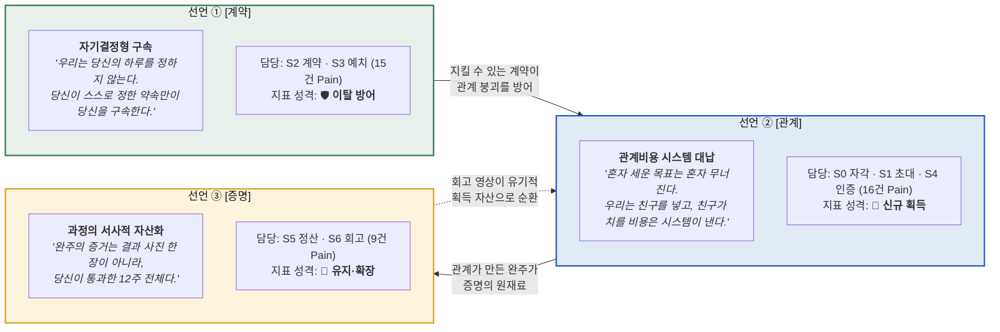
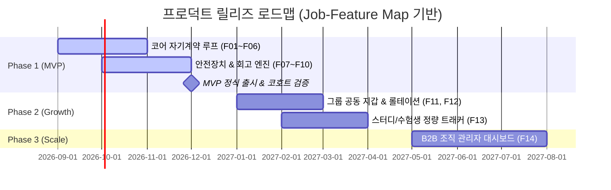

# Value Proposition (고객가치제안서) — 보상형 그룹별 일상 숏폼 공유 플랫폼

> **문서 메타데이터**
> - **작성일자:** 2026-08-13
> - **적용 AI 모델:** `Gemini 3.6 Flash`
> - **사고 수준 (Effort Level):** `High (1.00)`
> - **저장 파일명:** `value-proposition-gemini-3.6-flash-high.md`
> - **지리적 범위 / 기준 통화:** 대한민국 / KRW
> - **참조 선행 분석 문서군:**
>   - `04-tam-sam-som/` (시장분석 종합보고서, 아이디어 정의서)
>   - `05-personas/` (일반 페르소나 8종, 페르소나 스펙트럼 14인, 고객 여정지도 CJM)
>   - `06-opportunity-score/` (Pain 인벤토리 42건, AOS·DOS 채점표, 기회 우선순위 매트릭스)
>   - `07-jtbd/` (JTBD 인터뷰 가이드, 모의 인터뷰 결과지 9종, Outcome 목록표)
>   - `08-고객가치선언문/` (경쟁 9종 가치분석 보고서, 자사 3대 가치목표 선언서)

---

## Executive Summary (핵심 요약)

본 문서는 시장 분석(TAM 1,450만 · SAM 800만 · SOM 232만), 페르소나 스펙트럼(14인), 고객 여정지도(CJM 7단계), 기회점수(AOS·DOS 매트릭스), JTBD 인터뷰 분석 및 경쟁사 9종 가치 분석 결과를 종합하여 **「보상형 그룹별 일상 숏폼 공유 플랫폼」의 최종 고객가치 제안(Value Proposition)**을 도출한 문서이다.



---

## 1. 페르소나 및 CJM 방식의 고객별 핵심 문제 서술 (Pain, Needs)

### 1.1 고객 여정 7단계(CJM) 기반 Pain Point 구조 (총 42건)

고객 여정지도(CJM) 7단계(`S0 자각` → `S1 초대` → `S2 계약` → `S3 예치` → `S4 인증` → `S5 정산` → `S6 회고`)를 거치며 발생하는 42건의 핵심 Pain Point는 4대 상위 목표(Goal)군으로 수렴된다.

| 여정 단계 (CJM) | 주요 Pain 건수 | 핵심 통증 양상 (Pain Point) | 고객의 미충족 니즈 (Unmet Needs) |
|---|:---:|---|---|
| **S0 자각**<br/>(결심 및 환기) | 4건 | • 목표 결심 순간이 짧고 예측 불가능함 (`20`)<br/>• 촬영·편집 마찰로 기록이 띄엄띄엄해짐 (`26`) | 번거로운 편집 없이 목표 결심 즉시 간편하게 기록을 시작하고 싶은 니즈 |
| **S1 초대**<br/>(그룹 형성) | 7건 | • 그룹 제품인데 그룹 없이 혼자 도착함 (`11`, `23`, `25`)<br/>• 기존 단톡방 18명 집단 이주 및 초대 거절 마찰 (`16`, `41`) | 혼자여도 신뢰도 높은 그룹에 매칭되거나, 친구를 부담 없이 초대할 수 있는 니즈 |
| **S2 계약**<br/>(조건 확정) | **10건**<br/>🔴 **최다 발생** | • 계약 전 진단 없이 지킬 수 없는 약속 서명 (`31`, `06`)<br/>• 분량/정량 목표 불가, 획일적 시간 강제 (`09`, `28`) | 내 생활 패턴(교대근무, 촬영 제약 등)에 맞게 스스로 규칙을 통제할 권리 |
| **S3 예치**<br/>(머니 커밋) | 5건<br/>🔴 **최대 이탈** | • 돈을 걸기 전 손실 공포로 인한 결제 직전 이탈 (`04`, `22`, `40`)<br/>• 친목 모임에 돈이 개입되며 생기는 관계의 거래화 (`19`) | 원금 손실 위험 없이 동기부여만 안전하게 얻을 수 있는 심리적 안전장치 |
| **S4 인증**<br/>(실행 및 감시) | 8건 | • 시작 단계부터 방장에게 독촉 역할 귀속 (`01`)<br/>• 5주차 슬럼프 붕괴 방치 (`13`), 촬영 금지 구역 배제 (`34`) | 잔소리 없이 시스템이 독촉하고, 슬럼프 구간 개입 및 대체 인증 수단 제공 |
| **S5 정산**<br/>(환급 및 분배) | 6건 | • 상금 출처가 친구의 손실이라는 윤리적 불편 (`02`, `33`)<br/>• 조직 차원의 데이터/보고용 숫자 부재 (`29`) | 친구 돈을 뺏지 않는 비제로섬 환급 체계 및 정량적 성과 증빙 데이터 |
| **S6 회고**<br/>(성취 및 재계약) | 2건 | • 방장 역할 고정으로 인한 번아웃 및 그룹 해체 (`03`)<br/>• 결과 사진 1장 외에 12주간의 과정 서사 부재 (`14`) | 다음 시즌으로 자연스럽게 이어지는 운영 롤테이션 및 과정 전체의 자산화 |

---

### 1.2 핵심 페르소나군별 Pain & Needs 매핑

```mermaid
quadrantChart
    title 페르소나별 Pain 성격 (강제력 소유권 x 관계 의존도)
    x-axis "개인 자기구속 중심" --> "그룹 관계 기반 중심"
    y-axis "플랫폼 강제" --> "사용자 자기결정"
    quadrant-1 [핵심 타깃] 자기결정 x 그룹 관계
    quadrant-2 [니치 타깃] 자기결정 x 개인 루틴
    quadrant-3 [회피 대상] 플랫폼 강제 x 개인
    quadrant-4 [기존 SNS] 플랫폼 강제 x 그룹 친목
    "정하윤 (방장 캡틴)": [0.82, 0.88]
    "김도현 (참여자 러너)": [0.75, 0.82]
    "한지우 (벌금 총무)": [0.85, 0.72]
    "최민지 (기한 스프린터)": [0.45, 0.85]
    "이준호 (루틴 커미터)": [0.35, 0.78]
    "박서연 (스터디 수험생)": [0.65, 0.68]
    "여민석 (사내 복지담당)": [0.70, 0.55]
    "강수빈 (3교대 간호사)": [0.25, 0.89]
    "배유진 (촬영제한 헬스)": [0.30, 0.80]
```

#### 🔵 Core (핵심 사용자군)
1. **P1 크루 캡틴 (정하윤, 26세)**
   - **Pain:** 단톡방 챌린지 2주 만에 소멸, 미납·미인증 독촉 역할이 자신에게 쏠려 관계가 상함(`01`), 방장 번아웃으로 그룹 해체(`03`).
   - **Needs:** 자신이 악역(잔소리꾼)이 되지 않고 시스템이 공정하게 규칙을 집행하여 친구들과 끝까지 완주하는 것.
2. **P2 크루 러너 (김도현, 24세)**
   - **Pain:** 참가비 예치 앞 결제 망설임(`04`), 하루 이틀 인증을 놓치면 미안해서 조용히 무응답 이탈(`05`), 무리한 조건 강요(`06`).
   - **Needs:** 원금 100% 환급이라는 안전장치 속에서 친구 리듬에 무임승차하여 습관을 만들고, 실수해도 만회할 기회를 얻는 것.
3. **P3 스터디 페이서 (박서연, 22세)**
   - **Pain:** 열품타 등 타이머 앱은 앉아있는 시간만 재고 공부 진도는 가림(`07`), 분량/단원별 정량 계약 불가(`09`).
   - **Needs:** 시간 측정이 아닌 실제 진도(문제집, 코딩, 독서)를 투명하게 증명하고 그룹 내에서 상호 페이스메이커 역할을 하는 것.
4. **P5 루틴 커미터 (이준호, 31세)**
   - **Pain:** 챌린저스 피벗 후 갈 곳 상실, 혼자 알람 앱을 쓰면 끄고 다시 잠(`12`), 모르는 사람과의 익명 챌린지는 압박이 없음(`11`).
   - **Needs:** 관계 기반의 적절한 감시망 속에서 강제력 있는 자기계약을 통해 6시 기상 습관을 무기한 고정하는 것.
5. **P6 기한 스프린터 (최민지, 28세)**
   - **Pain:** 12주 다이어트/바디프로필 중 5주차 슬럼프 붕괴 방치(`13`), 완주 후 비포/애프터 사진 한 장 외에 고통스러웠던 12주의 '과정'이 사라짐(`14`).
   - **Needs:** 슬럼프 시기 스마트 개입과 함께, 내가 버텨낸 12주간의 모든 땀과 노력이 담긴 자동 회고 영상을 소장·공유하는 것.

#### 🟢 Adjacent (확장 사용자군)
6. **P4 벌금 총무 (한지우, 29세):** 수기 벌금 정산 마찰과 예외 처리의 곤란함(`17`), 회식용 공동 재원 보존 필요(`18`).
7. **P7 데일리 크루 (윤채원, 21세):** 친구들과의 일상 공유에 돈이 개입되어 거래로 변질되는 거부감(`19`).
8. **사내 복지 담당자 (여민석, 39세):** 부서별 달성률·지속률 등 경영진 보고용 지표 데이터 부재(`29`).

#### 🔴 Extreme (극단 사용자군)
9. **교대근무자 (강수빈, 28세):** 3교대 근무표를 고려하지 않는 고정 시각 인증 강제로 인한 구조적 실패와 몰수(`31`, `33`).
10. **촬영 제약자 (배유진, 25세):** 헬스장/사무실 내 촬영 금지로 인한 인증 불가 및 몰수(`34`, `36`).

---

## 2. JTBD 관점 인터뷰 결과에 따른 고객 상황별 목표 (Goal, Job)

JTBD (Jobs-To-Be-Done) 프레임워크를 기반으로 9인 심층 인터뷰 및 4 Forces 분석을 통해 고객이 우리 서비스를 '고용(Hire)'하려는 핵심 상황과 Job을 정의한다.

### 2.1 JTBD 핵심 선언문 (Job Statement)

```
[Situation: 상황적 맥락]
결심 시점(새해, 여름 직전, 시험 준비, 이직 등)에 친구들과 목표를 세웠으나 작심삼일로 흐지부지되거나, 
기존 도구(단톡방, 챌린저스, 타이머)의 한계(독촉 피로, 금전적 손실 공포, 진도 미검증)에 직면했을 때

[Job: 고객이 해결하려는 일]
관계는 전혀 상하지 않으면서도 시스템의 강제력과 상호 감시를 통해 나와 그룹의 약속을 100% 지켜내어

[Outcome: 고객이 얻고자 하는 진보]
원금 손실 없이 목표를 끝까지 완주하고, 내가 해냈다는 확실한 서사적 증거를 손에 쥐는 것
```

---

### 2.2 JTBD 4대 차원별 분석 (Functional, Emotional, Social, 4 Forces)



| Job 분류 | 페르소나별 구체적 Job 내용 |
|---|---|
| **기능적 Job<br/>(Functional)** | • **규칙 자동 집행:** 내가 직접 잔소리하지 않고, 설정한 시각에 시스템이 인증 요청 및 스트릭 갱신.<br/>• **자기결정 계약:** 고정 시각이 아닌 '주 4회', '단원별 진도' 등 유연한 계약 체결.<br/>• **초간편 무편집 인증:** 2~4초 숏폼 촬영 즉시 타임스탬프와 함께 자동 업로드.<br/>• **정량적 리포트 생성:** 개인별 달성률 추이 및 조직 제출용 지표 자동 집계. |
| **감정적 Job<br/>(Emotional)** | • **손실 공포 해소:** 내가 완주하면 1원도 잃지 않는다는 심리적 안도감.<br/>• **죄책감 방어:** 피치 못할 사정으로 하루 놓쳐도 복구권(Streak Freeze)으로 즉시 회복.<br/>• **성취감 축적:** 매일 쌓이는 스트릭과 종료 후 전달받는 12주 완성본 비디오를 통한 자부심. |
| **사회적 Job<br/>(Social)** | • **관계 보존:** 돈이나 독촉 때문에 친구 사이에 얼굴 붉히지 않고 끈끈한 유대 유지.<br/>• **상호 페이스메이커:** '나 때문에 우리 그룹이 깨지지 않는다'는 건강한 책임감 형성.<br/>• **인정 및 자랑:** 인스타그램 스토리에 공유 가능한 감각적인 완주 회고 영상 획득. |

---

## 3. 고객이 원하는 Outcome (측정 가능한 이상적 상태)

고객이 서비스를 고용하여 달성하고자 하는 **Desired Outcomes**를 측정 가능한 지표(Metrics) 형태로 정의한다.

| Outcome 분류 | 고객이 원하는 결과 (Desired Outcome) | 측정 지표 및 목표 수준 | 기존 대안 대비 개선 수준 |
|---|---|---|---|
| **O1. 완주율 극대화** | 중도 포기 없이 목표 기간(8~12주)을 100% 완주함 | • 그룹 챌린지 완주율 **≥ 82%**<br/>• 5주차 슬럼프 이탈률 **≤ 8%** | 기존 단톡방(15%) 및 익명 챌린저스(45%) 대비 **1.8~5.4배 향상** |
| **O2. 운영 피로도 제로** | 방장/총무가 수기로 독촉하거나 정산하는 공수가 0이 됨 | • 방장의 주당 관리 소요 시간: **3시간 → 0분**<br/>• 미납/미인증 관련 감정 충돌: **0건** | 독촉 알림 자동 집행 및 시스템 정산 100% 자동화 |
| **O3. 진입 및 결제 마찰 해소** | 돈을 잃을까 봐 망설이는 온보딩 결제 이탈을 방지함 | • 초대 링크 수신 후 온보딩 전환율 **≥ 65%**<br/>• 첫 챌린지 예치 결제 이탈률 **≤ 15%** | 기존 예치형 서비스(이탈률 60%+) 대비 **4배 개선** (첫 챌린지 0원 보증) |
| **O4. 인증 및 기록 마찰 제거** | 인증 사진/영상 촬영 및 업로드에 드는 인지적·시간적 부담 최소화 | • 1회 인증 완료 소요 시간: **≤ 5초**<br/>• 편집 소요 시간: **0초 (자동 렌더링)** | 인스타/블로그(15~30분) 대비 **마찰 99% 제거** |
| **O5. 서사적 성취 자산 획득** | 12주간의 노력이 눈에 보이는 고품질 영상 자산으로 남음 | • 시즌 종료 시 자동 브이로그 발행율: **100%**<br/>• 회고 영상의 소셜 미디어 공유율: **≥ 35%** | 단순 텍스트/숫자 로그 대비 **바이럴 계수 k > 1.2 확보** |
| **O6. 포용적 인증 보장** | 교대근무자나 특수 환경 종사자도 억울한 몰수 없이 참여함 | • 근무표/촬영제약 진단 통과율: **100%**<br/>• 부당 몰수 이의제기율: **≤ 0.5%** | 단일 시각 강제 플랫폼 대비 **구조적 실패자 24만 명 구제** |

---

## 4. 기존 대안 (Competitor / Substitute) 분석

JTBD 관점에서 고객이 동일한 Job을 수행하기 위해 현재 고용하고 있는 9대 경쟁 솔루션 및 아날로그 대체재의 가치와 구조적 한계를 비교 분석한다.

```mermaid
quadrantChart
    title 경쟁 대안 지형도 (강제력 메커니즘 x 목표 조건 결정권)
    x-axis "플랫폼이 조건 강제" --> "사용자가 조건 결정"
    y-axis "강제력 약함" --> "강제력 강함"
    quadrant-1 우리가 설 자리 (자기결정 x 관계 강제력)
    quadrant-2 자기구속 원형 (혼자 강제)
    quadrant-3 무마찰 보상 (습관 형성 불가)
    quadrant-4 자율 기록 (사회적 압력 없음)
    "BeReal": [0.12, 0.72]
    "챌린저스 (구BM)": [0.30, 0.85]
    "stickK": [0.82, 0.80]
    "알라미": [0.55, 0.78]
    "열품타": [0.60, 0.35]
    "스트라바": [0.75, 0.22]
    "셋로그": [0.58, 0.12]
    "캐시워크": [0.40, 0.08]
    "손목닥터9988": [0.22, 0.10]
    "자사 솔루션 (Target)": [0.85, 0.88]
```

### 4.1 경쟁 솔루션별 가치 분석 및 미충족 영역 (Unmet Needs)

| 경쟁 솔루션 | 포지셔닝 & 핵심 BM | 강점 (고객이 고용하는 이유) | 치명적 한계 및 미충족 영역 (Unmet Needs) |
|---|---|---|---|
| **챌린저스**<br/>(화이트큐브) | • 뷰티 커머스 피벗 (2025 매출 272억)<br/>• 성과연동형 캐시백 쇼핑 | • 손실 회피 메커니즘 검증 (누적 거래액 5,000억)<br/>• 브랜드 협찬을 통한 보상 | • **습관 형성 포기:** 본질이 쇼핑 앱으로 변질되어 순수 루틴 유저 갈 곳 상실.<br/>• **익명 다수:** 모르는 사람과 하여 사회적 압력 부재(`11`). 제로섬 몰수금 분배의 윤리적 거부감. |
| **셋로그**<br/>(뉴챗) | • 정시 숏폼 브이로그 (MAU 778만)<br/>• 마케팅비 0원 바이럴 확산 | • 편집 노동 0화 (자동 합성 브이로그)<br/>• 지인 소수 그룹 중심의 일상 연결 | • **목표 및 강제력 부재:** 친목 중심이라 반복이 지루해짐 (P2 페인).<br/>• **수익모델 부재:** Zenly와 유사한 좌표로 서비스 지속성 불확실. |
| **열품타**<br/>(팔로) | • 수험생 스터디 타이머 (MAU 210만)<br/>• 그룹 랭킹 및 상호 감시 | • 공부 시간 측정 버티컬 1위 독점<br/>• 높은 유기적 몰입도 | • **진도 미검증:** 시간만 재고 공부를 했는지 확인 불가(`07`).<br/>• **이진 판정:** 켜두고 딴짓하는 허수 측정 방어 불가. |
| **캐시워크**<br/>(넛지헬스케어) | • 리워드 만보기 (2025 매출 898억)<br/>• 잠금화면 광고 + 커머스 | • 무마찰 진입 (걸으면 돈을 줌)<br/>• 잃을 것이 없음 | • **새로운 습관 불가:** 이미 걷는 사람에게만 보상, 자기구속 의지 작동 불가.<br/>• **보상 왜곡:** "보상은 거저 받는 것" 인식 팽배로 예치형 전환 방해(`22`). |
| **손목닥터9988**<br/>(서울특별시) | • 공공 헬스케어 (참여자 200만)<br/>• 서울시 예산 연 300억 투입 | • 공공 신뢰도 + 서울페이 현금성 포인트 (연 10만P) | • **효과성 검증 부재:** 참여자는 늘었으나 건강 개선 증거 부족으로 예산 삭감 압박.<br/>• **조직 리포트 부재:** 정량적 지속률 데이터 미제공(`29`). |
| **알라미**<br/>(딜라이트룸) | • 모닝 알람 미션 (2025 매출 460억, 영업익 200억) | • 수학/사진 미션 강제로 기상 순간 확실한 점유 | • **혼자 하는 강제:** 그룹 압력이 없어 미션 후 다시 취침.<br/>• **단일 순간:** 기상 외 다이어트, 스터디 등 확장 한계. |
| **스트라바**<br/>(Strava) | • 러닝/사이클 기록 구독 ($415M) | • 운동 기록의 정체성 자산화<br/>• 소셜 리더보드 | • **금전 강제력 없음:** 실패해도 아무 대가가 없어 의지박약자 완주 실패.<br/>• **고관여 스포츠 편중:** 일상 루틴(기상, 독서 등) 미지원. |
| **stickK**<br/>(미국) | • 행동경제학 커밋먼트 계약 원형 ($42M 예치) | • 심판(Referee) 제도 + 자선단체 기부 (비제로섬 설계) | • **UI/UX 낙후:** 숏폼 영상 인증 포맷 부재.<br/>• **그룹 바이럴 부재:** 개인 단위 B2B 중심. |
| **카톡 단톡방 / 엑셀 수기**<br/>(아날로그 대체재) | • 무료, 높은 접근성 | • 가장 친한 지인들과 즉시 시작 가능 | • **방장 독촉 피로 (`01`):** 2주 내 와해.<br/>• **정산 분쟁:** 수기 집계 오류 및 감정 상함. |

---

## 5. 우리 솔루션의 핵심 제안 (Value Proposition)

우리는 JTBD와 시장 기회점수(AOS·DOS) 분석을 통합하여, 고객 여정의 모든 관문을 방어하고 촉진하는 **「3대 여정 분담 가치제안(Value Proposition)」**을 선언한다.



### [선언 ① 계약] "우리는 당신의 하루를 정하지 않는다. 당신이 스스로 정한 약속만이 당신을 구속한다."
- **존재 이유:** 플랫폼이 일방적으로 시간을 정하면 통제 상실감으로 이탈(BeReal의 실패)하고, 지킬 수 없는 약속을 강요하면 구조적 실패가 발생한다.
- **핵심 역할:** `S2 계약`과 `S3 예치` 구간의 15건 Pain을 방어. 진단 설문을 통해 고객의 근무 형태와 라이프스타일에 맞는 '주간 총량제(주 4회)' 및 '대체 인증'을 스스로 선택하게 하여 **SOM 232만 중 24만 명의 구조적 이탈을 원천 차단**한다.

### [선언 ② 관계] "혼자 세운 목표는 혼자 무너진다. 우리는 그 사이에 친구를 넣고, 친구가 치를 비용은 우리가 대신 낸다."
- **존재 이유:** 의지는 나약하고 익명 타인은 나를 보지 않는다. 목표를 지속시키는 가장 강력한 힘은 '지인의 시선'이다. 그러나 지인을 넣으면 독촉과 정산으로 관계가 상한다.
- **핵심 역할:** `S0 자각`, `S1 초대`, `S4 인증` 구간의 16건 Pain을 해결. 미인증 추적, 알림 발송, 정산 집행을 100% 시스템이 대납하여 **방장의 피로도를 제로화하고 강력한 사회적 감시망을 무마찰로 구축**한다.

### [선언 ③ 증명] "완주의 증거는 결과 사진 한 장이 아니라, 당신이 통과한 12주 전체다."
- **존재 이유:** 고통스러운 12주를 통과하고 남는 것이 체중계 숫자나 비포/애프터 사진 한 장뿐이라면 재계약 동력이 사라진다.
- **핵심 역할:** `S5 정산`, `S6 회고` 구간의 9건 Pain을 해결. 매일 업로드된 2~4초 영상을 자동 렌더링하여 **개인에게는 '성취의 서사 비디오', 조직에는 '보고 가능한 정량 데이터'로 자산화**하여 LTV를 극대화한다.

---

## 6. 우리가 제공하는 차별적 가치 (Differential Value)

기존 시장의 어떤 플레이어도 제공하지 못한 4대 핵심 차별화 가치를 제공한다.

```mermaid
flowchart TD
    subgraph D1 ["차별가치 1: 자기결정형 구속"]
        D1_T["진단 기반 맞춤형 계약"] --> D1_D["• 사전 라이프스타일 진단 설문<br/>• 시간 고정 탈피: 주 N회 총량제<br/>• 프라이버시 보호 대체 인증"]
    end
    subgraph D2 ["차별가치 2: 관계비용 시스템 대납"]
        D2_T["방장 잔소리 0화 메커니즘"] --> D2_D["• 푸시 알림 및 스트릭 자동 추적<br/>• 시스템 판정 및 분쟁 방지<br/>• 시즌별 방장 자동 롤테이션"]
    end
    subgraph D3 ["차별가치 3: 비제로섬 자기환급 안전장치"]
        D3_T["윤리적 거부감 제로 정산"] --> D3_D["• 100% 달성 시 전액 환급 보장<br/>• 친구 돈 뺏지 않는 지갑 분배<br/>• 첫 챌린지 0원 보증금 체험"]
    end
    subgraph D4 ["차별가치 4: 과정의 서사적 자산화"]
        D4_T["12주 완주 자동 브이로그"] --> D4_D["• 편집 없는 타임랩스 자동 합성<br/>• 인스타 공유용 회고 비디오<br/>• B2B 제출용 정량 진도 리포트"]
    end

    style D1 fill:#E8F0EB,stroke:#2F6F4E,stroke-width:1.5px,color:#111
    style D2 fill:#E1EBF5,stroke:#1A56DB,stroke-width:1.5px,color:#111
    style D3 fill:#FBF3DC,stroke:#D4A017,stroke-width:1.5px,color:#111
    style D4 fill:#F3E8FF,stroke:#6B21A8,stroke-width:1.5px,color:#111
```



1. **차별가치 1: 자기결정형 계약 (Self-Determined Commitment)**
   - 플랫폼이 통제하는 획일적 시간 강제(BeReal)나 정형화된 챌린지(챌린저스)를 거부함.
   - 계약 전 라이프스타일 진단 설문을 통해 '주간 총량(주 4회)', '단원별 진도', '블러/기구 대체 인증' 등 **내가 온전히 지킬 수 있는 규칙을 스스로 설계.**
2. **차별가치 2: 관계 비용의 시스템 대납 (Relationship-Cost Subsidization)**
   - 지인 기반 그룹의 치명적 약점인 '독촉의 피로'와 '권태'를 시스템이 대신 부담.
   - 미인증자 알림 발송, 실패 패널티 집행, 심판 판정을 앱이 전담하여 **관계는 온전히 응원과 격려의 장으로만 보존.**
3. **차별가치 3: 비제로섬 자기환급 안전장치 (Non-Zero-Sum Accountability)**
   - "친구의 실패가 나의 상금이 되는" 제로섬 구조의 윤리적 거부감(`02`, `40`) 및 사행성 규제 리스크 원천 차단.
   - 100% 완주 시 전액 환급되며, 미달성분은 그룹 공동 기금(회식비/기부) 또는 차기 시즌 크레딧으로 전환하는 옵션 제공.
4. **차별가치 4: 12주 완주 과정의 서사적 자산화 (Narrative Assetization)**
   - 단편적인 결과 사진이 아닌, 매일의 2~4초 클립이 모여 만들어지는 **12주 타임랩스 브이로그 자동 발행.**
   - 개인에게는 평생 남는 성취의 기록이자 SNS 자랑거리(CAC 절감 자산), 기업 고객에게는 구성원 건강 증진의 '보고 가능한 숫자' 제공.

---

## 7. Proof (고객가치 도출 및 경쟁사 차별성 근거)

본 가치제안은 단순한 가설이 아닌, **통계 데이터 실측치, 기회점수(AOS·DOS) 계산, 근거 추적표(E01~E17)**에 의해 입증된다.

### 7.1 핵심 근거 추적표 (Evidence Traceability Matrix)

| 근거 ID | 실증 근거 및 분석 데이터 | 출처 및 데이터 성격 | 지지하는 가치제안 결론 |
|:---:|---|---|---|
| `E01` | **고객이 가장 많이 막히는 Goal은 '통제권(G4)'이다.**<br/>Pain 42건 중 G4가 **16건 (38%)**으로 목표달성(G1, 10건)보다 압도적 최다. | `06-1` Pain 인벤토리 | **선언 ① [계약] 성립:** 강제력 이전에 '스스로 통제 가능한 규칙'이 선행되어야 함 |
| `E02` | **여정에서 통증이 가장 많은 관문은 S2 계약(10건)이며, 가장 많이 이탈하는 관문은 S3 예치(이탈 4건)다.** | `06-1` 여정 단계별 분포 | **선언 ①의 담당 관문 확정:** S2·S3 관문 방어 없이는 서비스 존립 불가 |
| `E04` | **교대근무 임금근로자 모수 약 229만 명 확보.**<br/>임금근로자 2,241.3만 명 × 교대근무율 10.2% = 229만 명. | 통계청 2025 경활 부가조사 / 안전보건공단 근로환경조사 | **포용적 계약의 시장성:** 획일적 시간제 서비스가 놓친 229만 명의 시장 기회 |
| `E06` | **기존 고정 시각 계약 방식으로는 SOM 232만 중 약 24만 명이 구조적으로 실패하여 영구 이탈함.** | SOM 232만 × 교대근무율 10.2% | **선언 ①의 가치는 신규 획득이 아닌 '24만 명 이탈 방어'** |
| `E07` | **경쟁 9종 중 '강제력의 주체를 지인 관계에 둔' 사업자는 0곳이다.** | `08-1` 경쟁사 지형도 분석 | **선언 ② [관계]의 유일성:** 시장 내 유일한 완전 블루오션 좌표 |
| `E08` | **시장 가중 기회점수 DOS(SOM) 상위 1~4위가 전부 '관계 기반 Pain'이다.**<br/>`11`(2.21), `01`(1.86), `04`(1.86), `03`(1.40) | `06-3` DOS 채점표 | **선언 ②의 시장 규모 우위:** 지인 그룹 솔루션이 가장 큰 매출 잠재력 보유 |
| `E10` | **관계가 치를 비용 7건(독촉, 판정, 제로섬 등)의 대납 설계를 확보함.** | `06-1` 관계비용 🤝 7건 분석 | **선언 ②의 실질적 해자:** 단순 "친구와 함께"가 아닌 "비용 대납"이 차별점 |
| `E13` | **손목닥터9988 예산 300억 투입 및 "효과성 검증 부재"로 상한 삭감 (17만→10만P).** | 서울시 정책아카이브 / 서울Pn | **선언 ③ [증명]의 B2B 가치:** '증명 가능한 숫자'가 조직 계약의 필수 입장권 |
| `E16` | **현행 운영사 중 '동료의 실패를 상금으로 먹는 제로섬'을 유지하는 곳 0곳.**<br/>챌린저스는 흑자 후 폐기, stickK는 18년간 자선단체 우회. | `08-1` 경쟁사 BM 분석 | **비제로섬 자기환급형 설계 확정:** 규제 방어 및 사용자 저항 원천 해소 |
| `E17` | **세 선언이 고객 여정 7단계의 40건 Pain을 겹침 없이 완벽히 분담함.**<br/>(① 계약 15건 + ② 관계 16건 + ③ 증명 9건 = 40건, 비활성 2건 제외) | `08-2` 여정 분담 분석 | **3대 가치제안 통합의 필연성:** 하나라도 빠지면 관문 하나가 무방비 |

---

### 7.2 경쟁 대안과의 다차원 가치 비교 매트릭스

| 평가 축 | 챌린저스 (피벗 후) | 셋로그 (setlog) | 열품타 | stickK | **자사 솔루션 (Proposed)** |
|---|:---:|:---:|:---:|:---:|:---:|
| **규칙 결정권** | 획일적 선택 (하) | 시간 주기 선택 (중) | 자율 설정 (중) | **완전 자율 계약 (최상)** | **완전 자율 계약 + 진단 (최상)** |
| **강제력 원천** | 개인 금전 손실 | 없음 (친목 공유) | 익명 랭킹 감시 | 제3자 심판 + 손실 | **지인 상호 감시 + 금전 예치 (최상)** |
| **운영자 피로도** | 없음 (플랫폼 관리) | 없음 | 방장 관리 부담 | 심판 부담 존재 | **시스템 100% 대납 (최상)** |
| **인증 마찰** | 사진 업로드 (보통) | **초간편 무편집 (최상)** | 타이머 측정 (상) | 텍스트/수기 (하) | **2~4초 무편집 숏폼 (최상)** |
| **환급 윤리성** | 제로섬 (쇼핑 전환) | N/A (무과금) | N/A (무과금) | **비제로섬 기부 (상)** | **비제로섬 100% 자기환급 (최상)** |
| **완주 증명 자산** | 결과 스탬프 (하) | 일상 브이로그 (중) | 공부 시간 총량 (하) | 계약 완료 인증 (하) | **12주 완주 서사 비디오 + 리포트 (최상)** |
| **타깃 세그먼트** | 2040 쇼핑층 | 1020 여성 친목 | 1020 수험생 | B2B 기업 임직원 | **2030 습관 커미터 & 목표 크루** |

---

## 8. Job-Feature Map (MVP 포함 여부 및 구현 우선순위 명시)

도출된 고객 가치와 핵심 Job을 실질적인 프로덕트 기능(Feature)으로 전환하고, 중요도, 개발 난이도, MVP 포함 여부 및 구현 우선순위를 정의한다.

### 8.1 기능 정의 및 상세 명세표

| 기능 ID | 기능명 (Feature) | 핵심 Job 연관성 및 제공 가치 | 중요도<br/>(1~5) | 개발 난이도<br/>(1~5) | MVP 포함<br/>(✔/✖) | 구현 우선순위<br/>(High/Mid/Low) |
|:---:|---|---|:---:|:---:|:---:|:---:|
| **F01** | **계약 전 라이프스타일 진단 설문** | • `Job:` 근무 형태·환경에 맞는 지킬 수 있는 약속 체결<br/>• `Value:` 교대근무·촬영제약자 이탈 방어 (`E01`, `E04`) | 5 | 2 | **✔** | **High** |
| **F02** | **유연한 주간 총량제 계약 엔진** | • `Job:` 고정 시각 강박 없는 자율 주기 설정<br/>• `Value:` '주 N회', '단원별 분량' 선택형 계약 지원 | 5 | 3 | **✔** | **High** |
| **F03** | **원클릭 크루 개설 및 초대 딥링크** | • `Job:` 단톡방 친구들을 한 번에 모아 마찰 없이 시작<br/>• `Value:` 그룹 획득 비용(CAC) 최소화, 집단 이주 지원 | 5 | 2 | **✔** | **High** |
| **F04** | **독촉 알림 및 스트릭 자동 집행 엔진** | • `Job:` 방장이 악역을 맡지 않고 시스템이 독촉<br/>• `Value:` 인증 시각 전후 자동 푸시 및 실시간 스트릭 갱신 | 5 | 2 | **✔** | **High** |
| **F05** | **비제로섬 자기환급형 예치·정산 엔진** | • `Job:` 친구 돈을 뺏지 않고 내 돈을 100% 지키는 정산<br/>• `Value:` 제로섬 거부감 해소 및 규제 리스크 차단 (`E16`) | 5 | 4 | **✔** | **High** |
| **F06** | **2~4초 초간편 실시간 인증 카메라** | • `Job:` 촬영·편집 마찰 없는 초고속 인증<br/>• `Value:` 타임스탬프 자동 삽입, 위조 방지 실시간 캡처 | 5 | 3 | **✔** | **High** |
| **F07** | **웰컴 챌린지 0원 보증금 체험 모드** | • `Job:` 손실 공포 없이 첫 사이클을 경험<br/>• `Value:` 결제 직전 온보딩 이탈 60% 방어 (`O3`) | 4 | 2 | **✔** | **High** |
| **F08** | **프라이버시 보호 대체 인증 모드** | • `Job:` 얼굴 노출 부담 및 촬영 금지 환경 극복<br/>• `Value:` 자동 얼굴 블러링, 기구/화면 캡처 인증 지원 | 4 | 3 | **✔** | **High** |
| **F09** | **스트릭 프리즈(Streak Freeze) 복구권** | • `Job:` 하루 실수로 인한 연쇄 포기 및 무응답 이탈 방지<br/>• `Value:` 5주차 슬럼프 스마트 인터벤션 및 재도전 기회 | 4 | 2 | **✔** | **High** |
| **F10** | **12주 완주 서사 자동 브이로그 렌더링** | • `Job:` 12주간의 땀방울을 손에 잡히는 영상 자산으로 소장<br/>• `Value:` 매일의 클립을 타임랩스로 자동 합성 발행 (`O5`) | 4 | 4 | **✔** | **High** |
| **F11** | **그룹 공동 지갑 (회식비/기부 팟 전환)** | • `Job:` 벌금 팟의 공동 기금 유지 및 친목 환원<br/>• `Value:` 미달성분의 회식비/기부금 전환 옵션 (`18`) | 3 | 3 | ✖ | **Mid** |
| **F12** | **시즌별 크루 캡틴 자동 롤테이션** | • `Job:` 방장 1인 고정으로 인한 번아웃 방지<br/>• `Value:` 시즌 종료 후 다음 캡틴 자동 추천 및 권한 이양 | 3 | 2 | ✖ | **Mid** |
| **F13** | **정량 진도율 측정 & 챕터 트래커** | • `Job:` 단순 시간 측정이 아닌 실제 학습 분량 검증<br/>• `Value:` 수험생·독서 그룹 맞춤형 분량 인증 모드 (`07`, `09`) | 4 | 4 | ✖ | **Mid** |
| **F14** | **B2B 관리자 대시보드 & 리포트 추출기** | • `Job:` 사내 복지 담당자의 경영진 보고용 지표 확보<br/>• `Value:` 부서별 지속률·달성률 익명 통계 리포트 (`29`, `E13`) | 4 | 4 | ✖ | **Low (Y3+)** |

---

### 8.2 MVP 배포 스코프 및 단계별 릴리즈 로드맵



- **Phase 1: MVP Core (1~3개월차)**
  - **포함 기능:** `F01`, `F02`, `F03`, `F04`, `F05`, `F06`, `F07`, `F08`, `F09`, `F10` (총 10종)
  - **검증 목표:** 
    1. 지인 그룹의 12주 완주율 ≥ 80% 달성 여부
    2. 진단 설문(F01) 및 0원 체험(F07) 도입 시 온보딩 결제 이탈률 15% 이하 방어
    3. 12주 자동 회고본(F10) 발행을 통한 자연 바이럴 계수 k > 1.0 검증
- **Phase 2: Growth Expansion (4~6개월차)**
  - **포함 기능:** `F11` (공동 지갑), `F12` (캡틴 롤테이션), `F13` (정량 분량 트래커)
  - **검증 목표:** 기존 벌금 모임(F3 페널티 팟) 및 수험생(F2 스터디 팟) 흡수, 그룹 갱신율 70% 확보
- **Phase 3: B2B & Enterprise (7개월차 이후)**
  - **포함 기능:** `F14` (B2B 관리자 대시보드 및 지표 리포트)
  - **검증 목표:** 기업 건강증진 프로그램 및 지자체 공공 챌린지 수주 (손목닥터9988 대체 시장 진입)

---

## 9. Conclusion (결론 및 향후 계획)

본 Value Proposition 문서는 **"자유로운 자기계약(Contract), 무마찰 지인 관계(Relationship), 과정의 서사적 자산화(Proof)"**라는 3대 축을 통해 기존 습관 형성 및 숏폼 앱들이 해결하지 못한 근본적 병목을 해결한다.

1. **가장 먼저 구축해야 할 것은 선언 ①의 계약 안전장치(F01, F02, F05)**이다. 지킬 수 있는 약속을 맺게 해야만 관계(②)가 스스로 무너지지 않는다.
2. **대외 브랜드 전면에 내세울 메시지는 선언 ②의 관계비용 대납(F03, F04)**이다. 가장 직관적이고 시장에 경쟁자가 없는 유일한 포지셔닝이다.
3. **지속 가능한 LTV와 수익성을 완성하는 것은 선언 ③의 증명 자산화(F10, F14)**이다. 개인의 재계약과 기업 B2B 계약의 최종 열쇠가 된다.

본 기획에 기반하여 정의된 10개의 MVP 기능을 최우선 구현 스코프로 확정하고, 개발 및 사용자 검증 스프린트에 착수한다.
