# 보상형 그룹별 일상 숏폼 공유 플랫폼 — Value Proposition Statement (VPS) v2.0 · 자립본

> **작성 메타**
>
> | 항목 | 값 |
> |---|---|
> | **문서 ID** | `value-proposition-0814` — **PRD의 입력 기준본** (08단계 자립 확정본 `VPS-v2.0-rooted`와 동일 내용) |
> | **이 파일의 자리** | PRD 작성은 이 문서를 **단일 입력**으로 삼는다. 다른 리서치 문서를 열지 않아도 되도록 04~08과 법률 검토의 지식이 전부 흡수돼 있다 |
> | **문서 성격** | **자립본(rooted)** — v1.0 합본의 목차를 유지한 채, **선행 리서치의 지식을 문서 안으로 전량 흡수**했다. 다른 파일을 열지 않고 이 문서만으로 근거를 확인할 수 있다 |
> | **v1.0과의 차이** | v1.0은 `04`·`05-2`·`06-1` 같은 **파일 위치로 근거를 가리켰다.** v2.0은 그 포인터를 **지식 자체 + 1차 외부 출처**로 대체했다. 내부 파일 경로 참조 **0건** |
> | **흡수한 선행 리서치** | 04 시장분석·아이디어 정의서 **(전량)** / 05 세그먼트 페르소나 8종·스펙트럼 14인·여정지도 **(개선 제안 12건 포함)** / 06 기회점수 종합 **(Pain 42건·AOS·DOS·혼합 매트릭스 전량)** / 07 JTBD 종합 **(대상 선정·문항지·리허설)** / 08 경쟁사 9종·가치목표 3안 / 법률검토 Phase 0 리스크 브리프 |
> | **흡수하지 않은 것** | 01 Five Forces · 02 가치사슬 · 03 KSF — **숙박공유·새벽배송을 대상으로 한 프레임워크 학습**이며 본 제품의 지식 원천이 아니다 |
> | **비즈니스 방향성** | **관계 우선 · 비제로섬 안전진입** — §0.6에서 확정 |
> | 작성일 / 지리적 범위 / 통화 | **2026-08-14** (v1.0: 2026-08-13) / 대한민국 / KRW |
> | 분량 | **2,076행** (초판 1,840 → 04 시장 지식 +169 → 05·06·07 잔여 지식 +67) — **자립성의 대가로 길어졌다.** 목차와 절별 요약 박스로 진입점을 만들었다 |

---

> ## 🚨 이 문서를 읽기 전에 — 근거의 성격
>
> 이 문서의 **고객 근거는 전부 미검증**이다. 정직하게 밝힌다.
>
> | 재료 | 실제 성격 | 어떻게 만들어졌나 |
> |---|---|---|
> | 페르소나 14인 | **가상 인물** | 세그먼트 맵(§0.3)의 좌표에서 연역. 실측 인터뷰가 아니다 |
> | 고객 여정지도(CJM) | **논리적 추론** | 위 14인이 7단계를 통과하는 경로를 작성자가 추론 |
> | Pain 42건 | **추론된 목록** | 페르소나·CJM에서 도출. 실사용자 신고가 아니다 |
> | AOS·DOS 점수 84개 | **작성자 판단값에서 계산** | Importance·Satisfaction 72개 값이 작성자 판단. 계산식만 표준(§3.1) |
> | JTBD 인터뷰 9건 | **`[모의]` 가상 응답** | 실제 인터뷰는 **아직 수행되지 않음**. 페르소나의 연역이라 반증 능력이 없다 |
> | 시장 모수 | `[실측]` + `[추정]` + `[러프]` 혼재 | 인구·MAU·매출은 1차 출처. 전환율·중복 제거 계수는 가정 |
>
> **표기 규약** — `[실측]` 1차 출처(정부 통계·기업 공시·조사기관) 직접 확인 / `[추정]` 실측치 + 명시 가정으로 계산 / `[러프]` 유사 시장 대입, 오차 ±50% 이상 / `[모의]` 가상 인터뷰 응답 / `[목표·미검증]` 달성 목표이지 관측값 아님 / `[판단]` 근거가 아니라 경영 의사결정
>
> **§2의 JTBD 선언은 모의 인터뷰에서 도출했다.** 원 인터뷰 설계 문서가 명시한 **절대 금지 3항**을 그대로 승계한다(§2.0에 전문 수록):
> ① 모의 응답으로 AOS·DOS를 갱신하지 않는다 ② 모의 응답의 수치를 실측치로 인용하지 않는다 ③ JTBD 요약 카드의 `Evidence` 칸에 모의 인용문을 넣지 않는다.
> 그래서 Evidence 칸에는 **관찰된 행동 신호(화면 체류시간·이동 경로)만** 남기고 `[모의]` 태그를 붙였다. 본문 어디에서도 이를 *"심층 인터뷰"*로 부르지 않는다.
>
> **경쟁사 분석(§4)과 시장 모수(§0.2·§0.3)만은 성격이 다르다** — 공개 재무·정부 통계에 기반한다. 경쟁사 출처 **52건**은 §4.1 각 카드 하단에, **시장 통계 1차 출처 49건**은 **§4.4**에 전량 수록했다.
>
> **§0.6 비즈니스 방향성과 §9는 근거가 아니라 경영 판단이다.** 근거가 가리키는 방향과 판단이 결정한 것을 구분해 표기했다.

---

## Executive Summary

본 문서는 시장 분석(TAM 1,450만 명·연 8,000억~1.1조 / SAM 800만 명·700억 / SOM 232만 명·33억), 페르소나 스펙트럼(14인), 고객 여정지도(7단계), 기회점수(AOS·DOS 84개), JTBD 분석(9인), 경쟁사 9종 가치 분석을 종합해 **「보상형 그룹 목표 인증 플랫폼」의 고객가치 제안**을 도출한다.

**한 문장 정의** — 그룹이 함께 목표를 계약하고, 짧은 영상으로 서로에게 인증하고, 목표를 달성하면 현금성 보상으로 정산받는 **그룹 단위 습관 플랫폼**.

**한 문장 가치 제안** — **혼자서는 3일을 못 넘기던 사람에게, 친구가 지켜보는 3개월을 만들어 준다.**

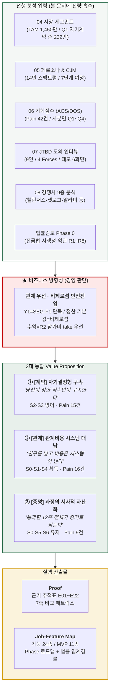

---

## 목차

| # | 항목 | 이 절이 담은 흡수 지식 |
|:-:|---|---|
| **0** | [비즈니스 방향성 — 전제 지식 · 확정 의사결정 · 정리 방침](#0-비즈니스-방향성--전제-지식--확정-의사결정--정리-방침) | 제품 정의 · 시장 규모 산식 · 세그먼트 맵 · 설계 원칙 · 수익 구조 |
| **1** | [페르소나·CJM 기반 고객별 핵심 문제 (Pain, Needs)](#1-페르소나cjm-기반-고객별-핵심-문제-pain-needs) | 세그먼트 페르소나 8종+안티 3종 · 스펙트럼 14인 카드 · 여정 7단계 · **Pain 42건 전량** · 개선 12건→기능 매핑 |
| **2** | [JTBD 선언 — 상황에 따른 목표 (Goal, Job)](#2-jtbd-선언--상황에-따른-목표-goal-job) | 인터뷰 설계·금지 규정 · 9인 선정 근거 · 데모 6화면 체류 원표 |
| **3** | [고객이 원하는 Outcome (측정 가능 형태)](#3-고객이-원하는-outcome-측정-가능-형태) | AOS·DOS **계산식과 42건 전량 점수** · 사분면 · **AOS×DOS 혼합 매트릭스** |
| **4** | [기존 대안 (Competitor / Substitute)](#4-기존-대안-competitor--substitute) | 경쟁 9종 상세 · 무료 대체재 · **출처 52건(경쟁사) + 49건(시장 통계 1차)** |
| **5** | [우리 솔루션의 핵심 제안 (Value Proposition)](#5-우리-솔루션의-핵심-제안-value-proposition) | 3선언 도출 과정 · 강제력 주체 5분류 |
| **6** | [우리가 제공하는 차별적 가치](#6-우리가-제공하는-차별적-가치) | 4대 차별가치 · 관계비용 7건 대납표 |
| **7** | [Proof — 도출 근거와 차별성 근거](#7-proof--도출-근거와-차별성-근거) | 근거 추적표 E01~E22 (**출처를 실제 데이터로 교체**) · 반증 신호 |
| **8** | [Job-Feature Map (MVP·우선순위·로드맵)](#8-job-feature-map-mvp-포함-여부-및-기능-우선순위-정리-포함) | 기능 24종 · MVP 11종 · **법률 쟁점 R1~R8 인라인** |
| **9** | [Conclusion](#9-conclusion) | 확정 스코프 |
| **부록** | [A 한계 · B 미해결 · C 방법론 · D 용어](#부록-a-이-문서의-한계) | 계산식 원본 · 세그먼트/Pain/기능 코드 사전 |

---

## 0. 비즈니스 방향성 — 전제 지식 · 확정 의사결정 · 정리 방침

> **§0.1~0.5는 흡수한 전제 지식이고, §0.6~0.8은 경영 판단이다.** 선행 분석은 여러 갈래를 열어 두었고, 그중 하나를 고르는 것은 판단의 몫이다. 무엇이 근거이고 무엇이 판단인지 구분해 적는다.

### 0.1 제품 정의와 핵심 루프

> **그룹이 함께 목표를 계약하고, 짧은 영상으로 서로에게 인증하고, 목표를 달성하면 현금성 보상으로 정산받는 그룹 단위 습관 플랫폼.**

셋로그가 만든 **"소수 그룹 × 짧은 영상 × 정기 공유"**라는 형식을 가져오되, 그 형식을 **친목이 아니라 자기계약의 이행 수단**으로 재배치한다.

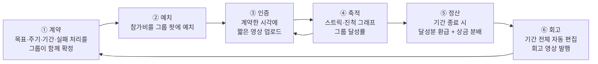

| 단계 | 사양 | 푸는 문제 |
|---|---|---|
| **① 계약** | 주기 '선택'이 아니라 **'계약'**. 시작 시 요일·시각·기간·실패 시 처리를 함께 확정하고 **계약 중 변경 불가**(자기구속) | **P1** — 트리거 소유권을 플랫폼에서 사용자에게 완전 이전. 알림이 *"플랫폼의 명령"*이 아니라 ***"내가 과거에 한 약속"***이 된다 |
| **② 예치** | 참가비를 그룹 공동 팟에 예치. 100% 달성 시 **전액 환급** | 실행 의지를 금전으로 고정 + 보상 재원을 **외부 광고 없이 자립** |
| **③ 인증** | 계약 시각 ±윈도우 내 짧은 영상 촬영. 위조 난도가 GPS보다 높음 | 그룹 상호 가시성 = 사회적 압력 |
| **④ 축적** | 스트릭 카운터 + 진척 그래프 + 그룹 달성률 보드 | **P2** — 반복을 **자산화**. 오늘의 기록이 내일의 숫자를 바꾼다 |
| **⑤ 정산** | 달성률에 따라 환급 (미달성분 처리는 §0.6 D2가 결정) | **수익화** — Zenly가 실패한 지점 |
| **⑥ 회고** | 기간 종료 시 전체 영상 자동 편집 회고본 발행 | **P2** — 반복의 결과물이 손에 잡히는 형태로 남음 |

**이 카테고리의 이탈 원인 — 두 개로 압축된다**

| 코드 | 페인포인트 | 표면 증상 | **근본 원인** | 근거 |
|---|---|---|---|---|
| **P1** | 알림 트리거의 강박 | 알림 피로 → 알림 OFF → 앱 삭제 | **트리거 소유권이 플랫폼에 있음** — *"내가 언제 찍을지를 내가 못 정한다"* | 대학생 심층 인터뷰 `[실측]` · 267명 대상 다차원 디지털 스트레스 척도 연구에서 알림 강박이 우울·불안의 직접 예측 변수로 확인 `[실측]` |
| **P2** | 콘텐츠 반복성의 지루함 | *"매일 똑같은 게 올라온다"* | **반복이 아무것도 축적하지 않음** — 어제의 기록이 오늘 아무 의미도 만들지 않음 | 필터·편집 금지 + 무작위 타이밍 = 노트북 모니터·천장 사진의 반복 양산 `[실측: arXiv 2408.02883]` |

> **P1의 목소리** — *"친구들과 하이킹 중에 누군가 '지금 비리얼 알림이 울렸으면 좋겠다'고 말했습니다. 그 순간 앱이 내 삶을 통제하고 있다는 끔찍한 기분이 들었습니다."* `[실측: 대학생 심층 인터뷰]`

**이것이 구조적 문제라는 증거** `[실측]`

| 서비스 | 무엇을 증명했나 | 수치 |
|---|---|---|
| **셋로그** | **획득은 된다** | 광고비 **0원** → MAU **778만**. 카테고리 도달 778만 / 1,450만 = **53.7%** |
| **BeReal** | **유지가 안 된다** | DAU 2,000만 → 1,040만(**−48%**) · 월 다운로드 1,200만 → 330만(**−72.5%**) · 일일 사용 **5분 미만** · 휴면 재참여율 **19%** |
| **Zenly** | **돈을 못 번다** | MAU 4,000만까지 성장했으나 **수익모델 부재**로 2023년 종료 |
| **TikTok Now** | **거대 플랫폼도 실패한다** | 2022.9 출시 → 2023년 조용히 종료 |

**시장의 기존 대응은 모두 절반이었다**

| 대응 | 사례 | 한계 |
|---|---|---|
| ① 강제성 완화 | BeReal — 늦은 게시 허용 | 재밌는 순간까지 기다렸다 올려 '진정성' 취지가 붕괴 |
| ② 트리거 제거 | Locket — 알림 없음 (누적 8,000만 DL) | 일일 리듬 훅 소멸 → 리텐션 훅을 다른 데서 확보해야 함 |
| ③ 주기 선택권 | 셋로그 — 매시간/3시간/끔 선택 | 절충안이나 여전히 **주어진 선택지 안에서만** 고르는 구조 |

> **셋 다 트리거 소유권을 사용자에게 완전히 이전하지 않았다. 여기가 공백이다.**

### 0.2 시장 규모 — TAM · SAM · SOM 산식 전량

> **시장 분석이 확정한 7가지 — 결론을 먼저 적는다**
>
> | # | 확정 사항 |
> |:-:|---|
> | 1 | **TAM = 연 8,000억~1.1조원** — 도달 가능 870만 명 × 블렌디드 ARPU 9,200원, 디지털 광고 비중으로 교차검증 |
> | 2 | **SAM = 시장 700억원 / 접근 가능 240억원** — SNS 시장 비율법과 확정 수익 구조가 각각 수렴 |
> | 3 | **SOM = Q1 자기계약 존, 3년차 연 33억원** — 밴드 20~61억, 접근 가능 SAM 대비 **13.8%** |
> | 4 | **1차 타깃 = F1 친구 목표 크루 108만 명** — *"우리 다이어트하자"*, *"같이 공부하자"*, *"책 매일 읽자"*를 **이미 말하고 있는** 친구 그룹 |
> | 5 | **핵심 메커니즘 = Q3 → Q1 좌표 이동**(§0.3) — 셋로그가 광고비 0원으로 모은 네트워크가 획득 채널이 되고, *"함께 목표를 건다"*는 한 가지 행동이 그들을 과잉정당화 위험 밖으로 옮긴다 |
> | 6 | **성립 조건 = 보상을 공유가 아니라 달성에 붙일 것**(§0.4). 이 원칙이 깨지면 F계열 전체가 Q4(회피 구역)로 되돌아간다 |
> | 7 | **진입 전 최우선 = 사행성·전자금융거래법 법률 검토**(§8.3). 부정되면 **R2 참가비 take 수익원 전체가 무너진다** |

#### (1) TAM — 연 8,000억 ~ 1조 1,000억원

> **정의** — 일정 시간마다 짧은 영상을 그룹에 공유하는 **일상 공유 플랫폼 시장 전체**(국내). 보상형 여부와 무관하며, 이 수요를 회수하는 경쟁·인접 서비스의 매출을 모두 포함한다.

**사용자 base ≈ 1,450만 명**

| 항목 | 수치 | 출처 |
|---|---|---|
| 국내 총인구 (2026.7) | **5,108만 명** `[실측]` | 행정안전부 「주민등록 인구통계」 |
| 국내 SNS 이용자 | **4,890만 명** (인구 대비 94.7%) `[실측]` | DataReportal 「Digital 2026: South Korea」 |
| SNS 이용률 (미디어패널) | **60.7%** (전년 58.1% → +2.6%p) `[실측]` | KISDI 「세대별 SNS 이용 현황」 |
| 학령기(6–21세) / 청년기(22–34세) / 중년기(35–49세) | 550.8만 / 602.2만 / 1,421.1만 `[실측]` | KOSIS 인구상황판 (2026.6) |
| **국내 숏폼 이용률** | 유튜브 쇼츠 **75%** / 인스타 릴스 **43%**(10~30대는 71~53%) / 틱톡 **20%** `[실측]` | 컨슈머인사이트 (2025.8) |

```
핵심 연령대(10–39세) 도출                                      [추정]
학령기 중 10세 이상   550.8만 × (12/16세분)   ≈ 413만
청년기 22–34세 전체                           = 602만
중년기 중 35–39세     1,421.1만 × (5/15세분)  ≈ 474만
  ※ 국내는 45–49 코호트가 더 크므로 과대 추정 → 15% 하향 = 403만
────────────────────────────────────────────────────
10–39세 합계                                  ≈ 1,418만 ~ 1,500만 명
→ TAM 인구 base ≈ 1,450만 명
```

```
TAM 금액                                                        [추정]
도달 가능 사용자 = 1,450만 × 카테고리 수용률 60% = 870만 명
  ※ 수용률 60% = 셋로그 실측 도달률 53.7% + 경쟁 서비스·미도달 잔여
× 블렌디드 연 ARPU 9,200원 (광고 5,500 + 구독·커머스 3,700) ≈ 800억원

교차검증: 국내 디지털 광고 11조 2,619억 [실측: DMC리포트 2025]
        × 소셜·커뮤니케이션 앱 비중 8~10% = 9,000억 ~ 1조 1,300억원
        + 소셜 앱 인앱결제·구독 레이어
          (Life360 ARPPC $132/년 ≈ 19만원 · 유료 Circle 280만 [실측: Life360 IR]이 증명)

참고 대사: 국내 광고산업 총 취급액 19조 7,885억원(2024), 그중 온라인 8조 19억원(56.0%)
          [실측: 광고산업조사] — 집계 기준이 달라 직접 비교는 불가하나 자릿수는 정합한다
```

**TAM은 경쟁 서비스 전체가 나눠 갖는 시장이다.** 따라서 이 수요를 흡수하는 인접재 — 인스타 스토리·클로즈프렌즈, 카카오톡, 숏폼 플랫폼, 앱테크 앱 — 의 광고·구독 매출까지 포함해 잡았다.

**ARPU 벤치마크** `[실측 매출 / 추정 ARPU]`

| 서비스 | 매출 | 사용자 | 연 ARPU | 성격 |
|---|---|---|---|---|
| BeReal (Voodoo) | €30M (2025) | MAU 4,000만+ | 약 1,180원 | 순수 광고, 수익화 1년차 |
| Locket | $14M (연 추정) | DAU 900만 | 약 2,230원 | 위젯 + 셀럽 슬롯 |
| **캐시워크(넛지헬스케어)** | **1,056억원 (2023)** | MAU 600만(2020) | **10,560~17,600원** | 국내 보상형 |
| Life360 | $489.5M (FY2025) | MAU 9,580만 | 약 7,300원 | 안전 구독 + 광고 |
| 당근 | 2,690억원 (2025 별도) | MAU 약 1,900만 | 약 14,160원 | 로컬 광고 |

> ⚠️ **TAM은 의사결정 변수가 아니다.** 오차가 크므로 단독으로 투자 판단 근거로 쓰지 말 것. 실질 판단은 SAM·SOM에서 이뤄진다.

#### (2) SAM — 시장 700억원 / **접근 가능 240억원**

> **정의** — TAM 중 **보상형**, 즉 공유·인증·달성 행위에 명시적 보상이 지급되어 참여를 구동하는 시장.

보상형 시장을 직접 집계한 통계는 없다. 따라서 **비율을 실측으로 고정한 뒤 곱한다.**

| 보상형 비율 ① 사용자 기준 | 수치 | 출처 |
|---|---|---|
| 국내 리워드 광고 참여자 | **1,870만 명** = 전 국민 **36.6%** `[실측]` | 버즈빌 「2025 리워드 광고 트렌드 리포트」 |
| 최근 1년 내 리워드 앱 이용 | **37.7%** `[러프·2차 출처]` | 나무위키 「보상형 플랫폼」 인용 조사 |
| 재테크 경험자 중 앱테크 이용률 | **51.1%** `[실측]` | 대학내일20대연구소 (2025) |
| **Z세대 앱테크 이용률** | **62.4%** (세대 최고) `[실측]` | 동일 |

```
보상 수용률 = 62.4%(Z세대) × 68.7% + 36.6%(그 외) × 31.3%
            = 42.9% + 11.5% = 54.3%  →  55% 적용            [추정]
  ※ 68.7% = 셋로그 사용자 중 10~20대 비중 [실측]
```

| 보상형 비율 ② 매출 기준 | 계산 | 비율 |
|---|---|---|
| X(구 트위터) | 크리에이터 배분 월 $5M ≈ 연 $60M ÷ 광고매출 $2.26B(2025) | **2.7%** |
| 국내 리워드 광고 시장 | 2,250억~3,380억 ÷ 디지털 광고 11조 2,619억 | **2.0~3.0%** |
| 캐시워크 단독 | 1,056억 ÷ 11조 2,619억 | **0.94%** |
| TikTok — 일부 보상 제도 | Creator Rewards 1,000뷰당 $0.40~$1.00 (구 Creator Fund $1B 대체) `[실측]` | 총액 미공개 |
| Steemit — 보상형 커뮤니티 원형 | 등록 사용자 약 **124만**, 콘텐츠 보상 전액을 토큰으로 환류 `[실측]` | 참고 좌표 |

→ **매출 기준 보상형 비율 = 2~3%** `[추정]`. 위 세 계산(X · 리워드 광고 · 캐시워크)이 독립적으로 같은 밴드에 들어온다. TikTok·Steemit은 총액이 없어 밴드 산출에는 쓰지 않고 **좌표로만** 둔다.

> ### ⚠️ 이 시장의 정체 — 사용자 55% vs 매출 2~3%
> 사람의 **3분의 1 이상**이 보상형을 쓰는데 매출로 회수된 비율은 **2~3%**다. 수요는 있으나 **수익화 구조가 미개척**이라는 뜻이며, 진입 기회이자 동시에 *"쉽게 돈이 되지 않는다"*는 경고다.

```
경로 A — 사용자 비율법
  TAM 인구 1,450만 × 보상 수용률 55% = 800만 명 (SAM 사용자 base)
  × 보상형 연 ARPU 8,700원            = 약 696억원

경로 B — SNS 시장 비율법
  디지털 광고 11조 2,619억 × SNS 비중 25~30% = 2.8조~3.4조
  × 보상형 비율 2~3%                          = 560억~1,020억 (중앙 790억)

경로 C — 접근 가능 SAM (광고 수익원 배제 반영)
  TAM 8,000억~1.1조 × 보상형 실현 비율 2~3% = 160억~330억
  확정 수익 구조: 구독 180억 + 참가비 take 60억 = 240억원 ✅ 밴드 중앙
```

| 구분 | 금액 | 밴드 | 근거 |
|---|---|---|---|
| **시장 SAM** | **약 700억원** | 560억~1,020억 | 경로 A 696억 ↔ 경로 B 790억 수렴 |
| **접근 가능 SAM** | **약 240억원** | 160억~330억 | 경로 C ↔ 확정 수익 구조 수렴 |

> **갭 460억원 = 광고 수익원.** 추정 오차가 아니라 **의도적으로 포기한 부분**이다(§0.5). 광고주 영업 없이 Day 1부터 재원이 자립하고 Zenly형 종료 리스크가 제거되는 대가로 시장의 66%를 접는다. **시장은 좁아지지만 생존은 확실해진다.**

#### (3) SOM — 3년차 연 33억원 (밴드 20~61억)

**SOM 모집단 = Q1 자기계약 존 232만 명** (§0.3)

> **왜 Q1 다섯 세그먼트 전체가 하나의 SOM인가** — F1·F2·F3·A1·A2는 **하나의 제품으로 커버된다.** 다섯 모두 *"목표를 정하고 → 주기를 계약하고 → 그룹에 짧은 영상으로 인증하고 → 재원을 정산한다"*는 **동일 흐름**이며, 차이는 **그룹의 기원**(친구 / 익명) · **목표의 기한**(무기한 / 기한형) · **재원 출처**(본인 / 그룹 상호) 세 가지뿐이다.

| | Year 1 | Year 2 | Year 3 |
|---|---|---|---|
| **범위** | **F1 친구 목표 크루**(운동·다이어트) | + F2 스터디 팟 + A1 | Q1 전체 (F + A) |
| **모집단** | 108만 | 232만 | 232만 |
| **침투율** `[추정]` | 4% | 8% | 16% |
| **MAU** | **4.3만** | **18.6만** | **37.1만** |
| **연 ARPU** `[추정]` | 4,000원 (수익화 착수 전) | 7,000원 | 9,000원 |
| **매출** | **1.7억원** | **13억원** | **33억원** |

> **Y3 ARPU 9,000원의 구성** `[추정]` — 참가비 take 6,750원(참가비 3만원 × 연 1.9회 × take 12%) + 구독 2,250원(유료 전환 3% × 연 75,000원). **광고 수익 0원.**

| 시나리오 | Y3 MAU | ARPU | Y3 매출 | 접근가능 SAM(240억) 대비 |
|---|---|---|---|---|
| 보수 | 25만 | 8,000원 | **20억원** | 8.3% |
| **기준** | **37.1만** | **9,000원** | **33억원** | **13.8%** |
| 낙관 | 55만 | 11,000원 | **61억원** | 25.4% |

> **SOM / 접근 가능 SAM = 13.8%** — 신규 진입자가 3년 내 확보할 점유율로 합리적 범위(5~15%) 안 ✅ / **SOM / 시장 SAM = 4.7%**
>
> ⚠️ **침투율 가정의 취약점** — Y3 16%는 셋로그의 자연 도달률 53.7%보다 낮아 보수적으로 읽히지만, 셋로그는 **비보상형 무료 서비스**로 마찰이 없었다. 보상형은 정산·세무·어뷰징 방지라는 구조적 마찰이 추가되므로 **동일 확산 속도를 가정해선 안 된다.**

### 0.3 세그먼트 맵 — 진입 좌표와 규모

**왜 나이·성별로 자르지 않는가** — 이탈 원인이 **인구통계가 아니라 구조**이기 때문이다. *"20대 여성"*이라는 묶음은 P1·P2를 설명하지 못한다. 그래서 **P1·P2의 근본 원인 두 개를 그대로 축으로 세운다.**

| 축 | 이름 | 양 끝 | 대응 Pain |
|---|---|---|---|
| **Y (세로)** | **트리거 소유권** | 아래 = 플랫폼·기관이 시각 지정 (P1 높음) / 위 = 사용자·그룹이 시각 계약 (P1 낮음) | **P1** |
| **X (가로)** | **반복 목적의 소재** | 왼쪽 = 관계 유지가 목적 (P2 높음) / 오른쪽 = 관계 밖 목표가 있음 (P2 낮음) | **P2** |

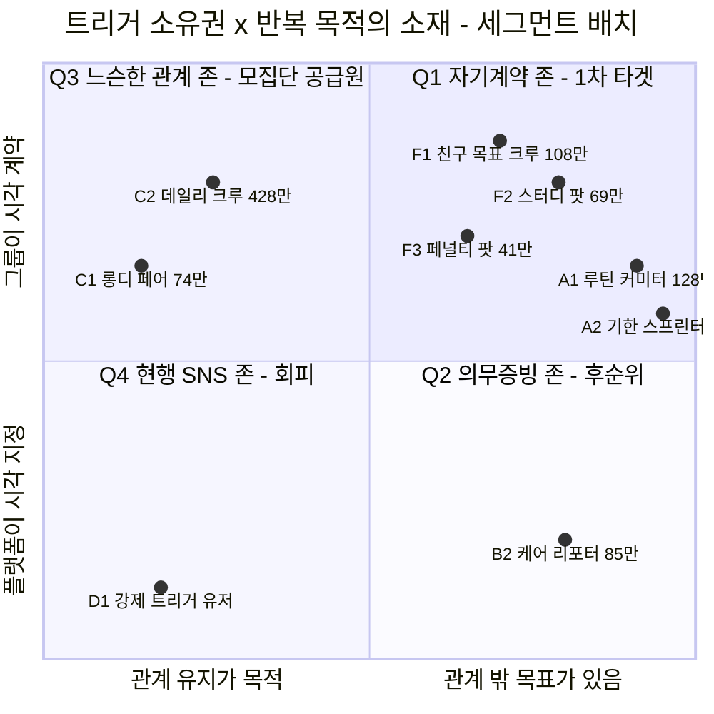

| 사분면 | 세그먼트 | 규모 | 판정 |
|---|---|---|---|
| 🔵 **Q1 자기계약 존 ★** | **F1 친구 목표 크루 108만** · F2 스터디 팟 69만 · F3 페널티 팟 41만 · A1 루틴 커미터 128만 · A2 기한 스프린터 40만 | **중복 제거 232만 명 / 263억원** | **1차 타깃 · SOM 코어** — P1·P2 낮음, 과잉정당화 **없음** |
| 🟠 **Q3 느슨한 관계 존** | C2 데일리 크루 428만 · C1 롱디 페어 74만 | 502만 명 / 309억원 | **직접 타깃 ✕ · 공급원 ○** — 이 중 **143만이 Q1으로 이동 가능** |
| ⚪ **Q2 의무증빙 존** | B2 케어 리포터 85만 | 85만 명 / 153억원 | **후순위(Y3+)** — ARPU 최고(18,000원)이나 기관 B2B라 제품이 다름 |
| 🔴 **Q4 현행 SNS 존** | D1 강제 트리거 유저 (BeReal 원형) | 정량화 제외 | **진입 금지** — P1·P2·과잉정당화 동시 최대 |

> **맵 읽는 법** — 가로축은 *"반복에 관계 밖의 목표가 있는가"*(→ P2 해소), 세로축은 *"촬영 시각을 누가 정하는가"*(→ P1 해소)다. **오른쪽 위로 갈수록 두 페인포인트가 동시에 낮아지고**, 그 칸이 Q1이다.
>
> **맵이 즉시 알려주는 것** — **BeReal은 Q4에, 셋로그는 Q3에 있다.** BeReal의 리텐션 붕괴는 실행 실패가 아니라 **좌표의 결과**다. 그리고 **보상을 Q4에 붙이는 것이 최악**이다: 관계형(내재 동기 有) × 외부 트리거(자율성 박탈)에 유형 보상을 얹으면 세 실패 요인이 동시에 작동한다.

**세그먼트별 단가 — 도달 가능 · 연 ARPU · 금액** `[추정]`

| 계열 | 코드 | 무엇을 하는 사람인가 | 도달 가능 | 연 ARPU<br/>(접근가능) | 금액 |
|---|---|---|---:|---:|---:|
| **F** 관계 기원 | **F1** 친구 목표 크루 | *"우리 다이어트하자"* — 친구 그룹의 운동·체중·생활습관 공동 목표 | **108만** | 7,000원 | **76억** |
| | **F2** 스터디 팟 | *"매일 공부하자", "책 매일 읽자"* — 학습·독서 공동 목표 | **69만** | 6,000원 | **41억** |
| | **F3** 페널티 팟 | 불참 시 벌금 규칙을 **이미 운영 중인** 스터디·동아리 | **41만** | 6,000원 | **25억** |
| **A** 개인 기원 | **A1** 루틴 커미터 | 운동·기상·공부 등 **무기한 습관**에 스스로 돈을 걸고 인증(챌린저스형) | **128만** | 6,000원 | **77억** |
| | **A2** 기한 스프린터 | 바디프로필·수험·감량 등 **종료일이 정해진** 단기 집중 목표 | **40만** | **12,000원** | **48억** |
| 공급원 | C2 데일리 크루 / C1 롱디 페어 | 순수 일상 공유 (직접 타깃 ✕) | 428만 / 74만 | — | 235억 / 74억 |
| 후순위 | B2 케어 리포터 | 기관 단위 돌봄·복지 증빙 | 85만 | **18,000원** | 153억 |

> **A2의 ARPU가 F계열의 2배다.** 종료일이 박혀 있어 참가비를 높게 걸고(최민지형 *"중간에 포기하면 진짜로 아프기를 원한다"*), 대신 **단발로 끝날 위험**이 함께 붙는다. B2는 ARPU 최고(18,000원)이지만 기관 B2B라 제품이 다르다.

**세그먼트별 규모 산식** `[추정 / 러프]`

```
F1 친구 목표 크루  108만                                        [추정]
① 셋로그 MAU (그룹 일상 공유 실사용 인구)     778만 명  [실측: 와이즈앱 2026.5]
② × 생활체육 규칙적 참여율 62.9%             = 489만 명  [실측: 문체부 2025]
③ × 친구 동반 실천 비율 40%                  = 196만 명  [러프] ← 가장 약한 고리
④ × 보상 수용률 55%                          = 108만 명

F2 스터디 팟  69만                                              [러프]
① 열품타 MAU 210만 (누적 1,200만 · DAU 66만) × ② 그룹 기능 실사용 60%
  = 126만 × ③ 보상 수용률 55% = 69만
  ※ 인접 모집단(중복이라 별도 가산 안 함): 성인 연간 독서율 38.5%, 성인 독서활동 중
    독서모임 참여 비중 1위 [실측: 문체부 2025 국민독서실태조사]

F3 페널티 팟  41만                                              [러프]
① 모임 앱 누적 615만(소모임 500 + 문토 100 + 트레바리 15) × MAU 전환 15% ≈ 92만
② + 카톡 기반 앱 외부 모임 1.7배 ≈ 250만 × ③ 벌금 규칙 운영 30% = 75만 × 55% = 41만

A1 루틴 커미터  128만                                           [추정]
① 만 10세 이상 4,870만 × ② 생활체육 참여율 62.9% = 3,063만
③ × 20~49세 비중 42.3% = 1,296만 × ④ 디지털 인증 앱 사용률 18% = 233만
  (근거: 손목닥터9988 참여자 200만 / 서울 인구 940만 = 21.3% [실측] → 15% 하향)
⑤ × 보상 수용률 55% = 128만

A2 기한 스프린터  40만                                          [러프]
⚠️ 도출 산식이 원자료에 기재되지 않은 유일한 세그먼트다. 40만은 A1 대비 규모 비율로
   잡힌 값이며, 다른 넷과 달리 ①~⑤ 단계를 재현할 수 없다. 파일럿 전까지 [러프]로 둔다.

Q1 합계 — 중복 제거
F계열 218만 × 0.75(상호 중복 25%) = 164만
A계열 168만 × 0.75(A1↔A2 40%)    = 126만
(164+126) = 290만 × 0.80(A↔F 교차 20%) = 232만  ← SOM 모집단
  ※ 0.75 · 0.80은 근사값이며, 실제 겹침률은 파일럿 설문으로만 측정된다 [러프]
```

| | 도달 가능 | 시장 기준 금액 | 접근 가능 금액 |
|---|---:|---:|---:|
| 단순 합 (중복 포함) | 386만 명 | 438억원 | 267억원 |
| **중복 제거 0.60 적용** | **232만 명** | **263억원** | **160억원** |

> **A1 128만의 교차검증** `[추정]` — 챌린저스 누적 거래액 5,000억 ÷ 평균 참가비 3만원 = 누적 **1,667만 건** ÷ 5.5년 ÷ 1인 연 4회 = **연간 활성 참여자 약 76만 명**. 도달 가능 128만의 **59%**인데, 1위 사업자 **단독** 점유율로는 높은 편이다 → A1 산식 ④의 *"디지털 인증 앱 사용률 18%"* 가정이 **오히려 보수적**일 수 있다.

> **핵심 메커니즘 — Q3는 배제 구역이 아니라 공급원이다.** 셋로그가 **광고비 0원으로 모은 778만 명의 친구 그룹 네트워크**가 우리의 획득 채널이 된다(CAC ≈ 0). 그리고 *"함께 목표를 건다"*는 **한 가지 행동**이 그들을 과잉정당화 위험 밖으로 옮긴다(143만 전환).
>
> **챌린저스형(A계열)의 최대 약점은 획득이었다** — 크루는 학급처럼 자동으로 생기지 않는다. **F계열은 그룹이 이미 형성돼 있어 그 약점이 없다.** 이것이 §0.6 D1의 근거다.
>
> **시장 공백** — 챌린저스는 2023년 초 뷰티 커머스로 피벗했다(2024년 매출 150억) `[실측]`. **5,000억이 증명한 WTP는 남았고, 이를 회수할 사업자는 없다.**

**타깃하지 않는 구역과 그 이유**

| 구역 | 세그먼트 | 규모 | 왜 지금 가지 않는가 |
|---|---|---:|---|
| Q3 | C1 롱디 페어 | 74만 / 74억 | 그룹 크기 2명 → **바이럴 계수 구조적으로 1 미만**, 관계 종료 시 이탈률 100% |
| Q2 | B2 케어 리포터 | 85만 / 153억 | ARPU 최고이나 **기관 단위 B2B** — 제품·영업·정산이 전부 다름 |
| Q2 | B1 현장 증빙 워커 | 77만 / 116억 | **노동 감시 도구 전용 리스크** — 범위 밖 |
| Q2 | B3 캠페인 참여자 | 435만 / 131억 | 조달·입찰 6~12개월, ARPU 3,000원 — 범위 밖 |
| Q4 | D1 강제 트리거 유저 | — | **회피 좌표** — BeReal DAU −48%, 재참여율 19%, TikTok Now 종료 |

**SAM 대사 — 세그먼트를 다 더하면 §0.2의 SAM과 맞는가** `[추정]`

| 구역 | 도달 가능 | 금액 (시장 기준) |
|---|---:|---:|
| Q1 자기계약 존 (중복 제거 후) | 232만 | 263억 |
| Q3 잔여 C2(285만) + C1(74만) | 359만 | 231억 |
| Q2 B2 케어 리포터 | 85만 | 153억 |
| **합계** | **676만** | **647억** |
| **SAM (§0.2)** | 800만 | **700억** ✅ 근사 |

> **바텀업(세그먼트 합산 676만·647억)과 톱다운(비율법 800만·700억)이 ±8% 안에서 만난다.** 두 경로가 완전히 독립은 아니지만(둘 다 보상 수용률 55%를 공유), 세분화 과정에서 세그먼트를 빠뜨리거나 이중 계상하지 않았다는 **정합성 점검**으로는 유효하다.

### 0.4 설계 원칙 — 보상을 어디에 붙이는가 (이 제품의 성립 조건)

원안은 **"짧은 영상을 공유할 때마다 포인트 적립"**이었다. 이를 **"계약한 목표를 달성했을 때 정산"**으로 확정했다. **이 원칙이 깨지면 F계열 전체가 Q4(회피 구역)로 되돌아간다.**

| | 원안 (공유 시 적립) | **확정안 (달성 시 정산)** |
|---|---|---|
| 보상이 붙는 대상 | 공유 행위 | **목표 달성** |
| 훼손되는 내재 동기 | 친구 관계 (있음 → 훼손) | **없음** — 운동·습관 인증엔 애초에 재미가 없다 |
| 어뷰징 형태 | 무의미한 영상 양산 | 인증 위조 (난이도 훨씬 높음) |
| 영상의 역할 | 보상 청구 수단 | **달성의 증빙 + 그룹의 상호 감시** |
| 세분화 맵 좌표 | Q4 현행 SNS 존 ⛔ | **Q1 자기계약 존 ★** |

**가설 검증 — 지지 증거와 반증 증거를 함께 둔다**

| # | 지지 증거 | 수치 `[실측]` |
|:-:|---|---|
| S1 | **목표에 돈을 거는 WTP가 실재한다** | 챌린저스 누적 거래액 **5,000억원**, 누적 사용자 **171만 명**(2024.3), 2023년 첫 연간 흑자 |
| S2 | **보상 수용층이 이미 크다** | 국내 리워드 광고 참여자 **1,870만 명**(전 국민 36.6%), Z세대 앱테크 **62.4%** |
| S3 | **반복이 숫자로 쌓이면 지루함이 사라진다** | Duolingo 스트릭 → 커밋먼트 **+60%**, 이탈률 47%(2020) → **28%**, DAU 월간 잔존 **55%** |
| S4 | **보상형 사업은 실제로 돈이 된다** | 캐시워크 2023 매출 **1,056억원** — 2020년 328억 대비 3.2배 |

| # | 반증 증거 | 내용 `[실측]` |
|:-:|---|---|
| R1 | **과잉정당화 효과** | 이미 내재적으로 동기부여된 활동에 유형 보상을 붙이면 **내재 동기가 실질적으로 훼손**된다 — Deci, Koestner & Ryan (1999, 2001) 메타분석 |
| R2 | **목적 전도(Streak Creep)** | 사용자가 스트릭 연장을 **기저 활동보다 더 중요하게** 여기는 전도 — *Journal of Consumer Research* |

> ### 조건부 결론 — 가설 H는 "무조건 참"이 아니라 "조건부 참"이다
>
> | 무엇에 보상을 붙이는가 | 훼손되는 내재 동기 | 판정 |
> |---|---|---|
> | 친구에게 **일상 영상을 올리는 행위** | 관계 그 자체 (있음) | ⛔ **가설 기각** — 이탈 가속 |
> | 친구 그룹이 함께 건 **목표의 달성** | 없음 — 다이어트·공부·독서 인증엔 애초에 재미가 없다 | ✅ **가설 지지** |
>
> ⚠️ **이 결정은 반증 가능하게 설계할 것.** 과잉정당화 효과의 *크기*에는 학계 논쟁이 있다(Cameron & Pierce 반론 ↔ Deci 등 재반박). 원안을 **소규모 A/B 셀로 남겨 실측**한다.

**이 결론이 제품에 부과하는 사양** — P1 강박 → 트리거 소유권을 그룹에게 완전 이전(계약·변경 불가) / P2 지루함 → 반복의 자산화(스트릭·달성률 보드·회고본) / R1 → 보상을 **달성**에 연결 / R2 → 스트릭 페널티에 **상한** + 복구권(streak freeze).

**어뷰징 방어 (MVP 필수 사양)** — 현금이 걸리면 반드시 발생한다.

| 벡터 | 방어 |
|---|---|
| 과거 영상 재업로드 | 촬영 시점 서버 검증 · 갤러리 업로드 차단 (실시간 촬영만) |
| 타인 영상 도용 | 영상 해시 중복 검사 |
| 유령 그룹 (자기 계정 다수) | 그룹 생성 시 본인 인증 · 기기 지문 · 동일 결제수단 탐지 |
| 담합 (서로 눈감아주기) | 그룹 내 상호 검증 + 랜덤 샘플 심사 |
| 대리 인증 | 얼굴 일관성 검사 ⚠️ **개보법 민감정보 쟁점** — §8 R6 참조, Y1 배제 |

### 0.5 수익 구조 — R1 · R2와 자금 흐름

| # | 수익원 | 과금 대상 | 산정 근거 | 규모 `[추정]` |
|---|---|---|---|---|
| **R1** | **그룹 단위 프리미엄 구독** | 그룹장 또는 개인 | SAM 800만 × 유료 전환 3% × 연 75,000원 | **약 180억원** |
| **R2** | **챌린지 참가비 take (12%)** | 챌린지 참가자 | 챌린저스 연 GMV 500억 수준 × take 12% | **약 60억원** |
| ❌ 배제 | 브랜드 스폰서 챌린지 | — | 광고주 영업 의존, UX 오염 | (약 **400억원** 포기 — 단일 최대 수익원) |
| ❌ 배제 | 리워드 광고 오퍼월 | — | '앱테크 앱' 이미지가 일상 공유 UX와 충돌 | ARPU가 캐시워크 수준(5,470원)에 수렴할 위험 회피 |

**R1 유료화 대상 후보** — 영상 보관 무제한(무료 30일) · 그룹 인원 상한 해제 · 회고본 고화질 발행·다운로드 · 상세 진척 분석 · 복구권 추가 지급. 벤치마크: BackThen 월 $6.49(200GB), Between 인앱 구매 `[실측]`.

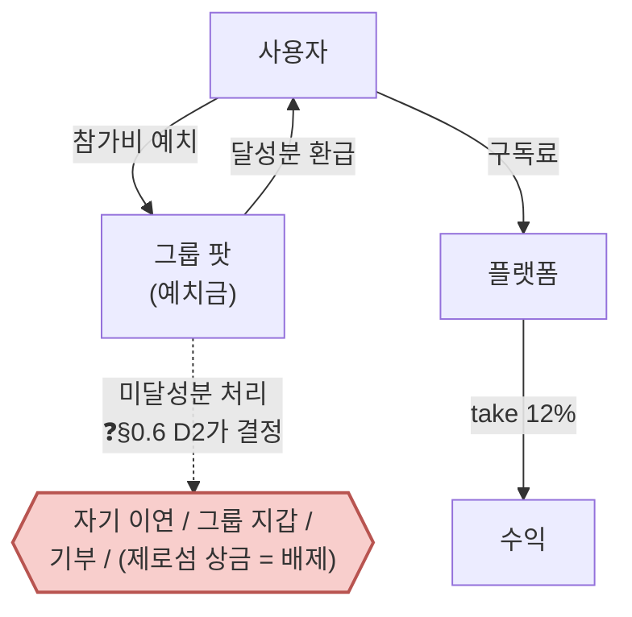

> **구조적 특징** — 보상 재원에 **외부 광고주가 없다.** 사용자가 낸 돈이 사용자에게 돌아가고 플랫폼은 그 흐름에서 수수료를 뗀다. Zenly형 *"수익모델 부재로 종료"* 리스크가 구조적으로 제거된다.
>
> **완화 프레이밍** — 참가비는 *"거는 돈"*이 아니라 ***"나에게 맡기는 돈"***이다. 100% 달성 시 전액 환급이므로 성실한 사용자에게 손실은 0이다. **온보딩 카피와 첫 챌린지 설계에서 이 프레이밍이 전환율을 좌우한다.**
>
> ⚠️ **원 설계는 미달성 몰수분을 ⅓ 플랫폼 take / ⅔ 달성자 상금 풀로 배분하는 제로섬이었다.** §0.6 D2가 이를 **비제로섬으로 교체**했고, §8의 법률 검토가 그 판단을 지지한다(R1 도박·사행행위).

### 0.6 확정 방향 — 관계 우선 · 비제로섬 안전진입

| # | 의사결정 | 확정 내용 | 근거가 가리킨 것 | 판단이 더한 것 |
|:-:|---|---|---|---|
| **D1** | **진입 세그먼트** | **Y1은 `SEG-F1` 친구 목표 크루(108만 명) 단독.** `SEG-A1` 루틴 커미터는 Y2, 조직(B2B)·개인 무료 트랙은 Y2~3 | Q1 자기계약 존이 1차 타깃(§0.3). **F계열은 그룹이 이미 형성돼 CAC 최저**이고, 셋로그 네트워크(778만)가 획득 채널 | 점수 1위(`11` DOS **2.21**)인 `SEG-A1`을 **Y2로 미루는 것**은 점수가 아니라 진입 순서 판단 |
| **D2** | **정산 기본값** | **비제로섬 자기환급을 기본값으로 확정.** 그룹 지갑·제로섬은 선택지로 열되 기본 노출하지 않음. **법적 확정은 검토 후** | `E16` — 경쟁 9곳 중 **제로섬 현행 운영사 0곳**, 챌린저스는 흑자 후 폐기, stickK는 18년 우회(§4.1) | 3선언 도출 문서가 결정을 유보했으나, **유보 상태로 MVP를 만들 수 없으므로 기본값을 판단으로 정함** |
| **D3** | **수익 순서** | **R2 참가비 take 우선 → R1 구독 → 조직 계약.** 개인 무료 트랙은 매출이 아니라 획득 자산 | 수익 구조 R1·R2(§0.5) + 개인/그룹/조직 3층 구조 | 3층을 **동시에 열지 않고 순차로** 여는 것이 판단. 조직 경로는 모수가 `보류`라 후순위 |
| **D4** | **브랜드 전면 문장** | **선언 ② 관계**를 대외 메시지로. 선언 ①은 제품 전제, 선언 ③은 리텐션·확장 | 선언 ②만 **경쟁 공백 0곳**이고 한 문장으로 전달됨(§5.2) | 셋 다 유효하다는 결론은 유지하되, **말할 순서를 하나로 고정** |

### 0.7 이 방향이 포기하는 것 — 명시해 둔다

| 포기 | 무엇을 잃나 | 왜 감수하나 |
|---|---|---|
| 제로섬 상금 구조 | *"벌 수 있다"*는 **강한 유인.** 챌린저스가 5,000억 거래액을 만든 바로 그 메커니즘 | 사행성 심사 리스크 + Pain `02`·`19`·`33`·`40` 4건이 동시에 살아남음. `E16`이 가리키는 방향과 반대로 가는 부담이 더 크다 |
| Y1의 `SEG-A1` 진입 | **DOS 최고(2.21)** 세그먼트를 1년 늦춤 | 오픈 매칭 품질 통제(F14)가 난이도 4이고, 그룹이 없는 개인 유입은 온보딩이 다르다 |
| 조직(B2B) 조기 진입 | 손목닥터9988이 증명한 **연 300억 예산 시장** | 영업 사이클이 길고 조직 경로 모수가 `계산 보류`. 개인 트랙 레퍼런스 없이 품의를 통과시키기 어렵다 |
| 개인 무료 트랙 조기 오픈 | 회고본 바이럴 획득(CAC↓) | 무료 트랙은 매출이 0인데 **F04·F11 개발 부담은 동일**. Y1 자원을 과금 루프에 집중 |
| 광고 수익원 2종 | **약 400억원** (접근 가능 SAM이 700억 → 240억, −66%) | 광고주 영업 없이 **Day 1부터 재원 자립**, Zenly형 종료 리스크 구조적 제거 |

### 0.8 정리 방침 — 이 방향이 문서를 어떻게 지배하는가

| 절 | 방향성이 결정한 것 |
|---|---|
| §3 Outcome | **Y1 스코프 표기 추가.** O1(`SEG-A1`)·O9(조직)은 Y2+로 이연 |
| §5 핵심 제안 | 선언 ②를 **대외 문장**으로, ①③은 지지 구조로 배치 |
| §6 차별적 가치 | **비제로섬 자기환급**을 차별가치 3으로 승격 (D2 반영) |
| §8 Job-Feature Map | **MVP 11종** 확정 — D1(SEG-F1 루프)이 포함 기준, D2가 F06 기본값을 결정 |
| §8.2 로드맵 | Phase 1=개인 그룹 과금 / Phase 2=확장 세그먼트 / Phase 3=조직 (D3 순서) |

> **⚠️ 이 방향이 뒤집힐 조건** — ① 법률 검토에서 **비제로섬으로도 사행성 소지**가 있다고 판정되면 D2 재설계 ② 인터뷰에서 *"비제로섬이면 유인이 약해 안 한다"*가 다수면 D2 재검토 ③ `SEG-F1` 그룹 생성률이 목표를 크게 밑돌면 D1을 `SEG-A1` 병행으로 전환
>
> **①에 대한 잠정 답은 §8.3에 있다** — Phase 0 법률 검토는 *"비제로섬 자체가 사행성으로 판정될 소지는 낮다"*로 잠정 판단했고, 따라서 **D2는 유지된다.** 단 조건이 붙는다(제로섬을 선택지로도 열지 않을 것).

---

## 1. 페르소나·CJM 기반 고객별 핵심 문제 (Pain, Needs)

### 1.0 페르소나 — 세그먼트 8종에서 개인 14인으로

#### (1) 1단계 — 세그먼트 단위 페르소나 8종 + 안티 3종

세그먼트 맵의 좌표를 **1:1로 인격화**한 것이 출발점이다. 각 유형이 **여정의 어느 단계를 여는가**가 다르다.

| # | 유형 | 원 세그먼트 | 역할 | 주요 문제 | **Y1~Y3 최종 스코프** |
|:-:|---|:-:|---|---|---|
| **P1** | **크루 캡틴** | F1 (108만) | 그룹 개설자·계약 설계자 | 단톡방 챌린지가 2주 만에 소멸, 독촉자 역할이 나에게만 | **Y1 코어** — `01` DOS 1.86 → F05 |
| **P2** | **크루 러너** | F1 (108만) | 초대받은 참가자·예치금 결제 주체 | *"돈을 잃을 수 있다"*는 진입 장벽, 밀리면 조용히 이탈 | **Y1 코어** — `04` DOS 1.86 → F07 |
| **P3** | **스터디 페이서** | F2 (69만) | 학습·독서 그룹의 인증 관리자 | 타이머는 시간만 재고 *"뭘 했는지"*는 증명 안 됨 | **Y2** — F10·F12가 진입 전제 |
| **P4** | **벌금 총무** | F3 (41만) | 이미 벌금 규칙을 운영 중인 모임 운영진 | 수금·정산이 수기라 신뢰 마찰과 감정 소모 | **Y2** — 신규 수요가 아니라 **기존 해법의 이식** |
| **P5** | **루틴 커미터** | A1 (128만) | 친구 그룹 없이 목표만 있는 개인 | 챌린저스 피벗 이후 갈 곳 없음, 혼자 하면 3일 | **Y2** — `11`이 **DOS 최고(2.21)**인데도 이연. **점수가 아니라 CAC 판단** |
| **P6** | **기한 스프린터** | A2 (40만) | 종료일이 박힌 단기 집중 참가자 | 실패 비용은 큰데 중간 이탈 방지 장치가 없음 | **Y3** — ARPU 최고(12,000원)이나 세그먼트 최소 |
| **P7** | **데일리 크루** | C2 (428만) | 셋로그·BeReal 현 사용자 | P2 반복의 지루함으로 몇 달 뒤 이탈 | **과금 대상 아님 · 획득 채널** — Q3→Q1 전환 공급원(143만) |
| **P8** | **케어 리포터** | B2 (85만) | 기관 소속 증빙 수행자 (계약 주체 = 기관) | 증빙이 업무 부담, 분쟁 시 방어 수단 부재 | **범위 밖** — 기관이 계약 주체라 **제품 자체가 다르다** |
| **AP1** | 강제 트리거 유저 | D1 (Q4) | *(안티)* | 플랫폼이 시각 지정 × 관계 유지 목적 — **세 실패 요인 동시 작동** | **회피 유지** — Goal이 제품과 반대라 AOS **0.0** |
| **AP2** | 롱디 페어 | C1 (74만) | *(안티)* | 그룹 크기 2명 → 바이럴 계수 구조적 1 미만, 관계 종료 시 이탈률 100% | **배제 유지** (그룹 최소 3인 정책으로 자연 배제) |
| **AP3** | 인증 어뷰저 | 맵 밖 | *(안티이자 **설계 대상**)* | 현금성 보상을 붙이는 순간 **반드시 생긴다** | **방어 사양으로 MVP 필수** — 나머지 둘은 *"만들지 않는다"*로 끝나지만 어뷰저는 *"막는 기능을 만든다"*로 이어진다 |

> **⚠️ 조직 경로의 담당자가 바뀌었다** — 기관 계약(P8 케어 리포터)은 **제품이 달라서** 승계하지 않았고, 대신 아래 14인에서 새로 발산한 **여민석(사내 챌린지 담당)**이 조직 경로를 맡는다. **P8은 "제품이 다르고", 여민석은 "제품이 같고 재원만 다르다"** — 이 차이가 조직 경로를 Y3 병행 가능 경로로 만든다.

#### (2) 2단계 — 개인 단위 스펙트럼 14인

> **생성 규칙** — 핵심(Core) 5 · 확장(Adjacent) 5 · 극단(Extreme) 2 · 비활성(Non-user) 2 = **14명.** 필수 항목은 이름·직무·문제·목표·감정·대체 솔루션.
> **⚠️ 14명 전원 가상 인물이다.** 세그먼트 맵 좌표에서 연역했고, 현실성 평가와 다중 교차검증을 거치지 않았다. 이름·나이·직무는 **서술 장치이지 데이터가 아니다** — 연령·성별 구성만 실측치(셋로그 10~30대 91.2%, 10·20대 여성 76.2% `[실측]`)에 맞췄다.

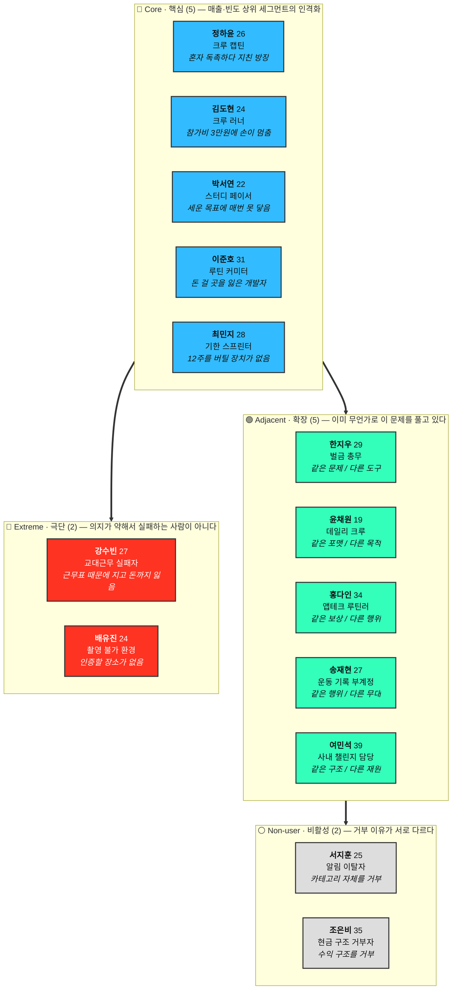

#### 🔵 Core 5명

| 인물 | 직무·맥락 | **문제** | **목표** | **감정** | 대체 솔루션 |
|---|---|---|---|---|---|
| **정하윤** 26·여<br/>크루 캡틴<br/>`SEG-F1` | 서울 중소기업 마케팅 3년차. 헬스장 6개월 등록 후 3주째 안 감. 대학 친구 4명 단톡방의 사실상 방장 | *"우리 운동 인증방 만들자"* 해서 만든 방이 **2주 만에 죽었다.** 사흘은 같이 올리다 한 명이 빠지자 도미노처럼 조용해졌다. 안 하는 친구에게 말 거는 역할이 자동으로 본인 몫이 되고, **본인이 잔소리꾼이 됐다** | 친구들 앞에서 잔소리꾼이 되지 않으면서 3개월 완주. 끝났을 때 *"우리 진짜 했다"*고 말할 수 있는 **증거** | 책임감과 피로가 같은 크기. 3일째 *"내가 왜 이걸 관리하고 있지"*. 친구가 조용히 빠질 때 서운함보다 **민망함** | 카톡 단톡방 인증 / 인스타 스토리 / 헬스장 앱 출석체크 / 결국 아무것도 안 함 |
| **김도현** 24·남<br/>크루 러너<br/>`SEG-F1` | 대학 4학년 취준생. 주 3회 카페 알바. 고정 수입 적고 지출에 민감 | **강제력이 없으면 안 된다는 걸 이미 안다**(무료 인증방으로 확인). 그런데 강제력 있는 방식을 처음 만나자 **참가비 3만원에서 손이 멈췄다.** 돈이 없어서가 아니라 **잃을 것 같아서**다. 막상 시작해도 며칠 밀리면 민망해서 **말없이 나온다** | 혼자서는 **3일을 넘긴 적 없는** 걸 친구 리듬에 얹어 해내기. 낸 돈은 전부 돌려받기 | 초대 시 반가움 → 참가비 화면에서 경계 → 이틀 밀렸을 때 죄책감 → 조용히 이탈할 때 **안도와 자책** | 무료 습관 앱 / 챌린저스 무료 챌린지 / 그냥 안 함 / *"나는 응원만 할게"* |
| **박서연** 22·여<br/>스터디 페이서<br/>`SEG-F2` | 지방 국립대 3학년, CPA 1차 준비. 매일 아침 목표를 정한다 — *오늘 8시간, 재무회계 3단원까지.* 열품타로 시간을 잰다 | **세운 목표에 거의 매번 못 닿는다.** 실제로는 6시간에 2단원 중반에서 끝나고 **매일 반복된다.** 열품타는 앉아 있던 시간만 재줄 뿐 **목표 대비 미달 폭**은 안 보여주고, 미달로 끝난 날에도 아무 일이 없다. 스터디 그룹은 월 1회라 **그 사이가 통째로 비어 있다** | *"몇 시간 앉아 있었나"*가 아니라 *"오늘 목표한 데까지 갔나"*가 남기를. 시험일까지 **미달 폭이 줄어드는 게 눈에 보이면** 좋겠다 | 성실한데 늘 불안. 저녁마다 미달로 마감하니 자신감이 깎인다. 비교당하는 게 싫으면서도 **비교되지 않으면 안 한다.** 목표를 낮추면 편하지만 **못 낮춘다** | 열품타 / 스터디플래너(계획-실제 병기) / 좌석 인증샷 / 노션 로그 / 캠스터디 라이브 |
| **이준호** 31·남<br/>루틴 커미터<br/>`SEG-A1` | 판교 IT 백엔드 5년차, 주 2회 재택. **챌린저스 미라클모닝 4회 참가**(회당 2만원 예치, 달성률만큼 환급 + 미달성자 몰수분에서 나온 상금) | **챌린저스가 뷰티 커머스로 피벗해 돈 걸 곳이 사라졌다.** 같이 할 친구가 없다 — 회사 사람과는 안 하고 대학 친구들은 흩어졌다. 익명 다수 챌린지는 **아무도 나를 안 봐서** 압박이 약하다 | 아침 6시 기상을 **무기한으로** 고정. 재미가 아니라 **손실 회피**로 굴리기 | 자기 의지에 대한 불신이 기본값. *"나는 돈을 걸어야만 하는 사람"*을 담담히 받아들였다. 성공 시 기쁨보다 **안도** | 축소된 챌린저스 / 미션형 알람 앱(알라미류) / 기상 인증 오픈채팅방 / 알람 5개 |
| **최민지** 28·여<br/>기한 스프린터<br/>`SEG-A2` | 프리랜서 그래픽 디자이너. **12주 뒤 바디프로필 촬영 예약 완료**(예약금 25만원 결제 상태) | ① 촬영일은 박혀 있는데 **12주를 버티게 해주는 장치가 없다.** 5주차쯤 무너진다 ② 예전에 한 번 완주했는데 **남은 게 결과 사진 몇 장뿐**이었다. 처음 못 들던 무게, 식단 바꾸던 날들, 5주차에 무너질 뻔한 구간 — **가장 힘들었던 시기가 가장 기록이 없다** | D-day까지 완주. 특이하게 **중간에 포기하면 진짜로 아프기를 원한다**(참가비가 높을수록 좋다). 동시에 **결과가 아니라 과정이 남기를** — 사진 한 장이 아니라 **이야기로** | 초반 과열 → 5주차 붕괴 공포 → 완주 시 **과정을 남기고 싶은 욕구** | PT 10회 선결제 / 인스타 비공개 데일리 기록 / 바디프로필 오픈채팅방 |

#### 🟢 Adjacent 5명

| 인물 | 직무·맥락 | **문제** | **목표** | 이 인물이 드러낸 것 |
|---|---|---|---|---|
| **한지우** 29·남<br/>벌금 총무<br/>`SEG-F3` | 직장인 5년차. 주말 러닝크루 총무, 크루원 **18명**. **불참 시 5천원 벌금 규칙을 2년째 직접 운영** | 벌금을 카톡으로 독촉하고 계좌이체로 받아 엑셀에 적는다. 누가 냈는지 매번 확인해야 하고, *"저 그날 아팠는데요"*를 **판정하는 것도 총무 몫**이다. 인증 수단이 없어 결국 *"갔다고 하면 간 것"* | **판정자 자리에서 내려오는 것.** 규칙이 자동 집행되고 본인은 결과만 확인 | 총무 2년차 번아웃 — **규칙을 만든 사람이 미움받는 구조.** 그만두면 크루가 없어질 것 같아 못 그만둠. **신규 수요가 아니라 기존 해법의 이식(migration) 대상** |
| **윤채원** 19·여<br/>데일리 크루<br/>`SEG-C2` | 대학 1학년, 여자 친구 7명 그룹. 셋로그 4개월째, 하루 6~8개 업로드. **학기마다 한두 번 단기 목표를 함께 잡는다** — 여름 앞 2주 다이어트, 중간고사 벼락치기, 여행비 3개월 저축 | ① 처음 두 달은 재밌었는데 지금은 **천장·모니터·강의실 사진만 반복.** 지우기는 아깝다 — **친구들이 다 거기 있어서** ② **단기 목표마다 도구가 없다** — 다이어트는 단톡방, 공부는 열품타, 저축은 카톡 정산으로 **흩어지고** 어느 것도 2주를 못 넘긴다 | 기본값은 **친구들과 연결돼 있는 것.** 학기마다 한두 번 *"이번엔 진짜 해보자"*가 오고 **그때만 목표가 생긴다**(상시형 아닌 **간헐적 목표형**) | 🔍 **전환 창구가 여기 있다** — 이미 그 행동을 도구 없이 맨손으로 한다. 전환 메시지는 *"일상 공유를 목표 공유로"*가 아니라 ***"이번 2주짜리 목표, 도구 있는 데서 해보자"***. Q3→Q1 좌표 이동의 실제 트리거. ⚠️ **직접 과금 대상이 아니라 획득 채널** |
| **홍다인** 34·여<br/>앱테크 루틴러<br/>(맵 밖) | 중견기업 총무팀 대리 7년차, 왕복 통근 2시간. 캐시워크·토스 만보기·오퍼월을 **5년째 매일**. 월 적립 1만원 안팎 | 하루 30분 넘게 리워드 앱을 도는데 **건강도 습관도 하나도 안 바뀐다.** 걸음 수는 목표가 아니라 **이미 걸은 걸 정산받는 것**에 가깝다. 보상엔 완전히 익숙한데 **그 보상이 아무것도 만들어내지 않는다** — P2가 보상형 앱에서 재현 | 어차피 쓰는 시간이라면 **포인트가 아니라 실제 변화로.** 다만 돈을 *받는* 건 익숙해도 *거는* 건 한 번도 안 해봤다 | 🔍 **보상 수용률 55% 가정의 검증 지점을 인격화한 인물.** 원자료 스스로 *"앱테크 수용 ≠ 친구에게 인증 영상 올리고 보상받기 수용"*이라 지적했다. **적립 → 예치 문턱에서 정확히 멈춘다** |
| **송재현** 27·남<br/>운동 기록 부계정<br/>(맵 밖) | 직장인 3년차, 주 4회 헬스장. 1년 전 **운동 기록용 인스타 부계정**을 팠다. 팔로워 지인 40명, `#오운완`. **기간이 정해진 목표는 없다** | ① 운동에 집중하다 **찍는 것 자체를 까먹는다** ② 찍어도 **길게 찍힌 원본을 잘라 붙여야** 릴스로 올라간다. 편집이 귀찮아 갤러리에 미편집 영상만 쌓인다. **운동은 꾸준한데 기록만 띄엄띄엄**이고, 피드의 구멍이 실제보다 게을러 보이게 만든다 | **기간 없는 꾸준함을 눈에 보이는 형태로 누적.** 남에게 자랑이 아니라 *"내가 이만큼 했다"*는 축적 | 🔍 **14종 중 제품 사양과 통증이 가장 정직하게 맞물리는 인물.** 두 마찰(타이밍·편집)이 제품 두 사양(계약 시각 짧은 영상·자동 회고본)을 정확히 겨냥. 걸 마감일이 없어 예치가 적용 안 되지만 **어긋남이 아니라 트랙 구분** → **개인 무료 트랙의 근거.** 매출이 아니라 **획득 자산** |
| **여민석** 39·남<br/>사내 챌린지 담당<br/>(맵 밖) | 임직원 **320명** 중견기업 인사팀 복지 담당 6년차. 걷기 대회·금연 지원·부서별 운동 인증을 매년 기획. **예산은 복지비** | ① **참여율이 초반에만 높고 2주면 반토막** ② 인증을 카톡·사내 게시판으로 받아 **집계가 전부 수작업** ③ **경영진 보고할 숫자가 없다** — *"몇 명 참여"*밖에 없고 실제 습관 형성·부서별 차이는 알 방법이 없다 | 예산 안에서 **끝까지 가는 챌린지**. **보고 가능한 숫자**(부서별 달성률·지속률·이탈 시점) | 🔍 **최대 이탈 관문(예치)의 우회로.** 이 경로에서는 **개인이 돈을 걸지 않는다** — 회사 예산이 팟을 채우고 직원은 잃을 것이 없다. **예치 이탈 요인 3개(손실 공포·예치 경험 부재·도덕 판단)가 한꺼번에 제거된다.** ⚠️ 대가: 영업 사이클이 길고 사용자와 구매자가 분리 |

#### 🔴 Extreme 2명 — 이 둘이 설계 구멍을 드러냈다

| 인물 | 직무·맥락 | **문제** | **드러난 설계 구멍** |
|---|---|---|---|
| **강수빈** 27·여<br/>교대근무 실패자 | 종합병원 **3교대 간호사** 4년차. 근무표가 2주 단위로 바뀌고 데이·이브닝·나이트가 섞인다. **참가 6회 중 완주 1회** | **고정 시각 계약이 구조적으로 불가능하다.** 이번 주 22시가 가능해도 다음 주 그 시각은 근무 중. 나이트 다음 날엔 인증할 체력도 없다. 매번 미달성이 쌓여 참가비 3만원 중 1~2만원이 몰수돼 완주자에게 간다. **게을러서가 아니라 근무표 때문에 실패하는데 시스템은 그 둘을 구분하지 않는다** | **문제는 '계약 중 변경 불가'가 아니다** — 자기구속은 P1을 푸는 핵심 장치라 유지해야 한다. 진짜 구멍은 **계약을 맺기 전에 아무것도 묻지 않는다**는 것. 필요한 것은 **① 계약 전 진단 설문**(지킬 수 있는 조건을 스스로 고르게) **② 주간 총량 계약**(시각 대신 횟수). **①이 진단, ②가 처방이며 잠그는 것 자체는 건드리지 않는다** |
| **배유진** 24·여<br/>촬영 불가 환경 | 대학 4학년. 학교 체육관·동네 헬스장 주 4회. **두 곳 다 촬영 금지 규정**이 있고 붐비는 시간엔 뒤로 다른 사람이 전부 찍힌다 | **인증 수단이 영상 하나뿐인데 찍을 수 있는 장소가 없다.** 폰을 들면 눈총을 받고 제지당한 적도 있다. 결국 **탈의실에서 억지로 찍거나 인증을 포기한다** | **영상 인증을 단일 수단으로 강제하면 촬영 불가 환경이 곧 배제 환경이 된다.** 국내 헬스장 상당수가 촬영을 금지하고 타인 초상권 문제도 있어 **개인 성향이 아니라 환경 제약**이다. ⚠️ **정면 충돌** — 대체 인증은 어뷰징 방어(실시간 촬영만·갤러리 차단·얼굴 일관성)와 부딪힌다. **포용성 ↔ 위조 방어 트레이드오프의 첫 인물** |

> **⚠️ 강수빈은 두 인물의 병합이다** — *교대근무 인증 실패자* + *상습 미달성자*. 따로 두면 인과가 끊기고, 합치면 하나의 사슬로 읽힌다: **근무표 충돌 → 반복 실패 → 손실 누적 → 상금 재원 공급.** 즉 **규제 리스크의 원인이 설계 구멍이었다** — 계약 전 진단과 총량 계약을 넣는 것이 곧 **사행성 리스크 완화책**이다.

#### ⚪ Non-user 2명 — 후자가 시장 진입 장벽의 본체다

| 인물 | 직무·맥락 | **거부 이유** | 함의 |
|---|---|---|---|
| **서지훈** 25·남<br/>알림 이탈자 | 대학원 석사과정. BeReal 2022 가입 후 6개월 만에 삭제. 셋로그도 2주 만에 알림 OFF | **앱이 자기 하루를 지배하는 느낌**을 견디지 못한다. 하이킹 중 *"지금 알림 울렸으면 좋겠다"*고 생각한 순간 소름이 끼쳐 지웠다. 이 경험이 **카테고리 전체에 대한 거부**로 굳었다 | **이 사람의 목표는 제품을 쓰는 게 아니라 안 쓰는 것이다.** 회피 좌표(Q4). **데려오려고 만든 기능은 코어를 망가뜨릴 확률이 높다** |
| **조은비** 35·여<br/>현금 구조 거부자 | 초등학교 교사, 두 자녀 양육. 소액 투자·앱테크 모두 안 함 | *"친구랑 돈 걸고 운동한다"*는 **구조 자체를 받아들이지 못한다.** 도박처럼 느껴지고 친구 사이에 돈이 오가면 관계가 상한다고 믿는다. *100% 달성 시 전액 환급*을 들어도 ***"그럼 못 한 사람 돈을 내가 먹는 거잖아요"***에서 멈춘다 | 🔍 **제로섬 구조를 어떻게 프레이밍해도 이 층은 남는다.** 완화 프레이밍이 겨냥하는 대상이 바로 이 사람이며, 실패하면 **영구 이탈.** 보상 수용률 55%의 **나머지 45%가 여기 있을 가능성** `[미측정]`. **§0.6 D2(비제로섬)가 정면으로 겨냥하는 인물** |

#### 스펙트럼이 드러낸 7가지 — 세그먼트 맵에서는 보이지 않던 것

| # | 발견 | 출처 인물 | 성격 |
|:-:|---|---|---|
| **1** | **계약 전에 생활 패턴을 묻지 않아, 지킬 수 없는 조건에 서명하게 된다** | 강수빈 | 🔧 설계 구멍 — 잠그는 장치가 아니라 **잠그기 전 진단**이 없다 |
| **2** | **구조적으로 실패할 수밖에 없는 사람이 상금 재원을 공급한다** | 강수빈 | ⚖️ 윤리·규제 — 사행성 심사 직결. **원인은 발견 1** |
| **3** | **영상 인증 단일 수단이 촬영 불가 환경을 배제하고, 대체 수단은 어뷰징 방어와 충돌한다** | 배유진 | 🔧 설계 — 포용성 ↔ 위조 방어 **트레이드오프** |
| **4** | **완화 프레이밍이 실패하면 남는 영구 거부층의 규모가 미측정** | 조은비 | 📉 시장 — 보상 수용률 55% 가정의 반대편 |
| **5** | **보상 수용률 55%는 '적립 수용'이지 '예치 수용'이 아닐 수 있다** | 홍다인 | 📉 시장 — **SAM 800만 추정 전체의 전제** |
| **6** | **제품 사양과 가장 잘 맞물리는 인물에게는 걸 마감일이 없다 — 무료 개인 트랙이 필요하다** | 송재현 | 📈 획득 — 매출이 아니라 **획득 자산** |
| **7** | **최대 이탈 관문인 예치를 우회하는 경로가 조직 재원에 있다** | 여민석 | 💰 수익 — 제로섬을 없애면 **예치 이탈 요인 3개가 동시에 사라진다** |

> **6과 7은 짝이다 — 둘 다 "돈을 누가 내는가"를 다시 묻는다.** 두 발견을 합치면 **수익 구조가 3층으로 갈라진다**: 개인 기록용(무료·획득) / 개인 그룹 계약(R2 참가비 take) / 조직 계약(예산 기반). **§0.6 D3이 이 3층을 순차로 여는 판단이다.**

### 1.1 여정 7단계 — 단계축 요약

이 서비스는 일반 여정(인식→탐색→구매→사용→유지)으로 담기지 않는다. **개인이 검색해서 오지 않고 친구가 그룹째 데려오며, 결제가 지출이 아니라 예치이고, 끝이 다음 시작을 결정**하기 때문이다.

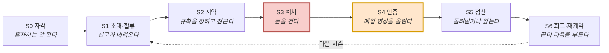

| 여정 단계 | Pain | 해당 번호 | 핵심 통증 양상 | **미충족 니즈 (Unmet Needs)** |
|---|:-:|---|---|---|
| **S0 자각** | 4건 | `20`·`26`·`37`·`39` | 목표 결심 순간이 짧고 예측 불가(`20`) · 촬영·편집 마찰로 기록이 띄엄띄엄(`26`) | 편집 없이 결심 즉시 기록을 시작 |
| **S1 초대** | 7건 | `11`·`16`·`21`·`23`·`25`·`38`·`41` | 그룹 제품인데 혼자 도착(`11`·`23`·`25`) · 집단 이주와 초대 거절 마찰(`16`·`41`) | 혼자여도 매칭되거나, 친구를 부담 없이 통째로 초대 |
| **S2 계약** | **10건** 🔴 최다 | `06`·`09`·`10`·`15`·`17`·`24`·`27`·`28`·`31`·`42` | 진단 없이 지킬 수 없는 약속에 서명(`31`·`06`) · 분량 목표 불가(`09`·`28`) | 내 생활 패턴대로 규칙을 **스스로 통제할 권리** |
| **S3 예치** | 5건 🔴 **최대 이탈** | `04`·`19`·`22`·`35`·`40` | 손실 공포로 결제 직전 이탈(`04`·`22`·`40`) · 친목에 돈이 개입(`19`) | 원금 손실 위험 없이 동기부여만 얻는 **안전장치** |
| **S4 인증** | 8건 | `01`·`05`·`07`·`12`·`13`·`30`·`32`·`34` | 방장에게 독촉 역할 귀속(`01`) · 5주차 붕괴 방치(`13`) · 촬영 금지 배제(`34`) | 시스템이 독촉하고, 붕괴 구간 개입 + 대체 인증 |
| **S5 정산** | 6건 | `02`·`08`·`18`·`29`·`33`·`36` | 상금 출처가 친구의 손실(`02`·`33`) · 조직 보고용 숫자 부재(`29`) | **비제로섬 환급** + 정량 성과 증빙 |
| **S6 회고** | 2건 | `03`·`14` | 방장 역할 고정 번아웃(`03`) · 12주 과정 서사 부재(`14`) | 운영 롤테이션 + 과정 전체의 자산화 |

### 1.2 14인 × 7단계 이탈 지도 — 인물축

| 이름 (세그먼트) | S0 | S1 | S2 | S3 | S4 | S5 | S6 | 어떻게 끝나나 |
|---|:-:|:-:|:-:|:-:|:-:|:-:|:-:|---|
| 🔵 **정하윤** 26 방장 `SEG-F1` | ● | ● | ● | ● | ● | ● | ● | 완주. 단 **다음 시즌도 자기가 총대** → 번아웃 |
| 🔵 **김도현** 24 참여자 `SEG-F1` | ● | ● | ⚠️ | ⚠️ | ⚠️ | ● | ◐ | **S4에서 말없이 사라진다** |
| 🔵 **박서연** 22 수험생 `SEG-F2` | ● | ⚠️ | ⚠️ | ● | ⚠️ | ⚠️ | ⚠️ | 완주. 단 **출석 100%인데 목표는 미달** |
| 🔵 **이준호** 31 루틴 `SEG-A1` | ● | ⚠️ | ⚠️ | ● | ⚠️ | ● | ⚠️ | 완주. 단 **무기한 습관인데 제품은 시즌제** |
| 🔵 **최민지** 28 스프린터 `SEG-A2` | ● | ⚠️ | ⚠️ | ● | ⚠️ | ● | ⚠️ | 완주. **최대 지불액이나 단발로 끝날 위험** |
| 🟢 **한지우** 29 총무 `SEG-F3` | ● | ⚠️ | ⚠️ | ⚠️ | ● | ⚠️ | ⚠️ | 완주. 단 **18명을 다 옮겨야 한다** |
| 🟢 **윤채원** 19 데일리 `SEG-C2` | ● | ● | ⚠️ | ⛔ | — | — | — | **S3 이탈** — *"우리끼리 돈을?"* |
| 🟢 **홍다인** 34 앱테크 (맵 밖) | ● | ⚠️ | ⚠️ | ⛔ | — | — | — | **S3 이탈** — 걸어본 적이 없다 |
| 🟢 **송재현** 27 기록 (맵 밖) | ● | ⚠️ | ⚠️ | ○ | ● | ○ | ● | **무료 트랙 완주** (걸 마감일 없음) |
| 🟢 **여민석** 39 사내 (맵 밖) | ● | ⚠️ | ⚠️ | ● | ⚠️ | ⚠️ | ⚠️ | 완주. 단 **회사가 돈을 낸다** |
| 🔴 **강수빈** 27 교대 (맵 밖) | ● | ⚠️ | ⚠️ | ● | ⛔ | ↺ | ↺ | **지킬 수 없는 약속 → 반복 실패 → 손실 순환** |
| 🔴 **배유진** 24 촬영불가 (맵 밖) | ● | ● | ● | ● | ⛔ | ⛔ | ⛔ | **돈은 걸었는데 인증할 장소가 없다** |
| ⚪ **서지훈** 25 알림거부 | ⛔ | — | — | — | — | — | — | 설명을 듣기도 전에 끝난다 |
| ⚪ **조은비** 35 현금거부 | ● | ● | ● | ⛔ | — | — | — | **S3 이탈** — 도덕적으로 못 받아들인다 |

`●` 통과 · `◐` 겨우 통과 · `○` 해당 없음 · `⚠️` 힘들지만 통과 · `⛔` 종료 · `↺` 되돌아감

> **① S3 예치가 최대 벽이다** — 4명이 여기서 멈추는데 **이유가 전부 다르다.** 손실이 무섭거나(김도현), 친구 사이에 돈이 껄끄럽거나(윤채원), 걸어본 적이 없거나(홍다인), 남의 손실로 이득 보는 게 싫거나(조은비). **§0.6 D2(비제로섬)가 뒤의 둘을 겨냥한다.**
> **② S4에서 둘은 이탈이 아니라 배제다** — 강수빈·배유진은 **이미 돈을 건 뒤에** 막혀 손실까지 발생한다.
> **③ 완주자 6명도 전부 어딘가 아프다** — ⚠️가 하나도 없는 사람이 없다. 완주는 이탈로 집계되지 않아 **더 늦게 발견된다.**

### 1.3 Pain Point 인벤토리 — 42건 전량

> **선별 기준** — 14명 × 7단계에서 나온 90건 이상 중 **① 여정을 끊거나 배제하는 것 → ② 다른 통증의 원인이 되는 것 → ③ 여러 사람이 공유하는 것** 순으로 인물마다 3건씩 남긴 42건이다.
>
> **Pain은 "무엇이 막혔나", Goal은 "무엇을 하려다 막혔나"다.** Pain만으로는 중요도를 매길 수 없다 — 그 Pain이 **무엇을 막고 있는지**를 알아야 한다. 각 항목의 I·S·AOS·DOS 점수는 **§3에 전량 수록**했다.
>
> **유형** 🚧 진입장벽 · 🔧 설계 결함 · 🤝 관계 비용 · 📉 리텐션 · ⚖️ 윤리·규제
> **영향** `⛔ 이탈` 여기서 나감 · `🚫 배제` 쓰고 싶어도 못 씀 · `⚠️ 마찰` 힘들지만 통과 · `🔄 순환` 되돌아감 · `👁 잔존` 남아 있지만 지표에 안 잡힘

**인물별 상위 Goal — 42건의 기준선** (각 Pain의 중요도는 이 상위 Goal을 얼마나 막느냐로 판단했다)

| 인물 | **상위 Goal — 궁극적으로 이루려는 것** |
|---|---|
| 🔵 정하윤 | **잔소리꾼이 되지 않으면서 그룹을 완주시키는 것.** *"우리 진짜 했다"*고 말할 증거를 남기는 것 |
| 🔵 김도현 | **혼자서는 안 되던 것을 친구 리듬에 얹어 해내는 것.** 그리고 낸 돈은 전부 돌려받는 것 |
| 🔵 박서연 | **세운 목표에 실제로 도달하는 것.** 시험일까지 미달 폭이 줄어드는 게 보이는 것 |
| 🔵 이준호 | **아침 6시 기상을 무기한으로 고정하는 것.** 재미가 아니라 손실 회피로 굴리는 것 |
| 🔵 최민지 | **D-day까지 완주하는 것.** 그리고 결과가 아니라 **과정**이 남는 것 |
| 🟢 한지우 | **판정자 자리에서 내려오는 것.** 규칙이 자동 집행되고 본인은 결과만 확인 |
| 🟢 윤채원 | **친구들과 계속 연결돼 있는 것**이 기본. 학기마다 오는 단기 목표는 도구 있는 데서 |
| 🟢 홍다인 | **포인트가 아니라 실제 변화로 바꾸는 것.** 쓰는 시간과 손품이 아깝지 않게 |
| 🟢 송재현 | **기간 없는 꾸준함을 눈에 보이는 형태로 누적하는 것.** 편집 없이 그냥 쌓이면 최상 |
| 🟢 여민석 | **예산 안에서 끝까지 가는 챌린지.** 그리고 보고 가능한 숫자를 남기는 것 |
| 🔴 강수빈 | **불규칙한 삶에서도 무언가를 유지하고 있다는 감각.** 실패가 근무표 탓임을 시스템이 알아주는 것 |
| 🔴 배유진 | **운동한 걸 증명하는 것.** 다만 얼굴·몸·주변 사람이 안 찍히는 방식으로 |
| ⚪ 서지훈 | **알림에 통제당하지 않는 것.** ⚠️ 이 사람의 목표는 제품을 쓰는 게 아니라 **안 쓰는 것** |
| ⚪ 조은비 | **습관은 만들되 돈이 개입하지 않는 방식으로.** 남에게 손해를 끼치지 않으면서 |

#### 🔵 핵심 사용자 15건

| # | 인물 | 단계 | **Pain — 무엇이 막혔나** | **Goal — 무엇을 하려다 막혔나** | 근본 원인 | 유형 | 영향 |
|:-:|---|:-:|---|---|---|:-:|:-:|
| `01` | **정하윤** | S3·S4 | **독촉 역할이 시작 단계부터 되살아난다** — 이 앱을 쓰는 이유가 시작 전에 배신당한다 | 잔소리하지 않고도 그룹이 굴러가게 하는 것 | 미납·미달성 추적이 방장에게 귀속 | 🔧 | 👁 |
| `02` | 정하윤 | S5 | **상금의 출처가 친구의 손실이라는 사실이 화면에 드러난다** | 완주의 성취를 관계를 상하지 않고 누리는 것 | 제로섬 재원 구조 | 🤝 | 👁 |
| `03` | 정하윤 | S6 | **방장 역할이 고정돼 번아웃 → 그룹 자체가 사라진다** | 다음 시즌을 내가 총대 메지 않고 이어가는 것 | 역할 로테이션 장치 없음 | 📉 | 👁 |
| `04` | **김도현** | S3 | **강제력이 필요한 걸 알면서도 참가비 앞에서 결정을 못 한다** | 강제력은 얻되 돈은 잃지 않는 것 | 손실을 겪어본 적이 없어 판단 근거 부재 | 🚧 | ⛔ |
| `05` | 김도현 | S4 | **한 번 밀리면 복귀 비용이 급등해 무응답으로 사라진다** | 하루 밀려도 조용히 돌아와 이어가는 것 | 미달성이 그룹에 그대로 노출 | 📉 | ⛔ |
| `06` | 김도현 | S2 | **협상력 없이 무리한 약속에 동의한다** — 이것이 S4 실패의 원인 | 내가 지킬 수 있는 강도로 참여하는 것 | 계약 설계 참여 불가 + 반대의 관계 비용 | 🔧 | ⚠️ |
| `07` | **박서연** | S4 | **인증은 통과인데 목표는 미달이라, 앱이 오히려 미달을 가린다** | 오늘 목표한 데까지 갔는지를 정확히 아는 것 | 했다/안 했다 이진 판정 | 🔧 | ⚠️ |
| `08` | 박서연 | S5 | **보상이 실제 성과와 무관하게 지급돼 잘못된 상태를 강화한다** | 출석이 아니라 진도로 평가받는 것 | 인증률 기준 정산 | ⚖️ | 👁 |
| `09` | 박서연 | S2 | **분량·범위 목표를 계약에 넣을 수 없다** | *"매일 3단원"*을 약속으로 걸 수 있는 것 | 계약 표현력 부족 | 🔧 | ⚠️ |
| `10` | **이준호** | S2·S6 | **무기한 습관인데 제품은 시즌제라, 갱신마다 이탈 지점이 새로 생긴다** | 끝나는 날 없이 계속 굴러가게 하는 것 | 종료일을 전제한 시즌 구조 | 🔧 | ⚠️ |
| `11` | 이준호 | S1 | **그룹 제품인데 그룹 없이 도착하고, 매칭 품질을 통제할 수 없다** | 친구가 없어도 나를 지켜보는 사람을 갖는 것 | 오픈 매칭 의존 | 🚧 | ⚠️ |
| `12` | 이준호 | S4 | **낯선 그룹은 사회적 압력이 약하고 담합 위험이 커진다** | 아무도 안 보는 상태를 벗어나 실제 압박을 받는 것 | 관계 기반 압력 부재 | 📉 | ⚠️ |
| `13` | **최민지** | S4 | **5주차 붕괴가 예측 가능한데 앱이 아무것도 하지 않는다** | 무너지는 구간을 넘겨 D-day까지 가는 것 | 구간별 개입 장치 없음 | 📉 | ⚠️ |
| `14` | 최민지 | S6 | **과정이 안 남고 결과만 남는다** — 가장 힘들었던 구간이 가장 기록이 없다 | 12주를 어떻게 통과했는지가 손에 잡히게 남는 것 | 회고본이 요약 중심 | 📉 | 👁 |
| `15` | 최민지 | S2 | **실패 비용이 커서 난이도를 스스로 과대 설정한다** | 실패하지 않을 만큼만 세게 거는 것 | 자기구속에 조정 장치 없음 | 🔧 | ⚠️ |

#### 🟢 확장 사용자 15건

| # | 인물 | 단계 | **Pain — 무엇이 막혔나** | **Goal — 무엇을 하려다 막혔나** | 근본 원인 | 유형 | 영향 |
|:-:|---|:-:|---|---|---|:-:|:-:|
| `16` | **한지우** | S1 | **크루원 18명을 다 옮겨야 하고, 한 명이라도 남으면 이중 운영이 된다** | 크루를 한 번에 옮겨 손 작업을 끝내는 것 | 집단 이주 비용 | 🚧 | ⚠️ |
| `17` | 한지우 | S2 | **2년간의 재량(봐주기)이 자동 집행과 충돌해 *"더 각박해졌다"*는 반발이 난다** | 규칙은 자동화하되 인간적인 예외는 남기는 것 | 예외 처리 수단 부재 | 🤝 | ⚠️ |
| `18` | 한지우 | S5 | **자동 분배가 회식비로 쓰던 공동 재원을 없앤다** | 모인 돈을 크루 활동에 계속 쓰는 것 | 분배가 개인 귀속으로 고정 | 🤝 | 👁 |
| `19` | **윤채원** | S3 | **친목 그룹에 돈이 들어오는 순간 관계가 거래로 재정의된다** | 친구 관계를 그대로 둔 채 이번 목표만 해내는 것 | 제로섬 예치 | 🤝 | ⛔ |
| `20` | 윤채원 | S0 | **목표가 생기는 순간이 짧고 예측 불가라 상시 마케팅으로는 안 닿는다** | 목표가 생긴 바로 그 순간에 시작하는 것 | 간헐적 목표형 | 🚧 | ⚠️ |
| `21` | 윤채원 | S1 | **전환이 친구의 한마디에 달려 있는데 앱이 그 대화를 만들지 못한다** | 친구들을 통째로 데려와 같이 시작하는 것 | 그룹 통째 전환 진입점 부재 | 🚧 | ⚠️ |
| `22` | **홍다인** | S3 | **5년간 받기만 해본 사람에게 손실 가능성이 인생 처음 등장한다** | 손실 위험 없이 이 구조를 먼저 겪어보는 것 | 예치 경험 없음 | 🚧 | ⛔ |
| `23` | 홍다인 | S1 | **보상형 유입자는 그룹 없이 혼자 도착한다** | 혼자 왔어도 함께할 그룹을 배정받는 것 | 개인 광고·검색 유입 경로 | 🚧 | ⚠️ |
| `24` | 홍다인 | S2 | **손실 경험이 없어 난이도를 낙관하고 첫 시즌 실패 확률이 높아진다** | 첫 시즌을 성공으로 끝내는 것 | 난이도 추천 장치 부재 | 🔧 | ⚠️ |
| `25` | **송재현** | S1 | **그룹도 마감일도 없어 그룹 계약 중심 온보딩에 들어갈 자리가 없다** | 그룹 없이 혼자서도 기록을 시작하는 것 | 개인 트랙 부재 | 🚧 | ⚠️ |
| `26` | 송재현 | S0 | **촬영·편집 마찰이 꾸준함을 끊어 기록이 띄엄띄엄해진다** | 찍는 것도 편집도 신경 안 쓰고 기록이 쌓이는 것 | 기존 도구(인스타)의 편집 부담 | 📉 | ⚠️ |
| `27` | 송재현 | S2 | **혼자 하는 약속은 지켜볼 사람이 없어 자기구속이 약하다** | 혼자서도 지켜지는 최소한의 강제력 | 그룹 압력 부재 | 🔧 | ⚠️ |
| `28` | **여민석** | S2 | **담당자가 대신 설계해 *"회사가 시킨 것"*이 되고 자기구속 원리가 무너진다** | 직원이 **스스로 한 약속**으로 느끼게 만드는 것 | 계약 주체와 이행 주체의 분리 | 🔧 | ⚠️ |
| `29` | 여민석 | S5 | **부서별 달성률·지속률 같은 보고용 숫자를 뽑을 수 없다** | 경영진에 낼 숫자를 확보하는 것 | 조직용 화면 부재 | 🔧 | 👁 |
| `30` | 여민석 | S4 | **참여율이 떨어져도 담당자가 쓸 개입 수단이 없다** | 참여율이 떨어질 때 손을 쓸 수 있는 것 | 관리자 도구 부재 | 📉 | ⚠️ |

#### 🔴 극단 사용자 6건 — 전부 `🚫 배제` 또는 `🔄 순환`

| # | 인물 | 단계 | **Pain — 무엇이 막혔나** | **Goal — 무엇을 하려다 막혔나** | 근본 원인 | 유형 | 영향 |
|:-:|---|:-:|---|---|---|:-:|:-:|
| `31` | **강수빈** | S2 | **계약 전에 아무것도 묻지 않아, 지킬 수 없는 약속에 서명한다** | 내 근무표로 **지킬 수 있는 조건**을 고르는 것 | 계약 전 진단 절차 부재 | 🔧 | 🚫 |
| `32` | 강수빈 | S4 | **게으름과 근무 충돌이 똑같은 '미달성'으로 기록된다** | 근무 때문에 못 한 것과 게을러서 못 한 것을 구분받는 것 | 실패 사유를 구분하지 않음 | 🔧 | 🚫 |
| `33` | 강수빈 | S5 | **구조적 실패자의 손실이 상금 재원이라 시스템에 순환을 멈출 유인이 없다** | 잃기만 하는 자리에서 벗어나는 것 | 제로섬 재원 구조 | ⚖️ | 🔄 |
| `34` | **배유진** | S4 | **인증 수단이 하나뿐이라 촬영 불가 환경이 곧 배제 환경이 된다** | 촬영이 금지된 곳에서도 운동을 증명하는 것 | 단일 인증 수단(실시간 영상) | 🔧 | 🚫 |
| `35` | 배유진 | S3 | **촬영 가능 여부를 묻지 않아 돈을 걸고 나서야 막힌다** | 돈을 걸기 전에 내가 할 수 있는지 확인하는 것 | 계약 전 진단 절차 부재 | 🚧 | 🚫 |
| `36` | 배유진 | S5 | **실제로 운동했는데 증명 수단이 없어 몰수당한다** | 실제로 한 운동을 인정받는 것 | 대체 인증 수단 부재 | ⚖️ | 🚫 |

#### ⚪ 비활성 사용자 6건

| # | 인물 | 단계 | **Pain — 무엇이 막혔나** | **Goal — 무엇을 하려다 막혔나** | 근본 원인 | 유형 | 영향 |
|:-:|---|:-:|---|---|---|:-:|:-:|
| `37` | **서지훈** | S0 | **앱 이름을 듣는 순간 '알림 앱'으로 분류돼 설명 기회가 안 생긴다** | ⚠️ **알림에 하루를 뺏기지 않는 것** (= 이 앱을 안 쓰는 것) | 카테고리 낙인 | 🚧 | ⛔ |
| `38` | 서지훈 | S1 | **차별점이 한 문장으로 전달되지 않아, 설명이 길어질수록 방어가 세진다** | ⚠️ 설득당하지 않고 자기 판단을 유지하는 것 | 개념(트리거 소유권)의 전달 난도 | 🚧 | ⛔ |
| `39` | 서지훈 | S0 | **과거 앱이 하루를 지배한 경험이 통제 상실감으로 남아 있다** | 내 하루의 리듬을 내가 정하는 것 | BeReal 사용 경험 | 📉 | ⛔ |
| `40` | **조은비** | S3 | **환급 논리는 손실 걱정에 답하는데, 이 사람의 반대는 도덕 판단이라 논점이 어긋난다** | 남에게 손해를 끼치지 않으면서 습관을 만드는 것 | 제로섬 구조 자체 | ⚖️ | ⛔ |
| `41` | 조은비 | S1 | **제품이 아니라 소개자를 보고 들어와, 거절하면 관계까지 어색해진다** | 거절해도 지인 관계를 상하지 않는 것 | 지인 소개 유입 | 🤝 | ⚠️ |
| `42` | 조은비 | S2 | **계약까지 매끄러워서 예치의 이질감이 오히려 증폭된다** | 결정하기 전에 구조를 전부 알고 있는 것 | 구조 고지 시점이 늦음 | 🚧 | ⚠️ |

### 1.4 Pain 42건의 구조 — Goal 4분류와 세 가지 관통 패턴

#### Goal 4분류 — 사람들이 진짜 원하는 것은 네 가지

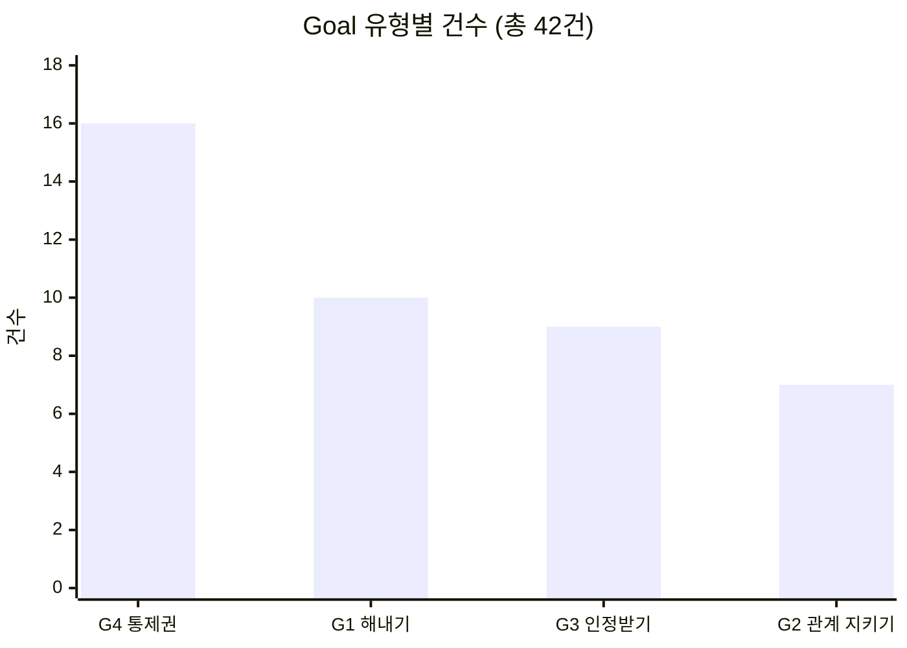

| Goal 유형 | 한 줄 정의 | 건수 | 해당 번호 |
|---|---|:-:|---|
| **G4 통제권** *Autonomy* | **조건과 리듬을 내가 정하고 싶다** | **16 (38%)** | `03`·`06`·`09`·`10`·`16`·`20`·`22`·`25`·`28`·`30`·`31`·`35`·`37`·`38`·`39`·`42` |
| **G1 해내기** *Achievement* | 목표를 실제로 달성하고 싶다 | 10 | `04`·`05`·`11`·`12`·`13`·`15`·`21`·`23`·`24`·`27` |
| **G3 인정받기** *Recognition* | 내가 한 것이 제대로 기록·평가되었으면 | 9 | `07`·`08`·`14`·`26`·`29`·`32`·`33`·`34`·`36` |
| **G2 관계 지키기** *Relationship* | 사람 사이가 상하지 않았으면 | 7 | `01`·`02`·`17`·`18`·`19`·`40`·`41` |

#### 유형별 분포 — 누가 고쳐야 하는 문제인가

| 유형 | 건수 | 해당 번호 | 고치는 주체 |
|---|:-:|---|---|
| 🔧 **설계 결함** | **13** | `01`·`06`·`07`·`09`·`10`·`15`·`24`·`27`·`28`·`29`·`31`·`32`·`34` | 제품 설계 — 가장 많고 대부분 S2·S4에 몰려 있다 |
| 🚧 **진입장벽** | **12** | `04`·`11`·`16`·`20`·`21`·`22`·`23`·`25`·`35`·`37`·`38`·`42` | 온보딩·마케팅·요금 구조 |
| 📉 **리텐션** | 8 | `03`·`05`·`12`·`13`·`14`·`26`·`30`·`39` | 유지 장치·개입 타이밍 |
| 🤝 **관계 비용** | 7 | `02`·`17`·`18`·`19`·`40`·`41` | 정산 구조·언어 설계 |
| ⚖️ **윤리·규제** | 4 | `08`·`33`·`36`·`40` | 🔴 **수익 구조 재검토** — 방치하면 사행성 심사와 직결 |

#### 여러 사람이 공유하는 묶음 — 하나를 고치면 여럿이 복구된다

| 묶음 | 번호 | 인원 | 공통 원인 |
|---|---|:-:|---|
| **① 예치 문턱** | `04`·`19`·`22`·`40` | **4명** | 참가비를 거는 행위 자체 |
| **② 제로섬 재원** | `02`·`19`·`33`·`40` | **4명** | 상금이 타인의 몰수금에서 나온다 |
| **③ 계약 표현력 부족** | `09`·`10`·`31` | 3명 | 고정 시각 · 이진 판정 · 시즌제 |
| **④ 그룹 없이 도착** | `11`·`23`·`25` | 3명 | 그룹 제품인데 개인이 혼자 유입 |
| **⑤ 계약 전 진단 부재** | `31`·`35` | 2명 | 지킬 수 있는지 묻지 않는다 |
| **⑥ 난이도 과대 설정** | `15`·`24` | 2명 | 손실 경험 유무와 무관하게 무리하게 잡음 |

#### 세 가지 관통 패턴

| 패턴 | 내용 | 함의 |
|---|---|---|
| **가장 많이 막히는 것은 "해내기"가 아니라 "통제권"** | G4 통제권 **16건(38%)** > G1 해내기 10건. 근무표를 못 넣고(`31`), 분량 목표를 못 걸고(`09`), 시즌을 안 끝내지 못하고(`10`), 혼자 시작하지 못하고(`25`), 회사가 대신 약속을 정한다(`28`) | **트리거 시각은 사용자에게 넘겼는데 계약의 나머지 조건은 여전히 제품이 쥐고 있다.** 이것이 42건이 가리키는 가장 큰 구조적 진단 |
| **S2는 넓게 아프고 S3는 깊게 끊긴다** | S2 계약 **10건(최다)** / S3 예치 **이탈 4건(최다)** | 통증 총량과 이탈 지점이 **다른 관문**에 있다 |
| **하나를 고치면 여럿이 복구되는데, 두 묶음이 겹친다** | 예치 문턱 `04`·`19`·`22`·`40` ↔ 제로섬 재원 `02`·`19`·`33`·`40` — **`19`·`40`에서 겹침** | **예치를 거부하는 이유가 곧 제로섬 구조**라는 뜻. 사실상 **하나의 수익 구조 문제** → §0.6 D2가 이를 겨냥 |

> **⚠️ 같은 화면에서 멈춰도 Goal이 다르면 처방이 다르다.** `04`·`22`·`40`은 모두 S3 예치에서 멈추지만 — 김도현(*"내가 잃을까 봐"*)·홍다인(*"먼저 겪어보고 싶다"*)은 **무예치 체험(F07)으로 풀리고**, 조은비(*"남이 잃는 게 싫어서"*)는 **풀리지 않는다.** Pain만 보면 *"S3에서 4명 이탈"*로 한 덩어리지만, Goal을 보면 **처방이 둘로 갈린다.** 조은비를 통과시키는 것은 F07이 아니라 **D2 비제로섬**이다.
>
> **⚠️ Goal이 제품과 반대 방향인 사람이 있다.** `37`·`38`(서지훈)의 Goal은 ***"이 앱을 안 쓰는 것"***이다. Pain만 보면 매우 중요하고 미해결처럼 보이지만, **Goal로 보면 지금 안 쓰고 있으므로 이미 완전히 충족된 상태**다. AOS는 *"우리가 풀면 고객이 좋아할 문제"*를 찾는 도구인데 이 Goal은 **우리가 풀수록 고객이 멀어지는** 종류다 — 그래서 §3에서 `37`의 AOS를 **0.0으로 처리**했다.

**이 인벤토리의 한계** — ① 42건은 90건 이상에서 인물당 3건으로 자른 것이라 **탈락한 통증이 인물당 1~4건씩** 있다(정하윤 S1 초대 부담, 배유진 S6 복귀 불가는 탈락분도 강하다) ② 한지우 3건은 상위 Goal(*"판정자 자리에서 내려오는 것"*)을 정면으로 다루지 않고 전부 **도입·운영의 부작용**이다 → 재선별 후보 ③ **Pain별 Goal은 역산한 추론**이며 본인에게 물어본 것이 아니다 ④ Goal 4분류는 본 문서의 판단이다 ⑤ 선별 기준이 *"이탈 우선"*이라 **완주자의 통증이 과소평가**될 위험이 구조적으로 있다.

### 1.5 여정지도가 제안한 개선 12건 → 확정 기능

> 여정지도는 **통증만이 아니라 처방까지** 냈다. 그 12건이 §8의 기능 24종으로 어떻게 확정됐는지가 **분석 → 설계의 연결 고리**다. **12건 전부가 기능으로 살아남았고, 그중 7건이 MVP에 들어갔다.**

| # | 여정지도의 제안 | 단계 | 확정 기능 | MVP | 설계 단계에서 바뀐 것 |
|:-:|---|:-:|---|:-:|---|
| 1 | **계약 전 진단 설문** | S2 | **F01** 라이프스타일 진단 | **✔** | 그대로. 난이도 1로 **MVP 최저 비용 항목** |
| 2 | **예치 사다리** (무예치 → 소액 → 정상) | S3 | **F07** 0원 체험 시즌 | **✔** | 3단계 중 **1단계만 MVP**로 축소 |
| 3 | **계약 표현력 확대** | S2 | **F12** 진도형 · **F13** 총량형 · **F23** 무기한 | ✖ | **세 기능으로 분리** 후 전부 Y2+ 이연 |
| 4 | **비제로섬 트랙** | S3·S5 | **F06** 정산 방식 (기본값 비제로섬) | **✔** | ✅ **채택.** 재원을 *"구독료"*가 아니라 **본인 예치금 자기환급**으로 바꿔 더 단순해졌다 |
| 5 | **대체 인증 수단** | S4 | **F16** 대체 인증 | **✔** | **MVP로 승격** — 촬영 제약이 *"성향이 아니라 환경"*으로 재해석됐다 |
| 6 | **복구권 + 미달성 사유 태깅** | S4 | **F24** 조용한 복귀 · **F17** 예외 처리 | ✖ | **두 기능으로 분리** |
| 7 | **달성률 기반 기록·정산** | S4·S5 | **F10** 목표 대비 진도 표시 | ✖ | **우선순위 상향** — 없으면 `SEG-F2`에 **역효과** |
| 8 | **방장 부담 이관** | S3·S4·S6 | **F05** 자동 독촉 · **F18** 역할 로테이션 | F05 **✔** | **분리** — 독촉은 MVP, 로테이션은 Y2 |
| 9 | **누적 손실 상한 + 강제 휴식** | S5 | **F15** 손실 상한·강제 휴식 | ✖ | *"우선순위 상향 여지"* 판단이 맞았다 — **비제로섬에서도 필요** |
| 10 | **무료 개인 트랙** | S1·S3 | **F21** 개인 무료 트랙 | ✖ | **Y2 이연** — 매출 0인데 F04·F11 개발 부담은 동일 |
| 11 | **장편 회고본 + 유형 분기** | S6 | **F11** 자동 편집 회고본 | **✔** | *"유형 분기"*는 빠지고 **"못 한 날도 포함"**만 남았다 |
| 12 | **조직용 관리자 대시보드** | S5·S6 | **F20** 조직 대시보드 | ✖ | **Y3 이연** (수익 3층 중 마지막) |

> **이 표가 말하는 것** — 여정지도가 잡아낸 통증은 **하나도 버려지지 않았다.** 설계 단계에서 일어난 일은 ① **분리**(3·6·8번이 각각 2~3개 기능으로) ② **축소**(2번 사다리 → 0원 체험만) ③ **이연**(진입 세그먼트가 `SEG-F1` 단독으로 좁혀지며 5건이 Y2+로)이다. **기능이 사라진 게 아니라 순서가 정해졌다.**

---

## 2. JTBD 선언 — 상황에 따른 목표 (Goal, Job)

> **`[모의]`** — 아래는 **가상 응답**에서 도출했다. Evidence 칸에는 모의 인용문 대신 **데모 화면 체류·행동 신호**만 남긴다.

### 2.0 인터뷰 설계 — 어떻게 물었고, 무엇을 금지했는가

#### 🚨 절대 금지 3항 (원문)

> 아래 9건의 응답은 **전부 생성된 가상 데이터**다. 실존 인물의 발언이 아니며, 어떤 형태의 조사도 수행되지 않았다.
> **작성 목적** — 문항지가 실제로 굴러가는지, 어떤 답이 나올 때 무엇을 판정할 수 있는지를 **미리 점검**하기 위한 리허설이다.
>
> **절대 하면 안 되는 것**
> - 이 응답을 근거로 **AOS·DOS 값을 갱신**하는 것
> - 이 응답에서 나온 **수치(횟수·금액·시간)를 실측치로 인용**하는 것
> - JTBD 요약 카드의 **`Evidence` 칸에 이 인용문을 넣는** 것
>
> 응답 내용은 페르소나 서술에서 연역한 것이므로 **페르소나가 틀렸다면 응답도 같이 틀린다. 순환 논증에 빠지지 않도록 주의할 것.**

**본 문서의 준수 상태** — ① AOS·DOS는 06 챕터 원값을 그대로 쓰고 갱신하지 않았다(§3) ② 모의에서 나온 수치(체류시간·업로드율 31%·주 90분)에는 **전부 `[모의]` 태그**를 붙였다 ③ Evidence 열을 **`[모의·행동신호]`로 한정**하고 인용문을 넣지 않았다.

#### 대상 선정 — 두 기준의 교집합

```
핵심+확장 30건  ─┐
                 ├─▶ 교집합 10건 / 9명  ← 인터뷰 대상
혁신기회+니치 15건 ─┘
```

| 기준 | 통과 조건 | 무엇을 정하는가 |
|---|---|---|
| **1** 페르소나 스펙트럼 | 🔵 Core 5명 · 🟢 Adjacent 5명 | *누구를 만날 것인가* |
| **2** AOS·DOS 사분면 | AOS Q1(혁신기회) **또는** 매트릭스 Q4(니치·신뢰자산) | *무엇을 물을 것인가* |

| 등급 | 순위 | 인물 | 대상 Pain | AOS | DOS |
|:-:|:-:|---|---|:-:|:-:|
| 🥇 **P1** 혁신기회 ∩ 최우선 | 1 | **이준호** (31) | `11` 그룹 없이 도착 | **4.0** | **2.21** |
| | 2 | **정하윤** (26) | `01` 독촉 역할 재발 | **4.0** | **1.86** |
| | 3 | **김도현** (24) | `04` 참가비 앞 결정 불가 | **4.0** | **1.86** |
| 🥈 **P2** 혁신기회 ∩ 니치 | 4 | **박서연** (22) | `07` 미달이 가려짐 | 3.0 | 0.89 |
| | 5 | **한지우** (29) | `16` 크루 18명 집단 이주 | **4.0** | 0.71 |
| | 6·7 | **최민지** (28) | `13` 5주차 붕괴 · `14` 과정 부재 | 4.0 / 3.0 | 0.69 / 0.52 |
| 🥉 **P3** 혁신기회 · DOS 보류 | 8 | **여민석** (39) | `29` 보고용 숫자 없음 | **4.0** | `보류` |
| | 9 | **홍다인** (34) | `22` 예치 문턱 | 3.0 | `보류` |
| | 10 | **송재현** (27) | `26` 촬영·편집 마찰 | 3.0 | `보류` |

**제외 대상과 사유** — 윤채원은 기준 1 통과·기준 2 탈락(3건 모두 개선기회·유지보완·과잉투자) → *"직접 과금 대상이 아니라 획득 채널"*이므로 획득 검증 시 별도 트랙 / 강수빈·배유진(극단)·서지훈·조은비(비활성)는 **기준 1에서 탈락**.

> ### ⚠️ 이 기준이 만드는 공백 — 반드시 알고 넘어가야 한다
> **AOS 4.0 최상위 10건 중 4건이 극단 사용자(강수빈 `31`·`33` · 배유진 `34`·`36`)에게서 나왔는데, 기준 1이 극단 사용자를 배제하므로 이번 인터뷰는 그 4건을 다루지 않는다.**
> AOS 채점은 *"포용적 설계가 곧 최대 기회"*라는 결론에 도달했고 여정지도의 개선 1순위(계약 전 진단 설문)와도 독립적으로 일치했다. **그 결론을 검증할 대상이 이번 라운드에 없다.** 이번 라운드는 *"핵심·확장에게 잘 팔리는가"*이고, *"배제된 사람을 되찾을 수 있는가"*는 **후속 라운드로 분리된다.**

#### 진행 구조 — 75~90분 · 데모 체험 기반

제품이 아직 없으므로 대상 9명 전원이 *"아직 안 들어봄"* 그룹이다. 그래서 **데모 페이지 체험을 "최근 사용 시작/중단"의 자리에 대신 넣었다** — 체험이 자극제가 되어 **과거의 실제 전환 경험**을 끌어내는 구조다.

| Part | 시간 | 내용 | 회수하는 Force |
|:-:|:-:|---|---|
| **0** | 5분 | 오프닝 + **데모 전 30초 베이스라인** | — (오염 방지용 사전 진술) |
| **1** | 15분 | **데모 체험** — 소리 내어 생각하기 | ② Pull · ④ Anxiety `[관찰]` |
| **2** | 10분 | 데모 직후 반응 회수 | ② Pull · ④ Anxiety |
| **3** | 25분 | 기존 경험 역추적 (대안·맥락) | 대체 솔루션 |
| **4** | 20분 | **전환 사건 재구성** — 연상 유도 | ① Push · ③ Habits `[진술]` |
| **5** | 5분 | 마무리 | — |

**데모 6화면 = 제품 핵심 루프 6단계** — ① 계약 → ② 예치 → ③ 인증 → ④ 축적 → ⑤ 정산 → ⑥ 회고. **어느 단계에서 멈췄는지를 단계 번호로 기록**한다.

> **⚠️ 이 설계의 가장 큰 오염원은 사후 합리화다.** 데모를 본 뒤 과거를 떠올리면 *"그러고 보니 그때 이게 필요했네"* 식으로 **기억이 데모에 맞춰 재구성**된다. 방어 장치: ① 데모 전 30초 베이스라인을 먼저 받아 오염되지 않은 진술을 확보 ② 기록 시트에서 **`[관찰]`(데모 중 실제 행동)과 `[진술]`(회상)을 분리 표기**.
>
> **Force별 신뢰도가 다르다** — ① Push·③ Habits는 과거 실제 경험의 **회상**이라 신뢰도 높음 / ② Pull·④ Anxiety는 데모 체험 중 **실시간 관찰**이라 중간(관찰은 실제이나 구매는 아님).

#### 금지 질문 — 물으면 안 되는 것

| 금지 | 왜 | 대신 |
|---|---|---|
| *"왜 그 앱에서 갈아타셨어요?"* | 직설적으로 물으면 **표면적 답변**만 나온다 | *"그만두기로 한 날은 어떤 날이었습니까?"* |
| *"이런 기능 있으면 쓰시겠어요?"* | 가정형은 **의향을 묻는 것**이지 행동이 아니다 | *"지금까지 비슷한 걸 써보신 적 있습니까?"* |
| *"참가비 얼마면 적당하세요?"* | 가격은 **맥락 없이 물으면 전부 낮게** 나온다 | *"이런 데 돈을 써보신 적 있습니까? 얼마였습니까?"* |
| *"이 기능 마음에 드세요?"* | 예/아니오로 닫히고 **호의 편향**이 걸린다 | *"그 화면에서 무슨 생각 하셨습니까?"* |
| *"보통 어떻게 하세요?"* | 일반화된 답은 **실제 행동이 아니다** | *"가장 최근에 하셨을 때 이야기를 해주십시오."* |

### 2.1 통합 Job Statement

```
[Situation — 상황적 맥락]
결심 시점(새해, 여름 직전, 시험 준비, 마감일)에 친구들과 목표를 세웠으나 흐지부지되거나,
기존 도구(단톡방, 챌린저스, 타이머)의 한계 — 독촉 피로 · 손실 공포 · 진도 미검증 — 에 부딪혔을 때

[Job — 고객이 해결하려는 일]
관계는 상하지 않으면서 시스템의 강제력과 상호 감시로 나와 그룹의 약속을 끝까지 지켜내어

[Outcome — 고객이 얻고자 하는 진보]
원금 손실 없이 목표를 완주하고, 내가 해냈다는 확실한 서사적 증거를 손에 쥐는 것
```

### 2.2 JTBD 선언 9건 — 개별

| # | 인물 | **Situation (When…)** | **Job Statement (I want to…)** | **So I can…** |
|:-:|---|---|---|---|
| **A** | 🔵 **이준호** (31) | 챌린저스가 챌린지를 접어 **돈 걸 곳이 사라졌고**, 같이 할 사람이 없을 때 | 나를 **실제로 지켜보는 소수**와 묶여 아침 기상을 무기한 고정하고 싶다 | 재미가 아니라 **손실 회피**로 굴러가는 상태를 유지할 수 있도록 |
| **B** | 🔵 **정하윤** (26) | 내가 만든 인증방이 2주 만에 죽고 **독촉 역할이 자동으로 내 몫**이 됐을 때 | 규칙 집행을 **시스템에 넘기고** 싶다 | 잔소리꾼이 되지 않으면서 완주하고 *"우리 진짜 했다"*는 **증거**를 남길 수 있도록 |
| **C** | 🔵 **김도현** (24) | 강제력이 필요하다는 걸 **이미 아는데** 참가비 화면 앞에 섰을 때 | **돈을 잃을 위험 없이** 강제력을 먼저 겪어보고 싶다 | 친구 리듬에 얹어 해내고 **낸 돈은 전부 돌려받을** 수 있도록 |
| **D** | 🔵 **박서연** (22) | 9시간씩 공부하고도 1차에 떨어져 **"시간이 문제가 아니구나"**를 알게 됐을 때 | 앉아 있던 시간이 아니라 **목표 대비 진도**로 평가받고 싶다 | 시험일까지 **미달 폭이 줄어드는 게 눈에 보이도록** |
| **E** | 🟢 **한지우** (29) | 2년째 벌금을 카톡 독촉·계좌이체·엑셀로 걷다가 **네 번째 독촉 카톡을 못 보냈을 때** | **판정자 자리에서 내려와** 규칙이 자동 집행되게 하고 싶다 | 크루 18명을 **한 번에** 옮기고 결과만 확인할 수 있도록 |
| **F** | 🔵 **최민지** (28) | 재작년 바디프로필을 완주했는데 **남은 게 결과 사진뿐**임을 다시 확인했을 때 | 12주를 **어떻게 통과했는지가 손에 잡히는 형태**로 남기고 싶다 | 5주차 붕괴를 넘겨 D-day까지 가고 **다음 시즌을 또 할 이유**를 가질 수 있도록 |
| **G** | 🟢 **여민석** (39) | 임원이 *"그 사람들이 계속 했어요?"*라고 물었는데 **3년째 답을 못 하고** 있을 때 | 부서별 **달성률·지속률·이탈 시점**을 자동으로 뽑고 싶다 | 예산 안에서 끝까지 가는 챌린지를 돌리고 **내년 품의를 통과**시킬 수 있도록 |
| **H** | 🟢 **홍다인** (34) | 5년째 리워드 앱을 하루 7번 열면서 **아무것도 안 바뀐 걸** 알게 됐을 때 | **손실 위험 없이** 이 구조를 먼저 겪어보고 싶다 | 포인트가 아니라 **실제 변화**로 바꿀 수 있도록 |
| **I** | 🟢 **송재현** (27) | 2년치 운동 사진을 보다가 **중간이 통째로 비어 있는 걸** 발견했을 때 | 촬영·편집을 신경 쓰지 않고 **꾸준함이 저절로 쌓이게** 하고 싶다 | 기간 없는 지속을 **눈에 보이는 형태로 누적**할 수 있도록 |

### 2.3 4 Forces — 무엇이 밀고 무엇이 붙잡는가

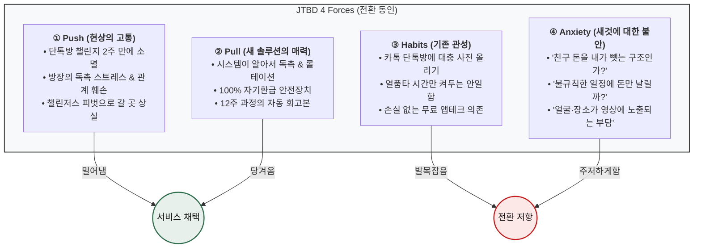

| 인물 | ① Push `[진술]` | ② Pull `[관찰]` | ③ Habit `[진술]` | ④ Anxiety `[관찰]` | Evidence `[모의·행동신호]` |
|---|---|---|---|---|---|
| **이준호** | 지각 2회 + 팀장의 무반응 → *"그런 사람으로 굳었다"* 자각 | **"계약 중 변경 불가"** 문구 하나 | 알람 5개 체계, **실패해도 대가 없어 편함** | **매칭 품질** — 모르는 사람과 묶이는 것 | ① 계약 **42초**(최장) · **② 예치 무반응** |
| **정하윤** | 헬스장 6개월 등록 후 2주 만에 붕괴 | **④ 축적 보드** — 독촉 주체를 사람→시스템 이전 | 카톡의 무마찰, 새 앱 설치가 곧 이주 비용 | **⑤ 정산 = 관계 비용** | ④ 축적 **51초**(최장) · ⑤ 정산 미간 찌푸림 |
| **김도현** | 무료 인증방 실패 + **계속 하고 있는 친구와의 비교** | ① 계약의 변경 불가 | **"아무것도 안 하는 게 제일 편하다"** + 읽씹 회피 | **"못 채울 것을 이미 안다"**는 자기 예측 | **② 예치 68초 — 전 대상 최장** |
| **박서연** | 9시간 평균으로 공부하고도 1차 낙방 | **④ 축적 그래프** — 인증이 아니라 **추세** | 열품타를 못 지움 / 미달 큰 날은 아예 안 적음 | **③ 완료 배지가 내 미달을 덮을 것** | ③ 인증 **47초** · **② 예치 언급조차 없음** |
| **한지우** | **주 90분 수작업** `[모의]` + 판정 부담 | ⑤ 정산 자동화 + ③ 인증 수단 | 엑셀은 본인이 만들어 편함 = **종속** | ⓐ 집단 이주 실패 ⓑ **예외 처리 부재** | ⑤ 정산 **55초** · 계약↔정산 3회 왕복 |
| **최민지** | 완주했는데 **아무것도 안 남았다** | **⑥ 회고본 단독** | 비공개 계정의 무마찰 = 무효력 | **역방향 — 참가비가 너무 싸다** | ⑥ 회고 **62초**(최장) · **금액 상향 시도(9명 중 유일)** |
| **여민석** | 임원 질문에 3년째 답을 못 함 | **④ 축적 = 보고서 슬라이드** | 엑셀은 **품의가 필요 없다** | 직원 예치=복지 아님 / 영상 개인정보 / 상금 급여·세금 | **④ 축적 71초 — 전체 최장** |
| **홍다인** | 적립 공허함은 **Push로 작동 안 함** (진짜 Push는 허리 통증) | **약함** — 예치 이후 관심 소실 | 무마찰·무손실 5년, **하루 7회 개봉** | **최고 수준** — 필라테스 잔여 12회 실물 기억 | ② 예치 **58초** 후 **회복 안 됨** |
| **송재현** | 2년의 기록 공백 | ③ 인증의 **무편집 업로드** | **"안 찍는 게 제일 편하다"** — 월 16회 중 5회 업로드 | 예치 무관심. **① 계약 기간 필드 + 그룹 강제** | ③ 인증 **49초** · **② 예치는 훑고 넘김** |

> **체류시간이 말하는 것** — 최장 체류 화면이 사람마다 다르고, **그 화면이 그 사람의 Pull이다.** 반대로 **② 예치 화면에서의 반응이 이 제품의 운명을 가른다**: 김도현 68초(최장)·홍다인 58초 후 회복 안 됨 — **둘 다 이탈자다.** 반면 박서연·송재현은 **예치를 언급조차 하지 않았다**(관심 없음). ⚠️ 체류시간은 **`[모의]` 가정값**이며 실측이 아니다.

### 2.4 Job 3분류 — 기능적 · 감정적 · 사회적

| Job 분류 | 페르소나별 구체적 Job |
|---|---|
| **기능적 Job**<br/>*Functional* | • **규칙 자동 집행:** 잔소리 없이 설정 시각에 시스템이 인증 요청·스트릭 갱신<br/>• **자기결정 계약:** 고정 시각이 아닌 *주 4회*·*단원별 진도* 등 유연한 계약<br/>• **초간편 무편집 인증:** 짧은 영상 촬영 즉시 타임스탬프와 함께 자동 업로드<br/>• **정량 리포트:** 개인 달성률 추이 및 조직 제출용 지표 자동 집계 |
| **감정적 Job**<br/>*Emotional* | • **손실 공포 해소:** 완주하면 1원도 잃지 않는다는 안도감<br/>• **죄책감 방어:** 하루 놓쳐도 조용히 복귀할 수 있음<br/>• **성취감 축적:** 스트릭과 12주 완성본을 통한 자부심 |
| **사회적 Job**<br/>*Social* | • **관계 보존:** 돈·독촉 때문에 친구 사이가 상하지 않음<br/>• **상호 페이스메이커:** *"나 때문에 그룹이 깨지지 않는다"*는 건강한 책임감<br/>• **인정·자랑:** 공유 가능한 완주 회고 영상 획득 |

### 2.5 🔴 리허설이 드러낸 것 — 설계와 어긋난 지점

> 리허설이라 **반증은 못 하지만**, 실제 인터뷰에서 최우선으로 확인해야 한다. **아래 4건은 §8 Feature 우선순위를 직접 바꿨다.**

| # | 어긋남 | 회차 | §8 반영 |
|:-:|---|:-:|---|
| **1** | **9명 전원이 정산 화면에서 같은 질문을 한다** — *"못 한 사람 돈이 저한테 오는 거예요?"* | **9/9** | **F06 정산 방식 선택**을 MVP 편입 + **§0.6 D2가 기본값을 비제로섬으로 확정** |
| **2** | **AOS 최하위 항목이 도입을 막는다** — 정하윤 이탈 1순위 `02`(AOS **0.8** · Q4 후순위), 한지우 도입 조건 `17`(0.8)·`18`(0.6) | B · E | F06에 **그룹 지갑**, F17에 **예외 처리** 반영 |
| **3** | **`SEG-F2`에 현재 설계가 역효과** — *"열품타는 시간만 보여주는데 이건 완료라고 말을 해준다. 오히려 더 나쁘다"* | D | **F10 진도 표시**를 High로 격상 |
| **4** | **5주차 개입이 알림으로는 안 풀린다** — 다시 붙잡은 것은 알림이 아니라 **PT 트레이너의 한마디**였다(*"누가 알아본 게 그때가 처음"*) | F | **F19를 알림형 → 사람 개입형**으로 재설계 |

**문항지 자체의 결함 6건** — 응답 내용보다 이쪽이 리허설의 실제 소득이다.

| # | 발견 | 회차 | 조치 |
|:-:|---|:-:|---|
| 1 | **Part 3-1이 *"없는데요"*로 닫힌다** — 대체 솔루션의 형태가 제품과 아예 다른 대상은 유사성을 스스로 못 찾는다. 재질문을 넣자 **필라테스 20회 선결제**와 **부계정 1년**이 나왔다 | H·I | *"비슷한"*을 **"돈이나 시간을 들여 뭔가를 꾸준히 해보려 한 적"**으로 넓힐 것 |
| 2 | **문항 전체가 "본인이 하는 사람"을 전제한다** — 여민석은 참여자가 아니라 **운영자**라 주어가 어긋났다(*"저 개인적으로요? 없는데요"*) | G | **운영자형 문항 세트**로 분기 |
| 3 | **"그만둔 날" 문항이 현재진행형 대상에게 공회전** — 한지우·송재현은 아직 안 그만뒀다. 바꾸자 **지난달 독촉 포기**와 **3주 공백**이 나왔다 | E·I | *"그만두려고 생각한 가장 최근"*으로 대체 |
| 4 | **금액 역질문이 유도 질문으로 읽힌다** — *"이거 답이 정해진 질문 아니에요?"* 하며 방어로 돌아섰고 **이후 두 문항 동안 답이 짧아졌다** | C | 후속 질문 **삭제**, 관찰 메모로만 |
| 5 | **데모 ⑤ 정산 화면에서 9명 전원이 같은 질문** | 9/9 | **정산 구조 설명을 데모에 넣고** 정식 문항으로 승격 |
| 6 | **Part 2가 Part 3·4를 밀어낸다** — 2건이 90분 초과 | E·F | Part 2를 **8→5문항**으로 축소 |

> **⚠️ 이 리허설의 구조적 한계** — ① 응답이 페르소나 서술의 **연역**이라 새 정보가 없고 **가설을 반증할 수 없다.** 진짜 인터뷰의 가치는 페르소나가 틀렸음을 알려주는 데 있는데 모의는 그걸 못 한다 ② **모든 대상이 협조적으로 답한다** — 실제로는 기억이 안 나거나 말을 아끼거나 사실과 다르게 말한다 ③ **데모 페이지가 아직 없다** — `[관찰]` 항목은 핵심 루프 6단계를 전제로 **가정해 쓴 것**이다 ④ **4 Forces 시트가 전부 채워진다** — 실제로는 네 칸 중 한둘이 비는 게 정상이며 **비는 것 자체가 데이터**다.

---

## 3. 고객이 원하는 Outcome (측정 가능 형태)

### 3.1 채점 방법과 42건 전량 점수 — AOS · DOS

#### 계산식과 척도

```
AOS = Importance × (1 − Satisfaction / 5)          ← 불만족을 비율로 센다
DOS = (Importance − Satisfaction) × Market Relevance  ← 불만족을 차이로 센다 (음수 가능)
MR  = 해당 Pain을 겪는 세그먼트의 도달 가능 인원 ÷ 모수  (인원 기준, 금액 아님)
```

| 항목 | 이 문서에서 쓴 기준 |
|---|---|
| **대상** | AOS는 42건 전량(비활성 6건 포함) / DOS는 `01`~`36` **36건**(비활성 6건은 Goal 방향이 제품과 반대라 제외) |
| **Importance** | **페르소나 본인 관점에서 Goal의 중요도.** 사업 관점 가중치는 넣지 않았다 — 넣으면 *"우리가 팔고 싶은 것"*이 상위로 올라와 도구의 목적이 훼손된다 |
| **Satisfaction** | **기존 대체 솔루션이 그 Goal을 얼마나 이뤄주는가.** 우리 제품은 아직 없어 측정 불가이므로 각 인물의 대체 솔루션을 기준선으로 삼았다 |
| **DOS 모수 2종** | 버전 A = **SAM 800만 명**(TAM 1,450만 × 보상 수용률 55%) / 버전 B = **SOM 232만 명**(Q1 자기계약 존, 중복 제거) → **버전 B 채택** |

| Importance | 의미 | | Satisfaction | 의미 |
|:-:|---|---|:-:|---|
| **5** | 막히면 **서비스를 쓸 이유가 없다** — 상위 Goal 그 자체 | | **5** | 기존 방식으로 **이미 충분히 이뤄지고 있다** |
| **4** | 상위 Goal 달성에 **직접적으로 필요** | | **4** | 대체로 이뤄진다 (불편은 있으나 목적은 달성) |
| **3** | 있으면 좋고 없으면 불편 | | **3** | 절반쯤 |
| **2** | 부차적 | | **2** | 거의 안 된다 (시도는 하는데 결과가 안 남음) |
| **1** | 거의 무관 | | **1** | **전혀 안 된다** (대체 수단 자체가 없음) |

> **Importance 중앙값 = 4** (5점 19건·4점 17건·3점 6건, **2점·1점 0건**) / **Satisfaction 중앙값 = 2** (1점 15건·2점 17건 = **32건 76%가 1~2점**).
> **S가 1~2점에 76% 몰린 것은 기존 대체 솔루션이 대부분의 Goal을 못 풀어주고 있다는 뜻**이며, 이 시장이 미개척이라는 신호다.

#### AOS 42건 전량 (내림차순)

| 순위 | # | 인물 | 단계 | Pain | **I** | **S** | **AOS** | 사분면 |
|:-:|:-:|---|:-:|---|:-:|:-:|:-:|:-:|
| **1** | `01` | 정하윤 | S3·S4 | 독촉 역할 재발 | 5 | 1 | **4.0** | 🔥 Q1 |
| **1** | `04` | 김도현 | S3 | 참가비 앞에서 결정 불가 | 5 | 1 | **4.0** | 🔥 Q1 |
| **1** | `11` | 이준호 | S1 | 그룹 없이 도착 | 5 | 1 | **4.0** | 🔥 Q1 |
| **1** | `13` | 최민지 | S4 | 5주차 붕괴에 개입 없음 | 5 | 1 | **4.0** | 🔥 Q1 |
| **1** | `16` | 한지우 | S1 | 크루 18명 집단 이주 | 5 | 1 | **4.0** | 🔥 Q1 |
| **1** | `29` | 여민석 | S5 | 보고용 숫자 없음 | 5 | 1 | **4.0** | 🔥 Q1 |
| **1** | `31` | 강수빈 | S2 | 계약 전 진단 부재 | 5 | 1 | **4.0** | 🔥 Q1 |
| **1** | `33` | 강수빈 | S5 | 손실 순환 | 5 | 1 | **4.0** | 🔥 Q1 |
| **1** | `34` | 배유진 | S4 | 인증 수단이 하나뿐 | 5 | 1 | **4.0** | 🔥 Q1 |
| **1** | `36` | 배유진 | S5 | 부당 몰수 | 5 | 1 | **4.0** | 🔥 Q1 |
| **11** | `03` | 정하윤 | S6 | 방장 역할 고정 | 4 | 1 | **3.2** | ⚫ Q3 |
| **11** | `30` | 여민석 | S4 | 개입 수단 없음 | 4 | 1 | **3.2** | ⚫ Q3 |
| **11** | `32` | 강수빈 | S4 | 실패 사유 미구분 | 4 | 1 | **3.2** | ⚫ Q3 |
| **11** | `35` | 배유진 | S3 | 돈 걸고 나서야 막힘 | 4 | 1 | **3.2** | ⚫ Q3 |
| **15** | `07` | 박서연 | S4 | 미달이 가려짐 | 5 | 2 | **3.0** | 🔥 Q1 |
| **15** | `14` | 최민지 | S6 | 과정이 안 남음 | 5 | 2 | **3.0** | 🔥 Q1 |
| **15** | `22` | 홍다인 | S3 | 예치 문턱 | 5 | 2 | **3.0** | 🔥 Q1 |
| **15** | `26` | 송재현 | S0 | 촬영·편집 마찰 | 5 | 2 | **3.0** | 🔥 Q1 |
| **15** | `40` | 조은비 | S3 | 도덕 판단과 논점 불일치 | 5 | 2 | **3.0** | 🔥 Q1 |
| **20** | `05` | 김도현 | S4 | 복귀 비용 급등 | 4 | 2 | **2.4** | ⚫ Q3 |
| **20** | `06` | 김도현 | S2 | 협상력 없이 동의 | 4 | 2 | **2.4** | ⚫ Q3 |
| **20** | `08` | 박서연 | S5 | 성과와 무관한 보상 | 4 | 2 | **2.4** | ⚫ Q3 |
| **20** | `09` | 박서연 | S2 | 정량 목표 불가 | 4 | 2 | **2.4** | ⚫ Q3 |
| **20** | `10` | 이준호 | S2·S6 | 시즌제 불일치 | 4 | 2 | **2.4** | ⚫ Q3 |
| **20** | `12` | 이준호 | S4 | 압력 약화·담합 | 4 | 2 | **2.4** | ⚫ Q3 |
| **20** | `20` | 윤채원 | S0 | 목표 순간 포착 실패 | 4 | 2 | **2.4** | ⚫ Q3 |
| **20** | `23` | 홍다인 | S1 | 혼자 도착 | 3 | 1 | **2.4** | ⚫ Q3 |
| **20** | `24` | 홍다인 | S2 | 난이도 낙관 | 4 | 2 | **2.4** | ⚫ Q3 |
| **20** | `28` | 여민석 | S2 | 대리 설계 | 4 | 2 | **2.4** | ⚫ Q3 |
| **30** | `19` | 윤채원 | S3 | 관계 화폐화 거부 | 5 | 3 | **2.0** | 💎 Q2 |
| **30** | `25` | 송재현 | S1 | 들어갈 자리 없음 | 5 | 3 | **2.0** | 💎 Q2 |
| **32** | `15` | 최민지 | S2 | 난이도 과대 설정 | 3 | 2 | **1.8** | ⚫ Q3 |
| **32** | `27` | 송재현 | S2 | 자기구속 약함 | 3 | 2 | **1.8** | ⚫ Q3 |
| **32** | `42` | 조은비 | S2 | 구조 고지 늦음 | 3 | 2 | **1.8** | ⚫ Q3 |
| **35** | `21` | 윤채원 | S1 | 전환 트리거 부재 | 4 | 3 | **1.6** | ⚠️ Q4 |
| **36** | `41` | 조은비 | S1 | 소개자 관계 부담 | 3 | 3 | **1.2** | ⚠️ Q4 |
| **37** | `39` | 서지훈 | S0 | 통제 상실 경험 잔존 | 5 | 4 | **1.0** | 💎 Q2 |
| **38** | `02` | 정하윤 | S5 | 상금 출처 = 친구 손실 | 4 | 4 | **0.8** | ⚠️ Q4 |
| **38** | `17` | 한지우 | S2 | 관행과 자동 집행 충돌 | 4 | 4 | **0.8** | ⚠️ Q4 |
| **40** | `18` | 한지우 | S5 | 공동 재원 상실 | 3 | 4 | **0.6** | ⚠️ Q4 |
| **41** | `37` | 서지훈 | S0 | 카테고리 낙인 | 5 | 5 | **0.0** | 💎 Q2 |
| **41** | `38` | 서지훈 | S1 | 설명이 안 통함 | 4 | 5 | **0.0** | ⚠️ Q4 |

#### 사분면 — 중앙값 기준 (Y=Importance 5 / X=Satisfaction 3 이상)

| | **◀ Low Satisfaction** (1~2점) | **High Satisfaction ▶** (3~5점) |
|:---|:---|:---|
| **▲ High Importance** (5점) | 🔥 **Q1 · 혁신기회 — 15건**<br/>AOS 4.0: `01` `04` `11` `13` `16` `29` `31` `33` `34` `36`<br/>AOS 3.0: `07` `14` `22` `26` `40`<br/>**→ JTBD 인터뷰·MVP 실험 최우선** | 💎 **Q2 · 개선기회 — 4건**<br/>AOS 2.0: `19` `25` / 1.0: `39` / 0.0: `37`<br/>**→ 지속적 개선** |
| **▼ Low Importance** (3~4점) | ⚫ **Q3 · 유지·보완 — 17건**<br/>AOS 3.2: `03` `30` `32` `35`<br/>AOS 2.4: `05` `06` `08` `09` `10` `12` `20` `23` `24` `28`<br/>AOS 1.8: `15` `27` `42`<br/>**→ UX·마케팅 최적화** | ⚠️ **Q4 · 과잉투자 위험 — 6건**<br/>AOS 1.6: `21` / 1.2: `41` / 0.8: `02` `17` / 0.6: `18` / 0.0: `38`<br/>**→ 자원 분배 재검토** |

> **경계선 값(중앙값 그 자체)은 Low에 포함**했다. 반대로 처리하면 Q1이 14건·Q2가 22건이 되어 **Satisfaction 2점을 "만족한다"고 부르는 해석상 모순**이 생긴다.
>
> **42건이 실제로 놓이는 좌표는 14개뿐**이며 **두 덩어리에 19건(45%)이 몰려 있다** — I5·S1 10건(AOS 4.0)과 I4·S2 9건(AOS 2.4). 이것이 아래 ⑤ 변별력 문제의 형태다.

#### DOS — 모수 선택이 순위를 어떻게 바꾸는가

| 인물 | 담당 번호 | 세그먼트 | 도달 가능 | **MR (SAM ÷800만)** | **MR (SOM ÷232만)** |
|---|---|:-:|---:|:-:|:-:|
| 정하윤·김도현 | `01`~`06` | **F1** 친구 목표 크루 | 108만 | 0.135 | **0.466** |
| 박서연 | `07`~`09` | **F2** 스터디 팟 | 69만 | 0.086 | **0.297** |
| 이준호 | `10`~`12` | **A1** 루틴 커미터 | 128만 | 0.160 | **0.552** |
| 최민지 | `13`~`15` | **A2** 기한 스프린터 | 40만 | 0.050 | **0.172** |
| 한지우 | `16`~`18` | **F3** 페널티 팟 | 41만 | 0.051 | **0.177** |
| 윤채원 | `19`~`21` | **C2** 데일리 크루 | 428만 *(Q1 전환분 143만)* | 0.535 | **0.616** ※ |
| 홍다인·송재현·여민석·강수빈·배유진 | `22`~`36` | 맵 밖 | `[미측정]` | ✕ | ✕ **계산 보류** |

※ 윤채원만 두 버전의 분자가 다르다 — C2는 Q1 밖(Q3)이라 SAM 기준은 전체 428만, SOM 기준은 **Q1 이동 가능분 143만**을 분자로 썼다.

| # | Pain | 인물 | I−S | **DOS (SOM · 채택)** | DOS (SAM) | SAM→SOM 순위 |
|:-:|---|---|:-:|:-:|:-:|:-:|
| `11` | 그룹 없이 도착 | 이준호 | 4 | **2.21** ①위 | 0.64 (3위) | 🔺 2 |
| `01` | 독촉 역할 재발 | 정하윤 | 4 | **1.86** ②위 | 0.54 (4위) | 🔺 2 |
| `04` | 참가비 앞 결정 불가 | 김도현 | 4 | **1.86** ②위 | 0.54 (4위) | 🔺 2 |
| `03` | 방장 역할 고정 | 정하윤 | 3 | **1.40** ④위 | 0.41 (7위) | 🔺 3 |
| `19` | 관계 화폐화 거부 | 윤채원 | 2 | 1.23 (5위) | **1.07** ①위 | 🔻 4 |
| `20` | 목표 순간 포착 실패 | 윤채원 | 2 | 1.23 (5위) | **1.07** ①위 | 🔻 4 |
| `10`·`12` | 시즌제 불일치 · 압력 약화 | 이준호 | 2 | 1.10 (7위) | 0.32 | ±0 |
| `05`·`06` | 복귀 비용 · 협상력 없음 | 김도현 | 2 | 0.93 (9위) | 0.27 | ±0 |
| `07` | 미달이 가려짐 | 박서연 | 3 | 0.89 (11위) | 0.26 | 🔺 1 |
| `16` | 크루 18명 집단 이주 | 한지우 | 4 | 0.71 (12위) | 0.20 | 🔺 1 |
| `13` | 5주차 붕괴 | 최민지 | 4 | 0.69 (13위) | 0.20 | ±0 |
| `21` | 전환 트리거 부재 | 윤채원 | 1 | 0.62 (14위) | 0.54 (4위) | 🔻 10 |
| `08`·`09` | 무관한 보상 · 정량 목표 불가 | 박서연 | 2 | 0.59 (15위) | 0.17 | ±0 |
| `14` | 과정이 안 남음 | 최민지 | 3 | 0.52 (17위) | 0.15 | ±0 |
| `15` | 난이도 과대 설정 | 최민지 | 1 | 0.17 (18위) | 0.05 | ±0 |
| `02`·`17` | 상금 출처 · 관행 충돌 | 정하윤·한지우 | 0 | **0.00** | 0.00 | ±0 |
| `18` | 공동 재원 상실 | 한지우 | **−1** | **−0.18** ⚠️ | −0.05 | ±0 |

#### 이 채점에서 읽어야 할 다섯 가지

**① Satisfaction을 Goal 기준으로 매기면 "제품을 안 쓰는 게 목표인 사람"이 자동으로 걸러진다.** 서지훈(`37`·`38`)은 Pain 기준이면 최상위로 올라오는 유형인데 결과는 **AOS 0.0, 공동 41위**다.

| | Pain 기준으로 채점하면 | **Goal 기준으로 채점하면** |
|---|---|---|
| 무엇을 묻나 | *"알림 앱이라 분류당하는 게 얼마나 해결됐나"* | *"알림에 하루를 안 뺏기는 게 얼마나 이뤄졌나"* |
| Satisfaction | 1 (전혀 해결 안 됨) | **5 (앱을 안 쓰니 완벽히 달성 중)** |
| AOS | 4.0 → 최상위 ❌ | **0.0 → 최하위 ✅** |

**② 최상위 10건 중 4건이 극단 사용자 2명에게서 나왔다.** 강수빈·배유진은 14명 중 2명(14%)인데 그들의 Pain 6건 중 5건이 AOS 3.2 이상이다. 이유는 명확하다 — **이들의 Goal은 *"쓸 수 있게 해달라"*는 기본 요구인데 기존 대체 솔루션이 전혀(S=1) 못 풀어준다.** → **포용적 설계가 곧 최대 기회**라는 뜻이며, 여정지도가 개선 1순위로 `계약 전 진단 설문`을 꼽은 것과 **독립적으로 같은 결론**이다.

**③ AOS가 못 잡는 통증이 있다 — "우리가 새로 만드는 문제".**

| # | 항목 | AOS | 왜 낮게 나왔나 |
|:-:|---|:-:|---|
| `02` | 상금 출처가 친구의 손실 | 0.8 | 단톡방엔 **애초에 돈이 안 걸려** 이 문제 자체가 없음 (S=4) |
| `17` | 관행과 자동 집행 충돌 | 0.8 | 지금은 총무 재량으로 **예외가 완전히 가능** (S=4) |
| `18` | 공동 재원 상실 | 0.6 | 지금은 모인 벌금을 **알아서 쓰고 있음** (S=4, DOS **음수**) |

> ⚠️ **AOS는 "기존에 안 풀린 문제"를 찾는 도구지 "우리가 새로 만들 문제"를 잡는 도구가 아니다.** 이 3건을 *"저기회 영역"*으로 읽고 방치하면 **도입 후 그대로 이탈 요인이 된다** — **별도 트랙(신규 유발 리스크)으로 관리해야 한다.** 실제로 §2.5 어긋남 2번이 이것을 증명했다: **정하윤의 이탈 1순위가 `02`(AOS 0.8), 한지우의 도입 조건이 `17`(0.8)·`18`(0.6)이다.**

**④ 사분면과 AOS 순위가 어긋나는 구간이 있다.** Q3(유지·보완)의 AOS 3.2 4건(`03`·`30`·`32`·`35`)이 Q1(혁신기회) 최하위 3.0 5건보다 **높다.** I4·S1(3.2)이 I5·S2(3.0)를 이기기 때문이며, **사분면은 두 축을 자르기만 하고 AOS는 곱하므로** 생기는 필연적 어긋남이다. → **사분면은 "성격 분류"로 쓰고 실행 순서는 AOS 순위로 정한다.**

**⑤ Importance 5점이 19건(45%)이라 변별력이 약하다.** AOS 4.0에 **10건이 동점**이라 1~10위 우열이 없다. 2차 정렬 기준이 필요하다 — **공유 인원**(`04`·`22` 예치 문턱은 4명, `31`·`35` 진단 부재는 2명) / **구현 난도**(`31` 진단 설문은 가볍고 `33` 손실 순환은 수익 구조 재설계) / **규제 시급성**(`33`·`36`은 사행성 심사 직결). **DOS가 이 동점을 갈라준다** — `11`(2.21) > `01`·`04`(1.86) > `16`(0.71) > `13`(0.69). **같은 통증 강도인데 시장 크기가 3.2배 차이**이며, 한지우·최민지의 Pain은 개인에게는 똑같이 절실하지만 **사업 관점에서는 후순위**라는 뜻이다.

> **모수 논쟁의 실질은 "C2를 시장으로 셀 것인가" 한 가지로 압축된다.** SAM 기준 DOS의 1위는 윤채원(`19`·`20`)인데 C2 데일리 크루 428만이 SAM 800만의 53.5%를 차지하기 때문이다. 그런데 §0.3은 C2를 **`직접 타깃 ✕ · 공급원 ○`**로 배제했다 — 즉 **SAM 기준 DOS는 "우리가 돈을 받지 않기로 한 사람의 Pain"을 최우선 기회로 지목한다.** SOM 기준은 그 오류를 자동으로 걸러내므로 **버전 B 채택이 일관된다.**

#### AOS × DOS 혼합 매트릭스 — 절실도와 시장 크기를 교차한 실행 순서

> 두 점수를 **각각의 순위로만** 보면 실행 순서가 안 나온다. **X축 AOS(고객 절실도) · Y축 DOS(시장 가중)**로 교차 배치하면 *"누구부터"*가 결정된다.
> **대상 21건** — 36건 중 MR이 산출된 항목만. **모수 미측정 15건은 Y축 값이 없어 배치 자체가 불가능**하다.
> **기준선** — AOS 중앙값 **2.4** / DOS(SOM) 중앙값 **0.89** / DOS(SAM) 중앙값 **0.27**. 경계값은 AOS 채점과 동일하게 Low에 포함.

| | **◀ Low AOS** (≤2.4) | **High AOS ▶** (>2.4) |
|:---|:---|:---|
| **▲ High DOS**<br/>(>0.89) | 📈 **Q2 · 시장 선점 — 6건**<br/>`20` 목표 순간 포착 (2.4 / 1.23) · `19` 관계 화폐화 (2.0 / 1.23)<br/>`10` 시즌제 (2.4 / 1.10) · `12` 담합 (2.4 / 1.10)<br/>`05` 복귀 비용 (2.4 / 0.93) · `06` 협상력 (2.4 / 0.93)<br/>**→ 통증은 보통인데 대상이 많다. 규모로 정당화** | 🔥 **Q1 · 최우선 실행 — 4건**<br/>**`11` 그룹 없이 도착 (4.0 / 2.21)**<br/>**`01` 독촉 재발 (4.0 / 1.86)**<br/>**`04` 참가비 결정 불가 (4.0 / 1.86)**<br/>`03` 방장 역할 고정 (3.2 / 1.40)<br/>**→ 고객도 절실하고 시장도 크다. MVP 1순위** |
| **▼ Low DOS**<br/>(≤0.89) | ⚫ **Q3 · 후순위 — 7건**<br/>`08`·`09` 박서연 (2.4 / 0.59) · `21` 전환 트리거 (1.6 / 0.62)<br/>`15` 난이도 과대 (1.8 / 0.17)<br/>**`02`·`17` 신규 유발 (0.8 / 0.00) · `18` 재원 상실 (0.6 / −0.18)** | 💎 **Q4 · 니치 · 신뢰 자산 — 4건**<br/>`16` 집단 이주 (4.0 / 0.71) · `13` 5주차 붕괴 (4.0 / 0.69)<br/>`07` 미달 가려짐 (3.0 / 0.89) · `14` 과정 부재 (3.0 / 0.52)<br/>**→ 소수에게 결정적. 충성도·차별화 재료** |

**이 매트릭스가 알려주는 것 네 가지**

| # | 발견 | 실행 함의 |
|:-:|---|---|
| **1** | **Q1(최우선) 4건은 SAM·SOM 두 버전이 완전히 같다** — `11`·`01`·`04`·`03` | **미측정 15건의 모수 추정을 기다리지 않고 지금 착수할 수 있다** |
| **2** | **Q4(니치) 4건도 두 버전이 같다** — 최민지 2건·박서연 2건·한지우 1건 | 공통점은 **AOS 3.0~4.0의 강한 통증인데 세그먼트가 작다**(A2 40만·F2 69만·F3 41만). **버릴 항목이 아니다** — 특히 `13`은 **ARPU 최고 세그먼트**의 통증이다 |
| **3** | **모수를 바꿔도 움직이는 것은 윤채원·김도현뿐이다** — 21건 중 17건이 사분면 동일 | 모수 논쟁이 실행 순서를 거의 바꾸지 않는다 |
| **4** | **Q3 좌하단 끝 3건(`02`·`17`·`18`)은 성격이 다르다** — 두 축 모두 최하위 | *"아직 안 풀린 문제"*가 아니라 **우리 제품이 새로 만드는 문제**다. **후순위가 아니라 아예 다른 트랙(신규 유발 리스크)으로 빼야 한다** |

> **매트릭스가 제안하는 실행 순서** — ① **Q1 4건**(오픈 매칭 품질 · 방장 독촉 이관 · 예치 사다리 · 역할 로테이션) → ② **Q4 중 `13` 5주차 개입**(ARPU 최고 세그먼트) → ③ **Q2 중 `05`·`06`**(F1은 Y1 진입 세그먼트라 초기 리텐션 직결) → ④ **`02`·`17`·`18` 트랙 분리** → ⑤ **보류 15건 모수 추정**.
>
> ⚠️ **X축과 Y축이 독립이 아니다.** AOS와 DOS 모두 같은 `Importance`·`Satisfaction`에서 출발하므로 **완전히 직교하는 두 관점의 교차가 아니며**, 그래서 좌상단(Q2)과 우하단(Q4)이 상대적으로 빈다. 또한 **MR을 인원 기준으로 썼다** — 금액 기준(÷263억)으로 바꾸면 F2(박서연)가 0.297 → 0.156으로 크게 내려가 **박서연 3건의 위치가 가장 민감하다.**

### 3.2 Outcome 13건 — 고객이 달성하려는 이상 상태

> **`I`·`S`·`AOS`·`DOS`는 §3.1의 실계산값**이다. `MR`은 **SOM 232만 명**을 분모로 쓴 채택 기준안이다(SAM 800만 기준과 절대값이 3~4배 차이 나므로 병기 필수).
> **측정 지표는 관측값이 아니라 검증해야 할 목표치**다 — `[목표·미검증]`. **baseline이 없으므로 개선 배수·목표 퍼센트는 제시하지 않는다.**

| # | **Outcome — 고객이 달성하려는 이상 상태** | 인물 | I | S | **AOS** | MR | **DOS** | **측정 지표** `[목표·미검증]` | §0 스코프 |
|:-:|---|---|:-:|:-:|:-:|:-:|:-:|---|:-:|
| **O1** | 그룹 없이 시작해도 **상호작용이 살아 있는 소수 그룹**에 배정된다 | 이준호 | 5 | 1 | **4.0** | 0.552 | **2.21** | 배정 후 7일 내 그룹 내 반응 1건 이상 발생률 | **Y2** |
| **O2** | 방장이 **독촉을 한 번도 하지 않고** 시즌이 끝난다 | 정하윤 | 5 | 1 | **4.0** | 0.466 | **1.86** | 시즌 중 방장 수동 독촉 **0회** · 그룹 완주율 | **Y1** |
| **O3** | **돈을 걸지 않고** 강제력을 1회 경험한 뒤 예치로 넘어간다 | 김도현 | 5 | 1 | **4.0** | 0.466 | **1.86** | 무예치 시즌 → 유료 예치 **전환율** | **Y1** |
| **O4** | 방장 역할이 **시즌마다 자동으로 교체**된다 | 정하윤 | 4 | 1 | 3.2 | 0.466 | **1.40** | 2시즌 연속 동일 방장 비율 · 그룹 소멸률 | **Y1** |
| **O5** | 출석이 아니라 **목표 대비 진도**로 평가받는다 | 박서연 | 5 | 2 | 3.0 | 0.297 | 0.89 | 주차별 **미달 폭 감소 추세** 관측 가능 여부 | **Y2** |
| **O6** | 크루 **전원이 한 번에** 이주하고 이중 운영이 없다 | 한지우 | 5 | 1 | **4.0** | 0.177 | 0.71 | 그룹 이주 완전율 · 총무 주간 수작업 **90분 → 0분** `[모의]` | **Y2** |
| **O7** | **5주차 붕괴 구간을 넘겨** D-day까지 간다 | 최민지 | 5 | 1 | **4.0** | 0.172 | 0.69 | 5주차 잔존율 · 12주 완주율 | **Y1** |
| **O8** | 12주의 과정이 **못 한 날을 포함해** 한 편으로 남는다 | 최민지 | 5 | 2 | 3.0 | 0.172 | 0.52 | 회고본 수령자의 **다음 시즌 재계약률** | **Y1** |
| **O9** | 부서별 달성률·지속률·이탈 시점을 **보고서로** 뽑는다 | 여민석 | 5 | 1 | **4.0** | `보류` | `보류` | 담당자 집계 시간 · 익년 예산 품의 통과 | **Y3** |
| **O10** | **손실 없이** 구조를 먼저 겪는다 | 홍다인 | 5 | 2 | 3.0 | `보류` | `보류` | 무예치 시즌 완주율 · 이후 예치 전환율 | **Y1** |
| **O11** | **편집 없이** 기록이 저절로 쌓인다 | 송재현 | 5 | 2 | 3.0 | `보류` | `보류` | 운동 대비 업로드율 (현재 31% `[모의]`) | **Y2** |
| **O12** | 내 근무표로 **지킬 수 있는 조건**을 계약 전에 고른다 | 강수빈 | 5 | 1 | **4.0** | `보류` | `보류` | 진단 통과군 vs 미통과군 **완주율 격차** | **Y1** |
| **O13** | 촬영이 금지된 곳에서도 **운동을 증명**한다 | 배유진 | 5 | 1 | **4.0** | `보류` | `보류` | 대체 인증 수단 사용률 · 부당 몰수 **0건** | **Y1** |

> ### 🔴 이 표의 최대 공백 — 계산 보류 15건
> **AOS 4.0 상위 10건 중 5건(`29`·`31`·`33`·`34`·`36` = O9·O12·O13 계열)의 DOS가 `계산 보류`**다. 해당 인물이 Market Segment Map 밖에서 발산된 페르소나라 모수가 `[미측정]`이기 때문이다.
>
> | 인물 | 번호 | 필요한 모수 |
> |---|---|---|
> | **여민석** | `28`·`29`·`30` | 사내 건강 챌린지를 운영하는 국내 기업 수 · 임직원 규모 |
> | **강수빈** | `31`·`32`·`33` | 교대·유동 근무자 중 습관 형성 수요층 |
> | **배유진** | `34`·`35`·`36` | 촬영 제약 환경에서 운동하는 인구 |
> | **홍다인** | `22`·`23`·`24` | 앱테크 이용자 중 예치형 전환 가능층 |
> | **송재현** | `25`·`26`·`27` | 개인 운동 기록 SNS 운영자 |
>
> **0으로 처리하지 않고 `보류`로 표기한 이유** — 0으로 두면 *"고객에게 가장 절실한 문제의 절반"*이 시장 우선순위에서 통째로 사라진다. **모수를 추정해 넣기 전까지 AOS와 DOS는 같은 선상에서 비교할 수 없다.**
>
> ⚠️ **부분 해소** — 교대근무 임금근로자 **≈229만 명**(임금근로자 2,241.3만 `[실측]` × 교대근무율 10.2% `[실측]`)과 헬스 참여 10~39세 **≈160만 명**(생활체육 참여율 62.9% × 보디빌딩 17.5% `[실측]`)을 확보했으나, 이는 **횡단 속성이라 독립 세그먼트로 DOS를 계산하면 이중 계상**된다. 그래서 여전히 `보류`다.

**이 채점의 구조적 한계** — ① **I·S 값 84개 전부가 작성자 판단**이며 AOS는 입력값의 신뢰도를 넘지 못한다 ② 원본이 **가상 인물**이라 순위 전체가 같은 미검증 상태를 물려받는다 ③ **Satisfaction 기준선이 인물마다 다른 대체 솔루션**(김도현=단톡방, 홍다인=캐시워크, 여민석=엑셀)이라 **인물 간 비교는 인물 내 비교보다 약하다** ④ **MR이 세그먼트 단위**라 같은 인물의 Pain 3건이 전부 같은 MR을 받고, 버전 내 순위는 사실상 `I−S`로만 갈린다 ⑤ **SOM 기준 MR 비중 합이 1.66**(개별 합 386만 vs 중복 제거 232만)이라 **상대 비교용으로만** 써야 한다 ⑥ **AOS와 DOS는 불만족을 다르게 센다**(비율 vs 차이) — **두 점수의 절대값은 비교 대상이 아니다.**

---

## 4. 기존 대안 (Competitor / Substitute)

> **경쟁자를 "같은 카테고리 앱"이 아니라 "같은 Job에 고용되는 모든 것"으로 정의했다.** JTBD 관점에서 경쟁자는 제품 분류가 아니라 **고객이 그 일을 시키려고 지금 쓰고 있는 것**이다.
>
> **도출 경로** — 14인 페르소나가 적어 둔 `대체 솔루션` 항목을 전수 수집(언급 빈도: BeReal 62 · 챌린저스 50 · 셋로그 48 · 열품타 35 · 캐시워크 23 · 알라미 10 · 손목닥터 9 · 스트라바 3) → **BM 중복 제거 → 9종 확정.**
>
> **왜 이 방식인가** — §3.1의 Satisfaction은 *"기존 대체 솔루션이 그 Goal을 얼마나 이뤄주는가"*로 정의했다. 즉 **AOS 점수 42개는 전부 이 경쟁자들을 기준선으로 매겨진 값**이다. 경쟁자 목록이 바뀌면 AOS 순위 전체가 흔들린다. 경쟁자 선정은 임의 선택이 아니라 **이미 채점에 쓰인 기준선을 명시화하는 작업**이다.

### 4.0 경쟁 축과 대응 관계 — 우리가 뺏기는 것

| 경쟁 축 | 서비스 | **우리가 뺏기는 것** | 위협받는 페르소나 | 관련 Pain (AOS) |
|---|---|---|---|---|
| **① 돈을 거는 계약 구조** | 챌린저스 · stickK | **수익 모델 그 자체** (R2 참가비 take) | 이준호 · 김도현 · 최민지 · 강수빈 | `11` **4.0** · `04` **4.0** · `13` **4.0** · `33` **4.0** |
| **② 그룹 정시 숏폼 인증 포맷** | 셋로그 · BeReal | **획득 채널과 사용자 시간** | 윤채원 · 서지훈 | `19` 2.0 · `20` 2.4 · `37` 0.0 · `39` 1.0 |
| **③ 목표 그룹 버티컬** | 열품타 | **F2 스터디 팟 세그먼트 69만 명** | 박서연 | `07` **3.0** · `09` 2.4 |
| **④ 보상 수용층 선점** | 캐시워크 | **SAM 800만의 전제인 "보상 수용률 55%"** | 홍다인 | `22` **3.0** |
| **⑤ 조직·공공 재원** | 손목닥터9988 | **예치 관문을 우회하는 3층 수익 구조** | 여민석 | `29` **4.0** |
| **⑥ 개인 자기구속·기록** | 알라미 · 스트라바 | **무료 개인 트랙과 R1 구독** | 이준호 · 송재현 | `12` 2.4 · `26` **3.0** · `25` 2.0 |

### 4.1 경쟁 서비스 9종 — 규모 · BM · 전략 · 역산한 가치 선언

> 규모 수치는 **가장 최근 확인 가능한 회계연도** 기준이다. 가치 선언은 기업이 발표한 슬로건이 아니라 **사업 활동을 근거로 역산한 것**이다.

#### A. 챌린저스 (화이트큐브, 2018 출시) — 돈을 거는 계약

| 항목 | 내용 |
|---|---|
| **규모** | **2025 매출 272억원**(2024 147~150억 → **+85%**) `[실측]` · 2023 첫 연간 흑자 · 누적 사용자 171만(2024.3) → 200만 · **습관 시절 누적 거래액 5,000억원** · 제휴 브랜드 1,015개 · 일본 10개월 누적 26억원(가입자 6.7만) |
| **구 BM** | 참가비 예치 → 사진 인증 → 달성률 환급 + **미달성자 몰수금을 상금화.** 플랫폼은 거래액 수수료 |
| **현 BM** | 뷰티·생활용품 최대 90% 할인 판매 후 **실사용·영수증 인증 시 구매액 80%+ 캐시백.** 실질 수익원은 **브랜드사의 성과연동형 광고비** |
| **전략** | *"인증하면 돈이 돌아온다"*는 메커니즘은 유지한 채 **대상만 행동 → 소비로 갈아탰다.** 앱 명칭이 *"돈이 돌아오는 쇼핑 앱"*으로, **습관 형성은 브랜드 전면에서 사실상 내려갔다** |
| **역산한 가치 선언** | *"사람은 결심으로 바뀌지 않는다. 잃을 것이 있을 때 바뀐다. **그리고 그 원리는 습관에만 쓰이라는 법이 없다.**"* |
| **무엇을 못 하나** | **떠났다.** 2023년 초 피벗. 익명 다수라 **압박이 얕았음** |

> **🔴 이것이 §4에서 가장 값비싼 정보다.** 챌린저스는 **핵심 메커니즘을 버리지 않았다** — 루프는 그대로고 **인증의 대상만** 바뀌었다. 그러자 재원이 **사용자의 몰수금(제로섬)에서 브랜드사의 광고 예산(포지티브섬)으로** 옮겨갔다.
> 우리는 이 피벗을 *"5,000억이 증명한 WTP가 회수되지 않은 채 남았다"*는 **시장 공백**으로 읽는다. 그 독법은 유효하다. **다만 반대편 독법도 함께 봐야 한다** — **국내에서 이 메커니즘을 가장 오래 운영한 팀이, 흑자를 낸 뒤에, 제로섬 재원을 스스로 버렸다.** 이것이 우리 R2(참가비 take 12%, 약 60억원)의 타당성에 직결되며, §1.4의 **"제로섬 재원" 묶음 4건**(`02`·`19`·`33`·`40`)과 정확히 같은 지점을 가리킨다.

**출처** — [플래텀 2025 매출 272억](https://platum.kr/archives/278211) · [유니콘팩토리](https://www.unicornfactory.co.kr/article/2025122910033793049) · [플래텀 2024 매출 150억](https://platum.kr/archives/249818) · [스타트업엔 뷰티 피벗](https://www.startupn.kr/news/articleView.html?idxno=50192) · [이데일리 '습관보다 소비가 강했다'](https://edaily.co.kr/News/Read?mediaCodeNo=257&newsId=04457526645480408) · [Google Play](https://play.google.com/store/apps/details?id=kr.co.whitecube.chlngers) · [App Store](https://apps.apple.com/kr/app/id1438855824) · [THE VC](https://thevc.kr/whitecube) · [테크42 누적 5,000억·171만](https://www.tech42.co.kr/)

#### B. 셋로그 (뉴챗, 2025 말 iOS 출시) — 그룹 정시 숏폼 포맷

| 항목 | 내용 |
|---|---|
| **규모** | **MAU 778만 명**(2026.5), **광고비 0원**으로 달성 `[실측]` · 10~30대 **91.2%**(20대 45.1 / 10대 이하 23.6 / 30대 22.5) · 10·20대 중 여성 **76.2%** · 2026.4 안드로이드 확장 직후 앱스토어 1위 · **매출·수익 공개된 바 없음** |
| **BM** | **현재 수익 모델 없음(미공개).** 1~3시간 주기 알림 → 2~4초 영상 → 하루치를 **자동 분할 화면 브이로그로 합성** |
| **전략** | **획득을 완전히 유기적 확산에 걸었다** — 마케팅비 0원으로 국내 10~39세의 **53.7% 도달.** 전략의 핵심은 **편집 노동의 제거**. 서울·미국 사무소 병행으로 처음부터 글로벌 전제 |
| **역산한 가치 선언** | *"기록할 만한 하루가 따로 있는 게 아니다. 꾸미지 않아도 괜찮다. **그러니 편집은 우리가 대신하겠다.**"* |
| **무엇을 못 하나** | **목표가 없다.** 기록은 쌓이나 *무엇을 통과했는지*가 남지 않음. ⚠️ **최대 리스크가 수익 모델 부재**이며 이는 MAU 4,000만에서 종료된 **Zenly와 같은 좌표** |

> **셋로그는 우리의 경쟁자이자 획득 채널이라는 이중 지위에 있다.** §0.3은 셋로그 사용자층(C2 데일리 크루 428만)을 **Q3 → Q1 좌표 이동 대상**으로 설계하고 143만을 전환 가능분으로 잡았다. **그런데 이 관계는 셋로그가 수익화를 시작하는 순간 성격이 바뀐다.** 그 방향이 만약 *"목표·챌린지 기능 추가"*라면 **우리의 획득 채널이 그날로 정면 경쟁자가 된다. 그리고 그들은 이미 778만 명을 갖고 있다.**

**출처** — [와이즈앱 MAU 778만](https://www.wiseapp.co.kr/insight/detail/1011/setlog-sns-app-mau-in-korea) · [뉴시스](https://www.newsis.com/view/NISX20260605_0003657349) · [한국일보 트렌드 2026](https://v.daum.net/v/20260625110202630) · [쿠키딜 2세대 영상 앱 분석](https://cookiedeal.io/blog/post/) · [THE VC 뉴챗](https://thevc.kr/newchat) · [App Store](https://apps.apple.com/kr/app/setlog/id6587576438)

#### C. 열품타 (팔로, 2018 출시) — 스터디 버티컬

| 항목 | 내용 |
|---|---|
| **규모** | **MAU 210만 명** `[러프·2차 출처]` · 누적 가입자 1,200만 · **스터디 그룹 100만 개 이상** · 교육 카테고리 1위(2위 90만 대비 **2.3배**) · **마케팅 없이 100% 바이럴** |
| **BM** | 무료 앱 + 인앱 광고·인앱 구매 `[러프]`. **구체적 매출 구성은 공개된 바 없다** |
| **전략** | *"시간을 잰다"*는 **단일 기능으로 버티컬을 독점.** 실시간 랭킹과 스터디 그룹으로 **상호 감시를 게임화**해 도구를 그대로 리텐션 장치로 전환. 대표=앱 개발자 동일인의 **극소 조직** |
| **역산한 가치 선언** | *"공부는 혼자 하는 것이지만, 혼자 두면 안 되는 것이다. **그래서 우리는 당신의 시간을 재고, 그 숫자를 남들 옆에 놓는다.**"* |
| **무엇을 못 하나** | 재는 것이 **"앉아 있던 시간"**뿐 — **목표 대비 진도는 다루지 않는다.** 남들이 **모르는 사람**이다 |

> **열품타는 F2 세그먼트를 점유했지만 그 세그먼트의 상위 Goal은 해결하지 못했다.** 박서연 Pain `07`(**AOS 3.0**)이 그 공백이다. **다만 이 공백을 파고들려면 우리가 "진도"를 계약 가능한 형태로 표현할 수 있어야 하는데, 이는 Pain `09`로 우리에게도 아직 미해결이다**(§8 F10·F12).

**출처** — [나무위키 열정 품은 타이머](https://namu.wiki/w/%EC%97%B4%EC%A0%95%20%ED%92%88%EC%9D%80%20%ED%83%80%EC%9D%B4%EB%A8%B8) · [혁신의숲 팔로](https://www.innoforest.co.kr/company/CP00010666) · [App Store](https://apps.apple.com/kr/app/%EC%97%B4%ED%92%88%ED%83%80/id1441909643) · [Google Play](https://play.google.com/store/apps/details?id=com.pallo.passiontimerscoped) · [로켓펀치](https://www.rocketpunch.com/companies/pallo)

#### D. 캐시워크 (넛지헬스케어, 2017 출시) — 보상 수용층 선점

| 항목 | 내용 |
|---|---|
| **규모** | **2025 매출 898억원**(전년비 **+2.2%**) · 영업이익 72.5억(OPM 8.1%) `[실측]` · 추이 2022 613.1억 → 2023 792.3억 → 2024 878.9억 → 2025 898억 · MAU 600만(2020 실측)<br/>⚠️ **2023년 "1,056억(사상 최대)" 보도 병존** — 연결/별도 기준 차이로 보이며 본 문서는 **별도 시계열 채택** |
| **BM** | **리워드 광고 + 커머스.** 걸음 100보당 1캐시 → 기프티콘·상품 구매. 실수익은 **잠금화면·오퍼월 광고 + 제휴 커머스 마진** |
| **전략** | ***"이미 하고 있는 행동을 정산해 준다"*** — 새 습관도 결심도 필요 없고 **잃을 것도 없다.** 이 구조가 국내에 **보상형 수용 인구를 대량 학습**시켰다 |
| **역산한 가치 선언** | *"건강해지라고 요구하지 않는다. 당신이 이미 걸은 걸음에 값을 쳐줄 뿐이다."* |
| **무엇을 못 하나** | **아무것도 요구하지 않아 아무것도 안 바뀐다.** *"보상은 받는 것"* 인식이 **예치 문턱을 세움**(`22`) |

> **우리 SAM 추정 전체가 이 회사에 걸려 있다.** SAM 800만은 **보상 수용률 55%** 위에 서 있고, 그 55%는 리워드 광고 참여자 1,870만·Z세대 앱테크 62.4% 같은 **캐시워크형 적립 경험**에서 유도됐다. 그런데 **"적립 수용 ≠ 예치 수용"**이다(§1.0 발견 5).
> **캐시워크는 우리 시장을 만들어 준 동시에 우리 진입 장벽을 세웠다.** 그리고 성장 둔화(+2.2%)는 **적립형 모델이 한계에 닿았다**는 신호이자 그 사용자들이 다음 단계를 찾고 있을 수 있다는 신호다.

**출처** — [뉴스1 2023 매출 1,056억](https://www.news1.kr/industry/sb-founded/5347235) · [플래텀](https://platum.kr/archives/223980) · [사람인 재무정보 2025 898억](https://m.saramin.co.kr/job-search/company-info-view/finance?csn=M2ttVnFiU3hHVUp2SE5xZkZFQ01MQT09) · [THE VC 결제·고객 분석](https://thevc.kr/nudgehealthcare/consumer-transactions) · [이데일리 2020 328억·MAU 600만](https://edaily.co.kr/News/Read?mediaCodeNo=257&newsId=01157846629243752) · [잡코리아](https://www.jobkorea.co.kr/recruit/co_read/c/cashwalk)

#### E. 손목닥터9988 (서울특별시, 2021 시작) — 조직·공공 재원

| 항목 | 내용 |
|---|---|
| **규모** | **참여자 200만 명 돌파**(2025.3) `[실측]` · 2024.6 100만 → 2025.3 200만(**9개월 만에 2배**) · **포인트 예산 2021 약 15억(참여자 5만) → 2024 232억 → 2025 300억원 초과 전망** · 2026년까지 누적 303만 목표 · **서울 인구 940만 대비 참여율 21.3%** |
| **BM** | **공공 예산 기반 인센티브(수익 모델 없음).** 1일 8,000보 → 200P(70세 이상 5,000보), **1P=1원**, 연 최대 10만P. 서울페이 가맹 병원·약국·편의점에서 사용 |
| **전략** | **재원이 사용자도 광고주도 아닌 "예산"이다** — 참여자는 **잃을 것이 전혀 없고 달성하면 받는다.** 제로섬이 아예 없는 구조. 스마트워치 없이 스마트폰만으로 참여 가능하게 열어 접근성 장벽 제거 |
| **역산한 가치 선언** | *"시민이 건강해지는 데 드는 비용은 시민 개인이 아니라 도시가 낸다. 9988 — 99세까지 팔팔하게."* |
| **무엇을 못 하나** | ⚠️ **시의회가 *"효과성 검증 없이 예산만 300억까지 확대"*를 지적**해 포인트 상한을 **17만 → 10만P로 하향.** ***"참여자 수는 늘었는데 건강이 좋아졌다는 증거가 없다"*** |

> **두 방향으로 읽힌다.** **① 기회** — 여민석이 여는 조직 재원 경로의 **실재 증명**이다. §1.0 발견 7이 말한 우회로가 **연 300억 규모로 이미 집행되고 있다.** **② 경고** — 이 사업이 받는 지적이 바로 **여민석의 Pain `29`(AOS 4.0)와 같은 문제**다. 조직·공공 재원 경로에 들어가려면 **참여율이 아니라 지속률·달성률·이탈 시점을 보고 가능한 형태로 내놓는 것**이 곧 제품 사양이다 — **이것이 우리에게는 경쟁 우위의 자리다.**

**출처** — [서울 정책아카이브](https://www.seoul.go.kr/policy/view.do?id=67) · [서울시 미디어허브 200만 돌파](https://mediahub.seoul.go.kr/archives/2010449) · [서울Pn 예산 300억·효과성 검증 촉구](https://www.seoul.co.kr/news/publicnews/local_govern/smc_movement/2024/11/20/20241120500062) · [세계일보 시의원 지적](https://jeonnam.thesegye.com/news/view/1065575445682085) · [서울시 청년정책](https://youth.seoul.go.kr/infoData/plcyInfo/view.do?plcyBizId=R2024041821927)

#### F. 알라미 (딜라이트룸, 2012 출시) — 개인 자기구속

| 항목 | 내용 |
|---|---|
| **규모** | **2025 매출 460억원 · 영업이익 200억원 · 영업이익률 40% 초과** `[실측]` · 추이 2023 230억 → 2024 337억 → 2025 460억 · 글로벌 누적 다운로드 **1억 건** · **MAU 700만** · 애드테크 자회 사업 'DARO' 연 매출 100억 돌파 · **외부 투자 유치 없이 달성** |
| **BM** | **광고 + 구독 이원 구조.** 미션(수학 문제·사진·흔들기) 완수해야 알람이 꺼지는 앱을 무료 배포하고 광고 제거·고급 미션을 구독으로 판매 + **자체 애드테크를 별도 수익원으로 분사 성장** |
| **전략** | ***"의지를 믿지 않는다"*를 제품 기능으로 직역했다** — 사용자가 스스로 끄지 못하게 만드는 것이 곧 제품 가치. **기상이라는 매일 반드시 발생하는 단일 순간**을 점유해 리텐션을 구조적으로 확보 |
| **역산한 가치 선언** | *"우리는 당신의 의지를 믿지 않는다. 그래서 당신이 끌 수 없는 알람을 만든다."* |
| **무엇을 못 하나** | 강제력이 **혼자 완결된다** — 지켜보는 사람도 걸린 돈도 없음 |

> **알라미는 "자기구속을 돈 받고 판다"는 명제를 국내에서 가장 수익성 높게 증명한 회사**다(OPM 40%). 이준호가 챌린저스 공백 이후 알라미류로 옮겨갔지만 여전히 *"아무도 나를 안 봐서 압박이 약하다"*(`12`)고 말하는 이유가 여기 있다. **우리의 차별점은 강제력의 유무가 아니라 강제력의 사회적 형태다.**

**출처** — [플래텀 2025 매출 460억·영업이익 200억](https://platum.kr/archives/279441) · [뉴스와이어 공식 보도자료](https://www.newswire.co.kr/newsRead.php?no=1026731) · [유니콘팩토리](https://www.unicornfactory.co.kr/article/2026011309500633471) · [모비인사이드 OPM 40% 분석](https://www.mobiinside.co.kr/2026/01/13/delightroom-2025-performance/) · [벤처스퀘어](https://www.venturesquare.net/1032467) · [AB180 인터뷰](https://blog.ab180.co/posts/delightroom-interview)

#### G. 스트라바 (미국, 2009 출시) — 개인 기록 축적 + 구독

| 항목 | 내용 |
|---|---|
| **규모** | **2025 매출 약 $415M**(전년비 +18.5%, 일부 추정 $500M — **하한 채택**) `[실측]` · 등록 사용자 1.8억(2025) → **1.95억 이상**(2026.4), 185개국 · 월 300만 순증 · 2025년 활동 **40억 건** |
| **BM** | **구독 단일 축.** 기록·소셜 피드는 무료, 세그먼트 순위·상세 분석·목표 관리는 유료 → **데이터는 주되 의미는 판다.** 2025.4 **Runna 인수**, 5월 The Breakaway 인수 후 **번들 $149.99/년** |
| **전략** | ***"기록이 곧 정체성"*** — 오래 쓸수록 떠나기 어려워지는 구조로 리텐션이 **자산의 함수**가 된다. 클럽·챌린지·리더보드로 **금전 없이 사회적 압력만으로** 지속을 만든다 — **우리와 정반대의 해법** |
| **역산한 가치 선언** | *"당신이 달린 모든 거리는 사라지지 않는다. 그 축적이 곧 당신이 어떤 사람인지를 말해준다."* |
| **무엇을 못 하나** | 클럽은 있으나 **실패에 아무 일도 안 일어난다.** **이 선언 어디에도 "지키게 만든다"는 없다** |

> **두 가지가 정면으로 부딪힌다.** **① 위협** — 송재현의 Goal은 스트라바가 15년간 갈고닦은 바로 그것이다. 무료 개인 트랙을 열 때 이 회사와 정면으로 만난다. **② 확인** — 그런데 스트라바는 *"기록"*과 *"코칭"*은 팔아도 **"약속의 집행"은 팔지 않는다.** Runna 인수는 *"어떻게 훈련할지"* 방향이지 *"지키게 만든다"*가 아니다. **자기구속은 여전히 비어 있는 축이다.**

**출처** — [Business of Apps](https://www.businessofapps.com/data/strava-statistics/) · [Sacra 매출·성장률](https://sacra.com/c/strava/) · [Strava 공식 Runna 인수](https://press.strava.com/articles/strava-to-acquire-runna-a-leading-running-training-app) · [Runna 발표](https://www.runna.com/strava-acquires-runna) · [Contrary Research](https://research.contrary.com/company/strava) · [Forbes 구독자 영향](https://www.forbes.com/sites/andrewwilliams/2025/04/17/strava-acquires-runna-what-it-means-for-subscribers/)

#### H. stickK (미국, 2008 출시) — 커밋먼트 계약의 원형 · **가장 중요한 대조군**

| 항목 | 내용 |
|---|---|
| **규모** | 누적 커밋먼트 계약 **465,000건 이상** · 누적 걸린 금액 **$42M 이상** · 사용자 60만 명 이상 `[실측]` · **예일대 행동경제학자들이 설립** |
| **BM** | **행동경제학 이론의 제품화 + B2B 웰니스.** 목표·기한·판돈·**심판(Referee)**·응원자를 지정해 계약. 실패 시 판돈이 자선단체 또는 **"안티-채리티"(자신이 싫어하는 단체)**로 이전. 소비자용 무료 + 기업 프로그램 유료 |
| **전략** | *"돈을 걸면 목표 달성률이 오른다"*를 **세계 최초로 상품화한 원형** — 우리 R2 참가비 모델의 **이론적 조상**이다 |
| **역산한 가치 선언** | *"미래의 당신은 믿을 수 없는 사람이다. 그러니 지금의 당신이 미래의 당신에게 계약을 걸어라. **단, 당신이 잃은 돈이 다른 사람의 상금이 되지는 않는다.**"* |
| **무엇을 못 하나** | **혼자 한다** — 그룹이 없음. 숏폼 인증 포맷 부재 |

**결정적 설계 차이 — 이 표가 §0.6 D2의 직접 근거다**

| | **stickK** | **우리 (제로섬 안)** |
|---|---|---|
| 몰수금 행선지 | 자선단체 / 안티-채리티 | **완주한 다른 참가자** |
| 제로섬 여부 | ✕ 없음 | ⭕ 있음 |
| 조은비의 반대(*"못 한 사람 돈을 내가 먹는 거잖아요"*) | **성립하지 않음** | 성립함 |
| 강수빈의 손실 순환 | 상금 재원이 아니므로 **순환 없음** | **`33` 손실 순환 (AOS 4.0 · ⚖️ 규제)** |
| 판정 부담 | **심판(Referee)에게 이전** | 플랫폼이 보유 |

> **stickK는 우리와 같은 이론에서 출발해 정반대의 재원 설계를 택했다.** 앞 문장이 행동경제학이고 **뒷 문장이 윤리 설계**다. §1.4의 **"제로섬 재원" 묶음 4건**(`02`·`19`·`33`·`40`)을 **한꺼번에 소거하는 이미 검증된 대안**이며, 이 선언의 값어치는 규모가 아니라 **제로섬 없이도 커밋먼트가 작동한다는 18년치 증거**에 있다. 또한 제3자 심판 제도는 한지우의 *"판정자 자리에서 내려오고 싶다"*에 대한 **다른 해답**이다.

**출처** — [stickK About](https://www.stickk.com/aboutus) · [공식 사이트](https://www.stickk.com/) · [작동 방식](https://stickk.zendesk.com/hc/en-us/articles/206833157-How-it-Works) · [FAQ 재정적 커밋먼트](https://www.stickk.com/faq/financial/Commitment+Contracts) · [Wikipedia](https://en.wikipedia.org/wiki/StickK) · [LinkedIn](https://www.linkedin.com/company/stickk-com-llc)

#### I. BeReal (Voodoo, 2020 출시 · 2024 피인수) — **반면교사**

| 항목 | 내용 |
|---|---|
| **규모** | **2025 매출 €30M**(수익화 1년차) · MAU 4,000만 이상 · 연 ARPU 약 1,180원 `[추정]`<br/>⚠️ **붕괴 지표** — DAU 2,000만 → 1,040만(**−48%**) · 월 다운로드 1,200만 → 330만(**−72.5%**) · 일일 사용 **5분 미만** · 휴면 재참여율 **19%** |
| **BM** | **순수 광고.** 하루 1회 무작위 시각 알림 → 2분 내 전·후면 동시 촬영 → 친구에게만 공개. 필터·편집 금지 |
| **전략** | **강제 트리거를 정체성으로 삼았고, 그것 때문에 무너졌다.** *"꾸미지 않은 진짜"*를 만들려고 **촬영 시각의 소유권을 플랫폼이 쥐었는데** 이것이 통제 상실감으로 돌아와 이탈을 낳았다. 늦은 게시를 허용하자 이번엔 **재밌는 순간까지 기다렸다 올려 '진정성' 전제가 붕괴** |
| **역산한 가치 선언** | *"진짜 당신은 준비할 시간이 없을 때 나온다. **그래서 우리가 시각을 정한다.**"* |
| **무엇을 못 하나** | **강제 트리거로 무너졌다.** §0.3이 이 좌표를 **Q4 진입 금지**로 규정한 근거가 이 수치들이다 |

> **이 선언은 앞 절이 옳았기 때문에 뒷 절에서 무너졌다.** 준비 없는 순간이 진짜라는 통찰은 정확했고 그래서 폭발적으로 성장했다. 그러나 *"그래서 우리가 정한다"*가 통제 상실감으로 되돌아왔다. **선언의 앞 절은 지키고 뒷 절만 바꾸는 것** — 시각의 소유권을 **플랫폼에서 그룹으로** 옮기는 것 — 이 우리 제품의 출발점이며, **이 회사는 그 필요성을 자기 실패로 증명한 유일한 경쟁자다.**
>
> ⚠️ 다만 §1.4가 지적하듯 **트리거 시각은 넘겼는데 계약의 나머지 조건은 여전히 제품이 쥐고 있다**(G4 16건·38%). **BeReal이 하나의 조건에서 실패했다면 우리는 아직 여러 조건에서 같은 위험을 안고 있다.**

**출처** — [Voodoo 공식 2025 성과](https://voodoo.io/news/2025-a-year-of-growth-and-transformation-for-voodoo) · [Amra & Elma BeReal 통계 2026](https://www.amraandelma.com/bereal-marketing-statistics/) · [arXiv 2408.02883 진정성 설계 연구](https://arxiv.org/html/2408.02883v1) · [Mountain Scholar 대학생 심층 인터뷰](https://mountainscholar.org/bitstreams/54e390f6-918f-40f2-95e7-b6dac5a32069/download)

#### 규모 한눈에 비교

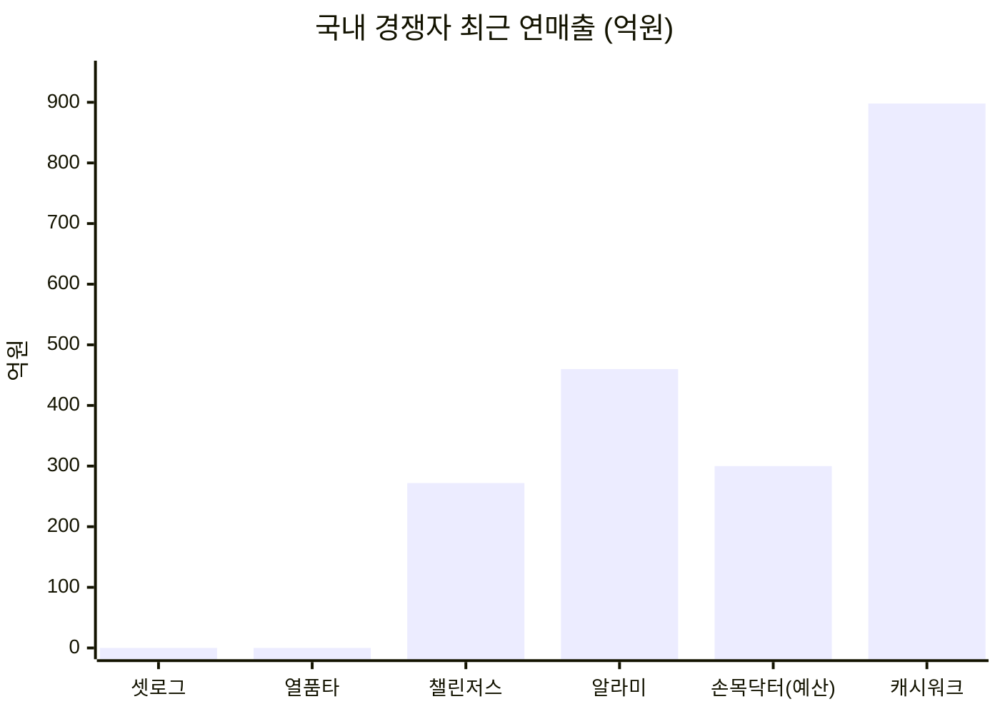

> ⚠️ **이 차트를 오해하지 말 것.** 셋로그·열품타의 0은 *매출이 없다*가 아니라 **공개된 매출 수치가 없다**는 뜻이다. 손목닥터9988은 매출이 아니라 **집행 예산**이므로 성격이 다르다 — 같은 축에 놓은 것은 *"이 시장에 흐르는 돈의 자릿수"*를 보기 위한 것이지 사업 성과 비교가 아니다.

### 4.2 무료 대체재 — 실질 1위 경쟁자

**14명 중 9명이 대체 솔루션으로 지목**한 것은 유료 앱이 아니라 이것들이다.

| 대체재 | 누가 쓰나 | 왜 못 놓나 | 왜 안 되나 |
|---|---|---|---|
| **카톡 단톡방 인증방** | 정하윤·김도현·윤채원 | *"다들 이미 쓰고 있다"* — 무마찰 | **강제력 0** → 2주 만에 사망 |
| **엑셀 + 계좌이체 + 카톡 독촉** | 한지우 (2년째) | 본인이 만들어서 편함 | **주 90분 수작업 + 판정 부담이 사람에게 귀속** `[모의]` |
| **인스타 부계정 / 비공개 계정** | 송재현·최민지 | 이미 하고 있음 | **편집 부담 → 힘든 주에 안 올림** |
| **아무것도 안 함** | 김도현·강수빈·조은비 | 가장 편함 | — |

### 4.3 경쟁 지형 — 세 요소를 동시에 가진 사업자가 없다

우리 제품은 **① 그룹 ② 짧은 영상 인증 ③ 금전 계약·정산** 세 요소의 결합이다.

| 서비스 | ① 그룹 | ② 영상 인증 | ③ 금전 계약 | **결합 점수** |
|---|:-:|:-:|:-:|:-:|
| **우리 (목표)** | ⭕ | ⭕ | ⭕ | **3.0** |
| 챌린저스 *(구 BM)* | △ 익명 다수 | ⭕ 사진 | ⭕ | **2.5** |
| 셋로그 | ⭕ | ⭕ | ✕ | 2.0 |
| BeReal | ⭕ | ⭕ | ✕ | 2.0 |
| stickK | △ 심판·응원자 | ✕ | ⭕ | 1.5 |
| 스트라바 | ⭕ 클럽 | △ 기록 | ✕ | 1.5 |
| 챌린저스 *(현 BM)* | ✕ | ⭕ 영수증 | △ 캐시백 | 1.5 |
| 열품타 | ⭕ | ✕ 타이머 | ✕ | 1.0 |
| 캐시워크 | ✕ | ✕ | △ 적립만 | 0.5 |
| 손목닥터9988 | ✕ | ✕ | △ 포인트 | 0.5 |
| 알라미 | ✕ | △ 미션 사진 | ✕ | 0.5 |

> **어느 칸도 3에 도달하지 않는다. 그리고 가장 가까웠던 챌린저스(2.5)는 그 자리를 스스로 떠났다.** 이것이 이 시장에 공백이 있다는 가장 강한 증거이자, **왜 아무도 그 자리에 없는지 물어야 하는 이유**이기도 하다.

**재원을 어디서 조달하는가로 갈린다 — 그리고 제로섬을 현행 운영하는 곳이 없다**

| 재원 유형 | 사업자 | 사용자가 잃을 위험 |
|---|---|---|
| **광고주** | 캐시워크 · BeReal · 셋로그(예정) · 열품타 | **없음** |
| **구독료** | 스트라바 · 알라미 | 없음 (지불은 있으나 몰수 없음) |
| **공공 예산** | 손목닥터9988 | **없음** |
| **브랜드사 성과 광고** | 챌린저스 (현) | 없음 |
| **자선단체 이전** | stickK | 있음 — 단 **타인에게 가지 않음** |
| **다른 참가자의 몰수금 (제로섬)** | ~~챌린저스 (구)~~ | **있음 — 현행 운영사 0곳** |

> **`E16`의 원형이 이 표다.** 제로섬을 현재 운영하는 사업자가 **하나도 없고**, 가장 오래 운영한 챌린저스는 **흑자를 낸 뒤 스스로 버렸으며**, 이론적 원형인 stickK는 **18년간 우회**했다. → **§0.6 D2(비제로섬 자기환급)의 결정적 근거.**

### 4.4 출처 전량 — 경쟁사 · 시장 통계 1차 출처

> **두 갈래로 나뉜다.** ① **경쟁사 재무·서비스 출처 52건**은 §4.1의 각 경쟁사 카드 하단에 인라인으로 붙어 있다(HTTP 검증 통과). ② **시장·인구·행동 통계 1차 출처 49건**이 아래다 — §0.1~§0.3의 모든 `[실측]` 수치가 여기서 나온다. **이 목록이 이 문서의 자립성을 담보한다.**

**인구 · 이용 실태** → §0.2 (1) TAM 사용자 base

1. 행정안전부, 「주민등록 인구통계」 (2026.7 총인구 5,108만) — https://jumin.mois.go.kr/ageStatMonth.do
2. KOSIS, 「인구상황판 — 연령대별 인구구조」 (2026.6) — https://kosis.kr/visual/populationKorea/PopulationDashBoardMain.do
3. DataReportal, "Digital 2026: South Korea" (SNS 이용자 4,890만) — https://datareportal.com/reports/digital-2026-south-korea
4. 정보통신정책연구원(KISDI), 「세대별 SNS 이용 현황」 (SNS 이용률 60.7%) — https://www.kisdi.re.kr/report/view.do?key=m2101113025790&masterId=4333447&arrMasterId=4333447&artId=1674096
5. 컨슈머인사이트, 「숏폼 한번 보면 평균 21분… 4명 중 3명 유튜브로 본다」 (2025.8 — 쇼츠 75%·릴스 43%·틱톡 20%) — https://www.consumerinsight.co.kr/
6. 와이즈앱·리테일, "셋로그 앱 MAU 778만 명" (2026.6 — 연령·성별 구성 포함) — https://www.wiseapp.co.kr/insight/detail/1011/setlog-sns-app-mau-in-korea
7. 뉴시스, "20대 홀린 '2초 일상 SNS' 셋로그…지난달 780만명 몰렸다" (2026.6.5) — https://www.newsis.com/view/NISX20260605_0003657349
8. 한국일보, "[트렌드 2026] 꾸미지 않아도 괜찮은 SNS '셋로그'의 유행" (2026.6.25) — https://v.daum.net/v/20260625110202630

**광고 시장 · ARPU 벤치마크** → §0.2 (1)(2) TAM·SAM 금액

9. DMC리포트, 「2025 & 2026 디지털 광고 시장 동향 보고서」 (국내 디지털 광고 11조 2,619억원) — https://www.dmcreport.co.kr/contentview?dr_code=DMCRPF2025366468
10. e-나라지표, 「매체별 광고비 현황(광고산업조사)」 (2024 총 취급액 19조 7,885억 / 온라인 8조 19억) — https://www.index.go.kr/unity/potal/main/EachDtlPageDetail.do?idx_cd=1649
11. KOBACO, 「2025 방송통신광고비 조사보고서」 — https://www.kobaco.co.kr/site/adstat/board/broadcastprice/1291
12. ITBizNews, "성장하는 전세계 SNS 광고시장, 한국서 인기있는 SNS 앱은?" (SNS 광고 = 디지털 광고의 27.7%) — https://www.itbiznews.com/news/articleView.html?idxno=19324
13. 오픈애즈, "25년 8월 SNS 앱 동향" (카카오톡 4,819만·인스타 2,741만·밴드 1,708만·틱톡 832만) — https://openads.co.kr/content/contentDetail?contsId=17503
14. 뉴스1, "'캐시워크' 넛지헬스케어, 작년 매출 1056억원…'사상 최대'" (2024.3.12) — https://www.news1.kr/industry/sb-founded/5347235
15. 이데일리, "캐시워크 성공 2막 여는 넛지헬스케어" (2020 매출 328억·MAU 600만) — https://edaily.co.kr/News/Read?mediaCodeNo=257&newsId=01157846629243752
16. Voodoo, "2025: a year of growth and transformation for Voodoo" (BeReal €30M) — https://voodoo.io/news/2025-a-year-of-growth-and-transformation-for-voodoo
17. Systemaic, "Locket Widget revenue, ad spend and growth channels" — https://www.systemaic.com/teardowns/locket-widget
18. Life360, "Life360 Reports Record Q4 2025 Results" (매출 $489.5M·MAU 9,580만·유료 Circle 280만·ARPPC $132) — https://investors.life360.com/news-releases/news-release-details/life360-reports-record-q4-2025-results
19. 매일일보, "비즈프로필 300만개 돌파…당근, 로컬 마케팅 강화" — https://www.m-i.kr/news/articleView.html?idxno=1378447

**이탈 원인 · 과잉정당화** → §0.1 P1·P2, §0.4 설계 원칙

20. Zhang et al., "Sharing, Not Showing Off: How BeReal Approaches Authentic Self-Presentation on Social Media Through Its Design", arXiv:2408.02883 — https://arxiv.org/html/2408.02883v1
21. Deci, Koestner & Ryan (1999), "The effects of extrinsic rewards on intrinsic motivation: A meta-analysis" — https://www.researchgate.net/publication/232453941
22. Deci, Koestner & Ryan (2001), "Extrinsic Rewards and Intrinsic Motivation in Education: Reconsidered Once Again", *Review of Educational Research*, 71(1) — https://journals.sagepub.com/doi/10.3102/00346543071001001
23. Mountain Scholar, "A Media Dependent Study on College-Aged Teens and their Cellphone Use" (BeReal 대학생 심층 인터뷰 — P1의 목소리 출처) — https://mountainscholar.org/bitstreams/54e390f6-918f-40f2-95e7-b6dac5a32069/download
24. "Social Media Use: Association with Digital Stress and Anxiety and Depression Symptoms in Youth" (267명 대학생 연구) — https://www.researchgate.net/publication/380231992
25. Trophy, "Duolingo Gamification Strategy: A Full Case Study (2026)" (스트릭 +60% · 이탈률 47%→28% · DAU 잔존 55%) — https://trophy.so/blog/duolingo-gamification-case-study
26. Orizon, "Duolingo's Gamification Secrets: How Streaks & XP Boost Engagement by 60%" — https://www.orizon.co/blog/duolingos-gamification-secrets
27. The Decision Lab, "Streak Creep: The perils of too much gamification" (*Journal of Consumer Research* 인용) — https://thedecisionlab.com/insights/consumer-insights/streak-creep-the-perils-of-too-much-gamification
28. Amra & Elma, "Top 20 BeReal Marketing Statistics 2026" (DAU −48% · 월 다운로드 −72.5% · 재참여율 19%) — https://www.amraandelma.com/bereal-marketing-statistics/

**보상형 비율 · 보상형 SNS/커뮤니티 레퍼런스** → §0.2 (2) SAM

29. 버즈빌, 「2025 리워드 광고 트렌드 리포트」 (리워드 광고 참여자 1,870만) — https://www.buzzvil.com/resources/4XB6VokVync7FhMWtkdzH
30. 대학내일20대연구소, 「세대별 앱테크 이용 행태 기획조사 2025」 (앱테크 이용률 51.1% / Z세대 62.4%) — https://www.20slab.org/Archives/39013
31. 나무위키, 「보상형 플랫폼」 (리워드 앱 인지 76.9% / 최근 1년 이용 37.7%) `[2차 출처]` — https://namu.wiki/w/보상형%20플랫폼
32. Yahoo Finance / eMarketer, "X Ad Revenue Surges for First Time Since Elon Musk Purchase" (X 글로벌 광고매출 $2.26B, 2025) — https://finance.yahoo.com/news/x-ad-revenue-surges-first-193411912.html
33. Influencer Marketing Hub, "X (Twitter) Ads Revenue Sharing: Eligibility & Payout Math" (크리에이터 배분 월 $5M) — https://influencermarketinghub.com/x-twitter-ads-revenue-sharing/
34. Fourthwall, "Is TikTok's Creator Rewards Program Worth the Payout?" (1,000뷰당 $0.40~$1.00, 구 Creator Fund $1B) — https://fourthwall.com/blog/is-tiktoks-creator-rewards-program-worth-the-payout
35. Wikipedia, "Steemit" (보상형 커뮤니티 원형, 등록 사용자 약 124만) — https://en.wikipedia.org/wiki/Steemit
36. 테크42, "버즈빌, '리워드 광고 시장 연평균 17% 성장'" — https://www.tech42.co.kr/

**세그먼트 규모 근거** → §0.3 F1·F2·F3·A1 산식

37. 문화체육관광부, "'25년 국민 생활체육 참여율 62.9%, 전년 대비 2.2%p 상승" (만 10세 이상 9,000명 대상, **참여 동반자 항목 포함 — 세부 비율 비공개**) — https://www.mcst.go.kr/site/s_notice/press/pressView.jsp?pSeq=22201
38. e-나라지표, 「국민생활체육 참여현황」 — https://www.index.go.kr/unity/potal/main/EachDtlPageDetail.do?idx_cd=1658
39. 문화체육관광부, 「2025년 국민 독서실태조사」 (성인 독서율 38.5%, 성인 독서활동 중 독서모임 참여 1위) — https://zdnet.co.kr/view/?no=20260306130551
40. 나무위키, 「열정 품은 타이머」 (누적 1,200만 · MAU 210만 · DAU 66만) `[2차 출처]` — https://namu.wiki/w/열정%20품은%20타이머
41. 소모임 (누적 500만) — https://www.somoim.co.kr/ / 문토 (누적 100만) — https://apps.apple.com/kr/app/id1535886772 / 트레바리 (15만) — https://m.trevari.co.kr/
42. 테크42, "화이트큐브, 습관 형성 플랫폼 챌린저스로 2023년 첫 연간 흑자 달성" (2024.3 기준 누적 사용자 171만 · 누적 거래액 5,000억) — https://www.tech42.co.kr/
43. 플래텀, "뷰티 앱으로 피봇한 '챌린저스', 2024년 연 매출 150억 원" — https://platum.kr/archives/249818
44. KB경영연구소, 「KB자영업 분석 보고서 — 피트니스 센터 현황」 (전국 9,900개) — https://www.kbfg.com/kbresearch/report/reportView.do?reportId=2000125
45. 서울시 미디어허브, "걷기만 해도 10만 포인트! 손목닥터9988" (참여자 200만 돌파) — https://mediahub.seoul.go.kr/archives/2010449
46. 국민건강보험공단, 「2024 노인장기요양보험 통계연보」 (종사인력 70.5만 · 기관 29,058곳 — B2 모수) — https://policy.kiom.re.kr/sub040101/view/page/1/id/MjMxMg==
47. 헤럴드경제, "'배달 라이더 도대체 몇 명일까?'…플랫폼 종사자 통계 발표 못해" (88.3만, **국가통계 미승인** — B1 모수) — https://biz.heraldcorp.com/article/10497462

**규제** → §8.3 법률 리스크

48. 「위치정보의 보호 및 이용 등에 관한 법률」 (시행 2025.10.01) — https://www.law.go.kr/
49. 「전자금융거래법」 — 선불전자지급수단 등록 요건 — https://www.law.go.kr/

> ⚠️ **31·40번은 2차 출처(나무위키)다.** 각각 *"리워드 앱 최근 1년 이용 37.7%"*와 *"열품타 MAU 210만"*의 유일한 근거이며, 후자는 **F2 69만 추정 전체의 뿌리**다. 1차 공시로 대체되기 전까지 두 수치는 `[러프]`를 벗지 못한다(부록 A).

---

## 5. 우리 솔루션의 핵심 제안 (Value Proposition)

### 5.1 한 문장

> # **혼자서는 3일을 못 넘기던 사람에게, 친구가 지켜보는 3개월을 만들어 준다.**
>
> **조건은 당신이 정하고, 집행은 우리가 하고, 끝나면 통과한 과정이 남는다.**

**이 문장이 어디서 나왔는가** — *"혼자서는 3일"*은 김도현의 진술(*"혼자서는 3일을 넘긴 적 없는 걸 친구 리듬에 얹어서"*), *"3개월"*은 정하윤의 목표(*"잔소리꾼이 되지 않으면서 3개월을 완주"*)와 최민지의 12주 D-day에서 직접 도출했다. 뒷 문장의 세 절이 §5.3의 세 선언과 1:1 대응한다.

### 5.2 왜 이 문장인가 — 아무도 말하지 않은 자리

| 강제력의 주체 | 누가 | 그들의 한계 |
|---|---|---|
| **플랫폼** | BeReal · (초기) 챌린저스 | 통제 상실감 → DAU −48% |
| **개인 자신** | 알라미 · stickK | 지켜보는 사람이 없다 |
| **없음** (축적·보상이 대신) | 캐시워크 · 손목닥터9988 · 스트라바 · 셋로그 | 실패에 아무 일도 안 일어난다 |
| **익명 타인** | 열품타 | 그 *남들*이 **모르는 사람**이다 |
| **🎯 관계** | **— 9곳 중 0곳** | — |

> **강제력의 주체를 "관계"에 놓은 사업자가 하나도 없다**(`E07`). 3요소(**그룹 · 영상 인증 · 금전 계약**)를 동시에 가진 곳도 없다 — 최고점 챌린저스 2.5인데 **그 회사는 흑자를 낸 뒤 그 자리를 스스로 떠났다.**

### 5.3 세 개의 가치목표 — 여정 구간 분담

**세 선언은 우열이 아니라 담당 구간이 다르다.** Pain 42건을 7단계에 배치하면 **겹치지 않고 40건을 나눠 맡는다**(나머지 2건은 서지훈 몫 — Goal이 제품과 반대) — 이것이 `E17`이다.

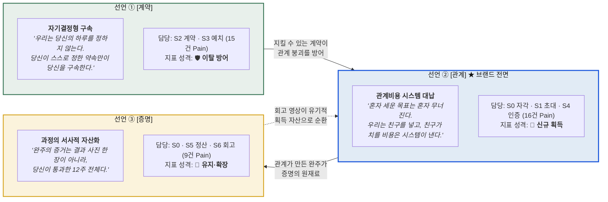

| 선언 | 전문 | 담당 관문 | Pain | **빼면 무슨 일이** |
|---|---|---|:-:|---|
| **① 계약** | *"우리는 당신의 하루를 정하지 않는다. 당신이 스스로 정한 약속만이 당신을 구속한다."* | S2 · S3 | 15 | **최대 이탈 관문(S3)이 그대로 남고**, 지킬 수 없는 계약의 실패 비용을 ②의 관계가 대신 낸다 → **①이 없으면 ②가 스스로 무너진다** |
| **② 관계** ★ | *"혼자 세운 목표는 혼자 무너진다. 우리는 그 사이에 친구를 넣는다. 그리고 친구가 치를 비용은 우리가 대신 낸다."* | S0 · S1 · S4 | 16 | 그룹 제품인데 **그룹이 도착하지 않고**(S1) 인증에 **압력이 없다**(S4) → **제품 정체성 소멸** |
| **③ 증명** | *"완주의 증거는 결과 사진 한 장이 아니라 당신이 통과한 12주 전체다. 우리는 당신이 해냈다는 사실을 남에게 보여줄 수 있는 형태로 남긴다."* | S0 · S5 · S6 | 9 | 정산의 윤리 비용이 방치되고 재계약 동력이 없어 **1회성 제품**이 된다 |

**각 선언이 무너지는 조건 — 검증 계획의 뼈대**

| 선언 | 무너지는 조건 | 확인 방법 |
|---|---|---|
| **①** | 계약 전 진단을 넣어도 **완주율이 안 오르면** | 진단 통과군 vs 미통과군 완주율 격차(O12) |
| **②** | **아는 사람이 봐도 압박이 안 되면** — 선언 전체의 전제가 부정 | **지인 그룹 vs 익명 그룹 완주율 비교 — 가장 먼저 확인할 것** |
| **②** | 관계비용 대납이 역할을 **없애는 게 아니라 옮기기만 하면** | 방장 교체율·그룹 해체율 추적 |
| **②** | **그룹 단위 이탈이 개인 이탈보다 크면** | 이탈 단위(개인/그룹) 분해 측정 |
| **③** | **`E15`** 자동 편집 회고본을 **셋로그가 이미 제공**한다면 | 셋로그 회고 기능과 **"계약 대비 달성의 서사"** 직접 비교 |
| **③** | 회고본을 받아도 **재계약률이 안 오르면** | 수령군 vs 미수령군 다음 시즌 재계약률(O8) |
| **③** | 조직 담당자가 **우리 숫자로 품의를 못 통과시키면** | 여민석 유형 인터뷰 — *"어떤 숫자가 있어야 통과하는가"* |

> **⚠️ 선언 ③의 구조적 약점** — 이 선언은 **후행 지표에 브랜드를 건다.** 아직 안 써본 사람에게 *"나중에 회고본이 남습니다"*는 구매 이유가 되지 않는다. 그래서 획득이 아니라 **유지·확장** 지표로 분류했고, **§0.6 D4가 브랜드 전면을 선언 ②로 고정**한 이유다.
>
> **⚠️ 조은비 층은 선언 ②로 풀리지 않는다.** *"우리끼리 돈을?"*이라는 거부는 관계비용 대납으로 해소되지 않는다 — **그것은 정산 재원 구조(§0.6 D2)의 문제다.**

---

## 6. 우리가 제공하는 차별적 가치

### 6.1 4대 차별가치

```mermaid
flowchart TD
    subgraph D1 ["차별가치 1: Self-Determined Commitment"]
        D1_T["자기결정형 구속"] --> D1_D["• 계약 전 라이프스타일 진단<br/>• 시간 고정 탈피: 주 N회 총량제<br/>• 프라이버시 보호 대체 인증"]
    end
    subgraph D2 ["차별가치 2: Relationship-Cost Subsidization"]
        D2_T["관계비용 시스템 대납"] --> D2_D["• 독촉·스트릭 자동 추적<br/>• 시스템 판정으로 분쟁 방지<br/>• 시즌별 방장 자동 롤테이션"]
    end
    subgraph D3 ["차별가치 3: Non-Zero-Sum Accountability ★"]
        D3_T["비제로섬 자기환급"] --> D3_D["• 100% 달성 시 전액 환급<br/>• 미달성분은 그룹 지갑·기부 전환<br/>• 첫 시즌 0원 체험"]
    end
    subgraph D4 ["차별가치 4: Narrative Assetization"]
        D4_T["과정의 서사적 자산화"] --> D4_D["• 편집 없는 자동 합성 회고본<br/>• 못 한 날까지 포함한 12주 서사<br/>• 조직 제출용 정량 리포트"]
    end

    style D1 fill:#E8F0EB,stroke:#2F6F4E,stroke-width:1.5px,color:#111
    style D2 fill:#E1EBF5,stroke:#1A56DB,stroke-width:1.5px,color:#111
    style D3 fill:#FDE8E8,stroke:#C81E1E,stroke-width:2.5px,color:#111
    style D4 fill:#F3E8FF,stroke:#6B21A8,stroke-width:1.5px,color:#111
```

1. **Self-Determined Commitment (자기결정형 계약)** — 플랫폼의 획일적 시간 강제(BeReal)나 정형화된 챌린지(챌린저스)를 거부. 진단 설문으로 *주 N회*·*단원별 진도*·*대체 인증* 등 **내가 지킬 수 있는 규칙을 스스로 설계**한다. 근거: **G4 통제권 16건(38%)**·`31`·`35`.
2. **Relationship-Cost Subsidization (관계비용 대납)** — 지인 그룹의 치명적 약점인 *독촉 피로*와 *판정 부담*을 시스템이 대신 진다. 관계는 **응원과 격려의 자리로만 남는다.** 근거: **관계비용 7건**(`E10`)·경쟁 공백 0곳(`E07`).
3. **Non-Zero-Sum Accountability (비제로섬 책임)** ★ — *"친구의 실패가 나의 상금"*이라는 윤리적 거부감(`02`·`40`)과 사행성 리스크를 **구조적으로 제거**. **§0.6 D2의 확정 사항**이며 `E16`(제로섬 현행 운영사 0곳)이 근거다.
4. **Narrative Assetization (서사적 자산화)** — 매일의 짧은 클립이 **못 한 날까지 포함한** 12주 회고본으로 합성된다. 개인엔 성취의 기록, 조직엔 보고 가능한 숫자. **수익 3층 전부에 붙는 유일한 가치**다.

| 층 | 선언 ③이 만드는 것 |
|---|---|
| 개인 무료 (송재현) | 인스타에 발행되는 회고본 = **유기적 획득 자산**(CAC↓) |
| 개인 그룹 (최민지) | 재계약 동력 — *"다음 시즌을 또 할 이유"* |
| 조직 (여민석) | **보고 가능한 숫자** = 계약 갱신의 근거 |

### 6.2 JTBD 3층으로 정리

| 층위 | **우리가 주는 가치** | **어느 경쟁자가 못 주나** |
|---|---|---|
| **⚙️ 기능적** | **내 조건으로 계약한다** — 시각·횟수·분량·기간을 직접 설계하고 잠근다 | 챌린저스(목록 중 선택) · BeReal(플랫폼 지정) · 알라미(조건 고정) |
| | **편집 없이 인증이 끝난다** | 인스타(편집 필수) · 스트라바(영상 아님) |
| | **집계가 사라진다** — 추적·판정·정산이 전부 자동 | 엑셀+계좌이체 · 밴드 출석체크 |
| | **보고 가능한 숫자가 나온다** | 손목닥터9988(참여자 수만) · 사내 게시판 |
| **💗 감정적** | **잔소리꾼이 되지 않는다** | 카톡 단톡방(독촉이 사람에게 귀속) |
| | **잃을 걱정 없이 먼저 겪는다** — 0원 체험 시즌 | 챌린저스(첫 회부터 예치) · stickK(판돈 필수) |
| | **미달이 가려지지 않는다** | 열품타(시간만) · 대부분의 습관 앱(이진 판정) |
| | **과정이 남는다** — 못 한 날까지 포함한 12주 | 스트라바(약속 집행 없음) · 셋로그(목표 없음) |
| **🤝 사회적** | **지켜보는 사람이 아는 사람이다** | 열품타(익명 랭킹) · 챌린저스(익명 다수) · 알라미·stickK(혼자) |
| | **관계 비용을 시스템이 대납한다** | **9곳 중 0곳** |
| | **크루를 통째로 옮긴다** | 밴드(부분 이주 후 실패한 전례) |
| | **친구 돈을 뺏지 않는다** ★ | 챌린저스 구BM(제로섬 고정) |

### 6.3 차별을 만드는 것은 앞 문장이 아니라 뒷 문장 (`E10`)

> *"친구와 함께"*는 누구나 말한다. **차별은 관계가 낼 비용의 목록과 대납 방식을 갖고 있는가**에서 갈린다.

| 관계가 치를 비용 | # | **시스템이 대신 내는 방식** | 대응 기능 |
|---|:-:|---|:-:|
| 방장이 잔소리꾼이 된다 | `01` | **독촉의 자동 집행** — 추적·알림이 사람에게 귀속되지 않는다 | F05 |
| 방장 역할이 고정돼 번아웃 | `03` | **역할 로테이션** 장치 | F18 |
| 총무가 판정자가 된다 | `17` | **판정의 시스템 이전** (+ stickK식 제3자 심판 옵션) | F17 |
| 상금 출처가 친구의 손실 | `02` | **비제로섬 자기환급 기본값** ★ | F06 |
| 친목에 돈이 들어오면 관계가 거래가 됨 | `19` | **간헐적 목표 순간에만** 제안, 일상 공유엔 보상 미부착 | — |
| 공동 재원이 사라짐 | `18` | 분배 대상에 **그룹 지갑** 옵션 | F06 |
| 소개자 거절이 관계를 상하게 함 | `41` | **거절 흔적이 남지 않는** 초대 설계 | F03 |

> **이 표가 곧 로드맵이다.** 7건 중 `03`은 S6, `02`는 S5 — **선언 ③의 구간**에 있다. 즉 **관계비용의 정산은 ③이 대신 치른다**는 뜻이며, 이것이 세 선언의 보완 관계의 구체적 형태다.

---

## 7. Proof — 도출 근거와 차별성 근거

### 7.1 근거 추적표 (Evidence Traceability Matrix) — E01~E22

> **모든 결론에 근거 ID가 붙어 있고, 각 근거에는 "이것이 틀리면 무엇이 무너지는가"가 달려 있다.** 어느 근거가 인터뷰나 실측으로 뒤집혔을 때 **문서의 어느 부분을 다시 써야 하는지**를 즉시 찾기 위한 표다.
>
> **v2.0에서 바뀐 것** — v1.0은 출처를 `06-1 §3` 같은 **파일 위치**로 적었다. v2.0은 그 자리에 **근거의 실제 내용과 1차 외부 출처**를 넣었다. 모든 항목을 이 문서 안에서 확인할 수 있다.

| ID | 근거 | **실제 데이터 / 1차 출처** | 등급 | 지지하는 결론 | **틀리면 무너지는 것** |
|:-:|---|---|:-:|---|---|
| `E01` | G4 통제권 Goal **16건(38%)** — 4분류 중 최다 | `03`·`06`·`09`·`10`·`16`·`20`·`22`·`25`·`28`·`30`·`31`·`35`·`37`·`38`·`39`·`42` (G1 해내기 10 · G3 인정 9 · G2 관계 7) → §1.4 | `추정`<br/>작성자 분류 | 선언 ① 성립 | 선언 ①의 1순위 근거 소멸 → `E03`만 남아 극단 사용자 논거로 축소 |
| `E02` | S2 계약 **10건(최다)** · S3 예치 **이탈 4건(최다)** | 단계별 건수 4·7·10·5·8·6·2 = 42 / S3 이탈자 김도현·윤채원·홍다인·조은비 → §1.1 | `추정` | 선언 ①의 담당 관문 · **§5.3 분배 구조** | **§5.3 여정 분담 전체 재배치** — 문서의 뼈대 |
| `E03` | AOS 4.0 10건 중 **4건이 극단 사용자 2명** | `31`·`33`(강수빈) · `34`·`36`(배유진) 전부 I5·S1 → §3.1 | `추정`<br/>I·S 작성자 판단 | 선언 ①의 절실도 | 선언 ①이 *"아픈 사람이 적은"* 선언이 됨 |
| `E04` | 교대근무 임금근로자 ≈ **229만 명** | 임금근로자 **2,241.3만** `[실측]` × 교대근무율 **10.2%** `[실측]` | `추정` | 선언 ①의 모수 | 선언 ①이 다시 `계산 보류`로 회귀 |
| `E05` | 헬스 참여 10~39세 ≈ **160만 명** | 생활체육 참여율 **62.9%** × 보디빌딩 **17.5%** `[실측: 문체부 2025]` | `추정` | 배유진(O13) 모수 | 촬영 제약 논거의 규모 근거 소멸 |
| `E06` | SOM 232만 중 ≈ **24만 명**이 구조적 실패 | `E04` 비율 × SOM 232만 | `러프` | **선언 ①의 가치 = 획득이 아니라 이탈 방어** | §8 F01 우선순위 근거 약화 |
| `E07` | 경쟁 9곳 중 **강제력 주체를 관계에 놓은 곳 0** | 플랫폼(BeReal·챌린저스 구) / 개인(알라미·stickK) / 없음(캐시워크·손목닥터·스트라바·셋로그) / 익명(열품타) → §5.2 | `실측`<br/>(9종 범위) | 선언 ②의 유일성 · §5.2 | **§5.2 차별화 주장 전체가 무너짐** |
| `E08` | DOS(SOM) 상위 4건 **전부 관계 기반** | `11` 2.21(A1 128만) · `01` 1.86 · `04` 1.86(F1 108만) · `03` 1.40 → §3.1 | `추정` | 선언 ②의 시장 규모 우위 · **§0.6 D1** | D1(SEG-F1 우선)의 근거 약화 |
| `E09` | Q1 4건이 **SAM·SOM 두 모수에서 동일** | 모수 변경 시 순위 변동이 ±2 이내인 항목 17/21건 — 바뀌는 것은 사실상 C2(윤채원) 3건뿐 → §3.1 | `추정` | 모수 논쟁과 무관하게 최우선 | 모수 선택이 우선순위를 바꿈 |
| `E10` | 관계 비용 🤝 **7건** | `01`·`02`·`17`·`18`·`19`·`40`·`41` → §6.3 대납표 | `추정` | **선언 ②의 뒷 문장(대납)이 차별점** | 선언 ②가 흔한 문장으로 축소 |
| `E11` | `SEG-F` 계열은 **그룹이 이미 형성**돼 챌린저스의 획득 약점이 없음 | 셋로그 MAU 778만 네트워크(CAC≈0) · Q3→Q1 전환 가능분 143만 → §0.3 | `추정` | 선언 ②의 CAC 우위 · **§0.6 D1** | SOM 33억 재추정 |
| `E12` | **과정 기록 요구가 3인에게서 동시 발생** | `14` 최민지 3.0 · `26` 송재현 3.0 · `29` 여민석 **4.0** → §3.1 | `추정` | 선언 ③ 성립 | 선언 ③이 1인 요구로 축소 |
| `E13` | 손목닥터9988 연 **300억** + *"효과성 검증 없이"* 지적 | 예산 2021 15억 → 2024 232억 → 2025 300억+ · 참여자 200만 · **포인트 상한 17만→10만P 하향** `[실측]` → §4.1-E | `실측` | 선언 ③ = **조직 재원 입장권** | O9의 사업 근거 소멸 |
| `E14` | 여민석 `29` 보고용 숫자 없음 — **AOS 4.0** | I5·S1 → §3.1 | `추정` | 선언 ③의 절실도 | — |
| `E15` | 자동 편집 회고본은 **셋로그가 이미 제공** | 1~3시간 주기 2~4초 영상 → **하루치 자동 분할화면 브이로그 합성** → §4.1-B | `미검증` | **선언 ③의 최대 위험** | (반대) 확인 시 선언 ③ 강화 |
| `E16` | **제로섬 현행 운영사 0곳** · 챌린저스 흑자 후 폐기 · stickK 18년 우회 | 재원 유형표 6종 중 제로섬 = 현행 0 → §4.3 | `실측` | **§0.6 D2 비제로섬 기본값** | **D2 재검토 → §6 차별가치 3 붕괴** |
| `E17` | 세 선언이 **7단계 40건 Pain을 겹침 없이 분담** | ① S2·S3 = 15건 / ② S0·S1·S4 = 16건 / ③ S0·S5·S6 = 9건 (잔여 2건 = 서지훈 `37`·`38`) → §5.3 | `추정` | **세 선언이 모두 유효** | 병립 구조가 무너져 우열 판단으로 회귀 |
| **`E18`** | **MVP 11종 = `SEG-F1`의 핵심 루프를 닫는 최소 집합** | 계약→예치→인증→정산→회고 · Y1 타깃 F1 108만 → §0.6 D1 | `판단` | §8 MVP 구성 | MVP 범위 재산정 |
| **`E19`** | **대체 인증 수단을 MVP로 승격** | `34`·`36`이 **AOS 4.0 최상위 10건**이고 촬영 제약은 *"개인 성향이 아니라 환경 제약"*(헬스장 촬영 금지 + 타인 초상권) → §1.0 | `추정` | F16의 MVP 편입 | F16이 Mid로 환원 |
| **`E20`** | **정산 권고 기본값 = 비제로섬** | `E16`이 방향을 가리키고, **유보 상태로는 MVP 착수 불가** | `판단` | §6 차별가치 3 · F06 기본값 | **법률 검토 결과에 따라 전면 재설계** → §8.3 |
| **`E21`** | **개발 난이도는 아키텍처 검토 없이 매긴 값** | F08(전금법)·F14(매칭)·F16(어뷰징)·F19(사람 개입)은 오차가 크다 | `미검증` | §8 난이도 열 | 로드맵 Phase 기간 재산정 |
| **`E22`** | **Phase 검증 목표에 baseline이 없다** | 비교 대상 수치가 원자료에 없어 목표 퍼센트를 제시하지 않음 | `미검증` | §8.2 로드맵의 지표 표기 | (해당 없음 — 이미 보수적으로 처리) |

> **⚠️ 근거들이 서로 독립이 아니다.** `추정` 다수가 **I·S 값 72개**라는 같은 뿌리에서 나온다 — `E03`·`E08`·`E09`·`E12`·`E14`는 실제 인터뷰 한 번에 **동시에** 흔들린다.
> **반대로 `E02`·`E17`은 단계별 분류에만 의존**하므로 I·S 값과 독립이다. 점수가 다 틀려도 *"어느 관문에서 막히는가"*는 남는다 — **이 문서에서 가장 견고한 부분.**
> **`E18`·`E20`은 `판단` 등급이다** — 근거가 아니라 §0.6의 경영 의사결정이며 다른 판단으로 대체 가능하다.

### 7.2 대안 대비 차별성 — 3요소 동시 보유 사분면

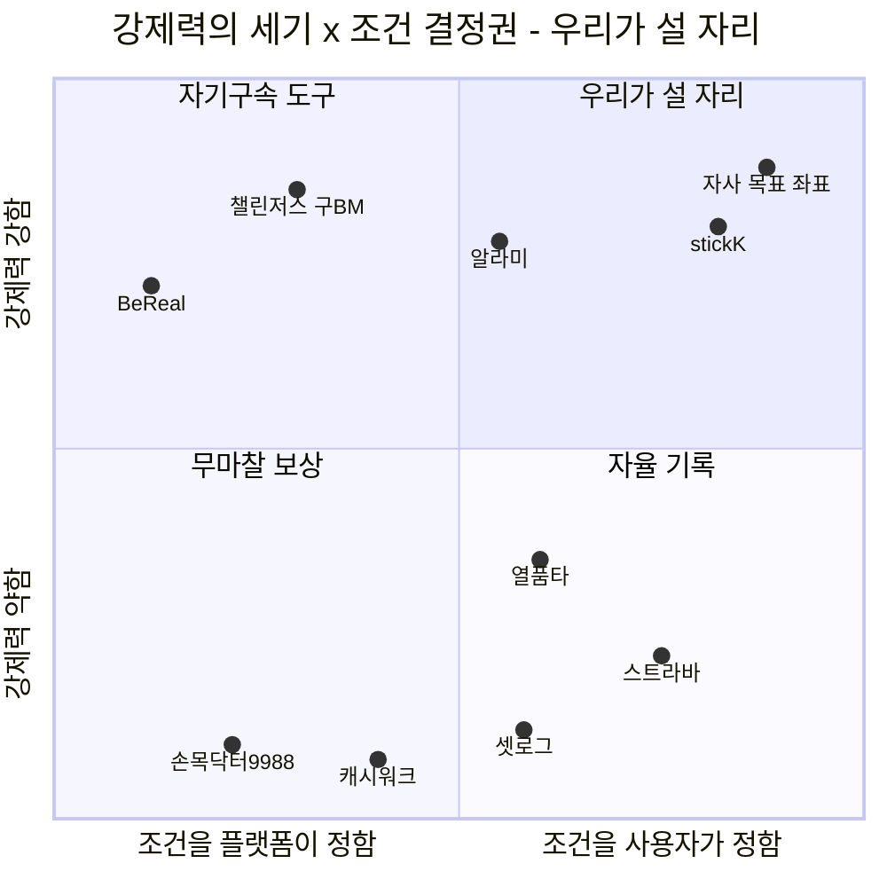

> ⚠️ 좌표는 §4.1의 서술 근거에서 배치한 **정성 판단**이며 측정치가 아니다. *"자사 목표 좌표"*는 달성 목표이지 현재 위치가 아니다. (결합 점수 원표는 §4.3)

### 7.3 다차원 가치 비교 매트릭스 (7축)

| 평가 축 | 챌린저스 (피벗 후) | 셋로그 | 열품타 | stickK | **자사 (Proposed)** |
|---|:---:|:---:|:---:|:---:|:---:|
| **규칙 결정권** | 획일적 선택 (하) | 주기 선택 (중) | 자율 설정 (중) | 완전 자율 (상) | **완전 자율 + 사전 진단 (최상)** |
| **강제력 원천** | 개인 금전 손실 | 없음 (친목) | 익명 랭킹 | 제3자 심판 + 손실 | **지인 상호 감시 + 금전 예치 (최상)** |
| **운영자 피로도** | 없음 (플랫폼) | 없음 | 방장 부담 | 심판 부담 | **시스템 대납 (최상)** |
| **인증 마찰** | 사진 업로드 (보통) | **무편집 (최상)** | 타이머 (상) | 텍스트·수기 (하) | **짧은 영상 무편집 (최상)** |
| **환급 윤리성** | 제로섬 → 쇼핑 전환 | N/A (무과금) | N/A (무과금) | 비제로섬 기부 (상) | **비제로섬 자기환급 (최상)** ★ |
| **완주 증명 자산** | 결과 스탬프 (하) | 일상 브이로그 (중) | 공부 시간 총량 (하) | 계약 완료 인증 (하) | **12주 서사 + 리포트 (최상)** |
| **타깃 세그먼트** | 2040 쇼핑층 | 1020 여성 친목 | 1020 수험생 | B2B 임직원 | **2030 목표 크루 (`SEG-F1`)** |

### 7.4 핵심 Job별 대안 충족도

| 핵심 Job | 우리 | 챌린저스 | 셋로그 | 열품타 | 캐시워크 | 알라미 | 스트라바 | stickK | 카톡·엑셀 |
|---|:-:|:-:|:-:|:-:|:-:|:-:|:-:|:-:|:-:|
| 내 조건으로 계약한다 | ● | ○ | — | — | — | ○ | — | ● | ○ |
| 아는 사람이 지켜본다 | ● | ✕ | ○ | ✕ | — | ✕ | ○ | ✕ | ● |
| 안 하면 실제로 손해다 | ● | ● | ✕ | ✕ | ✕ | ○ | ✕ | ● | ○ |
| 독촉이 사람에게 안 붙는다 | ● | ● | — | ● | ● | ● | ● | ● | **✕** |
| 진도로 평가받는다 | ● | ✕ | ✕ | ✕ | ✕ | ✕ | ○ | ○ | ✕ |
| 편집 없이 기록이 쌓인다 | ● | ✕ | ● | ✕ | ✕ | ✕ | ○ | ✕ | ✕ |
| 과정이 한 편으로 남는다 | ● | ✕ | ○ | ✕ | ✕ | ✕ | ○ | ✕ | ✕ |
| 친구 돈을 뺏지 않는다 | ● | ✕ | — | — | — | — | — | ● | ○ |
| 보고용 숫자가 나온다 | ● | ✕ | ✕ | ✕ | ✕ | ✕ | ✕ | ○ | ✕ |

`●` 충족 · `○` 부분 충족 · `✕` 미충족 · `—` 해당 없음

### 7.5 🔴 반증 신호 — 차별성 주장을 스스로 흔드는 것

**Proof는 유리한 증거만 모으는 자리가 아니다.**

| 신호 | 내용 | 영향 |
|---|---|---|
| **AOS 순위와 대화 신호가 정면 충돌** | 정하윤 이탈 1순위가 `02`(**AOS 0.8, Q4 후순위**), 한지우 도입 조건이 `17`(0.8)·`18`(0.6) | **채점 도구가 도입 게이트를 못 잡는다** — §3.1 해설 ③이 구조적 이유를 설명 |
| **자동화가 역할을 없애는 게 아닐 수 있다** | *"앱이 알려줘도 한 번 더 물어볼 것 같다"* `[모의]` | §6.3 대납 논리의 핵심 가정이 흔들림 |
| **현재 설계가 `SEG-F2`에 역효과** | 이진 판정이 무해한 게 아니라 **유해** `[모의]` — *"열품타는 시간만 보여주는데 이건 완료라고 말을 해준다"* | **F10 없이 출시하면 박서연 계열은 오히려 악화** |
| **비제로섬은 유인이 약하다** | 챌린저스는 **제로섬으로** 5,000억 거래액을 만들었다 | **§0.6 D2의 최대 반대 증거.** 인터뷰로 확인 필요 |
| **보상 수용 ≠ 예치 수용** | 홍다인 유형이 SAM 800만의 **분자에서 빠져야 할 수 있음** `[모의]` | **SAM 추정 전체의 전제** |
| **셋로그가 수익화 방향을 목표·챌린지로 잡으면** | 우리의 획득 채널(778만)이 그날로 **정면 경쟁자**가 된다 | `E11`(CAC 우위)과 §0.3 Q3→Q1 전환 설계가 동시에 무효 |

---

## 8. `Job`-`Feature` Map (MVP 포함 여부 및 기능 우선순위 정리 포함)

> **채점 기준**
> **중요도** = 해당 Job의 AOS·DOS + 여정 이탈 영향(⛔ 이탈/🚫 배제 시 가산)
> **개발 난이도** = 기술 복잡도 + 규제·정산 리스크 (`E21` — 아키텍처 검토 전 값)
> **MVP 기준** = **§0.6 D1**에 따라 `SEG-F1` 친구 목표 크루(108만)의 핵심 루프를 닫는 데 필수인가 (`E18`)

| 기능명 | 핵심 Job 연관성 | 중요도(1~5) | 개발 난이도(1~5) | MVP (✔/✖) | 우선순위 |
| --- | --- | :-: | :-: | :-: | :-: |
| **F01** 계약 전 라이프스타일 진단 설문 | O12·O13 지킬 수 있는 조건 선택 (`31` AOS 4.0 · `35` 3.2) | **5** | **1** | **✔** | **High** |
| **F02** 그룹 목표 계약·잠금 (변경 불가) | A·C의 Pull 그 자체 — 자기구속 장치 | **5** | 2 | **✔** | **High** |
| **F03** 그룹 일괄 초대·이주 (거절 흔적 없음) | O6 크루 전원 이주 (`16` AOS 4.0 · `41`) · 그룹째 유입이 제품 전제 | **5** | 3 | **✔** | **High** |
| **F04** 실시간 짧은 영상 인증 (무편집) | O11 편집 없이 누적 (`26`) · 인증의 기본 수단 | **5** | 3 | **✔** | **High** |
| **F05** 자동 독촉·추적 (방장 대납) | **O2 방장 독촉 0회** (`01` AOS 4.0 / DOS 1.86) | **5** | 2 | **✔** | **High** |
| **F06** 정산 방식 (**기본값 비제로섬 자기환급** / 그룹 지갑 · 제로섬 선택) | `02`·`18`·`40` — 9/9가 정산 화면에서 같은 질문 · **§0.6 D2** (`E20`) | **5** | 4 | **✔** | **High** |
| **F07** 0원 체험 시즌 (무예치) | **O3·O10 손실 없이 먼저 겪기** (`04`·`22` — 최대 이탈 관문 S3) | **5** | 2 | **✔** | **High** |
| **F08** 그룹 팟 예치·정산 엔진 | 수익 R2(참가비 take) · 강제력의 물리적 근거 | **5** | **5** | **✔** | **High** |
| **F09** 축적 보드 (스트릭·달성률 추세) | B·D·G의 Pull 공통 — 3인이 최장 체류한 화면 | **4** | 2 | **✔** | **High** |
| **F10** 목표 대비 진도 표시 (이진 판정 대체) | **O5** (`07`·`09`) — 🔴 없으면 `SEG-F2`에 **역효과** | **5** | 3 | ✖ | **High** |
| **F11** 자동 편집 회고본 (**미달일 포함**) | **O8** (`14`·`26`) · 재계약 동력 + 획득 자산 | 4 | 3 | **✔** | **High** |
| **F12** 분량·범위 목표 계약 (진도형) | O5의 전제 (`09`) — F10과 짝 | 4 | 3 | ✖ | **High** |
| **F13** 주간 총량 계약 (횟수형) | O12 (`31`) — 고정 시각 불가자 구제 · 규제 완화 | 4 | 2 | ✖ | **High** |
| **F14** 매칭 조건 지정 (상호작용 밀도) | **O1** (`11` AOS 4.0 / **DOS 2.21 최고**) — §0.6 D1에 따라 Y2 | **5** | 4 | ✖ | **High** |
| **F15** 손실 상한·연속 실패 시 강제 휴식 | `33` (AOS 4.0) — ⚖️ **사행성 심사 직결.** 비제로섬에서도 필요 | **5** | 2 | ✖ | **High** |
| **F16** 대체 인증 수단 (블러·기구화면·웨어러블) | **O13** (`34`·`36` AOS 4.0) — 촬영 불가는 **환경 제약** (`E19`) | **5** | 4 | **✔** | **High** |
| **F17** 예외 처리 (사유 신청·승인) | `17` — 한지우의 **도입 전제 조건**(AOS는 0.8) | 3 | 2 | ✖ | Mid |
| **F18** 역할 로테이션 | **O4** (`03` DOS 1.40) — 그룹 소멸 방지 | 4 | 2 | ✖ | Mid |
| **F19** 붕괴 구간 개입 (**사람 개입형**) | **O7** (`13` AOS 4.0) — 🔴 알림형은 반증됨 | 4 | 4 | ✖ | Mid |
| **F20** 조직 관리자 대시보드 (부서별 달성률·지속률) | **O9** (`29` AOS 4.0) — 조직 재원 입장권. §0.6 D3에 따라 Y3 | 4 | 3 | ✖ | Mid |
| **F21** 개인 무료 트랙 (그룹·기간 없음) | O11 (`25`·`26`) — 매출이 아니라 **획득 자산** | 3 | 2 | ✖ | Mid |
| **F22** 회고본 SNS 자동 발행 | 유기적 획득 채널 (CAC↓) | 3 | 2 | ✖ | Low |
| **F23** 무기한(종료일 없는) 계약 | `10` — 이준호·송재현의 시즌제 이탈 방지 | 3 | 3 | ✖ | Low |
| **F24** 조용한 복귀 경로 (밀린 뒤 재진입) | `05` — 김도현의 S4 무응답 이탈 | 3 | 2 | ✖ | Low |

### 8.1 MVP 범위 — 11종으로 루프를 닫는다

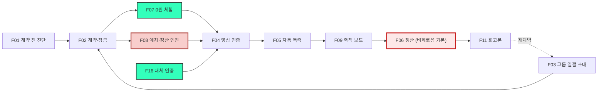

| 구분 | 기능 | 근거 |
|---|---|---|
| **MVP ✔ (11)** | F01 · F02 · F03 · F04 · F05 · F06 · F07 · F08 · F09 · F11 · **F16** | §0.6 D1 — `SEG-F1`의 핵심 루프를 닫는 최소 집합 (`E18`) + `E19`(F16 승격) |
| **MVP ✖ · High (5)** | F10 · F12 · F13 · F14 · F15 | Y1 직후 최우선. F10·F12는 `SEG-F2` 진입 전 필수, F14는 DOS 최고, F15는 규제 |
| **MVP ✖ · Mid (5)** | F17 · F18 · F19 · F20 · F21 | 확장 세그먼트·조직 경로 |
| **MVP ✖ · Low (3)** | F22 · F23 · F24 | 획득 최적화·리텐션 보강 |

> ### ⚠️ MVP 선정에서 밝혀야 할 세 가지
>
> **① F08(예치·정산 엔진)은 난이도 5인데 MVP다.** 전자금융거래법과 사행성 심사가 걸려 있어 **법률 검토가 개발보다 먼저**다. **이것이 전체 일정의 임계 경로다** — 상세는 §8.3.
>
> **② F06의 기본값은 §0.6 D2의 경영 판단이지 근거가 확정한 것이 아니다.** `E16`이 비제로섬을 가리키지만 3선언 도출 단계에서는 결정을 유보했다. **법률 검토 결과에 따라 전면 재설계될 수 있다**(`E20`).
>
> **③ F14(매칭 조건 지정)는 DOS 2.21로 최고인데 MVP에서 뺐다.** §0.6 D1이 Y1을 `SEG-F1` 단독으로 정했기 때문이며, **점수가 아니라 진입 순서 판단**이다.
>
> **④ 어뷰징 방어(§0.4)는 기능 번호가 없지만 MVP 필수다.** 실시간 촬영만 허용·해시 중복 검사·본인 인증·랜덤 샘플 심사. **현금성 보상을 붙이면서 이것들을 나중으로 미루면 초기 사용자 풀이 어뷰저로 오염되어 회복 불가능해진다.** 단 **얼굴 일관성 검사는 개보법 민감정보 쟁점으로 Y1 배제**(§8.3 R6).

### 8.2 릴리즈 로드맵

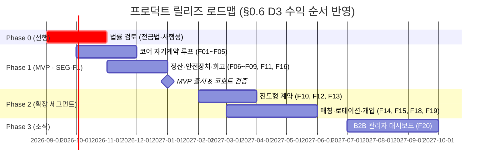

| Phase | 스코프 | **검증 목표** `[가설 · baseline 미측정]` |
|---|---|---|
| **0** 선행 | 법률 검토 | 비제로섬 자기환급 구조의 **전금법·사행성 적법성 판정** — 이 결과가 F06·F08을 확정 |
| **1** MVP | `SEG-F1` 과금 루프 (11종) | ① 그룹 완주율 ② **방장 수동 독촉 0회** 달성 여부 ③ 0원 체험 → 유료 예치 전환율 ④ 회고본 수령자의 재계약률 |
| **2** 확장 | `SEG-F2`·`SEG-A1`·`SEG-F3` | ① 진도형 계약 도입 후 `SEG-F2` 완주율 변화 ② 매칭 그룹의 상호작용 발생률 ③ 크루 이주 완전율 |
| **3** 조직 | 조직 계약 | ① 조직 담당자가 우리 리포트로 **익년 예산 품의를 통과**시키는가 ② 부서별 지속률 산출 가능 여부 |

> **⚠️ 검증 목표에 퍼센트 수치를 적지 않았다.** 비교할 baseline이 원자료에 없어, 목표치를 적으면 근거 없는 숫자가 된다(`E22`). **Phase 1 코호트가 첫 baseline이 된다.**
>
**함께 검증할 파일럿 항목 — 미검증 명제 V1~V4와 모수 확인 4건**

| # | 미검증 명제 | 검증 방법 | **통과 기준** |
|:-:|---|---|---|
| **V1** | **"달성에 붙이면 관계는 안전하다"** — §0.4의 핵심 전제 | A/B 셀: 원안(공유 시 적립) vs 확정안(달성 시 정산) | 확정안 셀의 **W4 리텐션이 유의하게 높음** |
| **V2** | **친구끼리 돈이 오가도 관계가 불편해지지 않는다** — 과잉정당화와 **별개 층위**의 위험 | 파일럿 종료 후 관계 만족도 설문 | 참가 전 대비 **유의한 하락 없음** |
| **V3** | 알림 강박이 실제로 해소되는가 | 계약형 알림 vs 랜덤 알림 A/B | 계약형의 **알림 OFF 비율이 유의하게 낮음** |
| **V4** | 보상 수용률 55% 가정 | 파일럿 내 리워드 옵트인율 측정 | **50% 이상** |

| ❓ | 이 숫자를 신뢰하기 전에 확인할 것 | 방법 | **통과 기준** |
|:-:|---|---|---|
| 1 | **F1의 '친구 동반 실천 40%'** — 시장 모수의 **가장 약한 고리** | 문체부 국민생활체육조사 **최종결과보고서 원자료** 확인 | 실측치로 대체 |
| 2 | 친구 그룹의 참가비 WTP | 수도권 3개 대학·직장 친구 그룹 파일럿 | 그룹 생성 후 **W4 리텐션 25% 이상** |
| 3 | 보상 수용률 55% (= V4) | 파일럿 내 리워드 옵트인율 | **50% 이상** |
| 4 | 사행성·전자금융거래법 | 사업 구조 사전 법률 검토(Phase 0) | 🔴 **부정 시 R2 참가비 take 전체가 무너짐 — 최우선** |

### 8.3 Phase 0 법률 리스크 — 쟁점 8건 (내부 잠정 검토)

> 🚨 **이 절은 변호사 자문이 아니다.** 조문·유권해석·보도자료를 대조한 **내부 리서치 수준의 잠정 판단**이며, 최종 판단 권한은 자문 변호사·감독당국에 있다. 검토일 **2026-08-13** 기준이고, 전금법·선불업 제도는 개정이 잦아 자문 시점에 **재확인이 필요하다.** 판례는 원문을 직접 열지 않았다(전부 `[미확인]`).

| # | 쟁점 | 근거 법령 | 잠정 등급 | D2가 미치는 영향 | 설계 종속 |
|:-:|---|---|:-:|:-:|---|
| **R3** | **전자지급결제대행업(PG) 등록** | 전금법 §28② | 🔴 **높음** | 무관 — D2와 상관없이 발생 | **F08** |
| **R5** | **미환급금 몰수 조항의 약관 무효** | 약관규제법 §6·§8 | 🟠 중높음 | D2가 **낮춘다** | **F06** |
| **R1** | **도박·사행행위** | 형법 §246·§247, 사행행위규제법 §2 | 🟡 중간<br/>(제로섬 옵션 노출 시 🔴) | D2가 **결정적으로 낮춘다** | **F06** |
| **R4** | **유사수신행위** | 유사수신법 §2 | 🟡 중간 | D2가 **오히려 올린다** ⚠️ | **F06** |
| **R2** | 선불전자지급수단 등록 | 전금법 §2xiv·§28① | 🟡 중간<br/>(포인트·쇼핑 결합 시 🔴) | 무관 | **F08** |
| **R6** | 영상 인증의 개인정보 처리 | 개보법 §17·§23 | 🟡 중간 (설계로 해소) | 무관 | F04·F11·F16 |
| **R7** | 미성년자 계약 취소권 | 민법 §5 | 🟢 낮음 | 무관 | F01·F02 |
| **R8** | 성과 수치 광고 | 표시광고법 §3 | 🟢 낮음 | 무관 | 마케팅 |

**① D2를 지킬 근거는 "노력"이 아니라 "득실의 상호성 제거"다.** *"노력으로 달성하니 우연이 아니다"*는 논거는 **약하다** — 대법원 법리는 당사자의 **능력·기량이 개입해도 우연성이 배제되지 않는다**고 본다 `[미확인 — 판례 원문 미대조]`. 실제로 강한 논거는 다른 데 있다: 도박의 요건은 *"재물을 걸고 우연에 의하여 **재물의 득실**을 결정"*인데, **비제로섬 자기환급은 참가자 사이의 득실 이전 자체를 없앤다.** 내가 실패해도 그 돈은 남에게 가지 않고, 남이 실패해도 내 몫은 늘지 않는다. **다툴 재물이 없으면 도박의 구조가 성립하지 않는다.**

**② 그런데 같은 선택이 유사수신 논점을 끌어올린다 — 이 비대칭이 가장 중요한 발견이다.** 유사수신행위는 *"장래에 **원금의 전액 또는 이를 초과하는 금액**을 지급할 것을 약정하고 예탁금 등의 명목으로 금전을 받는 행위"*다 `[확인]`. **제로섬은 실패 시 원금을 잃으므로 이 문언에서 멀지만, 비제로섬 자기환급은 "달성하면 전액 돌려준다"는 약정에 가까워진다.** 방어 논거는 있다 — ⓐ 자금 조달이 아니라 **이행 담보**이고 수익은 참가비 take에서 나온다 ⓑ **상품·용역 거래가 매개**된다(챌린지 운영·인증·회고본). **하지만 D2를 "법적으로 안전한 선택"이라 부르는 것은 정확하지 않다 — 위험의 종류를 바꾼 것이다.**

**③ 임계 경로는 사행성이 아니라 전자금융거래법이다.** 금융위·금감원 유권해석은 *"자금정산에 관여하는 경우 실제로 전자지급결제대행업을 영위하는 것"*으로 보아, **결제대금예치업자로 등록되어 있어도 자금정산에 관여하면 PG 등록이 필요**하다고 판단했다 `[확인]`. **참가비를 받아 성패로 환급액을 계산해 지급하는 것 자체가 자금정산이다** → **D2·사행성과 무관하게 구조적으로 발생하며, F08의 자금 흐름 확정이 F06(정산 규칙)보다 먼저다.**

**자문 전에 사업자가 먼저 정해야 할 변수 3개** — 확정본은 셋 다 미정이며, **이것 없이는 어떤 자문도 정확한 답을 줄 수 없다.**

| ❓ | 변수 | 왜 결정적인가 | 흔드는 쟁점 |
|:-:|---|---|---|
| **V1** | **예치금을 누가 보관하나** (사업자 계정 / PG / 신탁·에스크로) | 사업자 계정을 경유하면 자금정산 관여가 명백해진다 | **R3**(결정적) · R2 |
| **V2** | **미환급 차액이 누구에게 가나** (사업자 수익 / 그룹 지갑 / 이연 크레딧 / 기부) | 사업자 귀속이면 *"몰수"*(R5), 타 참가자 귀속이면 *"득실 이전"*(R1), 이연이면 *"선불충전금"*(R2) | **R1·R2·R5 전부** |
| **V3** | **참가비와 예치금이 분리되어 있나** | 분리되면 *"용역 대가 + 이행 담보"*로 설명되고, 미분리면 전액이 판돈으로 보일 수 있다 | R1·R4·R5 |

**쟁점별 설계 조건 (요약)**

| # | 지키면 관리 가능한 조건 |
|:-:|---|
| **R1** | ① 미환급금을 **다른 참가자에게 이전하지 않는다** ② **그룹 전원 달성 조건의 금전 보상을 만들지 않는다**(타인 행위에 내 금전이 걸리면 우연성 논점 부활 — 그룹 효과는 **비금전 보상**으로) ③ 달성 판정 기준을 **사전에 객관·검증가능**하게 고정 |
| **R2** | **Y1에 포인트 경제를 만들지 않는다.** 환급은 **원 결제수단 반환만.** 포인트로 상품을 사게 하면 즉시 선불업 등록 + 충전금 100% 별도관리 의무 진입(등록 면제는 **연 발행액 500억 미만 + 잔액 30억 미만** `[확인 — 보도자료 기준]`) |
| **R3** | **A안 권고** — PG·에스크로에 **자금 보관·정산 실행을 전부 위탁**하고 자사는 판정 결과(달성률)만 전달. B안(전자금융업 직접 등록)은 자본금·심사 기간이 Y1 일정과 충돌. **C안(자사 계정 직접 정산)은 미등록 영업 리스크로 권고하지 않음** |
| **R4** | ① **참가비(용역 대가)와 예치금(이행 담보)을 계정·약관·영수증에서 분리** ② **원금 초과 금전 보상을 만들지 않는다** ③ 예치금을 사업자 자산과 분리 보관 ④ 마케팅에서 ***"돈이 돌아온다 / 원금 보장"*** 류 표현 금지 — **이 문구 하나가 요건의 증거가 될 수 있다** ⚠️ **§0.5의 완화 프레이밍(*"거는 돈이 아니라 맡기는 돈"*)이 여기에 정면으로 걸린다 — 카피 재작성 필요** |
| **R5** | 미환급금을 **위약금 몰수로 성격 규정하지 않는다**(§8 무효 시 전액 반환 리스크). **달성률 비례 반환 + "제공 역무의 대가"**로 규정하고 **약관에 반환 산식을 명시**하며 계약 전(F01) 화면에서 고지. 약관규제법에서는 과중한 손해배상액 예정이 **감액이 아니라 전부 무효**다 `[확인]` |
| **R6** | 얼굴 영상은 **개인정보이지만 원칙적으로 민감정보가 아니다** `[확인]`. 그룹 내 공개는 **제3자 제공 동의** 필요, 외부 공유는 **옵트인 + 재동의**, 보관·파기 정책 명시. 🔴 **얼굴로 본인 여부를 자동 판정하면 생체인식정보(민감정보) 진입 → Y1 배제**, F16·F19로 우회 |
| **R7** | F01/F02에 **연령 확인 게이트.** 만 19세 미만은 **금전 예치 트랙 차단** → F07 무예치 체험으로 유도(**추가 개발 없음**) |
| **R8** | 실측 코호트 확보 전까지 **완주율·개선율 수치 광고 금지**를 마케팅 규칙으로 못 박는다 |

**§0.8의 "뒤집힐 조건 ①"에 대한 답** — **비제로섬 자체가 사행성으로 판정될 소지는 낮다. 따라서 D2는 유지된다.** 단 **§0.6 D2와 이 검토가 갈리는 지점이 하나 있다**: D2는 제로섬을 *"선택지로 열되 기본 노출하지 않음"*으로 정했으나, **형법 §247(도박장소등개설)은 개설 행위 자체를 벌하므로 "기본값이 아니다"는 방어가 되지 않는다.** → **제로섬은 선택지로도 열지 않을 것을 권고한다.**

**남은 위험** — ① R3의 유권해석은 **음식점 주문중개 사안**이라 사실관계가 다르다. 이 쟁점은 **금융위 법령해석 신청(비조치의견서)이 자문보다 확실한 답**일 수 있다 ② R2 면제 기준은 시행령 조문·별표를 열지 못했다 ③ **세무·회계(예치금 부채 인식, 미환급금 수익 인식 시점)를 다루지 않았다** — R5의 성격 규정이 **수익 인식 시점을 바꾼다** ④ 상금 지급 시 **기타소득 원천징수** 의무는 별도 설계 필요.

---

## 9. Conclusion

본 문서는 **「자유로운 자기계약(Contract) · 무마찰 지인 관계(Relationship) · 과정의 서사적 자산화(Proof)」** 3축으로, 기존 습관 형성·숏폼 앱이 풀지 못한 병목을 해결한다. **§0.6에서 확정한 비즈니스 방향성은 「관계 우선 · 비제로섬 안전진입」이다.**

1. **가장 먼저 지어야 할 것은 선언 ①의 계약 안전장치**(F01·F02·F13·F15)다. 지킬 수 있는 약속을 맺게 해야만 관계(②)가 스스로 무너지지 않는다. **다만 그 앞에 법률 검토(Phase 0)가 선다.**
2. **대외 브랜드 전면에 세울 메시지는 선언 ②의 관계비용 대납**(F03·F05)이다. 경쟁 9곳 중 0곳만 있는 유일한 포지셔닝이며(`E07`), 한 문장으로 전달되는 유일한 선언이다.
3. **지속 가능한 LTV를 만드는 것은 선언 ③의 증명 자산화**(F11·F20)다. 개인의 재계약과 조직 계약의 최종 열쇠이며, **수익 3층 전부에 붙는 유일한 가치**다.
4. **§0.6 D2(비제로섬)는 이 문서에서 가장 큰 단일 베팅이다.** `E16`이 방향을 지지하지만 챌린저스가 **제로섬으로** 5,000억을 만들었다는 반대 증거가 §7.5에 그대로 남아 있다. **이 베팅의 검증이 Phase 0·1의 최우선 과제다.**
5. **법률 검토가 D2를 지지했으나 위험의 종류를 바꿨다**(§8.3) — 사행성은 낮아지고 **유사수신·PG 등록 논점이 올라갔다.** 임계 경로는 **F08의 자금 흐름 구조(V1·V2·V3) 확정**이다.

**MVP 11종을 최우선 구현 스코프로 확정하고, 법률 검토(Phase 0) 착수와 V1·V2·V3 확정을 선행 조건으로 둔다.**

---

## 부록 A. 이 문서의 한계

1. **고객 근거 전체가 미검증이다.** 페르소나는 가상, 여정지도는 추론, AOS·DOS는 작성자 판단, JTBD는 `[모의]`다. **§1~§3·§6은 실제 인터뷰로 통째로 뒤집힐 수 있다.**
2. **모의 인터뷰는 페르소나의 연역이라 반증 능력이 없다.** 가설을 확인만 하고 부정하지 못한다 — **순환 논증 위험**이 구조적으로 있다.
3. **§3.2 Outcome의 측정 지표는 전부 `[목표·미검증]`이고 목표 퍼센트가 없다.** baseline이 없어 개선 폭을 계산할 수 없다. 유일한 수치인 업로드율 31%도 **모의 응답의 회상값**이다.
4. **AOS 4.0 상위 10건 중 5건의 DOS가 `계산 보류`다.** 교대근무·헬스 참여 모수를 확보했으나 **횡단 속성이라 이중 계상** 문제로 반영하지 못했다.
5. **§8의 중요도·난이도는 본 문서의 판단이다**(`E21`). 특히 F08·F14·F16·F19는 오차가 클 수 있다.
6. **MVP 11종이 한 사이클에 구현 가능한지 검증하지 않았다.** 인력·기간 제약을 넣지 않은 논리적 최소 집합이다.
7. **§0.6의 4개 의사결정은 근거가 아니라 판단이다.** 다른 판단도 가능하며 뒤집힐 조건을 §0.8에 명시했다.
8. **§8.2 로드맵의 날짜는 예시다.** 실제 착수일·인력 규모를 반영하지 않았고, Phase 0 기간은 특히 불확실하다. **§8.3 R3에서 B안(직접 등록)을 택하면 Phase 1 착수가 밀린다.**
9. **정량 목표(완주율·이탈률·바이럴 계수)를 전부 제거했다.** 근거가 없어 내린 판단이지만, 그 결과 **이 문서에는 "얼마나 좋아지는가"에 대한 답이 없다.** Phase 1 코호트 전까지는 채울 수 없다.
10. **시장 모수의 한계는 아래 표에 6건을 따로 모았다.** 가장 약한 고리는 F1 108만의 *"친구 동반 실천 40%"* `[러프]`다.
11. **§8.3 법률 검토는 변호사 자문이 아니며 판례 원문을 대조하지 않았다.** 세무·회계 검토도 빠져 있다.

### 시장 모수의 한계 — 6건 (§0.2·§0.3이 안고 있는 것)

이 여섯이 **TAM·SAM·SOM 전체의 신뢰 조건**이다. 하나라도 무너지면 §0.2·§0.3을 다시 계산해야 한다.

| # | 한계 | 무엇이 흔들리나 |
|:-:|---|---|
| **M1** | **F1의 '친구 동반 실천 40%'가 `[러프]`다** — 국민생활체육조사가 참여 동반자 세부 비율을 비공개해 추정에 의존했다 | **F1 108만**의 불확실성이 가장 크다. F1은 Y1 단독 타깃(§0.6 D1)이므로 **1년차 계획 전체**가 여기 걸린다 |
| **M2** | **F2의 열품타 MAU 210만은 2차 출처**(§4.4 40번)이며, *'그룹 기능 실사용 60%'*도 근거 없는 가정이다 | F2 69만 → Y2 확장 규모 |
| **M3** | **SAM 경로 A와 B는 완전히 독립적이지 않다** — 둘 다 국내 디지털 광고 11.26조에 부분 의존하므로 **수렴이 곧 검증은 아니다** | SAM 700억의 *"두 경로가 만난다"*는 근거가 약해진다 |
| **M4** | **보상 수용률 55%는 '앱테크 이용률' 프록시다** — 앱테크 수용과 *"친구에게 인증 영상을 올리고 보상받겠다"*는 수용은 같지 않다 | **SAM 800만 전체의 전제.** 홍다인(§1.0)이 이 지점을 인격화했고 §7.5가 반증 신호로 다시 잡았다 |
| **M5** | **F계열 진입의 전제가 §0.4의 조건부 결론 하나에 걸려 있다** — 친구 사이에 돈이 오가면 **관계 자체가 불편해질** 별개의 위험이 있으며, 이는 과잉정당화와 **다른 층위**다 | F계열 전체(218만). 파일럿 **V2**가 이것만을 겨냥한다 |
| **M6** | **중복 제거 계수(0.75 / 0.80)는 근사값**이고, **A2 40만은 도출 산식 자체가 없다**(§0.3) | **SOM 모집단 232만** — 실효 계수가 0.60이 아니라 0.75면 290만, 0.45면 174만이 된다 |

### v2.0에서 새로 생긴 한계

12. **문서가 매우 길어졌다.** 자립성을 얻는 대가로 **한 화면 가독성을 잃었다** — 목차와 절별 요약 박스로 완화했으나 완전히 해소되지는 않는다.
13. **원자료를 압축·재배열하는 과정에서 서술의 뉘앙스가 일부 손실됐다.** 특히 페르소나의 감정 서술과 모의 인터뷰의 개별 인용은 요지만 남겼다. **원자료 문서는 그대로 보존되어 있으므로, 인용의 정확한 문맥이 필요할 때는 원자료를 확인할 것.**
14. **01~03 챕터(Five Forces · 가치사슬 · KSF)를 흡수하지 않았다.** 숙박공유·새벽배송을 대상으로 한 프레임워크 학습이라 본 제품의 지식 원천이 아니라고 판단했다. **다만 그 분석에서 얻은 프레임워크 감각이 본 문서의 판단에 간접적으로 반영되어 있을 수 있다.**

## 부록 B. 미해결 사안

| # | 사안 | 왜 미해결인가 | 해소 조건 |
|:-:|---|---|---|
| **1** | **V1·V2·V3 (예치금 보관 주체 · 미환급 차액 귀속 · 참가비 분리)** | **법률 문제가 아니라 경영 결정**이다. 이것 없이는 자문 질문이 성립하지 않는다 | **사업자 결정** — 가장 시급 |
| **2** | **페이백 구조의 법적 확정** | §0.6 D2가 **권고 기본값**을 정했을 뿐, 전금법·사행성 판정은 받지 않았다 | **Phase 0 법률 자문 + 금융위 법령해석 신청** |
| **3** | **AOS 4.0 상위 5건의 DOS `계산 보류`** | 조직·교대근무·촬영제약 세그먼트 모수가 `[미측정]`이고, 확보한 모수는 횡단 속성이라 이중 계상된다 | 세그먼트 단위 모수 재설계 |
| **4** | **비제로섬의 유인 약화 여부** | 챌린저스는 제로섬으로 5,000억을 만들었다. 비제로섬이 같은 유인을 낼지 확인된 바 없다 | 조은비·강수빈 유형 **별도 인터뷰 트랙** |
| **5** | **극단 사용자 4건이 인터뷰 대상에서 빠졌다** | 선정 기준 1(핵심·확장)이 극단 사용자를 배제 — **AOS 최상위의 40%** | **후속 라운드로 분리** |
| **6** | **셋로그의 수익화 방향** | 목표·챌린지로 가면 획득 채널이 정면 경쟁자가 된다(778만 보유) | 모니터링 — 대응 시나리오 준비 |
| **7** | **세무·회계 검토** | 예치금의 부채 인식, 미환급금의 수익 인식 시점, 상금 기타소득 원천징수 | 회계·세무 자문 |

## 부록 C. 방법론 요약 — 이 지식이 어떻게 만들어졌는가

| 챕터 | 방법론 | 핵심 규칙 |
|---|---|---|
| **04** 시장 규모 | TAM-SAM-SOM + Market Segment Map | **인구통계로 자르지 않고 Pain의 근본 원인(P1 트리거 소유권 · P2 반복의 축적)을 축으로 세운다.** 표기 규약 `[실측]`/`[추정]`/`[러프]`로 근거 등급을 항목마다 명시 |
| **05** 페르소나 | 스펙트럼 4분류(Core·Adjacent·Extreme·Non-user) + **AI 기반 5단계 워크플로우**(① 1차 생성 발산 → ② 2차 평가 수렴 → ③ 3차 보정 → ④ 4차 AI 교차검증 → ⑤ 5단계 통합 맵) | **① 단계는 "고르는" 단계가 아니라 "펼치는" 단계다.** 서로 겹치거나 제품이 감당 못 할 페르소나가 **의도적으로 섞여 있다.** ⚠️ **현재 문서에 실린 것은 ①의 산출물이며 ②~⑤는 미수행** — 따라서 **14명 중 어떤 페르소나도 아직 "우리 고객"이 아니다** |
| **05** 여정지도 | S0~S6 7단계 (일반 여정 5단계를 이 제품 구조에 맞게 재정의) | 결제가 지출이 아니라 **예치**이고, 끝(S6)이 다음 시작(S1)을 부른다 |
| **06** 기회점수 | `AOS = I × (1 − S/5)` · `DOS = (I − S) × MR` | **Importance는 Pain이 아니라 Goal의 중요도**로 정의(그래야 *"우리가 풀수록 고객이 멀어지는 문제"*가 상위로 안 올라온다) · **Satisfaction은 기존 대체 솔루션 기준선** · 사분면 경계는 **중앙값**, 경계값은 보수적으로 Low에 포함 |
| **07** JTBD | Job Story 형식 `When [상황] → I want to [Job] → So I can [Outcome]` + 4 Forces(Push·Pull·Habit·Anxiety) + **데모 체험 기반 인터뷰** | **가정형 질문 금지**(§2.0 금지 질문 5종) · `[관찰]`과 `[진술]` 분리 표기 · **모의 응답 3대 금지 규정** 준수 |
| **08** 가치 선언 | 경쟁자를 **"같은 Job에 고용되는 모든 것"**으로 재정의 → 사업활동에서 **가치 선언을 역산** → 근거 추적표(E-ID)로 결론을 근거에 결박 | 각 근거에 **"이것이 틀리면 무엇이 무너지는가"**를 필수로 붙인다 |
| **09** 법률 | 조문·유권해석·보도자료 대조 | **`[확인]`/`[미확인]` 구분 필수** · 변호사 자문이 아님을 문서 상단에 명시 |

## 부록 D. 코드 사전

| 계열 | 코드 | 의미 |
|---|---|---|
| **세그먼트** | `SEG-F1`(F1) 친구 목표 크루 108만 · `SEG-F2`(F2) 스터디 팟 69만 · `SEG-F3`(F3) 페널티 팟 41만 · `SEG-A1`(A1) 루틴 커미터 128만 · `SEG-A2`(A2) 기한 스프린터 40만 · `SEG-C1` 롱디 페어 74만 · `SEG-C2`(C2) 데일리 크루 428만 · `B2` 케어 리포터 85만 · `D1` 강제 트리거 유저 | Q1 자기계약 존 = F1·F2·F3·A1·A2 (중복 제거 **232만**) |
| **사분면(세그먼트 맵)** | **Q1** 자기계약 존 ★1차 타깃 · **Q2** 의무증빙 존(후순위) · **Q3** 느슨한 관계 존(공급원) · **Q4** 현행 SNS 존(진입 금지) | 축: Y=트리거 소유권 / X=반복 목적의 소재 |
| **사분면(AOS 매트릭스)** | **Q1** 혁신기회 15건 · **Q2** 개선기회 4건 · **Q3** 유지·보완 17건 · **Q4** 과잉투자 위험 6건 | 축: Y=Importance / X=Satisfaction |
| **여정 단계** | `S0` 자각 · `S1` 초대·합류 · `S2` 계약 · `S3` 예치 · `S4` 인증 · `S5` 정산 · `S6` 회고·재계약 | S2 = 통증 최다(10건) / S3 = 이탈 최다(4건) |
| **Pain** | `01`~`42` (§1.3에 전량) | 유형 🚧진입장벽 12 · 🔧설계결함 13 · 🤝관계비용 7 · 📉리텐션 8 · ⚖️윤리규제 4 |
| **Goal 4분류** | `G1` 해내기 10 · `G2` 관계 지키기 7 · `G3` 인정받기 9 · **`G4` 통제권 16(38%)** | Pain별 Goal은 역산한 추론 |
| **근본 원인** | `P1` 알림 트리거의 강박(트리거 소유권이 플랫폼에 있음) · `P2` 콘텐츠 반복성의 지루함(반복이 축적되지 않음) | 세그먼트 맵의 두 축 |
| **Outcome** | `O1`~`O13` (§3.2) | Y1 스코프 7건 · Y2 4건 · Y3 1건 |
| **기능** | `F01`~`F24` (§8) | MVP ✔ 11종 |
| **근거** | `E01`~`E17`(승계) · **`E18`~`E22`(v1.0 신설)** | 등급 `실측`/`추정`/`러프`/`미검증`/`판단` |
| **시장 모수 한계** | `M1`~`M6` (부록 A) | TAM·SAM·SOM의 신뢰 조건 6건 — `M1` F1 40% · `M2` 열품타 2차출처 · `M3` 경로 A·B 비독립 · `M4` 55% 프록시 · `M5` 관계 불편 위험 · `M6` 중복 제거 계수 |
| **수익원** | `R1` 그룹 프리미엄 구독(약 180억) · `R2` 챌린지 참가비 take 12%(약 60억) | 광고 2종 배제 = 약 400억 포기 |
| **의사결정** | `D1` 진입 세그먼트 · `D2` 정산 기본값 · `D3` 수익 순서 · `D4` 브랜드 전면 문장 | §0.6 — 근거가 아니라 **경영 판단** |
| **법률 쟁점** | `R1` 도박·사행행위 · `R2` 선불전자지급수단 · `R3` PG 등록 · `R4` 유사수신 · `R5` 약관 무효 · `R6` 개인정보 · `R7` 미성년자 · `R8` 표시광고 | §8.3 — ⚠️ 수익원 `R1`·`R2`와 코드가 겹치므로 문맥으로 구분 |
| **미확정 변수** | `V1` 예치금 보관 주체 · `V2` 미환급 차액 귀속 · `V3` 참가비·예치금 분리 | **자문 전 사업자 결정 필요** |
| **파일럿 검증** | `V1`~`V4`(§8.2 파일럿 항목) | ⚠️ 위 미확정 변수 `V1`~`V3`와 코드가 겹치므로 문맥으로 구분 |

