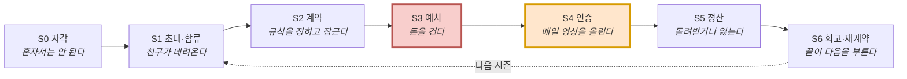
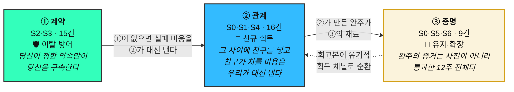
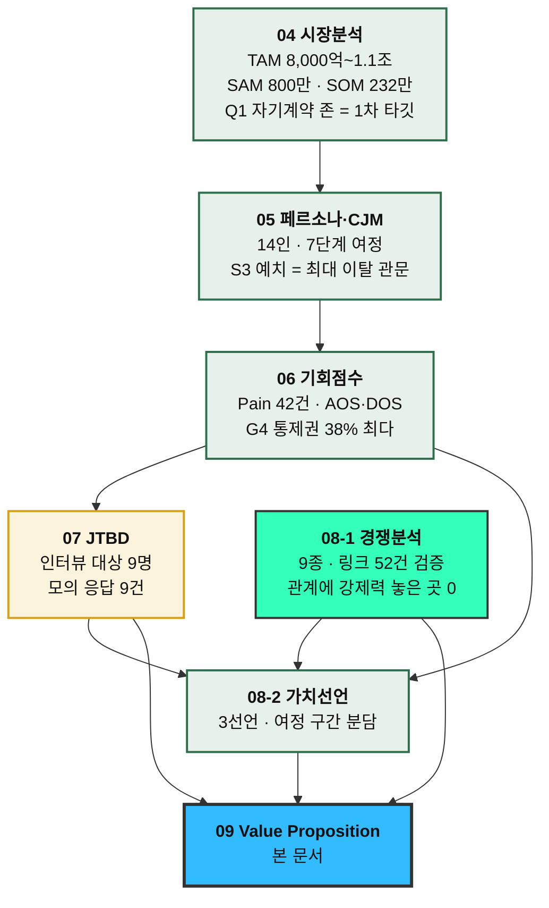
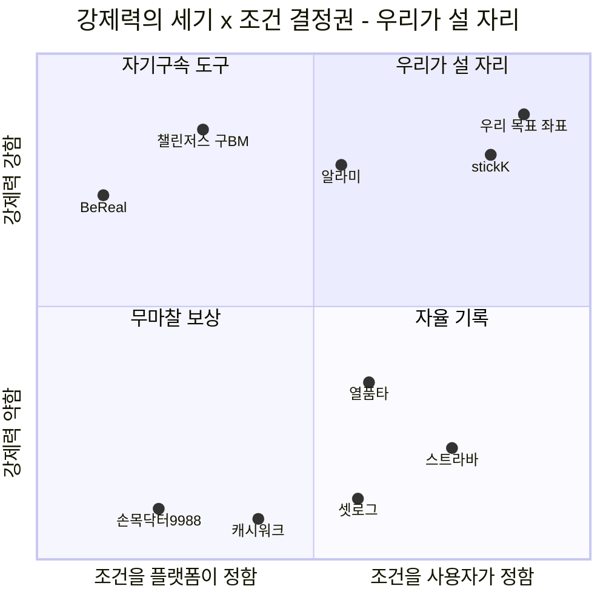
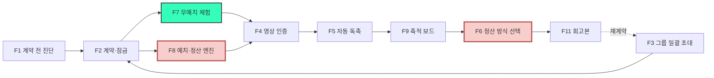

# 09. Value Proposition — 보상형 그룹 목표 인증 플랫폼

> **작성 메타**
>
> | 항목 | 값 |
> |---|---|
> | **작성 모델** | **`claude-opus-5`** (Opus 5) |
> | **Effort Level** | **미확인** — 클라이언트 설정값을 관측할 수 없어 공란으로 둔다. 확인되면 이 칸과 파일명에 반영할 것 |
> | 작성일 | 2026-08-13 |
> | 지리적 범위 / 통화 | 대한민국 / KRW |
> | 문서 성격 | 04~08 전 챕터를 통합한 **Value Proposition 종합 문서** |

---

> ## 🚨 이 문서를 읽기 전에 — 근거의 성격
>
> 이 문서의 **모든 고객 근거는 미검증**이다. 정직하게 밝힌다.
>
> | 재료 | 실제 성격 |
> |---|---|
> | 페르소나 14인 | **가상 인물.** 실측이 아니라 세그먼트 맵에서 연역 |
> | 고객 여정지도 | 위 14인의 여정을 **논리적으로 추론**한 것 |
> | AOS·DOS 점수 84개 | **작성자 판단**인 Importance·Satisfaction 값에서 계산 |
> | JTBD 인터뷰 9건 | **모의(가상) 응답.** 실제 인터뷰는 아직 수행되지 않음 |
> | 시장 모수 | `[추정]`·`[러프]` 다수 |
>
> **§2의 JTBD 선언은 모의 인터뷰에서 도출했다.** 원 문서(`07-3 mock-interviews.md`)가 *"JTBD 요약 카드의 `Evidence` 칸에 이 인용문을 넣지 말 것"*을 명시했으므로, **본 문서의 Evidence 칸에는 모의 인용문을 넣지 않았고** 대신 `[모의]` 표기와 함께 **관찰된 행동 신호**만 남겼다.
>
> **경쟁사 분석(§4)만은 성격이 다르다** — 공개된 재무·통계에 기반하며 링크 52건이 HTTP 검증을 통과했다.

---

## 목차

| # | 항목 |
|:-:|---|
| **1** | [페르소나·CJM 기반 고객별 핵심 문제 (Pain, Needs)](#1-페르소나cjm-기반-고객별-핵심-문제-pain-needs) |
| **2** | [JTBD 선언 — 상황에 따른 목표 (Goal, Job)](#2-jtbd-선언--상황에-따른-목표-goal-job) |
| **3** | [고객이 원하는 Outcome (측정 가능 형태)](#3-고객이-원하는-outcome-측정-가능-형태) |
| **4** | [기존 대안 (Competitor / Substitute)](#4-기존-대안-competitor--substitute) |
| **5** | [우리 솔루션의 핵심 제안 (Value Proposition)](#5-우리-솔루션의-핵심-제안-value-proposition) |
| **6** | [우리가 제공하는 차별적 가치](#6-우리가-제공하는-차별적-가치) |
| **7** | [Proof — 도출 근거와 차별성 근거](#7-proof--도출-근거와-차별성-근거) |
| **8** | [Job-Feature Map (MVP·우선순위)](#8-job-feature-map-mvp-포함-여부-및-기능-우선순위-정리-포함) |

---

## 1. 페르소나·CJM 기반 고객별 핵심 문제 (Pain, Needs)

### 1.1 여정 7단계와 이탈 지도

이 서비스는 일반 여정(인식→탐색→구매→사용→유지)으로 담기지 않는다. **개인이 검색해서 오지 않고 친구가 그룹째 데려오며, 결제가 지출이 아니라 예치이고, 끝이 다음 시작을 결정**하기 때문이다.

| 이름 | S0 | S1 | S2 | S3 | S4 | S5 | S6 | 어떻게 끝나나 |
|---|:-:|:-:|:-:|:-:|:-:|:-:|:-:|---|
| 🔵 **정하윤** 방장 | ● | ● | ● | ● | ● | ● | ● | 완주. 단 **다음 시즌도 자기가 총대** → 번아웃 |
| 🔵 **김도현** 참여자 | ● | ● | ⚠️ | ⚠️ | ⚠️ | ● | ◐ | **S4에서 말없이 사라진다** |
| 🔵 **박서연** 수험생 | ● | ⚠️ | ⚠️ | ● | ⚠️ | ⚠️ | ⚠️ | 완주. 단 **출석 100%인데 목표는 미달** |
| 🔵 **이준호** 루틴 | ● | ⚠️ | ⚠️ | ● | ⚠️ | ● | ⚠️ | 완주. 단 **무기한 습관인데 제품은 시즌제** |
| 🔵 **최민지** 스프린터 | ● | ⚠️ | ⚠️ | ● | ⚠️ | ● | ⚠️ | 완주. **최대 지불액이나 단발로 끝날 위험** |
| 🟢 **한지우** 총무 | ● | ⚠️ | ⚠️ | ⚠️ | ● | ⚠️ | ⚠️ | 완주. 단 **18명을 다 옮겨야 한다** |
| 🟢 **윤채원** 데일리 | ● | ● | ⚠️ | ⛔ | — | — | — | **S3 이탈** — *"우리끼리 돈을?"* |
| 🟢 **홍다인** 앱테크 | ● | ⚠️ | ⚠️ | ⛔ | — | — | — | **S3 이탈** — 걸어본 적이 없다 |
| 🟢 **송재현** 기록 | ● | ⚠️ | ⚠️ | ○ | ● | ○ | ● | **무료 트랙 완주** (걸 마감일 없음) |
| 🟢 **여민석** 사내 | ● | ⚠️ | ⚠️ | ● | ⚠️ | ⚠️ | ⚠️ | 완주. 단 **회사가 돈을 낸다** |
| 🔴 **강수빈** 교대 | ● | ⚠️ | ⚠️ | ● | ⛔ | ↺ | ↺ | **지킬 수 없는 약속 → 반복 실패 → 손실 순환** |
| 🔴 **배유진** 촬영불가 | ● | ● | ● | ● | ⛔ | ⛔ | ⛔ | **돈은 걸었는데 인증할 장소가 없다** |
| ⚪ **서지훈** 알림거부 | ⛔ | — | — | — | — | — | — | 설명을 듣기도 전에 끝난다 |
| ⚪ **조은비** 현금거부 | ● | ● | ● | ⛔ | — | — | — | **S3 이탈** — 도덕적으로 못 받아들인다 |

`●` 통과 · `◐` 겨우 통과 · `○` 해당 없음 · `⚠️` 힘들지만 통과 · `⛔` 종료 · `↺` 되돌아감

> **① S3 예치가 최대 벽이다** — 4명이 여기서 멈추는데 **이유가 전부 다르다.** 손실이 무섭거나(김도현), 친구 사이에 돈이 껄끄럽거나(윤채원), 걸어본 적이 없거나(홍다인), 남의 손실로 이득 보는 게 싫거나(조은비).
> **② S4에서 둘은 이탈이 아니라 배제다** — 강수빈·배유진은 **이미 돈을 건 뒤에** 막혀 손실까지 발생한다.
> **③ 완주자 6명도 전부 어딘가 아프다** — ⚠️가 하나도 없는 사람이 없다. 완주는 이탈로 집계되지 않아 **더 늦게 발견된다.**

### 1.2 인물별 핵심 Pain · Needs

| 인물 | **Pain — 무엇이 막혔나** | **Needs — 무엇이 필요한가** | 단계 | AOS |
|---|---|---|:-:|:-:|
| 🔵 **정하윤** | `01` 독촉 역할이 시작 단계부터 되살아난다 — 앱을 쓰는 이유가 시작 전에 배신당함 | 규칙 집행의 **주체가 사람이 아닐 것** | S3·S4 | **4.0** |
| | `03` 방장 역할 고정 → 번아웃 → 그룹 소멸 | **역할이 자동으로 넘어갈 것** | S6 | 3.2 |
| | `02` 상금의 출처가 친구의 손실임이 화면에 드러남 | **관계를 상하지 않는 정산 구조** | S5 | 0.8 |
| 🔵 **김도현** | `04` 강제력이 필요한 걸 알면서 참가비 앞에서 결정 불가 | **잃지 않고 강제력을 먼저 겪을 것** | S3 | **4.0** |
| | `05` 한 번 밀리면 복귀 비용이 급등해 무응답 이탈 | **조용히 돌아올 경로** | S4 | 2.4 |
| 🔵 **박서연** | `07` 인증은 통과인데 목표는 미달 — **앱이 미달을 가린다** | **이진 판정이 아닌 진도 표시** | S4 | 3.0 |
| | `09` 분량·범위 목표를 계약에 넣을 수 없다 | **계약의 표현력** | S2 | 2.4 |
| 🔵 **이준호** | `11` 그룹 제품인데 그룹 없이 도착, 매칭 품질 통제 불가 | **나를 실제로 보는 소수** | S1 | **4.0** |
| | `10` 무기한 습관인데 제품은 시즌제 | **종료일 없는 계약** | S2·S6 | 2.4 |
| 🔵 **최민지** | `13` 5주차 붕괴가 예측 가능한데 앱이 아무것도 안 함 | **구간별 개입** | S4 | **4.0** |
| | `14` 과정이 안 남고 결과만 남는다 | **통과한 과정의 기록** | S6 | 3.0 |
| 🟢 **한지우** | `16` 크루 18명 집단 이주, 한 명 남으면 이중 운영 | **전원 일괄 이주** | S1 | **4.0** |
| | `17` 2년간의 재량(봐주기)이 자동 집행과 충돌 | **예외 처리 수단** | S2 | 0.8 |
| | `18` 자동 분배가 회식비 공동 재원을 없앤다 | **그룹 지갑 옵션** | S5 | 0.6 |
| 🟢 **홍다인** | `22` 5년 받기만 해본 사람에게 손실 가능성이 처음 등장 | **무손실 체험 경로** | S3 | 3.0 |
| 🟢 **송재현** | `26` 촬영·편집 마찰이 꾸준함을 끊는다 | **편집 없는 자동 누적** | S0 | 3.0 |
| | `25` 그룹도 마감일도 없어 온보딩에 자리가 없다 | **개인 트랙** | S1 | 2.0 |
| 🟢 **여민석** | `29` 부서별 달성률·지속률을 뽑을 수 없다 | **보고 가능한 숫자** | S5 | **4.0** |
| | `28` 담당자가 대신 설계해 "회사가 시킨 것"이 됨 | **직원 자기계약 형식** | S2 | 2.4 |
| 🔴 **강수빈** | `31` 계약 전에 아무것도 묻지 않아 지킬 수 없는 약속에 서명 | **계약 전 진단** | S2 | **4.0** |
| | `33` 구조적 실패자의 손실이 상금 재원 — 순환 정지 유인 없음 | **손실 상한·강제 휴식** | S5 | **4.0** |
| 🔴 **배유진** | `34` 인증 수단이 하나뿐이라 촬영 불가 환경이 곧 배제 환경 | **대체 인증 수단** | S4 | **4.0** |
| | `36` 실제로 했는데 증명 못 해 몰수 | **비영상 증빙 인정** | S5 | **4.0** |
| ⚪ **조은비** | `40` 환급 논리는 손실 걱정에 답하는데 반대는 도덕 판단 | **제로섬 없는 구조** | S3 | 3.0 |
| ⚪ **서지훈** | `37` 앱 이름을 듣는 순간 '알림 앱'으로 분류 | *(Goal이 제품과 반대 — 대상 아님)* | S0 | 0.0 |

### 1.3 Pain 42건의 구조 — 세 가지 관통 패턴

| 패턴 | 내용 | 함의 |
|---|---|---|
| **가장 많이 막히는 것은 "해내기"가 아니라 "통제권"** | Goal 4분류 중 **G4 통제권 16건(38%)** > G1 해내기 10건 | **트리거 시각은 사용자에게 넘겼는데 계약의 나머지 조건은 여전히 제품이 쥐고 있다** |
| **S2는 넓게 아프고 S3는 깊게 끊긴다** | S2 계약 **10건(최다)** / S3 예치 **이탈 4건(최다)** | 통증 총량과 이탈 지점이 다른 관문에 있다 |
| **하나를 고치면 여럿이 복구된다** | 예치 문턱 `04`·`19`·`22`·`40`(4명) · 제로섬 재원 `02`·`19`·`33`·`40`(4명) — **`19`·`40`에서 겹침** | 두 묶음은 **사실상 하나의 수익 구조 문제** |

---

## 2. JTBD 선언 — 상황에 따른 목표 (Goal, Job)

> **`[모의]`** — 아래 9건은 `07-4 mock-interviews/`의 **가상 응답**에서 도출했다. Evidence 칸에는 모의 인용문 대신 **데모 화면 체류·행동 신호**만 남긴다(원 문서의 금지 규정 준수).

### 2.1 JTBD 선언 9건

| # | 인물 | **Situation (When…)** | **Job Statement (I want to…)** | **So I can…** |
|:-:|---|---|---|---|
| **A** | 🔵 **이준호** (31) | 챌린저스가 챌린지를 접어 **돈 걸 곳이 사라졌고**, 같이 할 사람이 없을 때 | 나를 **실제로 지켜보는 소수**와 묶여 아침 기상을 무기한 고정하고 싶다 | 재미가 아니라 **손실 회피**로 굴러가는 상태를 유지할 수 있도록 |
| **B** | 🔵 **정하윤** (26) | 내가 만든 인증방이 2주 만에 죽고 **독촉 역할이 자동으로 내 몫**이 됐을 때 | 규칙 집행을 **시스템에 넘기고** 싶다 | 잔소리꾼이 되지 않으면서 완주하고 *"우리 진짜 했다"*는 **증거**를 남길 수 있도록 |
| **C** | 🔵 **김도현** (24) | 강제력이 필요하다는 걸 **이미 아는데** 참가비 화면 앞에 섰을 때 | **돈을 잃을 위험 없이** 강제력을 먼저 겪어보고 싶다 | 친구 리듬에 얹어 해내고 **낸 돈은 전부 돌려받을** 수 있도록 |
| **D** | 🔵 **박서연** (22) | 9시간씩 공부하고도 1차에 떨어져 **"시간이 문제가 아니구나"**를 알게 됐을 때 | 앉아 있던 시간이 아니라 **목표 대비 진도**로 평가받고 싶다 | 시험일까지 **미달 폭이 줄어드는 게 눈에 보이도록** |
| **E** | 🟢 **한지우** (29) | 2년째 벌금을 카톡 독촉·계좌이체·엑셀로 걷다가 **네 번째 독촉 카톡을 못 보냈을 때** | **판정자 자리에서 내려와** 규칙이 자동 집행되게 하고 싶다 | 크루 18명을 **한 번에** 옮기고 결과만 확인할 수 있도록 |
| **F** | 🔵 **최민지** (28) | 재작년 바디프로필을 완주했는데 **남은 게 결과 사진뿐**임을 다시 확인했을 때 | 12주를 **어떻게 통과했는지가 손에 잡히는 형태**로 남기고 싶다 | 5주차 붕괴를 넘겨 D-day까지 가고 **다음 시즌을 또 할 이유**를 가질 수 있도록 |
| **G** | 🟢 **여민석** (39) | 임원이 *"그 사람들이 계속 했어요?"*라고 물었는데 **3년째 답을 못 하고** 있을 때 | 부서별 **달성률·지속률·이탈 시점**을 자동으로 뽑고 싶다 | 예산 안에서 끝까지 가는 챌린지를 돌리고 **내년 품의를 통과**시킬 수 있도록 |
| **H** | 🟢 **홍다인** (34) | 5년째 리워드 앱을 하루 7번 열면서 **아무것도 안 바뀐 걸** 알게 됐을 때 | **손실 위험 없이** 이 구조를 먼저 겪어보고 싶다 | 포인트가 아니라 **실제 변화**로 바꿀 수 있도록 |
| **I** | 🟢 **송재현** (27) | 2년치 운동 사진을 보다가 **중간이 통째로 비어 있는 걸** 발견했을 때 | 촬영·편집을 신경 쓰지 않고 **꾸준함이 저절로 쌓이게** 하고 싶다 | 기간 없는 지속을 **눈에 보이는 형태로 누적**할 수 있도록 |

### 2.2 4 Forces 요약 — 무엇이 밀고 무엇이 붙잡는가

| 인물 | ① Push (현상 불만) | ② Pull (새 솔루션 매력) | ③ Habit (관성) | ④ Anxiety (불안) | Evidence `[모의·행동신호]` |
|---|---|---|---|---|---|
| **이준호** | 지각 2회 + 팀장의 무반응 → *"그런 사람으로 굳었다"* 자각 | **"계약 중 변경 불가"** 문구 하나 — 자기구속 장치 | 알람 5개 체계, **실패해도 대가 없어 편함** | **매칭 품질** — 모르는 사람과 묶이는 것 한 곳에 집중 | ① 계약 42초(최장) · **② 예치 무반응** |
| **정하윤** | 헬스장 6개월 등록 후 2주 만에 붕괴 | **④ 축적 보드** — 독촉 주체를 사람→시스템 이전 | 카톡의 무마찰, 새 앱 설치가 곧 이주 비용 | **⑤ 정산 = 관계 비용.** 이탈 불안이 아니라 *"친구 돈을 가져가는 그림"* | ④ 축적 51초(최장) · ⑤ 정산 미간 찌푸림 |
| **김도현** | 무료 인증방 실패 + **계속 하고 있는 친구와의 비교** | ① 계약의 변경 불가 | **"아무것도 안 하는 게 제일 편하다"** + 읽씹 회피 | **"못 채울 것을 이미 안다"**는 자기 예측 | **② 예치 68초 — 전 대상 최장**, ①↔② 왕복 |
| **박서연** | 9시간 평균으로 공부하고도 1차 낙방 | **④ 축적 그래프** — 인증이 아니라 **추세** | 열품타를 못 지움 / 미달 큰 날은 아예 안 적음 | **③ 완료 배지가 내 미달을 덮을 것** | ③ 인증 47초 · **② 예치 언급조차 없음** |
| **한지우** | 주 1.5시간 수작업 + 판정 부담 | ⑤ 정산 자동화 + ③ 인증 수단 | 엑셀은 본인이 만들어 편함 = **종속** | ⓐ 집단 이주 실패 ⓑ **예외 처리 부재** | ⑤ 정산 55초 · 계약↔정산 3회 왕복 |
| **최민지** | 완주했는데 **아무것도 안 남았다** | **⑥ 회고본 단독** | 비공개 계정의 무마찰 = 무효력 | **역방향 — 참가비가 너무 싸다** | ⑥ 회고 62초(최장) · **금액 상향 시도(9명 중 유일)** |
| **여민석** | 임원 질문에 3년째 답을 못 함 | **④ 축적 = 보고서 슬라이드** | 엑셀은 **품의가 필요 없다** | 직원 예치=복지 아님 / 영상 개인정보 / 상금 급여·세금 | **④ 축적 71초 — 전체 최장**, 메모함 |
| **홍다인** | 적립 공허함은 **Push로 작동 안 함** (진짜 Push는 허리 통증) | **약함** — 예치 이후 관심 소실 | 무마찰·무손실 5년, **하루 7회 개봉** | **최고 수준** — 필라테스 잔여 12회 실물 기억 | ② 예치 58초 후 **회복 안 됨** |
| **송재현** | 2년의 기록 공백 | ③ 인증의 **무편집 업로드** — 기능 제거가 곧 가치 | **"안 찍는 게 제일 편하다"** — 월 16회 중 5회만 업로드 | 예치 무관심. **① 계약 기간 필드 + 그룹 강제** | ③ 인증 49초 · **② 예치는 훑고 넘김** |

### 2.3 🔴 모의 인터뷰가 설계와 어긋난 지점 — 반드시 남겨야 할 4건

> 리허설이라 **반증은 못 하지만**, 실제 인터뷰에서 최우선으로 확인해야 한다. **이 4건은 §8 Feature 우선순위를 직접 바꿨다.**

| # | 어긋남 | 회차 | §8 반영 |
|:-:|---|:-:|---|
| **1** | **9명 전원이 정산 화면에서 같은 질문을 한다** — *"못 한 사람 돈이 저한테 오는 거예요?"* | 9/9 | **F6 정산 방식 선택 옵션**을 MVP에 편입 |
| **2** | **AOS 최하위 항목이 도입을 막는다** — 정하윤 이탈 1순위가 `02`(AOS 0.8), 한지우 도입 조건이 `17`(0.8)·`18`(0.6) | B · E | F6에 **그룹 지갑**, F16에 **예외 처리** 반영 |
| **3** | **F2 세그먼트에 현재 설계가 역효과** — *"열품타는 시간만 보여주는데 이건 완료라고 말을 해준다. 오히려 더 나쁘다"* | D | **F10 진도 표시**를 High로 격상 |
| **4** | **5주차 개입이 알림으로는 안 풀린다** — 다시 붙잡은 것은 **PT 트레이너의 한마디** | F | **F12를 알림형 → 사람 개입형**으로 재설계 |

---

## 3. 고객이 원하는 Outcome (측정 가능 형태)

> **`Importance` · `Satisfaction` · `AOS` · `DOS`는 06 챕터 실계산값**이다. `Market Relevance`는 **SOM 232만 명**을 분모로 쓴 채택 기준안이다(SAM 800만 기준과 절대값이 3~4배 차이 나므로 병기 필수).
> **측정 지표는 아직 관측된 값이 아니라 검증해야 할 목표치**다 — `[목표·미검증]`.

| # | **Outcome — 고객이 달성하려는 이상 상태** | 인물 | I | S | **AOS** | MR (SOM) | **DOS** | **측정 지표** `[목표·미검증]` |
|:-:|---|---|:-:|:-:|:-:|:-:|:-:|---|
| **O1** | 그룹 없이 시작해도 **상호작용이 살아 있는 소수 그룹**에 배정된다 | 이준호 | 5 | 1 | **4.0** | 0.552 | **2.21** | 배정 후 7일 내 그룹 내 반응 1건 이상 발생률 ≥ 80% |
| **O2** | 방장이 **독촉을 한 번도 하지 않고** 시즌이 끝난다 | 정하윤 | 5 | 1 | **4.0** | 0.466 | **1.86** | 시즌 중 방장 수동 독촉 **0회** · 그룹 완주율 |
| **O3** | **돈을 걸지 않고** 강제력을 1회 경험한 뒤 예치로 넘어간다 | 김도현 | 5 | 1 | **4.0** | 0.466 | **1.86** | 무예치 시즌 → 유료 예치 **전환율** |
| **O4** | 방장 역할이 **시즌마다 자동으로 교체**된다 | 정하윤 | 4 | 1 | 3.2 | 0.466 | **1.40** | 2시즌 연속 동일 방장 비율 ↓ · 그룹 소멸률 ↓ |
| **O5** | 출석이 아니라 **목표 대비 진도**로 평가받는다 | 박서연 | 5 | 2 | 3.0 | 0.297 | 0.89 | 주차별 **미달 폭 감소 추세** 관측 가능 여부 |
| **O6** | 크루 **18명이 한 번에** 이주하고 이중 운영이 없다 | 한지우 | 5 | 1 | **4.0** | 0.177 | 0.71 | 그룹 이주 **완전율 100%** · 총무 주간 수작업 90분 → **0분** |
| **O7** | **5주차 붕괴 구간을 넘겨** D-day까지 간다 | 최민지 | 5 | 1 | **4.0** | 0.172 | 0.69 | 5주차 잔존율 · 12주 완주율 |
| **O8** | 12주의 과정이 **못 한 날을 포함해** 한 편으로 남는다 | 최민지 | 5 | 2 | 3.0 | 0.172 | 0.52 | 회고본 수령자의 **다음 시즌 재계약률** |
| **O9** | 부서별 달성률·지속률·이탈 시점을 **보고서로** 뽑는다 | 여민석 | 5 | 1 | **4.0** | `보류` | `보류` | 담당자 집계 시간 주 2h → **0h** · 익년 예산 품의 통과 |
| **O10** | **손실 없이** 구조를 먼저 겪는다 | 홍다인 | 5 | 2 | 3.0 | `보류` | `보류` | 무예치 시즌 완주율 · 이후 예치 전환율 |
| **O11** | **편집 없이** 기록이 저절로 쌓인다 | 송재현 | 5 | 2 | 3.0 | `보류` | `보류` | 운동 대비 업로드율 **31% → 목표치** |
| **O12** | 내 근무표로 **지킬 수 있는 조건**을 계약 전에 고른다 | 강수빈 | 5 | 1 | **4.0** | `보류` | `보류` | 진단 통과군 vs 미통과군 **완주율 격차** |
| **O13** | 촬영이 금지된 곳에서도 **운동을 증명**한다 | 배유진 | 5 | 1 | **4.0** | `보류` | `보류` | 대체 인증 수단 사용률 · 부당 몰수 **0건** |

> ### 🔴 이 표의 최대 공백
> **AOS 4.0 상위 10건 중 5건(O9·O12·O13 계열)의 DOS가 `계산 보류`**다. 해당 인물이 Market Segment Map 밖에서 발산된 페르소나라 모수가 `[미측정]`이기 때문이다.
> **0으로 처리하지 않고 `보류`로 표기한 이유** — 0으로 두면 *"고객에게 가장 절실한 문제의 절반"*이 시장 우선순위에서 통째로 사라진다. 모수를 넣기 전까지 **AOS와 DOS를 같은 선상에서 비교할 수 없다.**
>
> ⚠️ **부분 해소** — `08-2`에서 교대근무 임금근로자 **≈229만 명**(임금근로자 2,241.3만 × 교대근무율 10.2%)과 헬스 참여 10~39세 **≈160만 명**을 확보했으나, 이는 **횡단 속성이라 독립 세그먼트로 DOS를 계산하면 이중 계상**된다. 그래서 여전히 `보류`로 둔다.

---

## 4. 기존 대안 (Competitor / Substitute)

### 4.1 경쟁 서비스 9종 — 규모·BM·가치 선언

> 출처 링크 52건 전량은 `08-1 competitive-landscape.md` 참고 문헌 절에 있다(HTTP 검증 완료).

| 대안 | 최근 규모 | 핵심 BM | **역산한 가치 선언** | **무엇을 못 하나** |
|---|---|---|---|---|
| **챌린저스** (화이트큐브) | 2025 매출 **272억**(+85%) 습관 시절 누적 거래액 **5,000억** | ~~예치 → 인증 → 환급~~ → **뷰티 커머스 캐시백** | *"사람은 결심으로 바뀌지 않는다. 잃을 것이 있을 때 바뀐다 — 그리고 그 원리는 습관에만 쓰이라는 법이 없다"* | **떠났다.** 2023년 초 피벗으로 습관 챌린지가 브랜드 전면에서 내려감. 익명 다수라 **압박이 얕았음** |
| **셋로그** (뉴챗) | **MAU 778만**(2026.5) 광고비 **0원** | **수익 모델 미공개** | *"꾸미지 않아도 괜찮다 — 그러니 편집은 우리가 대신하겠다"* | **목표가 없다.** 기록은 쌓이나 *무엇을 통과했는지*가 남지 않음 |
| **열품타** (팔로) | MAU **210만** · 누적 1,200만 스터디 그룹 100만+ | 무료 + 인앱 광고·구매 | *"공부는 혼자 하는 것이지만 혼자 두면 안 되는 것 — 그래서 시간을 재고 그 숫자를 남들 옆에 놓는다"* | 재는 것이 **"앉아 있던 시간"**뿐. 남들이 **모르는 사람**이라 압박이 얕음 |
| **캐시워크** (넛지헬스케어) | 2025 매출 **898억** (성장률 **+2.2%로 둔화**) | 리워드 광고 + 커머스 | *"건강해지라고 요구하지 않는다. 이미 걸은 걸음에 값을 쳐줄 뿐이다"* | **아무것도 요구하지 않아** 아무것도 안 바뀐다. *"보상은 받는 것"* 인식을 굳혀 **예치 문턱을 세움** |
| **손목닥터9988** (서울시) | 참여자 **200만** 예산 232억 → **300억+** | 공공 예산 인센티브 | *"시민이 건강해지는 비용은 개인이 아니라 도시가 낸다"* | *"효과성 검증 없이 예산만 확대"* 지적 → **참여자 수는 있는데 증거가 없다** |
| **알라미** (딜라이트룸) | 2025 매출 **460억** 영업이익률 **40%+** | 광고 + 구독 | *"우리는 당신의 의지를 믿지 않는다. 그래서 끌 수 없는 알람을 만든다"* | 강제력이 **혼자 완결**된다 — 지켜보는 사람도 걸린 돈도 없음 |
| **스트라바** | 2025 매출 **약 $415M** 사용자 **1.95억** | 구독 | *"당신이 달린 모든 거리는 사라지지 않는다"* | 클럽·챌린지는 있으나 **실패에 아무 일도 안 일어난다** |
| **stickK** | 계약 **465,000건** · **$42M** 걸림 | 무료 + B2B 웰니스 | *"미래의 당신은 믿을 수 없다 — 단, 당신이 잃은 돈이 남의 상금이 되지는 않는다"* | **혼자 한다.** 그룹이 없음 |
| **BeReal** (Voodoo) | 2025 매출 €30M **DAU −48%** | 광고 | *"진짜 당신은 준비할 시간이 없을 때 나온다 — 그래서 우리가 시각을 정한다"* | **강제 트리거로 무너졌다.** 통제 상실감 → 재참여율 19% |

### 4.2 무료 대체재 — 실질 1위 경쟁자

**14명 중 9명이 대체 솔루션으로 지목**한 것은 유료 앱이 아니라 이것들이다.

| 대체재 | 누가 쓰나 | 왜 못 놓나 | 왜 안 되나 |
|---|---|---|---|
| **카톡 단톡방 인증방** | 정하윤·김도현·윤채원 | *"다들 이미 쓰고 있다"* — 무마찰 | **강제력 0** → 2주 만에 사망 |
| **엑셀 + 계좌이체 + 카톡 독촉** | 한지우 (2년째) | 본인이 만들어서 편함 | **주 1.5시간 수작업 + 판정 부담이 사람에게 귀속** |
| **인스타 부계정 / 비공개 계정** | 송재현·최민지 | 이미 하고 있음 | **편집 부담 → 힘든 주에 안 올림** (기록이 가장 필요한 구간이 빔) |
| **아무것도 안 함** | 김도현·강수빈·조은비 | 가장 편함 | — |

---

## 5. 우리 솔루션의 핵심 제안 (Value Proposition)

### 5.1 한 문장

> # **혼자서는 3일을 못 넘기던 사람에게, 친구가 지켜보는 3개월을 만들어 준다.**
>
> **조건은 당신이 정하고, 집행은 우리가 하고, 끝나면 통과한 과정이 남는다.**

### 5.2 왜 이 문장인가 — 아무도 말하지 않은 자리

경쟁 9종의 가치 선언을 나란히 놓으면 **강제력의 주체가 셋 중 하나**다.

| 강제력의 주체 | 누가 |
|---|---|
| **플랫폼** | BeReal · (초기) 챌린저스 |
| **개인 자신** | 알라미 · stickK |
| **없음** (축적·보상이 대신) | 캐시워크 · 손목닥터9988 · 스트라바 · 셋로그 |
| **익명 타인** | 열품타 |
| **🎯 관계** | **— 9곳 중 0곳** |

> **강제력의 주체를 "관계"에 놓은 사업자가 하나도 없다.** 그리고 3요소(**그룹 · 영상 인증 · 금전 계약**)를 동시에 가진 곳도 없다 — 최고점이 챌린저스 2.5인데 **그 회사는 흑자를 낸 뒤 그 자리를 스스로 떠났다.**

### 5.3 세 개의 가치목표 — 여정 구간 분담

**세 선언은 우열이 아니라 담당 구간이 다르다.** Pain 42건을 7단계에 배치하면 **겹치지 않고 40건을 나눠 맡는다**(나머지 2건은 서지훈 몫 — Goal이 제품과 반대라 어느 선언도 담당하지 않음).

| 선언 | 담당 관문 | Pain | **빼면 무슨 일이** |
|---|---|:-:|---|
| **① 계약** | S2 · S3 | 15 | **최대 이탈 관문(S3)이 그대로 남고**, 지킬 수 없는 계약의 실패 비용을 ②의 관계가 대신 낸다 → **①이 없으면 ②가 스스로 무너진다** |
| **② 관계** | S0 · S1 · S4 | 16 | 그룹 제품인데 **그룹이 도착하지 않고**(S1) 인증에 **압력이 없다**(S4) → **제품 정체성 소멸** |
| **③ 증명** | S5 · S6 | 9 | 정산의 윤리 비용이 방치되고 재계약 동력이 없어 **1회성 제품**이 된다 |

---

## 6. 우리가 제공하는 차별적 가치

### 6.1 JTBD 3층으로 정리 — 기능적 · 감정적 · 사회적

| 층위 | **우리가 주는 가치** | 대응 Job | **어느 경쟁자가 못 주나** |
|---|---|---|---|
| **⚙️ 기능적** *Functional* | **내 조건으로 계약한다** — 시각·횟수·분량·기간을 직접 설계하고 잠근다 | D 진도 · I 기간 · (강수빈) 근무표 | 챌린저스(제시된 목록 중 선택) · BeReal(플랫폼이 지정) · 알라미(조건 고정) |
| | **편집 없이 인증이 끝난다** — 계약한 시각의 짧은 영상, 자르기·꾸미기 없음 | I 촬영·편집 마찰 | 인스타(편집 필수) · 스트라바(기록은 되나 영상 아님) |
| | **집계가 사라진다** — 추적·판정·정산이 전부 자동 | B 독촉 · E 판정 | 엑셀+계좌이체 · 밴드 출석체크 |
| | **보고 가능한 숫자가 나온다** — 부서별 달성률·지속률·이탈 시점 | G 보고용 숫자 | 손목닥터9988(참여자 수만) · 사내 게시판 |
| **💗 감정적** *Emotional* | **잔소리꾼이 되지 않는다** — *"표가 말하는 거지 제가 아니라"* | B 독촉 역할 | 카톡 단톡방(독촉이 사람에게 귀속) |
| | **잃을 걱정 없이 먼저 겪는다** — 무예치 체험 시즌 | C 예치 문턱 · H 손실 공포 | 챌린저스(첫 회부터 예치) · stickK(판돈 필수) |
| | **미달이 가려지지 않는다** — 완료 배지가 아니라 목표 대비 진도 | D 미달 은폐 | 열품타(시간만) · 대부분의 습관 앱(이진 판정) |
| | **과정이 남는다** — 못 한 날까지 포함한 12주 한 편 | F 과정 부재 · I 기록 공백 | 스트라바(약속 집행 없음) · 셋로그(목표 없음) |
| **🤝 사회적** *Social* | **지켜보는 사람이 아는 사람이다** — 익명 다수가 아닌 소수 관계 | A 매칭 품질 | 열품타(익명 랭킹) · 챌린저스(익명 다수) · 알라미·stickK(혼자) |
| | **관계 비용을 시스템이 대납한다** — 독촉·판정·역할을 사람에게 지우지 않는다 | B · E | **9곳 중 0곳** |
| | **크루를 통째로 옮긴다** — 부분 이주가 곧 실패임을 전제한 설계 | E 집단 이주 | 밴드(11/18 이주하고도 실패한 전례) |
| | **관계를 상하지 않는 정산** — 상금 출처를 선택할 수 있다 | B `02` · (조은비) `40` | 챌린저스 구BM(제로섬 고정) |

### 6.2 차별적 가치를 만드는 결정적 문장 — 뒷 문장

> *"친구와 함께"*는 누구나 말한다. **차별은 관계가 낼 비용의 목록과 대납 방식을 갖고 있는가**에서 갈린다.

| 관계가 치를 비용 | # | **시스템이 대신 내는 방식** |
|---|:-:|---|
| 방장이 잔소리꾼이 된다 | `01` | **독촉의 자동 집행** — 추적·알림이 사람에게 귀속되지 않음 |
| 방장 역할이 고정돼 번아웃 | `03` | **역할 로테이션** |
| 총무가 판정자가 된다 | `17` | **판정의 시스템 이전** + 예외 승인 절차 |
| 상금 출처가 친구의 손실 | `02` | **정산 방식 선택** (자기환급 / 그룹 지갑 / 제로섬) |
| 친목에 돈이 들어오면 관계가 거래가 됨 | `19` | **간헐적 목표 순간에만** 제안, 일상 공유엔 보상 미부착 |
| 공동 재원이 사라짐 | `18` | 분배 대상에 **그룹 지갑** 옵션 |
| 소개자 거절이 관계를 상하게 함 | `41` | **거절 흔적이 남지 않는** 초대 |

---

## 7. Proof — 도출 근거와 차별성 근거

### 7.1 근거 사슬 — 고객가치가 어디서 왔는가

### 7.2 근거 등급 — 무엇이 단단하고 무엇이 무른가

| 근거 | 출처 | 등급 | 이것이 틀리면 |
|---|---|:-:|---|
| 경쟁 9종 중 **관계에 강제력을 놓은 곳 0** | `08-1` §5.3 | **`실측`** (9종 범위 내) | §5.2 차별화 주장 전체가 무너짐 |
| **제로섬 현행 운영사 0곳** · 챌린저스 흑자 후 폐기 · stickK 18년 우회 | `08-1` §5.2 | **`실측`** | §9 페이백 결정의 무게가 사라짐 |
| 손목닥터9988 연 **300억** + *"효과성 검증 없이"* 지적 | `08-1` §3-E | **`실측`** | O9(조직 경로)의 사업 근거 소멸 |
| 셋로그 **MAU 778만** · 광고비 0원 | 와이즈앱 | **`실측`** | 획득 채널 가정(CAC≈0) 붕괴 |
| **S2 계약 10건 최다 · S3 이탈 4건 최다** | `06-1` §4 | `추정` | **§5.3 여정 분담 구조 전체 재배치** |
| **G4 통제권 16건(38%)** | `06-1` §3 | `추정` | 선언 ①의 1순위 근거 소멸 |
| DOS(SOM) 상위 4건 전부 관계 기반 | `06-3` | `추정` | 선언 ②의 규모 우위 소멸 |
| AOS·DOS 값 84개 | `06-2`·`06-3` | `추정` (작성자 판단 I·S) | **§3 Outcome 우선순위 전면 재산출** |
| 페르소나 14인 · 여정지도 | `05` | `추정` (가상 인물) | §1·§2 전체 |
| JTBD 선언 9건 | `07-4` | **`모의`** (가상 응답) | §2 전체 — **반증 불가 상태** |
| 교대근무 229만 · 헬스 참여 160만 | 국가데이터처·KOSHA·문체부 | `추정` (입력만 실측) | O12·O13 모수 |

> **⚠️ 근거들이 서로 독립이 아니다.** `추정` 다수가 **I·S 값 72개**라는 같은 뿌리에서 나온다 — 실제 인터뷰 한 번이 여러 결론을 **동시에** 흔들 수 있다.
> **반대로 §5.3의 여정 분담 구조는 단계별 분류에만 의존**하므로 I·S 값과 독립이다. 점수가 다 틀려도 *"어느 관문에서 막히는가"*는 남는다 — **이 문서에서 가장 견고한 부분.**

### 7.3 대안 대비 차별성 — 비교 시각화

**3요소(그룹 · 영상 인증 · 금전 계약) 동시 보유 채점**

| 서비스 | 그룹 | 영상 인증 | 금전 계약 | **결합 점수** |
|---|:-:|:-:|:-:|:-:|
| **우리 (목표)** | ⭕ | ⭕ | ⭕ | **3.0** |
| 챌린저스 *(구 BM)* | △ 익명 다수 | ⭕ 사진 | ⭕ | 2.5 |
| 셋로그 | ⭕ | ⭕ | ✕ | 2.0 |
| BeReal | ⭕ | ⭕ | ✕ | 2.0 |
| stickK | △ 심판·응원자 | ✕ | ⭕ | 1.5 |
| 스트라바 | ⭕ 클럽 | △ 기록 | ✕ | 1.5 |
| 챌린저스 *(현 BM)* | ✕ | ⭕ 영수증 | △ 캐시백 | 1.5 |
| 열품타 | ⭕ | ✕ 타이머 | ✕ | 1.0 |
| 캐시워크 | ✕ | ✕ | △ 적립만 | 0.5 |
| 손목닥터9988 | ✕ | ✕ | △ 포인트 | 0.5 |
| 알라미 | ✕ | △ 미션 사진 | ✕ | 0.5 |

> **우상단에 stickK 하나뿐이고 그마저 "혼자" 하는 구조다.** 여기에 **그룹**을 넣으면 아무도 없는 자리가 된다.
> ⚠️ 좌표는 `08-1` §3 서술 근거에서 배치한 **정성 판단**이며 측정치가 아니다.

**핵심 Job별 대안 충족도 비교**

| 핵심 Job | 우리 | 챌린저스 | 셋로그 | 열품타 | 캐시워크 | 알라미 | 스트라바 | stickK | 카톡·엑셀 |
|---|:-:|:-:|:-:|:-:|:-:|:-:|:-:|:-:|:-:|
| 내 조건으로 계약한다 | ● | ○ | — | — | — | ○ | — | ● | ○ |
| 아는 사람이 지켜본다 | ● | ✕ | ○ | ✕ | — | ✕ | ○ | ✕ | ● |
| 안 하면 실제로 손해다 | ● | ● | ✕ | ✕ | ✕ | ○ | ✕ | ● | ○ |
| 독촉이 사람에게 안 붙는다 | ● | ● | — | ● | ● | ● | ● | ● | **✕** |
| 진도로 평가받는다 | ● | ✕ | ✕ | ✕ | ✕ | ✕ | ○ | ○ | ✕ |
| 편집 없이 기록이 쌓인다 | ● | ✕ | ● | ✕ | ✕ | ✕ | ○ | ✕ | ✕ |
| 과정이 한 편으로 남는다 | ● | ✕ | ○ | ✕ | ✕ | ✕ | ○ | ✕ | ✕ |
| 보고용 숫자가 나온다 | ● | ✕ | ✕ | ✕ | ✕ | ✕ | ✕ | ○ | ✕ |

`●` 충족 · `○` 부분 충족 · `✕` 미충족 · `—` 해당 없음

### 7.4 🔴 반증 신호 — 차별성 주장을 스스로 흔드는 것

**Proof는 유리한 증거만 모으는 자리가 아니다.** 지금까지 확인된 반대 신호를 함께 남긴다.

| 신호 | 내용 | 영향 |
|---|---|---|
| **AOS 순위와 대화 신호가 정면 충돌** | 정하윤의 이탈 1순위가 `02`(**AOS 0.8, Q4 후순위**), 한지우의 도입 조건이 `17`(0.8)·`18`(0.6) | **채점 도구가 도입 게이트를 못 잡는다** |
| **자동화가 역할을 없애는 게 아닐 수 있다** | *"앱이 알려줘도 제가 한 번 더 물어볼 것 같아요"* `[모의]` | §6.2 대납 논리의 핵심 가정이 흔들림 |
| **현재 설계가 F2 세그먼트에 역효과** | 이진 판정이 무해한 게 아니라 **유해** — *"완료라고 말을 해준다"* `[모의]` | **F10 없이 출시하면 박서연 계열은 오히려 악화** |
| **제로섬을 현재 운영하는 경쟁자가 0곳** | 챌린저스는 **첫 흑자 뒤에** 버렸고 stickK는 18년간 우회 | R2(참가비 take 60억)가 **아무도 없는 자리**에 서 있음 |
| **보상 수용 ≠ 예치 수용** | 홍다인 유형이 SAM 800만의 **분자에서 빠져야 할 수 있음** `[모의]` | SAM 추정 전체의 전제 |

---

## 8. `Job`-`Feature` Map (MVP 포함 여부 및 기능 우선순위 정리 포함)

> **채점 기준**
> **중요도** = 해당 Job의 AOS·DOS + 여정 이탈 영향(⛔ 이탈/배제 발생 시 가산)
> **개발 난이도** = 기술 복잡도 + 규제·정산 리스크 (전자금융거래법·사행성 심사 관련은 가산)
> **MVP 기준** = Y1 진입 세그먼트 **F1 친구 목표 크루(108만 명)**의 핵심 루프(계약→예치→인증→정산→회고)를 닫는 데 필수인가

| 기능명 | 핵심 Job 연관성 | 중요도(1~5) | 개발 난이도(1~5) | MVP 포함 여부 (✔/✖) | 우선순위 (High/Mid/Low) |
| --- | --- | :-: | :-: | :-: | :-: |
| **F1** 계약 전 진단 설문 | O12 지킬 수 있는 조건 선택 · O13 촬영 가능 확인 (`31`·`35` AOS 4.0) | **5** | **1** | **✔** | **High** |
| **F2** 그룹 목표 계약·잠금 (변경 불가) | A·C의 Pull 그 자체 — 자기구속 장치 | **5** | 2 | **✔** | **High** |
| **F3** 그룹 일괄 초대·이주 | O6 크루 18명 한 번에 (`16` AOS 4.0) · 그룹째 유입이 제품 전제 | **5** | 3 | **✔** | **High** |
| **F4** 실시간 짧은 영상 인증 (무편집) | O11 편집 없이 누적 (`26`) · 인증의 기본 수단 | **5** | 3 | **✔** | **High** |
| **F5** 자동 독촉·추적 (방장 대납) | **O2 방장 독촉 0회** (`01` AOS 4.0 / DOS 1.86) | **5** | 2 | **✔** | **High** |
| **F6** 정산 방식 선택 (자기환급 / 그룹 지갑 / 제로섬) | `02`·`18`·`40` — **9/9가 정산 화면에서 같은 질문** | **5** | 4 | **✔** | **High** |
| **F7** 무예치 체험 시즌 (0원) | **O3·O10 손실 없이 먼저 겪기** (`04`·`22` — 최대 이탈 관문 S3) | **5** | 2 | **✔** | **High** |
| **F8** 그룹 팟 예치·정산 엔진 | 수익 R2(참가비 take 12%) · 강제력의 물리적 근거 | **5** | **5** | **✔** | **High** |
| **F9** 축적 보드 (스트릭·달성률 추세) | B·D·G의 Pull 공통 — 3인이 최장 체류한 화면 | **4** | 2 | **✔** | **High** |
| **F10** 목표 대비 진도 표시 (이진 판정 대체) | **O5** (`07`·`09`) — 🔴 없으면 F2 세그먼트에 **역효과** | **5** | 3 | ✖ | **High** |
| **F11** 자동 편집 회고본 (**미달일 포함**) | **O8** (`14`·`26`) · 재계약 동력 + 획득 자산 | 4 | 3 | **✔** | **High** |
| **F12** 분량·범위 목표 계약 (진도형) | O5의 전제 (`09`) — F10과 짝 | 4 | 3 | ✖ | **High** |
| **F13** 주간 총량 계약 (횟수형) | O12 (`31`) — 고정 시각 불가자 구제 · 규제 완화 | 4 | 2 | ✖ | **High** |
| **F14** 매칭 조건 지정 (상호작용 밀도) | **O1** (`11` AOS 4.0 / **DOS 2.21 최고**) — Y2 A1 세그먼트 | **5** | 4 | ✖ | **High** |
| **F15** 손실 상한·연속 실패 시 강제 휴식 | `33` (AOS 4.0) — ⚖️ **사행성 심사 직결** | **5** | 2 | ✖ | **High** |
| **F16** 대체 인증 수단 (블러·기구화면·웨어러블) | **O13** (`34`·`36` AOS 4.0) — ⚠️ 어뷰징 방어와 트레이드오프 | 4 | 4 | ✖ | Mid |
| **F17** 예외 처리 (사유 신청·승인) | `17` — 한지우의 **도입 전제 조건**(AOS는 0.8) | 3 | 2 | ✖ | Mid |
| **F18** 역할 로테이션 | **O4** (`03` DOS 1.40) — 그룹 소멸 방지 | 4 | 2 | ✖ | Mid |
| **F19** 붕괴 구간 개입 (**사람 개입형**) | **O7** (`13` AOS 4.0) — 🔴 알림형은 반증됨 | 4 | 4 | ✖ | Mid |
| **F20** 조직 관리자 대시보드 (부서별 달성률·지속률) | **O9** (`29` AOS 4.0) — 조직 재원 경로 입장권 | 4 | 3 | ✖ | Mid |
| **F21** 개인 무료 트랙 (그룹·기간 없음) | O11 (`25`·`26`) — 매출이 아니라 **획득 자산** | 3 | 2 | ✖ | Mid |
| **F22** 회고본 SNS 자동 발행 | 유기적 획득 채널 (CAC↓) | 3 | 2 | ✖ | Low |
| **F23** 무기한(종료일 없는) 계약 | `10` — 이준호·송재현의 시즌제 이탈 방지 | 3 | 3 | ✖ | Low |
| **F24** 조용한 복귀 경로 (밀린 뒤 재진입) | `05` — 김도현의 S4 무응답 이탈 | 3 | 2 | ✖ | Low |

### 8.1 MVP 범위 — 10개 기능으로 루프를 닫는다

| 구분 | 기능 | 근거 |
|---|---|---|
| **MVP ✔ (10)** | F1 · F2 · F3 · F4 · F5 · F6 · F7 · F8 · F9 · F11 | Y1 F1 세그먼트의 핵심 루프를 닫는 최소 집합 |
| **MVP ✖ · High (5)** | F10 · F12 · F13 · F14 · F15 | **Y1 직후 최우선.** F10·F12는 F2 세그먼트 진입 전 필수(없으면 역효과), F14는 DOS 최고, F15는 규제 |
| **MVP ✖ · Mid (6)** | F16 · F17 · F18 · F19 · F20 · F21 | 확장 세그먼트·조직 경로·포용성 |
| **MVP ✖ · Low (3)** | F22 · F23 · F24 | 획득 최적화·리텐션 보강 |

> ### ⚠️ MVP 선정에서 밝혀야 할 세 가지
>
> **① F8(예치·정산 엔진)은 난이도 5인데 MVP다.** 전자금융거래법(선불전자지급수단 등록·예치금 분리 보관)과 사행성 심사가 걸려 있어 **법률 검토가 개발보다 먼저**다. 이것이 전체 일정의 임계 경로다.
>
> **② F6(정산 방식 선택)을 MVP에 넣은 것은 모의 인터뷰 결과다.** 9명 전원이 정산 화면에서 *"못 한 사람 돈이 저한테 오는 거예요?"*를 물었다. 제로섬을 **고정값이 아니라 선택지**로 두면 `02`·`18`·`19`·`40` 4건이 동시에 완화된다. 다만 **어느 것을 기본값으로 둘지는 아직 결정되지 않았다.**
>
> **③ F14(매칭 조건 지정)는 DOS 2.21로 최고인데 MVP에서 뺐다.** 이준호가 속한 A1 세그먼트는 **Y2 진입 대상**이고, Y1은 그룹이 이미 형성된 F1으로 시작하기 때문이다. **점수가 아니라 진입 순서에 따른 판단**이며 뒤집힐 수 있다.

---

## 부록. 이 문서의 한계

1. **고객 근거 전체가 미검증이다.** 페르소나는 가상, 여정지도는 추론, AOS·DOS는 작성자 판단, JTBD 인터뷰는 모의다. **§1~§3·§6은 실제 인터뷰로 통째로 뒤집힐 수 있다.**
2. **모의 인터뷰는 페르소나의 연역이라 반증 능력이 없다.** 새 정보가 들어오지 않았으므로 가설을 확인만 하고 부정하지 못한다 — **순환 논증 위험**이 구조적으로 있다.
3. **§3 Outcome의 측정 지표는 전부 `[목표·미검증]`이다.** 관측된 baseline이 없어 개선 폭을 계산할 수 없다. 유일한 예외는 송재현의 업로드율 31%인데 **그것도 모의 응답의 회상값**이다.
4. **AOS 4.0 상위 10건 중 5건의 DOS가 여전히 `계산 보류`다.** `08-2`에서 교대근무·헬스 참여 모수를 확보했으나 **횡단 속성이라 독립 세그먼트로 계산하면 이중 계상**되어 반영하지 못했다.
5. **§8의 중요도·난이도 점수는 본 문서의 판단이다.** 개발 난이도는 실제 아키텍처 검토 없이 매긴 값이라 **F8·F14·F16·F19는 특히 오차가 클 수 있다.**
6. **MVP 11개가 실제로 한 사이클에 구현 가능한지 검증하지 않았다.** 인력·기간 제약을 넣지 않은 논리적 최소 집합이다.
7. **§7.3 사분면의 "우리 목표 좌표"는 달성 목표이지 현재 위치가 아니다.** 제품이 없으므로 측정된 값이 아니다.
8. **§9에 해당하는 페이백 구조 결정이 미해결로 남아 있다** — 자기 환급형 vs 제로섬 상금형. F6이 이를 선택지로 만들었을 뿐 **기본값은 정해지지 않았고**, 법률 검토와 조은비·강수빈 유형 인터뷰가 선행되어야 한다.
9. **Effort Level 미확인.** 파일명 규칙에 명시하도록 요청받았으나 클라이언트 설정값을 관측할 수 없어 생략했다.

---

## 참고 — 근거 문서

| 챕터 | 문서 |
|---|---|
| 04 | `04-tam-sam-som/시장분석 종합보고서 (TAM-SAM-SOM).md` · `보상형 그룹별 일상 숏폼 공유 플랫폼(아이디어).md` |
| 05 | `05-personas/persona-01-general.md` · `persona-02-spectrum.md` · `customer-journey-map.md` |
| 06 | `06-opportunity-score/pain-point-inventory.md` · `aos-scoring.md` · `dos-scoring.md` · `aos-dos-matrix.md` |
| 07 | `07-jtbd/interview-targets.md` · `interview-guide.md` · `mock-interviews.md` · `mock-interviews/a~i` (9건) · `methodology-interview-report.md` |
| 08 | `08-고객가치선언문/competitive-landscape.md` (출처 링크 52건) · `value-goal-directions.md` (근거 추적표 17건) |
