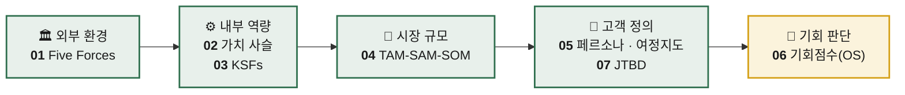

<div align="center">

# 📊 산업 및 비즈니스 분석 기초 프레임워크 학습

**시장을 읽고, 기회를 판별하고, 고객을 정의하는 7가지 분석 도구**


</div>

---

## 📌 개요

이 저장소는 **산업 구조 → 내부 역량 → 시장 → 고객 → 기회 우선순위** 로 이어지는
비즈니스 분석의 기초 프레임워크를 순서대로 학습하고 정리하는 공간입니다.

각 챕터는 *"무엇을 묻는 도구인가"* 를 중심으로 정리하며,
개념 이해에 그치지 않고 **실제 사례에 적용해보는 것**을 목표로 합니다.

---

## 🧭 학습 흐름



> 앞선 챕터의 결론이 다음 챕터의 입력값이 되는 구조입니다.
> 산업의 매력도를 판단한 뒤 우리의 역량을 점검하고, 시장을 재단한 다음 고객을 구체화하여, 최종적으로 **어디에 먼저 투자할지**를 결정합니다.

---

## 📚 챕터 구성

| # | 챕터 | 분석 축 | 핵심 질문 |
|:--:|---|---|---|
| **01** | Porter's Five Forces 모델 | 산업 구조 | 이 산업은 애초에 돈을 벌 수 있는 구조인가? |
| **02** | 기업 내부 활동의 가치 사슬 분석 | 내부 활동 | 우리 가치는 어느 활동 단계에서 만들어지는가? |
| **03** | 핵심 성공 요인 (KSFs) 분석 | 경쟁 우위 | 이 시장에서 반드시 잘해야 하는 것은 무엇인가? |
| **04** | TAM-SAM-SOM 과 Market Segment Map | 시장 규모 | 시장은 얼마나 크고, 우리가 먹을 수 있는 몫은 어디까지인가? |
| **05** | 페르소나, 페르소나 스펙트럼, 고객 여정지도 | 고객 정의 | 고객은 누구이며, 어떤 경로로 우리를 만나는가? |
| **06** | 시장기회 분석 : 기회점수(OS) 기반 우선순위 판단 | 기회 판단 | 여러 기회 중 무엇을 **먼저** 할 것인가? |
| **07** | 고객 상황을 객관화하는 JTBD 분석 | 고객 맥락 | 고객은 어떤 상황에서, 무엇을 해내려고 우리를 고용하는가? |

---

## 🔍 챕터별 상세

<details>
<summary><b>01 — Porter's Five Forces 모델</b></summary>

<br>

산업의 수익성을 결정하는 **5가지 경쟁 압력**으로 산업 매력도를 진단합니다.

- 기존 경쟁자 간의 경쟁 강도
- 신규 진입자의 위협
- 대체재의 위협
- 공급자의 교섭력
- 구매자의 교섭력

**산출물** · 산업 매력도 진단 + 구조적 리스크 지점

</details>

<details>
<summary><b>02 — 기업 내부 활동의 가치 사슬 분석</b></summary>

<br>

기업 활동을 **본원적 활동**과 **지원 활동**으로 분해해, 마진이 실제로 발생하는 지점을 찾습니다.

- 본원적 활동 · 물류 → 운영 → 출하 → 마케팅/영업 → 서비스
- 지원 활동 · 기업 인프라, 인적자원 관리, 기술 개발, 조달

**산출물** · 강점/병목 활동 식별 + 원가·차별화 레버 도출

</details>

<details>
<summary><b>03 — 핵심 성공 요인 (KSFs, Key Success Factors) 분석</b></summary>

<br>

해당 시장에서 **살아남기 위한 필수 조건**을 추려내고, 경쟁사 대비 우리의 충족도를 평가합니다.

**산출물** · KSF 목록 + 자사/경쟁사 역량 비교표

</details>

<details>
<summary><b>04 — TAM-SAM-SOM 과 Market Segment Map</b></summary>

<br>

시장을 세 겹으로 재단하고, 세그먼트 지도 위에 공략 지점을 표시합니다.

| 구분 | 의미 |
|---|---|
| **TAM** | Total Addressable Market — 전체 시장 |
| **SAM** | Serviceable Available Market — 유효 시장 |
| **SOM** | Serviceable Obtainable Market — 수익 시장 |

**산출물** · 시장 규모 추정 + 세그먼트 맵 + 진입 지점

</details>

<details>
<summary><b>05 — 페르소나, 페르소나 스펙트럼, 고객 여정지도</b></summary>

<br>

고객을 **구체적 인물**로 세우고, 그 인물이 겪는 경험의 흐름을 시간축 위에 펼칩니다.

- **페르소나** · 대표 고객상의 구체화
- **페르소나 스펙트럼** · 단일 상(像)이 아닌 **범위**로 바라보기 (상황적·일시적·영구적 제약 포함)
- **고객 여정지도** · 인지 → 탐색 → 구매 → 사용 → 재구매 단계별 접점과 감정 곡선

**산출물** · 페르소나 카드 + 여정지도 + Pain Point 목록

</details>

<details>
<summary><b>06 — 시장기회 분석 : 기회점수(OS) 기반 우선순위 판단</b></summary>

<br>

**중요도**와 **만족도**를 분리해 측정하고, 그 격차를 점수화해 기회를 줄 세웁니다.

```
Opportunity Score = 중요도 + max(중요도 − 만족도, 0)
```

> 💡 중요도는 높은데 만족도가 낮은 영역 = **미충족 니즈** = 가장 큰 기회

**산출물** · 기회점수 랭킹 + 우선순위 실행 순서

</details>

<details>
<summary><b>07 — 고객 상황을 객관화하는 JTBD (Jobs-To-Be-Done) 분석</b></summary>

<br>

"고객이 누구인가"가 아니라 **"고객이 어떤 상황에서 무엇을 해내려 하는가"** 로 관점을 전환합니다.

- **Job Statement** · 동사 + 목적어 + 맥락
- **Job Story** · `~한 상황일 때(When), ~하고 싶다(I want to), 그래서 ~할 수 있도록(So I can)`
- 기능적 · 감정적 · 사회적 Job의 구분

**산출물** · Job Map + Job Story 목록 + 경쟁 대상 재정의

</details>

---

## ✅ 진행 현황

- [x] **01 — Porter's Five Forces 모델** · [방법론](./01-porters-five-forces/methodology.md) · [분석 ① 숙박 공유](./01-porters-five-forces/analysis-01-accommodation-sharing.md) · [분석 ② 새벽배송](./01-porters-five-forces/analysis-02-dawn-delivery-ecommerce.md) · [비교](./01-porters-five-forces/comparison.md)
- [x] **02 — 기업 내부 활동의 가치 사슬 분석** · [방법론](./02-value-chain/methodology.md) · [분석 ① 숙박 공유](./02-value-chain/analysis-01-accommodation-sharing.md) · [분석 ② 새벽배송](./02-value-chain/analysis-02-dawn-delivery-ecommerce.md) · [비교](./02-value-chain/comparison.md)
- [x] **03 — 핵심 성공 요인(KSFs) 분석** · [분석 ① 숙박 공유](./03-key-success-factors/analysis-01-accommodation-sharing.md) · [분석 ② 새벽배송](./03-key-success-factors/analysis-02-dawn-delivery-ecommerce.md)
- [ ] 04 — TAM-SAM-SOM 과 Market Segment Map
- [ ] 05 — 페르소나, 페르소나 스펙트럼, 고객 여정지도
- [ ] 06 — 시장기회 분석 : 기회점수(OS) 기반 우선순위 판단
- [ ] 07 — 고객 상황을 객관화하는 JTBD 분석

---

## 📂 저장소 구조

```
business-research-practice-2026-sesac/
├── README.md
├── .gitignore
├── 프로젝트에서-작업할-학습챕터.png    # 학습 챕터 원본 목록
├── 01-porters-five-forces/
│   ├── methodology.md                         # 분석 방법론 (기준 프레임)
│   ├── analysis-01-accommodation-sharing.md   # 분석 ① 숙박 공유 플랫폼
│   ├── analysis-02-dawn-delivery-ecommerce.md # 분석 ② 신선식품 새벽배송
│   └── comparison.md                          # ① ↔ ② 비교 분석
├── 02-value-chain/
│   ├── methodology.md                         # 분석 방법론 (9개 활동 질문표 + 산출물 규격)
│   ├── analysis-01-accommodation-sharing.md   # 분석 ① 숙박 공유 플랫폼
│   ├── analysis-02-dawn-delivery-ecommerce.md # 분석 ② 신선식품 새벽배송
│   └── comparison.md                          # ① ↔ ② 비교 분석
└── 03-key-success-factors/
    ├── analysis-01-accommodation-sharing.md   # 신규 진입자 Top 5 KSF ①
    └── analysis-02-dawn-delivery-ecommerce.md # 신규 진입자 Top 5 KSF ②
```

> 💡 **동일한 두 시장**(숙박 공유 · 새벽배송)을 챕터마다 반복 분석해, 프레임워크가 바뀔 때 **같은 대상이 어떻게 다르게 보이는지**를 축적합니다.

---

<div align="center">
<sub>📖 학습 목표 · <b>개념 암기가 아니라, 실제 케이스에 적용해 판단을 내리는 것</b></sub>
</div>
